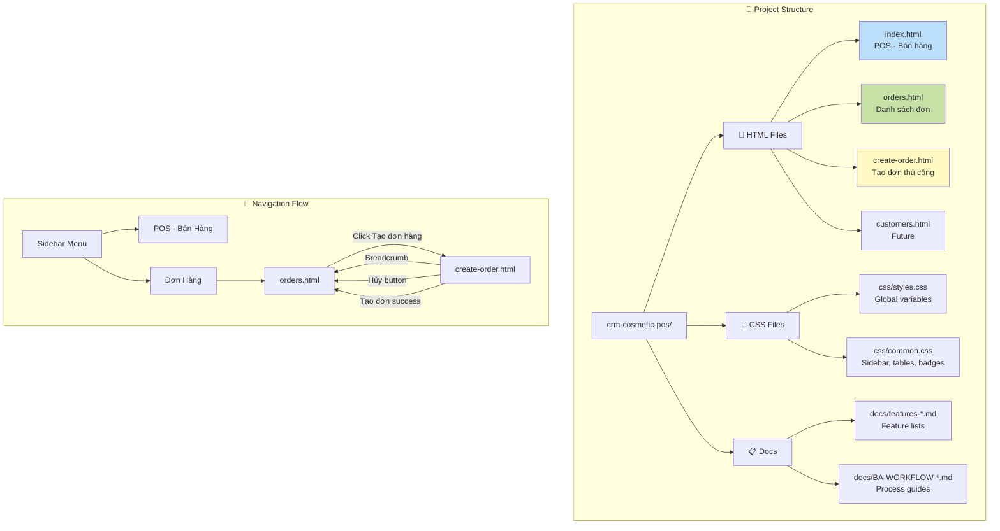
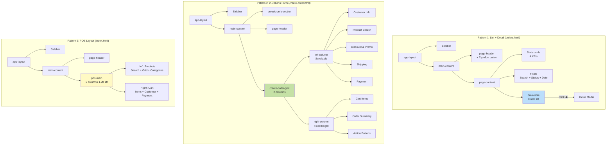
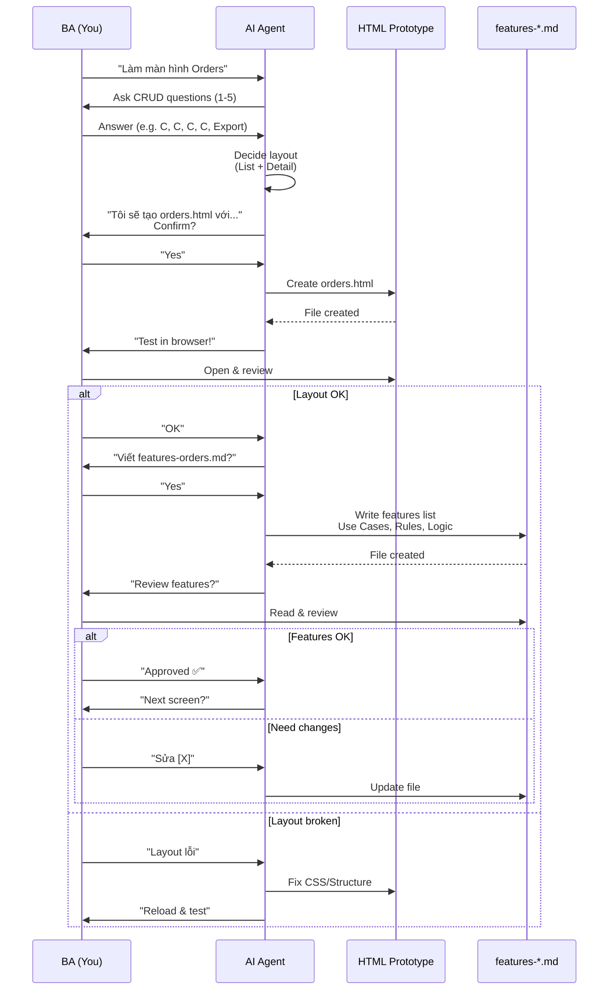
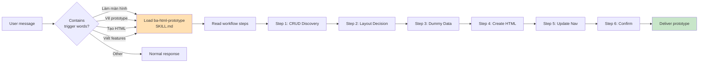
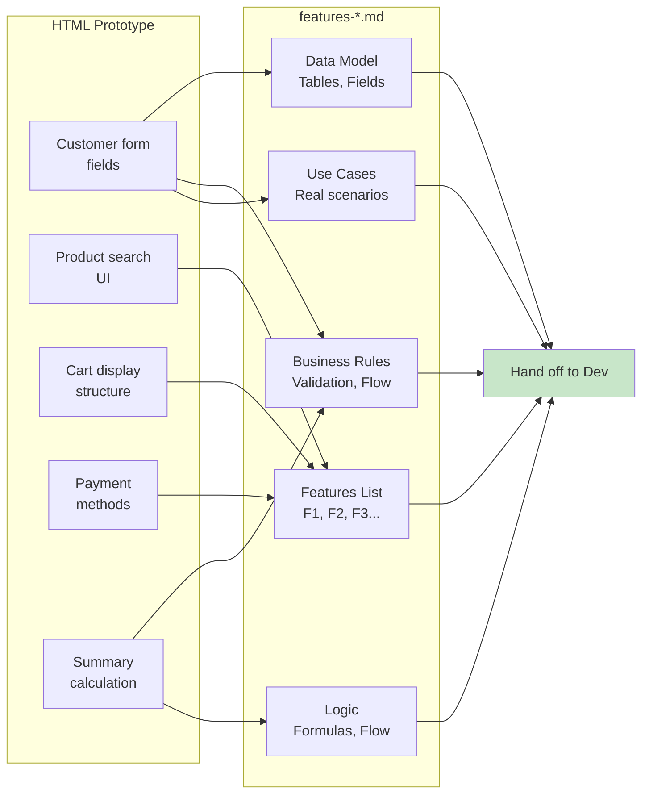

# CRM Cosmetic POS - BA Workflow Visualization

## 1. Overall BA Workflow

```mermaid
graph TB
    Start([BA nhận yêu cầu:<br/>Làm màn hình X]) --> CheckCRUD[CRUD Scope Discovery<br/>5 câu hỏi bắt buộc]
    
    CheckCRUD --> Q1[1. CREATE?<br/>A/B/C]
    Q1 --> Q2[2. READ?<br/>A/B/C]
    Q2 --> Q3[3. UPDATE?<br/>A/B/C]
    Q3 --> Q4[4. DELETE?<br/>A/B/C]
    Q4 --> Q5[5. SPECIAL ACTIONS?<br/>List them]
    
    Q5 --> Layout{Quyết định Layout}
    
    Layout -->|List + Detail| SingleCol[Single Column<br/>Table + Modal]
    Layout -->|Create Form<br/>Simple| SingleForm[Single Column<br/>Form]
    Layout -->|Create Form<br/>Complex| TwoCol[2 Columns<br/>Left: Forms<br/>Right: Cart/Summary]
    
    SingleCol --> DummyData[Tạo Dummy Data<br/>Vietnamese realistic]
    SingleForm --> DummyData
    TwoCol --> DummyData
    
    DummyData --> Confirm{BA Approve<br/>Outline?}
    Confirm -->|No| Layout
    Confirm -->|Yes| CreateHTML[Tạo HTML Prototype]
    
    CreateHTML --> UpdateNav[Update Navigation<br/>Sidebar + Breadcrumb]
    UpdateNav --> Test[Test in Browser]
    
    Test --> TestOK{Layout OK?}
    TestOK -->|No| Fix[Fix CSS/Structure]
    Fix --> Test
    TestOK -->|Yes| WriteFeatures[Viết features-[X].md]
    
    WriteFeatures --> Review{BA Review<br/>Features?}
    Review -->|Need changes| WriteFeatures
    Review -->|Approved| NextScreen{Làm màn hình<br/>tiếp theo?}
    
    NextScreen -->|Yes| Start
    NextScreen -->|No| Done([Hoàn thành])
    
    style Start fill:#e3f2fd
    style Done fill:#c8e6c9
    style CheckCRUD fill:#fff3e0
    style Confirm fill:#ffe0b2
    style TestOK fill:#ffe0b2
    style Review fill:#ffe0b2
```

## 2. CRUD Decision Tree

```mermaid
graph LR
    Screen[Màn hình mới] --> Create{CREATE?}
    
    Create -->|Yes - Form riêng| CreatePage[Tạo create-[x].html<br/>2-column layout]
    Create -->|Yes - Modal| CreateModal[Add modal vào list screen]
    Create -->|No| ReadOnly[Read-only screen]
    
    CreatePage --> Read{READ?}
    CreateModal --> Read
    ReadOnly --> Read
    
    Read -->|List only| ListScreen[Table view<br/>+ Filters]
    Read -->|Detail only| DetailScreen[Detail page/<br/>Modal]
    Read -->|Both| ListDetail[Table + Detail<br/>Modal popup]
    
    ListScreen --> Update{UPDATE?}
    DetailScreen --> Update
    ListDetail --> Update
    
    Update -->|Full edit| EditForm[Edit form/<br/>modal]
    Update -->|Partial| InlineEdit[Inline editing<br/>cells]
    Update -->|No| NoEdit[View only]
    
    EditForm --> Delete{DELETE?}
    InlineEdit --> Delete
    NoEdit --> Delete
    
    Delete -->|Hard delete| ConfirmDel[Confirm dialog<br/>+ Delete API]
    Delete -->|Soft delete| SoftDel[Status = inactive]
    Delete -->|No| NoDelete[No delete action]
    
    style CreatePage fill:#bbdefb
    style ListDetail fill:#c5e1a5
    style EditForm fill:#fff9c4
    style ConfirmDel fill:#ffccbc
```

## 3. File Structure & Flow



## 4. Screen Layout Patterns



## 5. Feature Writing Process



## 6. Agent Skill Trigger



## 7. Data Flow: From Prototype to Features Doc



## Summary

This workflow ensures:
- ✅ **Completeness**: CRUD checklist catches missing features
- ✅ **Consistency**: All screens follow same patterns
- ✅ **Speed**: Reusable templates & CSS
- ✅ **Quality**: Realistic dummy data & real use cases
- ✅ **Traceability**: HTML → Features doc → Dev handoff

**Current Status:** 3 screens completed (POS, Orders List, Create Order)
