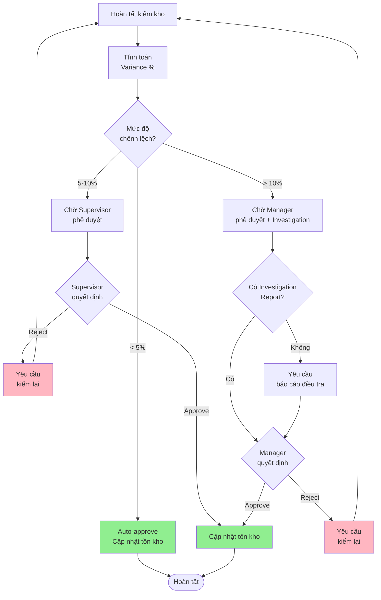
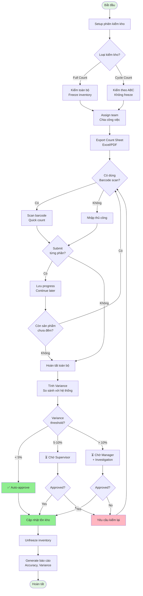

# Tài Liệu Yêu Cầu Chức Năng: Quản Lý Kho

## 📋 Thông Tin Tài Liệu

- **Hệ thống**: CRM Omnichannel cho Cosmetic Retailer
- **Module**: Inventory Management (Quản Lý Kho)
- **Phiên bản**: 1.0
- **Ngày tạo**: 12/04/2024
- **Người tạo**: Business Analyst

---

## 📑 Table of Contents

1. [TỔNG QUAN](#1-tổng-quan)
2. [TÍNH NĂNG 1: TỔNG QUAN TỒN KHO](#2-tính-năng-1-tổng-quan-tồn-kho)
3. [TÍNH NĂNG 2: NHẬP KHO](#3-tính-năng-2-nhập-kho-stock-in)
4. [TÍNH NĂNG 3: XUẤT KHO](#4-tính-năng-3-xuất-kho-stock-out)
5. [**TÍNH NĂNG 4: CHUYỂN KHO GIỮA CHI NHÁNH**](#5-tính-năng-4-chuyển-kho-giữa-chi-nhánh) 📊 **[Has Diagram]**
6. [**TÍNH NĂNG 5: KIỂM KHO ĐỊNH KỲ**](#6-tính-năng-5-kiểm-kho-định-kỳ) 📊 **[Has 2 Diagrams]**
   - [Enhanced Features](#626-enhanced-features) (7 features)
   - [Process Flow Diagram](#63-stock-take-process-flow-enhanced)
7. [TÍNH NĂNG 6: QUẢN LÝ BATCH/LOT VÀ HẠN SỬ DỤNG](#7-tính-năng-6-quản-lý-batchlot-và-hạn-sử-dụng)
8. [TÍNH NĂNG 7: ĐIỀU CHỈNH TỒN KHO](#8-tính-năng-7-điều-chỉnh-tồn-kho)
9. [BÁO CÁO](#9-báo-cáo)
10. [ROLES & PERMISSIONS](#10-roles--permissions)
11. [BUSINESS RULES TỔNG HỢP](#11-business-rules-tổng-hợp)
12. [TÍCH HỢP VỚI MODULE KHÁC](#12-tích-hợp-với-module-khác)
13. [API ENDPOINTS](#13-api-endpoints-reference)
14. [USE CASES](#14-use-cases)
15. [MOCKUP/WIREFRAME REFERENCE](#15-mockupwireframe-reference)
16. [PHỤ LỤC](#16-phụ-lục)

**Quick Links to Diagrams**:
- 📊 [Stock Transfer Process Flow](#525-process-flow-diagram)
- 📊 [Approval Workflow](#a-variance-threshold--approval-workflow)
- 📊 [Stock Take Enhanced Process](#63-stock-take-process-flow-enhanced)

---

## 1. TỔNG QUAN

### 1.1 Mục Đích
Module Quản Lý Kho cho phép doanh nghiệp theo dõi, quản lý và điều phối tồn kho sản phẩm mỹ phẩm trên nhiều chi nhánh, đảm bảo:
- Kiểm soát chính xác số lượng tồn kho
- Cảnh báo kịp thời về tồn kho thấp và hạn sử dụng
- Tối ưu hóa luân chuyển hàng giữa các chi nhánh
- Đảm bảo chất lượng sản phẩm (không bán hàng hết hạn)

### 1.2 Phạm Vi
Module này bao gồm các chức năng:
1. Quản lý tồn kho (Inventory Overview)
2. Nhập/Xuất kho (Stock In/Out)
3. Chuyển kho giữa chi nhánh (Stock Transfer)
4. Kiểm kho định kỳ (Stock Take)
5. Quản lý Batch/Lot và Hạn sử dụng (Expiry Management)
6. Điều chỉnh tồn kho (Stock Adjustment)

### 1.3 Người Dùng
- **Warehouse Manager**: Quản lý kho toàn bộ hệ thống
- **Branch Manager**: Quản lý kho chi nhánh
- **Warehouse Staff**: Nhân viên kho thực hiện nhập/xuất
- **Store Staff**: Nhân viên bán hàng (xem tồn kho)

---

## 2. TÍNH NĂNG 1: TỔNG QUAN TỒN KHO

### 2.1 Mô Tả
Màn hình tổng quan hiển thị tình trạng tồn kho toàn hệ thống hoặc theo chi nhánh.

### 2.2 Yêu Cầu Chức Năng

#### 2.2.1 Dashboard Stats
**Mô tả**: Hiển thị các chỉ số tổng quan

**Dữ liệu hiển thị**:
- Tổng sản phẩm trong kho
- Số sản phẩm cảnh báo tồn kho thấp
- Số sản phẩm hết hàng
- Tổng giá trị kho (theo giá nhập)

**Business Rules**:
- Tồn kho thấp: Số lượng < ngưỡng cảnh báo đã cấu hình
- Hết hàng: Tồn kho = 0
- Giá trị kho = Σ(Số lượng × Giá nhập)

#### 2.2.2 Bảng Tồn Kho Chi Tiết
**Mô tả**: Bảng hiển thị danh sách sản phẩm và tồn kho theo chi nhánh

**Thông tin hiển thị**:
- Sản phẩm (Ảnh, Tên, SKU)
- Danh mục
- Tồn kho từng chi nhánh
- Tổng tồn kho
- Trạng thái (Cao/Trung bình/Thấp/Hết)

**Phân loại trạng thái**:
- **Tồn kho cao**: > 50% capacity hoặc > 100 sản phẩm
- **Tồn kho trung bình**: 20-50% capacity hoặc 20-100 sản phẩm
- **Tồn kho thấp**: < ngưỡng cảnh báo
- **Hết hàng**: = 0

#### 2.2.3 Filter & Search
**Chức năng lọc**:
- Theo chi nhánh
- Theo trạng thái tồn kho
- Theo danh mục sản phẩm
- Tìm kiếm theo tên/SKU

#### 2.2.4 Alert Box
**Mô tả**: Hiển thị cảnh báo tồn kho thấp

**Điều kiện hiển thị**:
- Tồn kho < ngưỡng cảnh báo
- Sắp xếp theo mức độ khẩn cấp (chi nhánh nào thấp nhất)

---

## 3. TÍNH NĂNG 2: NHẬP KHO (STOCK IN)

### 3.1 Mô Tả
Ghi nhận hàng hóa nhập vào kho từ nhà cung cấp hoặc nguồn khác.

### 3.2 Use Cases
1. **UC-IN-01**: Nhập hàng từ nhà cung cấp (100 chai Serum từ NCC)
2. **UC-IN-02**: Nhập hàng trả lại từ khách (2 chai Foundation - sai màu)
3. **UC-IN-03**: Nhập hàng chuyển đổi/tặng (quà khuyến mãi)

### 3.3 Yêu Cầu Chức Năng

#### 3.3.1 Form Nhập Kho
**Input Fields**:
- **Sản phẩm** (Required): Dropdown chọn sản phẩm
- **Chi nhánh** (Required): Chi nhánh nhập hàng
- **Số lượng nhập** (Required): > 0
- **Giá nhập**: Giá mua từ NCC
- **Nhà cung cấp**: Tên NCC
- **Ghi chú**: Mô tả lô hàng

#### 3.3.2 Business Rules
1. **Validation**:
   - Số lượng > 0
   - Giá nhập >= 0 (có thể = 0 nếu quà tặng)

2. **Process Flow**:
   ```
   User nhập thông tin → Validate → Confirm
   → Cập nhật tồn kho (+)
   → Ghi log lịch sử
   → Notification thành công
   ```

3. **Cập nhật dữ liệu**:
   - Tăng tồn kho chi nhánh tương ứng
   - Ghi nhận giá nhập (để tính COGS)
   - Lưu thông tin NCC

#### 3.3.3 Lịch Sử
Mỗi giao dịch nhập kho ghi nhận:
- Mã giao dịch (auto-generated)
- Sản phẩm, chi nhánh
- Số lượng, giá nhập
- Người thực hiện, thời gian
- Nguồn (NCC, chuyển kho, điều chỉnh)

---

## 4. TÍNH NĂNG 3: XUẤT KHO (STOCK OUT)

### 4.1 Mô Tả
Ghi nhận hàng hóa xuất khỏi kho.

### 4.2 Use Cases
1. **UC-OUT-01**: Xuất kho bán lẻ (3 son MAC cho khách walk-in)
2. **UC-OUT-02**: Xuất hàng hư hỏng (1 chai kem bị vỡ)
3. **UC-OUT-03**: Xuất trả NCC (hàng lỗi)

### 4.3 Yêu Cầu Chức Năng

#### 4.3.1 Form Xuất Kho
**Input Fields**:
- **Sản phẩm** (Required)
- **Chi nhánh** (Required)
- **Số lượng xuất** (Required): > 0
- **Lý do xuất** (Required): Dropdown
  - Bán lẻ
  - Bán sỉ
  - Hàng hư hỏng
  - Chuyển kho
  - Trả nhà cung cấp
- **Ghi chú**

#### 4.3.2 Business Rules
1. **Validation**:
   - Số lượng > 0
   - Số lượng <= Tồn kho hiện tại
   - Nếu xuất > tồn kho → Error: "Không đủ hàng trong kho"

2. **Process Flow**:
   ```
   User nhập thông tin → Validate tồn kho → Confirm
   → Cập nhật tồn kho (-)
   → Ghi log lịch sử
   → Notification thành công
   ```

3. **Cập nhật dữ liệu**:
   - Giảm tồn kho chi nhánh
   - Ghi nhận lý do xuất (cho báo cáo)

#### 4.3.3 Special Cases
- **Bán lẻ/sỉ**: Link với Order ID (nếu từ đơn hàng)
- **Hàng hư hỏng**: Ghi nhận loss inventory
- **Chuyển kho**: Tạo phiếu chuyển kho (Stock Transfer)

---

## 5. TÍNH NĂNG 4: CHUYỂN KHO GIỮA CHI NHÁNH

### 5.1 Mô Tả
Điều chuyển sản phẩm từ chi nhánh này sang chi nhánh khác.

### 5.2 Use Cases
1. **UC-TRF-01**: Chuyển kho thành công (20 Foundation Q3→Q1)
2. **UC-TRF-02**: Manager từ chối phiếu (không đủ hàng)
3. **UC-TRF-03**: Hủy giữa chừng (người giao gặp sự cố)
4. **UC-TRF-04**: Nhận hàng sai lệch (18/20 chai - 2 chai vỡ)

### 5.3 Process Flow Diagram

```mermaid
flowchart TD
    Start([Bắt đầu]) --> Create[Branch Manager A<br/>Tạo phiếu chuyển kho]
    Create --> Draft{Lưu nháp?}
    
    Draft -->|Có| SaveDraft[Trạng thái: Draft<br/>Lưu để chỉnh sửa sau]
    Draft -->|Không| Submit[Submit phiếu<br/>Trạng thái: Pending]
    
    SaveDraft --> EditLater[Có thể edit sau]
    EditLater --> Submit
    
    Submit --> CheckStock{Kiểm tra<br/>tồn kho nguồn}
    CheckStock -->|Không đủ hàng| Reject1[Từ chối<br/>Thông báo lỗi]
    CheckStock -->|Đủ hàng| WaitApproval[Chờ phê duyệt<br/>Notify Manager]
    
    Reject1 --> End1([Kết thúc])
    
    WaitApproval --> Review[Warehouse Manager<br/>Review phiếu]
    Review --> Approve{Phê duyệt?}
    
    Approve -->|Từ chối| Cancel1[Trạng thái: Cancelled<br/>Ghi rõ lý do]
    Approve -->|Chấp nhận| InTransit[Trạng thái: In Transit<br/>Trừ tồn kho chi nhánh A]
    
    Cancel1 --> End2([Kết thúc])
    
    InTransit --> NotifyShipper[Thông báo người giao<br/>& Chi nhánh B]
    NotifyShipper --> Shipping[Vận chuyển hàng<br/>từ A → B]
    
    Shipping --> CanCancel{Có hủy<br/>giữa chừng?}
    CanCancel -->|Có| CancelMid[Cancel phiếu<br/>Hoàn tồn kho A]
    CanCancel -->|Không| Receive[Chi nhánh B<br/>Nhận hàng]
    
    CancelMid --> End3([Kết thúc])
    
    Receive --> Inspect[Kiểm tra số lượng<br/>& chất lượng]
    Inspect --> Match{Khớp với<br/>phiếu?}
    
    Match -->|Không khớp| Report[Báo cáo sai lệch<br/>Tạo dispute]
    Match -->|Khớp| Confirm[Branch Manager B<br/>Xác nhận nhận hàng]
    
    Report --> Resolve[Xử lý sai lệch<br/>Điều chỉnh nếu cần]
    Resolve --> Confirm
    
    Confirm --> Complete[Trạng thái: Completed<br/>Cộng tồn kho chi nhánh B]
    Complete --> UpdateLog[Cập nhật lịch sử<br/>Ghi log chi tiết]
    UpdateLog --> NotifyComplete[Thông báo<br/>các bên liên quan]
    NotifyComplete --> End4([Kết thúc])
    
    style Start fill:#e1f5e1
    style End1 fill:#ffe1e1
    style End2 fill:#ffe1e1
    style End3 fill:#ffe1e1
    style End4 fill:#e1f5e1
    style Complete fill:#90EE90
    style InTransit fill:#FFD700
    style Cancel1 fill:#FFB6C1
    style CancelMid fill:#FFB6C1
```



**Giải thích diagram**:
- 🟢 **Xanh lá**: Bắt đầu và kết thúc thành công
- 🟡 **Vàng**: Đang xử lý (In Transit)
- 🔴 **Đỏ**: Hủy bỏ hoặc kết thúc không thành công

**Các nhánh chính**:
1. **Happy Path**: Create → Submit → Approve → In Transit → Receive → Complete
2. **Draft Path**: Create → Save Draft → Edit → Submit
3. **Rejection Paths**: Không đủ hàng / Manager từ chối / Hủy giữa chừng
4. **Dispute Path**: Nhận hàng sai lệch → Resolve → Complete

---

### 5.4 Yêu Cầu Chức Năng

#### 5.4.1 Tạo Phiếu Chuyển Kho
**Input Fields**:
- **Sản phẩm** (Required)
- **Từ chi nhánh** (Required)
- **Đến chi nhánh** (Required)
- **Số lượng** (Required): > 0
- **Người giao hàng** (Required)
- **Dự kiến nhận**: Date/Time
- **Lý do chuyển kho**: Text

#### 5.4.2 Business Rules
1. **Validation**:
   - Từ chi nhánh ≠ Đến chi nhánh
   - Số lượng > 0
   - Số lượng <= Tồn kho chi nhánh nguồn
   - Người giao hàng: Bắt buộc nhập

2. **Status Flow**:
   ```
   Draft (Nháp)
   ↓
   Pending (Chờ phê duyệt) → Cancelled (Đã hủy)
   ↓
   In Transit (Đang chuyển)
   ↓
   Completed (Đã nhận)
   ```

3. **Process Flow**:
   ```
   Tạo phiếu (Draft/Pending)
   ↓ (Manager phê duyệt)
   In Transit: Trừ tồn kho chi nhánh nguồn
   ↓ (Chi nhánh đích xác nhận)
   Completed: Cộng tồn kho chi nhánh đích
   ```

#### 5.4.3 Quản Lý Phiếu Chuyển
**Danh sách hiển thị**:
- Mã phiếu (TF-YYYY-XXX)
- Sản phẩm
- Từ → Đến
- Số lượng
- Ngày tạo
- Người giao
- Trạng thái

**Actions**:
- **Xem chi tiết**: View thông tin đầy đủ
- **Phê duyệt**: Manager approve (Pending → In Transit)
- **Xác nhận nhận**: Chi nhánh đích confirm (In Transit → Completed)
- **Hủy**: Cancel phiếu (chỉ khi Pending/In Transit)
- **In phiếu**: Print PDF

#### 5.4.4 Notifications
- Tạo phiếu → Notify Manager chi nhánh nguồn
- Phê duyệt → Notify người giao & chi nhánh đích
- Xác nhận nhận → Notify Manager chi nhánh nguồn

---

## 6. TÍNH NĂNG 5: KIỂM KHO ĐỊNH KỲ

### 6.1 Mô Tả
Đối chiếu số liệu tồn kho trên hệ thống với thực tế tại kho.

### 6.2 Use Cases
1. **UC-STK-01**: Full Count cuối tháng (toàn bộ sản phẩm Q1)
2. **UC-STK-02**: Cycle Count tuần (30 SKU category A)
3. **UC-STK-03**: Team Assignment (3 teams parallel, 500 SKU)
4. **UC-STK-04**: Barcode Scanning (quick count mode)
5. **UC-STK-05**: Variance > 10% (cần Investigation Report)

### 6.3 Process Flow Diagram (Enhanced)

```mermaid
flowchart TD
    Start([Bắt đầu]) --> Setup[Manager tạo<br/>phiên kiểm kho]
    
    Setup --> SelectType{Chọn loại<br/>kiểm kho}
    
    SelectType -->|Full Count| FullCount[Kiểm toàn bộ<br/>End-of-month]
    SelectType -->|Cycle Count| CycleCount[Kiểm tuần hoàn<br/>ABC Classification]
    
    FullCount --> FreezeOption{Enable<br/>Freeze Inventory?}
    CycleCount --> NoFreeze[Không freeze<br/>Continuous operation]
    
    FreezeOption -->|Hard Freeze| HardFreeze[🔒 Block tất cả<br/>nhập/xuất]
    FreezeOption -->|Soft Freeze| SoftFreeze[🔔 Warning khi<br/>nhập/xuất]
    FreezeOption -->|No Freeze| NoFreeze
    
    HardFreeze --> TeamSetup
    SoftFreeze --> TeamSetup
    NoFreeze --> TeamSetup[👥 Team Assignment]
    
    TeamSetup --> AssignTeams[Assign tasks:<br/>Team A: Kệ A1-A10<br/>Team B: Kệ B1-B10]
    
    AssignTeams --> ExportSheet[📄 Export Count Sheet<br/>Excel/PDF]
    
    ExportSheet --> CountMode{Phương pháp đếm?}
    
    CountMode -->|Barcode Scan| BarcodeScan[📷 Scan barcode<br/>Quick count mode]
    CountMode -->|Manual| ManualEntry[Nhập thủ công]
    CountMode -->|Import| ImportFile[Upload Excel]
    
    BarcodeScan --> ScanLoop[Scan → Beep! +1<br/>Realtime update]
    ManualEntry --> EnterData[Nhập số lượng]
    ImportFile --> ValidateImport[Validate data]
    
    ScanLoop --> TeamProgress
    EnterData --> TeamProgress
    ValidateImport --> TeamProgress[📊 Track progress<br/>mỗi team]
    
    TeamProgress --> PartialSubmit{Partial<br/>Submission?}
    
    PartialSubmit -->|Yes| SubmitBatch[Submit Batch<br/>Save progress]
    PartialSubmit -->|No| ContinueCount{Đếm xong<br/>chưa?}
    
    SubmitBatch --> UpdateProgress[Update:<br/>Team A: 50/50 ✅<br/>Team B: 27/45 ⏳]
    
    UpdateProgress --> ContinueCount
    
    ContinueCount -->|Chưa| CountMode
    ContinueCount -->|Rồi| AllDone[100% completed]
    
    AllDone --> AggregateData[Aggregate dữ liệu<br/>từ tất cả teams]
    
    AggregateData --> CalcVariance[Tính Variance<br/>cho từng sản phẩm]
    
    CalcVariance --> CheckThreshold{Variance<br/>Threshold?}
    
    CheckThreshold -->|< 5%| AutoApprove[✅ Auto-approve<br/>Cập nhật ngay]
    CheckThreshold -->|5-10%| SupervisorQueue[⏳ Chờ Supervisor<br/>approve]
    CheckThreshold -->|> 10%| ManagerQueue[🚨 Chờ Manager<br/>+ Investigation Report]
    
    SupervisorQueue --> SupervisorReview{Supervisor<br/>decision}
    ManagerQueue --> CheckReport{Có Investigation<br/>Report?}
    
    CheckReport -->|Không| RequestReport[Yêu cầu điền<br/>Investigation Report]
    CheckReport -->|Có| ManagerReview{Manager<br/>decision}
    
    RequestReport --> ManagerReview
    
    SupervisorReview -->|Approve| UpdateInventory
    SupervisorReview -->|Reject| DoubleCount[Yêu cầu<br/>Double Count]
    
    ManagerReview -->|Approve| UpdateInventory[Cập nhật tồn kho<br/>= Số thực tế]
    ManagerReview -->|Reject| DoubleCount
    
    DoubleCount --> AssignOther[Assign người khác<br/>kiểm lại]
    AssignOther --> CountMode
    
    AutoApprove --> UpdateInventory
    
    UpdateInventory --> UnfreezeCheck{Có freeze<br/>inventory?}
    
    UnfreezeCheck -->|Yes| Unfreeze[🔓 Unfreeze inventory<br/>Resume operations]
    UnfreezeCheck -->|No| GenerateReport
    
    Unfreeze --> GenerateReport[Generate Report:<br/>✅ Accuracy Rate<br/>📊 Variance by product<br/>💰 Dollar Value impact<br/>👥 Team performance]
    
    GenerateReport --> NotifyAll[📧 Notify:<br/>• Teams<br/>• Supervisor<br/>• Manager<br/>• Accounting]
    
    NotifyAll --> End([Hoàn tất])
    
    style Start fill:#e1f5e1
    style End fill:#e1f5e1
    style AutoApprove fill:#90EE90
    style UpdateInventory fill:#90EE90
    style DoubleCount fill:#FFB6C1
    style HardFreeze fill:#FFD700
    style BarcodeScan fill:#87CEEB
    style SubmitBatch fill:#FFE4B5
```



**Diagram highlights**:
- 🟢 **Full/Cycle Count options** ở đầu
- 🔒 **Freeze Inventory** (3 modes)
- 👥 **Team Assignment** (parallel work)
- 📷 **Barcode Scanning** (quick mode)
- 💾 **Partial Submission** (save & resume)
- ⚖️ **3-tier Approval** (< 5%, 5-10%, > 10%)
- 🔄 **Double Count** path khi rejected

---

### 6.4 Yêu Cầu Chức Năng

#### 6.4.1 Tạo Phiên Kiểm Kho
**Input Fields**:
- **Tên phiên** (Required): VD: "Kiểm kho tháng 4/2024"
- **Chi nhánh** (Required): Chọn 1 hoặc tất cả
- **Ngày kiểm kho** (Required)
- **Người kiểm kho** (Required)
- **Phạm vi kiểm**: Dropdown
  - Toàn bộ sản phẩm
  - Theo danh mục
  - Theo thương hiệu
  - Sản phẩm có chênh lệch
  - Random sampling (10%, 20%...)

#### 6.4.2 Quy Trình Kiểm Kho
**Step 1: Chuẩn bị**
- Tạo phiên kiểm kho
- Hệ thống generate danh sách sản phẩm cần kiểm
- Xuất file Excel/PDF để in ra (optional)

**Step 2: Thực hiện kiểm**
- Nhân viên đếm thực tế
- Nhập số lượng thực tế vào hệ thống
- Hệ thống tự động tính chênh lệch (Variance)

**Step 3: Xác nhận**
- Review các chênh lệch
- Nhập lý do (nếu có chênh lệch lớn)
- **Lưu nháp**: Save để tiếp tục sau
- **Hoàn tất**: Cập nhật tồn kho = số thực tế

#### 6.4.3 Variance Calculation
```
Variance = Số thực tế - Số hệ thống

Nếu Variance > 0: Dư (thêm hàng không rõ nguồn)
Nếu Variance < 0: Thiếu (mất hàng)
Nếu Variance = 0: Chính xác
```

#### 6.4.4 Business Rules
1. **Trong quá trình kiểm kho**:
   - Khóa chức năng nhập/xuất cho sản phẩm đang kiểm (optional)
   - Hoặc: Cho phép nhập/xuất nhưng flag "Đang kiểm kho"

2. **Hoàn tất kiểm kho**:
   - Tự động tạo Stock Adjustment cho chênh lệch
   - Cập nhật tồn kho = số thực tế
   - Ghi log chi tiết

3. **Báo cáo**:
   - Tỷ lệ chính xác (Accuracy Rate)
   - Tổng chênh lệch (+ và -)
   - Giá trị chênh lệch (theo giá nhập)

#### 6.4.5 Lịch Sử Kiểm Kho
Lưu trữ tất cả phiên kiểm kho:
- Tên phiên, ngày, người kiểm
- Kết quả chi tiết từng sản phẩm
- Variance, Accuracy Rate

#### 6.4.6 Enhanced Features

##### **A. Variance Threshold & Approval Workflow**

**Mô tả**: Phê duyệt tự động dựa trên mức độ chênh lệch

**Business Rules**:
```
Chênh lệch < 5%:
  → Auto-approve
  → Cập nhật tồn kho ngay
  
Chênh lệch 5-10%:
  → Require Supervisor approval
  → Người kiểm phải nhập lý do
  
Chênh lệch > 10%:
  → Require Manager approval
  → Bắt buộc Investigation Report
  → Có thể require double count
```

**Approval Flow**:


**Notifications**:
- Chênh lệch 5-10% → Email Supervisor
- Chênh lệch > 10% → Email Manager + Alert
- Approved → Notify người kiểm kho
- Rejected → Notify người kiểm + assign người khác kiểm lại

---

##### **B. Freeze Inventory During Count**

**Mô tả**: Tạm khóa giao dịch kho khi đang kiểm

**Options**:
1. **Soft Freeze** (Recommended):
   - Cho phép nhập/xuất nhưng có warning
   - Flag "Đang kiểm kho" trên sản phẩm
   - Log tất cả transactions trong lúc kiểm
   - Review transactions sau khi hoàn tất

2. **Hard Freeze**:
   - Block hoàn toàn nhập/xuất
   - Chỉ cho phép emergency transactions (có Manager approval)
   - Suitable cho end-of-month full count

**Implementation**:
- Toggle "Freeze Mode" khi tạo phiên kiểm kho
- Hệ thống check freeze status trước mỗi transaction
- Auto-unfreeze sau khi complete hoặc timeout (24h)

**UI Indicators**:
- Badge "🔒 Đang kiểm kho" trên product list
- Warning popup khi cố nhập/xuất sản phẩm đang freeze
- Countdown timer: "Còn X giờ để hoàn tất kiểm kho"

---

##### **C. Count Sheet Generation (In phiếu kiểm)**

**Mô tả**: Xuất file Excel/PDF để nhân viên đếm offline

**Export Formats**:

**1. Excel Template**:
```
| STT | Barcode | SKU | Tên sản phẩm | Location | Tồn kho hệ thống | Thực tế | Chênh lệch | Ghi chú |
|-----|---------|-----|--------------|----------|------------------|---------|-----------|---------|
| 1   | 12345   | ... | Rouge Dior   | Kệ A1    | (blank/hidden)   |         |           |         |
```

**2. PDF với Barcode**:
- In mã vạch để scan
- QR code link về hệ thống
- Signature boxes cho người kiểm & người giám sát

**Options**:
- ☑️ Include system quantity (hoặc blind count)
- ☑️ Group by location/category
- ☑️ Sort by SKU/ABC classification
- ☑️ Include product images (nếu in PDF)

**Import Back**:
- Upload Excel đã điền
- Hệ thống validate & map data
- Highlight conflicts

---

##### **D. Cycle Count (Kiểm kho tuần hoàn)**

**Mô tả**: Kiểm kho định kỳ theo nhóm nhỏ thay vì kiểm toàn bộ

**ABC Classification**:
```
Class A (High value - 20% items, 80% value):
  → Count frequency: Monthly
  → Tất cả sản phẩm > 5 triệu/item

Class B (Medium - 30% items, 15% value):
  → Count frequency: Quarterly
  → Sản phẩm 1-5 triệu

Class C (Low value - 50% items, 5% value):
  → Count frequency: Semi-annually or Annually
  → Sản phẩm < 1 triệu
```

**Schedule Setup**:
- Set cycle: "Every 1st Monday of month"
- Auto-create stock take session
- Auto-assign team
- Email reminder 3 days before

**Benefits**:
- Không cần đóng cửa
- Spread workload
- Continuous accuracy improvement
- Early detection of issues

**Dashboard**:
- Next cycle count date
- Items due for count this week
- Overdue counts
- Cycle count compliance %

---

##### **E. Multi-person/Team Stock Take**

**Mô tả**: Chia công việc kiểm kho cho nhiều người

**Team Assignment**:
```
Team A - Nguyễn Văn A (Leader):
  → Kệ A1-A10 (50 sản phẩm)
  → Danh mục: Son môi, Son dưỡng
  
Team B - Trần Thị B (Leader):
  → Kệ B1-B10 (45 sản phẩm)
  → Danh mục: Serum, Kem dưỡng
  
Team C - Lê Văn C (Leader):
  → Kệ C1-C10 (40 sản phẩm)
  → Danh mục: Sunscreen, Toner
```

**Features**:
- Assign sản phẩm/location cho từng người
- Mỗi người có màn hình riêng với task list
- Real-time progress tracking
- Team Leader review trước khi submit

**Progress Dashboard**:
```
Team A: ████████░░ 80% (40/50 completed)
Team B: ██████░░░░ 60% (27/45 completed)
Team C: ██████████ 100% (40/40 completed)
```

**Conflict Resolution**:
- Nếu 2 người cùng đếm 1 sản phẩm → Warning
- Auto-lock item khi người này đang đếm
- Team Leader có quyền re-assign

---

##### **F. Partial Count Submission**

**Mô tả**: Submit từng phần thay vì chờ hoàn tất toàn bộ

**Workflow**:
```
Step 1: Tạo phiên kiểm kho (100 sản phẩm)
  ↓
Step 2: Kiểm xong Category A (30 sp) → Submit Part 1
  → Status: "Partially Completed (30/100)"
  ↓
Step 3: Kiểm xong Category B (40 sp) → Submit Part 2
  → Status: "Partially Completed (70/100)"
  ↓
Step 4: Kiểm xong Category C (30 sp) → Submit Part 3
  → Status: "Completed (100/100)"
  ↓
Manager Review & Approve toàn bộ
```

**Benefits**:
- Không mất data nếu chưa hoàn tất hết
- Có thể pause và resume
- Progress saved incrementally
- Multiple people submit different parts

**UI**:
- Progress bar: "70/100 items counted (70%)"
- Button: "Submit Current Progress"
- List: "Submitted batches: Batch 1 (30), Batch 2 (40)"

**Business Rules**:
- Mỗi sản phẩm chỉ được submit 1 lần
- Có thể edit submitted items trước khi Manager approve final
- Final approval chỉ khi 100% completed

---

##### **G. Barcode/QR Scanning Support**

**Mô tả**: Scan barcode để tăng tốc độ và độ chính xác

**Scanning Modes**:

**1. Quick Scan Mode**:
- Scan → Auto increment count
- Tiếp tục scan cùng sản phẩm → +1, +1, +1...
- Voice feedback: "Beep! Count: 5"

**2. Manual Entry Mode**:
- Scan → Hiện sản phẩm
- Nhập số lượng thủ công
- Confirm

**Hardware Support**:
- USB Barcode Scanner
- Mobile camera (QR code)
- Wireless Bluetooth scanner

**Features**:
- **Auto-focus**: Jump to scanned product
- **Duplicate detection**: Warning nếu scan 2 lần
- **Unknown barcode**: Alert và option để add
- **Batch scan**: Scan nhiều items cùng lúc

**UI Design**:
```
┌─────────────────────────────┐
│ 🔍 Scan Barcode             │
│ ┌─────────────────────────┐ │
│ │ 📷 Ready to scan...     │ │
│ └─────────────────────────┘ │
│                             │
│ Or enter manually:          │
│ [__________________] [Scan] │
│                             │
│ Last scanned:               │
│ 📦 Rouge Dior 999 (x5)      │
└─────────────────────────────┘
```

**Integration**:
- Link với Count Sheet (print barcode labels)
- Sync với Mobile App
- Offline mode: Cache scans, sync later

---

### 6.3 Stock Take Process Flow (Enhanced)



---

## 7. TÍNH NĂNG 6: QUẢN LÝ BATCH/LOT VÀ HẠN SỬ DỤNG

### 7.1 Mô Tả
Theo dõi lô hàng và hạn sử dụng sản phẩm mỹ phẩm.

### 7.2 Yêu Cầu Chức Năng

#### 7.2.1 Quản Lý Batch/Lot
**Mô tả**: Mỗi lần nhập hàng ghi nhận thông tin lô

**Input Fields**:
- **Mã lô** (Required): LOT-YYYY-XXX hoặc từ NCC
- **Sản phẩm** (Required)
- **Chi nhánh** (Required)
- **Số lượng** (Required)
- **Ngày sản xuất** (Required)
- **Hạn sử dụng** (Required)
- **Ghi chú**: Thông tin lô hàng

**Business Rules**:
1. Mã lô phải unique per sản phẩm
2. Hạn sử dụng > Ngày sản xuất
3. Một sản phẩm có thể có nhiều lô khác nhau

#### 7.2.2 Theo Dõi Hạn Sử Dụng
**Dashboard hiển thị**:
- Số lượng đã hết hạn
- Số lượng sắp hết hạn < 1 tháng
- Số lượng cảnh báo < 3 tháng
- Số lượng còn hạn tốt

**Phân loại trạng thái**:
- **🚨 Đã hết hạn**: Hạn SD < Hôm nay
- **⚠️ Sắp hết hạn (Critical)**: Hạn SD < 1 tháng
- **⏳ Cảnh báo (Warning)**: Hạn SD < 3 tháng
- **✅ Còn hạn tốt**: Hạn SD > 3 tháng

#### 7.2.3 Alert System
**Cảnh báo tự động**:
1. **Hết hạn**: 
   - Màu đỏ, priority cao
   - Action: Thanh lý ngay, không được bán

2. **< 1 tháng**:
   - Màu vàng, priority trung bình
   - Action: Giảm giá/khuyến mãi để bán hết

3. **< 3 tháng**:
   - Màu xanh nhạt, priority thấp
   - Action: Theo dõi, ưu tiên bán trước (FEFO)

#### 7.2.4 Tabs Quản Lý
**Tab 1: Đã hết hạn**
- Danh sách sản phẩm/lô hết hạn
- Action: Thanh lý (Write-off)

**Tab 2: < 1 tháng**
- Danh sách sản phẩm/lô sắp hết hạn
- Action: Tạo khuyến mãi tự động

**Tab 3: < 3 tháng**
- Danh sách cảnh báo
- Theo dõi

**Tab 4: Tất cả Batch**
- Danh sách đầy đủ các lô
- Filter theo sản phẩm, chi nhánh, trạng thái

#### 7.2.5 FEFO (First Expired First Out)
**Business Rule**:
- Khi xuất kho (bán hàng), ưu tiên xuất lô hết hạn sớm nhất trước
- Hệ thống tự động suggest batch cần xuất

#### 7.2.6 Actions
**Thanh lý hàng hết hạn (Write-off)**:
- Chọn lô hàng hết hạn
- Xác nhận thanh lý
- Hệ thống:
  - Trừ tồn kho
  - Ghi nhận loss (cho báo cáo)
  - Update status batch = "Written Off"

**Tạo khuyến mãi tự động**:
- Chọn lô hàng sắp hết hạn
- Hệ thống tạo promotion:
  - Giảm giá 30-50%
  - Áp dụng cho lô hàng cụ thể
  - Thời hạn = đến hết hạn sản phẩm

---

## 8. TÍNH NĂNG 7: ĐIỀU CHỈNH TỒN KHO

### 8.1 Mô Tả
Điều chỉnh thủ công tồn kho khi có sai lệch.

### 8.2 Yêu Cầu Chức Năng

#### 8.2.1 Form Điều Chỉnh
**Input Fields**:
- **Sản phẩm** (Required)
- **Chi nhánh** (Required)
- **Tồn kho hiện tại** (Read-only)
- **Tồn kho mới** (Required)
- **Lý do điều chỉnh** (Required): Dropdown
  - Kiểm kho định kỳ
  - Sai số nhập liệu
  - Hàng hư hỏng
  - Hàng mất
  - Khác
- **Ghi chú chi tiết** (Required nếu lý do = "Khác")

#### 8.2.2 Business Rules
1. **Validation**:
   - Tồn kho mới >= 0
   - Tồn kho mới ≠ Tồn kho hiện tại
   - Phải có lý do

2. **Approval**:
   - Nếu chênh lệch > 10% → Cần Manager approval
   - Nếu chênh lệch <= 10% → Auto approve

3. **Process**:
   ```
   User nhập → Validate → (Approval nếu cần)
   → Cập nhật tồn kho
   → Ghi log chi tiết
   ```

#### 8.2.3 Audit Log
Mỗi điều chỉnh ghi nhận:
- Người thực hiện, thời gian
- Tồn kho cũ → mới
- Chênh lệch (+ hoặc -)
- Lý do
- Người phê duyệt (nếu có)

---

## 9. BÁO CÁO

### 9.1 Báo Cáo Tồn Kho (Inventory Report)
**Dữ liệu**:
- Tồn kho hiện tại theo sản phẩm/chi nhánh
- Giá trị kho
- Phân loại (High/Medium/Low/Out)

**Filter**:
- Theo ngày
- Theo chi nhánh
- Theo danh mục

### 9.2 Báo Cáo Nhập/Xuất (Stock Movement Report)
**Dữ liệu**:
- Tất cả giao dịch nhập/xuất
- Số lượng, giá trị
- Lý do, nguồn

**Filter**:
- Theo khoảng thời gian
- Theo loại (Nhập/Xuất/Chuyển kho)
- Theo chi nhánh

### 9.3 Báo Cáo Hạn Sử Dụng (Expiry Report)
**Dữ liệu**:
- Danh sách sản phẩm theo trạng thái hạn
- Giá trị hàng sắp hết hạn
- Số lượng đã thanh lý

### 9.4 Báo Cáo Kiểm Kho (Stock Take Report)
**Dữ liệu**:
- Kết quả kiểm kho
- Variance chi tiết
- Accuracy Rate

---

## 10. ROLES & PERMISSIONS

### 10.1 Warehouse Manager
**Quyền**:
- ✅ Xem tất cả chi nhánh
- ✅ Nhập/Xuất/Chuyển kho
- ✅ Tạo & Hoàn tất kiểm kho
- ✅ Điều chỉnh tồn kho
- ✅ Quản lý Batch/Expiry
- ✅ Thanh lý hàng
- ✅ Xem tất cả báo cáo
- ✅ Phê duyệt phiếu chuyển kho

### 10.2 Branch Manager
**Quyền**:
- ✅ Xem chi nhánh của mình
- ✅ Nhập/Xuất kho chi nhánh
- ✅ Tạo phiếu chuyển kho (từ chi nhánh mình)
- ✅ Xác nhận nhận hàng (đến chi nhánh mình)
- ✅ Kiểm kho chi nhánh
- ✅ Xem báo cáo chi nhánh

### 10.3 Warehouse Staff
**Quyền**:
- ✅ Xem tồn kho chi nhánh
- ✅ Nhập/Xuất kho
- ✅ Thực hiện kiểm kho (nhập số liệu)
- ❌ Không điều chỉnh tồn kho
- ❌ Không phê duyệt

### 10.4 Store Staff
**Quyền**:
- ✅ Xem tồn kho (read-only)
- ❌ Không thao tác nhập/xuất

---

## 11. BUSINESS RULES TỔNG HỢP

### 11.1 Quy Tắc Tồn Kho
1. Tồn kho không được âm (>= 0)
2. Mỗi sản phẩm có ngưỡng cảnh báo riêng
3. Tồn kho cập nhật real-time khi có giao dịch

### 11.2 Quy Tắc Batch/Expiry
1. Sản phẩm mỹ phẩm bắt buộc quản lý theo lô
2. Mỗi lô phải có hạn sử dụng
3. Không được bán sản phẩm hết hạn
4. Áp dụng FEFO khi xuất kho

### 11.3 Quy Tắc Chuyển Kho
1. Phải có phê duyệt từ Manager
2. Chi nhánh đích phải xác nhận nhận hàng
3. Có thể hủy phiếu khi chưa hoàn thành

### 11.4 Quy Tắc Kiểm Kho
1. Định kỳ tối thiểu 3 tháng/lần
2. Khi có chênh lệch > 5% → Kiểm lại
3. Cần phê duyệt từ Manager trước khi hoàn tất

---

## 12. TÍCH HỢP VỚI MODULE KHÁC

### 12.1 Tích hợp POS
- Khi bán hàng → Tự động trừ tồn kho
- Check tồn kho trước khi cho phép bán
- Áp dụng FEFO khi xuất hàng

### 12.2 Tích hợp Order Management
- Đơn hàng online → Reserved stock
- Khi đóng gói → Trừ tồn kho thực
- Hủy đơn → Release reserved stock

### 12.3 Tích hợp Purchase Order
- PO → Tạo phiếu nhập kho tự động
- Nhận hàng → Cập nhật tồn kho

---

## 13. API ENDPOINTS (Reference)

### Inventory
- `GET /api/inventory` - Danh sách tồn kho
- `GET /api/inventory/{productId}` - Tồn kho theo sản phẩm
- `POST /api/inventory/stock-in` - Nhập kho
- `POST /api/inventory/stock-out` - Xuất kho
- `PUT /api/inventory/adjust` - Điều chỉnh

### Stock Transfer
- `GET /api/inventory/transfers` - Danh sách phiếu chuyển
- `POST /api/inventory/transfer` - Tạo phiếu chuyển
- `PUT /api/inventory/transfer/{id}/approve` - Phê duyệt
- `PUT /api/inventory/transfer/{id}/receive` - Xác nhận nhận
- `PUT /api/inventory/transfer/{id}/cancel` - Hủy

### Stock Take
- `GET /api/inventory/stock-takes` - Danh sách phiên kiểm kho
- `POST /api/inventory/stock-take` - Tạo phiên kiểm kho
- `PUT /api/inventory/stock-take/{id}` - Cập nhật
- `POST /api/inventory/stock-take/{id}/complete` - Hoàn tất

### Batch/Expiry
- `GET /api/inventory/batches` - Danh sách lô
- `POST /api/inventory/batch` - Tạo lô mới
- `GET /api/inventory/expiry-alerts` - Cảnh báo hạn sử dụng
- `POST /api/inventory/write-off` - Thanh lý hàng

---

## 14. USE CASES

### UC-1: Nhập Hàng Từ NCC
**Actor**: Warehouse Staff
**Precondition**: Có PO đã phê duyệt
**Flow**:
1. Staff nhận hàng từ NCC
2. Kiểm tra số lượng, chất lượng
3. Mở màn hình Nhập Kho
4. Nhập thông tin: Sản phẩm, số lượng, giá, NCC, batch/expiry
5. Confirm
6. Hệ thống cập nhật tồn kho
7. In phiếu nhập kho

**Postcondition**: Tồn kho tăng

### UC-2: Bán Hàng Trừ Kho
**Actor**: Store Staff
**Precondition**: Có đơn hàng
**Flow**:
1. Staff tạo đơn hàng tại POS
2. Hệ thống check tồn kho
3. Nếu đủ hàng → Cho phép tiếp tục
4. Khi thanh toán thành công → Tự động trừ tồn kho
5. Áp dụng FEFO (trừ từ lô hết hạn sớm nhất)

**Postcondition**: Tồn kho giảm

### UC-3: Chuyển Hàng Giữa Chi Nhánh
**Actor**: Branch Manager A, Branch Manager B
**Precondition**: Chi nhánh A có hàng, Chi nhánh B cần hàng
**Flow**:
1. Manager A tạo phiếu chuyển kho
2. Warehouse Manager phê duyệt
3. Staff A giao hàng
4. Hệ thống trừ tồn kho chi nhánh A
5. Staff B nhận hàng, Manager B xác nhận
6. Hệ thống cộng tồn kho chi nhánh B

**Postcondition**: Hàng chuyển từ A → B

### UC-4: Kiểm Kho Định Kỳ (Basic)
**Actor**: Warehouse Staff, Warehouse Manager
**Precondition**: Đến kỳ kiểm kho
**Flow**:
1. Manager tạo phiên kiểm kho
2. Staff đếm hàng thực tế
3. Nhập số liệu vào hệ thống
4. Hệ thống tính variance
5. Manager review kết quả
6. Nếu OK → Hoàn tất
7. Hệ thống cập nhật tồn kho = số thực tế

**Postcondition**: Tồn kho khớp với thực tế

### UC-5: Xử Lý Hàng Sắp Hết Hạn
**Actor**: Warehouse Manager, Marketing
**Precondition**: Có hàng < 1 tháng hết hạn
**Flow**:
1. Hệ thống cảnh báo tự động
2. Manager xem danh sách
3. Tạo chương trình khuyến mãi (giảm 30-50%)
4. Marketing chạy campaign
5. Bán hết trước khi hết hạn
6. Nếu không bán hết → Thanh lý

**Postcondition**: Giảm thiểu loss do hết hạn

### UC-6: Cycle Count (Kiểm kho tuần hoàn) **[NEW]**
**Actor**: Warehouse Staff
**Precondition**: Đến ngày cycle count theo schedule
**Flow**:
1. Hệ thống tự động tạo phiên cycle count cho Class A items
2. Email nhắc nhở gửi đến assigned staff
3. Staff kiểm kho nhóm sản phẩm được assign (20-30 items)
4. Không cần freeze inventory, cửa hàng vẫn hoạt động bình thường
5. Submit kết quả
6. Hệ thống tính variance và cập nhật
7. Tuần sau: Cycle count cho batch tiếp theo

**Postcondition**: Tồn kho được kiểm tra định kỳ mà không gián đoạn kinh doanh

**Benefits**:
- Continuous accuracy
- No business interruption
- Early issue detection

### UC-7: Team Stock Take với Approval Workflow **[NEW]**
**Actor**: Team A Leader, Team B Leader, Supervisor, Manager
**Precondition**: End-of-month full inventory count
**Flow**:
1. Manager tạo phiên kiểm kho toàn bộ
2. Enable "Freeze Inventory" mode
3. Assign tasks:
   - Team A: Kệ A1-A10 (50 sp)
   - Team B: Kệ B1-B10 (45 sp)
4. Export count sheets cho mỗi team
5. **Team A kiểm song song với Team B**:
   - Team A Leader: Barcode scan cho nhanh
   - Team A đếm xong → Submit Part 1 (50/95 done)
6. Team B tiếp tục kiểm
   - Team B đếm xong → Submit Part 2 (95/95 done)
7. **Hệ thống tính variance**:
   - 5 sản phẩm có variance < 5% → Auto-approve
   - 2 sản phẩm variance 7% → Chờ Supervisor approve
   - 1 sản phẩm variance 15% → Chờ Manager + Investigation report
8. Team A viết Investigation Report cho sản phẩm variance 15%
9. Manager review report và approve
10. Hệ thống cập nhật tồn kho
11. Unfreeze inventory
12. Generate accuracy report

**Postcondition**: Tồn kho chính xác, có audit trail đầy đủ

**Benefits**:
- Fast completion (parallel work)
- Clear accountability
- Proper governance
- Detailed tracking

### UC-8: Barcode Scan Stock Take **[NEW]**
**Actor**: Warehouse Staff
**Precondition**: Có barcode scanner, sản phẩm có mã vạch
**Flow**:
1. Staff nhận count sheet có barcode
2. Mở màn hình Stock Take với scan mode
3. Di chuyển theo kệ:
   - Scan barcode sản phẩm → Beep! Count +1
   - Scan tiếp → Beep! Count +2
   - Scan tiếp → Beep! Count +3
4. Chuyển sang sản phẩm tiếp theo
5. System real-time update progress: "25/50 completed"
6. Submit khi xong

**Postcondition**: Kiểm kho nhanh và chính xác

**Benefits**:
- 10x faster than manual
- Reduce human error
- Real-time tracking

### UC-9: Partial Submission với Pause/Resume **[NEW]**
**Actor**: Warehouse Staff
**Precondition**: Kiểm kho lớn (100+ items)
**Flow**:
1. Staff bắt đầu kiểm kho lúc 9:00 AM
2. Kiểm xong 30 items (30%)
3. Lúc 11:00 AM - Staff cần nghỉ trưa
4. Click "Save Progress" → Submit Part 1
5. System: "Saved 30/100 items. You can resume later."
6. Lúc 1:00 PM - Staff quay lại
7. Click "Resume" → Tiếp tục từ item 31
8. Kiểm thêm 40 items (70% total)
9. Lúc 3:00 PM - Cần làm việc khác
10. Click "Save Progress" → Submit Part 2
11. Ngày hôm sau - Staff hoàn tất 30 items còn lại
12. Submit final → 100% complete
13. Manager review toàn bộ và approve

**Postcondition**: Kiểm kho linh hoạt, không mất data

**Benefits**:
- Flexibility
- No data loss
- Can pause anytime
- Multiple sessions

---

## 15. MOCKUP/WIREFRAME REFERENCE

Tham khảo các file HTML đã tạo:
- `inventory.html` - Tổng quan & Modals
- `stock-transfer.html` - Quản lý chuyển kho
- `expiry-management.html` - Quản lý hạn sử dụng

---

## 16. PHỤ LỤC

### 16.1 Glossary
- **SKU**: Stock Keeping Unit - Mã định danh sản phẩm
- **Batch/Lot**: Lô hàng
- **FEFO**: First Expired First Out
- **FIFO**: First In First Out
- **Variance**: Chênh lệch
- **Write-off**: Thanh lý, loại bỏ
- **NCC**: Nhà cung cấp

### 16.2 Acceptance Criteria
Xem file riêng: `features-inventory-ac.md`

---

**End of Document**
