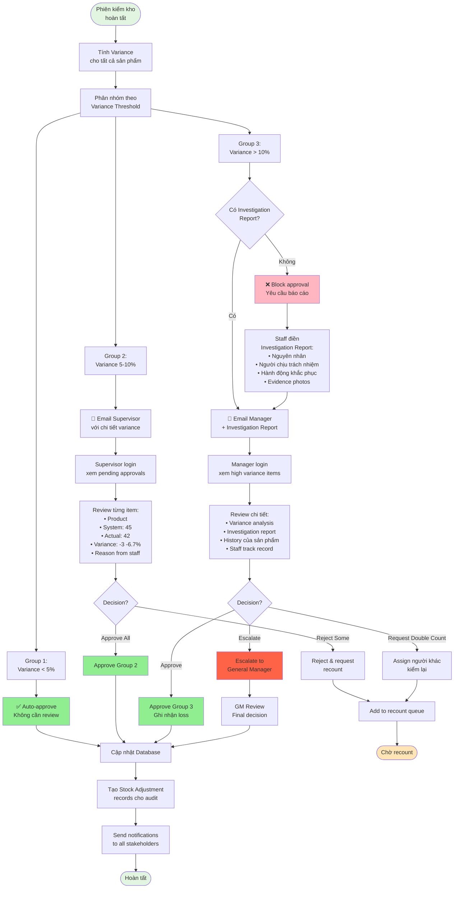
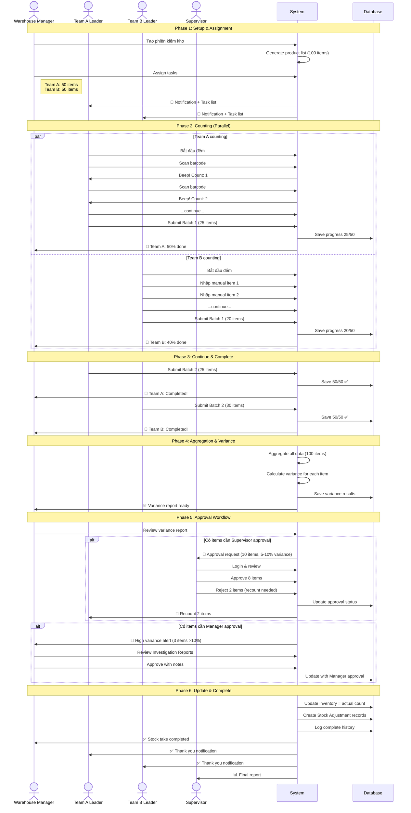
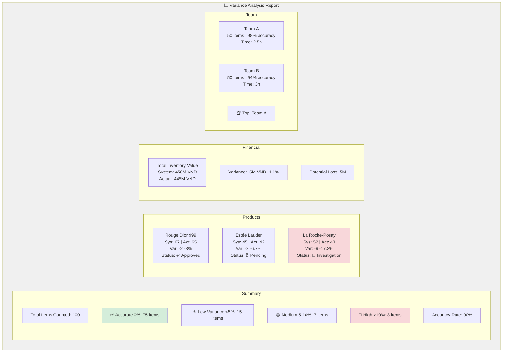

# Stock Take (Kiểm Kho) Process Diagrams

## 1. Basic Stock Take Process Flow

```mermaid
flowchart TD
    Start([Bắt đầu]) --> CreateSession[Manager tạo<br/>phiên kiểm kho]
    
    CreateSession --> SetupInfo{Nhập thông tin<br/>cơ bản}
    
    SetupInfo --> |Tên phiên<br/>Chi nhánh<br/>Ngày kiểm| SelectScope[Chọn phạm vi kiểm]
    
    SelectScope --> ScopeType{Phạm vi?}
    
    ScopeType -->|Toàn bộ| AllProducts[Tất cả sản phẩm]
    ScopeType -->|Danh mục| CategoryProducts[Theo danh mục]
    ScopeType -->|Random| RandomSample[Random sampling 10%]
    
    AllProducts --> GenerateList[Hệ thống generate<br/>danh sách sản phẩm]
    CategoryProducts --> GenerateList
    RandomSample --> GenerateList
    
    GenerateList --> AssignStaff[Assign người kiểm kho]
    
    AssignStaff --> ExportOption{Xuất phiếu<br/>kiểm?}
    
    ExportOption -->|Có| ExportSheet[Export Excel/PDF]
    ExportOption -->|Không| StartCount
    
    ExportSheet --> StartCount[Bắt đầu đếm hàng]
    
    StartCount --> CountMethod{Phương pháp?}
    
    CountMethod -->|Manual| ManualCount[Nhập thủ công<br/>từng sản phẩm]
    CountMethod -->|Import| ImportSheet[Upload Excel<br/>đã điền]
    
    ManualCount --> EnterActual[Nhập số lượng<br/>thực tế]
    ImportSheet --> ValidateData[Validate dữ liệu]
    
    ValidateData --> EnterActual
    
    EnterActual --> CalcVariance[Hệ thống tính<br/>Variance tự động]
    
    CalcVariance --> ShowVariance[Hiển thị:<br/>Hệ thống | Thực tế | Chênh lệch]
    
    ShowVariance --> SaveOption{Lưu nháp<br/>hay hoàn tất?}
    
    SaveOption -->|Lưu nháp| SaveDraft[Lưu để<br/>tiếp tục sau]
    SaveOption -->|Hoàn tất| ReviewVariance[Review chênh lệch]
    
    SaveDraft --> CanResume[Có thể resume<br/>sau này]
    CanResume --> StartCount
    
    ReviewVariance --> CheckLarge{Có chênh lệch<br/>lớn > 5%?}
    
    CheckLarge -->|Có| EnterReason[Nhập lý do<br/>chênh lệch]
    CheckLarge -->|Không| ManagerApprove
    
    EnterReason --> ManagerApprove[Manager review<br/>& approve]
    
    ManagerApprove --> ApproveDecision{Approve?}
    
    ApproveDecision -->|Reject| Recount[Yêu cầu<br/>kiểm lại]
    ApproveDecision -->|Approve| UpdateStock[Cập nhật tồn kho<br/>= Số thực tế]
    
    Recount --> StartCount
    
    UpdateStock --> CreateAdjustment[Tự động tạo<br/>Stock Adjustment]
    
    CreateAdjustment --> LogHistory[Ghi log chi tiết<br/>vào lịch sử]
    
    LogHistory --> GenerateReport[Generate báo cáo<br/>Accuracy Rate<br/>Variance Summary]
    
    GenerateReport --> NotifyStaff[Notify người kiểm<br/>& stakeholders]
    
    NotifyStaff --> End([Hoàn tất])
    
    style Start fill:#e1f5e1
    style End fill:#e1f5e1
    style UpdateStock fill:#90EE90
    style Recount fill:#FFB6C1
    style SaveDraft fill:#FFE4B5
```

## 2. Enhanced Stock Take with 7 Features

```mermaid
flowchart TD
    Start([Bắt đầu]) --> Setup[Manager tạo<br/>phiên kiểm kho]
    
    Setup --> SelectType{Chọn loại<br/>kiểm kho}
    
    SelectType -->|Full Count| FullCount[Kiểm toàn bộ<br/>End-of-month]
    SelectType -->|Cycle Count| CycleCount[Kiểm tuần hoàn<br/>ABC Classification]
    
    FullCount --> FreezeOption{Enable<br/>Freeze Inventory?}
    CycleCount --> NoFreeze[Không freeze<br/>Continuous operation]
    
    FreezeOption -->|Hard Freeze| HardFreeze[🔒 Block tất cả<br/>nhập/xuất]
    FreezeOption -->|Soft Freeze| SoftFreeze[🔔 Warning khi<br/>nhập/xuất]
    FreezeOption -->|No Freeze| NoFreeze
    
    HardFreeze --> TeamSetup
    SoftFreeze --> TeamSetup
    NoFreeze --> TeamSetup[👥 Team Assignment]
    
    TeamSetup --> AssignTeams[Assign tasks:<br/>Team A: Kệ A1-A10<br/>Team B: Kệ B1-B10]
    
    AssignTeams --> ExportSheet[📄 Export Count Sheet<br/>Excel/PDF]
    
    ExportSheet --> BlindCount{Blind Count?}
    
    BlindCount -->|Yes| HideQty[Không hiển thị<br/>số hệ thống]
    BlindCount -->|No| ShowQty[Hiển thị<br/>số hệ thống]
    
    HideQty --> CountMode
    ShowQty --> CountMode{Phương pháp đếm?}
    
    CountMode -->|Barcode Scan| BarcodeScan[📷 Scan barcode<br/>Quick count mode]
    CountMode -->|Manual| ManualEntry[Nhập thủ công]
    CountMode -->|Import| ImportFile[Upload Excel]
    
    BarcodeScan --> ScanLoop[Scan → Beep! +1<br/>Realtime update]
    ManualEntry --> EnterData[Nhập số lượng]
    ImportFile --> ValidateImport[Validate data]
    
    ScanLoop --> TeamProgress
    EnterData --> TeamProgress
    ValidateImport --> TeamProgress[📊 Track progress<br/>mỗi team]
    
    TeamProgress --> PartialSubmit{Partial<br/>Submission?}
    
    PartialSubmit -->|Yes| SubmitBatch[Submit Batch<br/>Save progress]
    PartialSubmit -->|No| ContinueCount{Đếm xong<br/>chưa?}
    
    SubmitBatch --> UpdateProgress[Update:<br/>Team A: 50/50 ✅<br/>Team B: 27/45 ⏳]
    
    UpdateProgress --> ContinueCount
    
    ContinueCount -->|Chưa| CountMode
    ContinueCount -->|Rồi| AllDone[100% completed]
    
    AllDone --> AggregateData[Aggregate dữ liệu<br/>từ tất cả teams]
    
    AggregateData --> CalcVariance[Tính Variance<br/>cho từng sản phẩm]
    
    CalcVariance --> CheckThreshold{Variance<br/>Threshold?}
    
    CheckThreshold -->|< 5%| AutoApprove[✅ Auto-approve<br/>Cập nhật ngay]
    CheckThreshold -->|5-10%| SupervisorQueue[⏳ Chờ Supervisor<br/>approve]
    CheckThreshold -->|> 10%| ManagerQueue[🚨 Chờ Manager<br/>+ Investigation Report]
    
    SupervisorQueue --> SupervisorReview{Supervisor<br/>decision}
    ManagerQueue --> CheckReport{Có Investigation<br/>Report?}
    
    CheckReport -->|Không| RequestReport[Yêu cầu điền<br/>Investigation Report]
    CheckReport -->|Có| ManagerReview{Manager<br/>decision}
    
    RequestReport --> ManagerReview
    
    SupervisorReview -->|Approve| UpdateInventory
    SupervisorReview -->|Reject| DoubleCount[Yêu cầu<br/>Double Count]
    
    ManagerReview -->|Approve| UpdateInventory[Cập nhật tồn kho<br/>= Số thực tế]
    ManagerReview -->|Reject| DoubleCount
    
    DoubleCount --> AssignOther[Assign người khác<br/>kiểm lại]
    AssignOther --> CountMode
    
    AutoApprove --> UpdateInventory
    
    UpdateInventory --> UnfreezeCheck{Có freeze<br/>inventory?}
    
    UnfreezeCheck -->|Yes| Unfreeze[🔓 Unfreeze inventory<br/>Resume operations]
    UnfreezeCheck -->|No| GenerateReport
    
    Unfreeze --> GenerateReport[Generate Report:<br/>✅ Accuracy Rate<br/>📊 Variance by product<br/>💰 $ Value impact<br/>👥 Team performance]
    
    GenerateReport --> NotifyAll[📧 Notify:<br/>• Teams<br/>• Supervisor<br/>• Manager<br/>• Accounting]
    
    NotifyAll --> End([Hoàn tất])
    
    style Start fill:#e1f5e1
    style End fill:#e1f5e1
    style AutoApprove fill:#90EE90
    style UpdateInventory fill:#90EE90
    style DoubleCount fill:#FFB6C1
    style HardFreeze fill:#FFD700
    style BarcodeScan fill:#87CEEB
    style PartialSubmit fill:#FFE4B5
```



## 3. Approval Workflow Detail



## 4. Team-based Stock Take Sequence



## 5. Barcode Scanning Flow

```mermaid
flowchart TD
    Start([Staff bắt đầu<br/>counting session]) --> OpenApp[Mở Stock Take<br/>trên device]
    
    OpenApp --> SelectMode{Chọn mode}
    
    SelectMode -->|Quick Scan| QuickMode[Quick Scan Mode:<br/>Scan = Auto +1]
    SelectMode -->|Manual Entry| ManualMode[Manual Mode:<br/>Scan → Enter qty]
    
    QuickMode --> ScanReady[📷 Scanner ready<br/>Focus on barcode input]
    ManualMode --> ScanReady
    
    ScanReady --> Scan[Scan barcode]
    
    Scan --> LookupDB[System lookup<br/>barcode trong database]
    
    LookupDB --> Found{Tìm thấy?}
    
    Found -->|Không| UnknownBarcode[❌ Unknown barcode<br/>Beep beep beep!]
    Found -->|Có| LoadProduct[Load thông tin:<br/>• Tên sản phẩm<br/>• SKU<br/>• Current count<br/>• Expected qty optional]
    
    UnknownBarcode --> OfferAdd{Add new<br/>product?}
    OfferAdd -->|Yes| AddProduct[Form thêm sản phẩm mới]
    OfferAdd -->|No| ScanReady
    
    AddProduct --> LoadProduct
    
    LoadProduct --> CheckMode{Mode?}
    
    CheckMode -->|Quick| AutoIncrement[✅ Auto +1<br/>Beep!]
    CheckMode -->|Manual| PromptQty[Nhập số lượng]
    
    PromptQty --> Confirm[Confirm]
    Confirm --> AutoIncrement
    
    AutoIncrement --> UpdateDisplay[Update hiển thị:<br/>📦 Product Name<br/>Count: 5 → 6]
    
    UpdateDisplay --> CheckDuplicate{Đã scan<br/>product này?}
    
    CheckDuplicate -->|Lần đầu| SaveNew[Lưu item mới<br/>vào count list]
    CheckDuplicate -->|Đã scan| UpdateExisting[Cập nhật count<br/>của item có sẵn]
    
    SaveNew --> FeedbackSuccess
    UpdateExisting --> FeedbackSuccess[✅ Visual feedback:<br/>• Green flash<br/>• Sound beep<br/>• Vibration]
    
    FeedbackSuccess --> CheckList{Check toàn bộ<br/>task list}
    
    CheckList --> ShowProgress[Hiển thị progress:<br/>✅ 15/50 items<br/>⏳ 35 remaining]
    
    ShowProgress --> ContinueOption{Tiếp tục?}
    
    ContinueOption -->|Yes| ScanReady
    ContinueOption -->|Save & Pause| SaveProgress[💾 Save progress<br/>Can resume later]
    ContinueOption -->|Submit| SubmitBatch[📤 Submit batch]
    
    SaveProgress --> End1([Pause])
    SubmitBatch --> ValidateData[Validate:<br/>• Duplicate check<br/>• Required fields<br/>• Negative qty check]
    
    ValidateData --> ValidationOK{Valid?}
    
    ValidationOK -->|Có lỗi| ShowErrors[❌ Hiển thị errors<br/>Fix required]
    ValidationOK -->|OK| SubmitServer[Submit to server]
    
    ShowErrors --> ContinueOption
    
    SubmitServer --> ServerSave[Server save<br/>to database]
    
    ServerSave --> NotifyManager[📧 Notify Manager:<br/>Team A submitted<br/>25/50 items]
    
    NotifyManager --> End2([Hoàn tất batch])
    
    style Start fill:#e1f5e1
    style End1 fill:#FFE4B5
    style End2 fill:#90EE90
    style UnknownBarcode fill:#FFB6C1
    style FeedbackSuccess fill:#90EE90
    style QuickMode fill:#87CEEB
```



## 6. Variance Analysis Dashboard



---

## Giải Thích Các Diagrams

### 1. Basic Stock Take Process
- Quy trình cơ bản từ tạo phiên → đếm → approve → update
- Bao gồm: manual count, import, export sheet, save draft
- Happy path + rejection path

### 2. Enhanced Stock Take (7 Features)
- Full workflow với tất cả 7 tính năng mới
- Cycle count vs Full count
- Freeze inventory options
- Team assignment & parallel counting
- Barcode scanning
- Partial submission
- 3-tier approval workflow

### 3. Approval Workflow Detail
- Chi tiết 3 levels: Auto / Supervisor / Manager
- Investigation report requirement
- Escalation path
- Database updates

### 4. Team-based Sequence
- Timeline của multi-team stock take
- Parallel counting
- Progress tracking
- Approval workflow
- Notifications

### 5. Barcode Scanning Flow
- Quick scan vs Manual mode
- Lookup → Update → Feedback
- Error handling (unknown barcode)
- Progress tracking
- Submit batch

### 6. Variance Analysis Dashboard
- Visual representation của báo cáo
- Summary statistics
- Product details
- Financial impact
- Team performance

---

## Color Legend

- 🟢 **Xanh lá** (#e1f5e1, #90EE90): Success, completed, approved
- 🟡 **Vàng** (#FFD700, #FFE4B5): In progress, warning, saved draft
- 🔴 **Đỏ** (#FFB6C1, #FF6347): Error, rejected, high variance
- 🔵 **Xanh dương** (#87CEEB): Special features (barcode scan)
- ⚪ **Xám** (#f0f0f0): Neutral, informational
