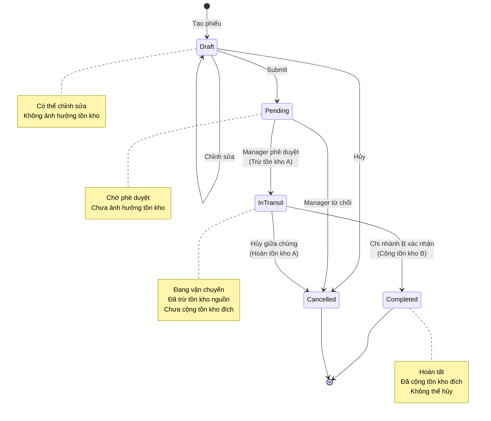
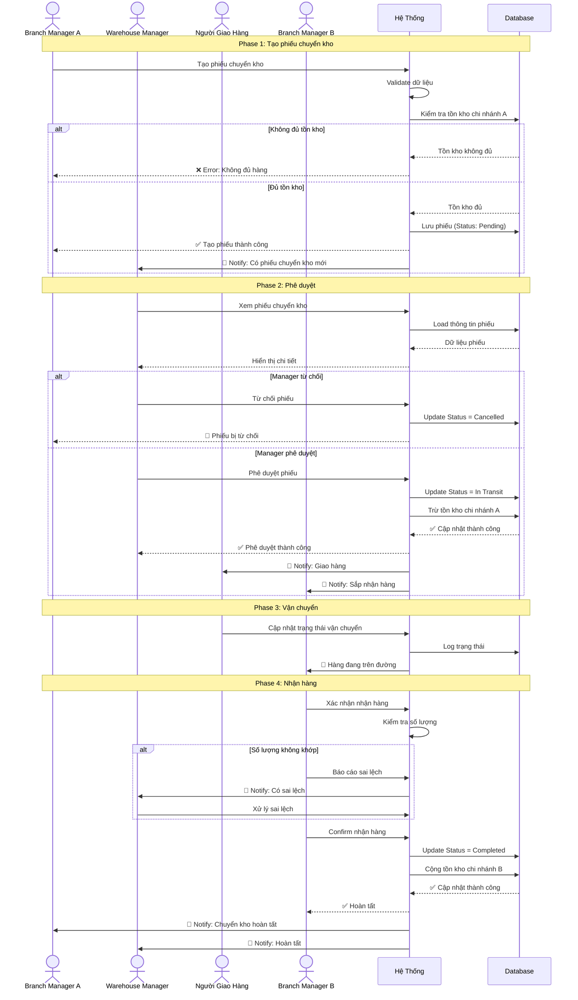
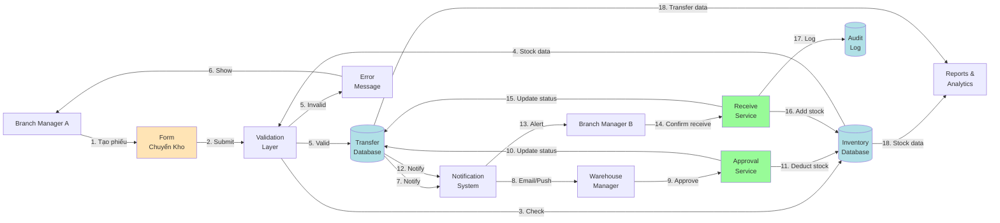
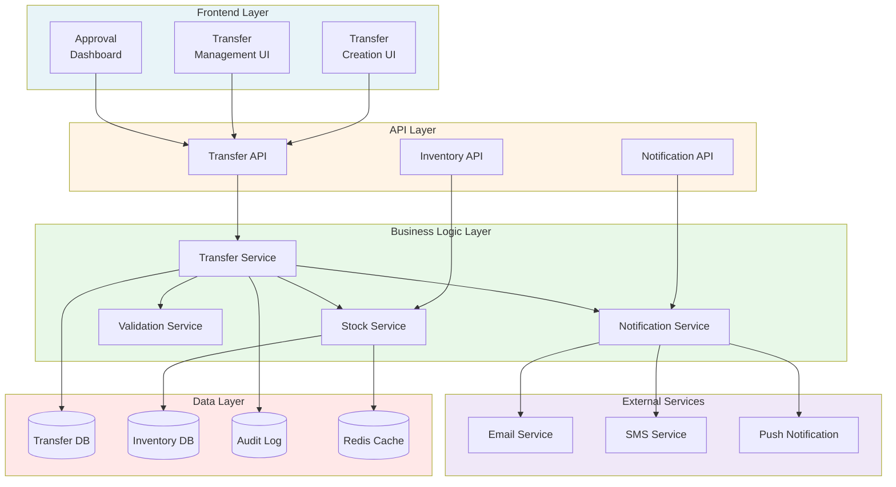
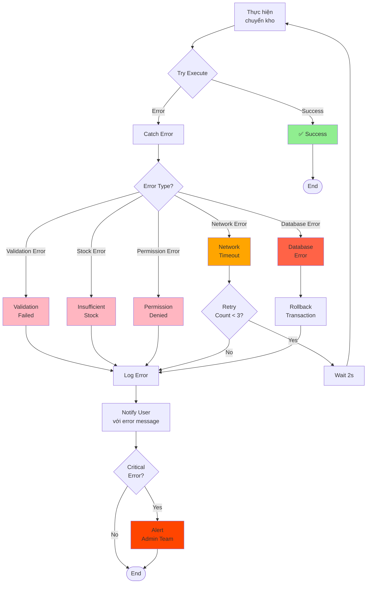

# Stock Transfer Workflow Diagrams

## 1. Overall Stock Transfer Process Flow

```mermaid
flowchart TD
    Start([Bắt đầu]) --> Create[Branch Manager A<br/>Tạo phiếu chuyển kho]
    Create --> Draft{Lưu nháp?}
    
    Draft -->|Có| SaveDraft[Trạng thái: Draft<br/>Lưu để chỉnh sửa sau]
    Draft -->|Không| Submit[Submit phiếu<br/>Trạng thái: Pending]
    
    SaveDraft --> EditLater[Có thể edit sau]
    EditLater --> Submit
    
    Submit --> CheckStock{Kiểm tra<br/>tồn kho nguồn}
    CheckStock -->|Không đủ hàng| Reject1[Từ chối<br/>Thông báo lỗi]
    CheckStock -->|Đủ hàng| WaitApproval[Chờ phê duyệt<br/>Notify Manager]
    
    Reject1 --> End1([Kết thúc])
    
    WaitApproval --> Review[Warehouse Manager<br/>Review phiếu]
    Review --> Approve{Phê duyệt?}
    
    Approve -->|Từ chối| Cancel1[Trạng thái: Cancelled<br/>Ghi rõ lý do]
    Approve -->|Chấp nhận| InTransit[Trạng thái: In Transit<br/>Trừ tồn kho chi nhánh A]
    
    Cancel1 --> End2([Kết thúc])
    
    InTransit --> NotifyShipper[Thông báo người giao<br/>& Chi nhánh B]
    NotifyShipper --> Shipping[Vận chuyển hàng<br/>từ A → B]
    
    Shipping --> CanCancel{Có hủy<br/>giữa chừng?}
    CanCancel -->|Có| CancelMid[Cancel phiếu<br/>Hoàn tồn kho A]
    CanCancel -->|Không| Receive[Chi nhánh B<br/>Nhận hàng]
    
    CancelMid --> End3([Kết thúc])
    
    Receive --> Inspect[Kiểm tra số lượng<br/>& chất lượng]
    Inspect --> Match{Khớp với<br/>phiếu?}
    
    Match -->|Không khớp| Report[Báo cáo sai lệch<br/>Tạo dispute]
    Match -->|Khớp| Confirm[Branch Manager B<br/>Xác nhận nhận hàng]
    
    Report --> Resolve[Xử lý sai lệch<br/>Điều chỉnh nếu cần]
    Resolve --> Confirm
    
    Confirm --> Complete[Trạng thái: Completed<br/>Cộng tồn kho chi nhánh B]
    Complete --> UpdateLog[Cập nhật lịch sử<br/>Ghi log chi tiết]
    UpdateLog --> NotifyComplete[Thông báo<br/>các bên liên quan]
    NotifyComplete --> End4([Kết thúc])
    
    style Start fill:#e1f5e1
    style End1 fill:#ffe1e1
    style End2 fill:#ffe1e1
    style End3 fill:#ffe1e1
    style End4 fill:#e1f5e1
    style Complete fill:#90EE90
    style InTransit fill:#FFD700
    style Cancel1 fill:#FFB6C1
    style CancelMid fill:#FFB6C1
```



## 2. Stock Transfer Status State Diagram



## 3. Actor Interaction Sequence Diagram



## 4. Inventory Impact Timeline

```mermaid
gantt
    title Tác động lên tồn kho theo thời gian
    dateFormat YYYY-MM-DD HH:mm
    axisFormat %d/%m %H:%M
    
    section Chi nhánh A (Nguồn)
    Tồn kho ban đầu: 100 sp           :milestone, m1, 2024-04-12 09:00, 0d
    Tạo phiếu (Pending)               :active, p1, 2024-04-12 09:00, 30m
    Phê duyệt: Trừ 50 sp (còn 50)    :crit, p2, 2024-04-12 09:30, 5m
    Đang chuyển: Tồn kho = 50         :p3, 2024-04-12 09:35, 2h
    Hoàn tất: Tồn kho = 50            :milestone, m2, 2024-04-12 11:35, 0d
    
    section Chi nhánh B (Đích)
    Tồn kho ban đầu: 30 sp            :milestone, m3, 2024-04-12 09:00, 0d
    Chờ nhận hàng: Tồn kho = 30       :p4, 2024-04-12 09:00, 2h35m
    Nhận hàng: Cộng 50 sp (= 80)      :crit, p5, 2024-04-12 11:35, 5m
    Hoàn tất: Tồn kho = 80            :milestone, m4, 2024-04-12 11:40, 0d
    
    section Hệ Thống
    Tạo phiếu                         :done, s1, 2024-04-12 09:00, 10m
    Chờ phê duyệt                     :active, s2, 2024-04-12 09:10, 20m
    Phê duyệt & Trừ kho A             :crit, s3, 2024-04-12 09:30, 5m
    Đang chuyển (In Transit)          :s4, 2024-04-12 09:35, 2h
    Xác nhận & Cộng kho B             :crit, s5, 2024-04-12 11:35, 5m
```

## 5. Business Rules Decision Tree

```mermaid
flowchart TD
    Start([Yêu cầu chuyển kho]) --> CheckSameBranch{Chi nhánh nguồn<br/>= Chi nhánh đích?}
    
    CheckSameBranch -->|Có| Error1[❌ Lỗi: Không thể<br/>chuyển cùng chi nhánh]
    CheckSameBranch -->|Không| CheckQty{Số lượng > 0?}
    
    CheckQty -->|Không| Error2[❌ Lỗi: Số lượng<br/>phải lớn hơn 0]
    CheckQty -->|Có| CheckStock{Tồn kho nguồn<br/>>= Số lượng?}
    
    CheckStock -->|Không| Error3[❌ Lỗi: Không đủ<br/>hàng trong kho]
    CheckStock -->|Có| CheckShipper{Có thông tin<br/>người giao?}
    
    CheckShipper -->|Không| Error4[❌ Lỗi: Thiếu<br/>thông tin người giao]
    CheckShipper -->|Có| CreateTransfer[✅ Tạo phiếu<br/>Status: Pending]
    
    CreateTransfer --> CheckApproval{Cần phê duyệt?}
    
    CheckApproval -->|Không<br/>(Auto-approve)| Approve
    CheckApproval -->|Có| WaitApproval[Chờ Manager<br/>phê duyệt]
    
    WaitApproval --> ManagerDecision{Manager<br/>quyết định}
    
    ManagerDecision -->|Từ chối| Cancelled[Status: Cancelled<br/>Ghi lý do]
    ManagerDecision -->|Chấp nhận| Approve[Status: In Transit<br/>Trừ tồn kho nguồn]
    
    Approve --> Ship[Vận chuyển]
    
    Ship --> CanCancelMid{Có yêu cầu<br/>hủy?}
    
    CanCancelMid -->|Có| RevertStock[Cancel<br/>Hoàn tồn kho nguồn]
    CanCancelMid -->|Không| Receive[Chi nhánh đích<br/>nhận hàng]
    
    Receive --> Inspect{Kiểm tra<br/>số lượng}
    
    Inspect -->|Sai lệch| Dispute[Tạo dispute<br/>Xử lý sai lệch]
    Inspect -->|Chính xác| Complete[Status: Completed<br/>Cộng tồn kho đích]
    
    Dispute --> Resolve[Giải quyết]
    Resolve --> Complete
    
    Complete --> Success([Hoàn tất])
    Cancelled --> End1([Kết thúc])
    RevertStock --> End2([Kết thúc])
    Error1 --> End3([Kết thúc])
    Error2 --> End3
    Error3 --> End3
    Error4 --> End3
    
    style Start fill:#e1f5e1
    style Success fill:#90EE90
    style Error1 fill:#FFB6C1
    style Error2 fill:#FFB6C1
    style Error3 fill:#FFB6C1
    style Error4 fill:#FFB6C1
    style Cancelled fill:#FFB6C1
    style RevertStock fill:#FFB6C1
    style Complete fill:#90EE90
    style Approve fill:#FFD700
```

## 6. Data Flow Diagram



## 7. System Architecture Component Diagram



## 8. Error Handling Flow



---

## Giải Thích Các Diagram

### 1. Overall Process Flow
Mô tả toàn bộ quy trình từ tạo phiếu → vận chuyển → hoàn tất, bao gồm các nhánh xử lý lỗi và hủy bỏ.

### 2. Status State Diagram
Hiển thị các trạng thái của phiếu chuyển kho và các transition giữa chúng.

### 3. Sequence Diagram
Tương tác giữa các actors (Branch Manager, Warehouse Manager, Shipper) và hệ thống theo thời gian.

### 4. Inventory Impact Timeline
Timeline cho thấy tồn kho thay đổi như thế nào ở mỗi bước trong quy trình.

### 5. Business Rules Decision Tree
Cây quyết định cho validation và business rules.

### 6. Data Flow Diagram
Luồng dữ liệu qua các component của hệ thống.

### 7. System Architecture
Kiến trúc hệ thống phân tầng (Frontend → API → Business Logic → Data).

### 8. Error Handling Flow
Xử lý lỗi và retry logic.

---

## Notes

- **Màu sắc**:
  - 🟢 Xanh lá: Success, hoàn tất
  - 🟡 Vàng: Đang xử lý, in transit
  - 🔴 Đỏ: Lỗi, hủy bỏ
  - 🔵 Xanh dương: Database, data layer

- **Ký hiệu**:
  - `([])`: Terminal nodes (bắt đầu/kết thúc)
  - `{}`: Decision points
  - `[]`: Process steps
  - `()`: Async operations

