# FUNCTIONAL REQUIREMENT SPECIFICATIONS

**Authors:** Diem Ha/Hai Nguyen  
**Date:** 24/03/2022  
**Version:** 1.1.0

---

## VERSION HISTORY

| VERSION | APPROVED BY | REVISION DATE | DESCRIPTION OF CHANGE           | AUTHOR             |
| ------- | ----------- | ------------- | ------------------------------- | ------------------ |
| 1.0.0   |             | 24/02/2022    | Initial creation                | Diem Ha/Hai Nguyen |
| 1.1.0   |             | 2/03/2022     | Adding LMS architecture diagram | Diem Ha/Hai Nguyen |
| 1.2.0   |             | 21/06/2022    | Adding 8 reports                | Diem Ha/Hai Nguyen |

---

## TABLE OF CONTENTS

1. [Abbreviations and Acronyms](#1-abbreviations-and-acronyms)
2. [LMS Architecture Diagram](#2-lms-architecture-diagram)
3. [External Interface Requirements](#3-external-interface-requirements)
   - 3.1 [Overview Flow](#31-overview-flow)
   - 3.2 [Participant API](#32-participant-api)
   - 3.3 [CourseList API (ERecruiter)](#33-courselist-api-erecruiter)
   - 3.4 [UpdateAOLExam API](#34-updateaolexam-api)
   - 3.5 [AAPortal API](#35-aaportal-api)
   - 3.6 [Course Status API](#36-course-status-api)
   - 3.7 [Delete Participant from Course API](#37-delete-participant-from-course-api)
   - 3.8 [Update Attendance API](#38-update-attendance-api)
4. [Role and User Management](#4-role-and-user-management)
   - 4.1 [List of Roles](#41-list-of-roles)
   - 4.2 [User Management](#42-user-management)
     - 4.2.1 [User Creation Screen](#421-user-creation-screen)
     - 4.2.2 [User Listing Page](#422-user-listing-page)
     - 4.2.3 [Login Authentication](#423-login-authentication)
5. [Trainer Management](#5-trainer-management)
   - 5.1 [Trainer Creation Page](#51-trainer-creation-page)
   - 5.2 [Trainer Listing Page](#52-trainer-listing-page)
   - 5.3 [Trainer Details Page](#53-trainer-details-page)
6. [Participant Management](#6-participant-management)
   - 6.1 [Integration](#61-integration)
   - 6.2 [Participant List](#62-participant-list)
   - 6.3 [Participant Details Page](#63-participant-details-page)
7. [Content Management](#7-content-management)
   - 7.1 [Modules](#71-modules)
   - 7.2 [Product](#72-product)
   - 7.3 [Program](#73-program)
8. [Course Management](#8-course-management)
   - 8.1 [Course Creation](#81-course-creation)
     - 8.1.1 [Course Creation Form](#811-course-creation-form)
       - 8.1.1.1 [Dynamic Form Behavior Based on Course Type](#8111-dynamic-form-behavior-based-on-course-type)
       - 8.1.1.2 [SHINE Form Fields](#8112-shine-form-fields)
       - 8.1.1.3 [Product Form Fields](#8113-product-form-fields)
       - 8.1.1.4 [Skill Form Fields](#8114-skill-form-fields)
       - 8.1.1.5 [Course Code Generation Logic](#8115-course-code-generation-logic)
       - 8.1.1.6 [Status Transition Logic](#8116-status-transition-logic)
       - 8.1.1.7 [Checklist Template Application](#8117-checklist-template-application)
       - 8.1.1.8 [Co-trainer Management](#8118-co-trainer-management)
     - 8.1.2 [Entry Points](#812-entry-points)
     - 8.1.3 [Validation & Error Handling](#813-validation--error-handling)
   - 8.2 [Course Listing Screen](#82-course-listing-screen)
     - 8.2.1 [Course List View](#821-course-list-view)
     - 8.2.2 [Filter & Search](#822-filter--search)
     - 8.2.3 [Export Courses](#823-export-courses)
     - 8.2.4 [Course Import Function](#824-course-import-function)
     - 8.2.5 [Course Actions Overview](#825-course-actions-overview)
   - 8.3 [Course Details Screen](#83-course-details-screen)
     - 8.3.1 [Course General Tab](#831-course-general-tab)
       - 8.3.1.1 [Course Status Timeline](#8311-course-status-timeline)
       - 8.3.1.2 [Course Approval Actions](#8312-course-approval-actions)
     - 8.3.2 [Course History](#832-course-history)
     - 8.3.3 [Course Planning Tab](#833-course-planning-tab)
     - 8.3.4 [Course Participant Tab Overview](#834-course-participant-tab-overview)
   - 8.4 [Course Registration](#84-course-registration)
     - 8.4.1 [Registration Process](#841-registration-process)
     - 8.4.2 [Registration Approval Workflow](#842-registration-approval-workflow)
     - 8.4.3 [Auto-Cancellation Rule](#843-auto-cancellation-rule)
   - 8.5 [Course Edit](#85-course-edit)
     - 8.5.1 [Edit Authorization Matrix](#851-edit-authorization-matrix)
     - 8.5.2 [Edit Approval Workflow](#852-edit-approval-workflow)
     - 8.5.3 [Field-Level Restrictions](#853-field-level-restrictions)
   - 8.6 [Course Cancel](#86-course-cancel)
     - 8.6.1 [Cancellation Process](#861-cancellation-process)
     - 8.6.2 [Cancel Approval Workflow](#862-cancel-approval-workflow)
   - 8.7 [Course Delete](#87-course-delete)
     - 8.7.1 [Delete Authorization](#871-delete-authorization)
     - 8.7.2 [Soft Delete vs Hard Delete](#872-soft-delete-vs-hard-delete)
   - 8.8 [Course Operations](#88-course-operations)
     - 8.8.1 [Course Participant List](#881-course-participant-list)
     - 8.8.2 [Filter Area](#882-filter-area)
     - 8.8.3 [Add Participant to Course with Import File](#883-add-participant-to-course-with-import-file)
     - 8.8.4 [Add Participant to Course Manually](#884-add-participant-to-course-manually)
     - 8.8.5 [Export Participants](#885-export-participants)
     - 8.8.6 [Export Participants for MOF Exam](#886-export-participants-for-mof-exam)
     - 8.8.7 [Import MOF Exam Result](#887-import-mof-exam-result)
     - 8.8.8 [Confirm Passed Participant](#888-confirm-passed-participant)
     - 8.8.9 [Export Passed Participant](#889-export-passed-participant)
     - 8.8.10 [Attendance Check](#8810-attendance-check)
     - 8.8.11 [AOL Exam Result](#8811-aol-exam-result)
     - 8.8.12 [Rule for Calculate Final Result](#8812-rule-for-calculate-final-result)
     - 8.8.13 [Manually Set Passed/Failed](#8813-manually-set-passedfailed)
     - 8.8.14 [Grant Agent Code](#8814-grant-agent-code)
   - 8.9 [Course Type Checklist Configuration](#89-course-type-checklist-configuration)
     - 8.9.1 [Overview](#891-overview)
     - 8.9.2 [Checklist Configuration by Course Type](#892-checklist-configuration-by-course-type)
     - 8.9.3 [Checklist Display in Course Details](#893-checklist-display-in-course-details)
     - 8.9.4 [Automated Email Reminder System](#894-automated-email-reminder-system)
     - 8.9.5 [PIC Actions](#895-pic-actions)
     - 8.9.6 [Status Definition Rules](#896-status-definition-rules)
     - 8.9.7 [Business Rules](#897-business-rules)
     - 8.9.8 [Checklist Template Configuration](#898-checklist-template-configuration)
       - 8.9.8.1 [Default Templates by Course Type](#8981-default-templates-by-course-type)
       - 8.9.8.2 [Clone Template Functionality](#8982-clone-template-functionality)
       - 8.9.8.3 [Template Customization](#8983-template-customization)
       - 8.9.8.4 [Template Selection During Course Creation](#8984-template-selection-during-course-creation)
       - 8.9.8.5 [Template Management Screen](#8985-template-management-screen)
       - 8.9.8.6 [Template Application to Courses](#8986-template-application-to-courses)
     - 8.9.9 [Reporting and Tracking](#899-reporting-and-tracking)
     - 8.9.10 [UI/UX Considerations](#8910-uiux-considerations)
     - 8.9.11 [UI Mockups](#8911-ui-mockups)
       - 8.9.11.1 [Template Management Screen](#89111-template-management-screen)
       - 8.9.11.2 [Clone Template Modal](#89112-clone-template-modal)
       - 8.9.11.3 [Template Creation/Edit Form](#89113-template-creationedit-form)
       - 8.9.11.4 [Course Creation Form - Template Selection](#89114-course-creation-form---template-selection)
       - 8.9.11.5 [Template Preview Modal](#89115-template-preview-modal)
       - 8.9.11.6 [Course Details - Checklist Tab](#89116-course-details---checklist-tab)
       - 8.9.11.7 [Checklist Summary Report](#89117-checklist-summary-report)
       - 8.9.11.8 [Mobile Responsive View - Checklist](#89118-mobile-responsive-view---checklist)
       - 8.9.11.9 [Email Reminder Sample](#89119-email-reminder-sample)
       - 8.9.11.10 [Design Specifications](#891110-design-specifications)
9. [PIC Calendar](#9-pic-calendar)
   - 9.1 [View Courses Per Trainer](#91-view-courses-per-trainer)
   - 9.2 [View Trainer Assignment for Each Trainer](#92-view-trainer-assignment-for-each-trainer)
   - 9.3 [Approve Courses in PIC Calendar](#93-approve-courses-in-pic-calendar)
     - 9.3.1 [Approve Registered Tab](#931-approve-registered-tab)
     - 9.3.2 [Approve Edit Tab](#932-approve-edit-tab)
     - 9.3.3 [Approve Cancel Tab](#933-approve-cancel-tab)
10. [Master Calendar](#10-master-calendar)
    - 10.1 [View Courses in Master Calendar](#101-view-courses-in-master-calendar)
    - 10.2 [Create Course in Master Calendar](#102-create-course-in-master-calendar)
    - 10.3 [Other Actions in Master Calendar](#103-other-actions-in-master-calendar)
      - 10.3.1 [Course Registration](#1031-course-registration)
      - 10.3.2 [Course Edit](#1032-course-edit)
      - 10.3.3 [Course Delete](#1033-course-delete)
      - 10.3.4 [View Details](#1034-view-details)
11. [List Manage](#11-list-manage)
12. [Course Template](#12-course-template)
    - 12.1 [Shine Course Template](#121-shine-course-template)
    - 12.2 [Product Course Template](#122-product-course-template)
    - 12.3 [Skill Course Template](#123-skill-course-template)
13. [Report Management](#13-report-management)
    - 13.1 [SHINE PASS RATIO](#131-shine-pass-ratio)
    - 13.2 [SHINE TRAINING](#132-shine-training)
    - 13.3 [PARTICIPANT OF TRAINERS](#133-participant-of-trainers)
    - 13.4 [RECRUITMENT SHINE](#134-recruitment-shine)
    - 13.5 [DANH SACH DANG KY MOF](#135-danh-sach-dang-ky-mof)
- 13.6 [PASS RATIO BY MONTH](#136-pass-ratio-by-month)
  - 13.7 [GIO BAY TRAINER](#137-gio-bay-trainer)
  - 13.8 [ATTENDANCE REPORT](#138-attendance-report)
  - 13.9 [REPORT FOR FWD AGENT TRAINING ACTIVITY](#139-report-for-fwd-agent-training-activity)
  - 13.10 [SHINE REPORT](#1310-shine-report)
  - 13.11 [FWT TRAINER PAYSLIP](#1311-fwt-trainer-payslip)
  - 13.12 [EXAM FEE TOTAL](#1312-exam-fee-total)
14. [General Setting](#14-general-setting)
    - 14.1 [SMTP Settings](#141-smtp-settings)
15. [Appendix A - Issues List](#appendix-a-issues-list)

---

## 1. ABBREVIATIONS AND ACRONYMS

| Term / Acronym | Description                                  |
| -------------- | -------------------------------------------- |
| AS Portal      | Agent Support Portal                         |
| DMS            | The core system of FWD                       |
| E-check        | The system to check participant's attendance |
| AOL            | Agent Online Learning                        |
| AD             | Agent Admin, manager of Agent                |

---

## 2. LMS ARCHITECTURE DIAGRAM


---

## 3. EXTERNAL INTERFACE REQUIREMENTS

### ECOSYSTEM OVERVIEW

- External interface requirement describes the HTTP Methods between FWD systems and Learning System Management (LMS) systems.
- The parameters and URL names in the document are those of the Test environment.

### 3.1 Overview Flow

```mermaid
flowchart LR
    subgraph EXT[" EXTERNAL SYSTEMS "]
        DMS["📊 DMS<br/><b>Core System</b>"]
        ER["👥 E-Recruiter<br/><b>Registration</b>"]
        AOL["📝 AOL System<br/><b>Online Learning</b>"]
        AA["✓ AA Portal<br/><b>Agent Admin</b>"]
        MOF["🏛️ MOF<br/><b>Ministry Finance</b>"]
    end

    subgraph APIs[" LMS API ENDPOINTS "]
        direction TB
        API1["<b>Participant API</b><br/>POST"]
        API2["<b>Course List API</b><br/>GET"]
        API3["<b>AOL Exam API</b><br/>POST"]
        API4["<b>License API</b><br/>POST"]
        API5["<b>Course Status API</b><br/>GET"]
        API6["<b>Delete API</b><br/>DELETE"]
    end

    DMS ===>|"① Create Participant"| API1
    API1 -.->|Success/Error| DMS

    ER ===>|"② Get Course List"| API2
    API2 -.->|Course Details| ER

    AOL ===>|"③ Update Results"| API3
    API3 -.->|Confirmation| AOL

    AA ===>|"④ Certify Code"| API4
    API4 -.->|Status| AA

    DMS ===>|"⑤ Check Status"| API5
    API5 -.->|Info| DMS

    DMS ===>|"⑥ Delete"| API6
    API6 -.->|Confirm| DMS

    MOF <-.->|"Excel Import/Export"| APIs

    style EXT fill:#FFF8E1,stroke:#FFA726,stroke-width:3px,color:#000
    style APIs fill:#E3F2FD,stroke:#42A5F5,stroke-width:3px,color:#000
style DMS fill:#FFCDD2,stroke:#E57373,stroke-width:2px,color:#000
    style ER fill:#E1BEE7,stroke:#BA68C8,stroke-width:2px,color:#000
    style AOL fill:#C8E6C9,stroke:#81C784,stroke-width:2px,color:#000
    style AA fill:#FFE0B2,stroke:#FFB74D,stroke-width:2px,color:#000
    style MOF fill:#F8BBD0,stroke:#F06292,stroke-width:2px,color:#000

    style API1 fill:#90CAF9,stroke:#1976D2,stroke-width:2px,color:#000
    style API2 fill:#90CAF9,stroke:#1976D2,stroke-width:2px,color:#000
    style API3 fill:#90CAF9,stroke:#1976D2,stroke-width:2px,color:#000
    style API4 fill:#90CAF9,stroke:#1976D2,stroke-width:2px,color:#000
    style API5 fill:#90CAF9,stroke:#1976D2,stroke-width:2px,color:#000
    style API6 fill:#90CAF9,stroke:#1976D2,stroke-width:2px,color:#000
```



**📊 API Summary Table:**

| #   | External System | API Endpoint                               | Method | Purpose                                    | Completion Flag                     |
| --- | --------------- | ------------------------------------------ | ------ | ------------------------------------------ | ----------------------------------- |
| ①   | DMS             | `/api/external/participant/create`         | POST   | Create and assign participant to course    | No                                  |
| ②   | E-Recruiter     | `/api/external/course/courseList`          | GET    | Get list of courses by date                | No                                  |
| ③   | AOL System      | `/api/external/course/updateAOLExam`       | POST   | Update AOL exam results                    | **Yes** - Marks checklist step done |
| ④   | AA Portal       | `/api/external/AAPortal/licenseShine`      | POST   | Certify Shine/license code for participant | **Yes** - Marks checklist step done |
| ⑤   | DMS             | `/api/external/course/courseStatus/{code}` | GET    | Get course status by code                  | No                                  |
| ⑥   | DMS             | `/api/external/course/delete/{code}/{id}`  | DELETE | Delete participant from course             | No                                  |
| ⑦   | E-check         | `/api/external/course/updateAttendance`    | POST   | Update attendance data for participants    | **Yes** - Marks checklist step done |

**🔄 Integration Points:**

- **DMS ↔ LMS:** Participant management, course assignment, status monitoring
- **E-Recruiter ↔ LMS:** Course registration and availability
- **AOL → LMS:** Online exam results synchronization
- **AA Portal → LMS:** Agent certification and licensing
- **MOF ↔ LMS:** Exam coordination (manual import/export)

### 3.2 Participant API

- **Purpose:** Create and assign participant to course
- **Method:** HTTP-POST
- **URL:** `https://{domain:port}/api/external/participant/create`

#### Request Parameters

| Key                        | Required | Data Type | Length | Description                                                     |
| -------------------------- | -------- | --------- | ------ | --------------------------------------------------------------- |
| accountName                |          | String    |        |                                                                 |
| accountNumber              |          | String    |        |                                                                 |
| genderCode                 |          | String    |        |                                                                 |
| gender                     |          | String    |        |                                                                 |
| middleName                 |          | String    |        |                                                                 |
| mobilePhone                | Yes      | String    |        |                                                                 |
| email                      | Yes      | String    |        |                                                                 |
| lastName                   |          | String    |        |                                                                 |
| firstName                  |          | String    |        |                                                                 |
| fullName                   | Yes      | String    |        |                                                                 |
| birthPlace                 | Yes      | String    |        |                                                                 |
| birthday                   |          | Date      |        |                                                                 |
| terDate                    |          | Date      |        |                                                                 |
| bankBranchCode             |          | String    |        |                                                                 |
| bankCode                   |          | String    |        |                                                                 |
| bank                       |          | String    |        |                                                                 |
| bankBranch                 |          | String    |        |                                                                 |
| idNumber                   | Yes      | String    |        | ID number                                                       |
| idType                     |          | String    |        |                                                                 |
| idTypeCode                 |          | String    |        |                                                                 |
| oldIdNumber                |          | String    |        | The old ID number for LSM to determine if there is a new update |
| issueDate                  | Yes      | Date      |        |                                                                 |
| issuePlace                 | Yes      | String    |        |                                                                 |
| religionCode               |          | String    |        |                                                                 |
| taxCode                    |          | String    |        |                                                                 |
| educationCode              |          | String    |        |                                                                 |
| education                  |          | String    |        |                                                                 |
| maritalStatusCode          |          | String    |        |                                                                 |
| maritalStatus              |          | String    |        |                                                                 |
| nationality                |          | String    |        |                                                                 |
| nationalityCode            |          | String    |        |                                                                 |
| religion                   |          | String    |        |                                                                 |
| channel                    |          | String    |        | Value in list 'IFA; Banca_FSC; Agency; Banker'                  |
| leaderCode                 |          | String    |        |                                                                 |
| leaderName                 |          | String    |        |                                                                 |
| leaderTitle                |          | String    |        |                                                                 |
| title                      |          | String    |        |                                                                 |
| agentCode                  |          | String    |        |                                                                 |
| agentCodeIssueDate         |          | Date      |        |                                                                 |
| courseCode                 | Yes      | String    |        | Reject if wrong course code                                     |
| adName                     |          | String    |        |                                                                 |
| participantReferences      |          | List      |        |                                                                 |
| participantRegistration    |          | Object    |        |                                                                 |
| homeAddress                |          | Object    |        |                                                                 |
| businessAddress            |          | Object    |        |                                                                 |
| participantSupportDocument |          | Object    |        |                                                                 |

#### Response

| Key          | Data Type | Length | Description          |
| ------------ | --------- | ------ | -------------------- |
| result       | String    |        | "Success" or "Error" |
| errorMessage | String    |        | Error message        |
| data         | Object    |        | Default is NULL      |
| footer       | Object    |        | Default is NULL      |

### 3.3 CourseList API (ERecruiter)

- **Purpose:** Get lists of Courses by Date
- **Method:** HTTP-GET
- **URL:** `https://{domain:port}/api/external/course/courseList?{date}`

#### Request

| Key  | Required | Data Type | Length | Description                                                                    |
| ---- | -------- | --------- | ------ | ------------------------------------------------------------------------------ |
| date | No       | Date      |        | (yyyy-MM-dd) - Return list shine course of given month. Default is next month. |

#### Response

| Key          | Data Type | Description                                    |
| ------------ | --------- | ---------------------------------------------- |
| result       | String    | "Success" or "Error"                           |
| errorMessage | String    | Error message                                  |
| data         | List      | List object                                    |
| courseCode   | String    |                                                |
| name         | String    |                                                |
| description  | String    |                                                |
| startTime    | Date      |                                                |
| endTime      | Date      |                                                |
| region       | String    |                                                |
| courseType   | String    | Value in list 'Shine; Skill; Product'          |
| channel      | String    | Value in list 'IFA; Banca_FSC; Agency; Banker' |
| venue        | Object    |                                                |
| footer       | Object    | Default is NULL                                |

### 3.4 UpdateAOLExam API

- **Purpose:** Update AOL Exam Result
- **Method:** HTTP-POST
- **URL:** `https://{domain:port}/api/external/course/updateAOLExam`

> **⚠️ PENDING PO ALIGNMENT:** The completion flag locking mechanism below requires Product Owner review and approval before implementation. Key decision point: Should subsequent API calls be rejected after completion flag is set, or should they be allowed for data corrections?

**Completion Flag Mechanism:**

This API supports a completion flag system for checklist workflow integration:

- **External system must send `isComplete=true` ONLY when ALL course participants' exam results are included in the API call**
- **First successful API call** with `isComplete=true` sets the completion flag with timestamp and marks the checklist step "Update AOL exam result" as DONE
- **Once completion flag is set, NO subsequent API calls are allowed** - any further attempts to update exam results will be REJECTED with an error
- **Partial updates** should use `isComplete=false` (or omit the flag) - these update data but do not trigger checklist completion
- System tracks completion timestamp for audit trail
- **Admin can manually reset completion status** if data needs to be corrected (with reason tracking) - this re-opens the API for updates

**Important:**

- External system is responsible for determining when ALL participant data is complete
- External system must ensure data is correct before sending `isComplete=true` as this LOCKS the data
- LMS will trust the `isComplete` flag and prevent any further updates

#### Request

| Key           | Required | Data Type | Description                                                                                                                                                                                                  |
| ------------- | -------- | --------- | ------------------------------------------------------------------------------------------------------------------------------------------------------------------------------------------------------------ |
| examCode      | Yes      | String    |                                                                                                                                                                                                              |
| idNumber      | Yes      | String    |                                                                                                                                                                                                              |
| examName      | Yes      | String    |                                                                                                                                                                                                              |
| beginningDate | Yes      | Date      |                                                                                                                                                                                                              |
| endingDate    |          | Date      |                                                                                                                                                                                                              |
| data          | Yes      | List      | List of exam results for participants                                                                                                                                                                        |
| isComplete    | No       | Boolean   | **Set to true ONLY when this request includes results for ALL course participants.** This LOCKS the data - no further updates allowed. Partial updates should use false or omit this field. (default: false) |

**Request Logic:**

- If `isComplete` = true and completion flag NOT yet set: Set completion flag, mark checklist step as DONE, record timestamp, lock data for updates
- If `isComplete` = true but completion flag already set: **REJECT with error** "AOL exam results already marked as complete. Contact admin to reset if correction needed."
- If `isComplete` = false (or omitted) and completion flag NOT yet set: Update data only, do not set completion flag (partial update allowed)
- If `isComplete` = false (or omitted) but completion flag already set: **REJECT with error** "AOL exam results already marked as complete. No further updates allowed."
- **Only Admin can reset completion flag** to allow corrections

#### Response

| Key              | Data Type | Description                                                          |
| ---------------- | --------- | -------------------------------------------------------------------- |
| result           | String    | "Success" or "Error"                                                 |
| errorMessage     | String    | Error message                                                        |
| errorCode        | String    | Error code for programmatic handling                                 |
| data             | Object    | Default is NULL                                                      |
| footer           | Object    | Default is NULL                                                      |
| completionStatus | Object    | Contains completion flag details                                     |
| isCompleted      | Boolean   | Whether completion flag is set for this course                       |
| completedAt      | DateTime  | Timestamp when completion flag was first set (null if not completed) |
| completedBy      | String    | System/API identifier that set the completion flag                   |
| isLocked         | Boolean   | Whether the data is locked for further updates                       |

**Error Codes:**

- `DATA_LOCKED`: Returned when attempting to update exam results after completion flag is set
- `VALIDATION_ERROR`: Returned for invalid request data
- `COURSE_NOT_FOUND`: Course does not exist

**Success Response Example:**

```json
{
  "result": "Success",
  "errorMessage": null,
  "errorCode": null,
  "data": null,
  "footer": null,
  "completionStatus": {
    "isCompleted": true,
    "completedAt": "2025-10-18T10:30:00Z",
    "completedBy": "AOL_SYSTEM",
    "isLocked": true
  }
}
```

**Error Response Example (Data Locked):**

```json
{
  "result": "Error",
  "errorMessage": "AOL exam results already marked as complete. No further updates allowed. Contact admin to reset if correction needed.",
  "errorCode": "DATA_LOCKED",
  "data": null,
  "footer": null,
  "completionStatus": {
    "isCompleted": true,
    "completedAt": "2025-10-17T14:20:00Z",
    "completedBy": "AOL_SYSTEM",
    "isLocked": true
  }
}
```

### 3.5 AAPortal API

- **Purpose:** Certified Shine-Code implementation for Participant (Grant agent/license codes)
- **Method:** HTTP-POST
- **URL:** `https://{domain:port}/api/external/AAPortal/licenseShine`
  > **⚠️ PENDING PO ALIGNMENT:** The completion flag locking mechanism below requires Product Owner review and approval before implementation. Key decision point: Should subsequent API calls be rejected after completion flag is set, or should they be allowed for data corrections?

**Completion Flag Mechanism:**

This API supports a completion flag system for checklist workflow integration:

- **External system must send `isComplete=true` ONLY when ALL passed participants' agent/license codes are included in the API call**
- **First successful API call** with `isComplete=true` sets the completion flag with timestamp and marks the appropriate checklist step ("Grant agent code" or "Grant license code") as DONE
- **Once completion flag is set, NO subsequent API calls are allowed** - any further attempts to update codes will be REJECTED with an error
- **Partial updates** should use `isComplete=false` (or omit the flag) - these update codes but do not trigger checklist completion
- System tracks completion timestamp for audit trail
- **Admin can manually reset completion status** if data needs to be corrected (with reason tracking) - this re-opens the API for updates

**Important:**

- External system is responsible for determining when ALL passed participants have received their codes
- External system must ensure data is correct before sending `isComplete=true` as this LOCKS the data
- LMS will trust the `isComplete` flag and prevent any further updates
- Separate completion flags tracked for AGENT codes vs LICENSE codes

#### Request

| Key        | Required | Data Type | Description                                                                                                                                                                                                              |
| ---------- | -------- | --------- | ------------------------------------------------------------------------------------------------------------------------------------------------------------------------------------------------------------------------ |
| request    | Yes      | List      | List of participant license/agent codes                                                                                                                                                                                  |
| idNumber   | Yes      | String    | ID number                                                                                                                                                                                                                |
| courseCode | Yes      | String    |                                                                                                                                                                                                                          |
| shineCode  | Yes      | String    | SHINE code (cert) / license code / agent code                                                                                                                                                                            |
| codeType   | No       | String    | Type of code: "AGENT" or "LICENSE" (for proper checklist step tracking)                                                                                                                                                  |
| isComplete | No       | Boolean   | **Set to true ONLY when this request includes codes for ALL passed participants in the course.** This LOCKS the data - no further updates allowed. Partial updates should use false or omit this field. (default: false) |

**Request Logic:**

- If `isComplete` = true and completion flag NOT yet set for this codeType: Set completion flag, mark appropriate checklist step as DONE, record timestamp, lock data for updates
- If `isComplete` = true but completion flag already set for this codeType: **REJECT with error** "Agent/License codes already marked as complete. Contact admin to reset if correction needed."
- If `isComplete` = false (or omitted) and completion flag NOT yet set: Update code data only, do not set completion flag (partial update allowed)
- If `isComplete` = false (or omitted) but completion flag already set for this codeType: **REJECT with error** "Agent/License codes already marked as complete. No further updates allowed."
- `codeType` determines which checklist step to mark as complete ("Grant agent code" vs "Grant license code")
- **Only Admin can reset completion flag** to allow corrections

#### Response

| Key              | Data Type | Description                                                          |
| ---------------- | --------- | -------------------------------------------------------------------- |
| result           | String    | "Success" or "Error"                                                 |
| errorMessage     | String    | Error message                                                        |
| errorCode        | String    | Error code for programmatic handling                                 |
| data             | Object    | Default is NULL                                                      |
| footer           | Object    | Default is NULL                                                      |
| completionStatus | Object    | Contains completion flag details                                     |
| isCompleted      | Boolean   | Whether completion flag is set for this course and code type         |
| completedAt      | DateTime  | Timestamp when completion flag was first set (null if not completed) |
| completedBy      | String    | System/API identifier that set the completion flag                   |
| codeType         | String    | Type of code that was marked complete                                |
| isLocked         | Boolean   | Whether the data is locked for further updates                       |

**Error Codes:**

- `DATA_LOCKED`: Returned when attempting to update codes after completion flag is set
- `VALIDATION_ERROR`: Returned for invalid request data
- `COURSE_NOT_FOUND`: Course does not exist

**Success Response Example:**

```json
{
  "result": "Success",
  "errorMessage": null,
  "errorCode": null,
  "data": null,
  "footer": null,
  "completionStatus": {
    "isCompleted": true,
    "completedAt": "2025-10-18T10:30:00Z",
    "completedBy": "AA_PORTAL_SYSTEM",
    "codeType": "AGENT",
    "isLocked": true
  }
}
```

**Error Response Example (Data Locked):**

```json
{
  "result": "Error",
  "errorMessage": "Agent/License codes already marked as complete. No further updates allowed. Contact admin to reset if correction needed.",
  "errorCode": "DATA_LOCKED",
  "data": null,
  "footer": null,
  "completionStatus": {
    "isCompleted": true,
    "completedAt": "2025-10-17T14:20:00Z",
    "completedBy": "AA_PORTAL_SYSTEM",
    "codeType": "AGENT",
    "isLocked": true
  }
}
```

### 3.6 Course Status API

- **Purpose:** Get status Course by CourseId
- **Method:** HTTP-GET
- **URL:** `https://{domain:port}/api/external/course/courseStatus/{courseCode}`

#### Request

| Key        | Required | Data Type | Description |
| ---------- | -------- | --------- | ----------- |
| courseCode | Yes      | String    |             |

#### Response

| Key          | Data Type | Description                                                                                                                  |
| ------------ | --------- | ---------------------------------------------------------------------------------------------------------------------------- |
| result       | String    | "Success" or "Error"                                                                                                         |
| errorMessage | String    | Error message                                                                                                                |
| data         | Object    | Default is NULL                                                                                                              |
| id           | Number    |                                                                                                                              |
| courseCode   | String    |                                                                                                                              |
| courseName   | String    |                                                                                                                              |
| status       | String    | Value in list "NEW; REGISTERED; APPROVED; CANCEL; IN_PROGRESS; DELETE; WAITING_APPROVAL_CANCEL; WAITING_DELETE; FINISH; WAITING_APPROVAL_EDIT" |
| channel      | String    | Value in list 'IFA; Banca_FSC; Agency; Banker'                                                                               |
| courseType   | String    | Value in list 'Shine; Skill; Product'                                                                                        |
| licenseType  | String    |                                                                                                                              |
| startTime    | Date      |                                                                                                                              |
| endTime      | Date      |                                                                                                                              |
| footer       | Object    | Default is NULL                                                                                                              |

### 3.7 Delete Participant from Course API

- **Purpose:** Delete Participant from Course by CourseCode and ParticipantId
- **Method:** HTTP-DELETE
- **URL:** `https://{domain:port}/api/external/course/delete/{courseCode}/{participantId}`

#### Request

| Key           | Required | Data Type | Description |
| ------------- | -------- | --------- | ----------- |
| courseCode    | Yes      | String    |             |
| participantId | Yes      | Number    |             |

#### Response

| Key          | Data Type | Description          |
| ------------ | --------- | -------------------- |
| result       | String    | "Success" or "Error" |
| errorMessage | String    | Error message        |
| data         | Object    | Default is NULL      |
| footer       | Object    | Default is NULL      |

### 3.8 Update Attendance API

- **Purpose:** Update attendance data for course participants
- **Method:** HTTP-POST
- **URL:** `https://{domain:port}/api/external/course/updateAttendance`
- **Source System:** E-check or attendance tracking system

> **⚠️ PENDING PO ALIGNMENT:** The completion flag locking mechanism below requires Product Owner review and approval before implementation. Key decision point: Should subsequent API calls be rejected after completion flag is set, or should they be allowed for data corrections?

**Completion Flag Mechanism:**

This API supports a completion flag system for checklist workflow integration:

- **External system must send `isComplete=true` ONLY when ALL course participants' attendance data is included in the API call**
- **First successful API call** with `isComplete=true` sets the completion flag with timestamp and marks the checklist step "Update attendance result" as DONE
- **Once completion flag is set, NO subsequent API calls are allowed** - any further attempts to update attendance will be REJECTED with an error
- **Partial updates** should use `isComplete=false` (or omit the flag) - these update attendance but do not trigger checklist completion
- System tracks completion timestamp for audit trail
- **Admin can manually reset completion status** if data needs to be corrected (with reason tracking) - this re-opens the API for updates

**Important:**

- External system is responsible for determining when ALL participant attendance has been recorded
- External system must ensure data is correct before sending `isComplete=true` as this LOCKS the data
- LMS will trust the `isComplete` flag and prevent any further updates

#### Request

| Key            | Required | Data Type | Description                                                                                                                                                                                                          |
| -------------- | -------- | --------- | -------------------------------------------------------------------------------------------------------------------------------------------------------------------------------------------------------------------- |
| courseCode     | Yes      | String    | Course code                                                                                                                                                                                                          |
| attendanceData | Yes      | List      | List of attendance records for participants                                                                                                                                                                          |
| idNumber       | Yes      | String    | Participant ID number (within attendanceData)                                                                                                                                                                        |
| stageNumber    | Yes      | Number    | Stage/session number (1, 2, 3, etc.)                                                                                                                                                                                 |
| isPresent      | Yes      | Boolean   | true = present, false = absent                                                                                                                                                                                       |
| attendanceDate | Yes      | Date      | Date of attendance check                                                                                                                                                                                             |
| isComplete     | No       | Boolean   | **Set to true ONLY when this request includes attendance data for ALL course participants.** This LOCKS the data - no further updates allowed. Partial updates should use false or omit this field. (default: false) |

**Request Logic:**

- If `isComplete` = true and completion flag NOT yet set: Set completion flag, mark checklist step as DONE, record timestamp, lock data for updates
- If `isComplete` = true but completion flag already set: **REJECT with error** "Attendance data already marked as complete. Contact admin to reset if correction needed."
- If `isComplete` = false (or omitted) and completion flag NOT yet set: Update attendance data only, do not set completion flag (partial update allowed)
- If `isComplete` = false (or omitted) but completion flag already set: **REJECT with error** "Attendance data already marked as complete. No further updates allowed."
- System calculates attendance percentage: (Participants with attendance data / Total participants) × 100%
- **Only Admin can reset completion flag** to allow corrections
  **Example Request:**

```json
{
  "courseCode": "8-HCMBC-SHINE-001",
  "isComplete": true,
  "attendanceData": [
    {
      "idNumber": "123456789",
      "stageNumber": 1,
      "isPresent": true,
      "attendanceDate": "2025-11-01"
    },
    {
      "idNumber": "123456789",
      "stageNumber": 2,
      "isPresent": true,
      "attendanceDate": "2025-11-02"
    }
  ]
}
```

#### Response

| Key                        | Data Type | Description                                                          |
| -------------------------- | --------- | -------------------------------------------------------------------- |
| result                     | String    | "Success" or "Error"                                                 |
| errorMessage               | String    | Error message                                                        |
| data                       | Object    | Attendance summary data                                              |
| totalParticipants          | Number    | Total number of participants in course                               |
| participantsWithAttendance | Number    | Number of participants with attendance records                       |
| attendancePercentage       | Number    | Percentage of participants with attendance data                      |
| footer                     | Object    | Default is NULL                                                      |
| completionStatus           | Object    | Contains completion flag details                                     |
| isCompleted                | Boolean   | Whether completion flag is set for this course                       |
| completedAt                | DateTime  | Timestamp when completion flag was first set (null if not completed) |
| completedBy                | String    | System/API identifier that set the completion flag                   |

---

## 4. ROLE AND USER MANAGEMENT

Admin can manage role and user role via a menu in LMS UI. This menu only allows admin role to access and modify data.

### 4.1 List of Roles

| No  | Role         | Description                                                               |
| --- | ------------ | ------------------------------------------------------------------------- |
| 1   | TRAINER      | Assign to users who are trainers                                          |
| 2   | LEAD_REGION  | Assign to users who are lead of region                                    |
| 3   | HEAD_CHANNEL | Assign to users who are head of channel                                   |
| 4   | DMS_ADMIN    | Assign to user who wants to access LMS to get the Passed participant list |
| 5   | MASTER_ROLE  | This role can break the predefined business rule                          |
| 6   | ADMIN        | This role is assigned to admin channel to perform the tasks in LMS course |
| 7   | ROOT_ADMIN   | LMS Administration role                                                   |

### Authorization Matrix by Feature

| No  | Features/Roles                           | TRAINER | LEAD_REGION | HEAD_CHANNEL | DMS_ADMIN | MASTER_ROLE | ADMIN | ROOT_ADMIN |
| --- | ---------------------------------------- | ------- | ----------- | ------------ | --------- | ----------- | ----- | ---------- |
| 1   | View PIC Calendar                        | x       | x           | x            | x         | x           | x     | x          |
| 2   | View Master Calendar                     | x       | x           | x            | x         | x           | x     | x          |
| 3   | Create course                            | x       | x           | x            |           |             |       |            |
| 4   | Import course and view history import    |         | x           | x            |           |             |       |            |
| 5   | View/export course list/details course   | x       | x           | x            | x         | x           | x     | x          |
| 6   | Register course                          | x       |             |              |           |             |       |            |
| 7   | Edit course                              | x       | x           | x            |           | x           | x     |            |
| 8   | Import MOF exam result                   |         |             |              |           | x           | x     |            |
| 9   | Import participant                       |         |             |              |           | x           | x     |            |
| 10  | Add participant                          |         |             |              |           | x           | x     |            |
| 11  | Confirm passed participant               |         |             |              |           |             | x     |            |
| 12  | Export participant                       |         |             |              | x         |             |       |            |
| 13  | Finish course                            |         |             |              |           | x           | x     |            |
| 14  | Cancel course                            | x       | x           | x            |           |             |       |            |
| 15  | Delete course                            | x       | x           | x            |           |             |       |            |
| 16  | Approve register/edit/cancel request     |         | x           | x            |           | x           |       |            |
| 17  | Create/clone program/products/modules    |         |             |              |           | x           | x     | x          |
| 18  | View program/product/module list/details |         |             |              |           | x           | x     | x          |
| 19  | View/edit Channel setting                |         |             |              |           | x           | x     | x          |
| 20  | View/edit/delete course template         |         |             |              |           | x           | x     | x          |
| 21  | Participant management                   |         | x           | x            |           | x           | x     | x          |
| 22  | Trainer management                       |         | x           | x            |           | x           | x     | x          |
| 23  | Admin management                         |         | x           | x            |           | x           | x     | x          |
| 24  | List manage                              |         |             |              |           | x           | x     | x          |
| 25  | Report management                        |         | x           | x            |           | x           | x     | x          |
| 26  | Role and Permission                      |         |             |              |           |             |       | x          |
| 27  | General setting                          |         |             |              |           | x           | x     | x          |

### 4.2 User Management

#### 4.2.1 User Creation Screen

**User Story:**  
AS AN Root Admin  
I CAN create new user in LMS system  
SO THAT users can login in to LMS system (only users requiring system access need accounts)

**Acceptance Criteria:**

- There will be an ADD NEW button to open add new user screen

**Data Requirements:**

| Field        | M/O | Data Type | Description                                                                                                       | Data Example  |
| ------------ | --- | --------- | ----------------------------------------------------------------------------------------------------------------- | ------------- |
| Email        | M   | String    | Email needs to be validated                                                                                       | lms@gmail.com |
| User Name    | M   | String    |                                                                                                                   | Head_agency   |
| Team         | M   | Dropdown  | Dropdown list include: Admin, Trainer, None                                                                       |               |
| System Roles | M   | Selection | Multiple roles can be added to user: Trainer, Lead Region, Head Channel, Master Role, Admin, Root Admin, WFT none |               |

#### 4.2.2 User Listing Page

**User Story:**  
AS a Root Admin user  
I CAN access the user listing page  
SO THAT I can search, view, edit, delete user in the LMS system

**Acceptance Criteria:**

1. **Search field** which allows searching by:

   - User's name
   - Email address

2. **View user list** with the following information:

   - The list shows: ID/Username/Email/Roles/Created date
   - Sort: default sorting by created date (Descending order)

3. **Action:** Edit/delete

#### 4.2.3 Login Authentication

**User Story:**  
AS an LMS user (apart from user with WFT role)  
I CAN login to LMS system
SO THAT I can view calendar, create course, or do other tasks according to my role

**Acceptance Criteria:**

- In login screen user enters username and password then click login button
- System validates user's name and password, return error message for the invalid user's name or password with AD authentication
- After enter username/password and click on login button, LMS calls AD to verify login credential
- If the input data is correct, then user can arrive LMS PIC Calendar screen
- If the inputted data is incorrect, then return the error message: "Invalid username or password"
- There are no limited times that user enter can enter the wrong password
- External contractors do not have access to LMS system and do not require user accounts

---

## 5. TRAINER MANAGEMENT

Root Admin, Admin, Lead region, Head channel can add new and manage trainer profile via a menu in LMS UI.

### 5.1 Trainer Creation Page

**User Story:**  
AS A Lead region, Head channel, Admin, Master user, Root Admin  
I NEED TO access Trainer creation page in Trainer Management Menu  
SO THAT I can create Trainer in LMS system

**Acceptance Criteria:**

1. There will be an ADD New button to open trainer creation screen
2. Trainer creation form

**Add New Trainer – General Information:**

| S/N | Fieldname      | Data Type      | M/O/CM/D | Description                                             | Validation |
| --- | -------------- | -------------- | -------- | ------------------------------------------------------- | ---------- |
| 1   | Full Name      | Alphanumeric   | M        |                                                         | -          |
| 2   | Trainer Title  | Dropdown List  | M        | Values: Head Academy, Head Agency, Head Banca, Head IFA | -          |
| 3   | Trainer Gender | Dropdown List  | M        | Values: Male/Female/Other                               | -          |
| 4   | ID Number      | Alphanumeric   | M        |                                                         | -          |
| 5   | Issue Date     | Date Field     | M        |                                                         | -          |
| 6   | Issue Place    | Dropdown List  | M        | Values: The list of provinces                           | -          |
| 7   | Email          | Dropdown List  | M        | List of existing emails assigned to LMS users           | -          |
| 8   | Phone          | Alphanumeric   | M        |                                                         | -          |
| 9   | Trainer Rate   | Selected value | M        | Selected value is the number                            | -          |
| 10  | Highest Degree | Alphanumeric   | M        |                                                         | -          |
| 11  | Degree         | Dropdown List  | M        | Values: Associate/Bachelor's/Master's/Doctoral          | -          |
| 12  | Trainer Type   | Dropdown List  | M        | Values: Internal Trainer/External Contractor            | -          |
| 13  | Location       | Alphanumeric   | M        |                                                         | -          |
| 14  | Region         | Dropdown List  | M        | Values: South/Middle/North                              | -          |
| 15  | Finish         | Button         | -        | On-click to save                                        |            |
| 16  | Cancel         | Button         | -        | On-click to cancel trainer creation                     |            |

3. Internal trainers need to be linked with one LMS user. There will be a searching feature to search for the existing users with Team "Trainer" in the LMS system. By selecting the user, trainer can be assigned to the selected user.

**Business Rules:**

- Internal trainers require LMS system access and must be linked to a user account with Team "Trainer"
- External contractors do not require LMS system access and do not need to be linked to a user account
- If auto-creating a new user account, the system will automatically assign the TRAINER role

### 5.2 Trainer Listing Page

**User Story:**  
AS A Lead region, Head channel, Root admin, Master role, Admin  
I NEED to access the trainer listing page  
SO THAT I can search, view, export trainer information

**Acceptance Criteria:**

1. The user can filter the trainer listing by Region, Channel
2. The search function allows the user to search by the following criteria value:
   - Full name
   - Type
   - Email
3. Search result will be displayed with the following details:
   - Full name (with hyperlink to trainer profile)
   - Gender
   - Type
   - Title
   - Location
   - Phone
   - Email
   - Status
   - Created by
   - Updated by
4. Option to set row per page
5. Sort to latest update
6. Option to export the trainer list

### 5.3 Trainer Details Page

**User Story:**  
AS A Lead region, Head channel, root admin, master role, admin  
I NEED TO access trainer profile (trainer details page)  
SO THAT I can view, edit, add more details information to trainer profile

**Acceptance Criteria:**

1. Edit button to update the general information
2. Add new, edit button for Address, Experiences, Learning & Education, Trainer Reward, Pontification, Active Ratio
3. Trainer Profile Details screen includes sections for:
   - General Information
   - Address
   - Experiences
   - Learning & Education
   - Trainer Reward
   - Pontification
   - Active Ratio
   - Training History
   - Road Map

---

## 6. PARTICIPANT MANAGEMENT

Participant can be created via:

- API participant, the data will be replicated from LMS DMS system
- Import Participant via excel file template

### 6.1 Integration

API post participant (Refer External Interface Requirement to view more details relating to the interface)

### 6.2 Participant List

The participant list includes search and filter functionality with the following fields:

| S/N | Fieldname        | Data Type         | M/O/CM/D | Description                                                                           | Validation                                                |
| --- | ---------------- | ----------------- | -------- | ------------------------------------------------------------------------------------- | --------------------------------------------------------- |
| 1   | Filter/Search by | Dropdown List     | O        | Region display a list of value criteria as South/Middle/North                         |                                                           |
| 2   |                  | Dropdown List     | O        | Channels display a list of value criteria as IFA/Banca FSC/Agency/Banker              |                                                           |
| 3   |                  | Alphanumeric (50) | O        | Allows for input of filtering value: Full name, AD name, Email, Phone, Agent code, ID | Input is triggered if the dropdown list value is selected |
| 4   | Code             | Display           | D        | Agent code                                                                            | -                                                         |
| 5   | Name             | Display           | D        | Agent name                                                                            | -                                                         |
| 6   | Gender           | Display           | D        | Gender                                                                                | -                                                         |
| 7   | ID               | Display           | D        | ID card                                                                               | -                                                         |
| 8   | Birthday         | Display           | D        | Birthday                                                                              | -                                                         |
| 9   | Phone            | Display           | D        | Phone                                                                                 | -                                                         |
| 10  | Email            | Display           | D        | Email                                                                                 | -                                                         |
| 11  | Title            | Display           | D        | Title                                                                                 | -                                                         |
| 12  | Status           | Display           | D        | Status                                                                                | Default is inactive                                       |
| 13  | Appointed date   | Display           | D        | Date of issuing Agent code                                                            | -                                                         |
| 14  | Ter date         | Display           | D        | Terminate date                                                                        | -                                                         |
| 15  | AD               | Display           | D        | AD                                                                                    | -                                                         |
| 16  | DL code          | Display           | D        | DL code                                                                               | -                                                         |
| 17  | DL name          | Display           | D        | DL name                                                                               | -                                                         |
| 18  | DL title         | Display           | D        | DL title                                                                              | -                                                         |

### 6.3 Participant Details Page

The participant details page includes:

- General Information
- Address (table view)
- Experience (table view)
- Support Document
- License codes (Table view)
- Reference (table view)
- Road Map
- Audit data update

---

## 7. CONTENT MANAGEMENT

### Course Content Relationship

**Hierarchy:** Modules → Product → Program

### 7.1 Modules

Module is the smallest unit in course content, it will be assigned to product.

**Module Listing Page:**

- Add new button: allows admin to create new module
- Module list contains: Name, Duration, Outcome, Created By, Updated By, Action

**Module Detail Page includes:**

- General section: Name, Duration, Tags, Outcome
- Attach File section: File Name, File size, Created by, Updated by, Action

### 7.2 Product

**Product Listing Page:**

- Search function: allows searching by product name
- Add new button: Allows create new product
- Product listing table contains: Name, Description, Type (Skill/Product), Sessions, Certificate, License, Created by, Updated by, Action

**Product Details Page includes:**

- General section: Name, Type, Learner type, License, Duration, Code, Certificate, Tag
- Session section: Session name, Description, File name, Module (from LMS), Action
- Attach File section

### 7.3 Program

Program is the highest level in the content hierarchy.

**Program Details Page includes:**

- General section: Name, Description, Subject, Type, License type, Course type, Max participant, Color, Tag
- Stage section: Name, Products (from LMS), Action
- Attach file section

---

## 8. COURSE MANAGEMENT

[Content continues below - subsections being renumbered]

---

## 9. PIC CALENDAR

**User Story:**  
AS A LMS user (Head/lead/trainer/admin)  
I NEED a PIC Calendar  
SO THAT I can view courses by trainers or perform course approval activities for the courses under my observation

### 9.1 View Courses Per Trainer

**User Story:**  
AS all user roles with system access  
I NEED a master calendar which shows all LMS courses along with their information, and the action tool  
SO THAT I can view courses in LMS system, get course information, status of the course easily. Moreover, I can perform some actions in the course such as create, register, delete etc.

**Acceptance Criteria:**

1. **Filter Options:**

| Filter         | Dropdown Value                                  | Note                      |
| -------------- | ----------------------------------------------- | ------------------------- |
| Course channel | Agency, Banker, Banca, IFA                      | Filter courses by channel |
| Region         | Central, Nationwide, North, South               | Filter courses by region  |
| Course Type    | Product, Shine, Skill                           | Filter courses by type    |
| Month          | Default: current month, Selection: other months | Month navigation          |

2. **Program Selection:**

   - All programs in LMS system will be listed
   - User can select to hide or unhide programs
   - Setting applies only to current session

3. **Course Status Colors:**

| Status      | Color            | Status                  | Color            |
| ----------- | ---------------- | ----------------------- | ---------------- |
| NEW         | Rgb(254,209,65)  | CAS                     | Rgb(118,181,197) |
| REGISTER    | Rgb(219,223,225) | COE                     | Rgb(118,181,197) |
| APPROVED    | Rgb(0,151,169)   | DELETED                 | Rgb(10,59,50)    |
| IN PROGRESS | Rgb(255,99,71)   | FINISHED                | Rgb(255,99,71)   |
| AA          | Rgb(118,181,197) | WAITING APPROVAL CANCEL | Rgb(110,206,178) |
| BAS         | Rgb(204,102,0)   | WAITING APPROVE EDIT    | Rgb(110,206,178) |

4. **Course's Place:**

   - Display abbreviation of the province (e.g., HCM, BRVT)
   - Text color: White

5. **Action Tool:**

   - Right-click on course to display available actions:
     - Register: Register as primary trainer
     - Edit: Open course edit screen
     - Delete: Delete course with confirmation
     - Details: Navigate to course details screen

6. **Tooltip:**

   - Displays when hovering over course
   - Shows: Code, Name, Trainer, Start date, End date, Status

7. **Course Status Color Definition:**
   - Legend shown at bottom of Master Calendar page

### 10.2 Create Course in Master Calendar

**User Story:**  
AS a trainer, lead region, head channel, master user
I NEED to access new course creation screen via Master Calendar  
SO THAT I can create new course (shine or after shine) in LMS system

**Acceptance Criteria:**

1. **Add New Course Option:**
   - By clicking/double-clicking any place in Master Calendar, course creation screen opens
   - Program and course start time are automatically filled based on clicked area
   - User can change the course's start date if desired

#### 10.2.1 Course Creation Form

There are two types of course creation forms:

**A. SHINE Form**

| S/N | Fieldname          | Data Type              | M/O/CM/D | Description                                                      |
| --- | ------------------ | ---------------------- | -------- | ---------------------------------------------------------------- |
| 1   | Save               | Button                 | -        | On-click to approve the transaction                              |
| 2   | Cancel             | Button                 | -        | On-click to cancel the transaction                               |
| 3   | Course Type        | Display                | D        | Values: Product/Shine/Skill                                      |
| 4   | License Type       | Display                | D        | The list of Program into course                                  |
| 5   | Programs           | Dropdown List          | D        | System gets PROGRAM from Master Calendar                         |
| 6   | Course Name        | Alphanumeric           | M        | System auto fills with program name                              |
| 7   | Partner            | Dropdown List          | O        | List of PARTNERS from list manage, Multiple value allowed        |
| 8   | Branch             | Dropdown List          | O        | List of branches from list manage                                |
| 9   | Primary Trainer    | Dropdown List          | M        | List of trainers, default: creator                               |
| 10  | Co-Trainer         | Dropdown List          | O        | List of trainers                                                 |
| 11  | Channel            | Dropdown List          | M        | Values: Agent/Banca FSC/Banker/IFA                               |
| 12  | Region             | Dropdown List          | M        | Values: Central/Middle/North/South                               |
| 13  | Venue address      | Alphanumeric           | M        |                                                                  |
| 14  | Start Date         | Date Field             | M        | Must be >= today+2, Radio button: AM/PM                          |
| 15  | End Date           | Date Field             | M        | Auto-set: Start date + program duration, Radio button: AM/PM     |
| 16  | Area               | Dropdown list          | M        | List from List manage                                            |
| 17  | City               | Dropdown List          | M        | List of Provinces                                                |
| 18  | AOL Start time     | Date Field             | O        | Between Course start date and course end date + 3 days           |
| 19  | AOL End time       | Date Field             | O        | Between Course start date and course end date + 3 days           |
| 20  | AOL Exam ID        | Select list Collection | O        | List of AOL exam code from List Manage                           |
| 21  | Description        | Alphanumeric           | O        | Free text                                                        |
| 22  | MOF Course Name    | Alphanumeric           | M        |                                                                  |
| 23  | Exam Type          | Dropdown List          | M        | Values: Trực tuyến tại doanh nghiệp/Trực tuyến tại VIDI          |
| 24  | MOF Exam Time      | Date Field             | M        | Course start date <= MOF Exam time <= course start date +30 days |
| 25  | Is Proctor Trainer | Ratio button           | -        | If/else selected triggers hide/unhide                            |
| 26  | Proctor Trainer    | Dropdown List          | O        | Hide/Unhide                                                      |
| 27  | Proctor Name       | Alphanumeric           | O        | Hide/Unhide                                                      |
| 28  | Proctor Phone      | Alphanumeric           | O        | Hide/Unhide                                                      |
| 29  | MOF address        | Alphanumeric           | M        |                                                                  |
| 30  | City               | Dropdown List          | M        | List of Provinces                                                |
| 31  | District           | Dropdown List          | M        | List of Districts                                                |
| 32  | Ward               | Dropdown List          | M        | List of Wards                                                    |
| 33  | Exam categories    | Dropdown List          | M        | Nhân viên tư vấn bảo hiểm, Nhân viên NH                          |
| 34  | Supporter          | Dropdown List          | O        | List user with role Admin, Multiple value allowed                |

**B. Product Form or Skill Form**

Similar to SHINE form but without MOF-related fields.

#### 10.2.1.1 Course Code Generation Logic

**Business Rule:**

System automatically generates unique course codes when a course is created. Course code format: `[BranchCode]-[CityCode][ChannelCode]-[CourseTypeCode]-[SequenceNumber]`

**Component Mapping:**

| Component        | Source Field           | Format            | Examples                                    |
| ---------------- | ---------------------- | ----------------- | ------------------------------------------- |
| BranchCode       | Branch (List manage)   | Numeric           | 8, 4, 2                                     |
| CityCode         | City (Province)        | 2-3 uppercase     | HCM (Ho Chi Minh), HN (Hanoi), DN (Da Nang) |
| ChannelCode      | Channel                | 2-3 uppercase     | BC (Banca), AG (Agency), IFA, BK (Banker)   |
| CourseTypeCode   | Course Type/Program    | 2-5 uppercase     | SHINE/SH (SHINE), PR (Product), SK (Skill)  |
| SequenceNumber   | Auto-generated         | 3-digit (001-999) | Sequential number for uniqueness            |

**Code Generation Examples:**

- `8-HCMBC-SHINE-001` (Branch 8, Ho Chi Minh + Banca, SHINE, sequence 001)
- `8-HCMAG-PR-022` (Branch 8, Ho Chi Minh + Agency, Product, sequence 022)
- `8-HNAG-SH-045` (Branch 8, Hanoi + Agency, SHINE, sequence 045)
- `8-DNBC-SK-011` (Branch 8, Da Nang + Banca, Skill, sequence 011)

**Generation Rules:**

- Code is auto-generated during course creation (user cannot edit)
- Location code = CityCode + ChannelCode (no separator, e.g., HCM + BC = HCMBC)
- Sequence number increments for same [BranchCode]-[CityCode][ChannelCode]-[CourseTypeCode] combination
- System checks existing courses and assigns next available sequence number
- Code is immutable once assigned

#### 10.2.1.2 Course Status Transition Logic

**Business Rule:**

System manages course lifecycle through defined status transitions. Status changes occur based on user actions, approval workflows, and automatic system triggers.

**Valid Course Status Values:**

- `NEW` - Course created but not yet registered
- `REGISTERED` - Trainer has registered for the course
- `APPROVED` - Course registration approved by Head/Lead
- `IN_PROGRESS` - Course is currently running (automatic on start date)
- `WAITING_APPROVAL_EDIT` / `WAITING APPROVAL EDIT` - Course edit pending approval
- `WAITING_APPROVAL_CANCEL` / `WAITING APPROVAL CANCEL` - Course cancellation pending approval
- `CANCEL` - Course has been cancelled
- `FINISHED` / `FINISH` - Course completed successfully
- `DELETE` / `DELETED` - Course marked for deletion

**Status Transition Diagram - Main Flow:**


**Approval Workflows (Secondary Paths):**


**Other Actions (Available from Multiple Statuses):**


**Status Transition Rules:**

1. **Course Registration (NEW → REGISTERED):**
   - Trigger: Trainer registers for NEW course
   - Action: Status changes to REGISTERED
   - User: Any trainer

2. **Course Approval (REGISTERED → APPROVED):**
   - Trigger: Head/Lead approves registration
   - Action: Status changes to APPROVED
   - User: Head Channel, Lead Region, Master Role
   - Rejection: REGISTERED → NEW (registration rejected)

3. **Course Start (APPROVED → IN_PROGRESS):**
   - Trigger: Course start date reached AND course status is APPROVED (automatic)
   - Action: Status changes to IN_PROGRESS
   - System: Automatic system trigger
   - Condition: **Only works if course status is APPROVED** - if course is not approved by start date, course is auto-cancelled

3a. **Auto-Cancellation (NEW/REGISTERED → CANCEL):**
   - Trigger: Course start date reached AND course status is NOT APPROVED (automatic)
   - Action: Status changes to CANCEL
   - System: Automatic system trigger
   - Condition: Course must NOT be in APPROVED status when start date arrives
   - Business Rule: **Courses that are not approved by their start date are automatically cancelled**

4. **Course Edit Approval (APPROVED → WAITING_APPROVAL_EDIT):**
   - Trigger: Lead edits SHINE course (Section 8.3.2)
   - Action: Status changes to WAITING_APPROVAL_EDIT
   - User: Lead Region (for SHINE courses only)
   - After Approval: WAITING_APPROVAL_EDIT → APPROVED (returns to previous status)
   - After Rejection: WAITING_APPROVAL_EDIT → APPROVED (returns to previous status with edits reset)

5. **Course Cancellation (Any → WAITING_APPROVAL_CANCEL):**
   - Trigger: User requests course cancellation
   - Action: Status changes to WAITING_APPROVAL_CANCEL
   - User: Trainer, Lead, Head (based on authorization)
   - After Approval: WAITING_APPROVAL_CANCEL → CANCEL
   - After Rejection: WAITING_APPROVAL_CANCEL → Previous Status

6. **Finish Course (APPROVED/IN_PROGRESS → FINISHED):**
   - Trigger: Manual finish action or automatic completion
   - Action: Status changes to FINISHED
   - User: Admin or System (automatic when all checklist steps complete)
   - Condition: May require checklist completion (Section 10.3.7)

7. **Delete Course (Any → DELETE):**
   - Trigger: User deletes course
   - Action: Status changes to DELETE
   - User: Based on authorization (Section 8.3.3)

**Authorization Matrix by Status:**

- **NEW:** Creator, Lead, Head, Master Role can edit
- **REGISTERED:** Primary trainer, Lead, Head, Master Role can edit
- **APPROVED:** Lead (SHINE only, requires approval), Head, Admin (MOF code only), Master Role can edit
- **IN_PROGRESS:** Only Master Role can edit (other roles blocked)
- **WAITING_APPROVAL_EDIT:** Only Head can approve/reject edit
- **WAITING_APPROVAL_CANCEL:** Only Head/Lead/Master Role can approve/reject cancellation

**Automatic Status Updates:**

- **APPROVED → IN_PROGRESS:** Automatic on course start date (only if status is APPROVED)
- **NEW/REGISTERED → CANCEL:** Automatic cancellation if course is not APPROVED by start date
- **Any → FINISHED:** Automatic when all required checklist steps complete (Section 10.3.6)

#### 8.2.1.3.1 Co-trainer Management

**User Story:**  
AS a trainer/lead/head  
I CAN add co-trainer when create course  
SO THAT the co-trainer data can be managed in course

**Acceptance Criteria:**

- Co-Trainer field available in course creation screen
- Co-trainer automatically added to all stages in planning
- Co-trainer can be re-selected in each stage
- System checks trainer availability and shows warning if co-trainer is busy

### 10.3 Other Actions in Master Calendar

#### 10.3.1 Course Registration

- Register option available for all trainers in NEW courses
- Screen pop-up shows all basic information
- Button SAVE to register course
- Button CANCEL to cancel registration

#### 10.3.2 Course Edit

**User Story:**  
AS a Trainer, Lead Region, Head Channel, Admin, or Master Role user  
I NEED to edit course information  
SO THAT I can update course details based on my authorization level and course status

**Acceptance Criteria:**

1. **Edit Access Points:**
   - Edit option available in Master Calendar (right-click on course → "Edit" option)
   - Edit button available in Course Details Screen - General Tab (Section 10.2.1)
   - Buttons: Edit, Save, Cancel

2. **Authorization Matrix by Course Type and Status:**
   - Users can only edit when they have permission for the current course status
   - Edit button is visible/disabled based on authorization
   - Field-level restrictions apply (see Field Restrictions below)

3. **Approval Workflow:**
   - Approval required when Lead edits SHINE course (status APPROVED)
   - Approval required when Trainer edits AFTER-SHINE course (status APPROVED)
   - Course status changes to WAITING_APPROVAL_EDIT during approval process
   - Notifications sent to Head and Trainer during workflow

4. **Validation:**
   - Same validation rules as Course Creation Form (Section 8.2.1)
   - Edit reason required when submitting edits
   - Business rule validation (status-based restrictions)

5. **History Tracking:**
   - Edit reason recorded in Course History
   - Reject edit reason recorded when edit is rejected
   - Status changes tracked in status history (Section 10.2.1.1)

**Business Rule for Course Edit:**

**EDIT COURSE - SHINE:**

| Course Status                | Trainer (creator/pri-trainer) | Lead                  | Head | Admin               | Super Admin | Master Role |
| ---------------------------- | ----------------------------- | --------------------- | ---- | ------------------- | ----------- | ----------- |
| New                          | x (creator)                   | x                     | x    |                     | x           | x           |
| Registered                   | x (primary trainer)           | x                     | x    |                     | x           | x           |
| Approved                     | O                             | x (approval required) | x    | MOF class code only | x           | x           |
| In progress and other status | O                             | O                     | O    |                     | O           | x           |

**EDIT COURSE - AFTER-SHINE:**

| Course Status                 | Trainer (creator/pri-trainer) | Lead | Head | Admin | Super Admin | Master Role |
| ----------------------------- | ----------------------------- | ---- | ---- | ----- | ----------- | ----------- |
| New                           | x (creator)                   | x    | x    |       | x           | x           |
| Registered                    | x (primary trainer)           | x    | x    |       | x           | x           |
| Approved                      | x (approval required)         | x    | x    |       | x           | x           |
| In progress and others status | O                             | O    | O    |       | O           | x           |

**Legend:**
- **x** = Can edit
- **O** = Cannot edit (blocked)

**Edit Restrictions by Status:**

1. **NEW Status:** Only course creator can edit (for Trainer role)
2. **REGISTERED Status:** Only primary trainer can edit (for Trainer role)
3. **APPROVED Status (SHINE):**
   - Trainer cannot edit
   - Lead can edit but requires Head approval (workflow triggered)
   - Head can edit
   - Admin can only edit MOF class code field
   - Master Role can edit
4. **APPROVED Status (AFTER-SHINE):**
   - Trainer can edit but requires approval
   - Lead, Head can edit
   - Master Role can edit
5. **IN_PROGRESS Status:** Only Master Role can edit (all other roles blocked)
6. **Other Statuses (FINISHED, CANCEL, etc.):** Only Master Role can edit (all other roles blocked)

**Field-Level Restrictions:**

- **Admin (SHINE, APPROVED status):** Can only edit MOF class code field, all other fields blocked
- **All other authorized users:** Can edit all course fields (same as creation form - Section 8.2.1)

**Course Edit Approval Process:**

**For LEAD editing SHINE course (status APPROVED):**

1. Lead edits the SHINE course
2. System sends notification to Head Channel and Trainer
3. Course status automatically changes from **APPROVED → WAITING_APPROVAL_EDIT**
4. Head Channel receives approval/rejection request
5. **If Head Rejects:**
   - All edits are reset to original values
   - Rejection reason is recorded in Course History (REJECT EDIT REASON)
   - Course status returns to **APPROVED**
   - Notifications sent to Lead and Trainer
6. **If Head Approves:**
   - All edits are saved
   - Course status returns to **APPROVED**
   - Notifications sent to Lead and Trainer

**For TRAINER editing AFTER-SHINE course (status APPROVED):**

1. Trainer edits the AFTER-SHINE course
2. System triggers approval workflow (similar to SHINE)
3. Course status changes to **WAITING_APPROVAL_EDIT**
4. Head/Lead approves or rejects
5. Same approval/rejection logic as SHINE (edits reset on rejection, saved on approval)

**Status Transition Rules:**

| Action | From Status | To Status | Condition |
|--------|-------------|-----------|-----------|
| Lead edits SHINE | APPROVED | WAITING_APPROVAL_EDIT | Mandatory workflow |
| Trainer edits AFTER-SHINE | APPROVED | WAITING_APPROVAL_EDIT | Approval required |
| Edit Approved | WAITING_APPROVAL_EDIT | APPROVED | Status returns to previous state |
| Edit Rejected | WAITING_APPROVAL_EDIT | APPROVED | Status returns to previous state, edits reset |

**UI Requirements:**

1. **Edit Form Fields:**
   - Same fields as Course Creation Form (Section 8.2.1)
   - All fields editable (unless restricted by role/status)
   - Field validation rules same as creation form

2. **Button States:**
   - **Edit Button:**
     - Visible when user has edit permission for current course status
     - Disabled/grayed out when user cannot edit
   - **Save Button:**
     - Enabled after clicking Edit
     - Triggers validation and approval workflow if applicable
     - Requires edit reason input (mandatory field)
   - **Cancel Button:**
     - Discards changes
     - Closes edit mode without saving

**Notification Requirements:**

1. **Notification Recipients (when Lead edits SHINE course):**
   - Head Channel - Receives approval request
   - Trainer - Notified of edit request

2. **Notification Content:**
   - Course code and name
   - Type of edit requested
   - Link to approval screen
   - Edit details summary

3. **Notification Timing:**
   - Sent immediately when edit is submitted (approval workflow triggered)
   - Sent again when approval/rejection decision is made

**Validation Requirements:**

1. **Field Validation:**
   - Same validation rules as Course Creation Form (Section 8.2.1)
   - All field-level validations apply

2. **Business Rule Validation:**
   - Cannot edit course if status is IN_PROGRESS (except Master Role)
   - Cannot edit course if status is FINISHED/CANCEL (except Master Role)
   - MOF class code can only be edited by Admin when status is APPROVED (SHINE only)
   - Edit reason is required when submitting edits

**History Tracking Requirements:**

1. **Course History Fields (Section 10.2.2):**
   - **EDIT REASON** - Course edit reason (required when editing)
   - **REJECT EDIT REASON** - Reject reason for edit (when edit is rejected)

2. **History Record Format:**
   - Includes: userid, dd/mm/yyyy hh:mm, reason text

3. **Status History Tracking (Section 10.2.1.1):**
   - Status change: APPROVED → WAITING_APPROVAL_EDIT → APPROVED
   - Timestamp recorded
   - User who performed action recorded
   - Action type: "Edit Request", "Edit Approved", "Edit Rejected"

**Exception Cases:**

1. **Master Role Override:**
   - Master Role can edit courses in ANY status
   - Bypasses all approval workflows
   - Bypasses all status restrictions

2. **Trainer Restrictions:**
   - Trainer (creator) can only edit when status is NEW (creator check required)
   - Trainer (primary) can only edit when status is REGISTERED (primary trainer check required)
   - Cannot edit when status is APPROVED (SHINE) or IN_PROGRESS

3. **Admin Restrictions:**
   - Admin can only edit MOF class code when course is SHINE type and status is APPROVED
   - Cannot edit any other fields in APPROVED status
   - Cannot edit courses in other statuses

**Integration Requirements:**

1. **Status Timeline Integration (Section 10.2.1.1):**
   - When edit is approved/rejected, status history is updated
   - Timeline shows: APPROVED → WAITING_APPROVAL_EDIT → APPROVED
   - Displays who performed edit and approval/rejection actions

2. **Checklist Integration (Section 10.3):**
   - Edit action does not affect checklist status
   - Checklist items remain unchanged when course is edited

#### 10.3.3 Course Delete

- Delete option available in course list
- Confirmation popup: "Are you sure you want to delete this item?"
- Options: CANCEL or DELETE

#### 10.3.4 View Details

- Opens course details screen in new tab

---

## 9. PIC CALENDAR

**User Story:**  
AS A LMS user (Head/lead/trainer/admin)  
I NEED a PIC Calendar  
SO THAT I can view courses by trainers or perform course approval activities for the courses under my observation

### 9.1 View Courses Per Trainer

**User Story:**  
AS A Head channels, lead region, trainer  
I NEED to view courses per trainers based on the allowed authorization  
SO THAT I can have an overview of courses or courses of the trainer's under my observation

**Acceptance Criteria:**

- PIC Calendar set as default screen after login
- Shows courses per trainers with hide/show option

**PIC Calendar View Authorization:**

- **Trainer:** Only see own courses
- **Lead Region:** See courses of trainers in same region and channel
- **Head Channel:** See courses of trainers in same channel
- **Admin:** See all LMS courses without restriction

### 9.2 View Trainer Assignment for Each Trainer

**User Story:**  
AS A user who got the access to PIC Calendar  
I NEED to view the course's assignment information for each trainer  
SO THAT I can manage trainer workload

**Acceptance Criteria:**

Tooltip displays when hovering over trainer area:

| Tooltip Content    | Description                                           |
| ------------------ | ----------------------------------------------------- |
| Name               | Trainer's full name                                   |
| Assignment         | Trainer assignment per month (set in trainer profile) |
| Total registration | Total number of stages registered per month           |
| Approved           | Total number of stages approved per month             |

### 9.3 Approve Courses in PIC Calendar

**User Story:**  
AS A Head channel, lead region, master user  
I NEED a place to perform course approval activities  
SO THAT I can approve/reject requests for course registration, course edit request, course cancel request

**Acceptance Criteria:**

- Button in PIC Calendar to open course approval screen
- Three tabs:
  1. **Approve Registered:** List of pending course registration requests
  2. **Approve Edit:** List of pending course edit requests
  3. **Approve Cancel:** List of pending course cancel requests

**Functions:**

| Function       | Description                | Note                                                                |
| -------------- | -------------------------- | ------------------------------------------------------------------- |
| Pending list   | List of pending items      | Filtered by role (Head: channel, Lead: channel+region, Master: all) |
| Filter trainer | Filter requests by trainer | View items for specific trainer                                     |
| Reject button  | Option to reject request   | Opens reject screen                                                 |
| Approve button | Option to approve request  | Opens approve screen                                                |

### 8.2 Course Listing Screen

#### 10.1.1 Course List

**User Story:**  
AS ANY user who can login to LMS  
I NEED to view the course list page in which the data is filtered for my role  
SO THAT I can view the list of courses relating to me or my channel/region

**Authorization Rule for Viewing Courses:**

| Role                           | Authorization                                                |
| ------------------------------ | ------------------------------------------------------------ |
| Trainer                        | See only courses created by or assigned to trainer           |
| Lead                           | See courses in lead's channel AND region, or created by lead |
| Head                           | See courses in head's channel                                |
| Admin, Master Role, Root Admin | See all courses in LMS system                                |

**Filter Area:**

| Filter  | Description         | Values                                                                                                                  |
| ------- | ------------------- | ----------------------------------------------------------------------------------------------------------------------- |
| Channel | Filter by channel   | All, Agency, Banca FSC, Banker, IFA                                                                                     |
| Region  | Filter by region    | All, Central, North, South, Nationwide                                                                                  |
| Status  | Filter by status    | All, NEW, REGISTERED, APPROVED, INPROGRESS, AA, BAS, COE, WAITING APPROVAL EDIT, WAITING APPROVAL CANCEL, CANCEL, DELETED |
| Search  | Search by code/name | Free text                                                                                                               |

**Course Listing Fields:**

| S/N | Fieldname      | Data Type | M/O/CM/D | Description             | Data Example            |
| --- | -------------- | --------- | -------- | ----------------------- | ----------------------- |
| 1   | Code           | Display   | D        | Course code (hyperlink) | 8-HCMBC-SHINE           |
| 2   | Course Name    | Display   | D        |                         | SHINE                   |
| 3   | Start-End Date | Display   | D        |                         | 01/04/2022 - 03/04/2022 |
| 4   | Trainer        | Display   | D        | Primary and co-trainer  |                         |
| 5   | Session        | Display   | D        | Number of stages        | 6                       |
| 6   | Region         | Display   | D        | Course region           |                         |
| 7   | Channel        | Display   | D        | Course channel          |                         |
| 8   | Venue          | Display   | D        |                         |                         |
| 9   | Status         | Display   | D        |                         |                         |
| 10  | Created By     | Display   | D        |                         |                         |
| 11  | Created At     | Display   | D        | Creation date and time   | Auto-sorted by newest first |
| 12  | Updated By     | Display   | D        |                         |                         |
| 13  | Action         | Button    | -        | Delete option           |                         |

#### 10.1.2 Export Courses

**User Story:**  
AS A user who can view the course list  
I NEED the function to export courses  
SO THAT I can have the list of courses to view via excel

**Acceptance Criteria:**

- Export button available in course listing page
- Downloads current filtered list to excel file

#### 10.1.3 Course Import Function

Besides manual course creation, FWD has a tool for course importing via excel file which allows multiple course uploads. Validation check and course importing history are available.

**Workflow for Course Import:**

1. **Admin prepares excel file**

   - Two templates: SHINE and AFTER-SHINE
   - SHINE template includes MOF exam fields

2. **Sub-course creation**

   - Column "Primary/Sub" to mark primary or sub-course
   - Primary course and sub-courses in continuous entries

3. **Co-Trainer uploading**
   - Co-Trainer field available in excel
   - Planning updated according to co-trainer
   - Trainer availability check performed

**Validation Checks:**

**A. Duplicate Check:**

- Criteria: [Start-End date] + City + District + Venue
- Duplicate courses recorded in import history with error

**B. Data Validation Check:**

| Field              | Valid Values                                     | Error Message               |
| ------------------ | ------------------------------------------------ | --------------------------- |
| Primary/Co-Trainer | Existing trainers in LMS                         | "Trainer does not valid"    |
| Course type        | Skill, Product, Shine                            | "Course type is invalid"    |
| Program            | Existing program in LMS                          | "Program is invalid"        |
| Primary Trainer    | Existing trainer or empty                        | "Primary trainer not found" |
| Channel            | Banker, Banca, Agency, IFA                       | "Channel is invalid"        |
| Region             | Nationwide, North, Central, South                | "Region is invalid"         |
| Exam Type          | Trực tuyến tại Doanh nghiệp, Trực tuyến tại VIDI | "Exam Type is invalid"      |

**C. Date Rule Check:**

- Date format: DD/MM/YYYY
- Start date must be >= import date + 2 days
- End date = Start date + course duration
- AOL exam dates must be between course start date and 5 days after
- MOF exam time must be between course end date and 30 days after

**D. Trainer Availability Check:**

- System checks if trainer is busy during course time
- Error message if unavailable: "Availability check: Course name [course ID] cannot be imported due to Trainer's unavailability"

3. **Course Import Result (pop-up)**
   - **Successful:** "All courses imported successfully, please check course import history"
   - **Fail:** "[number] imported successfully, [number] in error, check import history"

**Import History:**

Filter selection:

- Date range: From [mm/yy] - To [mm/yy]
- Status: FAIL / SUCCESS / ALL

Report template includes:

- Course ID
- Course Name
- File name
- Status (Success/Fail)
- Error details (Duplicate, Validation, Date rule errors)
- Imported at (timestamp)
- Imported by (username)

### 10.2 Course Details Screen

#### 10.2.1 Course General Tab

**Field Description:**

The general tab includes:

- Course information fields (same as course creation form)
- Task checklist related to each course
- Attach file section
- Edit, Save, Cancel buttons

#### 10.2.1.1 Course Status Timeline (New feature - To align with PO)

**User Story:**  
AS a user viewing course details  
I NEED a visual timeline showing the course status progression  
SO THAT I can quickly understand the course lifecycle, track status changes, and see who performed each action and when

**Acceptance Criteria:**

1. **Timeline Display:**
   - Status timeline displayed at the top of Course General Tab
   - Shows all status milestones in chronological order
   - Visual indicators for completed, current, and pending statuses
   - Click to expand/collapse detailed information for each milestone

2. **Status Milestones Displayed:**
   - NEW - Course Created
   - REGISTERED - Trainer Registered
   - APPROVED - Course Approved
   - WAITING_APPROVAL_EDIT - Edit Pending (shown only when applicable)
   - IN_PROGRESS - Course Started (Auto)
   - FINISHED - Course Completed
   - CANCEL - Course Cancelled (shown if course was cancelled)
   - WAITING_APPROVAL_CANCEL - Cancel Pending (shown only when applicable)

3. **Visual Indicators:**
   - ✅ Completed status: Green checkmark icon, solid connection line, colored status badge
   - 🟢 Current status: Highlighted badge with pulse animation, bold border
   - ⏳ Pending status: Grayed out circle, dashed connection line
   - ❌ Cancelled/Skipped: Red X icon, grayed out appearance

4. **Milestone Information:**
   For each status milestone, display:
   - Status name and description
   - Date and time (dd/mm/yyyy hh:mm)
   - User who performed action (name and role) or "System" for automatic actions
   - Action description (if applicable, e.g., "Edit Request", "Registration Rejected")
   - Reason (for rejections, cancellations, or approval requests)

5. **Timeline Layout:**
   - Horizontal timeline for desktop view
   - Vertical timeline for mobile/tablet view
   - Responsive design that adapts to screen size
   - Compact view by default, expandable for details

6. **Progress Indicator:**
   - Show current status prominently
   - Display progress percentage if applicable (e.g., course days completed)
   - Show next expected milestone or deadline

7. **Interactive Features:**
   - Hover over milestone: Tooltip with summary (status, date, user)
   - Click milestone: Expand to show full details
   - Toggle approval workflows: Show/hide WAITING_APPROVAL_EDIT and WAITING_APPROVAL_CANCEL milestones
   - Export timeline: Option to export as PDF or image

**UI Mockup - Horizontal Timeline (Desktop):**

```
┌─────────────────────────────────────────────────────────────────────────────────────────────┐
│ Course Details: 8-HCMBC-SHINE-001                                              [Edit]      │
├─────────────────────────────────────────────────────────────────────────────────────────────┤
│                                                                                              │
│ ━━━━━━━━━━━━━━━━━━━━━━━━━━━━━━━━━━━━━━━━━━━━━━━━━━━━━━━━━━━━━━━━━━━━━━━━━━━━━━━━━━━━━━ │
│ 📊 COURSE STATUS TIMELINE                                                                    │
│ ━━━━━━━━━━━━━━━━━━━━━━━━━━━━━━━━━━━━━━━━━━━━━━━━━━━━━━━━━━━━━━━━━━━━━━━━━━━━━━━━━━━━━━ │
│                                                                                              │
│    ┌────────────┐     ┌────────────┐     ┌────────────┐     ┌────────────┐     ┌──────────┐│
│    │     ✓      │────▶│     ✓      │────▶│     ✓      │────▶│     █      │────▶│    ○     ││
│    │    NEW     │     │REGISTERED  │     │  APPROVED  │     │IN_PROGRESS │     │ FINISHED ││
│    └────────────┘     └────────────┘     └────────────┘     └────────────┘     └──────────┘│
│         │                   │                   │                   │                │       │
│    Created         Trainer           Head/Lead          Auto Start          Pending          │
│    01/10/2025      Registered        Approved          01/11/2025          (Future)          │
│    10:30 AM        01/10/2025        02/10/2025        08:00 AM                             │
│    by Admin        11:15 AM          14:20 PM                                                │
│    Cloudair        by Trainer        by Head Channel                                         │
│                    John Doe          Jane Smith                                               │
│                                                                                              │
│ ┌─ Current Status: IN_PROGRESS ─────────────────────────────────────────────────────┐      │
│ │ Course is currently running since 01/11/2025 08:00 AM                            │      │
│ │ Progress: ████████████████░░░░░░░░░░  60% (Day 3 of 6 days)                      │      │
│ │ Expected completion: 10/11/2025                                                  │      │
│ └──────────────────────────────────────────────────────────────────────────────────┘      │
│                                                                                              │
│ [Show Approval Workflows ▼] [Export Timeline]                                               │
│                                                                                              │
└─────────────────────────────────────────────────────────────────────────────────────────────┘
```

**UI Mockup - Vertical Timeline (Mobile/Tablet):**

```
┌─────────────────────────────────────────────────────┐
│ Course Details: 8-HCMBC-SHINE-001       [Edit]      │
├─────────────────────────────────────────────────────┤
│                                                      │
│ ━━━━━━━━━━━━━━━━━━━━━━━━━━━━━━━━━━━━━━━━━━━━━━━━━ │
│ 📊 COURSE STATUS TIMELINE                            │
│ ━━━━━━━━━━━━━━━━━━━━━━━━━━━━━━━━━━━━━━━━━━━━━━━━━ │
│                                                      │
│ ✓ NEW                                   01/10/2025   │
│   Course Created                                  │
│   10:30 AM                                        │
│   by: LMS Admin Cloudair                         │
│ ───────────────────────────────────────────────   │
│                                                      │
│ ✓ REGISTERED                           01/10/2025   │
│   Trainer Registered                               │
│   11:15 AM                                        │
│   by: Trainer John Doe                            │
│ ───────────────────────────────────────────────   │
│                                                      │
│ ✓ APPROVED                               02/10/2025 │
│   Course Approved                                  │
│   14:20 PM                                        │
│   by: Head Channel - Jane Smith                  │
│ ───────────────────────────────────────────────   │
│                                                      │
│ 🟢 IN_PROGRESS                          01/11/2025  │
│   Course Started (Automatic)                       │
│   08:00 AM                                        │
│   by: System                                       │
│   Progress: 60% (Day 3 of 6)                      │
│ ───────────────────────────────────────────────   │
│                                                      │
│ ○ FINISHED                                 (Pending)│
│   Course Completion                                │
│   Expected: 10/11/2025                            │
│                                                      │
└─────────────────────────────────────────────────────┘
```

**UI Mockup - Expanded Milestone Details:**

```
┌─────────────────────────────────────────────────────────────────────────────────────────────┐
│ 📊 COURSE STATUS TIMELINE                                                                    │
├─────────────────────────────────────────────────────────────────────────────────────────────┤
│                                                                                              │
│ ✓ NEW ───▶ ✓ REGISTERED ───▶ ✓ APPROVED ───▶ █ IN_PROGRESS ───▶ ○ FINISHED              │
│                                                                                              │
│ ┌──────────────────────────────────────────────────────────────────────────────────────┐   │
│ │ APPROVED - Course Approved                                     [Expand ▼]           │   │
│ ├──────────────────────────────────────────────────────────────────────────────────────┤   │
│ │ Status: APPROVED                                                                    │   │
│ │ Date & Time: 02/10/2025 14:20 PM                                                   │   │
│ │ Performed By: Jane Smith (Head Channel)                                           │   │
│ │ Action: Approved course registration                                               │   │
│ │                                                                                      │   │
│ │ Previous Status: REGISTERED                                                         │   │
│ │ Registration Request: Submitted by Trainer John Doe on 01/10/2025 11:15 AM        │   │
│ │ Approval Duration: 27 hours 5 minutes                                              │   │
│ └──────────────────────────────────────────────────────────────────────────────────────┘   │
│                                                                                              │
└─────────────────────────────────────────────────────────────────────────────────────────────┘
```

**Data Requirements:**

| Field Name      | Data Type   | M/O/CM/D | Description                              | Example                        |
| --------------- | ----------- | -------- | ---------------------------------------- | ------------------------------ |
| Status          | Display     | M        | Status name                              | APPROVED                       |
| Timestamp       | Display     | M        | Date and time of status change           | 02/10/2025 14:20 PM            |
| Performed By    | Display     | M        | User who performed action or "System"   | Jane Smith (Head Channel)      |
| Action          | Display     | O        | Description of action performed         | Approved course registration   |
| Reason          | Display     | O        | Reason for action (if applicable)        | Registration approved         |
| Previous Status | Display     | O        | Previous status before change           | REGISTERED                     |
| Is Automatic    | Display     | O        | Whether action was automatic or manual   | Manual                         |
| Duration        | Display     | O        | Time taken to reach this status          | 27 hours 5 minutes             |

**Color Coding (from Section 8.1):**

| Status                   | Color Code | Usage                          |
| ------------------------ | ---------- | ------------------------------ |
| NEW                      | #FED141     | Yellow background for badge    |
| REGISTERED               | #DBDFE1     | Light gray background          |
| APPROVED                 | #0097A9     | Teal background                |
| IN_PROGRESS              | #FF6347     | Orange/red background          |
| FINISHED                 | #FF6347     | Orange/red background          |
| WAITING_APPROVAL_EDIT    | #6ECEB2     | Light green background         |
| WAITING_APPROVAL_CANCEL  | #6ECEB2     | Light green background         |
| CANCEL                   | #0A3B32     | Dark green background          |

**Business Rules:**

1. **Timeline Display Logic:**
   - Only show statuses that have occurred (completed milestones)
   - Show current status with highlight and animation
   - Show next expected status as pending (if applicable)
   - Approval workflows (WAITING_APPROVAL_EDIT, WAITING_APPROVAL_CANCEL) shown only when relevant

2. **Status History Tracking:**
   - System records all status changes with timestamp and user
   - Automatic actions (e.g., IN_PROGRESS on start date) marked as "System"
   - Approval workflows tracked with request timestamp and approval/rejection timestamp
   - Rejection actions show reason in timeline

3. **Auto-Cancellation Display:**
   - If course is auto-cancelled (not approved by start date), show CANCEL status
   - Display cancellation reason: "Not approved by course start date"
   - Mark as automatic action by System

4. **Progress Calculation:**
   - For IN_PROGRESS status: Calculate percentage based on course days completed
   - Formula: (Days completed / Total course days) × 100%
   - Show current day number (e.g., "Day 3 of 6")

5. **Timeline Sorting:**
   - Sort by timestamp (chronological order)
   - Most recent status at right (horizontal) or bottom (vertical)
   - Approval workflows inserted chronologically

**Authorization:**

- **View Timeline:** All users who can view course details
- **Export Timeline:** Admin, Master Role, Root Admin
- **Timeline data:** Based on course viewing authorization rules (Section 10.1.1)

**Sub-course Management:**

**User Story:**  
AS a user  
I NEED to create sub-courses from a parent course  
SO THAT I can manage multiple courses taught by one trainer at the same time

**Acceptance Criteria:**

- "Parent Course" field added to course creation popup
- Inherited fields: Primary Trainer, Program, Course Start date, Course End date
- Inherited fields cannot be changed in sub-course (change from parent)
- Other fields editable separately
- Approval process required as normal
- Parent course ID visible in sub-course details

#### 10.2.2 Course History

Tracks all course modifications:

| Field Name           | Description                    | Value Format                    |
| -------------------- | ------------------------------ | ------------------------------- |
| PROCTOR NAME         | Proctor update                 | From [Old value] to [New Value] |
| MOF EXAM TIME        | MOF Exam Time update           | From [Old value] to [New Value] |
| EXAM TYPE            | Exam type update               | From [Old value] to [New Value] |
| MOF ADDRESS          | MOF address update             | From [Old value] to [New Value] |
| REJECT REGISTRATION  | Reject reason for registration | Reject reason                   |
| CANCEL REASON        | Course cancel reason           | Cancel reason                   |
| REJECT CANCEL REASON | Reject reason for cancel       | Reject cancel reason            |
| EDIT REASON          | Course edit reason             | Edit reason                     |
| REJECT EDIT REASON   | Reject reason for edit         | Reject edit reason              |

All entries include: userid, dd/mm/yyyy hh:mm

#### 10.2.3 Course Planning Tab

**Screen Description:**

| S/N | Fieldname  | Data Type | M/O/CM/D | Description         | Validation              |
| --- | ---------- | --------- | -------- | ------------------- | ----------------------- |
| 1   | Add new    | Button    | -        | Upload file         |                         |
| 2   | Trainer    | Display   | D        |                     | Trigger to update value |
| 3   | Stages     | Display   | D        |                     | Trigger to update value |
| 4   | Start Date | Display   | D        |                     | Trigger to update value |
| 5   | End Date   | Display   | D        |                     | Trigger to update value |
| 6   | Action     |           |          | Edit/Delete buttons |                         |

**Course Time in Non-Continuous Days:**

**User Story:**  
AS AN admin/trainer/head/lead  
I CAN manage the non-continuous course  
SO THAT the course time can be tracked correctly

**Acceptance Criteria:**

- Authorized users can edit planning (time of stages)
- Course can skip days (holidays, scheduled one stage per week, etc.)
- End date updated automatically according to planning changes
- PIC/Master Calendar automatically updated to show skip days

**Example:**

- Course X has 4 stages, skip date T
- Start Date: T-1
- Skip: T
- End Date: T+1

Planning:

- Stage 1: T-1 AM
- Stage 2: T-1 PM
- Stage 3: T+1 AM
- Stage 4: T+1 PM

#### 10.2.4 Course Participant Tab

Course participant tab performs tasks related to participant management.

**10.2.4.1 Course Participant List**

System displays list of course participants with following data:

| S/N | Fieldname        | Data Type | M/O/CM/D | Description                |
| --- | ---------------- | --------- | -------- | -------------------------- |
| 1   | Name             | Display   | D        |                            |
| 2   | Gender           | Display   | D        |                            |
| 3   | Phone            | Display   | D        |                            |
| 4   | Email            | Display   | D        |                            |
| 5   | Material status  | Display   | D        |                            |
| 6   | Education        | Display   | D        |                            |
| 7   | ID               | Display   | D        |                            |
| 8   | Issue date       | Display   | D        |                            |
| 9   | Issue Place      | Display   | D        |                            |
| 10  | Birth Place      | Display   | D        |                            |
| 11  | Religion         | Display   | D        |                            |
| 12  | Nationality      | Display   | D        |                            |
| 13  | Agent code       | Display   | D        |                            |
| 14  | Title            | Display   | D        |                            |
| 15  | Ter Date         | Display   | D        |                            |
| 16  | AD Name          | Display   | D        |                            |
| 17  | AOL Result       | Display   | D        |                            |
| 18  | MOF Result       | Display   | D        |                            |
| 19  | Attendance Check | Display   | D        |                            |
| 20  | Final result     | Display   | D        | Passed/Failed              |
| 21  | Exam type        | Display   | D        | Re-exam, Skip exam, Normal |
| 22  | AL Name          | Display   | D        |                            |
| 23  | AL Code          | Display   | D        |                            |
| 24  | Last update      | Display   | D        |                            |
| 25  | Update by        | Display   | D        |                            |
| 26  | Note             | Display   | D        |                            |
| 27  | Action           | Button    |          |                            |

**10.2.4.2 Filter Area:**

| Criteria  | Data Type | Description                             |
| --------- | --------- | --------------------------------------- |
| Result    | Dropdown  | ALL, PASSED, FAILED                     |
| Exam type | Dropdown  | ALL, SKIP MOF EXAM, RE MOF EXAM, NORMAL |
| Search    | String    | Name, Phone number, Email, ID           |

**10.2.4.3 Add Participant to Course with Import File**

**User Story:**  
AS an Admin channel  
I WANT to import participants to course  
SO THAT I can import new participant or add re-exam participants to the course

**Acceptance Criteria:**

**A. Add normal Participant to course with import file**

Importing rules based on course type and channel: 

**SHINE Course (Banca Channel Only):**
- Import action means: **CREATE new participant** and add the created participant to SHINE course
- Import only if participant **doesn't exist** → Create new participant + Add to course + Normal exam
- Reject if participant **already exists** → Return to failed list
- **Business Reason:** SHINE is the **first course** - participants shouldn't pre-exist. If they do exist, use "Add Participant" function instead of import.

**After-SHINE Course (All Channels):**
- Import action means: **ADD existing participant** to course (no creation)
- Participant exists → Add existing participant to course + Normal exam  
- Reject if participant **doesn't exist** → Return to failed list
- **Business Reason:** After-SHINE happens **after SHINE completion** - participants must already exist in system. Import function only adds existing participants to course, not creating new ones.

**B. Add re-exam Participant to course with import file**

**Business Use Case:**
When Participant Failed the SHINE course, we allow them to re-take the SHINE course with the add existing Participant to SHINE course with importing feature.

- **CONDITION:** Participant **exists** in system AND all of the following are true:
  1. AOL exams passed
  2. Attendance completed
  3. Course completed within past 45 days
  4. MOF exam not passed
- **ACTION:** ADD existing participant to course with exam type set as "Re MOF Examination"
- If CONDITION is not met: Return to failed list
- **Business Reason:** Re-exam eligibility ensures participant completed all requirements except MOF within valid timeframe.


**10.2.4.4 Add Participant to Course Manually**

**User Story:**  
AS an admin  
I WANT to add participant to course  
SO THAT I can manually add normal or re-exam participants to the course

**Acceptance Criteria:**

**Note:** The validation logic for manually adding participants is identical to the import feature (Section 10.2.4.3). The only difference is the UI interaction: instead of validating a file, the system displays a filtered list of eligible participants based on the same conditions, allowing users to select participants to add. Manual add only works with existing participants - it does not support creating new participants.

**A. Add Normal Participant to Course**

**SHINE Course (Banca Channel Only):**
- **CONDITION:** Course channel is **Banca** AND participant **exists** in system
- **ACTION:** ADD existing participant to course (no creation)
- **UI Behavior:** "Add participants" button is displayed only if course channel is **Banca**
- **Participant List:** System displays only **existing participants** (same validation logic as import)
- If CONDITION is not met: Button not displayed or participant not shown in list
- **Business Reason:** Manual add only works with existing participants. To create new participants for SHINE, use import feature.

**After-SHINE Course (All Channels):**
- **CONDITION:** Course channel is **Banca**, **Agency**, or **IFA** AND participant **exists** in system
- **ACTION:** ADD existing participant to course (no creation)
- **UI Behavior:** "Add participants" button displays filtered list of **existing participants** (filtered by same channels as import validation)
- **Participant List:** System displays only participants who **exist** in system (same validation as import)
- If CONDITION is not met: Participant not shown in list
- **Business Reason:** After-SHINE happens **after SHINE completion** - participants must already exist in system.

**B. Add Re-Exam Participant for SHINE Course**

**Business Use Case:**
When Participant Failed the SHINE course, we allow them to re-take the SHINE course by manually adding existing participants who meet re-exam eligibility criteria.

- **CONDITION:** Participant **exists** in system AND all of the following are true:
  1. AOL exams passed
  2. Attendance completed
  3. Course completed within past 45 days
  4. MOF exam not passed
- **ACTION:** ADD existing participant to course with exam type set as "Re MOF Examination"
- **UI Behavior:** "Add re-exam participants" option displays filtered list
- **Participant List:** System displays only participants who meet all conditions above (same validation logic as import re-exam validation)
- If CONDITION is not met: Participant not shown in the eligible re-exam list
- **Business Reason:** Re-exam eligibility ensures participant completed all requirements except MOF within valid timeframe.

### UI Mockup: Add Participant to Course Manually

#### **A. Add Normal Participant to Course**

##### **SHINE Course (Banca Channel Only)**

**Button Visibility Logic:**
- IF course channel = "Banca" → Display "Add Participants" button
- ELSE → Hide "Add Participants" button

**UI Flow:**
1. User clicks **"Add Participants"** button
2. Modal/Dropdown opens with searchable participant list
3. **Participant List Filter:** Shows only participants who **exist** in system
4. User can search/filter by: Name, AD name, Email, Phone, Agent code
5. Each participant shows checkbox for selection
6. User selects participant(s) and clicks **"Add to Course"**
7. System validates: Participant exists (already filtered in list)
8. **ACTION:** Add existing participant to course with Exam type = "Normal"
9. Success message displayed

**Visual States:**
- Button disabled/grayed if channel ≠ "Banca"
- Empty state: "No existing participants available. Use Import feature to create new participants."
- Selected participants highlighted
- Exam type column shows "Normal" after adding

##### **After-SHINE Course (All Channels)**

**Button Visibility Logic:**
- IF course channel IN ["Banca", "Agency", "IFA"] → Display "Add Participants" button
- ELSE → Hide "Add Participants" button

**UI Flow:**
1. User clicks **"Add Participants"** button
2. Modal/Dropdown opens with searchable participant list
3. **Participant List Filter:** Shows only participants who **exist** in system
4. List filtered by channel: Banca, Agency, or IFA (based on course channel)
5. User can search/filter by: Name, AD name, Email, Phone, Agent code
6. Each participant shows checkbox for selection
7. User selects participant(s) and clicks **"Add to Course"**
8. System validates: Participant exists (already filtered in list)
9. **ACTION:** Add existing participant to course with Exam type = "Normal"
10. Success message displayed

**Visual States:**
- Button disabled/grayed if channel not in [Banca, Agency, IFA]
- Empty state: "No participants available to add"
- Selected participants highlighted
- Exam type column shows "Normal" after adding

#### **B. Add Re-Exam Participant for SHINE Course**

**Button/Options Visibility Logic:**
- IF course type = "SHINE" → Display "Add Re-Exam Participants" option/button
- ELSE → Hide "Add Re-Exam Participants" option

**UI Flow:**
1. User clicks **"Add Re-Exam Participants"** button/tab
2. Modal/Dropdown opens with searchable participant list
3. **Participant List Filter:** Shows only participants who meet **ALL** conditions:
   - Participant exists ✓
   - AOL exams passed ✓
   - Attendance completed ✓
   - Course completed within past 45 days ✓
   - MOF exam not passed ✓
4. List automatically filtered by these conditions (same validation as import)
5. User can search/filter by: Name, AD name, Email, Phone, Agent code
6. Each participant shows:
   - Checkbox for selection
   - Eligibility status indicator (green checkmark if all conditions met)
7. User selects participant(s) and clicks **"Add to Course"**
8. System validates: All conditions met (already filtered in list)
9. **ACTION:** Add existing participant to course with Exam type = "Re MOF Examination"
10. Success message displayed

**Visual States:**
- Button disabled/grayed if course type ≠ "SHINE"
- Empty state: "No eligible re-exam participants found. Participants must meet all re-exam conditions."
- Participants shown with eligibility badges:
  - ✅ All conditions met (selectable)
  - ❌ Missing conditions shown in tooltip (e.g., "Missing: AOL not passed")
- Selected participants highlighted
- Exam type column shows "Re MOF Examination" after adding
- Info icon with tooltip: "Re-exam participants must meet all conditions: AOL passed, Attendance completed, Course within 45 days, MOF not passed"
- Filter summary: "Showing X eligible re-exam participants"

#### **Common UI Components Across All Flows:**

1. **Participant List Table:**
   - Columns: Checkbox, Name, Agent Code, Email, Phone, Status
   - Search bar at top
   - Pagination if list is long
   - Bulk selection: "Select All" checkbox in header

2. **Action Buttons:**
   - Primary: "Add Selected to Course" (enabled when selection made)
   - Secondary: "Cancel" (closes modal)

3. **Validation Messages:**
   - Error: "Selected participants do not meet eligibility criteria" (should not happen if filtering works correctly)
   - Success: "X participant(s) added to course successfully"

4. **Empty States:**
   - SHINE: "No existing participants available. Use Import feature to create new participants."
   - After-SHINE: "No participants found matching the criteria"
   - Re-exam: "No eligible re-exam participants found. Participants must meet all re-exam conditions."

### Mockup Screen Diagrams


#### **Screen Layout: Participant Selection Modal**

```
┌─────────────────────────────────────────────────────────────────┐
│  Add Participants to Course                    [X] Close        │
├─────────────────────────────────────────────────────────────────┤
│  Search: [________________________]  Filter: [All ▼]            │
├─────────────────────────────────────────────────────────────────┤
│  ☑ Select All │ Name │ Agent Code │ Email │ Phone │ Status    │
├─────────────────────────────────────────────────────────────────┤
│  ☑ │ John Doe    │ AGT001 │ john@mail.com │ 123-456-7890 │ ✓ │
│  ☐ │ Jane Smith   │ AGT002 │ jane@mail.com │ 234-567-8901 │ ✓ │
│  ☐ │ Bob Wilson   │ AGT003 │ bob@mail.com  │ 345-678-9012 │ ✓ │
│  ☐ │ Alice Brown  │ AGT004 │ alice@mail.com│ 456-789-0123 │ ✓ │
│                                                                 │
│  Showing 4 of 150 participants                                │
├─────────────────────────────────────────────────────────────────┤
│  Selected: 1 participant(s)                                    │
│  [Cancel]                                [Add Selected to Course]│
└─────────────────────────────────────────────────────────────────┘
```

#### **Screen Layout: Re-Exam Participant Selection Modal**

```
┌─────────────────────────────────────────────────────────────────┐
│  Add Re-Exam Participants to SHINE Course       [ℹ️] [X] Close │
├─────────────────────────────────────────────────────────────────┤
│  ℹ️ Re-exam participants must meet all conditions:             │
│     • AOL exams passed • Attendance completed                  │
│     • Course within 45 days • MOF exam not passed              │
├─────────────────────────────────────────────────────────────────┤
│  Search: [________________________]  Filter: [All ▼]           │
│  Showing 3 eligible re-exam participants                      │
├─────────────────────────────────────────────────────────────────┤
│  ☑ Select All │ Name │ Agent Code │ Eligibility Status        │
├─────────────────────────────────────────────────────────────────┤
│  ☑ │ John Doe    │ AGT001 │ ✅ All conditions met              │
│  ☐ │ Jane Smith   │ AGT002 │ ✅ All conditions met              │
│  ☐ │ Bob Wilson   │ AGT003 │ ✅ All conditions met              │
│                                                                 │
│  Filtered by: Participant exists + AOL passed +                │
│               Attendance complete + Within 45 days +            │
│               MOF not passed                                    │
├─────────────────────────────────────────────────────────────────┤
│  Selected: 1 participant(s)                                   │
│  [Cancel]                                [Add Selected to Course]│
└─────────────────────────────────────────────────────────────────┘
```

#### **Screen Layout: Empty State**

```
┌─────────────────────────────────────────────────────────────────┐
│  Add Participants to Course                    [X] Close        │
├─────────────────────────────────────────────────────────────────┤
│                                                                 │
│                    📭                                           │
│                                                                 │
│          No existing participants available                     │
│                                                                 │
│    Use Import feature to create new participants               │
│    for SHINE courses.                                          │
│                                                                 │
│    [Import Participants]                                        │
│                                                                 │
└─────────────────────────────────────────────────────────────────┘
```

**10.2.4.5 Export Participants**

**User Story:**  
AS an admin  
I NEED to export all course participants  
SO THAT I can have a list of planned participants for MOF exam

**Acceptance Criteria:**

- "Export participant" button downloads excel file with all course participants

**10.2.4.6 Export Participants for MOF Exam**

**User Story:**  
AS an admin  
I NEED to export participants for MOF exam

**Acceptance Criteria:**

Eligible participants for MOF exam:

- Passed all AOL exams
- Full attendance check

Template exported with eligible participants list

**10.2.4.7 Import MOF Exam Result**

After participants finish MOF exam, Admin imports MOF exam result to LMS system.

File upload template includes:

- MOF exam ID (stored for each participant)
- MOF course code (Mandatory, validation check required)
- Province (Mandatory, free text)

**10.2.4.8 Confirm Passed Participant**

**Process:**

1. **LMS Event:** Reminder at Course End date + 1 day
2. **Email sent to:** AA_admin (SHINE) or channel email (After-shine)
3. **Admin action:** Login to LMS and confirm passed participants
4. **System check:** Verify attachment uploaded (SHINE only)
5. **Email confirmation sent** to appropriate admin

**10.2.4.9 Export Passed Participant**

Admin can export passed participants with detailed information (final result = passed only)

**10.2.4.10 Attendance Check**

- Updated via API (refer External Interface Requirement)
- Number represents each stage
- Blue mark: participant joined
- Grey mark: participant absent

**10.2.4.11 AOL Exam Result**

- Updated via API (refer External Interface Requirement)
- Result: passed/failed

**10.2.4.12 Rule for Calculate Final Result**

LMS returns final result based on:

**Course Type SHINE:**

- Attendance: Full
- AOL: Passed
- MOF >= 30

**Course Type Product:**

- Attendance: Full
- AOL: Passed

**Course Type Skill:**

- Attendance: Full

**10.2.4.14 Manually Set Passed/Failed**

- Function only for Admin or Head
- Button to set final result
- Pop-up asks for reason and attachment
- Value recorded as: passed** or failed**
- Attachment recorded in participant list

**10.2.4.15 Grant Agent Code**

Done via API (refer External Interface)
Agent code displayed for each participant

---

### 10.3 Course Type Checklist

**User Story:**  
AS A Course Administrator/PIC  
I NEED a dynamic checklist system for each course type  
SO THAT I can track and complete all required steps for the course lifecycle with automated reminders

#### 10.3.1 Overview

The Course Type Checklist feature provides a structured workflow management system where each course type (Shine/Product/Skill) has a predefined set of steps that must be completed during the course lifecycle. The system automatically tracks completion status and sends reminder emails to responsible parties.

**Key Capabilities:**

- Dynamic checklist based on course type
- Step-by-step workflow tracking
- Automated email reminders with configurable timing
- Status tracking (Done/Not Done)
- PIC (Person in Charge) assignment per step
- Action tracking and confirmation

#### 10.3.2 Checklist Configuration by Course Type

**Acceptance Criteria:**

- System displays only relevant steps for each course type
- Each step has defined PIC, timing, and reminder configuration
- Steps can be marked as done by authorized users
- System prevents course progression if mandatory steps are incomplete

**Checklist Steps Definition:**

| Steps                                              | Course Type   | PIC                                              | Time to Send Reminder                                                                                                     | Reminder Template              | Also Send Reminder to Email Addresses | PIC Action                                                                    | Status Definition Logic                                                                               |
| -------------------------------------------------- | ------------- | ------------------------------------------------ | ------------------------------------------------------------------------------------------------------------------------- | ------------------------------ | ------------------------------------- | ----------------------------------------------------------------------------- | ----------------------------------------------------------------------------------------------------- |
| Verify AOL information                             | Shine/Product | Course Supporters                                | **Frequency:** Daily<br/>**Start:** Course creation<br/>**Stop:** When action is done                                     | Template name                  |                                       | Confirm/Update - confirm                                                      | Step is marked done when PIC confirms the step is completed                                           |
| Verify MOF information                             | Shine         | Course Supporters                                | **Frequency:** Daily<br/>**Start:** Course creation<br/>**Stop:** When action is done                                     |                                |                                       | Confirm/update - confirm                                                      | Step is marked done when PIC confirms the step is completed                                           |
| Enter MOF exam code                                | Shine         | Course Supporters                                | **Frequency:** Daily<br/>**Start:** Course creation<br/>**Stop:** When action is done                                     |                                |                                       | Enter mof exam code                                                           | Step is marked done when MOF exam code field is entered with information                              |
| Approve course                                     | All           | Trainer's Head Channel and Trainer's Lead Region | **Frequency:** Daily<br/>**Start From:** Course Start Date - "x" days<br/>**End:** Course Start Date - y days (where x>y) |                                |                                       | Approve/Rejected                                                              | Step is marked done when course status changes to "Approved"                                          |
| Add participants                                   | All           | External API                                     | **NA** (No reminder)                                                                                                      |                                |                                       | No                                                                            | Calculate percentage: (Number of added participants / Max participants allowed in program) × 100%     |
| Export Participants for MOF exam                   | Shine         | Course Supporters                                | **Timing:** Course end date + x days                                                                                      |                                |                                       | Export                                                                        | Step is marked done when user clicks "Export participant for MOF exam" button                         |
| Update AOL exam result                             | Shine/Product | Course Supporters                                | **No automatic reminder**                                                                                                 |                                |                                       | No                                                                            | Step is marked done when AOL exam results are received and updated for all participants in the course |
| Update attendance result                           | All           | External API                                     | **No automatic reminder**                                                                                                 |                                |                                       | No                                                                            | Count and calculate percentage of participants who have attendance data recorded                      |
| Import MOF result                                  | Shine         | Course Supporters                                | **No automatic reminder**                                                                                                 |                                |                                       | Import                                                                        | Step is marked done when user successfully imports MOF exam results                                   |
| Confirm passed participants                        | All           | Aa admin                                         | **No automatic reminder**                                                                                                 | example: randomemail@gamil.com | Confirm                               | Step is marked done when user successfully confirms passed participants       |
| Export participant for granting agent/license code | All           | Aa admin                                         | **No automatic reminder**                                                                                                 |                                | Export                                | Step is marked done when user exports passed participants for code assignment |
| Grant agent code                                   | Shine         | External API                                     | **No automatic reminder**                                                                                                 |                                |                                       |                                                                               | Step is marked done when agent codes are received and assigned to all passed participants             |
| Grant license code                                 | All           | External API                                     | **No automatic reminder**                                                                                                 |                                |                                       |                                                                               | Step is marked done when API receives and updates license codes for participants                      |
| Finish course                                      | All           | System or Admin                                  | **No automatic reminder**                                                                                                 |                                | Finish course                         | Step is marked done when course status is set to "Finished"                   |

#### 10.3.3 Checklist Display in Course Details

**User Story:**  
AS A user viewing course details  
I NEED to see the course type checklist with current status AND be able to perform workflow actions directly from the checklist  
SO THAT I have a centralized place for all course workflow management

**Design Principle: Action Consolidation**

The Checklist tab serves as the **single source of truth** for all course workflow actions. Actions that are part of the checklist workflow (one-time milestones) should ONLY be accessible from the Checklist tab, not duplicated in other tabs.

**Actions Consolidated into Checklist (remove from other tabs):**

- Confirm passed participants (remove from Participants tab)
- Export Participants for MOF exam (remove from Participants tab)
- Import MOF result (remove from Participants tab)
- Export passed participants (remove from Participants tab)
- Finish course (remove from General tab)

**Actions NOT in Checklist (keep in original locations):**

- Add participant manually (Participants tab) - repeatable, anytime
- Import participants in bulk (Participants tab) - repeatable, anytime
- Edit course details (General tab) - not a workflow milestone
- Edit planning (Planning tab) - not a workflow milestone

**Acceptance Criteria:**

1. **Checklist Section in Course Details:**

   - Display checklist in dedicated "Checklist" tab in course details page
   - Show only steps relevant to current course type
   - Display step name, PIC, status, and embedded action buttons
   - Highlight pending steps
   - Show progress bar: "X of Y steps completed"
   - Display template name that was applied to the course

2. **Status Indicators:**

   - ✅ Green checkmark for completed steps
   - ⏳ Pending icon for incomplete steps
   - 🔴 Red indicator for overdue steps (if reminder date passed)
   - ⚪ Grey for not ready/not applicable steps

3. **Fields Displayed:**

   - Step number
   - Step name
   - PIC (Person in Charge)
   - Status (Done/Pending/Overdue/Not Ready)
   - Last updated date and user
   - **Action button (embedded in checklist row)** - when applicable

4. **Embedded Action Buttons:**

   - Action buttons appear directly in the checklist row for pending steps
   - Button only visible when step status is PENDING or OVERDUE
   - Button only enabled for assigned PIC role (or Admin/Master Role)
   - Four action patterns:
     - **Direct button:** Simple click (e.g., [Export], [Finish])
     - **Modal button:** Opens popup for complex actions (e.g., [Import], [Confirm])
     - **Expandable:** Click [Expand ▼] to show inline form with options
     - **No button:** Auto-completed steps via API/system

5. **Button Authorization:**

   - Only assigned PIC sees enabled action button
   - Other users see disabled button with message: "Contact [PIC Role]"
   - Admin/Master Role can override and perform any action

6. **Action Execution:**
   - Clicking action button performs the workflow action
   - Simple actions execute directly (export downloads file)
   - Complex actions open modal (import shows file upload dialog)
   - After action completes, step automatically marked as DONE
   - Button disappears once step is completed
   - Reminder emails stop for completed steps

#### 10.3.4 Automated Email Reminder System

**User Story:**  
AS A Course Administrator
I NEED automated email reminders to be sent to PICs  
SO THAT they complete required steps on time

**Acceptance Criteria:**

1. **Reminder Configuration:**

   - Each step has configurable reminder timing
   - Support multiple reminder frequencies: Daily, specific days before/after course dates
   - Stop reminders when step is marked as done
   - Support additional email addresses beyond PIC

2. **Reminder Timing Rules:**

   - **Daily from course creation:** Start sending daily reminders from course creation date
   - **Course end date + x days:** Send reminder x days after course ends
   - **x days before course start:** Send reminder x days before course starts
   - **Date range:** Start From: Course Start Date - "x" days to Course Start Date - y days (x>y)

3. **Email Content:**
   - Course code and name
   - Step name that needs attention
   - Action required
   - Link to course details page
   - Deadline (if applicable)

**Example Email Template:**

```
Subject: [LMS] Reminder: [Step Name] for Course [Course Code]

Dear [PIC Name],

This is a reminder to complete the following step for course [Course Name] (Code: [Course Code]):

Step: [Step Name]
Action Required: [Action Description]
Course Start Date: [Date]
Deadline: [Date]

Please log in to LMS to complete this action:
[Link to Course Details]

Best regards,
LMS System
```

#### 10.3.5 PIC Actions

**User Story:**  
AS A PIC (Person in Charge)  
I NEED to perform actions directly from checklist steps  
SO THAT I can complete workflow milestones efficiently in one centralized location

**Acceptance Criteria:**

1. **Action Types:**

   - **Confirm/Update:** PIC confirms step is completed
   - **Approve/Reject:** PIC approves or rejects (for approval steps)
   - **Export:** PIC exports data (marks step as done automatically)
   - **Import:** PIC imports data (marks step as done automatically)
   - **Enter Data:** PIC enters required information
   - **No Action:** Step completed automatically via API/system
   - **Finish:** PIC marks course as finished (final step)

2. **Action Display Patterns in Checklist:**

   **Pattern A: Direct Action Button (Simple Actions)**

   For straightforward actions like export or finish:

   ```
   │ 6 │ ⏳ Export Participants for MOF │ Course Supporter │ PENDING │ [Export] │
   │   │ 📧 Reminder: Due in 2 days      │                  │         │          │
   ```

   - Single button click executes action
   - File downloads immediately (for exports)
   - Step marked DONE automatically

   **Pattern B: Modal Action Button (Complex Actions)**

   For actions requiring file upload or additional input:

   ```
   │ 9 │ 🔴 Import MOF result           │ Course Supporter │ OVERDUE │ [Import] │
   │   │ ⚠️ Overdue by 3 days           │                  │         │          │
   ```

   - Button opens modal dialog
   - User uploads file or enters data in modal
   - Validation performed
   - Step marked DONE upon successful completion

   **Pattern C: Expandable Action Section (Multi-option Actions)**

   For actions with multiple inputs or options:

   ```
   │ 10│ ⏳ Confirm passed participants  │ AA Admin         │ PENDING │ [Expand ▼]│

   Click [Expand ▼] to reveal inline form:

   │ 10│ ⏳ Confirm passed participants  │ AA Admin         │ PENDING │ [Expand ▲]│
   │   │ ┌────────────────────────────────────────────────────────────────┐       │
   │   │ │ Participants to confirm: 38 passed out of 45                   │       │
   │   │ │ ☑ Include attachment (required for SHINE courses)             │       │
   │   │ │ 📎 [Upload Attachment]                                         │       │
   │   │ │ Email will be sent to: AA Admin, management@company.com       │       │
   │   │ │                      [Cancel] [Confirm Passed Participants]    │       │
   │   │ └────────────────────────────────────────────────────────────────┘       │
   ```

   - Click [Expand ▼] reveals inline form
   - All options shown directly in checklist
   - Submit button completes action
   - Section collapses after completion

   **Pattern D: Auto-completed (No Button)**

   For system/API automated steps:

   ```
   │ 5 │ ✅ Add participants             │ External API     │ ✓ DONE  │ 05/10/25 │
   │   │                                 │                  │ 45/50   │ Auto     │
   │   │                                 │                  │ (90%)   │          │
   ```

   - No action button displayed

- Status updates automatically when condition met
  - Shows percentage or count when applicable

3. **Action Button Behavior:**

   - **Visibility:** Button only visible when step status is PENDING or OVERDUE
   - **Authorization:** Button enabled only for assigned PIC role
     - Other users see disabled button with tooltip: "Contact [PIC Role] to complete this step"
     - Admin/Master Role can perform any action (override)
   - **States:**
     - Disabled: Step dependencies not met
     - Enabled: Ready to perform action
     - Loading: Action in progress (spinner icon)
     - Success: Action completed, button disappears
   - **Confirmation:** Critical/destructive actions show confirmation dialog

4. **Status Update After Action:**

   - Automatically update step status to "Done" after successful action
   - Record timestamp and user who completed action
   - Stop reminder emails for completed steps
   - Update progress bar
   - Trigger next step if there are dependencies
   - Send notification emails to stakeholders (if configured)

5. **Specific Action Examples:**

   | Action                      | Button Label            | Behavior                                    | Step Marked Done When                                |
   | --------------------------- | ----------------------- | ------------------------------------------- | ---------------------------------------------------- |
   | Export Participants for MOF | [Export]                | Downloads Excel file directly               | File download starts                                 |
   | Import MOF result           | [Import]                | Opens file upload modal                     | File validated & imported successfully               |
   | Confirm passed participants | [Confirm] or [Expand ▼] | Opens inline form or modal                  | Confirmation submitted (with attachment if required) |
   | Export passed participants  | [Export]                | Downloads Excel file directly               | File download starts                                 |
   | Finish course               | [Finish]                | Confirmation dialog → Updates course status | Status changed to "Finished"                         |
   | Approve course              | [Approve]/[Reject]      | Approval workflow action                    | Course status → "Approved"                           |

#### 10.3.6 Status Definition Rules

Each step has specific criteria for marking as "Done":

| Step                                 | Status Definition Logic                                               | Trigger Condition                             |
| ------------------------------------ | --------------------------------------------------------------------- | --------------------------------------------- |
| Verify AOL information               | PIC confirms the step is completed                                    | Manual action by Course Supporters            |
| Verify MOF information               | PIC confirms the step is completed                                    | Manual action by Course Supporters            |
| Enter MOF exam code                  | MOF exam code field contains valid information                        | System checks field is not empty              |
| Approve course                       | Course status changes to "Approved"                                   | Automatic when approval workflow completes    |
| Add participants                     | Percentage calculated: (Number added / Max allowed) × 100%            | Automatic calculation when participants added |
| Export Participants for MOF          | User clicks "Export participant for MOF exam" button                  | System tracks export action                   |
| Update AOL exam result               | AOL exam results are received and updated for all course participants | Automatic via API integration                 |
| Update attendance result             | Count and calculate percentage of participants with attendance data   | Automatic calculation from API data           |
| Import MOF result                    | User successfully imports MOF exam results                            | System validates import success               |
| Confirm passed participants          | User clicks "Confirm passed participant" button successfully          | System tracks confirmation action             |
| Export participant for granting code | User exports passed participants for code assignment                  | System tracks export action                   |
| Grant agent code                     | Agent codes are received and assigned to all passed participants      | Automatic via API integration                 |
| Grant license code                   | API receives and updates license codes for participants               | Automatic via API integration                 |
| Finish course                        | Course status is set to "Finished"                                    | Manual or automatic status update             |

#### 10.3.7 Business Rules

1. **Step Validation:**

   - System checks if step is marked as done before allowing course status changes
   - For example: Cannot finish course if "Confirm passed participants" is not done
   - Display warning message if trying to skip mandatory steps

2. **PIC Authorization:**

   - Only assigned PIC can mark step as done
   - Admin and Master Role can override any step
   - Root Admin can modify checklist configuration

3. **Automatic Status Updates:**
   - Some steps are marked done automatically by system:
     - **Approve course:** When approval workflow completes
     - **Add participants:** When participants are added to course

- **Update AOL exam result:** When API receives exam results for all course participants (first successful API call with complete data sets completion flag with timestamp; subsequent API calls update data only without changing completion status)
  - **Update attendance result:** When API receives attendance data for all course participants (first successful API call with complete data sets completion flag with timestamp; subsequent API calls update data only without changing completion status)
  - **Grant agent code:** When API receives agent codes for all passed participants (first successful API call with codes for all passed participants sets completion flag with timestamp; subsequent API calls update data only without changing completion status)
  - **Grant license code:** When API receives license codes for all passed participants (first successful API call with codes for all passed participants sets completion flag with timestamp; subsequent API calls update data only without changing completion status)
  - System tracks completion timestamp for audit trail
  - Completion status is decoupled from data updates
  - Admin can manually reset completion status if needed (with reason tracking)

4. **Reminder Logic:**

   - Reminders only sent for steps in "Not Done" status
   - Respect reminder frequency configuration
   - Additional email addresses receive copy of reminder
   - Reminders stop when step is marked as done

5. **Course Type Specific Steps:**
   - **SHINE courses:** All 13 steps
   - **Product courses:** 10 steps (exclude MOF-related steps)
   - **Skill courses:** 9 steps (exclude exam-related steps)

#### 10.3.8 Checklist Template Configuration

**User Story:**  
AS A Root Admin or Course Administrator  
I NEED to configure and manage checklist templates for each course type  
SO THAT I can customize steps, PICs, reminder rules, and apply different templates based on business needs

##### 10.3.8.1 Default Templates by Course Type

**Acceptance Criteria:**

1. **System Pre-configured Templates:**
   - System provides default checklist templates for each course type:

- **Default SHINE Template:** All 13 steps (AOL, MOF, approval, participants, exports, results, agent code)
  - **Default Product Template:** 10 steps (exclude MOF-related steps)
  - **Default Skill Template:** 9 steps (exclude exam-related steps)
  - Default templates cannot be deleted (protected)
  - Default templates can be edited by Root Admin only
  - Default templates serve as base for cloning

2. **Default Template Configuration:**
   - Each default template includes:
     - Step list specific to course type
     - Default PIC assignments
     - Standard reminder timing rules
     - Standard email templates
     - Default additional email addresses (if any)

##### 10.3.8.2 Clone Template Functionality

**User Story:**  
AS A Root Admin or Course Administrator  
I NEED to clone existing templates and modify them  
SO THAT I can create customized checklist templates for specific scenarios without building from scratch

**Acceptance Criteria:**

1. **Clone Template Action:**

   - "Clone Template" button available in template management screen
   - User selects a template to clone (default or custom)
   - System prompts for new template name
   - Template name must be unique within the course type
   - All configuration from source template is copied to new template

2. **Clone Process:**

   - Step 1: User clicks "Clone Template" on selected template
   - Step 2: Modal appears requesting:
     - **Template Name** (Mandatory, unique)
     - **Description** (Optional)
     - **Course Type** (Pre-filled from source, can be changed)
   - Step 3: System validates template name uniqueness
   - Step 4: System creates new template with all settings from source
   - Step 5: User redirected to edit the cloned template

3. **Post-Clone Behavior:**
   - Cloned template opens in edit mode
   - All steps, PICs, reminders, and email settings are editable
   - Cloned template immediately available in template selection dropdown
   - Cloned template is marked as "Custom" (not default)

##### 10.3.8.3 Template Customization

**User Story:**  
AS A Root Admin or Course Administrator  
I NEED to customize template configuration
SO THAT I can tailor checklist behavior for different business scenarios

**Acceptance Criteria:**

1. **Configurable Template Fields:**

   | Field                      | Configurable | Description                                         |
   | -------------------------- | ------------ | --------------------------------------------------- |
   | Template Name              | Yes          | Unique identifier for the template                  |
   | Template Description       | Yes          | Purpose and use case of template                    |
   | Course Type                | Yes          | Shine/Product/Skill (template applies to this type) |
   | Steps List                 | Yes          | Add/Remove/Reorder steps in checklist               |
   | PIC per Step               | Yes          | Configure who is responsible for each step          |
   | Time to Send Reminder      | Yes          | Configure reminder timing rules per step            |
   | Reminder Frequency         | Yes          | Daily, Weekly, or Date-based rules                  |
   | Reminder Template          | Yes          | Email template to use for reminders                 |
   | Additional Email Addresses | Yes          | Extra recipients for reminder emails                |
   | PIC Action Type            | Yes          | Confirm/Approve/Export/Import/No Action             |
   | Status Definition Logic    | Yes          | Rules for marking step as done                      |
   | Is Active                  | Yes          | Enable/Disable template                             |
   | Is Default                 | No           | Only system can set this (protected)                |

2. **Step Configuration per Template:**

   - Add new steps: Define custom steps beyond default list
   - Remove steps: Exclude steps not needed for this template
   - Reorder steps: Change sequence of steps in checklist
   - Configure each step with:
     - Step name
     - PIC assignment
     - Reminder timing and frequency
     - Email template selection
     - Additional email addresses (comma-separated)
     - Action type
     - Status definition logic

3. **Reminder Configuration per Step:**

   - **Reminder Timing Options:**

     - No reminder
     - Daily from course creation
     - Daily from [X] days before course start date
     - Daily from course start date
     - Daily until course end date
     - [x] days after course end date
     - Custom date range: From [Course Start Date - X days] to [Course Start Date - Y days]

   - **Reminder Stop Conditions:**
     - When step is marked as done
     - When course reaches specific status
     - Never (continuous reminder)

4. **Email Template Configuration:**

- Select from predefined email templates
  - Email templates include variables: {CourseName}, {CourseCode}, {StepName}, {PICName}, {Deadline}
  - Template preview available
  - Link to email template management

5. **Additional Email Addresses:**
   - Field accepts multiple email addresses (comma or semicolon separated)
   - Validation: Email format check
   - These recipients receive copy of all reminders for configured steps
   - Supports distribution lists

##### 10.3.8.4 Template Selection During Course Creation

**User Story:**  
AS A User creating a course  
I NEED to select a checklist template from available options  
SO THAT the appropriate checklist is applied to my course based on its specific needs

**Acceptance Criteria:**

1. **Template Selection UI:**

   - **Location:** Course creation form
   - **Field Name:** "Checklist Template"
   - **Field Type:** Dropdown/Select list
   - **Position:** In course general information section, after course type selection

2. **Template Dropdown Behavior:**

   - Dropdown displays only templates matching the selected course type
   - Templates shown in format: "[Template Name] - [Description]"
   - Default template pre-selected by default
   - Custom templates listed below default template
   - Template marked as "(Default)" or "(Custom)" in dropdown
   - Active templates only shown in dropdown

3. **Dynamic Template Filtering:**

   - When user changes course type, template dropdown refreshes
   - Only templates for selected course type are displayed
   - Example:
     - If user selects "SHINE" → Show: Default SHINE Template + Custom SHINE Templates
     - If user changes to "Product" → Show: Default Product Template + Custom Product Templates

4. **Template Application:**

   - Selected template automatically applied when course is created
   - All steps from template copied to new course checklist instance
   - Course checklist is independent copy (changes to template don't affect existing courses)
   - Course-specific checklist can be modified after creation if needed

5. **Template Preview:**

- "Preview Template" link/button next to dropdown
  - Clicking preview shows:
    - List of steps in template
    - PIC assignments
    - Reminder timing overview
    - Number of steps
  - Preview opens in modal/popup for quick reference

##### 10.3.8.5 Template Management Screen

**User Story:**  
AS A Root Admin or Course Administrator  
I NEED a centralized screen to manage all checklist templates  
SO THAT I can easily create, edit, clone, and organize templates

**Acceptance Criteria:**

1. **Template List View:**

   - Display all checklist templates in table format
   - Table columns:
     - Template Name
     - Course Type
     - Number of Steps
     - Is Default (Yes/No)
     - Is Active (Yes/No)
     - Created By
     - Created Date
     - Last Modified By
     - Last Modified Date
     - Actions (Edit/Clone/Delete/Activate/Deactivate)

2. **Filter and Search:**

   - Filter by Course Type: All/Shine/Product/Skill
   - Filter by Status: All/Active/Inactive
   - Filter by Type: All/Default/Custom
   - Search by template name or description
   - Sort by any column

3. **Template Actions:**

   - **Create New Template:** Opens template creation form
   - **Edit Template:** Opens template in edit mode
   - **Clone Template:** Creates copy with new name
   - **Delete Template:** Removes custom template (with confirmation)
   - **Activate/Deactivate:** Toggle template availability
   - **Preview Template:** View template details without editing

4. **Template Creation/Edit Form:**

   - **General Information Section:**

     - Template Name (required)
     - Description
     - Course Type (dropdown)
     - Is Active (checkbox)

   - **Steps Configuration Section:**
     - Table/Grid showing all steps
     - Add/Remove step buttons
     - Drag-and-drop to reorder steps
     - For each step configure:
       - Step name
       - PIC (dropdown of roles)
       - Reminder timing (dropdown + custom rules)
       - Email template (dropdown)
       - Additional emails (text field)
       - Action type (dropdown)
       - Status logic (text area)

- **Actions:**
  - Save Template
  - Save & Apply to Existing Courses (optional)
  - Cancel
  - Preview Template

5. **Validation Rules:**

   - Template name must be unique within course type
   - Template must have at least one step
   - Each step must have a PIC assigned
   - Email addresses must be in valid format
   - Reminder timing rules must be logically valid

6. **Authorization:**
   - **Root Admin:** Full access (create, edit, delete, clone all templates including defaults)
   - **Admin/Master Role:** Can create, edit, delete, clone custom templates only
   - **Head Channel/Lead Region:** View only + Clone to create custom templates
   - **Trainer:** View only (no template management)

##### 10.3.8.6 Template Application to Courses

**Acceptance Criteria:**

1. **Automatic Template Application:**

   - When course is created, selected template is applied
   - System creates checklist instance from template
   - All steps copied with their configuration
   - Checklist instance is independent from template

2. **Template Change Impact:**

   - Changes to template do NOT affect existing courses
   - Each course has its own checklist instance
   - Template changes only apply to newly created courses
   - Option to "Re-apply Template" to existing course (admin only, with warning)

3. **Course-Level Checklist Customization:**

   - After course creation, checklist can be modified per course
   - Add/remove steps for specific course
   - Change PIC assignments for specific course
   - Modify reminder settings for specific course
   - Changes only affect that specific course

4. **Template History Tracking:**
   - System records which template was used for each course
   - Field in course details: "Checklist Template Applied"
   - Track if checklist has been modified from original template
   - Display warning if course checklist differs from template

**Use Case Examples:**

**Use Case 1: Standard SHINE Course**

- User creates SHINE course
- Selects "Default SHINE Template"
- All 13 standard steps applied automatically
- Standard PICs and reminder timing configured

**Use Case 2: VIP SHINE Course with Extra Notifications**

- Admin clones "Default SHINE Template"
- Names it "VIP SHINE Template"
- Adds additional email addresses (VIP coordinators, management)
- Increases reminder frequency
- Saves template
- User selects "VIP SHINE Template" when creating VIP course
- Extra notifications sent automatically

**Use Case 3: Regional Product Course**

- Admin clones "Default Product Template"
- Names it "South Region Product Template"
- Assigns regional PICs instead of central team
- Configures region-specific reminder emails
- Saves template
- Template appears in dropdown for Product courses
- Regional users select this template for consistency

#### 10.3.9 Reporting and Tracking

**User Story:**  
AS A Course Manager  
I NEED to view checklist completion status across multiple courses  
SO THAT I can identify bottlenecks and follow up

**Acceptance Criteria:**

1. **Checklist Summary Report:**

   - View completion status for all courses
   - Filter by course type, status, date range
   - Show pending steps count per course
   - Identify overdue steps

2. **Report Fields:**

   - Course code and name
   - Course type
   - Total steps
   - Completed steps
   - Pending steps
   - Overdue steps
   - Next pending step
   - Assigned PIC

3. **Export Capability:**
   - Export report to Excel
   - Include all filters applied
   - Summary statistics

#### 10.3.10 UI/UX Considerations

**Checklist Display:**

- Display in course details page as a separate tab or section
- Use clear visual indicators for status
- Show progress bar: "X of Y steps completed"
- Allow collapsing/expanding step details

**Color Coding:**

- Green: Completed steps
- Yellow: Pending steps
- Red: Overdue steps (reminder date passed, still not done)
- Grey: Not yet applicable (depends on other steps)

**Action Notes:**

- When user wants to send reminder email manually, generate an email via PC
- Email will be sent automatically, so users don't need to click the email address
- User just clicks the email address and the email client will auto-generate with setup email body from user setup

---

### 10.4 Course Type Checklist - UI Mockups

This section provides visual mockups and wireframes for the Course Type Checklist feature to guide UI/UX design and development.

#### 10.4.1 Template Management Screen (Main List View)

```
┌─────────────────────────────────────────────────────────────────────────────────────────┐
│ LMS - Course Type Checklist Templates                                    [User: Admin]  │
├─────────────────────────────────────────────────────────────────────────────────────────┤
│                                                                                          │
│ 📋 Checklist Templates                                           [+ Create New Template]│
│                                                                                          │
│ ┌──────────────────────────────────────────────────────────────────────────────────┐   │
│ │ Filter:                                                                           │   │
│ │ Course Type: [All ▼]    Status: [All ▼]    Type: [All ▼]    🔍 Search: [____]   │   │
│ └──────────────────────────────────────────────────────────────────────────────────┘   │
│                                                                                          │
│ ┌──────────────────────────────────────────────────────────────────────────────────┐   │
│ │ Template Name            │Course Type│Steps│Default│Active│Modified   │Actions    │   │
│ ├──────────────────────────┼───────────┼─────┼───────┼──────┼───────────┼──────────┤   │
│ │ 🔒 Default SHINE         │ SHINE     │ 13  │ Yes   │ ✓    │ 01/10/25  │[Edit]    │   │
│ │    Template              │           │     │       │      │ by Admin  │[Clone]   │   │
│ ├──────────────────────────┼───────────┼─────┼───────┼──────┼───────────┼──────────┤   │
│ │ 🔒 Default Product       │ Product   │ 10  │ Yes   │ ✓    │ 01/10/25  │[Edit]    │   │
│ │    Template              │           │     │       │      │ by Admin  │[Clone]   │   │
│ ├──────────────────────────┼───────────┼─────┼───────┼──────┼───────────┼──────────┤   │
│ │ 🔒 Default Skill         │ Skill     │ 9   │ Yes   │ ✓    │ 01/10/25  │[Edit]    │   │
│ │    Template              │           │     │       │      │ by Admin  │[Clone]   │   │
│ ├──────────────────────────┼───────────┼─────┼───────┼──────┼───────────┼──────────┤   │
│ │ 📄 VIP SHINE Template    │ SHINE     │ 13  │ No    │ ✓    │ 10/10/25  │[Edit]    │   │
│ │    (Extra notifications) │           │     │       │      │ by User1  │[Clone]   │   │
│ │                          │           │     │       │      │           │[Delete]  │   │
│ │                          │           │     │       │      │           │[Preview] │   │
│ ├──────────────────────────┼───────────┼─────┼───────┼──────┼───────────┼──────────┤   │
│ │ 📄 South Region Product  │ Product   │ 10  │ No    │ ✓    │ 15/10/25  │[Edit]    │   │
│ │    Regional PICs         │           │     │       │      │ by User2  │[Clone]   │   │
│ │                          │           │     │       │      │           │[Delete]  │   │
│ │                          │           │     │       │      │           │[Preview] │   │
│ ├──────────────────────────┼───────────┼─────┼───────┼──────┼───────────┼──────────┤   │
│ │ 📄 Express SHINE         │ SHINE     │ 11  │ No    │ ✗    │ 05/10/25  │[Edit]    │   │
│ │    (Reduced steps)       │           │     │       │      │ by User1  │[Clone]   │   │
│ │                          │           │     │       │      │           │[Delete]  │   │
│ │                          │           │     │       │      │           │[Activate]│   │
│ └──────────────────────────┴───────────┴─────┴───────┴──────┴───────────┴──────────┘   │
│                                                                                          │
│ Showing 6 templates                                                   [◄] Page 1/1 [►] │
└─────────────────────────────────────────────────────────────────────────────────────────┘
```

**Legend:**

- 🔒 = Default template (protected)
- 📄 = Custom template
- ✓ = Active
- ✗ = Inactive

---

#### 10.4.2 Clone Template Modal

```
┌─────────────────────────────────────────────────────────────────┐
│ Clone Template: "Default SHINE Template"                       │
├─────────────────────────────────────────────────────────────────┤
│                                                                 │
│ Create a copy of this template with all configurations.        │
│                                                                 │
│ Template Name: *                                                │
│ ┌───────────────────────────────────────────────────────────┐ │
│ │ VIP SHINE Template                                         │ │
│ └───────────────────────────────────────────────────────────┘ │
│                                                                 │
│ Description:                                                    │
│ ┌───────────────────────────────────────────────────────────┐ │
│ │ SHINE template with additional notifications to VIP       │ │
│ │ coordinators and management team                           │ │
│ └───────────────────────────────────────────────────────────┘ │
│                                                                 │
│ Course Type: *                                                  │
│ ┌───────────────────────────────────────────────────────────┐ │
│ │ SHINE                                              ▼       │ │
│ └───────────────────────────────────────────────────────────┘ │
│                                                                 │
│ ☑ Copy all step configurations                                │
│ ☑ Copy reminder settings                                       │
│ ☑ Copy email templates                                         │
│ ☑ Copy additional email addresses                              │
│                                                                 │
│                                                                 │
│                              [Cancel]  [Clone & Edit Template] │
└─────────────────────────────────────────────────────────────────┘
```

---

#### 10.4.3 Template Creation/Edit Form

```
┌─────────────────────────────────────────────────────────────────────────────────────────────────┐
│ Edit Template: "VIP SHINE Template"                                      [Save] [Cancel] [Preview]│
├─────────────────────────────────────────────────────────────────────────────────────────────────┤
│                                                                                                   │
│ ═══════════════════════════════════════════════════════════════════════════════════════════════ │
│  📝 GENERAL INFORMATION                                                                          │
│ ═══════════════════════════════════════════════════════════════════════════════════════════════ │
│                                                                                                   │
│ Template Name: *                                       Course Type: *                            │
│ ┌─────────────────────────────────┐                    ┌──────────────────────────────┐         │
│ │ VIP SHINE Template              │                    │ SHINE                ▼       │         │
│ └─────────────────────────────────┘                    └──────────────────────────────┘         │
│                                                                                                   │
│ Description:                                           Status:  ☑ Active Template               │
│ ┌───────────────────────────────────────────────────┐                                           │
│ │ SHINE template with extra notifications to VIP    │                                           │
│ │ coordinators and management team                   │                                           │
│ └───────────────────────────────────────────────────┘                                           │
│                                                                                                   │
│ ═══════════════════════════════════════════════════════════════════════════════════════════════ │
│  ✅ CHECKLIST STEPS CONFIGURATION                                        [+ Add New Step]        │
│ ═══════════════════════════════════════════════════════════════════════════════════════════════ │
│                                                                                                   │
│ ┌─────────────────────────────────────────────────────────────────────────────────────────────┐ │
│ │ # │ Step Name                │ PIC              │ Reminder Timing      │ Actions           │ │
│ ├───┼─────────────────────────┼──────────────────┼─────────────────────┼──────────────────┤ │
│ │ 1 │ Verify AOL information  │ Course Supporters│ Daily from creation │[Edit] [Remove] ↕│ │
│ │   │ [Expand ▼]              │                  │                     │                  │ │
│ ├───┼─────────────────────────┼──────────────────┼─────────────────────┼──────────────────┤ │
│ │ 2 │ Verify MOF information  │ Course Supporters│ Daily from creation │[Edit] [Remove] ↕│ │
│ │   │ [Expand ▼]              │                  │                     │                  │ │
│ ├───┼─────────────────────────┼──────────────────┼─────────────────────┼──────────────────┤ │
│ │ 3 │ Enter MOF exam code     │ Course Supporters│ Daily from creation │[Edit] [Remove] ↕│ │
│ │   │ [Expand ▼]              │                  │                     │                  │ │
│ ├───┼─────────────────────────┼──────────────────┼─────────────────────┼──────────────────┤ │
│ │ 4 │ Approve course          │ Head & Lead      │ Daily, 7 days before│[Edit] [Remove] ↕│ │
│ │   │ [Expand ▲]              │                  │                     │                  │ │
│ │   │ ┌──────────────────────────────────────────────────────────────────────────────────┐│ │
│ │   │ │ Email Template:  [SHINE Course Approval Reminder           ▼]                    ││ │
│ │   │ │                                                                                   ││ │
│ │   │ │ Additional Email Addresses:                                                      ││ │
│ │   │ │ vip.coordinator@company.com; management@company.com; regional.head@company.com   ││ │
│ │   │ │                                                                                   ││ │
│ │   │ │ Action Type:  [Approve/Reject            ▼]                                      ││ │
│ │   │ │                                                                                   ││ │
│ │   │ │ Status Definition Logic:                                                         ││ │
│ │   │ │ Step is marked done when course status changes to "Approved"                     ││ │
│ │   │ └──────────────────────────────────────────────────────────────────────────────────┘│ │
│ ├───┼─────────────────────────┼──────────────────┼─────────────────────┼──────────────────┤ │
│ │ 5 │ Add participants        │ External API     │ No reminder         │[Edit] [Remove] ↕│ │
│ │   │ [Expand ▼]              │                  │                     │                  │ │
│ └───┴─────────────────────────┴──────────────────┴─────────────────────┴──────────────────┘ │
│                                                                                                   │
│ ... (8 more steps) ...                                                                           │
│                                                                                                   │
│                                                               [Save Template] [Cancel] [Preview] │
└─────────────────────────────────────────────────────────────────────────────────────────────────┘
```

**Notes:**

- ↕ = Drag handle for reordering
- [Expand ▼] = Click to show step details
- [Expand ▲] = Click to hide step details

---

#### 10.4.4 Course Creation Form - Template Selection

```
┌─────────────────────────────────────────────────────────────────────────────────────┐
│ Create New Course                                                                   │
├─────────────────────────────────────────────────────────────────────────────────────┤
│                                                                                     │
│ ═══════════════════════════════════════════════════════════════════════════════════ │
│  COURSE GENERAL INFORMATION                                                         │
│ ═══════════════════════════════════════════════════════════════════════════════════ │
│                                                                                     │
│ Course Type: *                          Program: *                                  │
│ ┌──────────────────────────┐            ┌──────────────────────────┐               │
│ │ SHINE            ▼       │            │ SHINE Program    ▼       │               │
│ └──────────────────────────┘            └──────────────────────────┘               │
│                                                                                     │
│ Channel: *                              Region: *                                   │
│ ┌──────────────────────────┐            ┌──────────────────────────┐               │
│ │ Banca            ▼       │            │ South            ▼       │               │
│ └──────────────────────────┘            └──────────────────────────┘               │
│                                                                                     │
│ Checklist Template: *                   ℹ️                                         │
│ ┌─────────────────────────────────────────────────────────────────┐                │
│ │ Default SHINE Template (Default)                          ▼     │  [Preview]    │
│ ├─────────────────────────────────────────────────────────────────┤                │
│ │ Default SHINE Template (Default)                                │                │
│ │ VIP SHINE Template - Extra notifications to VIP coordinators    │                │
│ │ Express SHINE - Reduced steps for fast-track courses           │                │
│ └─────────────────────────────────────────────────────────────────┘                │
│                                                                                     │
│ 💡 This template will configure the course checklist workflow.                     │
│    You can modify the checklist after course creation if needed.                   │
│                                                                                     │
│ Course Start Date: *                    Course End Date:                            │
│ ┌──────────────────────────┐            ┌──────────────────────────┐               │
│ │ 01/11/2025      📅       │            │ 10/11/2025   (Auto)      │               │
│ └──────────────────────────┘            └──────────────────────────┘               │
│                                                                                     │
│ Primary Trainer: *                      Co-Trainer:                                 │
│ ┌──────────────────────────┐            ┌──────────────────────────┐               │
│ │ John Doe         ▼       │            │ Select...        ▼       │               │
│ └──────────────────────────┘            └──────────────────────────┘               │
│                                                                                     │
│ ... (more fields) ...                                                               │
│                                                                                     │
│                                                            [Cancel] [Create Course] │
└─────────────────────────────────────────────────────────────────────────────────────┘
```

---

#### 10.4.5 Template Preview Modal

```
┌────────────────────────────────────────────────────────────────────────────────┐
│ Template Preview: "VIP SHINE Template"                              [✕ Close] │
├────────────────────────────────────────────────────────────────────────────────┤
│                                                                                │
│ Course Type: SHINE                                                             │
│ Description: SHINE template with extra notifications to VIP coordinators      │
│              and management team                                               │
│ Total Steps: 13                                                                │
│                                                                                │
│ ┌──────────────────────────────────────────────────────────────────────────┐ │
│ │ Step # │ Step Name                         │ PIC              │ Reminder │ │
│ ├────────┼───────────────────────────────────┼──────────────────┼─────────┤ │
│ │   1    │ ✅ Verify AOL information         │ Course Supporters│ Daily   │ │
│ │   2    │ ✅ Verify MOF information         │ Course Supporters│ Daily   │ │
│ │   3    │ ✅ Enter MOF exam code            │ Course Supporters│ Daily   │ │
│ │   4    │ ✅ Approve course                 │ Head & Lead      │ 7 days  │ │
│ │   5    │ ✅ Add participants               │ External API     │ None    │ │
│ │   6    │ ✅ Export Participants for MOF    │ Course Supporters│ End+3   │ │
│ │   7    │ ✅ Update AOL exam result         │ Course Supporters│ None    │ │
│ │   8    │ ✅ Update attendance result       │ External API     │ None    │ │
│ │   9    │ ✅ Import MOF result              │ Course Supporters│ None    │ │
│ │   10   │ ✅ Confirm passed participants    │ AA Admin         │ None    │ │
│ │   11   │ ✅ Export for granting agent code │ AA Admin         │ None    │ │
│ │   12   │ ✅ Grant agent code               │ External API     │ None    │ │
│ │   13   │ ✅ Finish course                  │ System/Admin     │ None    │ │
│ └────────┴───────────────────────────────────┴──────────────────┴─────────┘ │
│                                                                                │
│ Additional Email Recipients:                                                   │
│ • vip.coordinator@company.com                                                  │
│ • management@company.com                                                       │
│ • regional.head@company.com                                                    │
│                                                                                │
│                                                [Close] [Use This Template]     │
└────────────────────────────────────────────────────────────────────────────────┘
```

---

#### 10.4.6 Course Details - Checklist Tab

```
┌─────────────────────────────────────────────────────────────────────────────────────────┐
│ Course Details: 8-HCMBC-SHINE-001                                                       │
├─────────────────────────────────────────────────────────────────────────────────────────┤
│ [General] [Planning] [Participants] [Checklist] [History]                               │
│                                                                                          │
│ ═══════════════════════════════════════════════════════════════════════════════════════ │
│  📋 COURSE CHECKLIST                                                                     │
│ ═══════════════════════════════════════════════════════════════════════════════════════ │
│                                                                                          │
│ Template Applied: VIP SHINE Template                            Modified: No            │
│                                                                                          │
│ Progress: ████████████░░░░░░░░░░░░░░  8 of 13 completed (61%)                          │
│                                                                                          │
│ ┌──────────────────────────────────────────────────────────────────────────────────┐   │
│ │ # │ Step Name                       │ PIC              │ Status    │ Last Update │   │
│ ├───┼─────────────────────────────────┼──────────────────┼───────────┼─────────────┤   │
│ │ 1 │ ✅ Verify AOL information        │ Course Supporter │ ✓ DONE    │ 01/10/25    │   │
│ │   │                                 │                  │           │ by User1    │   │
│ ├───┼─────────────────────────────────┼──────────────────┼───────────┼─────────────┤   │
│ │ 2 │ ✅ Verify MOF information        │ Course Supporter │ ✓ DONE    │ 01/10/25    │   │
│ │   │                                 │                  │           │ by User1    │   │
│ ├───┼─────────────────────────────────┼──────────────────┼───────────┼─────────────┤   │
│ │ 3 │ ✅ Enter MOF exam code           │ Course Supporter │ ✓ DONE    │ 02/10/25    │   │
│ │   │                                 │                  │           │ by User1    │   │
│ ├───┼─────────────────────────────────┼──────────────────┼───────────┼─────────────┤   │
│ │ 4 │ ✅ Approve course                │ Head & Lead      │ ✓ DONE    │ 03/10/25    │   │
│ │   │                                 │                  │           │ by HeadUser │   │
│ ├───┼─────────────────────────────────┼──────────────────┼───────────┼─────────────┤   │
│ │ 5 │ ✅ Add participants              │ External API     │ ✓ DONE    │ 05/10/25    │   │
│ │   │                                 │                  │ 45/50     │ Auto        │   │
│ │   │                                 │                  │ (90%)     │             │   │
│ ├───┼─────────────────────────────────┼──────────────────┼───────────┼─────────────┤   │
│ │ 6 │ ⏳ Export Participants for MOF   │ Course Supporter │ PENDING   │             │   │
│ │   │                                 │                  │           │ [Export]    │   │
│ │   │ 📧 Reminder: Due in 2 days      │                  │           │             │   │
│ ├───┼─────────────────────────────────┼──────────────────┼───────────┼─────────────┤   │
│ │ 7 │ ✅ Update AOL exam result        │ Course Supporter │ ✓ DONE    │ 10/10/25    │   │
│ │   │                                 │                  │ 45/45     │ Auto        │   │
│ │   │                                 │                  │ (100%)    │             │   │
│ ├───┼─────────────────────────────────┼──────────────────┼───────────┼─────────────┤   │
│ │ 8 │ ✅ Update attendance result      │ External API     │ ✓ DONE    │ 12/10/25    │   │
│ │   │                                 │                  │ 43/45     │ Auto        │   │
│ │   │                                 │                  │ (95%)     │             │   │
│ ├───┼─────────────────────────────────┼──────────────────┼───────────┼─────────────┤   │
│ │ 9 │ 🔴 Import MOF result             │ Course Supporter │ OVERDUE   │             │   │
│ │   │                                 │                  │           │ [Import]    │   │
│ │   │ ⚠️ Overdue by 3 days            │                  │           │             │   │
│ ├───┼─────────────────────────────────┼──────────────────┼───────────┼─────────────┤   │
│ │10 │ ⏳ Confirm passed participants   │ AA Admin         │ PENDING   │             │   │
│ │   │                                 │                  │           │ [Confirm]   │   │
│ │   │ 💡 Waiting for MOF results      │                  │           │             │   │
│ ├───┼─────────────────────────────────┼──────────────────┼───────────┼─────────────┤   │
│ │11 │ ⚪ Export for agent code         │ AA Admin         │ NOT READY │             │   │
│ │   │                                 │                  │           │             │   │
│ ├───┼─────────────────────────────────┼──────────────────┼───────────┼─────────────┤   │
│ │12 │ ⚪ Grant agent code              │ External API     │ NOT READY │             │   │
│ │   │                                 │                  │           │             │   │
│ ├───┼─────────────────────────────────┼──────────────────┼───────────┼─────────────┤   │
│ │13 │ ⚪ Finish course                 │ System/Admin     │ NOT READY │             │   │
│ │   │                                 │                  │           │             │   │
│ └───┴─────────────────────────────────┴──────────────────┴───────────┴─────────────┘   │
│                                                                                          │
│ Legend:  ✅ = Completed  ⏳ = Pending  🔴 = Overdue  ⚪ = Not Ready/Not Applicable      │
│                                                                                          │
│                                                              [Refresh] [Modify Checklist]│
└─────────────────────────────────────────────────────────────────────────────────────────┘
```

**Key Design Notes:**

1. **Action Consolidation:** Notice that workflow actions ([Export], [Import], [Confirm], [Finish]) are embedded directly in the checklist rows. These buttons do NOT appear as separate buttons in the Participants or General tabs - the checklist is the single place to perform these workflow milestones.

2. **Action Button Patterns:**

   - **Step #6 (Export for MOF):** Direct action button - click downloads file immediately
   - **Step #9 (Import MOF):** Modal action button - click opens file upload dialog
   - **Step #10 (Confirm passed):** Can be simple button or expandable section with attachment upload
   - **Step #13 (Finish course):** Confirmation dialog before marking course as finished

3. **Buttons Removed from Other Tabs:**

   - ❌ "Confirm Passed Participants" (was in Participants tab) → Now only in checklist step #10
   - ❌ "Export Participants for MOF" (was in Participants tab) → Now only in checklist step #6
   - ❌ "Import MOF Result" (was in Participants tab) → Now only in checklist step #9
   - ❌ "Export Passed Participants" (was in Participants tab) → Now only in checklist step #11
   - ❌ "Finish Course" (was in General tab) → Now only in checklist step #13

4. **Buttons Kept in Other Tabs (Non-workflow actions):**
   - ✅ "Add Participant" (Participants tab) - repeatable, anytime action
   - ✅ "Import Participants" (Participants tab) - repeatable, anytime action
   - ✅ Edit course details (General tab) - not a workflow milestone

---

#### 10.4.7 Checklist Summary Report

```
┌─────────────────────────────────────────────────────────────────────────────────────────┐
│ Checklist Completion Report                                            [Export to Excel]│
├─────────────────────────────────────────────────────────────────────────────────────────┤
│                                                                                          │
│ ┌──────────────────────────────────────────────────────────────────────────────────┐   │
│ │ Filter:                                                                           │   │
│ │ Course Type: [All ▼]  Status: [All ▼]  Date Range: [Oct 2025 ▼]  🔍 Search      │   │
│ └──────────────────────────────────────────────────────────────────────────────────┘   │
│                                                                                          │
│ Summary Statistics:                                                                      │
│ ┌─────────────────┬─────────────┬─────────────┬─────────────┬─────────────┐           │
│ │ Total Courses   │ Completed   │ In Progress │ Overdue     │ Avg Progress│           │
│ ├─────────────────┼─────────────┼─────────────┼─────────────┼─────────────┤           │
│ │      85         │     23      │     48      │     14      │    65%      │           │
│ └─────────────────┴─────────────┴─────────────┴─────────────┴─────────────┘           │
│                                                                                          │
│ ┌──────────────────────────────────────────────────────────────────────────────────┐   │
│ │ Course Code      │Type  │Total│Done│Pending│Overdue│Progress│Next Pending Step  │   │
│ ├──────────────────┼──────┼─────┼────┼───────┼───────┼────────┼──────────────────┤   │
│ │ 8-HCMBC-SH-001   │SHINE │ 13  │ 8  │  4    │  1    │ 61%  ▐ │Import MOF result │   │
│ ├──────────────────┼──────┼─────┼────┼───────┼───────┼────────┼──────────────────┤   │
│ │ 8-HCMAG-PR-022   │Prod  │ 10  │ 10 │  0    │  0    │ 100% █ │None (Complete)   │   │
│ ├──────────────────┼──────┼─────┼────┼───────┼───────┼────────┼──────────────────┤   │
│ │ 8-HNAG-SH-045    │SHINE │ 13  │ 4  │  7    │  2    │ 30%  ▌ │Approve course    │   │
│ ├──────────────────┼──────┼─────┼────┼───────┼───────┼────────┼──────────────────┤   │
│ │ 8-DNBC-SK-011    │Skill │  9  │ 9  │  0    │  0    │ 100% █ │None (Complete)   │   │
│ ├──────────────────┼──────┼─────┼────┼───────┼───────┼────────┼──────────────────┤   │
│ │ 8-HCMBC-SH-078   │SHINE │ 13  │ 2  │  9    │  2    │ 15%  ▏ │Verify MOF info   │   │
│ └──────────────────┴──────┴─────┴────┴───────┴───────┴────────┴──────────────────┘   │
│                                                                                          │
│ Showing 5 of 85 courses                                           [◄] Page 1/17 [►]    │
└─────────────────────────────────────────────────────────────────────────────────────────┘
```

---

#### 10.4.8 Mobile Responsive View - Checklist (Tablet/Mobile)

```
┌─────────────────────────────────────┐
│ ☰ Course: 8-HCMBC-SHINE-001        │
│                                     │
│ ━━━━━━━━━━━━━━━━━━━━━━━━━━━━━━━━━ │
│ 📋 Checklist                        │
│ ━━━━━━━━━━━━━━━━━━━━━━━━━━━━━━━━━ │
│                                     │
│ Progress: 8/13 (61%)                │
│ ████████░░░░░░                      │
│                                     │
│ ┌─────────────────────────────────┐ │
│ │ ✅ Step 1: Verify AOL           │ │
│ │ DONE - 01/10/25 by User1        │ │
│ └─────────────────────────────────┘ │
│                                     │
│ ┌─────────────────────────────────┐ │
│ │ ✅ Step 2: Verify MOF           │ │
│ │ DONE - 01/10/25 by User1        │ │
│ └─────────────────────────────────┘ │
│                                     │
│ ┌─────────────────────────────────┐ │
│ │ ✅ Step 3: Enter MOF code       │ │
│ │ DONE - 02/10/25 by User1        │ │
│ └─────────────────────────────────┘ │
│                                     │
│ ┌─────────────────────────────────┐ │
│ │ ✅ Step 4: Approve course       │ │
│ │ DONE - 03/10/25 by HeadUser     │ │
│ └─────────────────────────────────┘ │
│                                     │
│ ┌─────────────────────────────────┐ │
│ │ ⏳ Step 6: Export for MOF       │ │
│ │ PENDING - Due in 2 days         │ │
│ │ [Export Now]                    │ │
│ └─────────────────────────────────┘ │
│                                     │
│ ┌─────────────────────────────────┐ │
│ │ 🔴 Step 9: Import MOF result    │ │
│ │ OVERDUE by 3 days               │ │
│ │ [Import File]                   │ │
│ └─────────────────────────────────┘ │
│                                     │
│ [Show All Steps ▼]                  │
│                                     │
└─────────────────────────────────────┘
```

---

#### 10.4.9 Email Reminder Sample

```
┌─────────────────────────────────────────────────────────────────────┐
│ From: LMS System <noreply@fwdvietnam-lms.com>                       │
│ To: course.supporter@company.com                                    │
│ CC: vip.coordinator@company.com; management@company.com             │
│ Subject: [LMS] Reminder: Export Participants for MOF Exam           │
│                                                                      │
│ ───────────────────────────────────────────────────────────────────│
│                                                                      │
│ Dear Course Supporter,                                              │
│                                                                      │
│ This is a reminder to complete the following checklist step:        │
│                                                                      │
│ Course Information:                                                  │
│ • Course Code: 8-HCMBC-SHINE-001                                    │
│ • Course Name: SHINE Training Program - Banca HCM                   │
│ • Course Dates: 01/11/2025 - 10/11/2025                            │
│                                                                      │
│ Pending Action:                                                      │
│ ┌──────────────────────────────────────────────────────────────┐  │
│ │ Step: Export Participants for MOF Exam                        │  │
│ │ Deadline: 13/11/2025 (Course End Date + 3 days)              │  │
│ │ Days Remaining: 2 days                                        │  │
│ └──────────────────────────────────────────────────────────────┘  │
│                                                                      │
│ Action Required:                                                     │
│ Please export the list of participants who are eligible for the     │
│ Ministry of Finance examination using the MOF template format.      │
│                                                                      │
│ To complete this action, please:                                    │
│ 1. Log in to the LMS system                                         │
│ 2. Navigate to the course details page                              │
│ 3. Go to the Participants tab                                       │
│ 4. Click "Export Participants for MOF Exam"                         │
│                                                                      │
│ [Go to Course Details Page]                                          │
│                                                                      │
│ This reminder will stop once you complete this action.              │
│                                                                      │
│ Best regards,                                                        │
│ LMS System                                                           │
│                                                                      │
│ ───────────────────────────────────────────────────────────────────│
│ This is an automated email. Please do not reply.                    │
└─────────────────────────────────────────────────────────────────────┘
```

---

### 10.4.10 Design Specifications

**Color Palette:**

| Status         | Color         | Hex Code | Usage                        |
| -------------- | ------------- | -------- | ---------------------------- |
| Completed      | Green         | #28a745  | Checkmarks, completed steps  |
| Pending        | Yellow/Orange | #ffc107  | Warning icons, pending steps |
| Overdue        | Red           | #dc3545  | Alert icons, overdue steps   |
| Not Ready      | Grey          | #6c757d  | Disabled state, future steps |
| Primary Action | Blue          | #007bff  | Buttons, links               |
| Background     | Light Grey    | #f8f9fa  | Section backgrounds          |

**Icons:**

| Icon             | Symbol | Usage                       |
| ---------------- | ------ | --------------------------- |
| Completed        | ✅ ✓   | Completed steps             |
| Pending          | ⏳ ⚠️  | Pending or due soon         |
| Overdue          | 🔴 ⚠️  | Overdue steps               |
| Not Ready        | ⚪ ○   | Future/unavailable steps    |
| Default Template | 🔒     | Protected default templates |
| Custom Template  | 📄     | User-created templates      |
| Checklist        | 📋     | Checklist sections          |
| Email            | 📧     | Reminder notifications      |
| Info             | ℹ️ 💡  | Help text, tips             |

**Typography:**

- **Headers:** Bold, 16-18pt
- **Body Text:** Regular, 14pt
- **Labels:** Semi-bold, 12pt
- **Status Tags:** Bold, 11pt

**Responsive Breakpoints:**

- **Desktop:** > 1200px (Full table view)
- **Tablet:** 768px - 1199px (Condensed table)
- **Mobile:** < 768px (Card/list view)

**Accessibility:**

- Color contrast ratio minimum 4.5:1
- Keyboard navigation support
- Screen reader labels for icons
- Focus indicators on interactive elements
- Alternative text for status icons

---

## 11. LIST MANAGE

Lists manage is a menu to manage Master Data in LMS system. Root Admin can add new/edit/delete master data directly in UI.

**List of Master Data:**

| No  | List                      |
| --- | ------------------------- |
| 1   | list-course-status        |
| 2   | province                  |
| 3   | district                  |
| 4   | ward                      |
| 5   | List Channels             |
| 6   | List Region               |
| 7   | Trainer Title             |
| 8   | Trainer Type              |
| 9   | Highest Degree            |
| 10  | List major                |
| 11  | Quarter list              |
| 12  | list time session         |
| 13  | List type product         |
| 14  | List learner product      |
| 15  | List license product      |
| 16  | Course Type List          |
| 17  | List suggest tags Module  |
| 18  | issue_place               |
| 19  | List Exam Type            |
| 20  | License type              |
| 21  | list branch code course   |
| 22  | list partner name         |
| 23  | List exam code AOL course |
| 24  | Team user                 |
| 25  | list-course-status        |
| 26  | Course Area               |

---

## 12. COURSE TEMPLATE

Course template sets up list of tasks system needs to perform (e.g., sending email reminders, passed participant confirmation). List of actions differs among course types.

**Criteria:**

| No  | Criteria       | Description                     |
| --- | -------------- | ------------------------------- |
| 1   | Task name      | Task name                       |
| 2   | Task date      | For setting time trigger task   |
| 3   | Task date unit |                                 |
| 4   | Send           | Send to partner function in LMS |
| 5   | Content        | Task description                |
| 6   | Warning Email  | Send to email                   |
| 7   | Action         | Edit/delete task                |

### 12.1 Shine Course Template

**Tasks:**

| Task Name                          | Description                                                                                                                                           |
| ---------------------------------- | ----------------------------------------------------------------------------------------------------------------------------------------------------- |
| Remind: Export participant for MOF | At shine course end date, LMS sends email to AA_admin to export participants for MOF exam                                                             |
| Task: Confirm passed participant   | After course end date + 1 day, system sends email to AA_admin to confirm passed participants. After confirmation, email sent to warning email address |

### 12.2 Product Course Template

[Template details]

### 12.3 Skill Course Template

[Template details]

---

## 13. REPORT MANAGEMENT

Report Management Menu available with user role Admin.

### 13.1 SHINE PASS RATIO

**Report Template:**

| NO. | CHANNEL | PROVINCE | DATE | CLASS | MOF EXAM JOINING | PASS MOF EXAM | PASS RATIO | TRAINER |
| --- | ------- | -------- | ---- | ----- | ---------------- | ------------- | ---------- | ------- |

**Field Description:**

| No  | Field            | Description                                       |
| --- | ---------------- | ------------------------------------------------- |
| 1   | CHANNEL          | Course channel                                    |
| 2   | PROVINCE         | Course province                                   |
| 3   | DATE             | Course start date                                 |
| 4   | CLASS            | Class code                                        |
| 5   | MOF EXAM JOINING | Count participants with exam result from MOF file |
| 6   | PASS MOF EXAM    | Number of participants who passed MOF             |
| 7   | PASS RATIO       | Pass ratio = PASS MOF EXAM / MOF EXAM JOINING     |
| 8   | TRAINER          | Trainer name and number of stages                 |

Export function required.

### 13.2 SHINE TRAINING

**Report Template:**

Comprehensive report showing:

- Registration numbers
- First session attendance
- Comp exam pass rate
- UL2+NCI exam pass rate
- MOF exam joining
- Re-exam participants
- Pass ratios

**Filter:** Channel, Province, Date range

Export function required.

### 13.3 PARTICIPANT OF TRAINERS

**Report Template:**

Shows per trainer:

- SHINE courses (number of classes, number of participants)
- Product courses (number of classes, number of participants)
- Skill courses (number of classes, number of participants)
- Total classes
- Total participants

**Filter:**

- Channel
- Region
- Month/year picker
- Search box (trainer name)

Export function required.

### 13.4 RECRUITMENT SHINE

**Report Template:**

Weekly breakdown per month showing:

- Region
- AD name
- RD name
- Application submitted (from AS)
- Application approved (from AS)
- Attended SHINE (joined first session)

**Filter:** Month/Year Picker

Export function required.

### 13.5 DANH SACH DANG KY MOF

**Report Template:**

MOF exam registration list showing:

- Course name
- Study date
- Exam date/time
- Province/District/Ward
- Address
- Expected number of participants
- Exam type
- Exam category
- Proctor name + phone

**Filter:**

- Region
- Channel
- Time (Month/year picker)

Export function required.

### 13.6 PASS RATIO BY MONTH

**Report 1:** Shows passed count and ratio per channel per month

**Report 2:** Shows pass ratio trends over time per channel

**Filter:** Month/year picker

Export function required.

### 13.7 GIO BAY TRAINER

Shows trainer hours/sessions by program.

**Filter:**

- Time picker
- Channel dropdown

Export function required.

### 13.8 ATTENDANCE REPORT

Shows:

- Training program
- Monthly actual (classes, participants)
- Monthly target (classes, participants)

### 13.9 REPORT FOR FWD AGENT TRAINING ACTIVITY

**Vietnamese:** BÁO CÁO VỀ HOẠT ĐỘNG ĐÀO TẠO ĐẠI LÝ BẢO HIỂM

**Report Template:**

Official report format for Ministry of Finance showing:

- Training course name/code
- Time period
- Location
- Number of participants
- Number receiving certificates

**Filter:** Year picker

Export function required.

### 13.10 SHINE REPORT

Shows per month:

- Registration count
- Show up count
- MOF exam joining count
- Pass MOF exam count
- Channel
- Region

**Filter:**

- Month/year picker
- Channel
- Region

Export function required.

### 13.11 FWT TRAINER PAYSLIP

**Vietnamese:** DANH SÁCH CHI TRẢ CHI PHÍ HUẤN LUYỆN CHO CỘNG TÁC VIÊN FWT

**Report Template:**

| FULL NAME | DOB | ID NUMBER | PROVINCE | CODE | AD  | Program | NUMBER OF SESSION | AMOUNT (VND) |
| --------- | --- | --------- | -------- | ---- | --- | ------- | ----------------- | ------------ |

Shows payment calculation for FWT trainers.

**Calculation:** Amount = Number of sessions × amount per session

**Filter:** Month/year picker

Export function required.

### 13.12 EXAM FEE TOTAL

**Report:** LIST OF CANDIDATES WHO FAILED THE EXAM

Shows participants who failed MOF exam:

- Full name
- DOB
- ID number
- Failed mark
- Agent ID
- AD name
- Amount (VND)
- Office
- Course
- Remark

**Filter:** Month/year picker

Export function required.

---

## 14. GENERAL SETTING

### 14.1 SMTP Settings

[SMTP configuration settings for email notifications]

---

## Appendix A. ISSUES LIST

| ISSUE ID | ISSUE DESCRIPTION | STATUS |
| -------- | ----------------- | ------ |
|          |                   |        |

---

## DISCLAIMER

Any articles, templates, or information provided by Smartsheet on the website are for reference only. While we strive to keep the information up to date and correct, we make no representations or warranties of any kind, express or implied, about the completeness, accuracy, reliability, suitability, or availability with respect to the website or the information, articles, templates, or related graphics contained on the website. Any reliance you place on such information is therefore strictly at your own risk.
