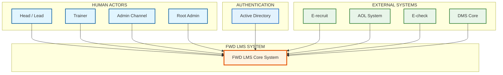
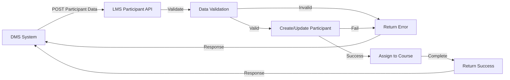
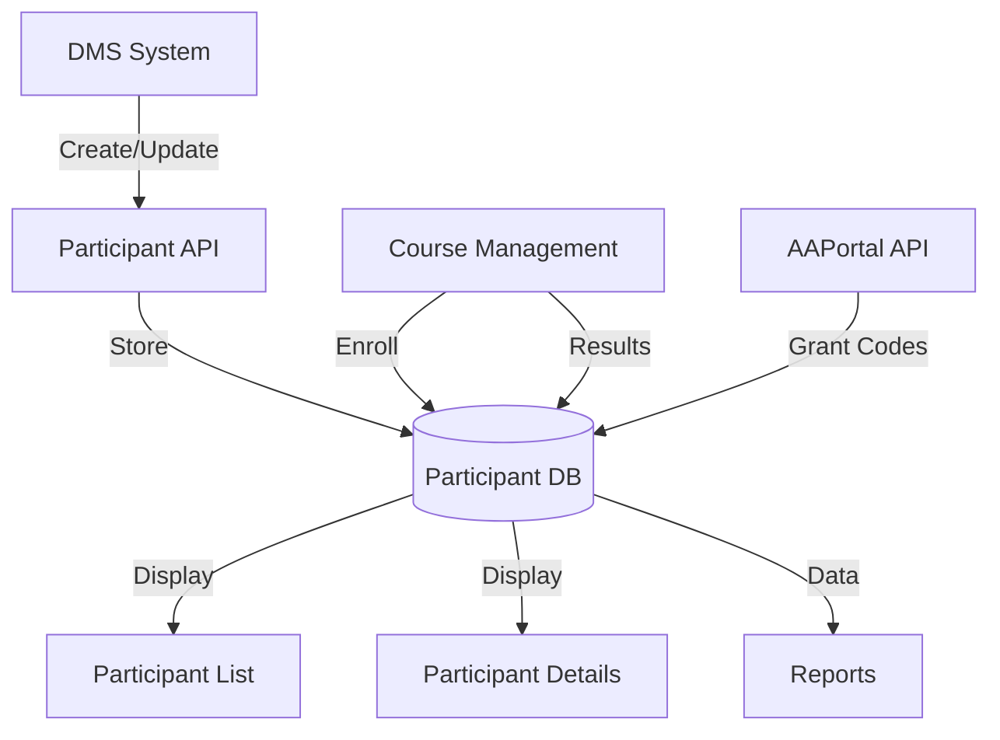
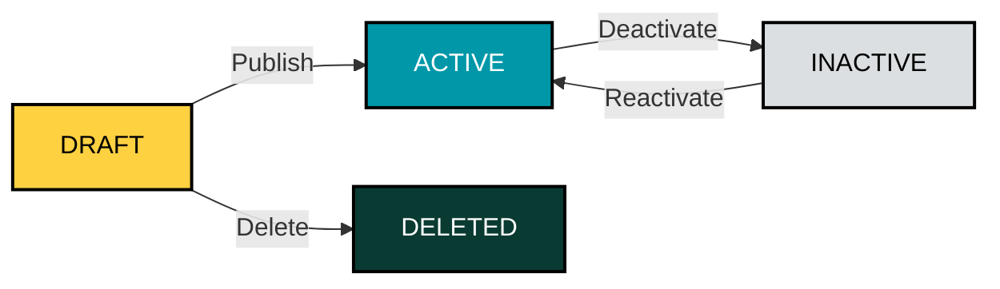
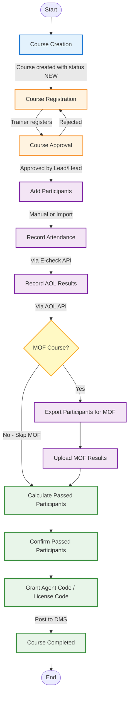
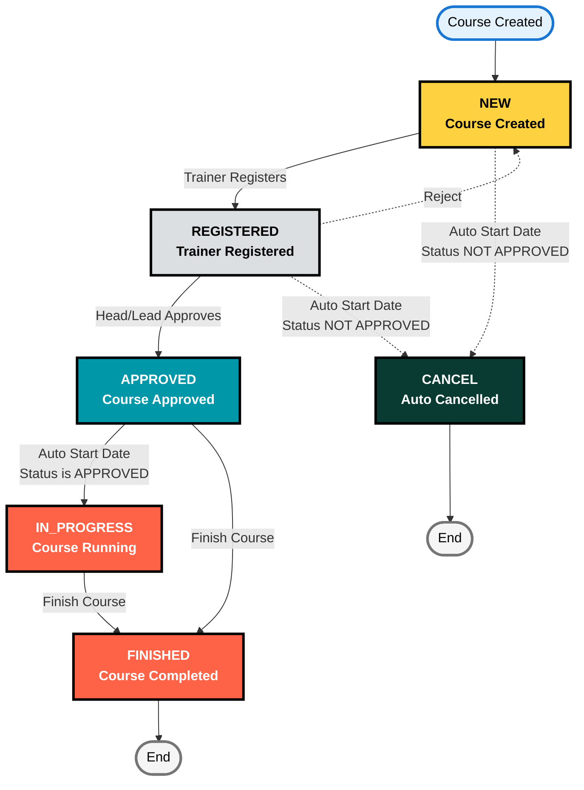
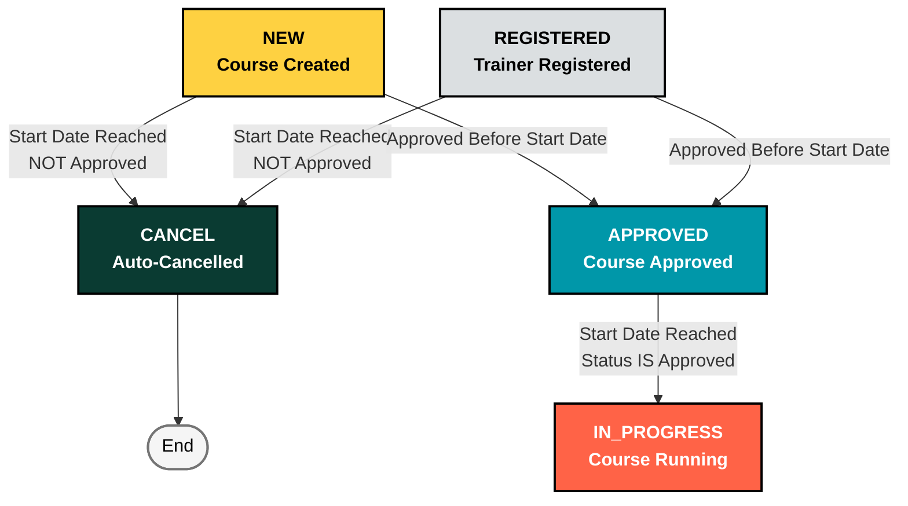

# FUNCTIONAL REQUIREMENT SPECIFICATIONS

**Authors:** Diem Ha

---

## TABLE OF CONTENTS

1. [Abbreviations and Acronyms](#1-abbreviations-and-acronyms) [NOT STARTED]
2. [LMS Architecture Diagram](#2-lms-architecture-diagram) [NOT STARTED]
3. [External Interface Requirements](#3-external-interface-requirements) [NOT STARTED]
4. [Role and User Management](#4-role-and-user-management) [IN REVIEW]
   - 4.1 [List of Roles](#41-list-of-roles)
   - 4.2 [Authorization Matrix by Feature](#42-authorization-matrix-by-feature)
   - 4.3 [User Management](#43-user-management)
     - 4.3.1 [User Creation Screen](#431-user-creation-screen)
     - 4.3.2 [User Listing Page](#432-user-listing-page)
     - 4.3.3 [Login Authentication](#433-login-authentication)
   - 4.4 [Role & Permission Management](#44-role--permission-management)
     - 4.4.1 [Permission Categories and Definitions](#441-permission-categories-and-definitions)
     - 4.4.2 [Default Role Permission Matrix](#442-default-role-permission-matrix)
     - 4.4.3 [Role & Permission Management Screen](#443-role--permission-management-screen)
     - 4.4.4 [Edit Permissions Modal](#444-edit-permissions-modal)
     - 4.4.5 [Permission Management Business Rules](#445-permission-management-business-rules)
     - 4.4.8 [Integration with Other Features](#448-integration-with-other-features)
   - 4.5 [Role-Based Data Filtering](#45-role-based-data-filtering)
     - 4.5.1 [Data Filtering Rules by Role](#451-data-filtering-rules-by-role)
     - 4.5.2 [Dashboard Statistics Filtering](#452-dashboard-statistics-filtering)
     - 4.5.3 [Course List Filtering](#453-course-list-filtering)
     - 4.5.4 [Pending Approvals Filtering](#454-pending-approvals-filtering)
     - 4.5.5 [Approval Workflow Integration](#455-approval-workflow-integration)
5. [Trainer Management](#5-trainer-management) [IN PROGRESS]
   - 5.1 [Trainer Creation Page](#51-trainer-creation-page)
   - 5.2 [Trainer Listing Page](#52-trainer-listing-page)
   - 5.3 [Trainer Details Page](#53-trainer-details-page)
6. [Participant Management](#6-participant-management) [IN PROGRESS]
   - 6.1 [Integration](#61-integration)
   - 6.2 [Participant List](#62-participant-list)
   - 6.3 [Participant Details Page](#63-participant-details-page)
7. [Content Management](#7-content-management) [IN REVIEW]
   - 7.1 [Modules](#71-modules)
     - 7.1.1 [Module Data Structure](#711-module-data-structure)
     - 7.1.2 [Module Listing Page](#712-module-listing-page)
     - 7.1.3 [Module Creation Form](#713-module-creation-form)
     - 7.1.4 [Module Details Page](#714-module-details-page)
     - 7.1.5 [Module Status Management](#715-module-status-management)
     - 7.1.6 [Module Clone Functionality](#716-module-clone-functionality)
     - 7.1.7 [Module Delete Functionality](#717-module-delete-functionality)
     - 7.1.8 [Module Integration Points](#718-module-integration-points)
     - 7.1.9 [Module Authorization Matrix](#719-module-authorization-matrix)
     - 7.1.10 [Module Validation Rules](#7110-module-validation-rules)
   - 7.2 [Product](#72-product)
     - 7.2.1 [Product Data Structure](#721-product-data-structure)
     - 7.2.2 [Product Listing Page](#722-product-listing-page)
     - 7.2.3 [Product Details Page](#723-product-details-page)
     - 7.2.4 [Product Creation](#724-product-creation)
     - 7.2.5 [Product Status Management](#725-product-status-management)
     - 7.2.6 [Product Clone Functionality](#726-product-clone-functionality)
     - 7.2.7 [Product Delete Functionality](#727-product-delete-functionality)
     - 7.2.8 [Product Integration Points](#728-product-integration-points)
     - 7.2.9 [Product Authorization Matrix](#729-product-authorization-matrix)
     - 7.2.10 [Product Validation Rules](#7210-product-validation-rules)
   - 7.3 [Program](#73-program)
     - 7.3.1 [Program Data Structure](#731-program-data-structure)
     - 7.3.2 [Program Management Features](#732-program-management-features)
     - 7.3.3 [Program Status Management](#733-program-status-management)
     - 7.3.4 [Program Integration Points](#734-program-integration-points)
     - 7.3.5 [Future Enhancements](#735-future-enhancements)
8. [Course Management](#8-course-management) [IN REVIEW]
   - 8.1 [Course Creation](#81-course-creation)
     - 8.1.1 [Course Creation Form](#811-course-creation-form)
       - 8.1.1.1 [Dynamic Form Behavior Based on Course Type](#8111-dynamic-form-behavior-based-on-course-type)
       - 8.1.1.2 [SHINE Form Fields](#8112-shine-form-fields)
       - 8.1.1.3 [Product Form Fields](#8113-product-form-fields)
       - 8.1.1.4 [Skill Form Fields](#8114-skill-form-fields)
       - 8.1.1.5 [Course Code Generation Logic](#8115-course-code-generation-logic)
       - 8.1.1.6 [Status Transition Logic](#8116-status-transition-logic)
       - 8.1.1.7 [Checklist Template Application](#8117-checklist-template-application)
       - 8.1.1.8 [Co-trainer Management](#8118-co-trainer-management)
     - 8.1.2 [Entry Points](#812-entry-points)
     - 8.1.3 [Validation & Error Handling](#813-validation--error-handling)
   - 8.2 [Course Listing Screen](#82-course-listing-screen)
     - 8.2.1 [Course List View](#821-course-list-view)
     - 8.2.2 [Filter & Search](#822-filter--search)
     - 8.2.3 [Export Courses](#823-export-courses)
   - 8.3 [Course Details Screen](#83-course-details-screen)
     - 8.3.1 [Course General Tab](#831-course-general-tab)
       - 8.3.1.1 [Course Status Timeline](#8311-course-status-timeline)
       - 8.3.1.2 [Course Approval Actions](#8312-course-approval-actions)
     - 8.3.2 [Course History](#832-course-history)
     - 8.3.3 [Course Planning Tab](#833-course-planning-tab)
     - 8.3.4 [Course Participant Tab](#834-course-participant-tab)
   - 8.4 [Course Registration](#84-course-registration)
     - 8.4.1 [Registration Process](#841-registration-process)
     - 8.4.2 [Registration Approval Workflow](#842-registration-approval-workflow)
     - 8.4.3 [Auto-Cancellation Rule](#843-auto-cancellation-rule)
   - 8.5 [Course Edit](#85-course-edit)
     - 8.5.1 [Edit Authorization Matrix](#851-edit-authorization-matrix)
     - 8.5.2 [Edit Approval Workflow](#852-edit-approval-workflow)
     - 8.5.3 [Field-Level Restrictions](#853-field-level-restrictions)
   - 8.6 [Course Cancel](#86-course-cancel)
     - 8.6.1 [Cancel Authorization Matrix](#861-cancel-authorization-matrix)
     - 8.6.2 [Cancel Approval Workflow](#862-cancel-approval-workflow)
     - 8.6.3 [Direct Cancellation (No Approval)](#863-direct-cancellation-no-approval)
     - 8.6.4 [Business Rules](#864-business-rules)
   - 8.7 [Course Delete](#87-course-delete)
     - 8.7.1 [Delete Authorization Matrix](#871-delete-authorization-matrix)
     - 8.7.2 [Delete Workflow](#872-delete-workflow)
   - 8.8 [Course Operations](#88-course-operations)
     - 8.8.1 [Course Participant List](#881-course-participant-list)
     - 8.8.2 [Add Participant to Course with Import File](#882-add-participant-to-course-with-import-file)
     - 8.8.3 [Add Participant to Course Manually](#883-add-participant-to-course-manually)
     - 8.8.4 [Export Participants](#884-export-participants)
     - 8.8.5 [Export Participants for MOF Exam](#885-export-participants-for-mof-exam)
     - 8.8.6 [Import MOF Exam Result](#886-import-mof-exam-result)
     - 8.8.7 [Confirm Passed Participant](#887-confirm-passed-participant)
     - 8.8.8 [Export Passed Participant](#888-export-passed-participant)
     - 8.8.9 [Attendance Check](#889-attendance-check)
     - 8.8.10 [AOL Exam Result](#8810-aol-exam-result)
     - 8.8.11 [Configurable Final Result Calculation Rules](#8811-configurable-final-result-calculation-rules)
     - 8.8.12 [Manually Set Passed/Failed](#8812-manually-set-passedfailed)
     - 8.8.13 [Grant Agent Code](#8813-grant-agent-code)
   - 8.9 [Course MOF addresses registration and participant allocation](#89-course-mof-addresses-registration-and-participant-allocation)
   - 8.10 [Course Import Function [PHASE 2]](#810-course-import-function-phase-2)
9. [PIC Calendar](#9-pic-calendar) [IN PROGRESS]
   - 9.1 [View Courses Per Trainer](#91-view-courses-per-trainer)
     - 9.1.1 [Matrix Calendar Layout](#911-matrix-calendar-layout)
     - 9.1.2 [Course Display in Calendar Cells](#912-course-display-in-calendar-cells)
     - 9.1.3 [Trainer Display Customization](#913-trainer-display-customization)
     - 9.1.4 [Filter Options](#914-filter-options)
     - 9.1.5 [Role-Based Authorization](#915-role-based-authorization)
     - 9.1.6 [Trainer Workload Tooltip](#916-trainer-workload-tooltip)
     - 9.1.7 [Interactive Features](#917-interactive-features)
     - 9.1.8 [Month Navigation](#918-month-navigation)
     - 9.1.9 [Empty State Handling](#919-empty-state-handling)
     - 9.1.10 [Default Screen After Login](#9110-default-screen-after-login)
   - 9.2 [View Trainer Assignment for Each Trainer](#92-view-trainer-assignment-for-each-trainer)
   - 9.3 [Export PIC Calendar Data](#93-export-pic-calendar-data)
10. [Master Calendar](#10-master-calendar) [IN PROGRESS]
    - 10.1 [View Courses in Master Calendar](#101-view-courses-in-master-calendar)
      - 10.1.1 [Matrix Calendar Layout](#1011-matrix-calendar-layout)
      - 10.1.2 [Course Display in Calendar Cells](#1012-course-display-in-calendar-cells)
      - 10.1.3 [Program Display Customization](#1013-program-display-customization)
      - 10.1.4 [Filter Options](#1014-filter-options)
      - 10.1.5 [Month Navigation](#1015-month-navigation)
      - 10.1.6 [Interactive Features](#1016-interactive-features)
      - 10.1.7 [Empty State Handling](#1017-empty-state-handling)
      - 10.1.9 [Performance Optimization](#1019-performance-optimization)
      - 10.1.11 [Program-Based Course Creation](#10111-program-based-course-creation)
    - 10.2 [Create Course in Master Calendar](#102-create-course-in-master-calendar)
    - 10.3 [Other Actions in Master Calendar](#103-other-actions-in-master-calendar)
      - 10.3.1 [Course Registration](#1031-course-registration)
      - 10.3.2 [Course Edit](#1032-course-edit)
      - 10.3.3 [Course Delete](#1033-course-delete)
      - 10.3.4 [View Details](#1034-view-details)
      - 10.3.5 [Export Course](#1035-export-course)
11. [List Manage](#11-list-manage) [IN PROGRESS]
12. [Configuration](#12-configuration)
    - 12.1 [Course Configuration](#121-course-configuration)
      - 12.1.1 [Course Type Checklist Configuration](#1211-course-type-checklist-configuration)
        - 12.1.1.1 [Course Checklist by Course Type Definition](#12111-course-checklist-by-course-type-definition)
        - 12.1.1.2 [Email and Notification](#12112-email-and-notification)
          - 12.1.1.2.1 [Checklist Notification](#121121-checklist-notification)
          - 12.1.1.2.2 [Checklist Notification Templates](#121122-checklist-notification-templates)
        - 12.1.1.3 [Show Course Checklist in Course Details](#12113-show-course-checklist-in-course-details)
          - 12.1.1.3.1 [Course Checklist Details and Actions](#121131-course-checklist-details-and-actions)
          - 12.1.1.3.2 [Business Rules](#121132-business-rules)
        - 12.1.1.4 [Authorization Matrix](#12114-authorization-matrix)
      - 12.1.2 [Date Rule Configuration](#1212-date-rule-configuration)
    - 12.2 [Holiday Calendar Configuration](#122-holiday-calendar-configuration)
13. [Report Management [PHASE 2]](#13-report-management-phase-2) [NOT STARTED]
    - 13.1 [SHINE PASS RATIO](#131-shine-pass-ratio)
    - 13.2 [SHINE TRAINING](#132-shine-training)
    - 13.3 [PARTICIPANT OF TRAINERS](#133-participant-of-trainers)
    - 13.4 [RECRUITMENT SHINE](#134-recruitment-shine)
    - 13.5 [DANH SACH DANG KY MOF](#135-danh-sach-dang-ky-mof)
    - 13.6 [PASS RATIO BY MONTH](#136-pass-ratio-by-month)
    - 13.7 [GIO BAY TRAINER](#137-gio-bay-trainer)
    - 13.8 [ATTENDANCE REPORT](#138-attendance-report)
    - 13.9 [REPORT FOR FWD AGENT TRAINING ACTIVITY](#139-report-for-fwd-agent-training-activity)
    - 13.10 [SHINE REPORT](#1310-shine-report)
    - 13.11 [FWT TRAINER PAYSLIP](#1311-fwt-trainer-payslip)
    - 13.12 [EXAM FEE TOTAL](#1312-exam-fee-total)
13. [General Setting](#14-general-setting)
    - 14.1 [SMTP Settings](#141-smtp-settings)

---

## 1. ABBREVIATIONS AND ACRONYMS

| Term / Acronym | Description                                  |
| -------------- | -------------------------------------------- |
| AS Portal      | Agent Support Portal                         |
| DMS            | The core system of FWD                       |
| E-check        | The system to check participant's attendance |
| AOL            | AOL exam that participant will need to take when attending the MOF and Product Course                                          |
| AD             | Agent Admin, manager of Agent                |
| MOF            | Ministry of Finance                          |
| LMS            | Learning Management System                   |
| API            | Application Programming Interface            |
| PIC            | Person In Charge                             |
| RBAC           | Role-Based Access Control                    |
| SMTP           | Simple Mail Transfer Protocol                |
| UI             | User Interface                               |
| UX             | User Experience                              |

---

## 2. LMS ARCHITECTURE DIAGRAM

### 2.1 System Overview

The FWD LMS is a training management platform that connects internal users with external systems to manage the complete training lifecycle.



### 2.2 User Roles and Responsibilities

| Role | Key Functions |
|------|---------------|
| **Head / Lead** | Create courses, Approve course register/edit/cancel requests, Master data configuration, General settings |
| **Trainer** | View calendars/courses, Create/edit courses, Register for courses |
| **Admin Channel** | Input MOF class code, Export participants for MOF, Upload MOF results, Confirm passed participants |
| **Root Admin** | System administration, User management, Role and permission management |

### 2.3 External System Integrations

| System | Purpose | Integration Type |
|--------|---------|------------------|
| **E-recruit** | Post participant data | API (POST) |
| **AOL System** | Post AOL exam results | API (POST) |
| **E-check** | Post attendance check | API (POST) |
| **DMS Core** | Grant agent code, Get course status | API (POST/GET) |
| **Active Directory** | User authentication | LDAP/SSO |

### 2.2 API Integration Summary

| #  | External System | API Endpoint                               | Method | Purpose                                 |
|----|-----------------|---------------------------------------------|--------|-----------------------------------------|
| ①  | DMS             | `/api/external/participant/create`          | POST   | Create and assign participant to course |
| ②  | E-Recruiter     | `/api/external/course/courseList`           | GET    | Get list of courses by date             |
| ③  | AOL System      | `/api/external/course/updateAOLExam`        | POST   | Update AOL exam results                 |
| ④  | AA Portal       | `/api/external/AAPortal/licenseShine`       | POST   | Grant agent/license codes               |
| ⑤  | DMS             | `/api/external/course/courseStatus/{code}`  | GET    | Get course status by code               |
| ⑥  | DMS             | `/api/external/course/delete/{code}/{id}`   | DELETE | Delete participant from course          |
| ⑦  | E-check         | `/api/external/course/updateAttendance`     | POST   | Update attendance data for participants |

### 2.3 Key System Modules

| Module | Description |
|--------|-------------|
| **User Management** | User accounts, roles, and permissions |
| **Trainer Management** | Trainer profiles and assignments |
| **Participant Management** | Participant data and enrollment |
| **Content Management** | Modules, Products, and Programs |
| **Course Management** | Course creation, operations, and workflows |
| **Calendar Views** | PIC Calendar and Master Calendar |
| **Checklist Workflow** | Course type checklists and reminders |
| **Reporting** | Various reports and exports |

---

## 3. EXTERNAL INTERFACE REQUIREMENTS

[Content will be copied from original document - Section 3]
Seperated Document for API specification named: LMS_External_APIs_Document_Specification
---

## 4. ROLE AND USER MANAGEMENT

Admin can manage role and user role via a menu in LMS UI. This menu only allows admin role to access and modify data.

### 4.1 List of Roles

| No  | Role         | Description                                                               |
| --- | ------------ | ------------------------------------------------------------------------- |
| 1   | TRAINER      | Assign to users who are trainers                                          |
| 2   | LEAD_REGION  | Assign to users who are lead of region                                    |
| 3   | HEAD_CHANNEL | Assign to users who are head of channel                                   |
| 4   | DMS_ADMIN    | Assign to user who wants to access LMS to get the Passed participant list |
| 5   | MASTER_ROLE  | This role can break the predefined business rule                          |
| 6   | ADMIN        | This role is assigned to admin channel to perform the tasks in LMS course |
| 7   | ROOT_ADMIN   | LMS Administration role                                                   |

### 4.2 Authorization Matrix by Feature

| No  | Features/Roles                           | TRAINER | LEAD_REGION | HEAD_CHANNEL | DMS_ADMIN | MASTER_ROLE | ADMIN | ROOT_ADMIN |
| --- | ---------------------------------------- | ------- | ----------- | ------------ | --------- | ----------- | ----- | ---------- |
| 1   | View PIC Calendar                        | x       | x           | x            | x         | x           | x     | x          |
| 2   | View Master Calendar                     | x       | x           | x            | x         | x           | x     | x          |
| 3   | Create course                            | x       | x           | x            |           |             |       |            |
| 4   | Import course and view history import    |         | x           | x            |           |             |       |            |
| 5   | View/export course list/details course   | x       | x           | x            | x         | x           | x     | x          |
| 6   | Register course                          | x       |             |              |           |             |       |            |
| 7   | Edit course                              | x       | x           | x            |           | x           | x     |            |
| 8   | Import MOF exam result                   |         |             |              |           | x           | x     |            |
| 9   | Import participant                       |         |             |              |           | x           | x     |            |
| 10  | Add participant                          |         |             |              |           | x           | x     |            |
| 11  | Confirm passed participant               |         |             |              |           |             | x     |            |
| 12  | Export participant                       |         |             |              | x         |             |       |            |
| 13  | Finish course                            |         |             |              |           | x           | x     |            |
| 14  | Cancel course                            | x       | x           | x            |           |             |       |            |
| 15  | Delete course                            | x       | x           | x            |           |             |       |            |
| 16  | Approve register/edit/cancel request     |         | x           | x            |           | x           |       |            |
| 17  | Create/clone program/products/modules    |         |             |              |           | x           | x     | x          |
| 18  | View program/product/module list/details |         |             |              |           | x           | x     | x          |
| 19  | View/edit Channel setting                |         |             |              |           | x           | x     | x          |
| 20  | View/edit/delete course template         |         |             |              |           | x           | x     | x          |
| 21  | Participant management                   |         | x           | x            |           | x           | x     | x          |
| 22  | Trainer management                       |         | x           | x            |           | x           | x     | x          |
| 23  | Admin management                         |         | x           | x            |           | x           | x     | x          |
| 24  | List manage                              |         |             |              |           | x           | x     | x          |
| 25  | Report management                        |         | x           | x            |           | x           | x     | x          |
| 26  | Role and Permission                      |         |             |              |           |             |       | x          |
| 27  | General setting                          |         |             |              |           | x           | x     | x          |

### 4.3 User Management

#### 4.3.1 User Creation Screen

**User Story:**  
AS AN Root Admin  
I CAN create new user in LMS system  
SO THAT users can login in to LMS system (only users requiring system access need accounts)

**Acceptance Criteria:**

- There will be an ADD NEW button to open add new user screen

**Data Requirements:**

| Field        | M/O | Data Type | Description                                                                                                       | Data Example  |
| ------------ | --- | --------- | ----------------------------------------------------------------------------------------------------------------- | ------------- |
| Email        | M   | String    | Email needs to be validated                                                                                       | lms@gmail.com |
| User Name    | M   | String    |                                                                                                                   | Head_agency   |
| Team         | M   | Dropdown  | Dropdown list include: Admin, Trainer, None                                                                       |               |
| System Roles | M   | Selection | Multiple roles can be added to user: Trainer, Lead Region, Head Channel, Master Role, Admin, Root Admin, WFT none |               |

#### 4.3.2 User Listing Page

**User Story:**  
AS a Root Admin user  
I CAN access the user listing page  
SO THAT I can search, view, edit, delete user in the LMS system

**Acceptance Criteria:**

1. **Search field** which allows searching by:

   - User's name
   - Email address

2. **View user list** with the following information:

   - The list shows: ID/Username/Email/Roles/Created date
   - Sort: default sorting by created date (Descending order)

3. **Action:** Edit/delete

#### 4.3.3 Login Authentication

**User Story:**  
AS an LMS user with system access  
I CAN login to LMS system
SO THAT I can view calendar, create course, or do other tasks according to my role

**Acceptance Criteria:**

- In login screen user enters username and password then click login button
- System validates user's name and password, return error message for the invalid user's name or password with AD authentication
- After enter username/password and click on login button, LMS calls AD to verify login credential
- If the input data is correct, then user can arrive LMS PIC Calendar screen
- If the inputted data is incorrect, then return the error message: "Invalid username or password"
- There are no limited times that user enter can enter the wrong password
- External contractors do not have access to LMS system and do not require user accounts
- **Role Display:** After successful login, user's current role is displayed in the header. For users with multiple assigned roles, a dropdown selector allows switching between roles. For users with a single role, the role is displayed as static text. Users can only switch between roles that are assigned to their account.

### 4.4 Role & Permission Management

**User Story:**  
AS A Root Admin  
I NEED to configure permissions for each role in the system  
SO THAT I can control what actions each role can perform and maintain proper access control

**Business Use Cases:**
- Root Admin configures permissions for new organizational structure
- Root Admin adjusts role permissions after business process changes
- Root Admin reviews and updates role capabilities to ensure compliance
- Root Admin manages system access control centrally

---

#### 4.4.1 Permission Categories and Definitions

The system organizes permissions into six functional categories based on the Authorization Matrix (Section 4.2):

**Permission Structure:**

| Permission ID | Feature Name | Category | Description | Roles with Permission |
|---------------|--------------|----------|-------------|----------------------|
| `view_pic_calendar` | View PIC Calendar | Calendar | View courses per trainer | All roles |
| `view_master_calendar` | View Master Calendar | Calendar | View all courses in calendar | All roles |
| `create_course` | Create course | Course Management | Create new courses | Trainer, Lead Region, Head Channel |
| `import_course` | Import course | Course Management | Bulk import courses and view history | Lead Region, Head Channel |
| `view_course` | View/export course | Course Management | View course list/details and export | All roles |
| `register_course` | Register course | Course Management | Register as primary trainer | Trainer only |
| `edit_course` | Edit course | Course Management | Edit course details | Trainer, Lead Region, Head Channel, Master Role, Admin |
| `import_mof_result` | Import MOF exam result | Participant Management | Import MOF exam results | Master Role, Admin |
| `import_participant` | Import participant | Participant Management | Bulk import participants | Master Role, Admin |
| `add_participant` | Add participant | Participant Management | Add individual participants | Master Role, Admin |
| `confirm_passed` | Confirm passed participant | Participant Management | Confirm passed participants | Admin only |
| `export_participant` | Export participant | Participant Management | Export participant lists | DMS Admin only |
| `finish_course` | Finish course | Course Management | Mark course as finished | Master Role, Admin |
| `cancel_course` | Cancel course | Course Management | Cancel courses | Trainer, Lead Region, Head Channel |
| `delete_course` | Delete course | Course Management | Delete courses | Trainer, Lead Region, Head Channel |
| `approve_course` | Approve register/edit/cancel | Course Management | Approve course actions | Lead Region, Head Channel, Master Role |
| `self_approval` | Self Approval | Course Management | Actions are auto-approved without requiring approval workflow | Head Channel (default) |
| `manage_program` | Create/clone program | Content Management | Create/clone programs/products/modules | Master Role, Admin, Root Admin |
| `view_program` | View program | Content Management | View program/product/module details | Master Role, Admin, Root Admin |
| `manage_channel` | View/edit Channel setting | Admin | View/edit channel settings | Master Role, Admin, Root Admin |
| `manage_template` | View/edit/delete template | Admin | View/edit/delete course templates | Master Role, Admin, Root Admin |
| `manage_participant` | Participant management | Admin | Full participant management | Lead Region, Head Channel, Master Role, Admin, Root Admin |
| `manage_trainer` | Trainer management | Admin | Manage trainer profiles | Lead Region, Head Channel, Master Role, Admin, Root Admin |
| `manage_admin` | Admin management | Admin | Manage admin users | Lead Region, Head Channel, Master Role, Admin, Root Admin |
| `manage_list` | List manage | Admin | Manage master data lists | Master Role, Admin, Root Admin |
| `view_reports` | Report management | Report | View and generate reports | Lead Region, Head Channel, Master Role, Admin, Root Admin |
| `manage_roles` | Role and Permission | Admin | Manage roles and permissions | Root Admin only |
| `general_settings` | General setting | Admin | Configure system settings | Master Role, Admin, Root Admin |

---

#### 4.4.2 Default Role Permission Matrix

Based on the Authorization Matrix (Section 4.2), the default permissions for each role are:

| Role | Permissions Assigned | Total Count |
|------|---------------------|-------------|
| **TRAINER** | view_pic_calendar, view_master_calendar, create_course, view_course, register_course, edit_course, cancel_course, delete_course | 8 |
| **LEAD_REGION** | view_pic_calendar, view_master_calendar, create_course, import_course, view_course, edit_course, approve_course, cancel_course, delete_course, manage_participant, manage_trainer, manage_admin, view_reports | 13 |
| **HEAD_CHANNEL** | view_pic_calendar, view_master_calendar, create_course, import_course, view_course, edit_course, approve_course, self_approval, cancel_course, delete_course, manage_participant, manage_trainer, manage_admin, view_reports | 14 |
| **DMS_ADMIN** | view_pic_calendar, view_master_calendar, view_course, export_participant | 4 |
| **MASTER_ROLE** | view_pic_calendar, view_master_calendar, view_course, edit_course, import_mof_result, import_participant, add_participant, finish_course, approve_course, manage_program, view_program, manage_channel, manage_template, manage_participant, manage_trainer, manage_admin, manage_list, view_reports, general_settings | 19 |
| **ADMIN** | view_pic_calendar, view_master_calendar, view_course, edit_course, import_mof_result, import_participant, add_participant, confirm_passed, finish_course, manage_program, view_program, manage_channel, manage_template, manage_participant, manage_trainer, manage_admin, manage_list, view_reports, general_settings | 19 |
| **ROOT_ADMIN** | view_pic_calendar, view_master_calendar, view_course, manage_program, view_program, manage_channel, manage_template, manage_participant, manage_trainer, manage_admin, manage_list, view_reports, manage_roles, general_settings | 14 |

**Key Notes:**
- **Register Course (Feature #6)**: Only Trainer has this permission per original specification
- **Create Course (Feature #3)**: Trainer, Lead Region, Head Channel only (Root Admin does NOT have this permission per original specification)
- **Edit Course (Feature #7)**: Root Admin does NOT have this permission per original specification
- **Manage Roles (Feature #26)**: Exclusive to Root Admin for system security
- **Export Participant (Feature #12)**: Exclusive to DMS Admin per original specification

---

#### 4.4.3 Role & Permission Management Screen

**Access:**
- **URL:** `/roles`
- **Menu:** Admin → Role & Permissions
- **Authorization:** Root Admin only

**Purpose:**
Root Admin can view and modify permissions for each role through a centralized management interface.

**Screen Layout:**

```
┌─────────────────────────────────────────────────────────────────┐
│ Role & Permission Management                                 │
├─────────────────────────────────────────────────────────────────┤
│                                                                  │
│ Configure what each role can do in the system. System roles │
│    cannot be deleted.                                           │
│                                                                  │
│ ━━━━━━━━━━━━━━━━━━━━━━━━━━━━━━━━━━━━━━━━━━━━━━━━━━━━━━━━━━━━ │
│                                                                  │
│ Role List                                                       │
│                                                                  │
│ ┌───────────────────────────────────────────────────────────┐ │
│ │ TRAINER                                                 │ │
│ │ System Role • 8 permissions assigned                      │ │
│ │ Assign to users who are trainers                          │ │
│ │                                        [Edit Permissions] │ │
│ └───────────────────────────────────────────────────────────┘ │
│                                                                  │
│ ┌───────────────────────────────────────────────────────────┐ │
│ │ LEAD_REGION                                            │ │
│ │ System Role • 13 permissions assigned                     │ │
│ │ Assign to users who are lead of region                    │ │
│ │                                        [Edit Permissions] │ │
│ └───────────────────────────────────────────────────────────┘ │
│                                                                  │
│ [... other roles ...]                                           │
│                                                                  │
└─────────────────────────────────────────────────────────────────┘
```

**Functional Requirements:**

1. **Role List Display:**
   - Display all 7 system roles
   - Show role name, description, and permission count
   - All roles are system roles (cannot be deleted)
   - Only Root Admin can access this screen

2. **Edit Permissions Action:**
   - Click "Edit Permissions" button to modify role permissions
   - Opens modal with permission checklist grouped by category
   - Root Admin can add/remove permissions for any role
   - Changes take effect immediately for all users with that role

3. **Permission Display:**
   - Permissions grouped by category (Calendar, Course Management, Participant Management, Content Management, Report, Admin)
   - Checkbox selection for each permission
   - Permission description displayed
   - Summary shows total permissions selected

---

#### 4.4.4 Edit Permissions Modal

When Root Admin clicks "Edit Permissions" on a role, a modal displays all available permissions with checkbox selection.

**Modal Structure:**

```
┌─────────────────────────────────────────────────────────────────┐
│ Edit Permissions: TRAINER                                  [✕]  │
├─────────────────────────────────────────────────────────────────┤
│                                                                  │
│ Role Name: TRAINER                                              │
│ Description: Assign to users who are trainers                   │
│ Type: System Role (cannot be deleted)                        │
│                                                                  │
│ ━━━━━━━━━━━━━━━━━━━━━━━━━━━━━━━━━━━━━━━━━━━━━━━━━━━━━━━━━━━━ │
│                                                                  │
│ Permissions (Select all that apply)                             │
│                                                                  │
│ 📅 CALENDAR PERMISSIONS                                         │
│ [X] View PIC Calendar - View courses per trainer                 │
│ [X] View Master Calendar - View all courses in calendar          │
│                                                                  │
│ 📚 COURSE MANAGEMENT PERMISSIONS                                │
│ [X] Create course - Create new courses                           │
│ ☐ Import course - Bulk import courses                          │
│ [X] View course - View course information                        │
│ [X] Register course - Register as primary trainer                │
│ [X] Edit course - Edit course details                            │
│ [X] Cancel course - Cancel courses                               │
│ [X] Delete course - Delete courses                               │
│ ☐ Approve course - Approve course actions                      │
│ ☐ Finish course - Mark course as finished                      │
│                                                                  │
│ PARTICIPANT MANAGEMENT PERMISSIONS                           │
│ ☐ Import MOF result - Import MOF exam results                  │
│ ☐ Import participant - Bulk import participants                │
│ ☐ Add participant - Add individual participants                │
│ ☐ Confirm passed - Confirm passed participants                 │
│ ☐ Export participant - Export participant lists                │
│                                                                  │
│ 📖 CONTENT MANAGEMENT PERMISSIONS                               │
│ ☐ Manage program - Create/clone programs/products/modules      │
│ ☐ View program - View program/product/module details           │
│                                                                  │
│ 📊 REPORT PERMISSIONS                                           │
│ ☐ View reports - View and generate reports                     │
│                                                                  │
│ ADMIN PERMISSIONS                                            │
│ ☐ Manage channel - View/edit channel settings                  │
│ ☐ Manage template - View/edit/delete course templates          │
│ ☐ Manage participant - Full participant management             │
│ ☐ Manage trainer - Manage trainer profiles                     │
│ ☐ Manage admin - Manage admin users                            │
│ ☐ Manage list - Manage master data lists                       │
│ ☐ Manage roles - Manage roles and permissions                  │
│ ☐ General settings - Configure system settings                 │
│                                                                  │
│ ━━━━━━━━━━━━━━━━━━━━━━━━━━━━━━━━━━━━━━━━━━━━━━━━━━━━━━━━━━━━ │
│                                                                  │
│ Summary: 8 of 27 permissions selected                          │
│                                                                  │
│                                          [Cancel] [Save Changes]│
└─────────────────────────────────────────────────────────────────┘
```

**Functional Requirements:**

1. **Permission Checklist:**
   - All 27 permissions displayed grouped by category
   - Checkbox for each permission
   - Permission description displayed inline
   - Current role permissions pre-checked

2. **Permission Selection:**
   - Click checkbox to add/remove permission
   - Summary updates in real-time
   - No minimum permission requirement (can remove all)
   - Warning displayed if removing critical permissions

3. **Save Changes:**
   - Click "Save Changes" to update role permissions
   - Changes saved to `data/roles.json`
   - Success message displayed
   - Modal closes automatically
   - All users with this role immediately affected (or upon next login)

---

#### 4.4.5 Permission Management Business Rules

**1. System Role Protection:**
- All 7 roles (Trainer, Lead Region, Head Channel, DMS Admin, Master Role, Admin, Root Admin) are system roles
- System roles cannot be deleted
- System roles can have permissions modified by Root Admin
- Role names and descriptions cannot be changed for system roles

**2. Permission Assignment:**
- Root Admin can assign/remove any permission to/from any role
- Changes take effect immediately for all users with that role
- Permission changes are logged in system audit trail
- Users must log out and log back in to see permission changes (or refresh session)

**3. Validation Rules:**
- No minimum permission requirement (roles can have zero permissions)
- Cannot remove "Manage Roles" permission from Root Admin (system protection)
- Warning displayed if removing critical permissions (e.g., removing "View Course" from Trainer)

**4. Authorization Check:**
- Only Root Admin can access Role & Permission Management screen
- Other roles see "Access Denied" if attempting to access `/roles`
- Permission checks performed at API level for security

**5. Audit Trail:**
- All permission changes recorded with:
  - Role name
  - Permission added/removed
  - User who made the change (Root Admin)
  - Timestamp
  - Reason (optional)

---

#### 4.4.8 Integration with Other Features

**Course Registration (Section 8.4):**
- `register_course` permission required to register for courses
- Only Trainer has this permission per original specification
- Permission check performed before displaying registration button

**Course Approval (Section 8.4.2):**
- `approve_course` permission required to approve registrations
- Lead Region, Head Channel, and Master Role have this permission
- Permission check performed in approval workflow

**Course Auto-Approval (Section 8.4, 8.5, 8.6):**
- `self_approval` permission enables auto-approval for all course actions
- Users with `self_approval` permission skip approval workflow
- Permission can be assigned at role level or user level
- Default: Head Channel role has `self_approval` permission
- System checks permission before creating approval requests

**Course Edit (Section 8.5):**
- `edit_course` permission required to edit courses
- Additional status-based restrictions apply (see Section 8.5.1)
- Permission check combined with status validation
- Root Admin does NOT have edit_course permission per original specification

**Course Creation (Section 8.1):**
- `create_course` permission required to create courses
- Trainer, Lead Region, and Head Channel have this permission
- Root Admin does NOT have create_course permission per original specification

**User Management (Section 4.3):**
- `manage_admin` permission required to create/edit users
- Root Admin has additional `manage_roles` permission
- Permission check performed before accessing user management screens

---

### 4.5 Role-Based Data Filtering

**User Story:**  
AS A user with specific role, channel, and region assignments  
I NEED to see only data relevant to my scope of responsibility  
SO THAT I can focus on courses, participants, trainers, and approvals within my authority

**Business Use Cases:**
- Trainer views only courses they are assigned to
- Lead Region manages courses in their channel and region
- Head Channel oversees all courses in their channel across regions
- Admin/Root Admin access all data for system management
- Master Role has override access to all data

---

#### 4.5.1 Data Filtering Rules by Role

The system applies role-based filtering to ensure users only see data within their scope of authority:

| Role | Course List Filter | Participant List Filter | Trainer List Filter | Pending Approvals Filter |
|------|-------------------|------------------------|--------------------|-----------------------|
| **Trainer** | Courses where user is Primary Trainer or Co-Trainer | Participants in courses where user is trainer | No filter (can view all trainers) | No access (hidden) |
| **Lead Region** | Courses matching user's Channel AND Region | Participants in courses matching user's Channel AND Region | Trainers matching user's Channel AND Region | Courses with status `REGISTERED`, `WAITING_APPROVAL_EDIT`, or `WAITING_APPROVAL_CANCEL` matching user's Channel AND Region |
| **Head Channel** | Courses matching user's Channel (any region) | Participants in courses matching user's Channel | Trainers matching user's Channel | Courses with status `REGISTERED`, `WAITING_APPROVAL_EDIT`, or `WAITING_APPROVAL_CANCEL` matching user's Channel (any region) |
| **Admin** | All courses (no filter) | All participants (no filter) | All trainers (no filter) | No access (no approval permission) |
| **Root Admin** | All courses (no filter) | All participants (no filter) | All trainers (no filter) | No access (no approval permission) |
| **DMS Admin** | All courses (no filter) | All participants (no filter) | No access | No access (no approval permission) |
| **Master Role** | All courses (no filter) | All participants (no filter) | All trainers (no filter) | All courses with status `REGISTERED`, `WAITING_APPROVAL_EDIT`, or `WAITING_APPROVAL_CANCEL` (no filter) |

**Filter Implementation:**
- Filters applied at API level (backend) for security
- Client-side filtering for UI responsiveness
- User's channel and region retrieved from session storage
- Filters combine with search/sort functionality

---

#### 4.5.2 Dashboard Statistics Filtering

Dashboard cards display statistics filtered by user's role and scope:

**1. Active Courses Count:**
   - **Trainer:** Count of courses where user is Primary Trainer or Co-Trainer AND status IN ('APPROVED', 'IN_PROGRESS')
   - **Lead Region:** Count of courses with status IN ('APPROVED', 'IN_PROGRESS') in user's channel + region
   - **Head Channel:** Count of courses with status IN ('APPROVED', 'IN_PROGRESS') in user's channel
   - **Admin/Root Admin/Master Role:** Total count of all courses with status IN ('APPROVED', 'IN_PROGRESS')
   - **DMS Admin:** Total count of all courses with status IN ('APPROVED', 'IN_PROGRESS')

**2. Total Participants Count:**
   - **Trainer:** Count of participants in courses where user is trainer
   - **Lead Region:** Count of participants in courses matching user's channel + region
   - **Head Channel:** Count of participants in courses matching user's channel
   - **Admin/Root Admin/Master Role:** Total count of all participants
   - **DMS Admin:** Total count of all participants

**3. Pending Approvals Count:**
   - **Trainer:** Card hidden (no approval access)
   - **Lead Region:** Count of courses with status `REGISTERED`, `WAITING_APPROVAL_EDIT`, or `WAITING_APPROVAL_CANCEL` in user's channel + region
   - **Head Channel:** Count of courses with status `REGISTERED`, `WAITING_APPROVAL_EDIT`, or `WAITING_APPROVAL_CANCEL` in user's channel
   - **Admin/Root Admin/DMS Admin:** Card hidden (no approval access)
   - **Master Role:** Total count of all courses with status `REGISTERED`, `WAITING_APPROVAL_EDIT`, or `WAITING_APPROVAL_CANCEL`

**4. Total Trainers Count:**
   - **Trainer:** Card hidden or shows total count (no management access)
   - **Lead Region:** Count of trainers matching user's channel + region
   - **Head Channel:** Count of trainers matching user's channel
   - **Admin/Root Admin/Master Role:** Total count of all trainers
   - **DMS Admin:** Card hidden (no trainer management access)

**Dashboard Card Linking:**
- **Active Courses:** Links to Course List filtered by role scope
- **Total Participants:** Links to Participant List filtered by role scope
- **Pending Approvals:** Links to PIC Calendar → Approval screen with combined view of all three approval types (Registration, Edit, Cancel)
- **Total Trainers:** Links to Trainer List filtered by role scope

---

#### 4.5.3 Course List Filtering

**Requirement:**  
Course list page displays only courses within user's scope of authority based on role, channel, and region.

**Filtering Logic:**

1. **Trainer:**
   - Show courses where `primaryTrainer = userId` OR `coTrainer = userId`
   - User can only see courses they are directly involved in
   - Cannot see courses from other trainers

2. **Lead Region:**
   - Show courses where `channel = userChannel` AND `region = userRegion`
   - User sees all courses in their channel and region
   - Includes courses from all trainers in their scope

3. **Head Channel:**
   - Show courses where `channel = userChannel`
   - User sees all courses in their channel across all regions
   - Full channel visibility regardless of region

4. **Admin, Root Admin, Master Role:**
   - Show all courses (no filter applied)
   - Full system visibility for administrative purposes

5. **DMS Admin:**
   - Show all courses (no filter applied)
   - Read-only access for participant export purposes

**Additional Filters:**
- User can further filter by status, course type, date range
- Search functionality works within filtered dataset
- Export function exports only filtered courses

---

#### 4.5.4 Pending Approvals Filtering

**Requirement:**  
Pending approval lists (PIC Calendar → Approval tabs) must show only approval requests within user's approval authority. The system supports three types of approvals: Registration, Edit, and Cancel.

**Approval Types:**

| Approval Type | Course Status | Description | Tab Name |
|--------------|---------------|-------------|----------|
| **Registration Approval** | `REGISTERED` | Trainer has registered for a course, awaiting Head/Lead approval | Approve Registered |
| **Edit Approval** | `WAITING_APPROVAL_EDIT` | Course has been edited, awaiting Head/Lead approval for changes | Approve Edit |
| **Cancel Approval** | `WAITING_APPROVAL_CANCEL` | Course cancellation requested, awaiting Head/Lead approval | Approve Cancel |

**Filtering Logic:**

1. **Lead Region:**
   - Show courses where `channel = userChannel` AND `region = userRegion` AND `status IN ('REGISTERED', 'WAITING_APPROVAL_EDIT', 'WAITING_APPROVAL_CANCEL')`
   - Can approve registration/edit/cancel requests within their channel and region only

2. **Head Channel:**
   - Show courses where `channel = userChannel` AND `status IN ('REGISTERED', 'WAITING_APPROVAL_EDIT', 'WAITING_APPROVAL_CANCEL')`
   - Can approve registration/edit/cancel requests in their channel (all regions)

3. **Master Role:**
   - Show all courses where `status IN ('REGISTERED', 'WAITING_APPROVAL_EDIT', 'WAITING_APPROVAL_CANCEL')`
   - Can approve any request (override authority)

4. **Other Roles:**
   - No access to pending approvals (feature hidden)

**Pending Approvals Count Calculation:**
- Count = Total courses with status `REGISTERED` + `WAITING_APPROVAL_EDIT` + `WAITING_APPROVAL_CANCEL` within user's scope
- Dashboard card shows combined count of all three approval types
- Individual tabs show counts for each type separately

**Business Rules:**
- Only courses with exact status matching approval type appear in respective tabs
- Filtering prevents users from seeing or approving requests outside their authority
- Each approval type has separate workflow and history tracking
- User can see all three types in one consolidated "Pending Approvals" view

**Tab Organization:**
- **Approve Registered Tab:** Shows courses with status `REGISTERED`
- **Approve Edit Tab:** Shows courses with status `WAITING_APPROVAL_EDIT`
- **Approve Cancel Tab:** Shows courses with status `WAITING_APPROVAL_CANCEL`
- All tabs filtered by same channel/region rules based on user's role

**Example Counts:**
- Lead Region (Agency/North): 
  - Registered: 1 course
  - Edit: 2 courses
  - Cancel: 1 course
  - **Total Pending Approvals: 4**

---

#### 4.5.5 Approval Workflow Integration

**Requirement:**  
The Pending Approvals feature integrates with three approval workflows: Registration, Edit, and Cancel. Each workflow has specific status transitions and approval requirements.

**Approval Workflows:**

**1. Registration Approval Workflow:**
- **Trigger:** Trainer registers for a course (Section 8.4)
- **Status Transition:** `NEW` → `REGISTERED` → `APPROVED` (or back to `NEW` if rejected)
- **Approval Tab:** "Approve Registered"
- **Actions Available:** Approve, Reject (with reason)

**2. Edit Approval Workflow:**
- **Trigger:** User edits a course that requires approval (Section 8.5)
- **Status Transition:** Current status → `WAITING_APPROVAL_EDIT` → Original status (or updated if approved)
- **Approval Tab:** "Approve Edit"
- **Actions Available:** Approve Changes, Reject Changes (with reason)
- **Additional Data:** System shows what fields were changed (before/after comparison)

**3. Cancel Approval Workflow:**
- **Trigger:** User requests course cancellation (Section 8.6)
- **Status Transition:** Current status → `WAITING_APPROVAL_CANCEL` → `CANCEL` (or back to original if rejected)
- **Approval Tab:** "Approve Cancel"
- **Actions Available:** Approve Cancellation, Reject Cancellation (with reason)
- **Additional Data:** System shows cancellation reason provided by requester

**Unified Approval Interface:**
- All three approval types accessible from PIC Calendar → Approval button
- Tab navigation allows switching between approval types
- Consistent approval/rejection interface across all types
- All approvals filtered by same role-based rules (channel/region scope)

**Approval Authority:**
- Same approval authority applies to all three types
- Lead Region approves requests in their channel + region
- Head Channel approves requests in their channel
- Master Role can approve any request

**Business Rules:**
- User cannot approve their own requests (self-approval blocked)
- Approval requires mandatory reason/comment for rejection
- Approval actions logged in course history with timestamp and approver
- Email notifications sent to requester after approval/rejection

**Integration Points:**
- **Course Registration (Section 8.4.2):** Registration approval workflow
- **Course Edit (Section 8.5.2):** Edit approval workflow  
- **Course Cancel (Section 8.6.2):** Cancel approval workflow
- **PIC Calendar (Section 9.3):** Consolidated approval interface with three tabs

---

## 5. TRAINER MANAGEMENT

Root Admin, Admin, Lead region, and Head channel can add new trainers and manage trainer profiles via a menu in LMS UI.

---

### 5.1 Trainer Creation

#### 5.1.1 User Story

**AS A** Lead region, Head channel, Admin, Master user, Root Admin  
**I NEED TO** access Trainer creation page in Trainer Management Menu  
**SO THAT** I can create Trainer in LMS system

#### 5.1.2 Access Control

- **Authorized Roles:** Lead Region, Head Channel, Admin, Master Role, Root Admin
- **Entry Point:** "Add New Trainer" button in Trainer Management menu

#### 5.1.3 User Account Linking (Enhanced)

**User Story:**  
**AS A** user creating a trainer profile  
**I NEED** an intuitive way to link the trainer to a user account  
**SO THAT** I can complete the process efficiently without errors or multiple steps

**Enhanced Email Field Behavior:**

1. **Real-time User Lookup:**
   - System performs automatic lookup as user types email
   - Debounced search (300ms delay) to reduce server load
   - Visual feedback during lookup (loading spinner)

2. **Three Possible States:**

   **A. User Found:**
   - Display success indicator (green checkmark)
   - Show user details: Name, Roles, Team, Created Date
   - Option to view full user profile
   - Automatically link on form submission

   **B. User Not Found:**
   - Display warning indicator (yellow alert)
   - Show message: "No user account found with this email"
   - Provide two options:
     - **Quick Create:** Checkbox to auto-create user with defaults
       - Pre-fill username with email
       - Pre-select TRAINER role
       - Select team from dropdown
     - **Advanced Search:** Button to open user search modal

   **C. Ambiguous Match:**
   - Display info indicator (blue info icon)
   - Show list of potential matches
   - Allow user to select correct match
   - Option to refine search

3. **Quick User Creation:**
   - Checkbox: "Create user account automatically"
   - When checked, reveal minimal fields:
     - Username (pre-filled with email)
     - Team (dropdown)
     - Roles (TRAINER pre-selected, read-only)
   - User account created simultaneously with trainer profile
   - Single transaction (rollback if either fails)

4. **Advanced Search Modal:**
   - Opens when "Search Existing Users" clicked
   - Searchable list with filters:
     - Team filter
     - Role filter
     - Status filter (Active/Inactive)
   - Display user cards with:
     - Name
     - Email
     - Roles
     - Team
     - Created date
   - "Select This User" button on each card

**Business Rules:**

1. Email must be unique across all trainers
2. User account must have Team "Trainer" assigned
3. One user can only be linked to one trainer profile
4. If auto-creating user, username defaults to email address
5. External contractors can be created without user link (optional)

**Error Handling:**

| Error Scenario | Message | Action |
|----------------|---------|--------|
| Email already linked to another trainer | "This email is already linked to trainer: [Name]" | Suggest viewing existing trainer or using different email |
| User exists but no TRAINER role | "User found but missing TRAINER role. Add role first?" | Provide option to add TRAINER role automatically |
| Invalid email format | "Please enter a valid email address" | Inline validation with red border |
| Network error during lookup | "Unable to verify user. Please try again." | Retry button |

#### 5.1.4 Trainer Creation Form Fields

| S/N | Field Name      | Data Type      | Required | Description                                             | Validation Rules                                    |
|-----|-----------------|----------------|----------|---------------------------------------------------------|-----------------------------------------------------|
| 1   | Email           | Text + Lookup  | M        | Email address linked to LMS user                        | Real-time lookup, unique validation                 |
| 2   | Full Name       | Alphanumeric   | M        | Trainer's full name                                     | -                                                   |
| 3   | Trainer Title   | Dropdown List  | M        | Trainer's position                                      | Values: Head Academy, Head Agency, Head Banca, Head IFA |
| 4   | Trainer Gender  | Dropdown List  | M        | Gender                                                  | Values: Male/Female/Other                           |
| 5   | ID Number       | Alphanumeric   | M        | National ID number                                      | -                                                   |
| 6   | Issue Date      | Date Field     | M        | ID card issue date                                      | Must be in the past                                 |
| 7   | Issue Place     | Dropdown List  | M        | ID card issue location                                  | Values: List of provinces                           |
| 8   | Phone           | Alphanumeric   | M        | Contact phone number                                    | Valid phone format                                  |
| 9   | Trainer Rate    | Numeric        | M        | Trainer rating (1-5)                                    | Selected value is the number                        |
| 10  | Highest Degree  | Alphanumeric   | M        | Highest education degree obtained                       | -                                                   |
| 11  | Degree          | Dropdown List  | M        | Degree type                                             | Values: Associate/Bachelor's/Master's/Doctoral      |
| 12  | Trainer Type    | Dropdown List  | M        | Employment type                                         | Values: Internal Trainer/External Contractor        |
| 13  | Location        | Alphanumeric   | M        | Trainer's location                                      | -                                                   |
| 14  | Region          | Dropdown List  | M        | Trainer's region                                        | Values: South/Middle/North                          |

**Legend:**
- **M** = Mandatory
- **O** = Optional

#### 5.1.5 Business Rules

1. **Email Validation:**
   - Internal trainers require LMS system access and must be linked to a user account with Team "Trainer"
   - System offers quick user creation if email not found
   - User must be created in User Management before creating trainer profile (unless using quick create)

2. **External Contractor Access:**
   - External contractors do not require LMS system access
   - External contractors are external contractors who don't need system login
   - User account linking is optional for external contractors

3. **Form Actions:**
   - **Create Trainer Button:** Saves the trainer profile and returns to trainer list
   - **Cancel Button:** Discards changes and returns to trainer list without saving

---

### 5.2 Trainer Listing Page

#### 5.2.1 User Story

**AS A** Lead region, Head channel, Root admin, Master role, Admin  
**I NEED TO** access the trainer listing page  
**SO THAT** I can search, view, export trainer information

#### 5.2.2 Access Control

- **Authorized Roles:** Lead Region, Head Channel, Root Admin, Master Role, Admin

#### 5.2.3 Filter Options

| Filter Type | Options                    | Description                          |
|-------------|----------------------------|--------------------------------------|
| Region      | All, South, Middle, North  | Filter trainers by region            |
| Channel     | All, Agency, Banca, IFA, Banker | Filter trainers by channel      |
| Type        | All, Internal Trainer, External Contractor | Filter trainers by employment type   |

#### 5.2.4 Search Functionality

Search by the following criteria:
- Full name
- Type (Internal Trainer/External Contractor)
- Email

#### 5.2.5 Display Columns

The trainer list displays the following information:

| Column       | Description                                  | Features                    |
|--------------|----------------------------------------------|-----------------------------|
| Full Name    | Trainer's full name                          | Hyperlink to trainer profile |
| Gender       | Male/Female/Other                            | -                           |
| Type         | Internal Trainer or External Contractor      | -                           |
| Title        | Head Academy, Head Agency, Head Banca, Head IFA | -                        |
| Location     | Trainer's location                           | -                           |
| Phone        | Contact phone number                         | -                           |
| Email        | Email address                                | -                           |
| Status       | Active/Inactive                              | Visual indicator (Active/Inactive)    |
| Created By   | Username who created the trainer             | -                           |
| Updated By   | Username who last updated the trainer        | -                           |

#### 5.2.6 List Features

1. **Pagination:** Option to set rows per page
2. **Sorting:** Default sort by latest update (descending order)
3. **Export:** Option to export the trainer list to Excel
4. **Navigation:** Click on trainer's full name to navigate to trainer details page
5. **Actions:** Edit, Deactivate/Activate buttons for each trainer

---

### 5.3 Trainer Details Page

#### 5.3.1 User Story

**AS A** Lead region, Head channel, root admin, master role, admin  
**I NEED TO** access trainer profile (trainer details page)  
**SO THAT** I can view, edit, add more details information to trainer profile

#### 5.3.2 Access Control

- **Authorized Roles:** Lead Region, Head Channel, Root Admin, Master Role, Admin
- **Entry Point:** Click on trainer name from Trainer Listing Page

#### 5.3.3 Page Layout

The Trainer Details page uses a **2-column layout** for optimal space utilization:

**Layout Structure:**
- **Header:** Full-width trainer summary with quick actions
- **Left Column (35%):** Navigation, quick stats, linked account info, quick actions
- **Right Column (65%):** Detailed content area with section-specific information

**Left Column Components:**
1. **Quick Stats Card:**
   - Courses Taught
   - Total Participants
   - Average Rating
   - Pass Rate
   - Active Since date

2. **Section Navigation:**
   - General Information
   - Address
   - Experience
   - Education
   - Rewards
   - Certifications
   - Performance
   - Training History
   - Road Map

3. **Linked Account Card:**
   - Username
   - Roles
   - Status
   - Last Login
   - Actions: View User Details, Change Link

4. **Quick Actions:**
   - Assign to Course
   - View Calendar
   - Generate Report
   - Send Message

**Right Column Content:**
- Displays content for the selected section
- Section-specific action buttons (Edit, Add New, Delete)
- Forms and data tables

#### 5.3.4 Page Sections

| Section               | Description                                      | Actions Available        |
|-----------------------|--------------------------------------------------|--------------------------|
| General Information   | Basic trainer information (from creation form)   | Edit button              |
| Address               | Trainer's address information                    | Add new, Edit, Delete    |
| Experiences           | Work experience history                          | Add new, Edit, Delete    |
| Learning & Education  | Educational background                           | Add new, Edit, Delete    |
| Trainer Reward        | Awards and recognitions                          | Add new, Edit, Delete    |
| Certifications        | Professional certifications and qualifications   | Add new, Edit, Delete    |
| Performance           | Trainer activity metrics and performance         | View only (calculated)   |
| Training History      | List of courses taught                           | View only (auto-populated) |
| Road Map              | Trainer development plan                         | Add new, Edit, Delete    |

#### 5.3.5 Section Details

**1. General Information**
- Displays all fields from the Trainer Creation form
- **Edit Button:** Allows updating general information
- Fields editable: All fields from creation form
- Read-only display with label-value pairs

**2. Address**
- Multiple addresses can be added (home, office, mailing, etc.)
- Fields: Type, Street, City, Ward, Country, Primary flag
- **Add New Button:** Opens form to add new address
- **Edit/Delete Actions:** Available for each address entry

**3. Experiences**
- Work history entries displayed in reverse chronological order
- Fields: Company, Position, Start Date, End Date, Description
- Duration calculated automatically
- **Add New Button:** Opens form to add new experience
- **Edit/Delete Actions:** Available for each experience entry

**4. Learning & Education**
- Educational background entries
- Fields: Institution, Degree, Field of Study, Start Date, End Date, GPA
- **Add New Button:** Opens form to add new education entry
- **Edit/Delete Actions:** Available for each education entry

**5. Trainer Reward**
- Awards and recognitions
- Fields: Title, Issuer, Date, Description
- **Add New Button:** Opens form to add new reward
- **Edit/Delete Actions:** Available for each reward entry

**6. Certifications**
- Professional certifications with validity tracking
- Fields: Name, Issuer, Issue Date, Expiry Date, Certificate ID
- Status indicators: Valid (green), Expired (red), Expiring Soon (yellow)
- **Add New Button:** Opens form to add new certification
- **Edit/Delete Actions:** Available for each certification entry

**7. Performance (Active Ratio)**
- Performance metrics (view only, system calculated)
- Displays:
  - Total courses taught
  - Completed courses
  - Average rating
  - Pass rate
  - Attendance rate
  - Training hours delivered
  - Performance trend (last 6 months)
- Visual charts and graphs
- Comparison with company average

**8. Training History**
- Auto-populated from course assignments
- Displays:
  - Course ID
  - Course Name
  - Course Date
  - Number of Participants
  - Course Status
- View only (cannot be manually edited)
- Sortable and filterable

**9. Road Map**
- Trainer development and career planning
- Fields: Goal, Target Date, Status, Description
- **Add New Button:** Opens form to add development goals
- **Edit/Delete Actions:** Available for each roadmap entry

---

### 5.4 Trainer Unavailable Period Management

**User Story:**  
AS a Trainer/Lead/Head  
I NEED to register unavailable periods for trainers  
SO THAT the system can warn when scheduling trainers during unavailable dates

**Business Use Cases:**
- Trainer registers vacation dates to prevent course assignment during time off
- Lead/Head manages unavailability for trainers in their scope
- System warns when assigning unavailable trainers to courses or planning stages
- PIC Calendar displays trainer unavailability for scheduling visibility

---

#### 5.4.1 Trainer Unavailable Period Registration

**Master Data Fields:**

| Field | Type | Required | Description | Values/Example |
|-------|------|----------|-------------|----------------|
| Trainer | Dropdown | Yes | Trainer name | From active trainer list |
| Start Date | Date | Yes | First unavailable date | DD/MM/YYYY |
| End Date | Date | Yes | Last unavailable date | DD/MM/YYYY |
| Unavailability Type | Dropdown | Yes | Type of unavailability | Vacation/Sick Leave/Other Commitment/Personal |
| Reason | Text | Optional | Brief description | Max 200 characters |
| Is Active | Checkbox | Yes | Active status | Default: Active |

**Unavailability Types:**

| Type | Description | Use Case |
|------|-------------|----------|
| Vacation | Planned time off | Annual leave, holidays |
| Sick Leave | Medical absence | Personal health, family care |
| Other Commitment | Professional obligations | Conference, external training |
| Personal | Personal matters | No details required |

**Entry Points:**
- Trainer Management → Trainer Details → "Unavailability" tab
- Trainer List → Actions → "Manage Unavailability"

**Add/Edit Form:**
- Modal dialog or inline form
- All fields displayed in single form
- Date range picker for Start/End dates
- Save/Cancel buttons
- Validation on save

---

#### 5.4.2 View Unavailable Period List

**List Display:**

| Column | Description | Sortable | Filterable |
|--------|-------------|----------|------------|
| Trainer Name | Full trainer name | Yes | Yes |
| Start Date | First unavailable date | Yes | Yes |
| End Date | Last unavailable date | Yes | Yes |
| Duration | Number of days | Yes | No |
| Unavailability Type | Type | No | Yes |
| Reason | Description text | No | No |
| Status | Active/Inactive | No | Yes |
| Created By | Creator name | No | No |
| Created Date | Creation timestamp | Yes | No |
| Actions | Edit/Delete buttons | - | - |

**Filter Options:**
- **Trainer:** Dropdown/search box
- **Channel:** Dropdown (Agency/Banca/IFA/Banker)
- **Region:** Dropdown (North/South/Central)
- **Unavailability Type:** Dropdown (All/Vacation/Sick Leave/Other Commitment/Personal)
- **Date Range:** From-To date picker
- **Status:** Dropdown (All/Active/Inactive)

**Default Sort:** Start Date (descending - most recent first)

**List Features:**
- Pagination (default 20 per page)
- Export to Excel
- Bulk actions: Deactivate/Delete selected periods

---

#### 5.4.3 Trainer Unavailable Warnings

**Warning Trigger Points:**

**1. Assign Trainer to Course (Course Creation/Edit):**
- System checks trainer unavailability when:
  - Creating course with primary/co-trainer selected
  - Editing course to change primary/co-trainer
  - Course dates overlap with trainer's unavailable period
- Warning modal displays:
  ```
  ⚠️ Trainer Unavailable
  
  [Trainer Name] is unavailable during course period:
  • [Start Date] - [End Date]: [Type] - [Reason]
  
  Course Period: [Course Start] - [Course End]
  
  Do you want to continue anyway?
  
  [Cancel] [Continue Anyway]
  ```

**2. Assign Trainer in Planning:**
- System checks when:
  - Adding new stage in course planning
  - Editing existing stage to change trainer or date
  - Stage date overlaps with trainer's unavailable period
- Same warning modal format

**Warning Behavior:**
- Non-blocking (user can override)
- Warning displayed once per action
- Override action recorded in Course History
- Format: "Trainer assigned during unavailable period: [Trainer] on [Dates] by [User]"

---

#### 5.4.4 Show Trainer Unavailable Slots on PIC Calendar
**Business Requirement:**  
The system must visually display all trainer unavailable periods on the PIC (Planning & Instructor Calendar) calendar to ensure transparent scheduling and prevent accidental trainer assignments during unavailable slots.

**Functional Requirements:**

1. **Calendar Display Integration:**
   - Display all active trainer unavailable periods on the PIC calendar
   - Show unavailable slots as blocked time slots with distinct visual styling
   - Display unavailable period information on hover/click (trainer name, type, reason, dates)

2. **Visual Indicators:**
   - Use distinct color coding for unavailable periods (e.g., red/gray striped pattern)
   - Differentiate between unavailable types (Annual Leave, Sick Leave, Business Trip, Personal, Other) using color or pattern variations
   - Show trainer name/initials on unavailable slot if space permits

3. **Calendar View Modes:**
   - Display unavailable periods in all calendar views (Day, Week, Month)
   - Adjust display density based on view mode (full details in Day view, condensed in Month view)
   - Support multiple trainers' unavailable periods displayed simultaneously

4. **Filtering and Toggle:**
   - Provide toggle option to show/hide trainer unavailable periods on calendar
   - Filter unavailable periods by trainer (multi-select dropdown)
   - Filter by unavailable type (Annual Leave, Sick Leave, etc.)
   - Filter by date range


---

#### 5.4.5 Role and Permission

**Authorization Matrix:**

| Role | Add Own | View Own | Update Own | Delete Own | Add Others | View Others | Update Others | Delete Others |
|------|---------|----------|------------|------------|------------|-------------|---------------|---------------|
| **Trainer** | Yes | Yes | Yes | Yes | No | No | No | No |
| **Lead Region** | Yes | Yes | Yes | Yes | Yes* | Yes* | Yes* | Yes* |
| **Head Channel** | Yes | Yes | Yes | Yes | Yes** | Yes** | Yes** | Yes** |
| **Admin** | No | No | No | No | Yes | Yes | Yes | Yes |
| **Master Role** | No | No | No | No | Yes | Yes | Yes | Yes |
| **Root Admin** | No | No | No | No | Yes | Yes | Yes | Yes |

**Scope Rules:**
- **Trainer:** Can only manage own unavailability periods
- **Lead Region (*):** Can manage trainers in same channel AND same region
- **Head Channel (**):** Can manage trainers in same channel (all regions)
- **Admin/Master/Root Admin:** Can manage all trainers (no restrictions)

**Permission Logic:**
- System filters trainer list based on user's scope
- Unauthorized users cannot see/modify unavailability for trainers outside their scope
- Error message if attempting unauthorized action: "You do not have permission to manage this trainer's availability"

---

#### 5.4.6 Business Rules

**Validation Rules:**

1. **Date Range:** End Date must be >= Start Date
2. **Reason Length:** Maximum 200 characters
3. **Overlap Warning:** System warns (non-blocking) if trainer has overlapping unavailability periods
4. **Inactive Periods:** Inactive periods not checked during warnings
5. **Past Dates:** Can register past dates for historical record-keeping

**System Behavior:**

1. **Warning Only:** All unavailability checks are non-blocking warnings
2. **Override Capability:** All authorized users can override unavailability warnings
3. **History Tracking:** All actions recorded in trainer profile or course history
4. **Active Status:** Only active periods trigger warnings
5. **Date Match:** System checks if course/stage dates overlap with unavailable period (any overlap triggers warning)

**Integration Rules:**

1. **Course Creation:** Check primary trainer and co-trainer availability
2. **Course Edit:** Check when changing trainers
3. **Planning:** Check when adding/editing stages with trainer assignment
4. **Calendar:** Display unavailability on PIC Calendar
5. **Reports:** Unavailability data available for trainer availability reports

---


### 5.5 Authorization Matrix

| Action                    | Trainer | Lead Region | Head Channel | Admin | Master Role | Root Admin |
|---------------------------|---------|-------------|--------------|-------|-------------|------------|
| View Trainer List         | -       | Yes           | Yes            | Yes     | Yes           | Yes          |
| Create Trainer            | -       | Yes           | Yes            | Yes     | Yes           | Yes          |
| Edit Trainer              | -       | Yes           | Yes            | Yes     | Yes           | Yes          |
| Delete Trainer            | -       | Yes           | Yes            | Yes     | Yes           | Yes          |
| View Trainer Details      | -       | Yes           | Yes            | Yes     | Yes           | Yes          |
| Export Trainer List       | -       | Yes           | Yes            | Yes     | Yes           | Yes          |
| Activate/Deactivate       | -       | Yes           | Yes            | Yes     | Yes           | Yes          |

---

### 5.6 Data Validation Rules

1. **Email Uniqueness:** Each trainer must have a unique email address
2. **User Link Requirement:** Email must match an existing LMS user with trainer role (or be created via quick create)
3. **Mandatory Fields:** All fields marked as "M" must be filled before saving
4. **Date Validation:** Issue Date must be in the past
5. **Phone Format:** Phone number must follow valid format
6. **Region/Channel Consistency:** Trainer's region and channel should align with organizational structure
7. **Trainer Rate:** Must be between 1 and 5

---

### 5.7 Integration Points

1. **User Management:** Trainer email must link to existing user account
2. **Course Management:** Users with Team "Trainer" appear in trainer selection dropdowns for course creation/assignment
3. **PIC Calendar:** Trainer courses displayed in PIC Calendar view
4. **Reports:** Trainer data used in various training reports
5. **Performance Tracking:** Training history automatically updated from course data

---

---

## 6. PARTICIPANT MANAGEMENT

**User Story:**  
AS A System Administrator, Admin, Lead Region, Head Channel, or Master Role user  
I NEED to manage participant information in the LMS system  
SO THAT I can track participant enrollment, course participation, training history, and certification status

**Business Context:**

Participants are the learners in the LMS system, primarily consisting of insurance agents and banking staff who undergo various training programs. The Participant Management module enables:

- Centralized participant database management
- Integration with external systems (DMS, E-Recruiter)
- Tracking of participant training journey
- Course enrollment and result management
- Certification and licensing code tracking
- Participant profile and documentation management

**Participant Data Sources:**

Participants can be created in the system through:
1. **API Integration:** Automatic replication from DMS system via Participant API (Section 3.2)
2. **Manual Import:** Bulk import via Excel file template
3. **Course Registration:** Added during course participant import (Section 8.8.3)

---

### 6.1 Integration

**User Story:**  
AS AN External System (DMS)  
I NEED to send participant data to LMS via API  
SO THAT participant records are synchronized and up-to-date across systems

**Acceptance Criteria:**

1. **API Endpoint Integration:**
   - System receives participant data via POST API (Section 3.2 - Participant API)
   - Validates incoming data against required fields
   - Creates new participant records or updates existing records
   - Returns success/error response with details

2. **Integration Flow:**



3. **Data Synchronization Rules:**
   - **New Participant:** Create new record if ID number not found
   - **Existing Participant:** Update record if ID number exists
   - **Old ID Number Field:** System compares `oldIdNumber` with current `idNumber` to detect updates
   - **Course Assignment:** If `courseCode` is provided and valid, participant is automatically assigned to course
   - **Error Handling:** Invalid course code or missing required fields result in error response

4. **API Fields Mapping:**
   - Refer to Section 3.2 (Participant API) for complete field definitions
   - All required fields must be present for successful creation
   - Optional fields can be empty or null
   - Nested objects supported: `homeAddress`, `businessAddress`, `participantSupportDocument`, `participantRegistration`, `participantReferences`

**Business Rules:**

- **Duplicate Prevention:** System checks ID number for uniqueness
- **Data Updates:** If participant exists, system updates all provided fields
- **Course Assignment Validation:** System validates course code exists and is in valid status before assignment
- **Error Response:** System returns detailed error message for troubleshooting

---

### 6.2 Participant List

**User Story:**  
AS A Lead Region, Head Channel, Admin, Master Role, or Root Admin user  
I NEED to access the participant listing page  
SO THAT I can search, view, filter, and export participant information

**Access Control:**

- **Authorized Roles:** Lead Region, Head Channel, Admin, Master Role, Root Admin
- **Entry Point:** Participant Management menu
- **Authorization Matrix:** Refer to Section 4.2 (Authorization Matrix by Feature) - Row 21

**Acceptance Criteria:**

#### 6.2.1 Search and Filter Area

**Filter/Search Functionality:**

| S/N | Field | Data Type | M/O/CM/D | Description | Validation |
|-----|-------|-----------|----------|-------------|------------|
| 1 | Filter/Search by Region | Dropdown List | O | Region values: South/Middle/North | Filter participants by region |
| 2 | Filter/Search by Channel | Dropdown List | O | Channel values: IFA/Banca FSC/Agency/Banker | Filter participants by channel |
| 3 | Search Input | Alphanumeric (50) | O | Free text search for: Full name, AD name, Email, Phone, Agent code, ID number | Input triggered after selecting filter dropdown |

**Search Behavior:**

- Search is case-insensitive
- Partial matching supported (e.g., "John" matches "John Doe", "Johnny")
- Real-time search with debounce (300ms)
- Clear button to reset search
- Search persists when navigating between pages

#### 6.2.2 Participant List Display

**Display Columns:**

| S/N | Fieldname | Data Type | M/O/CM/D | Description | Additional Info |
|-----|-----------|-----------|----------|-------------|-----------------|
| 1 | Code | Display | D | Agent code | Hyperlink to participant details page |
| 2 | Name | Display | D | Full name of participant | Sortable |
| 3 | Gender | Display | D | Gender | Male/Female/Other |
| 4 | ID | Display | D | ID card number | Unique identifier |
| 5 | Birthday | Display | D | Date of birth | Format: DD/MM/YYYY |
| 6 | Phone | Display | D | Mobile phone number | |
| 7 | Email | Display | D | Email address | |
| 8 | Title | Display | D | Agent title/position | |
| 9 | Status | Display | D | Participant status | Active/Inactive (default: Inactive) |
| 10 | Appointed date | Display | D | Date of issuing agent code | Format: DD/MM/YYYY |
| 11 | Ter date | Display | D | Terminate date | Format: DD/MM/YYYY |
| 12 | AD | Display | D | Agent Admin name | |
| 13 | DL code | Display | D | Direct Leader code | |
| 14 | DL name | Display | D | Direct Leader name | |
| 15 | DL title | Display | D | Direct Leader title | |

**List Behavior:**

- **Default Sort:** By Created Date (newest first)
- **Pagination:** 20, 50, 100, 200 rows per page (user selectable)
- **Row Selection:** Checkbox for bulk actions
- **Row Click:** Navigate to participant details page
- **Column Sorting:** Click column header to sort (ascending/descending)
- **Column Visibility:** User can show/hide columns (preference saved)

#### 6.2.3 Export Functionality

**User Story:**  
AS A user viewing the participant list  
I NEED to export the participant list to Excel  
SO THAT I can analyze data offline or share with stakeholders

**Acceptance Criteria:**

- Export button located at top-right corner of list
- Exports current filtered/searched results
- Includes all visible columns in the list
- Format: Excel (.xlsx)
- File naming convention: `Participants_[Date]_[Time].xlsx`
- Shows progress indicator during export
- Success notification after download
- Export limit: Maximum 10,000 records per export

**Export Fields:**

All display columns plus additional fields:
- Created Date
- Updated Date
- Created By
- Updated By
- Channel
- Region

---

### 6.3 Participant Details Page

**User Story:**  
AS A user viewing participant list  
I NEED to access detailed participant information  
SO THAT I can view complete profile, training history, and supporting documents

**Access Control:**

- **Authorized Roles:** Lead Region, Head Channel, Admin, Master Role, Root Admin
- **Entry Point:** Click on participant name/code in participant list
- **Authorization Matrix:** Refer to Section 4.2 - Row 21

**Acceptance Criteria:**

#### 6.3.1 Page Layout

The participant details page is organized into the following sections:

1. **General Information** (editable)
2. **Address** (table view with add/edit/delete)
3. **Experience** (table view with add/edit/delete)
4. **Support Document** (file upload/download/delete)
5. **License Codes** (table view, read-only from API)
6. **Reference** (table view with add/edit/delete)
7. **Road Map** (training journey visualization)
8. **Audit Data Update** (history log)

#### 6.3.2 General Information Section

**Editable Fields:**

| Field | Type | M/O | Description | Validation |
|-------|------|-----|-------------|------------|
| Full Name | String | M | Full name of participant | Max 100 characters |
| Account Name | String | O | Bank account name | Max 100 characters |
| Account Number | String | O | Bank account number | Numeric only |
| Gender | Dropdown | M | Gender selection | Male/Female/Other |
| Gender Code | String | O | Gender code | Auto-populated |
| Middle Name | String | O | Middle name | Max 50 characters |
| Mobile Phone | String | M | Mobile phone number | Phone format validation |
| Email | String | M | Email address | Email format validation |
| Last Name | String | O | Last name | Max 50 characters |
| First Name | String | O | First name | Max 50 characters |
| Birth Place | String | M | Place of birth | Max 100 characters |
| Birthday | Date | M | Date of birth | DD/MM/YYYY, Age >= 18 |
| Ter Date | Date | O | Termination date | DD/MM/YYYY |
| Bank Branch Code | String | O | Bank branch code | |
| Bank Code | String | O | Bank code | |
| Bank | String | O | Bank name | |
| Bank Branch | String | O | Bank branch name | |
| ID Number | String | M | ID card number | Unique, 9 or 12 digits |
| ID Type | String | O | ID document type | CMND/CCCD/Passport |
| ID Type Code | String | O | ID type code | Auto-populated |
| Old ID Number | String | O | Previous ID number | For tracking updates |
| Issue Date | Date | M | ID card issue date | DD/MM/YYYY |
| Issue Place | String | M | ID card issue place | Max 100 characters |
| Religion Code | String | O | Religion code | |
| Tax Code | String | O | Tax identification number | |
| Education Code | String | O | Education level code | |
| Education | String | O | Education level | |
| Marital Status Code | String | O | Marital status code | |
| Marital Status | String | O | Marital status | Single/Married/Divorced/Widowed |
| Nationality | String | O | Nationality | |
| Nationality Code | String | O | Nationality code | |
| Religion | String | O | Religion | |
| Channel | Dropdown | M | Business channel | IFA/Banca_FSC/Agency/Banker |
| Leader Code | String | O | Direct leader code | |
| Leader Name | String | O | Direct leader name | |
| Leader Title | String | O | Direct leader title | |
| Title | String | O | Participant title | |
| Agent Code | String | O | Agent code | Auto-assigned from API |
| Agent Code Issue Date | Date | O | Date agent code was issued | DD/MM/YYYY, auto-populated |

**Section Behavior:**

- **View Mode:** Display all fields as read-only
- **Edit Mode:** Click "Edit" button to enable field editing
- **Buttons:** Edit, Save, Cancel
- **Validation:** Real-time validation on required fields
- **Save Action:** Updates participant record and creates audit log entry
- **Cancel Action:** Discards changes and reverts to saved values

#### 6.3.3 Address Section (Table View)

**User Story:**  
AS A user viewing participant details  
I NEED to manage participant address information  
SO THAT I can track both home and business addresses

**Acceptance Criteria:**

**Address Types:**
- Home Address
- Business Address
- Multiple addresses of each type allowed

**Address Fields:**

| Field | Type | M/O | Description |
|-------|------|-----|-------------|
| Address Type | Dropdown | M | Home/Business |
| Address Line | String | M | Full address |
| Province | Dropdown | M | Province/City |
| District | Dropdown | M | District (filtered by province) |
| Ward | Dropdown | M | Ward/Commune (filtered by district) |
| Postal Code | String | O | Postal/Zip code |
| Is Primary | Checkbox | O | Mark as primary address |

**Table Actions:**

- **Add New:** Opens address creation modal
- **Edit:** Opens address edit modal
- **Delete:** Confirmation dialog before deletion
- **Set Primary:** Radio button to mark primary address

**Business Rules:**

- At least one address required
- Only one primary address per type
- Cascade dropdown: Province → District → Ward
- Cannot delete primary address until another is set as primary

#### 6.3.4 Experience Section (Table View)

**User Story:**  
AS A user viewing participant details  
I NEED to track participant work experience  
SO THAT I can understand their professional background

**Acceptance Criteria:**

**Experience Fields:**

| Field | Type | M/O | Description |
|-------|------|-----|-------------|
| Company Name | String | M | Employer name |
| Position | String | M | Job title/position |
| Start Date | Date | M | Employment start date (DD/MM/YYYY) |
| End Date | Date | O | Employment end date (DD/MM/YYYY), empty if current |
| Description | Text Area | O | Job responsibilities and achievements |
| Industry | String | O | Industry sector |

**Table Columns:**

- Company Name
- Position
- Duration (calculated: Start Date - End Date or "Present")
- Industry
- Actions (Edit/Delete)

**Table Actions:**

- **Add New:** Opens experience creation modal
- **Edit:** Opens experience edit modal
- **Delete:** Confirmation dialog before deletion

**Business Rules:**

- Experience entries sorted by Start Date (most recent first)
- End Date must be after Start Date
- If End Date is empty, displayed as "Present"
- Duration automatically calculated

#### 6.3.5 Support Document Section

**User Story:**  
AS A user viewing participant details  
I NEED to upload and manage participant supporting documents  
SO THAT I can maintain required documentation for compliance

**Acceptance Criteria:**

**Document Management Features:**

| Feature | Description |
|---------|-------------|
| Upload | Upload single or multiple files |
| Download | Download individual documents |
| Delete | Remove documents with confirmation |
| View | Preview documents in browser (if supported) |

**Document Fields:**

| Field | Type | Description |
|-------|------|-------------|
| Document Name | String | File name (editable) |
| Document Type | Dropdown | ID Card/Certificate/Contract/Other |
| File Size | Display | File size in KB/MB |
| File Format | Display | File extension |
| Upload Date | Display | Upload timestamp |
| Uploaded By | Display | User who uploaded |

**File Upload Rules:**

- **Supported Formats:** PDF, JPG, JPEG, PNG, DOC, DOCX, XLS, XLSX
- **Max File Size:** 10 MB per file
- **Max Files:** 20 files per participant
- **Naming:** Auto-rename to prevent duplicates: `[DocumentType]_[ID]_[Timestamp].[ext]`


#### 6.3.6 License Codes Section (Table View)

**User Story:**  
AS A user viewing participant details  
I NEED to view participant license and agent codes  
SO THAT I can track their certification status

**Acceptance Criteria:**

**Display Fields:**

| Column | Description | Source |
|--------|-------------|--------|
| Code Type | Type of code (Agent Code/License Code/SHINE Code) | API |
| Code Value | The actual code number | API (Section 3.5) |
| Issue Date | Date code was issued | API |
| Expiry Date | Code expiration date (if applicable) | API |
| Status | Active/Expired/Revoked | Calculated |
| Course Code | Course associated with code | API |
| Issued By | System/API source | API |

**Business Rules:**

- **Read-Only:** All data is received via API (Section 3.5 - AAPortal API)
- **Status Calculation:**
  - Active: Current date <= Expiry Date
  - Expired: Current date > Expiry Date
  - Revoked: Manually marked as revoked
- **Sorting:** Default sort by Issue Date (newest first)

#### 6.3.7 Reference Section (Table View)

**User Story:**  
AS A user viewing participant details  
I NEED to manage participant reference contacts  
SO THAT I can maintain emergency and professional contacts

**Acceptance Criteria:**

**Reference Fields:**

| Field | Type | M/O | Description |
|-------|------|-----|-------------|
| Reference Name | String | M | Full name of reference |
| Relationship | Dropdown | M | Spouse/Parent/Sibling/Friend/Colleague/Other |
| Phone Number | String | M | Contact phone number |
| Email | String | O | Contact email address |
| Address | String | O | Reference address |
| Notes | Text Area | O | Additional information |

**Table Columns:**

- Reference Name
- Relationship
- Phone Number
- Email
- Actions (Edit/Delete)

**Table Actions:**

- **Add New:** Opens reference creation modal
- **Edit:** Opens reference edit modal
- **Delete:** Confirmation dialog before deletion

**Business Rules:**

- Maximum 5 reference contacts per participant
- Phone number format validation
- Email format validation (if provided)

#### 6.3.8 Road Map Section

**User Story:**  
AS A user viewing participant details  
I NEED to visualize the participant's training journey  
SO THAT I can understand their learning progression and completed courses

**Acceptance Criteria:**

**Road Map Display:**

- Timeline visualization of participant's course history
- Shows all courses participant has enrolled in
- Displays course status and results

**Timeline Entry Fields:**

| Field | Description |
|-------|-------------|
| Course Code | Link to course details |
| Course Name | Course display name |
| Course Type | SHINE/Product/Skill |
| Start Date | Course start date |
| End Date | Course end date |
| Status | Participant's course status |
| Result | Passed/Failed/In Progress/Withdrawn |
| AOL Result | AOL exam result (if applicable) |
| MOF Result | MOF exam result (if applicable) |
| Attendance | Attendance percentage |
| Certificate | Certificate number (if passed) |


**Business Rules:**

- Courses sorted by start date (most recent at top)
- Click course entry to navigate to course details
- Filter by course type, year, status
- Export timeline to PDF

#### 6.3.9 Audit Data Update Section

**User Story:**  
AS A user viewing participant details  
I NEED to view the history of changes to participant data  
SO THAT I can track data modifications for compliance and audit purposes

**Acceptance Criteria:**

**Audit Log Display:**

| Column | Description |
|--------|-------------|
| Timestamp | Date and time of change (DD/MM/YYYY HH:mm:ss) |
| User | Username who made the change |
| Action | CREATE/UPDATE/DELETE |
| Field Changed | Name of field that was modified |
| Old Value | Previous value before change |
| New Value | New value after change |
| Source | UI/API/System |
| IP Address | IP address of change origin |

**Audit Log Features:**

- **Pagination:** 20 entries per page
- **Filtering:**
  - Date range picker
  - User filter (dropdown)
  - Action type filter (Create/Update/Delete)
  - Field filter (searchable dropdown)
- **Sorting:** Default by Timestamp (newest first)
- **Export:** Export audit log to Excel
- **Search:** Search by old/new values

**Business Rules:**

- All changes to participant data are logged automatically
- System actions (API updates) marked as "System"
- Audit log entries are immutable (cannot be edited/deleted)
- Retention period: 7 years (compliance requirement)

---

### 6.4 Participant Business Rules

**General Rules:**

1. **Unique Identifier:** ID Number must be unique across all participants
2. **Required Fields:** Full Name, Email, Mobile Phone, ID Number, Issue Date, Issue Place, Birth Place are mandatory
3. **Age Requirement:** Participant must be at least 18 years old
4. **Email Validation:** Email format must be valid
5. **Phone Validation:** Mobile phone must be valid format

**API Integration Rules:**

1. **Data Source Priority:** API data takes precedence over manual entry
2. **Update Behavior:** If participant exists, API updates all provided fields
3. **Course Assignment:** If courseCode is valid, participant is automatically enrolled
4. **Error Handling:** Invalid or duplicate data returns error response

**Course Enrollment Rules:**

1. **Active Status:** Only active participants can be enrolled in new courses
2. **Duplicate Prevention:** Participant cannot be enrolled in same course twice
3. **Re-exam Eligibility:** Special rules apply for re-exam participants (Section 8.8.4)

---

### 6.5 Participant Validation Rules

**Field-Level Validations:**

| Field | Validation Rule | Error Message |
|-------|----------------|---------------|
| Full Name | Max 100 characters, letters and spaces only | "Name must contain only letters and spaces" |
| Email | Valid email format | "Invalid email format" |
| Mobile Phone | 10 digits, starts with 0 | "Invalid phone number format" |
| ID Number | 9 or 12 digits, unique | "ID number must be 9 or 12 digits and unique" |
| Birthday | Age >= 18 years | "Participant must be at least 18 years old" |
| Issue Date | Cannot be future date | "Issue date cannot be in the future" |
| Ter Date | Must be after appointed date | "Termination date must be after appointment date" |
| Bank Account Number | Numeric only if provided | "Account number must contain only numbers" |

**Business Logic Validations:**

1. **ID Number Uniqueness:** System checks for duplicate ID numbers before save
2. **Email Uniqueness:** Warning if email already exists (allow but warn)
3. **Agent Code Assignment:** Cannot manually assign agent code (API only)
4. **Status Change:** Cannot activate participant without agent code unless forced by Admin
5. **Course Assignment:** Validates course exists and is in valid status

---

### 6.6 Participant Authorization Matrix

**Access Control by Role:**

| Action | Trainer | Lead Region | Head Channel | DMS Admin | Master Role | Admin | Root Admin |
|--------|---------|-------------|--------------|-----------|-------------|-------|------------|
| View Participant List | No | Yes | Yes | No | Yes | Yes | Yes |
| View Participant Details | No | Yes | Yes | No | Yes | Yes | Yes |
| Create Participant (Manual) | No | No | No | No | Yes | Yes | Yes |
| Edit Participant | No | No | No | No | Yes | Yes | Yes |
| Delete Participant | No | No | No | No | No | No | Yes |
| Import Participants | No | No | No | No | Yes | Yes | Yes |
| Export Participants | No | Yes | Yes | Yes | Yes | Yes | Yes |
| Activate/Deactivate | No | No | No | No | Yes | Yes | Yes |
| Upload Documents | No | No | No | No | Yes | Yes | Yes |
| View Audit Log | No | Yes | Yes | No | Yes | Yes | Yes |

**Data Filtering by Role:**

- **Lead Region:** Can only view participants in their channel AND region
- **Head Channel:** Can view participants in their channel (all regions)
- **Admin/Master Role/Root Admin:** Can view all participants without restriction
- **DMS Admin:** Special export access only (for passed participant list)

**Refer to Section 4.5 (Role-Based Data Filtering) for detailed filtering rules**

---


**Data Flow:**


---

## 7. CONTENT MANAGEMENT

### 7.1 Modules

**User Story:**  
AS AN Admin, Master Role, or Root Admin  
I NEED to manage training modules in the LMS system  
SO THAT I can create reusable content units that can be assigned to products and programs

**Business Use Cases:**
- Create modular training content that can be reused across multiple products
- Organize course materials into manageable learning units
- Track module usage and assignments across products
- Attach supporting files and resources to modules
- Define learning outcomes and duration for each module

---

#### 7.1.1 Module Data Structure

**Module Definition:**

A module is the smallest unit in the course content hierarchy. Modules are assigned to products, which are then organized into programs.

**Content Hierarchy:**
```
Modules (smallest unit)
   ↓
Products (collection of modules)
   ↓
Programs (collection of products)
```

**Module Fields:**

| Field | Type | Required | Description | Example |
|-------|------|----------|-------------|---------|
| ID | Number | Yes | Unique module identifier | 1 |
| Name | String | Yes | Module display name | "Introduction to Life Insurance" |
| Duration | Number | Yes | Module duration in hours | 2.5 |
| Outcome | Text | Yes | Expected learning outcomes | "Understand basic life insurance concepts" |
| Tags | Multi-select | Optional | Keywords for categorization | "Insurance", "Basics", "Foundation" |
| Status | Dropdown | Yes | Module availability | ACTIVE, INACTIVE, DRAFT |
| Created By | String | Auto | User who created the module | "admin@lms.com" |
| Updated By | String | Auto | User who last updated the module | "admin@lms.com" |
| Created Date | DateTime | Auto | Module creation timestamp | "2025-01-15 10:30:00" |
| Updated Date | DateTime | Auto | Last update timestamp | "2025-03-20 14:45:00" |

---

#### 7.1.2 Module Listing Page

**User Story:**  
AS AN Admin, Master Role, or Root Admin  
I NEED to access the module listing page  
SO THAT I can search, view, create, and manage training modules

**Access Control:**
- **Authorized Roles:** Admin, Master Role, Root Admin
- **Entry Point:** Content Management → Modules menu

**Page Features:**

**1. Add New Button:**
- Location: Top-right corner of page
- Action: Opens module creation form
- Label: "+ Add New Module"
- Authorization: Admin, Master Role, Root Admin only

**2. Search Functionality:**
- Search by module name
- Search by tags
- Search by created by user
- Real-time search with debounce (300ms)

**3. Filter Options:**

| Filter | Options | Default | Behavior |
|--------|---------|---------|----------|
| **Status** | All, Active, Inactive, Draft | All | Filter modules by status |
| **Duration** | All, <2 hours, 2-4 hours, >4 hours | All | Filter by duration range |
| **Created By** | Dropdown of users | All | Filter by creator |

**4. Display Columns:**

| Column | Description | Features |
|--------|-------------|----------|
| Name | Module name | Hyperlink to module details, sortable |
| Duration | Module duration in hours | Sortable, displayed as "X.X hours" |
| Outcome | Learning outcomes | Truncated with "..." if too long, tooltip on hover |
| Tags | Module tags | Displayed as colored badges |
| Status | Module status | Visual indicator (Active/Inactive/Draft) |
| Created By | Username who created | Sortable |
| Updated By | Username who last updated | Sortable |
| Actions | Edit, Delete, Clone buttons | Role-based visibility |

**5. List Features:**
- **Pagination:** 10/25/50/100 rows per page
- **Sorting:** Click column headers to sort (default: latest update descending)
- **Bulk Actions:** Select multiple modules for bulk delete/status change
- **Export:** Export module list to Excel
- **Clone:** Duplicate existing module for quick creation

**6. Empty State:**

```
┌────────────────────────────────────────────────────────────┐
│                                                             │
│                    📚                                       │
│                                                             │
│         No modules found                                    │
│                                                             │
│         [+ Add New Module]                                  │
│                                                             │
└────────────────────────────────────────────────────────────┘
```

---

#### 7.1.3 Module Creation Form

**User Story:**  
AS AN Admin, Master Role, or Root Admin  
I NEED to create new modules  
SO THAT I can build reusable training content for products

**Form Fields:**

| S/N | Field Name | Data Type | Required | Description | Validation Rules |
|-----|------------|-----------|----------|-------------|------------------|
| 1 | Name | Text | M | Module name | Max 200 characters, unique |
| 2 | Duration | Numeric | M | Duration in hours | Min 0.5, Max 40, increments of 0.5 |
| 3 | Tags | Multi-select | O | Keywords for categorization | Max 10 tags |
| 4 | Outcome | Textarea | M | Expected learning outcomes | Max 1000 characters |
| 5 | Status | Dropdown | M | Module availability | Values: ACTIVE, INACTIVE, DRAFT |

**Legend:**
- **M** = Mandatory
- **O** = Optional

**Form Actions:**
- **Save Button:** Creates module and returns to module listing
- **Save & Add Files Button:** Creates module and opens file attachment section
- **Cancel Button:** Discards changes and returns to module listing

**Validation Rules:**
1. **Name Uniqueness:** Module name must be unique across all modules
2. **Duration Range:** Duration must be between 0.5 and 40 hours
3. **Outcome Required:** Learning outcome cannot be empty
4. **Tag Limit:** Maximum 10 tags per module

---

#### 7.1.4 Module Details Page

**User Story:**  
AS AN Admin, Master Role, or Root Admin  
I NEED to view and edit module details  
SO THAT I can manage module content and attached files

**Access Control:**
- **Authorized Roles:** Admin, Master Role, Root Admin
- **Entry Point:** Click on module name from Module Listing Page

**Page Sections:**

**1. General Section:**

Displays all module information in read-only format with edit capability:

| Field | Display Format | Actions |
|-------|---------------|---------|
| Name | Text display | Edit button |
| Duration | "X.X hours" | Edit button |
| Tags | Colored badges | Edit button |
| Outcome | Full text | Edit button |
| Status | Status badge | Edit button |
| Created By | Username + timestamp | Read-only |
| Updated By | Username + timestamp | Read-only |

**Edit Mode:**
- Click **Edit** button to enable editing
- All fields become editable (except Created By/Updated By)
- **Save** button commits changes
- **Cancel** button discards changes

**2. Attach File Section:**

**User Story:**  
AS AN Admin  
I NEED to attach files to modules  
SO THAT trainers can access supporting materials and resources

**File Management Features:**

**Upload Files:**
- **Add File Button:** Opens file browser
- **Drag & Drop:** Drag files directly to upload area
- **Multiple Upload:** Upload multiple files at once
- **File Types Allowed:** PDF, DOCX, PPTX, XLSX, MP4, ZIP
- **Max File Size:** 50MB per file
- **Max Total Size:** 500MB per module

**File List Display:**

| Column | Description | Features |
|--------|-------------|----------|
| File Name | Original filename | Hyperlink to download, truncated with tooltip |
| File Size | Size in MB/KB | Sortable |
| File Type | Icon + extension | Visual indicator (PDF, Excel, Word, etc.) |
| Uploaded By | Username who uploaded | Sortable |
| Upload Date | Timestamp | Sortable, format: "DD/MM/YYYY HH:MM" |
| Actions | Download, Delete buttons | Role-based visibility |

**File Actions:**
- **Download:** Download file to user's device
- **Preview:** Preview file in browser (for PDF, images)
- **Delete:** Remove file with confirmation dialog
- **Replace:** Upload new version (keeps same filename)

**Business Rules:**
1. **File Naming:** System preserves original filename
2. **Duplicate Names:** If duplicate filename uploaded, system appends "(1)", "(2)", etc.
3. **Virus Scan:** All uploaded files scanned for viruses
4. **Access Control:** Only authorized roles can upload/delete files
5. **Audit Trail:** All file operations logged in system

**3. Module Usage Section (Read-Only):**

Displays where the module is currently used:

**Usage Statistics:**
- **Products Using This Module:** Count and list of products
- **Programs Using This Module:** Count and list of programs (via products)
- **Active Courses Using This Module:** Count and list of courses

**Usage List Display:**

| Column | Description |
|--------|-------------|
| Product Name | Product using this module |
| Program Name | Program containing the product |
| Session | Session number where module is used |
| Status | Product/Program status |

**Business Rules:**
- Module cannot be deleted if used in active products/programs
- Module can be set to INACTIVE (prevents new assignments)
- Existing assignments remain functional when module is INACTIVE

---

#### 7.1.5 Module Status Management

**Status Values:**

| Status | Description | Behavior |
|--------|-------------|----------|
| **ACTIVE** | Module available for assignment | Can be assigned to products, visible in all dropdowns |
| **INACTIVE** | Module not available for new assignments | Cannot be assigned to new products, existing assignments remain |
| **DRAFT** | Module under development | Not visible in product assignment dropdowns, only visible to creators |

**Status Transition Rules:**



**Transition Actions:**
- **Publish (DRAFT → ACTIVE):** Makes module available for assignment
- **Deactivate (ACTIVE → INACTIVE):** Prevents new assignments, existing remain
- **Reactivate (INACTIVE → ACTIVE):** Re-enables module for assignment
- **Delete (DRAFT → DELETED):** Permanently removes module (only if not used)

---

#### 7.1.6 Module Clone Functionality

**User Story:**  
AS AN Admin  
I NEED to clone existing modules  
SO THAT I can quickly create similar modules without starting from scratch

**Clone Process:**

1. **Initiate Clone:**
   - Click **Clone** button in module listing or details page
   - Clone modal opens

2. **Clone Modal:**

```
┌─────────────────────────────────────────────────────────┐
│ Clone Module                                      [✕]   │
├─────────────────────────────────────────────────────────┤
│                                                          │
│ Source Module: Introduction to Life Insurance           │
│                                                          │
│ New Module Name: * (Required)                           │
│ ┌────────────────────────────────────────────────────┐ │
│ │ Introduction to Life Insurance (Copy)              │ │
│ └────────────────────────────────────────────────────┘ │
│                                                          │
│ [X] Copy attached files                                   │
│ [X] Copy tags                                              │
│ ☐ Set as DRAFT status                                   │
│                                                          │
│                              [Cancel]  [Clone Module]   │
└─────────────────────────────────────────────────────────┘
```

3. **Cloned Data:**
   - **Copied:** Name (with suffix), Duration, Outcome, Tags (optional), Files (optional)
   - **Not Copied:** Created By (set to current user), Usage statistics
   - **Default Status:** DRAFT (unless unchecked)

4. **Post-Clone:**
   - Success message: "Module cloned successfully"
   - Navigate to cloned module details page for editing

---

#### 7.1.7 Module Delete Functionality

**User Story:**  
AS AN Admin  
I NEED to delete modules  
SO THAT I can remove outdated or unused content

**Delete Authorization:**
- **Authorized Roles:** Admin, Root Admin only (Master Role cannot delete)
- **Conditions:** Module must not be used in any active products/programs

**Delete Process:**

1. **Initiate Delete:**
   - Click **Delete** button in module listing or details page
   - System checks module usage

2. **Usage Check:**
   - **If module is used:** Display error message
   - **If module is not used:** Show confirmation dialog

3. **Confirmation Dialog:**

```
┌─────────────────────────────────────────────────────────┐
│ Delete Module?                                    [✕]   │
├─────────────────────────────────────────────────────────┤
│                                                          │
│ [WARNING] Are you sure you want to delete this module?        │
│                                                          │
│ Module Name: Introduction to Life Insurance             │
│ Duration: 2.5 hours                                     │
│                                                          │
│ This action cannot be undone.                           │
│                                                          │
│                              [Cancel]  [Delete Module]  │
└─────────────────────────────────────────────────────────┘
```

4. **Deletion:**
   - Module status changed to DELETED (soft delete)
   - Module removed from all listings
   - Attached files moved to archive
   - Audit trail entry created

**Error Messages:**

| Scenario | Message |
|----------|---------|
| Module used in products | "Cannot delete module. It is currently used in X product(s). Please remove it from all products first." |
| No delete permission | "You do not have permission to delete modules." |
| System error | "Failed to delete module: [error details]" |

---

#### 7.1.8 Module Integration Points

**Product Management (Section 7.2):**
- Modules assigned to product sessions
- Module duration contributes to product total duration
- Module outcomes displayed in product details

**Program Management (Section 7.3):**
- Modules indirectly linked via products
- Program duration calculated from module durations
- Module content visible in program overview

**Course Planning (Section 8.3.3):**
- Modules displayed in course planning tab
- Trainers can view module files and outcomes
- Module completion tracked during course delivery

**Reporting:**
- Module usage statistics
- Module completion rates
- Trainer feedback on modules

---

#### 7.1.9 Module Authorization Matrix

| Action | Admin | Master Role | Root Admin | Other Roles |
|--------|-------|-------------|------------|-------------|
| View Module List | Yes | Yes | Yes | No |
| Create Module | Yes | Yes | Yes | No |
| Edit Module | Yes | Yes | Yes | No |
| Delete Module | Yes | No | Yes | No |
| Clone Module | Yes | Yes | Yes | No |
| Upload Files | Yes | Yes | Yes | No |
| Delete Files | Yes | No | Yes | No |
| Change Status | Yes | Yes | Yes | No |
| View Usage | Yes | Yes | Yes | No |

---

#### 7.1.10 Module Validation Rules

**Business Rules:**

1. **Name Uniqueness:**
   - Module name must be unique across all modules
   - Case-insensitive comparison
   - Error: "A module with this name already exists"

2. **Deletion Validation:**
   - Cannot delete if used in active products
   - Can delete if only used in INACTIVE products (with warning)
   - Error: "Module is used in X active product(s)"

3. **Status Change Validation:**
   - Cannot set to ACTIVE if required fields incomplete
   - Can set to INACTIVE anytime
   - Warning when deactivating: "This will prevent new assignments"

---

---

### 7.2 Product

**User Story:**  
AS AN Admin, Master Role, or Root Admin  
I NEED to manage training products in the LMS system  
SO THAT I can create structured learning units that combine modules into organized sessions for programs

**Business Use Cases:**
- Create products that organize modules into logical learning sequences
- Define certifications and licenses granted upon product completion
- Manage product lifecycle (draft, active, inactive statuses)
- Clone existing products to create variations quickly
- Track product usage across programs

---

#### 7.2.1 Product Data Structure

**Product Definition:**

A product is the middle tier in the course content hierarchy. Products combine multiple modules organized into sessions, with associated certifications and licenses.

**Content Hierarchy:**
```
Modules (smallest unit)
   ↓
Products (organized sessions of modules)
   ↓
Programs (collection of products)
```

**Product Fields:**

| Field | Type | Required | Description | Example |
|-------|------|----------|-------------|---------|
| ID | Number | Yes | Unique product identifier | 1 |
| Name | String | Yes | Product display name | "Product Knowledge Fundamentals" |
| Description | Text | Optional | Product overview | "Comprehensive overview of product features" |
| Type | Dropdown | Yes | Product category | "Skill" or "Product" |
| Learner Type | String | Optional | Target learner level | "Beginner", "Intermediate", "Advanced" |
| License | String | Optional | License granted upon completion | "Product Training License" |
| Duration | Number | Yes | Total duration in hours (auto-calculated) | 16 |
| Code | String | Optional | Product code (must be unique) | "PROD-001" |
| Certificate | String | Optional | Certificate name | "Product Specialist Certificate" |
| Tags | Array | Optional | Categorization tags | ["Sales", "Product Knowledge"] |
| Status | Dropdown | Yes | Product availability | ACTIVE, INACTIVE, DRAFT |
| Created By | String | Auto | Creator username | "admin@lms.com" |
| Created Date | DateTime | Auto | Product creation timestamp | "2025-01-15 10:30:00" |
| Updated By | String | Auto | Last modifier username | "admin@lms.com" |
| Updated Date | DateTime | Auto | Last update timestamp | "2025-03-20 14:45:00" |
| Sessions | Array | Yes | List of session objects (see below) | Session collection |
| Files | Array | Optional | Attached supporting files | File collection |
| Usage Count | Number | Auto | Number of programs using this product | 3 |

**Session Structure:**

Each product consists of multiple sessions that organize modules into a logical learning sequence.

| Field | Type | Required | Description | Example |
|-------|------|----------|-------------|---------|
| Session ID | Number | Auto | Unique session identifier | 1 |
| Session Name | String | Yes | Session title | "Session 1: Introduction to Features" |
| Description | Text | Optional | Session overview | "Overview of core features" |
| File Name | String | Optional | Associated file reference | "session1-slides.pdf" |
| Module ID | Number | Yes | Reference to Module ID from Module Management | 12 |
| Module Name | String | Display | Module name (from Module data) | "Product Overview Module" |
| Module Duration | Number | Display | Module duration in hours (from Module data) | 2 |
| Sequence | Number | Yes | Session order (1, 2, 3...) | 1 |

**File Structure:**

| Field | Type | Required | Description | Example |
|-------|------|----------|-------------|---------|
| File ID | String | Auto | Unique file identifier | "file_12345" |
| File Name | String | Yes | Original file name | "product-handbook.pdf" |
| File Size | Number | Yes | File size in bytes | 2048576 |
| File Type | String | Yes | File MIME type | "application/pdf" |
| Uploaded By | String | Auto | Uploader username | "admin@lms.com" |
| Upload Date | DateTime | Auto | Upload timestamp | "2025-01-15 10:35:00" |

---

#### 7.2.2 Product Listing Page

**User Story:**  
AS AN Admin, Master Role, or Root Admin  
I NEED to access the product listing page  
SO THAT I can search, view, create, and manage training products

**Access Control:**
- **Authorized Roles:** Admin, Master Role, Root Admin (full access)
- **Read-Only Access:** Lead Region, Head Channel, Trainer (view only)

**Page Features:**

**1. Add New Button:**
- Location: Top-right corner of page
- Action: Opens product creation form
- Label: "+ Add New Product"
- Authorization: Admin, Master Role, Root Admin only

**2. Search Functionality:**
- Search by product name
- Search by description
- Search by tags
- Real-time search with debounce (300ms)
- Case-insensitive matching

**3. Filter Options:**

| Filter | Options | Default | Behavior |
|--------|---------|---------|----------|
| **Type** | All, Skill, Product | All | Filter products by type |
| **Status** | All, Active, Inactive, Draft | All | Filter products by status |
| **Tags** | Multi-select from all tags | None | Filter by one or more tags |

**4. Display Columns:**

| Column | Description | Features |
|--------|-------------|----------|
| Name | Product name | Hyperlink to product details, sortable |
| Description | Brief description | Truncated with "..." if too long, tooltip on hover |
| Type | Product type | Badge (Skill/Product), sortable |
| Sessions | Number of sessions | Sortable, displayed as number |
| Certificate | Certificate name | Text display |
| License | License type | Text display |
| Status | Product status | Visual indicator (Active/Inactive/Draft), sortable |
| Duration | Total hours | Sortable, displayed as "X hours" |
| Created By | Username who created | Sortable |
| Updated By | Username who last updated | Sortable |
| Actions | Action icons | View, Edit, Clone, Delete (role-based visibility) |

**5. List Features:**
- **Pagination:** 20 products per page by default (adjustable: 10/20/50/100)
- **Sorting:** Click column headers to sort (default: latest update descending)
- **Row Hover:** Highlight row on hover for better UX
- **Export:** Export product list to Excel

**6. Action Icons:**

| Action | Icon | Color | Authorization | Behavior |
|--------|------|-------|---------------|----------|
| View | Eye | Teal (#0097A9) | All roles | Navigate to product details (read-only) |
| Edit | Pencil | Teal (#0097A9) | Admin, Root Admin, Master Role | Navigate to product details (edit mode) |
| Clone | Copy | Gray (#666) | Admin, Root Admin, Master Role | Open clone modal |
| Delete | Trash | Red (#d32f2f) | Admin, Root Admin, Master Role | Show confirmation dialog |

**7. Empty State:**

```
┌────────────────────────────────────────────────────────────┐
│                                                             │
│                    📦                                       │
│                                                             │
│         No products found                                   │
│                                                             │
│         [+ Add New Product]                                 │
│                                                             │
└────────────────────────────────────────────────────────────┘
```

---

#### 7.2.3 Product Details Page

**User Story:**  
AS A user with access to products  
I NEED to view and edit complete product information  
SO THAT I can manage product content, sessions, and associated materials

**Access Control:**
- **View Only:** Lead Region, Head Channel, Trainer
- **Edit Access:** Admin, Master Role, Root Admin

**Page Sections:**

**1. General Section:**

Displays all product information in read-only format with edit capability:

| Field | Display Format | Actions |
|-------|---------------|---------|
| Name | Text display | Edit button |
| Type | Badge (Skill/Product) | Edit button |
| Learner Type | Text display | Edit button |
| License | Text display | Edit button |
| Duration | "X hours" (auto-calculated) | Read-only |
| Code | Text display | Edit button |
| Certificate | Text display | Edit button |
| Tags | Colored pill badges | Edit button |
| Description | Full text | Edit button |
| Status | Status badge | Edit button |
| Created By | Username + timestamp | Read-only |
| Updated By | Username + timestamp | Read-only |

**Edit Mode:**
- Click **Edit** button to enable editing
- All fields become editable (except Created By/Updated By/Duration)
- **Save** button commits changes
- **Cancel** button discards changes

**2. Session Section:**

**User Story:**  
AS A product manager  
I NEED to organize modules into sessions  
SO THAT learners follow a structured learning path

**Session List Table:**

| Column | Description | Actions |
|--------|-------------|---------|
| Sequence | Session order | Drag-and-drop to reorder |
| Session Name | Session title | Click to expand/edit |
| Description | Brief session description | Inline edit |
| Module | Module name from Module Management | Select from active modules |
| Duration | Module duration (auto-filled from module) | Display only |
| File Name | Associated file reference (optional) | Text input |
| Actions | Edit, Delete icons | Inline actions |

**Session Management Features:**

1. **Add Session Button:** Opens form to add new session
2. **Reorder Sessions:** Drag-and-drop to change sequence
3. **Edit Session:** Inline editing for session details
4. **Delete Session:** Confirmation dialog before deletion
5. **Module Selection:** Dropdown populated from active modules in Module Management
6. **Auto-calculation:** Total duration updates when sessions added/removed

**Session Form Fields:**

| Field | Input Type | Required | Validation |
|-------|------------|----------|------------|
| Session Name | Text input | Yes | Max 200 characters |
| Description | Textarea | No | Max 500 characters |
| Module | Dropdown | Yes | Select from active modules |
| File Name | Text input | No | Optional reference |
| Sequence | Number | Auto | Auto-assigned, can be reordered |

**3. Attach File Section:**

**User Story:**  
AS A product manager  
I NEED to attach supporting materials to products  
SO THAT trainers and learners have access to relevant resources

**File List Display:**

| Column | Description | Features |
|--------|-------------|----------|
| File Name | Original filename | Hyperlink to download, truncated with tooltip |
| File Size | Size in MB/KB | Sortable |
| File Type | Icon + extension | Visual indicator (PDF, Excel, Word, etc.) |
| Uploaded By | Username who uploaded | Sortable |
| Upload Date | Timestamp | Sortable, format: "DD/MM/YYYY HH:MM" |
| Actions | Download, Delete buttons | Role-based visibility |

**File Actions:**
- **Upload:** Click "Add File" button to upload
- **Download:** Download file to user's device
- **Delete:** Remove file with confirmation dialog

**Supported File Types:**
- Documents: PDF, DOC, DOCX, XLS, XLSX
- Presentations: PPT, PPTX
- Videos: MP4, AVI, MOV
- Images: JPG, PNG, GIF
- Archives: ZIP, RAR

**File Upload Validation:**
- Max file size: 50MB per file
- Max total size: 500MB per product
- Allowed types: As listed above
- Error: "File exceeds maximum size of 50MB"

**Business Rules:**
1. **File Naming:** System preserves original filename
2. **Duplicate Names:** If duplicate filename uploaded, system appends "(1)", "(2)", etc.
3. **Virus Scan:** All uploaded files scanned for viruses
4. **Access Control:** Only authorized roles can upload/delete files
5. **Audit Trail:** All file operations logged in system

**4. Metadata Section (Bottom of page):**

Display fields:
- **Created By:** Username + timestamp (e.g., "admin_user on 2025-11-01 10:30 AM")
- **Updated By:** Username + timestamp (e.g., "admin_user on 2025-11-15 02:45 PM")
- **Usage Count:** Number of programs using this product (e.g., "Used in 3 programs")

---

#### 7.2.4 Product Creation

**User Story:**  
AS AN Admin, Master Role, or Root Admin  
I NEED to create new products  
SO THAT I can build comprehensive training programs

**Creation Flow:**

1. **Initiate Creation:**
   - Click "Add New Product" button in Product Listing page
   - Navigate to product creation form

2. **Fill General Information:**
   - Enter product name (required)
   - Select product type (required: Skill or Product)
   - Enter optional fields (learner type, license, code, certificate, tags, description)
   - Select initial status (default: DRAFT)

3. **Add Sessions:**
   - Click "Add Session" button
   - Enter session name and description
   - Select module from dropdown (active modules only)
   - Duration auto-filled from selected module
   - Repeat to add multiple sessions
   - Reorder sessions if needed

4. **Attach Files (Optional):**
   - Upload supporting materials
   - Add multiple files as needed

5. **Save Product:**
   - Validate all required fields
   - Check at least 1 session exists
   - Calculate total duration
   - Create product record
   - Redirect to product details page

**Form Validation:**

| Field | Validation Rule | Error Message |
|-------|-----------------|---------------|
| Name | Required, max 200 chars | "Product name is required" |
| Type | Required | "Please select a product type" |
| Code | Unique if provided | "Product code already exists" |
| Sessions | At least 1 session | "Product must have at least one session" |
| Module | Valid module ID | "Please select a valid module" |

---

#### 7.2.5 Product Status Management

**Status Values:**

| Status | Description | Behavior |
|--------|-------------|----------|
| **ACTIVE** | Product available for assignment | Can be assigned to programs, visible in all dropdowns |
| **INACTIVE** | Product not available for new assignments | Cannot be assigned to new programs, existing assignments remain |
| **DRAFT** | Product under development | Not visible in program assignment dropdowns, only visible to creators |

**Status Transition Rules:**


**Transition Actions:**
- **Publish (DRAFT → ACTIVE):** Makes product available for assignment to programs
- **Deactivate (ACTIVE → INACTIVE):** Prevents new assignments, existing remain
- **Reactivate (INACTIVE → ACTIVE):** Re-enables product for assignment
- **Delete (DRAFT → DELETED):** Permanently removes product (only if not used)

---

#### 7.2.6 Product Clone Functionality

**User Story:**  
AS AN Admin  
I NEED to clone existing products  
SO THAT I can quickly create similar products without starting from scratch

**Clone Process:**

1. **Initiate Clone:**
   - Click **Clone** icon in product listing or details page
   - Clone modal opens

2. **Clone Modal:**

```
┌─────────────────────────────────────────────────────────┐
│ Clone Product                                     [✕]   │
├─────────────────────────────────────────────────────────┤
│                                                          │
│ Source Product: Product Knowledge Fundamentals          │
│                                                          │
│ New Product Name: * (Required)                          │
│ ┌────────────────────────────────────────────────────┐ │
│ │ Product Knowledge Fundamentals (Copy)              │ │
│ └────────────────────────────────────────────────────┘ │
│                                                          │
│ [X] Copy sessions                                         │
│ [X] Copy tags                                             │
│ ☐ Copy files                                            │
│ [X] Set as DRAFT status                                  │
│                                                          │
│                              [Cancel]  [Clone Product]  │
└─────────────────────────────────────────────────────────┘
```

3. **Cloned Data:**
   - **Copied:** Name (with suffix), Type, Description, Sessions (optional), Tags (optional), Files (optional)
   - **Not Copied:** Created By (set to current user), Usage statistics
   - **Default Status:** DRAFT (unless unchecked)

4. **Post-Clone:**
   - Success message: "Product cloned successfully"
   - Navigate to cloned product details page for editing

---

#### 7.2.7 Product Delete Functionality

**User Story:**  
AS AN Admin  
I NEED to delete products  
SO THAT I can remove outdated or unused content

**Delete Authorization:**
- **Authorized Roles:** Admin, Root Admin only (Master Role cannot delete)
- **Conditions:** Product must not be used in any active programs

**Delete Process:**

1. **Initiate Delete:**
   - Click **Delete** icon in product listing or details page
   - System checks product usage

2. **Usage Check:**
   - **If product is used:** Display error message
   - **If product is not used:** Show confirmation dialog

3. **Confirmation Dialog:**

```
┌─────────────────────────────────────────────────────────┐
│ Delete Product?                                   [✕]   │
├─────────────────────────────────────────────────────────┤
│                                                          │
│ [WARNING] Are you sure you want to delete this product?       │
│                                                          │
│ Product Name: Product Knowledge Fundamentals            │
│ Sessions: 4                                             │
│ Duration: 16 hours                                      │
│                                                          │
│ This action cannot be undone.                           │
│                                                          │
│                              [Cancel]  [Delete Product] │
└─────────────────────────────────────────────────────────┘
```

4. **Deletion:**
   - Product status changed to DELETED (soft delete)
   - Product removed from all listings
   - Attached files moved to archive
   - Audit trail entry created

**Error Messages:**

| Scenario | Message |
|----------|---------|
| Product used in programs | "Cannot delete product. It is currently used in X program(s). Please remove it from all programs first." |
| No delete permission | "You do not have permission to delete products." |
| System error | "Failed to delete product: [error details]" |

---

#### 7.2.8 Product Integration Points

**Module Management (Section 7.1):**
- Products reference modules in sessions
- Module duration contributes to product total duration
- Module name and details displayed in product sessions
- Module deletion blocked if used in any product

**Program Management (Section 7.3):**
- Products assigned to programs
- Program duration calculated from product durations
- Product content visible in program overview
- Product deletion blocked if used in any program

**Course Planning (Section 8.3.3):**
- Products displayed in course planning tab
- Trainers can view product sessions and modules
- Product completion tracked during course delivery

**Reporting:**
- Product usage statistics
- Product completion rates by learner
- Trainer feedback on products

---

#### 7.2.9 Product Authorization Matrix

| Action | Admin | Master Role | Root Admin | Other Roles |
|--------|-------|-------------|------------|-------------|
| View Product List | Yes | Yes | Yes | Yes (read-only) |
| Create Product | Yes | Yes | Yes | No |
| Edit Product | Yes | Yes | Yes | No |
| Delete Product | Yes | No | Yes | No |
| Clone Product | Yes | Yes | Yes | No |
| Upload Files | Yes | Yes | Yes | No |
| Delete Files | Yes | No | Yes | No |
| Change Status | Yes | Yes | Yes | No |
| View Usage | Yes | Yes | Yes | No |

---

#### 7.2.10 Product Validation Rules

**Business Rules:**

1. **Name Uniqueness:**
   - Product names should be unique (warning, not blocking)
   - Case-insensitive comparison
   - Warning: "A product with a similar name already exists"

2. **Code Uniqueness:**
   - Product codes must be unique if provided
   - Case-insensitive comparison
   - Error: "Product code already exists"

3. **Minimum Sessions:**
   - Product must have at least 1 session
   - Error: "Product must have at least one session"

4. **Valid Modules:**
   - Each session must reference a valid, active module
   - Error: "Please select a valid module for all sessions"

5. **Duration Calculation:**
   - Total duration = Sum of all session module durations
   - Auto-calculated, not editable by user
   - Updates when sessions added/removed/modified

6. **File Upload Validation:**
   - Max file size: 50MB per file
   - Max total size: 500MB per product
   - Allowed types: PDF, DOCX, PPTX, XLSX, MP4, ZIP, images
   - Error: "File exceeds maximum size of 50MB"

7. **Deletion Validation:**
   - Cannot delete if used in active programs
   - Can delete if only used in INACTIVE programs (with warning)
   - Error: "Product is used in X active program(s)"

8. **Status Change Validation:**
   - Cannot set to ACTIVE if required fields incomplete
   - Can set to INACTIVE anytime
   - Warning when deactivating: "This will prevent new assignments to programs"

---

---

### 7.3 Program

**User Story:**  
AS AN Admin, Master Role, or Root Admin  
I NEED to manage training programs in the LMS system  
SO THAT courses can be created under standardized programs with consistent configurations, and training content can be organized hierarchically

**Business Context:**

Program is the highest level in the content hierarchy (Modules → Products → Programs → Courses). Programs serve as templates and containers for organizing courses with predefined configurations such as duration, license type, course type, and maximum participants. Programs enable:

- Standardized course creation with pre-configured settings
- Hierarchical content organization (Program contains Stages → Stages contain Products → Products contain Sessions → Sessions contain Modules)
- Program-based filtering and reporting across the system
- Course planning and scheduling by program
- Visual program display in Master Calendar

**Content Hierarchy:**

```
Program (highest level)
  └─ Stage 1, Stage 2, Stage 3...
      └─ Products (linked from Product Management)
          └─ Sessions
              └─ Modules
```

**Business Use Cases:**
- Admin creates SHINE Program with 10-day duration for new agent onboarding
- Admin defines Product Program with 3-day duration for product-specific training
- Admin organizes multi-stage programs (e.g., SHINE with Stage 1: Foundation, Stage 2: Advanced)
- Programs displayed in Master Calendar for visual course planning
- Courses inherit program configurations (duration, license type, max participants)

#### 7.3.1 Program Data Structure

**Program Entity Fields:**

| Field Name | Data Type | M/O | Description | Example | Validation Rules |
|------------|-----------|-----|-------------|---------|------------------|
| ID | Number | M | Unique program identifier (auto-generated) | 1 | System-generated, immutable |
| Name | String | M | Program display name | "SHINE Program" | Max 255 chars, unique |
| Description | Text | O | Program overview and purpose | "Standard SHINE training program for new agents" | Max 2000 chars |
| Subject | String | O | Program subject or focus area | "Insurance Fundamentals" | Max 255 chars |
| Type | Dropdown | M | Program category | SHINE, Product, Skill | Predefined values only |
| License Type | String | M | Associated license/certification | "Life Insurance Agent License" | Max 255 chars |
| Course Type | Dropdown | M | Related course type | SHINE, Product, Skill | Must match Program Type |
| Max Participant | Number | M | Maximum participants per course | 50 | Min: 1, Max: 500 |
| Duration | Number | M | Standard course duration in days | 10 | Min: 1, Max: 365 days |
| Color | Color Picker | O | Display color for calendar | #0097A9 | Hex color code |
| Tag | Multi-select | O | Categorization tags | "Mandatory", "New Agent", "Foundation" | Multiple tags allowed |
| Status | Dropdown | M | Program availability | ACTIVE, INACTIVE | Default: ACTIVE |
| Created By | String | D | User who created program | Admin User | Auto-populated |
| Created Date | DateTime | D | Program creation timestamp | 2025-01-15 10:30:00 | Auto-populated |
| Updated By | String | D | Last user who updated program | Admin User | Auto-populated |
| Updated Date | DateTime | D | Last update timestamp | 2025-01-20 14:20:00 | Auto-populated |

**Stage Entity Fields:**

| Field Name | Data Type | M/O | Description | Example |
|------------|-----------|-----|-------------|---------|
| Stage ID | Number | M | Unique stage identifier | 1 |
| Stage Name | String | M | Stage display name | "Foundation Stage" |
| Stage Order | Number | M | Sequence order (1, 2, 3...) | 1 |
| Program ID | Number | M | Parent program reference | 1 |
| Products | Multi-select | M | List of products in this stage | Product IDs: [12, 15, 18] |

**Attach File Fields:**

| Field Name | Data Type | M/O | Description |
|------------|-----------|-----|-------------|
| File Name | String | M | Original file name |
| File Size | String | D | File size in KB/MB |
| File Type | String | D | File extension (PDF, DOCX, etc.) |
| Upload Date | DateTime | D | File upload timestamp |
| Uploaded By | String | D | User who uploaded file |

#### 7.3.2 Program Listing Page

**User Story:**  
AS AN Admin, Master Role, or Root Admin  
I NEED to view a list of all programs in the system  
SO THAT I can manage, search, and filter programs efficiently

**Acceptance Criteria:**

1. **Page Header:**
   - Page Title: "Program Management"
   - [+ Add New Program] button (top-right)
   - Search bar with filter options

2. **Filter & Search Options:**

| Filter/Search | Type | Options/Behavior |
|---------------|------|------------------|
| Search | Text Input | Search by: Name, Description, Subject |
| Type | Dropdown | All, SHINE, Product, Skill |
| Status | Dropdown | All, ACTIVE, INACTIVE |
| Sort By | Dropdown | Name (A-Z), Name (Z-A), Created Date (Newest), Created Date (Oldest), Type |

3. **Program Listing Table:**

| Column | Description | Display Format | Sortable |
|--------|-------------|----------------|----------|
| Name | Program name (hyperlink to details page) | Text with link | Yes |
| Description | Brief program description | Text (truncated to 100 chars) | Yes |
| Type | Program category | Badge (color-coded) | Yes |
| Course Type | Related course type | Text | Yes |
| Sessions | Number of stages in program | Number | Yes |
| License | License type | Text | Yes |
| Max Participant | Maximum participants | Number | Yes |
| Duration | Duration in days | Number + "days" | Yes |
| Certificate | Certificate available | Yes/No | No |
| Status | Program status | Badge (Active/Inactive) | Yes |
| Created By | User who created | Username | Yes |
| Updated By | Last user who updated | Username | Yes |
| Action | Action buttons | [Edit] [Clone] [Delete] icons | No |

4. **List Behaviors:**
   - Pagination: 20 rows per page (configurable: 10/20/50/100)
   - Default sort: Created Date (Descending - newest first)
   - Row hover: Highlight row background
   - Name hyperlink: Navigate to Program Details Page
   - Action icons: 
     - Edit (pencil icon) - Navigate to edit form
     - Clone (copy icon) - Clone program with confirmation
     - Delete (trash icon) - Soft delete with confirmation

5. **Empty State:**
   - Display when no programs exist: "No programs found. Click '+ Add New Program' to create your first program."
   - Display when search returns no results: "No programs match your search criteria. Try different keywords or filters."

6. **Bulk Actions (Future Enhancement):**
   - Select multiple programs
   - Bulk status change (Activate/Deactivate)
   - Bulk export

#### 7.3.3 Program Creation Form

**User Story:**  
AS AN Admin, Master Role, or Root Admin  
I NEED to create new programs in the system  
SO THAT courses can be created under standardized program templates

**Acceptance Criteria:**

1. **Access Points:**
   - [+ Add New Program] button in Program Listing Page
   - Navigate to: /programs/create

2. **Form Sections:**

**A. General Information Section:**

| S/N | Field Name | Data Type | M/O | Description | Validation |
|-----|------------|-----------|-----|-------------|------------|
| 1 | Name | Text Input | M | Program display name | Required, unique, max 255 chars |
| 2 | Description | Textarea | O | Program overview | Max 2000 chars |
| 3 | Subject | Text Input | O | Program subject/focus | Max 255 chars |
| 4 | Type | Dropdown | M | Program category | Values: SHINE, Product, Skill |
| 5 | License Type | Text Input | M | Associated license | Required, max 255 chars |
| 6 | Course Type | Dropdown | M | Related course type | Values: SHINE, Product, Skill. Must match Program Type |
| 7 | Max Participant | Number Input | M | Max participants per course | Min: 1, Max: 500 |
| 8 | Duration | Number Input | M | Course duration (days) | Min: 1, Max: 365 |
| 9 | Color | Color Picker | O | Calendar display color | Hex color code. Default: System-assigned |
| 10 | Tag | Multi-select | O | Categorization tags | Multiple selections allowed |

**B. Stage Section:**

- **Add Stage Button:** [+ Add Stage]
- **Stage List Table:**

| Column | Description | Action |
|--------|-------------|--------|
| Stage Name | Stage display name | Editable inline |
| Products | Multi-select dropdown from Product Management | Select multiple products |
| Action | Edit/Delete buttons | [Edit] [Delete] |

- **Stage Management:**
  - Drag-and-drop to reorder stages
  - Stage numbering auto-updates (1, 2, 3...)
  - Products filtered by program type (e.g., SHINE programs only show SHINE products)
  - At least 1 stage required

**C. Attach File Section:**

- **Upload Button:** [Upload File]
- **Supported Formats:** PDF, DOCX, XLSX, PPT, PPTX, ZIP
- **Max File Size:** 50MB per file
- **File List Table:**

| Column | Description |
|--------|-------------|
| File Name | Original filename with icon |
| File Size | Size in KB/MB |
| Uploaded By | Username |
| Upload Date | Timestamp |
| Action | [Download] [Delete] |

3. **Form Actions:**
   - [Save] - Create program and redirect to Program Details Page
   - [Save & Add Another] - Create program and reset form for new entry
   - [Cancel] - Discard changes and return to Program Listing Page

4. **Validation Rules:**
   - All mandatory fields must be filled
   - Program name must be unique
   - Course Type must match Program Type
   - At least 1 stage must be defined
   - Each stage must have at least 1 product

5. **Success/Error Messages:**
   - Success: "Program '[Name]' created successfully"
   - Error: "Failed to create program. Please check the form and try again."
   - Duplicate Name: "Program name '[Name]' already exists. Please use a different name."

#### 7.3.4 Program Details Page

**User Story:**  
AS AN Admin, Master Role, or Root Admin  
I NEED to view and edit program details  
SO THAT I can manage program configurations and content

**Acceptance Criteria:**

1. **Page Header:**
   - Page Title: Program Name
   - Breadcrumb: Home > Program Management > [Program Name]
   - Action Buttons: [Edit] [Clone] [Delete] [Back to List]

2. **Tab Navigation:**
   - **General Tab:** Program information and configurations
   - **Stage Tab:** Stage and product management
   - **Files Tab:** Attached files and documents
   - **History Tab:** Audit trail of changes

**A. General Tab:**

**Program Information Card:**

| Field | Display Format | Editable |
|-------|---------------|----------|
| Name | Text | Yes (Edit mode) |
| Description | Text block | Yes (Edit mode) |
| Subject | Text | Yes (Edit mode) |
| Type | Badge | Yes (Edit mode) |
| License Type | Text | Yes (Edit mode) |
| Course Type | Badge | Yes (Edit mode) |
| Max Participant | Number | Yes (Edit mode) |
| Duration | Number + "days" | Yes (Edit mode) |
| Color | Color swatch | Yes (Edit mode) |
| Tag | Tag chips | Yes (Edit mode) |
| Status | Badge (Active/Inactive) | Yes (Edit mode) |
| Created By | Username + Date | No |
| Updated By | Username + Date | No |

- **Edit Mode:** 
  - Click [Edit] button to enable editing
  - All editable fields become input fields
  - [Save] [Cancel] buttons appear
  - Validation same as creation form

**B. Stage Tab:**

**Stage Management:**

- [+ Add Stage] button (top-right)
- **Stage List (Accordion Style):**

```
┌─────────────────────────────────────────────────────┐
│ ↕ Stage 1: Foundation Stage              [Edit] [↓] │
├─────────────────────────────────────────────────────┤
│ Products: (3)                                        │
│ • Product A - Session 1, Session 2                  │
│ • Product B - Session 1                             │
│ • Product C - Session 1, Session 2, Session 3       │
│                                                      │
│ [Expand Details ▼]                                   │
└─────────────────────────────────────────────────────┘

┌─────────────────────────────────────────────────────┐
│ ↕ Stage 2: Advanced Stage                [Edit] [↓] │
├─────────────────────────────────────────────────────┤
│ Products: (2)                                        │
│ • Product D - Session 1, Session 2                  │
│ • Product E - Session 1                             │
│                                                      │
│ [Expand Details ▼]                                   │
└─────────────────────────────────────────────────────┘
```

- **Stage Actions:**
  - ↕ Drag handle: Reorder stages
  - [Edit]: Open stage edit modal
  - [↓]: Expand/collapse details
  - [Delete]: Remove stage (with confirmation)

- **Stage Details (Expanded):**
  - Product list with sessions
  - Module count per product
  - Total duration estimate
  - Product links to Product Details Page

**C. Files Tab:**

**Attach File Section:**

- [Upload File] button
- **File List Table:**

| File Name | File Size | Uploaded By | Upload Date | Action |
|-----------|-----------|-------------|-------------|--------|
| Program_Overview.pdf | 2.5 MB | Admin User | 2025-01-15 10:30 | [Download] [Delete] |
| Training_Guide.docx | 1.2 MB | Admin User | 2025-01-16 14:20 | [Download] [Delete] |

- **File Actions:**
  - Download: Download file to local machine
  - Delete: Remove file with confirmation

**D. History Tab:**

**Audit Trail:**

- **Change Log Table:**

| Date & Time | User | Action | Field | Old Value | New Value |
|-------------|------|--------|-------|-----------|-----------|
| 2025-01-20 14:20 | Admin | Updated | Duration | 7 days | 10 days |
| 2025-01-19 10:15 | Admin | Updated | Max Participant | 30 | 50 |
| 2025-01-15 10:30 | Admin | Created | - | - | Program created |

- **Filter Options:**
  - Date Range
  - User
  - Action Type (Created, Updated, Deleted)
  - Field Name

#### 7.3.5 Program Status Management

**User Story:**  
AS AN Admin, Master Role, or Root Admin  
I NEED to activate or deactivate programs  
SO THAT I can control which programs are available for course creation

**Status Definitions:**

**ACTIVE Programs:**
- Displayed in Master Calendar program selector
- Available in Program dropdown during course creation
- Included in program-based filtering and reports
- Visible in all program lists
- Can be edited, cloned, or deactivated

**INACTIVE Programs:**
- Hidden from Master Calendar program selector
- NOT available for new course creation
- Existing courses created from this program remain visible and functional
- Still visible in Program Listing Page (with filter)
- Can be reactivated, edited, or permanently deleted
- Display warning indicator in details page

**Status Change Actions:**

1. **Activate Program:**
   - Button: [Activate] (visible when status = INACTIVE)
   - Confirmation: "Activate '[Program Name]'? This program will become available for course creation."
   - Effect: Status changes to ACTIVE, program appears in all selection lists

2. **Deactivate Program:**
   - Button: [Deactivate] (visible when status = ACTIVE)
   - Confirmation: "Deactivate '[Program Name]'? This program will be hidden from course creation. Existing courses will not be affected."
   - Effect: Status changes to INACTIVE, program hidden from selection lists

**Business Rules:**

- Programs with ACTIVE courses can be deactivated (courses remain unaffected)
- Deactivated programs can be reactivated anytime
- Status change is audited in History tab
- Deactivation does NOT delete data (soft status change only)

#### 7.3.6 Program Clone Functionality

**User Story:**  
AS AN Admin, Master Role, or Root Admin  
I NEED to clone existing programs  
SO THAT I can quickly create similar programs without manual data entry

**Acceptance Criteria:**

1. **Clone Button:**
   - Location: Program Details Page header, Program Listing Page action column
   - Icon: Copy icon
   - Label: "Clone"

2. **Clone Modal:**

```
┌─────────────────────────────────────────────────┐
│ Clone Program: "SHINE Program"                  │
├─────────────────────────────────────────────────┤
│                                                  │
│ Create a copy of this program with all          │
│ configurations and stages.                       │
│                                                  │
│ New Program Name: *                              │
│ ┌────────────────────────────────────────────┐ │
│ │ SHINE Program - Copy                        │ │
│ └────────────────────────────────────────────┘ │
│                                                  │
│ [X] Copy all stages and products                 │
│ [X] Copy attached files                           │
│ [X] Copy tags                                     │
│ ☐ Set cloned program as INACTIVE               │
│                                                  │
│                                                  │
│                    [Cancel]  [Clone Program]    │
└─────────────────────────────────────────────────┘
```

3. **Clone Process:**
   - Step 1: User clicks [Clone] button
   - Step 2: Modal appears with default name: "[Original Name] - Copy"
   - Step 3: User can modify name and select clone options
   - Step 4: System validates unique name
   - Step 5: System creates new program with copied data
   - Step 6: User redirected to cloned Program Details Page

4. **Cloned Data:**
   - [YES] All general information fields (except ID, Created By/Date)
   - [YES] All stages and product associations
   - [YES] Attached files (optional, checkbox selection)
   - [YES] Tags (optional, checkbox selection)
   - ❌ History/audit trail (new program starts fresh)

5. **Default Values in Cloned Program:**
   - Name: "[Original Name] - Copy" (editable)
   - Status: ACTIVE (or INACTIVE if checkbox selected)
   - Created By: Current user
   - Created Date: Current timestamp

#### 7.3.7 Program Delete Functionality

**User Story:**  
AS AN Admin, Master Role, or Root Admin  
I NEED to delete programs that are no longer needed  
SO THAT the program list remains clean and relevant

**Acceptance Criteria:**

1. **Delete Button:**
   - Location: Program Details Page header, Program Listing Page action column
   - Icon: Trash icon
   - Label: "Delete"

2. **Delete Confirmation Modal:**

```
┌─────────────────────────────────────────────────┐
│ [WARNING] Delete Program                        │
├─────────────────────────────────────────────────┤
│                                                  │
│ Are you sure you want to delete this program?  │
│                                                  │
│ Program: "SHINE Program"                        │
│ Type: SHINE                                      │
│ Status: ACTIVE                                   │
│                                                  │
│ [WARNING] Warning:                               │
│ • This action cannot be undone                  │
│ • X courses are associated with this program   │
│ • Courses will remain but lose program link    │
│                                                  │
│ To confirm, type DELETE in the box below:       │
│ ┌────────────────────────────────────────────┐ │
│ │                                             │ │
│ └────────────────────────────────────────────┘ │
│                                                  │
│                    [Cancel]  [Delete Program]   │
└─────────────────────────────────────────────────┘
```

3. **Delete Types:**

**A. Soft Delete (Recommended):**
- Program status set to DELETED
- Program hidden from all lists and dropdowns
- Program data retained in database
- Existing courses remain linked
- Can be restored by Admin (future enhancement)

**B. Hard Delete (Restricted):**
- Program permanently removed from database
- Only allowed if:
  - No courses associated with program
  - Status is INACTIVE
  - Confirmation text "DELETE" entered
- Cannot be undone

4. **Business Rules:**
   - Programs with ACTIVE courses can only be soft deleted
   - Programs with INACTIVE status can be hard deleted if no courses exist
   - Delete action requires confirmation text entry for safety
   - Deletion is audited in system logs

5. **Post-Delete Behavior:**
   - Success message: "Program '[Name]' deleted successfully"
   - Redirect to Program Listing Page
   - Deleted program no longer appears in lists (soft delete) or database (hard delete)

#### 7.3.8 Program Integration Points

**Master Calendar Integration (Section 10.1):**

- **Program Display:**
  - Programs displayed as rows in calendar matrix
  - Program color used for row background
  - Programs selectable regardless of course count
  - Empty program rows show "No courses scheduled"
  
- **Program Filtering:**
  - User can show/hide specific programs
  - Filter settings persist in session
  - All ACTIVE programs displayed by default

- **Course Creation from Calendar:**
  - Double-click on program row → Opens course creation form
  - Program auto-selected in form
  - Course start date pre-filled based on clicked date cell

**Course Creation Integration (Section 8.1):**

- **Program Selection:**
  - Program dropdown filtered by selected course type
  - Only ACTIVE programs shown
  - Program selection triggers auto-population:
    - License Type (read-only)
    - Duration (calculates end date)
    - Max Participant (for validation)

- **Program Validation:**
  - System validates program is ACTIVE
  - System checks max participant limit
  - System ensures course type matches program type

**Course Details Integration:**

- **Program Display:**
  - Program name shown in course general information
  - Link to Program Details Page
  - Program stages displayed in planning tab

**Reporting Integration:**

- **Program-Based Reports:**
  - Course count by program
  - Program utilization percentage
  - Program completion rates
  - Participant count by program
  - Program performance metrics

#### 7.3.9 Program Authorization Matrix

| Action | TRAINER | LEAD_REGION | HEAD_CHANNEL | DMS_ADMIN | MASTER_ROLE | ADMIN | ROOT_ADMIN |
|--------|---------|-------------|--------------|-----------|-------------|-------|------------|
| View Program List | Yes | Yes | Yes | | Yes | Yes | Yes |
| View Program Details | Yes | Yes | Yes | | Yes | Yes | Yes |
| Create Program | | | | | Yes | Yes | Yes |
| Edit Program | | | | | Yes | Yes | Yes |
| Clone Program | | | | | Yes | Yes | Yes |
| Delete Program | | | | | Yes | Yes | Yes |
| Activate/Deactivate | | | | | Yes | Yes | Yes |
| Upload Files | | | | | Yes | Yes | Yes |
| Delete Files | | | | | Yes | Yes | Yes |
| View History | | | | | Yes | Yes | Yes |

**Authorization Notes:**

- Trainers, Lead Region, Head Channel: Read-only access for program selection during course creation
- Master Role, Admin, Root Admin: Full CRUD access to programs
- DMS_ADMIN: No program management access (export-only role)

#### 7.3.10 Program Validation Rules

**Field-Level Validation:**

| Field | Validation Rule | Error Message |
|-------|----------------|---------------|
| Name | Required, unique, max 255 chars | "Program name is required and must be unique" |
| Type | Required, predefined values | "Please select a valid program type" |
| License Type | Required, max 255 chars | "License type is required" |
| Course Type | Required, must match Program Type | "Course type must match program type" |
| Max Participant | Required, integer, min 1, max 500 | "Max participants must be between 1 and 500" |
| Duration | Required, integer, min 1, max 365 | "Duration must be between 1 and 365 days" |
| Color | Valid hex color code | "Please select a valid color" |
| Stages | At least 1 stage required | "Program must have at least one stage" |
| Stage Products | Each stage must have at least 1 product | "Each stage must have at least one product" |

**Business Logic Validation:**

1. **Unique Name Validation:**
   - System checks if program name already exists
   - Case-insensitive comparison
   - Applies to both create and edit operations

2. **Type Consistency Validation:**
   - Course Type must match Program Type
   - Example: SHINE program → SHINE course type
   - Prevents mismatched configurations

3. **Stage Validation:**
   - Minimum 1 stage required
   - Each stage must have unique name within program
   - Each stage must have at least 1 product
   - Products must match program type

4. **Status Validation:**
   - Only ACTIVE programs available for course creation
   - INACTIVE programs can still be viewed and edited

5. **Delete Validation:**
   - Hard delete only allowed if no associated courses
   - Soft delete allowed anytime
   - Confirmation required for all deletions


---

## 8. COURSE MANAGEMENT

This section consolidates all course-related functionality including creation, listing, details, operations, and workflows.

### Course Lifecycle Overview

The following diagram illustrates the main stages in the course management lifecycle:



### Business Use Case Example

**Scenario: SHINE Product Training Course**

1. **Creation**: Head Channel creates a "SHINE - Life Insurance" course for March 2025
2. **Registration**: One trainer registers for the course as primary trainer
3. **Approval**: Head Channel approves the registration request
4. **Add Participants**: 
   - Admin Channel imports 20 participants via API from E-recruit system
   - Admin Channel imports 3 participants from Excel file
   - Admin Channel manually adds 2 participants for re-exam
5. **Attendance & AOL**: 
   - Attendance records for all 5 sessions are received via E-check API
   - Admin Channel uploads AOL exam results via AOL API
6. **MOF extra steps**: 
   - Admin Channel exports 25 participants for MOF exam
   - After MOF exam, Admin Channel uploads results (23 passed MOF)
7. **Calculate & Confirm**: 
   - System calculates: 22 participants met all requirements (attendance ≥80%, AOL passed, MOF passed)
   - Admin Channel confirms the 22 passed participants
8. **Grant Code**: Admin Channel grants agent codes to 22 passed participants via DMS
9. **Complete**: Course is marked as completed


### 8.1 Course Creation

**User Story:**  
AS a trainer, lead region, head channel, or master user  
I NEED to create new courses in the LMS system  
SO THAT training programs can be scheduled and managed effectively

**Business Use Cases:**
- Trainer creates SHINE course for new agent onboarding
- Lead Region schedules Product training for existing agents  
- Head Channel plans Skill development courses for their team

#### 8.1.1 Course Creation Form

The system provides dynamic course creation forms that adapt based on the selected course type (SHINE, Product, or Skill).

##### 8.1.1.1 Dynamic Form Behavior Based on Course Type

**Business Rule:**

When a user selects a course type, the form dynamically shows/hides fields and adjusts validation rules:

| Course Type | MOF Fields | AOL Fields | Program Filter |
|-------------|------------|------------|----------------|
| SHINE       | [REQUIRED] Required | [OPTIONAL] Optional | SHINE programs only |
| Product     | [HIDDEN] Hidden   | [OPTIONAL] Optional | Product programs only |
| Skill       |  Hidden   |  Hidden  | Skill programs only |

**Dynamic Behavior:**
- **Course Type Selection:** User selects from dropdown (SHINE/Product/Skill)
- **Form Template Switch:** System loads appropriate field set
- **Program List Filter:** Dropdown shows only programs matching selected course type
- **Field Visibility:** MOF and AOL sections show/hide automatically
- **Validation Rules:** Required fields adjust based on course type

##### 8.1.1.2 SHINE Form
Requirements
- Support multiple MOF address registration ()
- User can select the MOF address from the configured MOF address
- User can add new MOF address


| S/N | Fieldname          | Data Type              | M/O | Description                                                      |
| --- | ------------------ | ---------------------- | --- | ---------------------------------------------------------------- |
| 1   | Save               | Button                 | -   | On-click to create the course                                    |
| 2   | Cancel             | Button                 | -   | On-click to cancel course creation                               |
| 3   | Course Type        | Dropdown               | M   | Values: Product/Shine/Skill                                      |
| 4   | License Type       | Display                | D   | Auto-populated from selected program                             |
| 5   | Programs           | Dropdown List          | M   | Filtered list based on course type                               |
| 6   | Course Name        | Alphanumeric           | M   | Auto-fills with program name (editable)                          |
| 7   | Partner            | Multi-select Dropdown | O   | List of PARTNERS from list manage. Supports multiple selections with checkbox selection and tag display. Selected items appear as removable tags. |
| 8   | Branch             | Dropdown List          | O   | List of branches from list manage                                |
| 9   | Primary Trainer    | Dropdown List          | M   | List of users with Team "Trainer" from User Management. Default: Auto-set to current user if role is Trainer; blank for Lead/Head roles. |
| 10  | Co-Trainer         | Dropdown List          | O   | List of users with Team "Trainer" from User Management. |
| 11  | Channel            | Dropdown List          | M   | Values: Agency/Banca FSC/Banker/IFA                               |
| 12  | Region             | Dropdown List          | M   | Values: Central/Middle/North/South                               |
| 13  | Venue address      | Alphanumeric           | M   | Physical location address                                        |
| 14  | Start Date         | Date Field             | M   | Must be >= today+2, Radio button: AM/PM                          |
| 15  | End Date           | Date Field             | M   | Auto-set: Start date + program duration, Radio button: AM/PM     |
| 16  | Area               | Dropdown list          | M   | List from List manage                                            |
| 17  | Province           | Dropdown List          | M   | List of Provinces                                                |
| 18  | AOL Start time     | Date Field             | O   | Between Course start date and course end date + 3 days           |
| 19  | AOL End time       | Date Field             | O   | Between Course start date and course end date + 3 days           |
| 20  | AOL Exam ID        | Multi-select Dropdown | O   | List of AOL exam codes from List Manage. Supports multiple selections with checkbox selection and tag display. Selected items appear as removable tags. |
| 21  | Description        | Alphanumeric           | O   | Free text                                                        |
| 22  | MOF Course Name    | Alphanumeric           | M   | Official course name for MOF registration                        |
| 23  | Exam Type          | Dropdown List          | M   | Values: Trực tuyến tại doanh nghiệp/Trực tuyến tại VIDI          |
| 24  | MOF Exam Time      | DateTime Field         | M   | Date and time selector. Course start date <= MOF Exam time <= course start date +30 days |
| 25  | Is Proctor Trainer | Checkbox               | -   | Checkbox selection triggers show/hide of proctor fields          |
| 26  | Proctor Trainer    | Dropdown List          | O   | Shown if "Is Proctor Trainer" checkbox is checked. List of users with Team "Trainer" from User Management. |
| 27  | Proctor Name       | Alphanumeric           | O   | Shown if "Is Proctor Trainer" = No                               |
| 28  | Proctor Phone      | Alphanumeric           | O   | Shown if "Is Proctor Trainer" = No                               |
| 29  | MOF address        | Dropdown List          | M   | Preconfigured MOF exam venue addresses. Auto-populates Province and Ward. |
| 30  | MOF Province       | Display                | M   | Auto-populated from selected MOF address (read-only)             |
| 31  | Ward               | Display                | M   | Auto-populated from selected MOF address (read-only). Includes former district info for reference. |
| 32  | Exam categories    | Dropdown List          | M   | Nhân viên tư vấn bảo hiểm, Nhân viên NH                          |
| 33  | Supporter          | Multi-select Dropdown | O   | List of users with role Admin. Supports multiple selections with checkbox selection and tag display. Selected items appear as removable tags. |

**Note:** District field (former Row 31) removed due to Vietnam's administrative reform effective July 1, 2025. Vietnam transitioned from 3-tier (Province → District → Ward) to 2-tier (Province → Ward) administrative structure.

##### 8.1.1.3 Product Form Fields

Product courses use the same base fields as SHINE (rows 1-21 from above) but **exclude all MOF-related fields** (rows 22-33).

**Key Differences:**
- No MOF Course Name, Exam Type, MOF Exam Time
- No Proctor fields
- No MOF address, Ward, Exam categories
- AOL fields remain optional

##### 8.1.1.4 Skill Form Fields

Skill courses use a minimal field set:

**Included Fields:** Rows 1-17, 21 from SHINE form (basic course information)

**Excluded Fields:**
- All MOF-related fields (rows 22-33)
- All AOL-related fields (rows 18-20)

**Key Differences:**
- Focus on core training logistics only
- No exam-related fields
- Simplified form for quick skill training setup

##### 8.1.1.5 Course Code Generation Logic

**Business Rule:**

System automatically generates unique course codes when a course is created. Course code format: `[SequenceNumber]-[ProvinceCode][ChannelCode]-[CourseTypeCode]`

**Component Mapping:**

| Component        | Source Field           | Format            | Examples                                    |
| ---------------- | ---------------------- | ----------------- | ------------------------------------------- |
| SequenceNumber   | Auto-generated         | 3-digit (001-999) | Sequential number for uniqueness            |
| ProvinceCode     | Province               | 2 uppercase chars | HC (Ho Chi Minh), HN (Hanoi), DN (Da Nang)  |
| ChannelCode      | Channel                | 2 uppercase chars | BC (Banca), AG (Agency), BK (Banker)        |
| CourseTypeCode   | Course Type/Program    | 2 uppercase chars | SH (SHINE), PR (Product), SK (Skill)        |

**Code Generation Examples:**

- `001-HCBC-SH` (Sequence 001, Ho Chi Minh + Banca, SHINE)
- `022-HCAG-PR` (Sequence 022, Ho Chi Minh + Agency, Product)
- `045-HNAG-SH` (Sequence 045, Hanoi + Agency, SHINE)
- `011-DNBC-SK` (Sequence 011, Da Nang + Banca, Skill)

**Generation Rules:**

- Code is auto-generated during course creation (user cannot edit)
- Location code = ProvinceCode + ChannelCode (no separator, e.g., HC + BC = HCBC)
- Sequence number increments for same [ProvinceCode][ChannelCode]-[CourseTypeCode] combination
- System checks existing courses and assigns next available sequence number
- Sequence number appears first for better sorting and grouping
- Code is immutable once assigned

##### 8.1.1.6 Status Transition Logic

**Business Rule:**

System manages course lifecycle through defined status transitions. Status changes occur based on user actions, approval workflows, and automatic system triggers.

**Valid Course Status Values:**

- `NEW` - Course created but not yet registered
- `REGISTERED` - Trainer has registered for the course
- `APPROVED` - Course registration approved by Head/Lead
- `IN_PROGRESS` - Course is currently running (automatic on start date)
- `WAITING_APPROVAL_EDIT` - Course edit pending approval
- `WAITING_APPROVAL_CANCEL` - Course cancellation pending approval
- `CANCEL` - Course has been cancelled
- `FINISHED` - Course completed successfully
- `DELETE` - Course marked for deletion

**Initial Status:**
- All newly created courses start with status `NEW`
- Course code is generated and assigned
- Course checklist template is applied based on course type (see Section 8.1.1.7)

**Status Transition Diagram - Main Flow:**



**Status Transition Rules:**

1. **Course Creation (→ NEW):**
   - Trigger: User submits course creation form
   - Action: Course created with status NEW
   - System: Auto-generates course code, applies checklist template
   - User: Trainer, Lead Region, Head Channel, Master Role

2. **Auto-Cancellation (NEW/REGISTERED → CANCEL):**
   - Trigger: Course start date reached AND course status is NOT APPROVED (automatic)
   - Action: Status changes to CANCEL
   - System: Automatic system trigger
   - Business Rule: **Courses that are not approved by their start date are automatically cancelled**

##### 8.1.1.7 Checklist Template Application

**Business Rule:**

When a course is created, the system automatically applies a checklist template based on the selected course type. This checklist defines the workflow steps required to complete the course.

**Template Selection Logic:**
- **SHINE Course:** Apply SHINE checklist template (includes MOF exam steps)
- **Product Course:** Apply Product checklist template (includes AOL exam steps, no MOF)
- **Skill Course:** Apply Skill checklist template (minimal steps, no exams)

**Automatic Actions:**
1. System identifies course type from creation form
2. Retrieves active template for that course type
3. Creates checklist instance for the new course
4. Associates checklist steps with course ID
5. Sets all steps to initial status (NOT_STARTED)

**Template Versioning:**
- System uses snapshot model: checklist is copied to course at creation time
- Future template changes do not affect existing courses
- Ensures consistency for courses in progress

For detailed checklist configuration, see Section 8.9 (Course Type Checklist Configuration).

##### 8.1.1.8 Co-trainer Management

**User Story:**  
AS a trainer/lead/head  
I CAN add co-trainer when creating a course  
SO THAT the co-trainer data can be managed and trainer workload can be distributed

**Acceptance Criteria:**

- Co-Trainer field available in course creation screen
- Co-trainer automatically added to all stages in course planning
- Co-trainer can be re-selected in each individual stage if needed
- System checks trainer availability and shows warning if co-trainer is busy during course dates

**Business Rules:**
- Co-trainer is optional for all course types
- Co-trainer must be an active trainer in the system
- Co-trainer availability check runs against existing course assignments
- Warning message: "Co-trainer [Name] is assigned to [X] courses during this period"

#### 8.1.2 Entry Points

Courses can be created from multiple locations in the LMS system:

**1. Master Calendar (Section 10.2):**
- Click/double-click on any date in Master Calendar
- Start date, program, course type, and license type auto-filled based on clicked area
- Course type and license type are detected from the selected program
- User can modify pre-filled values

**2. Course List Page (Section 8.2):**
- "Create New Course" button in Course List header
- Opens course creation form with blank fields
- User manually selects all values

**Common Behavior:**
- Same course creation form used from all entry points
- Same validation rules apply
- Same authorization checks (Trainer, Lead, Head, Master Role)

#### 8.1.3 Validation & Error Handling

**Field Validation Rules:**

| Field | Validation Rule | Error Message |
|-------|----------------|---------------|
| Start Date | Must be >= today + (configured minimum advance days) | "Course start date must be at least {configured_days} days from today" |
| End Date | Must be >= Start Date | "End date cannot be before start date" |
| MOF Exam Time | Start date <= MOF time <= Start date + (configured window days) | "MOF exam must be within {configured_days} days of course start" |
| AOL Start/End | Between course start and course end + (configured extension days) | "AOL exam period must be within course dates + {configured_days} days" |
| Primary Trainer | Must be active trainer | "Selected trainer is not active" |
| Course Code | Must be unique | "Course code already exists" (system-generated, rare) |

**Note:** Date validation rules (minimum advance days, MOF exam window, AOL period extension) are configurable in Section 12.1.2 (Date Rule Configuration). If no active configuration exists, system uses default values (2 days, 30 days, 3 days respectively).

**Business Rule Validation:**

- **Trainer Availability:** Warning if trainer has overlapping course assignments
- **Program-Course Type Match:** Program must match selected course type
- **Required Fields by Type:** MOF fields required only for SHINE courses

**Error Handling:**

- **Validation Errors:** Display inline error messages below fields
- **System Errors:** Display toast notification with error details
- **Partial Save:** Not supported - all required fields must be complete
- **Cancel Action:** Prompt user to confirm if form has unsaved changes

### 8.2 Course Listing Screen

**Overview:**

The Course Listing Screen provides a centralized interface for users to view, search, filter, and manage courses in the LMS system. Access and visibility are controlled by role-based authorization, ensuring users only see courses relevant to their responsibilities.

---

#### 8.2.1 Course List View

**User Story:**

**AS** any user who can login to LMS  
**I NEED** to view the course list page with data filtered for my role  
**SO THAT** I can view the list of courses relating to me or my channel/region

**Acceptance Criteria:**

1. **Course List Display:**
   - Display courses in tabular format with sortable columns
   - Default sort: Created At (descending - newest first)
   - Pagination with configurable rows per page
   - Loading indicators during data fetch
   - Empty state message when no courses match filters

2. **Role-Based Authorization:**
   - System automatically filters courses based on user role
   - Authorization rules apply without user configuration
   - See Authorization Matrix below

3. **Course Code Hyperlink:**
   - Course code is clickable/hyperlinked
   - Clicking opens Course Details Screen in new tab or same window
   - Hover shows tooltip preview

**Authorization Rule for Viewing Courses:**

| Role                           | Authorization                                                |
| ------------------------------ | ------------------------------------------------------------ |
| Trainer                        | See only courses created by or assigned to trainer           |
| Lead Region                    | See courses in lead's channel AND region, or created by lead |
| Head Channel                   | See courses in head's channel                                |
| Admin, Master Role, Root Admin | See all courses in LMS system                                |

**Business Rules:**

- **Trainer:** 
  - Can view courses where they are Primary Trainer OR Co-Trainer
  - Can view courses they created (as course creator)
  - Cannot view other trainers' courses unless assigned

- **Lead Region:**
  - Can view all courses in their assigned channel AND region combination
  - Can view courses they created regardless of channel/region
  - Example: Lead for "Agency + South" sees all Agency courses in South region

- **Head Channel:**
  - Can view all courses in their assigned channel across all regions
  - Can view courses they created regardless of channel
  - Example: Head of Agency sees all Agency courses (North, South, Central, Nationwide)

- **Admin, Master Role, Root Admin:**
  - No restrictions - full visibility to all courses in system

**Course Listing Fields:**

| S/N | Fieldname      | Data Type | M/O/CM/D | Description                        | Data Example            | Validation/Rules                |
| --- | -------------- | --------- | -------- | ---------------------------------- | ----------------------- | ------------------------------- |
| 1   | Code           | Display   | D        | Course code (hyperlink)            | 001-HCBC-SH             | Clickable link to course details|
| 2   | Course Name    | Display   | D        | Course name                        | SHINE                   | -                               |
| 3   | Start-End Date | Display   | D        | Course start and end dates         | 01/04/2022 - 03/04/2022 | Format: DD/MM/YYYY              |
| 4   | Trainer        | Display   | D        | Primary and co-trainer names       | John Doe, Jane Smith    | Comma-separated if multiple     |
| 5   | Session        | Display   | D        | Number of stages/sessions          | 6                       | Numeric count                   |
| 6   | Region         | Display   | D        | Course region                      | South                   | Values: North/South/Central/Nationwide |
| 7   | Channel        | Display   | D        | Course channel                     | Agency                  | Values: Agency/Banca FSC/Banker/IFA |
| 8   | Venue          | Display   | D        | Course venue address               | FWD Tower, HCM          | -                               |
| 9   | Status         | Display   | D        | Current course status              | APPROVED                | Status badge with color coding  |
| 10  | Created By     | Display   | D        | User who created the course        | Admin User              | -                               |
| 11  | Created At     | Display   | D        | Creation date and time             | 15/03/2022 14:30        | Auto-sorted by newest first     |
| 12  | Updated By     | Display   | D        | User who last updated              | Lead User               | -                               |
| 13  | Action         | Button    | -        | Action buttons (role-based)        | Edit / Delete             | See Section 8.2.5 for details   |

---

#### 8.2.2 Filter & Search

**User Story:**

**AS** a user viewing the course list  
**I NEED** to filter and search courses by multiple criteria  
**SO THAT** I can quickly find specific courses I'm looking for

**Acceptance Criteria:**

1. **Filter Area:**
   - Filter panel always visible at top of course list
   - Filters persist during session
   - Clear indication when filters are active
   - "Clear All Filters" button resets all filters

2. **Filter Behavior:**
   - Filters apply immediately (real-time) OR on button click
   - Multiple filters work in combination (AND logic)
   - Filter results respect role-based authorization
   - Display count of filtered results

3. **Search Behavior:**
   - Search triggers on Enter key or Search button click
   - Search is case-insensitive
   - Partial match supported
   - Search across multiple fields simultaneously

**Filter Criteria:**

| Filter  | Type          | Description         | Values/Options                                                                                                                  |
| ------- | ------------- | ------------------- | ------------------------------------------------------------------------------------------------------------------------------- |
| Channel | Dropdown      | Filter by channel   | All, Agency, Banca FSC, Banker, IFA                                                                                             |
| Region  | Dropdown      | Filter by region    | All, Central, North, South, Nationwide                                                                                          |
| Status  | Dropdown      | Filter by status    | All, NEW, REGISTERED, APPROVED, IN_PROGRESS, WAITING_APPROVAL_EDIT, WAITING_APPROVAL_CANCEL, CANCEL, FINISHED, DELETED         |
| Search  | Text Input    | Search by code/name | Free text - searches in Course Code and Course Name fields                                                                      |

**Filter Implementation Details:**

1. **Channel Filter:**
   - Default: "All" (no filter applied)
   - Single selection dropdown
   - Updates course list to show only selected channel
   - Respects user role (e.g., Head Channel only sees their channel regardless of filter selection)

2. **Region Filter:**
   - Default: "All" (no filter applied)
   - Single selection dropdown
   - Updates course list to show only selected region
   - Respects user role (e.g., Lead Region only sees their region regardless of filter selection)

3. **Status Filter:**
   - Default: "All" (no filter applied)
   - Single selection dropdown
   - Shows all course statuses from system
   - Color-code dropdown options matching status badge colors

4. **Search Box:**
   - Placeholder text: "Search by course code or name..."
   - Minimum 1 character to trigger search
   - Clear (X) button to reset search
   - Search icon for visual clarity

**Search Functionality:**

**Search Fields:**
- Course Code (e.g., "001-HCBC-SH")
- Course Name (e.g., "SHINE")

**Search Behavior:**
- **Partial Match:** Search "HC" returns all courses with "HC" in code or name
- **Case Insensitive:** Search "shine" or "SHINE" returns same results
- **Real-time:** Results update as user types OR on button click (configurable)

**Example Search Scenarios:**

| Search Term | Matches                                       |
| ----------- | --------------------------------------------- |
| "SHINE"     | All courses with "SHINE" in code or name      |
| "001-HC"    | All courses with code starting with "001-HC"  |
| "Agency"    | All courses with "Agency" in name             |
| "001"       | All courses with "001" in code                |

---

#### 8.2.3 Export Courses

**User Story:**

**AS** a user who can view the course list  
**I NEED** a function to export courses to Excel  
**SO THAT** I can have the list of courses to view offline or share with others

**Acceptance Criteria:**

1. **Export Button:**
   - "Export Courses" button visible at top-right of course list
   - Button always enabled when courses are visible
   - Loading indicator during export generation

2. **Export Behavior:**
   - Exports only courses visible to current user (respects role authorization)
   - Exports only courses matching current filters/search
   - If no filters applied, exports all authorized courses
   - File downloads automatically when ready

3. **Export Format:**
   - File format: Excel (.xlsx)
   - File name format: `Courses_Export_{DDMMYYYY_HHMMSS}.xlsx`
   - Example: `Courses_Export_15032022_143045.xlsx`

4. **Export Content:**
   - Includes all columns from Course Listing Fields (Section 8.2.1)
   - Header row with column names
   - Data formatted consistently with UI display
   - Status column shows status text (not color)

**Export File Structure:**

**Excel Columns:**

| Column # | Column Name    | Data Source         | Format          |
| -------- | -------------- | ------------------- | --------------- |
| 1        | Code           | Course Code         | Text            |
| 2        | Course Name    | Course Name         | Text            |
| 3        | Start Date     | Course Start Date   | Date (DD/MM/YYYY)|
| 4        | End Date       | Course End Date     | Date (DD/MM/YYYY)|
| 5        | Trainer        | Trainer Names       | Text            |
| 6        | Sessions       | Number of Sessions  | Number          |
| 7        | Region         | Course Region       | Text            |
| 8        | Channel        | Course Channel      | Text            |
| 9        | Venue          | Course Venue        | Text            |
| 10       | Status         | Course Status       | Text            |
| 11       | Created By     | Creator Name        | Text            |
| 12       | Created At     | Creation Timestamp  | DateTime        |
| 13       | Updated By     | Updater Name        | Text            |

**Additional Requirements:**

- Excel file includes sheet name: "Courses"
- First row frozen (header row always visible)
- Auto-filter enabled on header row
- Column widths auto-adjusted for content
- Include export metadata (export date, exported by user) in separate row or footer

**Business Rules:**

1. **Authorization:**
   - User can only export courses they have permission to view
   - Export respects same authorization rules as Course List View (Section 8.2.1)

2. **Data Integrity:**
   - Export captures data at moment of export
   - If course is updated after export, exported file is not updated
   - Export includes audit trail (who exported, when)

3. **Performance:**
   - Large exports (>1000 courses) may require background processing
   - Display progress indicator for large exports
   - Provide notification when export is ready (if background processing)

---

---

### 8.3 Course Details Screen

**Overview:**
The Course Details screen provides a comprehensive view of all course information, status progression, and management capabilities. It serves as the central hub for viewing and managing individual courses throughout their lifecycle.

**Access Points:**
- Click on course code hyperlink in Course List
- Navigate from Master Calendar or PIC Calendar
- Direct URL: `/courses/[courseId]`

**Authorization:**
- All users can view courses based on their role and region/channel permissions
- Edit/Delete/Cancel actions follow role-based authorization matrix (see Section 8.5)

**Page Structure:**
The Course Details page consists of:
1. Header section with course title and action buttons
2. Tab navigation (General, Planning, Participants, Checklist, History)
3. Content area displaying tab-specific information

---

#### 8.3.1 Course General Tab

**Purpose:**
Display all course information fields collected during course creation, organized in an easy-to-read format with status tracking and quick access to management actions.

---

##### 8.3.1.1 Course Information Display

**User Story:**
AS a user viewing course details
I NEED to see all course information collected during course creation
SO THAT I can review and verify the complete course configuration

**Information Source:**
All course information fields displayed in Course Details are the **same fields collected during Course Creation**. Refer to Section 8.1.1 for complete field definitions:
- **SHINE Course Fields:** See Section 8.1.1.2 (Rows 1-33)
- **Product Course Fields:** See Section 8.1.1.3 (Rows 1-21, excluding MOF fields)
- **Skill Course Fields:** See Section 8.1.1.4 (Rows 1-17, 21, excluding AOL and MOF fields)

**Note:** District field (former Row 31 in Section 8.1.1.2) removed due to Vietnam administrative reform (July 2025).

---

**Display Rules:**

1. **Field Visibility:** All fields must be displayed, including empty optional fields
2. **Empty Field Display:** Empty fields show "-" or "N/A" as placeholder text
3. **Conditional Fields:** 
   - AOL fields: Display for SHINE and Product courses only
   - MOF fields: Display for SHINE courses only
4. **Read-Only Mode:** All fields are read-only in view mode

**Display Mode Differences:**

| Aspect | Course Creation | Course Details |
|--------|----------------|----------------|
| **Field Editability** | Editable input fields | Read-only display fields |
| **Field Visibility** | All fields shown (conditional) | All fields shown (display "-" or "N/A" if empty) |
| **Multi-Select Fields** | Dropdown with checkboxes | Colored tags (non-interactive) |
| **Status Field** | Not shown (auto-set to NEW) | Displayed as colored badge |
| **Course Code** | Not shown (auto-generated) | Displayed prominently |

---

**Error Handling:**

| Error Scenario | Display Behavior |
|----------------|------------------|
| Course not found | Display 404 error message with link back to course list |
| Missing required field data | Display "N/A" or placeholder text |
| API error | Show error message with retry option |
| Authorization error | Redirect to unauthorized page or hide sensitive fields |

---

#### 8.3.2 Course History

**User Story:**  
AS a user viewing course details  
I NEED to see a complete history of course modifications  
SO THAT I can track changes, understand workflow decisions, and maintain audit trail

**Purpose:**  
The Course History tab provides a chronological audit trail of all modifications, approvals, rejections, and significant actions performed on the course throughout its lifecycle.

---

##### 8.3.2.1 History Fields Tracked

The system automatically tracks the following course modification events:

| Field Name | Event Type | Description | Value Format | Recorded When |
|------------|-----------|-------------|--------------|---------------|
| PROCTOR NAME | Field Change | Proctor name update | From [Old value] to [New Value] | MOF proctor changed |
| MOF EXAM TIME | Field Change | MOF exam time update | From [Old value] to [New Value] | MOF exam date/time changed |
| EXAM TYPE | Field Change | Exam type update | From [Old value] to [New Value] | MOF exam type changed |
| MOF ADDRESS | Field Change | MOF address update | From [Old value] to [New Value] | MOF exam location changed |
| REJECT REGISTRATION | Workflow | Registration rejection reason | Reject reason text | Course registration rejected |
| CANCEL REASON | Workflow | Course cancellation reason | Cancel reason text | Course cancelled |
| REJECT CANCEL REASON | Workflow | Cancellation rejection reason | Reject cancel reason text | Cancel request rejected |
| EDIT REASON | Workflow | Course edit reason | Edit reason text | Course edited (approval required) |
| REJECT EDIT REASON | Workflow | Edit rejection reason | Reject edit reason text | Edit request rejected |
| PLANNING CHANGE | Field Change | Planning schedule change | Stage details | Planning modified |
| TRAINER CHANGE | Field Change | Trainer assignment change | From [Old Trainer] to [New Trainer] | Primary/co-trainer changed |
| STATUS CHANGE | Workflow | Course status transition | From [Old Status] to [New Status] | Status changed |

**Entry Format:**

All history entries automatically include:
- **User ID:** User who performed the action (userid)
- **Timestamp:** Date and time in format DD/MM/YYYY HH:MM
- **Field Name:** Which field or event was recorded
- **Value:** The change details or reason

**Example Entry:**
```
EDIT REASON: Update venue address due to location change
By: user123 (Head Channel - Jane Smith)
Date: 15/11/2025 14:30
```

---

##### 8.3.2.2 History Display

**Tab Location:**  
Course Details → History Tab

**Display Format:**

| Column | Description | Example |
|--------|-------------|---------|
| Timestamp | Date and time of change | 15/11/2025 14:30 |
| Field/Event | What was changed | EDIT REASON |
| Value | Change details | Update venue address |
| User | Who made the change | Jane Smith (Head Channel) |
| User ID | System user identifier | user123 |

**Sort Order:**  
- Default: Most recent first (descending timestamp)
- User can toggle: Ascending/Descending

**Filter Options:**
- Filter by Event Type: All/Field Changes/Workflow Events
- Filter by User: Dropdown of users who have modified the course
- Filter by Date Range: From-To date picker

**Export:**
- [Export History] button exports complete history to Excel
- Includes all columns with full details

---

##### 8.3.2.3 Automatic History Recording

**System Behavior:**

The system automatically records history entries for:

1. **Registration Workflow:**
   - User registers for course
   - Registration approved
   - Registration rejected (with reason)

2. **Approval Workflow:**
   - Course edit submitted (with edit reason)
   - Edit approved
   - Edit rejected (with reject reason)

3. **Cancellation Workflow:**
   - Course cancellation requested (with reason)
   - Cancellation approved
   - Cancellation rejected (with reject reason)

4. **Field Changes:**
   - MOF-related fields updated (proctor, exam time, type, address)
   - Trainer assignments changed
   - Planning schedule modified
   - Course dates changed

5. **Status Changes:**
   - All status transitions (NEW → REGISTERED → APPROVED, etc.)
   - Auto-cancellation due to approval timeout

6. **Special Actions:**
   - Trainer assigned during unavailable period (override recorded)
   - Stage scheduled on holiday (override recorded)

**No Manual Entry:**
- Users cannot manually add or edit history entries
- All entries are system-generated for data integrity
- History entries are immutable (cannot be deleted or modified)

---

##### 8.3.2.4 Business Rules

1. **Immutable Records:** History entries cannot be edited or deleted
2. **User Attribution:** All entries include user who performed action  
3. **Retention:** History retained for life of course

---

##### 8.3.2.5 Authorization

**View History:**
- All users who can view course details can view course history
- Same authorization rules as Course Details (Section 8.3)

**No Edit/Delete:**
- No users can edit or delete history entries
- Even Master Role and Root Admin cannot modify history (data integrity)

---

#### 8.3.3 Course Planning Tab

**User Story:**  
AS an admin, trainer, head, or lead  
I NEED to view and manage the course planning schedule  
SO THAT I can track session details, trainers, and handle non-continuous course timings

**Business Use Cases:**
- View detailed breakdown of course stages/sessions with trainers and timing
- Edit course planning when course schedule changes
- Manage non-continuous courses (courses with skip days, gaps, or non-sequential sessions)
- Update end date automatically when planning changes
- Track co-trainer assignments per session

---

##### 8.3.3.1 Planning Tab Display

**Screen Description:**

The Course Planning Tab displays a list of all course stages/sessions with timing and trainer details.

**Fields Displayed:**

| S/N | Fieldname  | Data Type | M/O/CM/D | Description         | Validation              |
| --- | ---------- | --------- | -------- | ------------------- | ----------------------- |
| 1   | Add new    | Button    | -        | Add new stage/session manually or upload planning file | Available for authorized users |
| 2   | Trainer    | Display   | D        | Trainer name(s) assigned to the stage | Shows primary trainer + co-trainer if applicable |
| 3   | Stage      | Display   | D        | Stage/session number | Sequential numbering: Stage 1, Stage 2, etc. |
| 4   | Start Date | Display   | D        | Start date and time of the stage | Format: DD/MM/YYYY HH:MM AM/PM |
| 5   | End Date   | Display   | D        | End date and time of the stage | Format: DD/MM/YYYY HH:MM AM/PM |
| 6   | Action     | Button    |          | Edit/Delete buttons | [Edit] [Delete] buttons for each stage |

**Display Format:**

```
┌─────────────────────────────────────────────────────────────────────────────┐
│ Course Planning                                              [+ Add Stage]  │
├─────────────────────────────────────────────────────────────────────────────┤
│ Stage │ Trainer            │ Start Date Time │ End Date Time   │ Actions    │
├───────┼────────────────────┼─────────────────┼─────────────────┼────────────┤
│ 1     │ John Doe           │ 01/11/25 08:00 AM│ 01/11/25 12:00 PM│[Edit][Del]│
│ 2     │ John Doe           │ 01/11/25 01:00 PM│ 01/11/25 05:00 PM│[Edit][Del]│
│ 3     │ John Doe, Jane S.  │ 02/11/25 08:00 AM│ 02/11/25 12:00 PM│[Edit][Del]│
│ 4     │ John Doe           │ 04/11/25 08:00 AM│ 04/11/25 12:00 PM│[Edit][Del]│
│ 5     │ John Doe           │ 04/11/25 01:00 PM│ 04/11/25 05:00 PM│[Edit][Del]│
└─────────────────────────────────────────────────────────────────────────────┘
```

**Business Rules:**

1. **Automatic Planning Generation:**
   - When course is created, system auto-generates planning based on:
     - Program duration (number of stages)
     - Course start date
     - Course end date
     - Default session times (AM/PM)
   - Primary trainer automatically assigned to all stages
   - Co-trainer (if selected during creation) automatically assigned to all stages

2. **Trainer Display:**
   - Shows primary trainer name for each stage
   - If co-trainer assigned, shows: "Primary Trainer, Co-Trainer"
   - Multiple co-trainers separated by commas

3. **Stage Numbering:**
   - Sequential numbering from 1 to N
   - Stage numbers automatically update when stages are added/deleted
   - No gaps in stage sequence

---

##### 8.3.3.2 Course Time in Non-Continuous Days

**User Story:**  
AS an admin/trainer/head/lead  
I CAN manage non-continuous courses  
SO THAT course time can be tracked correctly when courses have skip days or gaps

**Business Use Cases:**
- Handle courses with scheduled breaks (weekends, holidays)
- Manage courses scheduled one stage per week
- Track courses with irregular timing patterns
- Automatically update end date when planning changes
- Reflect skip days in PIC Calendar and Master Calendar

**Acceptance Criteria:**

1. **Edit Planning:**
   - Authorized users can edit planning (time of stages)
   - Click [Edit] button on any stage to modify timing
   - Edit modal shows:
     - Stage number (read-only)
     - Trainer selection (dropdown)
     - Start date/time (date-time picker)
     - End date/time (date-time picker)

2. **Skip Days Support:**
   - Course can skip days (holidays, weekends, scheduled gaps)
   - System allows non-consecutive dates for stages
   - Example: Stage 1 on Monday, Stage 2 on Wednesday (skipping Tuesday)
   - No validation requiring consecutive days

3. **Automatic End Date Update:**
   - When planning is modified, system recalculates course end date
   - Course end date = Latest stage end date/time
   - End date updates automatically in:
     - Course General tab
     - Course List
     - Master Calendar
     - PIC Calendar

4. **Calendar Integration:**
   - PIC/Master Calendar automatically updated to show skip days
   - Course appears only on days when stages are scheduled
   - Skip days do not show course in calendar

**Example Scenario:**

**Course X has 4 stages with skip date:**

- **Course Start Date:** 01/11/2025 (T-1)
- **Skip Date:** 02/11/2025 (T) - No stages scheduled
- **Course End Date:** 03/11/2025 (T+1) - Auto-calculated

**Planning:**

| Stage | Date | Time | Trainer | Notes |
|-------|------|------|---------|-------|
| Stage 1 | 01/11/25 (T-1) | 08:00 AM - 12:00 PM | John Doe | First day |
| Stage 2 | 01/11/25 (T-1) | 01:00 PM - 05:00 PM | John Doe | First day |
| **Skip** | **02/11/25 (T)** | **No stages** | **-** | **Holiday/Break** |
| Stage 3 | 03/11/25 (T+1) | 08:00 AM - 12:00 PM | John Doe | Last day |
| Stage 4 | 03/11/25 (T+1) | 01:00 PM - 05:00 PM | John Doe | Last day |

**Result:**
- System recognizes gap between stages
- Course end date automatically set to 03/11/25 05:00 PM
- Calendar shows course only on 01/11/25 and 03/11/25
- Skip day (02/11/25) does not display course

---

##### 8.3.3.3 Edit Planning

**User Story:**  
AS an authorized user  
I NEED to edit course planning  
SO THAT I can adjust schedule, trainers, or timing for course stages

**Authorization:**

| Role | Can Edit Planning | Conditions |
|------|------------------|------------|
| Trainer | Yes (creator or primary) | Only when status = NEW or REGISTERED |
| Lead Region | Yes | When status = NEW, REGISTERED, or APPROVED |
| Head Channel | Yes | When status = NEW, REGISTERED, or APPROVED |
| Admin | Yes | When status = NEW, REGISTERED, or APPROVED |
| Master Role | Yes | Any status (override) |

**Edit Flow:**

1. **Edit Individual Stage:**
   - Click [Edit] button on specific stage row
   - Edit modal opens with current stage details:
     ```
     ┌─────────────────────────────────────────┐
     │ Edit Stage 3                     [X]   │
     ├─────────────────────────────────────────┤
     │                                         │
     │ Stage Number: 3  (read-only)            │
     │                                         │
     │ Trainer: *                              │
     │ ┌───────────────────────────────────┐   │
     │ │ John Doe              ▼           │   │
     │ └───────────────────────────────────┘   │
     │                                         │
     │ Start Date & Time: *                    │
     │ ┌────────────────┐ ┌────────────────┐  │
     │ │ 04/11/2025  📅 │ │ 08:00 AM   ▼  │  │
     │ └────────────────┘ └────────────────┘  │
     │                                         │
     │ End Date & Time: *                      │
     │ ┌────────────────┐ ┌────────────────┐  │
     │ │ 04/11/2025  📅 │ │ 12:00 PM   ▼  │  │
     │ └────────────────┘ └────────────────┘  │
     │                                         │
     │                   [Cancel] [Save]       │
     └─────────────────────────────────────────┘
     ```
   - User modifies trainer, date, or time
   - Click [Save] to apply changes
   - System validates:
     - End date/time must be after start date/time
     - Stage timing doesn't conflict with trainer's other courses
   - System updates:
     - Stage details in planning
     - Course end date (if last stage modified)
     - Calendar displays

2. **Delete Stage:**
   - Click [Delete] button on stage row
   - Confirmation dialog appears:
     ```
     Delete Stage 3?
     
     This will remove this stage from the course planning.
     Stage numbers will be resequenced.
     
     [Cancel] [Confirm Delete]
     ```
   - Click [Confirm Delete]
   - System removes stage
   - System resequences remaining stages (no gaps)
   - System updates course end date (if last stage deleted)

3. **Add New Stage:**
   - Click [+ Add Stage] button
   - Add stage modal opens:
     ```
     ┌─────────────────────────────────────────┐
     │ Add New Stage                    [X]   │
     ├─────────────────────────────────────────┤
     │                                         │
     │ Stage will be added as: Stage 6         │
     │                                         │
     │ Trainer: *                              │
     │ ┌───────────────────────────────────┐   │
     │ │ Select Trainer        ▼           │   │
     │ └───────────────────────────────────┘   │
     │                                         │
     │ Start Date & Time: *                    │
     │ ┌────────────────┐ ┌────────────────┐  │
     │ │ DD/MM/YYYY  📅 │ │ HH:MM AM   ▼  │  │
     │ └────────────────┘ └────────────────┘  │
     │                                         │
     │ End Date & Time: *                      │
     │ ┌────────────────┐ ┌────────────────┐  │
     │ │ DD/MM/YYYY  📅 │ │ HH:MM PM   ▼  │  │
     │ └────────────────┘ └────────────────┘  │
     │                                         │
     │                   [Cancel] [Add]        │
     └─────────────────────────────────────────┘
     ```
   - User enters trainer, date, and time
   - Click [Add] to create new stage
   - System assigns next sequential stage number
   - System updates course end date (if new stage is later)

**Validation Rules:**

1. **Date/Time Validation:**
   - End date/time must be after start date/time
   - Stage start date must be >= course start date
   - Warning if stage extends beyond original course end date
   - No validation requiring consecutive days (supports skip days)

2. **Trainer Availability Check:**
   - System checks if trainer has other courses at same time
   - Warning message if conflict detected:
     ```
     ⚠️ Warning: Trainer John Doe has another course scheduled:
     Course: 8-HCMAG-PR-022 on 04/11/2025 09:00 AM - 01:00 PM
     
     Do you want to continue?
     [Cancel] [Continue Anyway]
     ```
   - User can proceed with conflict (warning only, not blocking)

3. **Stage Sequence:**
   - Stage numbers automatically resequenced
   - No gaps in numbering
   - Stages displayed in chronological order

**Automatic Updates:**

When planning is modified, system automatically updates:

1. **Course End Date:**
   - Recalculated as: Latest stage end date/time
   - Updated in Course General tab
   - Updated in Course List
   - Updated in calendars

2. **Calendar Display:**
   - PIC Calendar updated to show new schedule
   - Master Calendar updated to show new schedule
   - Skip days removed from calendar display
   - New dates added to calendar display

3. **Course History:**
   - Planning changes recorded in Course History
   - Records: User, timestamp, what changed

**Business Rules:**

1. **Edit Authorization:**
   - Only authorized users can edit planning
   - Master Role can edit at any status
   - Other roles restricted by course status

2. **Stage Integrity:**
   - Cannot delete all stages (minimum 1 stage required)
   - Cannot create overlapping stages for same trainer
   - Stage numbers always sequential

3. **Calendar Synchronization:**
   - Planning changes immediately reflected in calendars
   - No manual refresh required
   - Real-time update for all users viewing the course

---

##### 8.3.3.4 Upload Planning File

**User Story:**  
AS an admin or authorized user  
I NEED to upload a planning file  
SO THAT I can quickly import complex course schedules from Excel

**Acceptance Criteria:**

1. **Upload Button:**
   - [Upload Planning] button available in Planning tab
   - Opens file upload dialog
   - Accepts: .xlsx, .xls formats

2. **Excel Template Format:**

| Column | Field Name | Required | Format | Example |
|--------|-----------|----------|--------|---------|
| A | Stage Number | Yes | Integer | 1, 2, 3 |
| B | Trainer Name | Yes | Text | John Doe |
| C | Start Date | Yes | DD/MM/YYYY | 01/11/2025 |
| D | Start Time | Yes | HH:MM AM/PM | 08:00 AM |
| E | End Date | Yes | DD/MM/YYYY | 01/11/2025 |
| F | End Time | Yes | HH:MM AM/PM | 12:00 PM |

3. **Upload Process:**
   - User selects file
   - System validates file format and data
   - System displays preview of stages to be imported
   - User confirms import
   - System replaces current planning with imported data
   - System updates course end date

4. **Validation:**
   - Trainer names must match existing trainers in system
   - End date/time must be after start date/time
   - No overlapping stages for same trainer

**Error Handling:**
- Invalid file format: "Please upload a valid Excel file (.xlsx or .xls)"
- Trainer not found: "Trainer [Name] not found in row [X]. Please use exact trainer name."
- Date validation: "End date/time must be after start date/time in row [X]"

---

#### 8.3.4 Course Participant Tab

**User Story:**  
AS a user viewing course details  
I NEED a dedicated tab to view and manage course participants  
SO THAT I can access all participant-related operations in one place

**Tab Purpose:**  
The Participant Tab provides a centralized interface for viewing enrolled participants and performing participant operations within the course context.

**Tab Location:** Course Details Screen → Participant Tab (alongside General Info, Planning tabs)

---

**Tab Layout:**

**Top Action Bar:**
- Add Participants button (Section 8.8.3)
- Import Participants button (Section 8.8.2)
- Export Participants button (Section 8.8.4)
- Refresh button

**Main Content Area:**
- Participant list table with search and filter (Section 8.8.1)
- Pagination controls
- Bulk selection and operations

**Per-Row Actions:**
- View participant details
- Edit participant (if authorized)
- Remove from course (if authorized)

---

**Authorization:**

| Role | View Tab | Add/Import | Edit/Remove | Export |
|------|----------|------------|-------------|--------|
| Trainer | Yes | No | No | Yes |
| Lead Region | Yes | Yes (scope) | Yes (scope) | Yes |
| Head Channel | Yes | Yes (scope) | Yes (scope) | Yes |
| Admin | Yes | Yes | Yes | Yes |
| Master Role | Yes | Yes | Yes | Yes |

**Scope:** Lead (same region) / Head (same channel) only

---

**Detailed Specifications:**

For complete functional requirements, see:
- **Section 8.8.1:** Participant List Display (data structure, filters, search)
- **Section 8.8.2:** Import Participants (file upload, validation rules)
- **Section 8.8.3:** Add Participants Manually (selection process)
- **Section 8.8.4:** Export Participants (download functionality)

---

**Business Rules:**

1. Tab visible to all authorized users
2. Action buttons shown/hidden based on user permissions
3. Participant data syncs from external APIs (AOL, MOF, Attendance)
4. All operations logged in audit trail
5. Scope restrictions apply for Lead/Head roles
6. Empty state displays when no participants enrolled

---

### 8.4 Course Registration

**User Story:**  
AS A Trainer  
I NEED to register for a course that has been created  
SO THAT I can be assigned as the primary trainer and the course can proceed through the approval workflow

**Business Use Cases:**
- Trainer registers for newly created course to become primary trainer
- Registration triggers approval workflow for Head/Lead review
- System tracks registration history and status changes
- Automatic cancellation if course not approved by start date

#### 8.4.1 Registration Process

**Entry Points:**

Course registration can be initiated from multiple locations in the system:

| Entry Point | Access Method | Pre-filled Data | Availability |
|-------------|---------------|-----------------|--------------|
| **Master Calendar** | Right-click on course → "Register" option | Course details displayed in popup | NEW courses only |
| **Course Details Page** | "Register" button in header | Full course information visible | NEW courses only |
| **Course List Page** | "Register" action button in row | Course details displayed in modal | NEW courses only |

**Authorization:**

| Role | Can Register | Approval Required? | Approved By | Conditions |
|------|-------------|-------------------|-------------|------------|
| Trainer | Yes Yes | Yes Yes | Lead Region OR Head Channel | Only for courses with status NEW |
| Lead Region | Yes Yes | Yes Yes | Head Channel | Only for courses with status NEW; Lead's supervisor must approve |
| Head Channel | Yes Yes | Conditional | **Auto-approved** if has `self_approval` permission; Otherwise requires approval by **another Head Channel** | Only for courses with status NEW; If `self_approval` permission assigned - actions auto-approved; If no `self_approval` permission - requires approval from another Head Channel in same channel |
| Admin | No No | N/A | N/A | Cannot register |
| Master Role | No No | N/A | N/A | Cannot register (system admin role only) |
| Root Admin | No No | N/A | N/A | Cannot register |

**Registration Flow:**

1. **Initiate Registration:**
   - User clicks "Register" button/option on a NEW course
   - System validates user authorization (must be Trainer, Lead Region, or Head Channel)
   - System validates course status (must be NEW)
   - Registration modal/popup opens

2. **Display Course Information:**
   - Modal shows all course details for review:
     - Course Code
     - Course Name
     - Course Type
     - Program
     - Start Date - End Date
     - Channel
     - Region
     - Venue Address
     - Current Status (NEW)
   - Note displayed (varies by role):
     - **For Trainer**: "By registering, you will become the primary trainer for this course. The course will be submitted for approval by your Head/Lead."
     - **For Lead Region**: "By registering, you will become the primary trainer for this course. The course will be submitted for approval by your Head Channel."
     - **For Head Channel** (or users with `self_approval`): "By registering, you will become the primary trainer for this course. The course will be automatically approved."

3. **Confirm Registration:**
   - User reviews course information
   - Two buttons available:
     - **SAVE/REGISTER** - Confirms registration
     - **CANCEL** - Closes modal without registering

4. **System Processing:**
   
   **For Trainer or Lead Region (Requires Approval):**
   - System updates course record:
     - Status: NEW → REGISTERED
     - Primary Trainer: Set to registering user's name
     - Trainer: Set to registering user's name (legacy field)
   - System records in Course History:
     - Action: "User registered for course"
     - User: Registering user's name and role
     - Timestamp: Current date/time
   - System updates Status Timeline:
     - Add REGISTERED milestone
     - Record user and timestamp
   - System triggers notification:
     - **If Trainer registers**: Send email to Head Channel AND Lead Region
     - **If Lead registers**: Send email to Head Channel only
     - Email subject: "[LMS] Course Registration Pending Approval: [Course Code]"
     - Email content: Course details, registering user name/role, link to approval screen
   
   **For Users with `self_approval` Permission (Auto-Approved):**
   - System checks: Does user have `self_approval` permission?
   - If yes, system updates course record:
     - Status: NEW → REGISTERED → APPROVED (immediate transition)
     - Primary Trainer: Set to registering user's name
     - Trainer: Set to registering user's name (legacy field)
     - Auto-approved: true
   - System records in Course History:
     - Action 1: "User registered for course"
     - Action 2: "Course auto-approved (self_approval permission)"
     - User: Registering user's name and role
     - Timestamp: Current date/time
   - System updates Status Timeline:
     - Add REGISTERED milestone
     - Add APPROVED milestone (same timestamp)
     - Record user and timestamp
   - No approval notification sent (auto-approved)
   - Note: Default behavior for Head Channel role, but can be assigned to any role or user

5. **Success Confirmation:**
   - Modal closes
   - Success message displayed (varies by permission):
     - **For users without `self_approval` permission**: "Course registered successfully! Waiting for approval."
     - **For users with `self_approval` permission**: "Course registered and approved successfully!"
   - Page refreshes to show updated course status
   - Status badge changes:
     - **For Trainer/Lead Region**: NEW (yellow) → REGISTERED (light gray)
     - **For Head Channel**: NEW (yellow) → APPROVED (green)

**Business Rules:**

1. **Single Registration:**
   - A course can only be registered once
   - Once status changes to REGISTERED, registration option is no longer available
   - If registration is rejected (status returns to NEW), course can be registered again

2. **Primary Trainer Assignment:**
   - The trainer who registers becomes the primary trainer automatically
   - Primary trainer cannot be changed during registration
   - Primary trainer can only be changed through course edit function (Section 8.5)

3. **Status Validation:**
   - Registration only allowed when course status is NEW
   - System blocks registration attempts for courses in other statuses
   - Error message: "This course cannot be registered. Only NEW courses can be registered."

4. **Authorization Validation:**
   - Only Trainer, Lead Region, and Head Channel can register
   - System blocks registration attempts from unauthorized roles (Admin, Master Role, Root Admin)
   - Error message: "You do not have permission to register for courses."

5. **Auto-Approval Rules:**
   - **Users with `self_approval` permission**: Actions are automatically approved (no approval workflow)
   - **Default assignment**: Head Channel role has `self_approval` permission by default
   - **Configurable**: Root Admin can assign `self_approval` permission to any role or individual user
   - **Permission check**: System checks for `self_approval` permission before routing to approval workflow
   - **Trainer registrations** (without `self_approval`): Require approval from Lead Region OR Head Channel
   - **Lead Region registrations** (without `self_approval`): Require approval from Head Channel only
   - Auto-approved courses transition through REGISTERED to APPROVED status immediately (if applicable)

6. **Course Creator Exception:**
   - Course creator can register for their own course (if authorized role)
   - No special validation required - follows standard registration flow based on role

#### 8.4.2 Registration Approval Workflow

**User Story:**  
AS A Head Channel or Lead Region  
I NEED to approve or reject course registration requests  
SO THAT I can control which courses proceed and ensure proper resource allocation

**Approval Authorization:**

| Role | Can Approve Registration | Approves For | Scope |
|------|-------------------------|--------------|-------|
| Trainer | No No | N/A | Cannot approve |
| Lead Region | Yes Yes | Trainer registrations only | Can approve courses in their channel AND region where Trainer registered |
| Head Channel | Yes Yes | Trainer OR Lead Region registrations | Can approve courses in their channel (all regions) |
| Admin | No No | N/A | Cannot approve |
| Master Role | Yes Yes | Any registration | Can approve any course (override) |
| Root Admin | No No | N/A | Cannot approve |

**Note:** Head Channel registrations are **auto-approved** and do not appear in the approval queue.

**Approval Access Point:**

- **PIC Calendar → Approval Button → "Approve Registered" Tab**
  - Displays list of all pending course registration requests
  - Filtered by user's authorization scope:
    - Head Channel: See all REGISTERED courses in their channel
    - Lead Region: See REGISTERED courses in their channel AND region
    - Master Role: See all REGISTERED courses in system

**Pending Registration List:**

| Column | Description | Example |
|--------|-------------|---------|
| Course Code | Unique course identifier | 8-HCMBC-SHINE-001 |
| Course Name | Full course name | SHINE Training Program |
| Course Type | SHINE/Product/Skill | SHINE |
| Primary Trainer | Trainer who registered | John Doe |
| Start Date | Course start date | 01/11/2025 |
| Region | Course region | South |
| Channel | Course channel | Banca |
| Registered Date | When registration occurred | 15/10/2025 10:30 AM |
| Days Pending | Days since registration | 3 days |
| Actions | Approve/Reject buttons | [Approve] [Reject] |

**Approval Flow:**

1. **View Pending Registrations:**
   - Head/Lead navigates to PIC Calendar
   - Clicks "Approval" button
   - Selects "Approve Registered" tab
   - System displays filtered list of REGISTERED courses

2. **Filter Options:**
   - Filter by Trainer: Dropdown list of trainers
   - Filter by Course Type: SHINE/Product/Skill/All
   - Filter by Region: North/South/Central/Nationwide/All
   - Search: By course code or course name

3. **Review Course Details:**
   - Click on course row to expand details
   - View all course information
   - View trainer profile (link to trainer details)
   - View course history

4. **Approve Registration:**
   - Click **[Approve]** button
   - Confirmation dialog appears:
     ```
     Approve Course Registration?
     
     Course: 8-HCMBC-SHINE-001
     Trainer: John Doe
     
     This will approve the course and allow it to proceed.
     
     [Cancel] [Confirm Approval]
     ```
   - Click **[Confirm Approval]**
   - System processes approval:
     - Status: REGISTERED → APPROVED
     - Record approval in Course History
     - Update Status Timeline
     - Send notifications
   - Success message: "Course registration approved successfully"
   - Course removed from pending list

5. **Reject Registration:**
   - Click **[Reject]** button
   - Rejection dialog appears:
     ```
     Reject Course Registration
     
     Course: 8-HCMBC-SHINE-001
     Trainer: John Doe
     
     Rejection Reason: * (Required)
     ┌────────────────────────────────────────────────┐
     │                                                 │
     │                                                 │
     │                                                 │
     └────────────────────────────────────────────────┘
     
     [Cancel] [Confirm Rejection]
     ```
   - User enters rejection reason (mandatory)
   - Click **[Confirm Rejection]**
   - System processes rejection:
     - Status: REGISTERED → NEW
     - Record rejection in Course History with reason
     - Update Status Timeline
     - Send notifications
   - Success message: "Course registration rejected"
   - Course removed from pending list

**System Processing - Approval:**

1. **Update Course Record:**
   - Status: REGISTERED → APPROVED
   - Approved By: Head/Lead name
   - Approved Date: Current timestamp

2. **Update Course History:**
   - Action: "Registration Approved"
   - User: Approver name and role
   - Timestamp: Current date/time
   - Reason: "Course registration approved"

3. **Update Status Timeline:**
   - Add APPROVED milestone
   - Record approver name and timestamp
   - Mark REGISTERED milestone as completed

4. **Send Notifications:**
   - **To Primary Trainer:**
     - Subject: "[LMS] Course Registration Approved: [Course Code]"
     - Content: Course details, approval date, next steps
   - **To Course Creator (if different from trainer):**
     - Subject: "[LMS] Course Registration Approved: [Course Code]"
     - Content: Course details, approval date

**System Processing - Rejection:**

1. **Update Course Record:**
   - Status: REGISTERED → NEW
   - Rejected By: Head/Lead name
   - Rejected Date: Current timestamp
   - Rejection Reason: User-entered reason
   - Primary Trainer: Cleared (set to null)
   - Trainer: Cleared (set to null)

2. **Update Course History:**
   - Field: "REJECT REGISTRATION"
   - Value: Rejection reason
   - User: Rejector name and role
   - Timestamp: Current date/time

3. **Update Status Timeline:**
   - Add rejection event to REGISTERED milestone
   - Record rejector name and timestamp
   - Status returns to NEW

4. **Send Notifications:**
   - **To Primary Trainer:**
     - Subject: "[LMS] Course Registration Rejected: [Course Code]"
     - Content: Course details, rejection reason, next steps (can re-register)
   - **To Course Creator (if different from trainer):**
     - Subject: "[LMS] Course Registration Rejected: [Course Code]"
     - Content: Course details, rejection reason

**Business Rules:**

1. **Approval Scope:**
   - Head Channel can approve any course in their channel (all regions)
   - Lead Region can only approve courses in their channel AND region
   - Master Role can approve any course (no restrictions)

2. **Rejection Reason Mandatory:**
   - Rejection reason must be provided (cannot be empty)
   - Minimum length: 10 characters
   - Maximum length: 500 characters
   - Reason is stored in Course History for audit trail

3. **Status Transition:**
   - Approval: REGISTERED → APPROVED (one-way, cannot undo)
   - Rejection: REGISTERED → NEW (allows re-registration)

4. **Trainer Assignment:**
   - On approval: Primary trainer remains assigned
   - On rejection: Primary trainer assignment is cleared (course returns to unassigned state)

5. **Notification Timing:**
   - Notifications sent immediately after approval/rejection
   - Email delivery handled asynchronously (doesn't block UI)

6. **Audit Trail:**
   - All approval/rejection actions recorded in Course History
   - Includes: User, Role, Timestamp, Reason (for rejection)
   - Cannot be deleted or modified

#### 8.4.3 Auto-Cancellation Rule

**User Story:**  
AS THE System  
I NEED to automatically cancel courses that are not approved by their start date  
SO THAT resources are not allocated to courses that will not run

**Business Rule:**

Courses that are not approved by their start date are automatically cancelled to prevent resource conflicts and ensure proper planning.

**Auto-Cancellation Conditions:**

| Condition | Description |
|-----------|-------------|
| **Trigger Date** | Course start date is reached |
| **Status Check** | Course status is NOT APPROVED |
| **Applicable Statuses** | NEW, REGISTERED |
| **Action** | Automatic status change to CANCEL |

**Auto-Cancellation Logic:**

```
IF (Current Date >= Course Start Date) AND (Course Status != APPROVED)
THEN
    Status = CANCEL
    Cancellation Reason = "Auto-cancelled: Not approved by course start date"
    Cancelled By = "System"
    Cancelled Date = Current timestamp
END IF
```

**System Processing:**

1. **Daily Scheduled Job:**
   - Runs daily at 12:00 AM (midnight)
   - Queries all courses where:
     - Start Date <= Current Date
     - Status IN ('NEW', 'REGISTERED')
   - Processes each course for auto-cancellation

2. **Update Course Record:**
   - Status: NEW/REGISTERED → CANCEL
   - Cancelled By: "System"
   - Cancelled Date: Current timestamp
   - Cancellation Reason: "Auto-cancelled: Not approved by course start date"

3. **Update Course History:**
   - Field: "CANCEL REASON"
   - Value: "Auto-cancelled: Not approved by course start date"
   - User: "System"
   - Timestamp: Current date/time

4. **Update Status Timeline:**
   - Add CANCEL milestone
   - Mark as automatic system action
   - Record cancellation reason

5. **Send Notifications:**
   - **To Primary Trainer (if assigned):**
     - Subject: "[LMS] Course Auto-Cancelled: [Course Code]"
     - Content: Course details, cancellation reason, contact information for questions
   - **To Course Creator:**
     - Subject: "[LMS] Course Auto-Cancelled: [Course Code]"
     - Content: Course details, cancellation reason
   - **To Head Channel and Lead Region:**
     - Subject: "[LMS] Course Auto-Cancelled: [Course Code]"
     - Content: Course details, cancellation reason, list of affected trainers

**Business Rules:**

1. **No Manual Override:**
   - Auto-cancellation cannot be prevented once start date is reached
   - Courses must be approved BEFORE start date to avoid cancellation
   - No "grace period" - cancellation occurs on start date

2. **Irreversible Action:**
   - Once auto-cancelled, course cannot be re-activated
   - New course must be created if training is still needed
   - Course history retains all records for audit purposes

3. **Notification Timing:**
   - Notifications sent immediately after auto-cancellation
   - Email delivery handled asynchronously

4. **Reminder System:**
   - System sends reminder emails to Head/Lead before auto-cancellation:
     - 7 days before start date
     - 3 days before start date
     - 1 day before start date
   - Reminder subject: "[LMS] Urgent: Course Registration Pending Approval - Will Auto-Cancel in X days"
   - Reminder content: Course details, pending approval status, deadline, link to approval screen

5. **Exception Handling:**
   - Master Role can manually cancel course before auto-cancellation
   - Manual cancellation takes precedence (prevents auto-cancellation)
   - If course is deleted before start date, auto-cancellation does not apply

**Status Transition Diagram - Auto-Cancellation:**



**Integration Points:**

1. **Status Timeline (Section 8.3.1.1):**
   - Auto-cancellation event displayed in timeline
   - Marked as automatic system action
   - Shows cancellation reason and timestamp

2. **Course History (Section 8.3.2):**
   - Auto-cancellation recorded with reason
   - User field shows "System"
   - Timestamp shows exact cancellation time

3. **Course Checklist (Section 8.9):**
   - Checklist workflow stops when course is cancelled
   - No further reminder emails sent
   - Checklist steps marked as "Not Applicable"

4. **Email Notification System:**
   - Uses standard email templates
   - Includes course details and cancellation reason
   - Provides contact information for questions

---

### 8.5 Course Edit

**User Story:**  
AS a Trainer, Lead, Head, Admin, or Master Role user  
I NEED to edit course information  
SO THAT I can update course details when necessary based on my authorization and course status

**Business Use Cases:**
- Update course venue or schedule changes
- Correct course information errors
- Modify MOF details for SHINE courses
- Adjust trainer assignments

**Entry Points:**
- Course Details → [Edit] button
- Master Calendar → Right-click course → "Edit"
- Course List → Actions → "Edit"

---

#### 8.5.1 Edit Authorization Matrix

**SHINE Courses:**

| Course Status | Trainer (creator/primary) | Lead | Head | Admin | Master Role |
|---------------|--------------------------|------|------|-------|-------------|
| NEW | Yes (creator only) | Yes | Yes | No | Yes |
| REGISTERED | Yes (primary only) | Yes | Yes | No | Yes |
| APPROVED | No | Yes* | Yes | Yes** | Yes |
| IN_PROGRESS and others | No | No | No | No | Yes |

*Requires Head approval  
**MOF class code field only

**Product/Skill Courses:**

| Course Status | Trainer (creator/primary) | Lead | Head | Admin | Master Role |
|---------------|--------------------------|------|------|-------|-------------|
| NEW | Yes (creator only) | Yes | Yes | No | Yes |
| REGISTERED | Yes (primary only) | Yes | Yes | No | Yes |
| APPROVED | Yes* | Yes | Yes | No | Yes |
| IN_PROGRESS and others | No | No | No | No | Yes |

*Requires approval

---

#### 8.5.2 Edit Approval Workflow

**Approval Required When:**

1. **Lead edits SHINE course (APPROVED status):**
   - Status: APPROVED → WAITING_APPROVAL_EDIT
   - Approver: Head Channel
   - Approved: Edits saved, status → APPROVED
   - Rejected: Edits discarded, status → APPROVED

2. **Trainer edits Product/Skill course (APPROVED status):**
   - Status: APPROVED → WAITING_APPROVAL_EDIT  
   - Approver: Head Channel or Lead Region
   - Approved: Edits saved, status → APPROVED
   - Rejected: Edits discarded, status → APPROVED

**Approval Flow:**
1. User submits edit with edit reason (mandatory)
2. Status changes to WAITING_APPROVAL_EDIT
3. Notification sent to approver
4. Approver reviews and approves/rejects
5. Status returns to APPROVED
6. Notification sent to requester

---

#### 8.5.3 Field-Level Restrictions

**Admin Editing SHINE (APPROVED status):**
- Can ONLY edit: MOF Class Code field
- All other fields: Read-only/blocked

**All Other Authorized Users:**
- Can edit all course fields (same as creation form - Section 8.1.1)

---

#### 8.5.4 Business Rules

1. **Creator Check:** Trainer can only edit own created courses when status = NEW
2. **Primary Trainer Check:** Trainer can only edit when primary trainer and status = REGISTERED
3. **Edit Reason Mandatory:** Edit reason required when approval workflow triggered
4. **Validation:** Same validation rules as course creation (Section 8.1.3)
5. **History Tracking:** All edits recorded in Course History (Section 8.3.2)
6. **Status Lock:** IN_PROGRESS and later statuses locked (Master Role override only)

---

### 8.6 Course Cancel

**User Story:**  
AS a Trainer, Lead, Head, Admin, or Master Role user  
I NEED to cancel a course  
SO THAT I can properly close courses that will not proceed

**Business Use Cases:**
- Course cannot proceed due to insufficient participants
- Trainer unavailable and no replacement found
- Business decision to cancel training program
- Force majeure situations (natural disasters, pandemic, etc.)

**Entry Points:**
- Course Details → [Cancel] button
- Master Calendar → Right-click course → "Cancel"
- Course List → Actions → "Cancel"

---

#### 8.6.1 Cancel Authorization Matrix

| Course Status | Trainer (creator/primary) | Lead | Head | Admin | Master Role |
|---------------|--------------------------|------|------|-------|-------------|
| NEW | **No** | **No** | **No** | **No** | **No** |
| REGISTERED | Yes | Yes | Yes | Yes | Yes |
| APPROVED and later | **Approval required** | Yes | Yes | Yes | Yes |

**Legend:**
- **Yes** = Can cancel directly (no approval needed)
- **No** = Cannot cancel (blocked)
- **Approval required** = Can request cancellation (requires approval)

**Key Business Rules:**
1. **NEW courses** cannot be cancelled by anyone (not yet in the system workflow)
2. **REGISTERED courses** can be cancelled by any authorized user (course is in queue but not yet approved)
3. **APPROVED and later courses** can be cancelled directly by Lead, Head, Admin, and Master Role
4. **Trainers** can only cancel APPROVED+ courses with approval from Head/Lead

---

#### 8.6.2 Cancel Approval Workflow

**Approval Required When:**
- Trainer cancels course with status APPROVED or later
- Status: Current → WAITING_APPROVAL_CANCEL
- Approver: Head Channel or Lead Region
- Approved: Status → CANCEL
- Rejected: Status returns to previous status

**Approval Flow:**
1. User clicks [Cancel Course] button
2. System displays cancellation reason modal (mandatory)
3. User enters cancellation reason and submits
4. Status changes to WAITING_APPROVAL_CANCEL
5. Notification sent to approver
6. Approver reviews and approves/rejects
7. **If Approved:**
   - Status → CANCEL
   - Notifications sent to all participants, trainers, PICs
   - Calendar updated (course removed/grayed out)
8. **If Rejected:**
   - Status returns to previous status
   - Rejection reason recorded in Course History
   - Notification sent to requester

---

#### 8.6.3 Direct Cancellation (No Approval)

**NEW Status:**
- **Blocked for all users** (cannot cancel)
- Reason: Course is not yet formally in the system workflow
- User must submit/register the course first before cancellation becomes available
- Alternative: User can delete the draft course if needed

**REGISTERED Status:**
- All authorized users (Trainer, Lead, Head, Admin, Master Role) can cancel directly
- Cancellation reason mandatory
- Status: REGISTERED → CANCEL immediately
- No approval workflow triggered
- Rationale: Course is in queue but not yet approved, so cancellation has minimal impact

**APPROVED and Later Statuses:**
- **Lead, Head, Admin, Master Role:** Can cancel directly without approval
- **Trainer:** Must go through approval workflow (see section 8.6.2)
- Cancellation reason mandatory
- Status transition depends on role:
  - Non-Trainer roles: Current status → CANCEL immediately
  - Trainer role: Current status → WAITING_APPROVAL_CANCEL

---

#### 8.6.4 Business Rules

1. **NEW Status Block:** Courses with NEW status cannot be cancelled by anyone (not yet in workflow)
2. **REGISTERED Status - Open Cancellation:** Courses with REGISTERED status can be cancelled by any authorized user without approval
3. **APPROVED+ Trainer Cancellation:** Trainers must get approval from Head/Lead to cancel APPROVED or later status courses
4. **APPROVED+ Management Cancellation:** Lead, Head, Admin, and Master Role can cancel APPROVED+ courses directly
5. **Cancellation Reason Mandatory:** Cancellation reason required for all cancel actions
6. **Auto-Cancel:** System auto-cancels NEW/REGISTERED courses if not APPROVED by start date
7. **Notification Broadcast:** All course participants/trainers/PICs notified when course cancelled
8. **History Tracking:** Cancellation reason and rejection reason (if applicable) recorded in Course History
9. **Calendar Update:** Cancelled courses removed or displayed as "Cancelled" in calendars
10. **No Revert:** Once CANCEL status is set, course cannot be re-activated (Master Role can edit if needed)

---

---

### 8.7 Course Delete

**User Story:**  
AS a Course Creator or Supervisor (Lead Region/Head Channel)  
I NEED to delete a course in NEW status  
SO THAT I can remove draft courses that are not yet submitted to the system workflow

**Business Use Cases:**
- Remove duplicate/test draft courses
- Clean up abandoned course drafts
- Delete courses created by mistake before submission

**Entry Points:**
- Course Details → [Delete] button
- Master Calendar → Right-click → "Delete Course"
- Course List → Actions → "Delete Course"

---

#### 8.7.1 Delete Authorization Matrix

| Course Status | Course Creator | Supervisor (Lead Same Region OR Head Same Channel) | Other Users |
|---------------|----------------|---------------------------------------------------|-------------|
| NEW | **Yes** | **Yes** | **No** |
| REGISTERED and later | **No** | **No** | **No** |

**Key Rules:**
1. Only NEW status courses can be deleted (hard delete)
2. Course creator can delete their own NEW courses
3. Supervisors can delete NEW courses in their organizational scope (same region/channel)
4. REGISTERED+ courses must use Cancel function instead
5. Delete is permanent - no recovery possible

---

#### 8.7.2 Delete Workflow

**Process:**
1. User clicks [Delete Course]
2. System validates:
   - User is creator OR supervisor (same region/channel)
   - Course status = NEW
3. Show confirmation dialog with course details
4. User confirms → Hard delete from database
5. Log deletion in audit trail
6. Show success message and redirect

**Confirmation Dialog:**

```
┌─────────────────────────────────────────────────────────┐
│ Delete Course?                                    [✕]   │
├─────────────────────────────────────────────────────────┤
│                                                          │
│ [WARNING] Are you sure you want to delete this course?  │
│                                                          │
│ Course Code: 8-HCMBC-SHINE-001                          │
│ Course Name: SHINE Training Program                     │
│ Creator: Nguyen Van A                                   │
│                                                          │
│ ⚠️  This action CANNOT be undone.                       │
│                                                          │
│ Reason (Optional): [________________]                   │
│                                                          │
│                              [Cancel]  [Delete Course]  │
└─────────────────────────────────────────────────────────┘
```

---

### 8.8 Course Operations

**User Story:**

**AS** A Course Administrator, Admin, or authorized user  
**I NEED** to perform operations on course participants  
**SO THAT** I can manage participant enrollment, track exam results, and complete course workflows

**Business Context:**

Course Operations encompass all participant-related actions that can be performed within a course context. These operations enable administrators to manage the complete participant lifecycle from enrollment through completion, including exam tracking, result confirmation, and certification processes.

**Key Operations:**

- Participant enrollment (add, import)
- Exam result management (AOL, MOF)
- Attendance tracking
- Participant confirmation and certification
- Data export for external processes

---

#### 8.8.1 Course Participant List

**User Story:**

**AS** A user viewing course details  
**I NEED** to see all participants enrolled in the course  
**SO THAT** I can track participant status and perform operations

**Data Display:**

The participant list displays all participants currently enrolled in the course, including:

| Field | Description | Data Source |
|-------|-------------|-------------|
| Participant ID | Unique participant identifier | System-generated |
| Name | Participant full name | Participant record |
| Agent Code | Unique agent identifier | Participant record or API |
| Email | Contact email address | Participant record |
| Phone | Contact phone number | Participant record |
| Exam Type | Normal or Re MOF Examination | Course enrollment record |
| AOL Result | Passed/Failed status | AOL exam API |
| MOF Result | Passed/Failed status | MOF exam import |
| Attendance | Percentage or stage count | Attendance API |
| Final Result | Passed/Failed status | Calculated based on rules |

**Filter Options:**

- Search by name, agent code, email, phone
- Filter by exam type (Normal, Re MOF Examination)
- Filter by AOL result (Passed, Failed, Pending)
- Filter by MOF result (Passed, Failed, Pending)
- Filter by final result (Passed, Failed, Pending)

**Authorization:**

| Role | Can View List | Can Perform Operations |
|------|---------------|------------------------|
| Trainer | Yes Yes | Limited (view only) |
| Lead Region | Yes Yes | Yes Yes (within scope) |
| Head Channel | Yes Yes | Yes Yes (within scope) |
| Admin | Yes Yes | Yes Yes |
| Master Role | Yes Yes | Yes Yes |

---

#### 8.8.2 Add Participant to Course with Import File

**User Story:**

**AS** an Admin channel  
**I WANT** to import participants to course  
**SO THAT** I can import new participant or add re-exam participants to the course

**Acceptance Criteria:**

**A. Add Normal Participant to Course with Import File**

Importing rules based on course type and channel:

**SHINE Course (Banca Channel Only):**

- Import action means: CREATE new participant and add the created participant to SHINE course
- Import only if participant doesn't exist → Create new participant + Add to course + Normal exam
- Reject if participant already exists → Return to failed list
- Business Reason: SHINE is the first course - participants shouldn't pre-exist. If they do exist, use "Add Participant" function instead of import.

**After-SHINE Course (All Channels):**

- Import action means: ADD existing participant to course (no creation)
- Participant exists → Add existing participant to course + Normal exam
- Reject if participant doesn't exist → Return to failed list
- Business Reason: After-SHINE happens after SHINE completion - participants must already exist in system. Import function only adds existing participants to course, not creating new ones.

**B. Add Re-Exam Participant to Course with Import File**

**Business Use Case:**
When Participant Failed the SHINE course, we allow them to re-take the SHINE course with the add existing Participant to SHINE course with importing feature.

**CONDITION:** Participant exists in system AND all of the following are true:

- AOL exams passed
- Attendance completed
- Course completed within past 45 days
- MOF exam not passed

**ACTION:** ADD existing participant to course with exam type set as "Re MOF Examination"

**If CONDITION is not met:** Return to failed list

**Business Reason:** Re-exam eligibility ensures participant completed all requirements except MOF within valid timeframe.

**Import File Format:**

| Column | Required | Description | Validation |
|--------|----------|-------------|------------|
| Full Name | Yes | Participant full name | Text, max 100 characters |
| Gender | Yes | Gender | Male/Female |
| Birth day | Yes | Date of birth | Valid date format (DD/MM/YYYY) |
| Phone | Yes | Contact phone number | Valid phone format, 10-11 digits |
| Mobile | Yes | Mobile phone number | Valid phone format, 10-11 digits |
| Email | Yes | Contact email address | Valid email format |
| Marital status | No | Marital status | Text (e.g., married, single) |
| Education | No | Education level | Text (e.g., DH = University) |
| Passport | No | Passport number | Text, alphanumeric |
| Id Number | Yes | National ID number | Numeric, 9-12 digits |
| Issue date | No | ID issue date | Valid date format (DD/MM/YYYY) |
| Issue Place | No | ID issue place | Text (e.g., TP. Hà Nội) |
| Birth Place | No | Place of birth | Text (e.g., TP. Hà Nội) |
| Religion | No | Religion | Text (e.g., No, Buddhist, Catholic) |
| Nationality | Yes | Nationality | Text (e.g., VietNam) |
| Reporter Name | No | Name of reporter/supervisor | Text |
| Reporter Code | No | Reporter/supervisor code | Text, alphanumeric |
| Agent Code | Yes | Unique agent identifier | Text, alphanumeric |
| Title | No | Job title/position | Text (e.g., FWO) |
| Ter Date | No | Termination/contract date | Valid date format (DD/MM/YYYY) |
| AD Name | No | Active Directory username | Text |

**Sample Import Data:**

```
Full Name: Nguyen Anh Thy
Gender: Female
Birth day: 5/12/2020
Phone: 0376456432
Mobile: 0389845647
Email: dtn@gmail.com
Marital status: married
Education: DH
Passport: 231998754
Id Number: 231009843
Issue date: 5/12/2020
Issue Place: TP. Hà Nội
Birth Place: TP. Hà Nội
Religion: No
Nationality: VietNam
Reporter Name: Nam AD
Reporter Code: AD1239
Agent Code: Agentcode123
Title: FWO
Ter Date: 5/12/2025
AD Name: Eric
```

**Import Process:**

1. User uploads import file
2. System validates file format
3. System processes each row:
   - Validates participant data
   - Checks existence (for After-SHINE) or non-existence (for SHINE)
   - Validates re-exam conditions (if applicable)
4. System creates/adds participants based on course type and channel rules
5. System displays import results:
   - Success count
   - Failed count with reasons
   - Detailed error list

**Validation Rules:**

| Rule | Condition | Error Message |
|------|-----------|---------------|
| File format | Must be CSV or Excel (.xlsx, .xls, .csv) | "Invalid file format. Please use CSV or Excel format." |
| Required fields | Full Name, Gender, Birth day, Phone, Mobile, Email, Id Number, Nationality, Agent Code must be present | "Missing required fields: [field names]" |
| Email format | Must be valid email format | "Invalid email format: [email]" |
| Phone format | Must be valid phone format (10-11 digits) | "Invalid phone format: [phone]" |
| Mobile format | Must be valid mobile format (10-11 digits) | "Invalid mobile format: [mobile]" |
| Id Number format | Must be numeric (9-12 digits) | "Invalid ID number format: [id]" |
| Date format | Must be valid date (DD/MM/YYYY) | "Invalid date format: [date]. Use DD/MM/YYYY format." |
| Gender value | Must be Male or Female | "Invalid gender value: [gender]. Must be Male or Female." |
| Agent Code unique | Agent Code must be unique in system | "Duplicate Agent Code: [code]" |
| Participant exists (SHINE) | Participant already exists (check by Agent Code or Email) | "Participant already exists. Use 'Add Participant' function instead." |
| Participant not exists (After-SHINE) | Participant doesn't exist in system | "Participant not found: [name] / [agent code]" |
| Re-exam conditions | All re-exam conditions must be met | "Participant does not meet re-exam eligibility criteria" |

**Authorization:**

| Role | Can Import | Course Type Restrictions |
|------|------------|--------------------------|
| Trainer | No No | N/A |
| Lead Region | Yes Yes | Within channel and region scope |
| Head Channel | Yes Yes | Within channel scope |
| Admin | Yes Yes | All courses |
| Master Role | Yes Yes | All courses |

---

#### 8.8.3 Add Participant to Course Manually

**User Story:**

**AS** an admin  
**I WANT** to add participant to course  
**SO THAT** I can manually add normal or re-exam participants to the course

**Acceptance Criteria:**

**Note:** The validation logic for manually adding participants is identical to the import feature (Section 8.8.2). The only difference is the UI interaction: instead of validating a file, the system displays a filtered list of eligible participants based on the same conditions, allowing users to select participants to add. Manual add only works with existing participants - it does not support creating new participants.

**A. Add Normal Participant to Course**

**SHINE Course (Banca Channel Only):**

- **CONDITION:** Course channel is Banca AND participant exists in system
- **ACTION:** ADD existing participant to course (no creation)
- **Button Visibility:** "Add participants" button is displayed only if course channel is Banca
- **Participant List:** System displays only existing participants (same validation logic as import)
- **If CONDITION is not met:** Button not displayed or participant not shown in list
- **Business Reason:** Manual add only works with existing participants. To create new participants for SHINE, use import feature.

**After-SHINE Course (All Channels):**

- **CONDITION:** Course channel is Banca, Agency, or IFA AND participant exists in system
- **ACTION:** ADD existing participant to course (no creation)
- **Button Visibility:** "Add participants" button displays filtered list of existing participants (filtered by same channels as import validation)
- **Participant List:** System displays only participants who exist in system (same validation as import)
- **If CONDITION is not met:** Participant not shown in list
- **Business Reason:** After-SHINE happens after SHINE completion - participants must already exist in system.

**B. Add Re-Exam Participant for SHINE Course**

**Business Use Case:**
When Participant Failed the SHINE course, we allow them to re-take the SHINE course by manually adding existing participants who meet re-exam eligibility criteria.

**CONDITION:** Participant exists in system AND all of the following are true:

- AOL exams passed
- Attendance completed
- Course completed within past 45 days
- MOF exam not passed

**ACTION:** ADD existing participant to course with exam type set as "Re MOF Examination"

- **Button Visibility:** "Add re-exam participants" option displays filtered list
- **Participant List:** System displays only participants who meet all conditions above (same validation logic as import re-exam validation)
- **If CONDITION is not met:** Participant not shown in the eligible re-exam list
- **Business Reason:** Re-exam eligibility ensures participant completed all requirements except MOF within valid timeframe.

**Selection Process:**

1. User clicks "Add Participants" or "Add Re-Exam Participants" button
2. System displays filtered participant list based on course type and conditions
3. User searches/filters participants by name, agent code, email, phone
4. User selects participant(s) from list
5. User clicks "Add to Course"
6. System validates selection (same rules as import)
7. System adds participant(s) to course with appropriate exam type
8. Success message displayed

**Authorization:**

| Role | Can Add Manually | Course Type Restrictions |
|------|------------------|--------------------------|
| Trainer | No No | N/A |
| Lead Region | Yes Yes | Within channel and region scope |
| Head Channel | Yes Yes | Within channel scope |
| Admin | Yes Yes | All courses |
| Master Role | Yes Yes | All courses |

---

#### 8.8.4 Export Participants

**User Story:**

**AS** an admin  
**I NEED** to export all course participants  
**SO THAT** I can have a list of planned participants for MOF exam

**Acceptance Criteria:**

- "Export participant" button downloads Excel file with all course participants
- Export includes all participant data fields
- Export file format: Excel (.xlsx) or CSV (.csv)

**Export Data Fields:**

| Field | Description |
|-------|-------------|
| Name | Participant full name |
| Agent Code | Unique agent identifier |
| Email | Contact email address |
| Phone | Contact phone number |
| Exam Type | Normal or Re MOF Examination |
| AOL Result | Passed/Failed/Pending |
| MOF Result | Passed/Failed/Pending |
| Attendance | Percentage or stage count |
| Final Result | Passed/Failed/Pending |

**Authorization:**

| Role | Can Export |
|------|------------|
| Trainer | No No |
| Lead Region | Yes Yes |
| Head Channel | Yes Yes |
| Admin | Yes Yes |
| Master Role | Yes Yes |

---

#### 8.8.5 Export Participants for MOF Exam

**User Story:**

**AS** an admin  
**I NEED** to export participants for MOF exam  
**SO THAT** I can submit eligible participants for MOF examination

**Acceptance Criteria:**

Eligible participants for MOF exam:

- Passed all AOL exams
- Full attendance check
- Template exported with eligible participants list

**Eligibility Criteria:**

| Criteria | Description | Validation |
|----------|-------------|------------|
| AOL Exams | All AOL exams must be passed | Check AOL exam results for all participants |
| Attendance | Full attendance required | Check attendance percentage = 100% or all stages attended |

**Export Data Fields:**

| Field | Description |
|-------|-------------|
| Name | Participant full name |
| Agent Code | Unique agent identifier |
| Email | Contact email address |
| Phone | Contact phone number |
| MOF Course Code | Course code for MOF exam |
| Province | Course province |

**Business Rules:**

- Only participants meeting all eligibility criteria are exported
- Export file includes MOF course code and province for exam registration
- Export format compatible with MOF exam system requirements

**Authorization:**

| Role | Can Export for MOF |
|------|-------------------|
| Trainer | No No |
| Lead Region | Yes Yes |
| Head Channel | Yes Yes |
| Admin | Yes Yes |
| Master Role | Yes Yes |

---

#### 8.8.6 Import MOF Exam Result

**User Story:**

**AS** an admin  
**I NEED** to import MOF exam results  
**SO THAT** I can update participant MOF exam status in the system

**Acceptance Criteria:**

After participants finish MOF exam, Admin imports MOF exam result to LMS system.

**File Upload Template:**

| Field | Required | Description | Validation |
|-------|----------|-------------|------------|
| MOF exam ID | Yes | Unique MOF exam identifier | Text, alphanumeric |
| MOF course code | Yes | Course code used for MOF exam | Must match course code in system |
| Province | Yes | Exam province | Free text |
| Participant Name | Yes | Participant full name | Must match participant in course |
| Agent Code | No | Agent identifier | Text |
| Result | Yes | Passed/Failed | Must be "Passed" or "Failed" |

**Import Process:**

1. User uploads MOF exam result file
2. System validates file format
3. System validates MOF course code matches course
4. System matches participants by name/agent code
5. System updates MOF exam results for matched participants
6. System displays import results:
   - Success count
   - Failed count with reasons
   - Unmatched participants list

**Validation Rules:**

| Rule | Condition | Error Message |
|------|-----------|---------------|
| File format | Must be CSV or Excel | "Invalid file format" |
| MOF course code | Must match course | "MOF course code does not match course" |
| Participant match | Must find participant in course | "Participant not found: [name]" |
| Result value | Must be "Passed" or "Failed" | "Invalid result value: [value]" |

**Authorization:**

| Role | Can Import MOF Results |
|------|------------------------|
| Trainer | No No |
| Lead Region | Yes Yes |
| Head Channel | Yes Yes |
| Admin | Yes Yes |
| Master Role | Yes Yes |

---

#### 8.8.7 Confirm Passed Participant

**User Story:**

**AS** an admin  
**I NEED** to confirm passed participants  
**SO THAT** I can finalize participant completion status and trigger certification processes

**Process:**

1. **LMS Event:** Reminder at Course End date + 1 day
2. **Email sent to:** AA_admin (SHINE) or channel email (After-shine)
3. **Admin action:** Login to LMS and confirm passed participants
4. **System check:** Verify attachment uploaded (SHINE only)
5. **Email confirmation sent** to appropriate admin

**Confirmation Criteria:**

| Course Type | Criteria | Attachment Required |
|-------------|----------|---------------------|
| SHINE | Final result = Passed | Yes |
| Product | Final result = Passed | No |
| Skill | Final result = Passed | No |

**Confirmation Process:**

1. System displays list of participants with final result = Passed
2. Admin reviews participant list
3. Admin selects participants to confirm
4. Admin uploads attachment (SHINE only)
5. Admin clicks "Confirm Passed"
6. System validates attachment (SHINE only)
7. System updates participant confirmation status
8. System sends confirmation email
9. Success message displayed

**Business Rules:**

- Only participants with final result = Passed can be confirmed
- SHINE courses require attachment upload before confirmation
- Confirmation triggers certification and agent code assignment processes
- Confirmed participants cannot be unconfirmed (audit trail)

**Authorization:**

| Role | Can Confirm Passed |
|------|-------------------|
| Trainer | No No |
| Lead Region | No No |
| Head Channel | No No |
| Admin | Yes Yes |
| Master Role | Yes Yes |

---

#### 8.8.8 Export Passed Participant

**User Story:**

**AS** an admin  
**I NEED** to export passed participants  
**SO THAT** I can provide certification data to external systems

**Acceptance Criteria:**

Admin can export passed participants with detailed information (final result = passed only)

**Export Data Fields:**

| Field | Description |
|-------|-------------|
| Name | Participant full name |
| Agent Code | Unique agent identifier |
| Email | Contact email address |
| Phone | Contact phone number |
| Course Code | Course identifier |
| Course Name | Course name |
| Course Type | SHINE/Product/Skill |
| Final Result | Passed |
| AOL Result | Passed/Failed |
| MOF Result | Passed/Failed (SHINE only) |
| Attendance | Percentage |
| Confirmation Date | Date participant was confirmed |

**Filter Options:**

- Filter by course type
- Filter by confirmation date range
- Filter by channel
- Filter by region

**Authorization:**

| Role | Can Export Passed |
|------|-------------------|
| Trainer | No No |
| Lead Region | No No |
| Head Channel | No No |
| Admin | Yes Yes |
| Master Role | Yes Yes |

---

#### 8.8.9 Attendance Check

**User Story:**

**AS** THE System  
**I NEED** to track participant attendance  
**SO THAT** I can calculate final results and ensure course completion requirements

**Acceptance Criteria:**

- Updated via API (refer External Interface Requirement)
- Number represents each stage
- System tracks attendance per stage
- System calculates attendance percentage

**Attendance Data Structure:**

| Field | Description | Data Source |
|-------|-------------|-------------|
| Stage Number | Course stage/session number | Course planning |
| Participant ID | Unique participant identifier | Participant record |
| Attendance Status | Present/Absent | Attendance API |
| Attendance Date | Date of attendance | Attendance API |

**Attendance Calculation:**

- **Percentage:** (Number of stages attended / Total number of stages) × 100%
- **Full Attendance:** Attendance percentage = 100% or all stages attended
- **Partial Attendance:** Attendance percentage < 100%

**Business Rules:**

- Attendance updated via external API (Section 3.8)
- System calculates attendance percentage automatically
- Full attendance required for course completion (SHINE and Product)
- Attendance data cannot be manually edited (API only)

**Integration:**

- **API Endpoint:** Update Attendance API (Section 3.8)
- **Update Frequency:** Real-time via API
- **Data Validation:** System validates stage numbers and participant IDs

---

#### 8.8.10 AOL Exam Result

**User Story:**

**AS** THE System  
**I NEED** to track AOL exam results  
**SO THAT** I can determine participant eligibility for MOF exam and final result calculation

**Acceptance Criteria:**

- Updated via API (refer External Interface Requirement)
- Result: passed/failed
- System tracks AOL exam results per participant

**AOL Exam Data Structure:**

| Field | Description | Data Source |
|-------|-------------|-------------|
| Participant ID | Unique participant identifier | Participant record |
| AOL Exam ID | AOL exam code | Course configuration |
| Result | Passed/Failed | AOL Exam API |
| Exam Date | Date exam was taken | AOL Exam API |
| Score | Exam score (if available) | AOL Exam API |

**Business Rules:**

- AOL exam results updated via external API (Section 3.4)
- Multiple AOL exams may be required per course
- All AOL exams must be passed for MOF exam eligibility (SHINE)
- All AOL exams must be passed for final result = Passed (SHINE and Product)
- AOL exam data cannot be manually edited (API only)

**Integration:**

- **API Endpoint:** UpdateAOLExam API (Section 3.4)
- **Update Frequency:** Real-time via API
- **Data Validation:** System validates AOL exam IDs and participant IDs

---

#### 8.8.11 Configurable Final Result Calculation Rules

**User Story:**

**AS** an Administrator  
**I NEED** to configure custom final result calculation rules based on channel, course type, exam type, and partner status  
**SO THAT** the system can automatically calculate participant results according to different business requirements without code changes

---

**Business Need:**

Different business contexts require different passing criteria:
- Re-MOF exams only require MOF score (participants already completed attendance and AOL)
- LIP exams in Agency Channel require attendance only on specific stages (5, 6, 7)
- Partner status (partner vs non-partner) affects requirements
- ILP courses have different requirements than SHINE/Product/Skill
- Workshop courses only require attendance with no exam checks
- Rules vary by channel (ALL, BANCA, AGENCY, IFA)

---

**Acceptance Criteria:**

**Define Rules by Multiple Business Dimensions**
- Rules can be configured based on Channel (ALL, BANCA, AGENCY, IFA, etc.)
- Rules can be configured based on Course Type (SHINE, PRODUCT, SKILL, ILP, WORKSHOP)
- Rules can be configured based on Exam Type (ALL, RE_MOF_EXAM, LIP, etc.)
- Rules can be configured based on Partner Status (ALL, Partner, Non-Partner)
- Each unique combination can have its own passing criteria

**Configure AOL Exam Check**
- Each rule specifies whether AOL exam pass is required (CHECK) or not required (SKIP)
- When CHECK: All AOL exams must be passed for participant to pass
- When SKIP: AOL exam results do not affect final result

**Configure Attendance Check (Điểm danh)**
- Each rule specifies whether attendance is required (CHECK) or not required (SKIP)
- When CHECK: Attendance verification is performed according to stage configuration
- When SKIP: Attendance does not affect final result (useful for re-exam scenarios where participant already attended)

**Configure Stage-Specific Attendance**
- When attendance check is enabled, rule specifies which stages must be attended
- "ALL" means all stages must be attended (100% attendance)
- Specific stages can be listed (e.g., "5;6;7" means only stages 5, 6, 7 must be attended)
- Only specified stages are evaluated for attendance compliance
- Participant must attend ALL specified stages to pass attendance check

**Configure MOF Exam Check**
- Each rule specifies whether MOF exam pass is required (CHECK) or not required (SKIP)
- When CHECK: MOF exam score must meet minimum threshold (default: ≥ 30)
- When SKIP: MOF exam results do not affect final result

**Automatic Rule Matching and Application**
- System matches course to applicable rule based on: Channel + Course Type + Exam Type + Partner Status
- When exact match found, system applies that rule's criteria
- When "ALL" is specified in a dimension, rule applies to all values in that dimension
- System calculates final result automatically as data becomes available

**Real-Time Final Result Calculation**
- Final result recalculates when attendance, AOL, or MOF data is updated
- Participant passes only when all checks marked as "CHECK" are satisfied
- Checks marked as "SKIP" are ignored in calculation
- Final result displays immediately in participant list

**Rule Management**
- Administrators can create, edit, and deactivate rules
- Rule configuration is stored centrally and can be updated without code deployment
- Changes to rules apply immediately to new calculations
- Historical confirmed results are not affected by rule changes
- All rule changes are logged with timestamp and administrator

---

**Rule Configuration Table:**

The following table defines all final result calculation rules configured in the system:

| Channel | Course Type | Exam Type | Is Partner? | Check Pass AOL | Check Điểm danh | Stage_check | Check Pass MOF? |
|---------|-------------|-----------|-------------|----------------|-----------------|-------------|-----------------|
| ALL | SHINE | ALL | ALL | CHECK | CHECK | ALL | CHECK |
| ALL | SHINE | RE_MOF_EXAM | ALL | SKIP | SKIP | - | CHECK |
| BANCA | SHINE | RE_MOF_EXAM | X | SKIP | SKIP | - | CHECK |
| AGENCY | SHINE | RE_MOF_EXAM | X | SKIP | SKIP | - | CHECK |
| IFA | SHINE | RE_MOF_EXAM | X | SKIP | SKIP | - | CHECK |
| BANCA | SHINE | RE_MOF_EXAM | O | SKIP | SKIP | - | CHECK |
| AGENCY | SHINE | RE_MOF_EXAM | O | SKIP | SKIP | - | CHECK |
| IFA | SHINE | RE_MOF_EXAM | O | SKIP | SKIP | - | CHECK |
| AGENCY | ALL | LIP | ALL | CHECK | CHECK | 5;6;7 | SKIP |
| BANCA | ALL | ALL | ALL | SKIP | CHECK | ALL | CHECK |
| ALL | ILP | ALL | ALL | SKIP | CHECK | ALL | CHECK |
| ALL | PRODUCT | ALL | ALL | CHECK | CHECK | ALL | SKIP |
| ALL | SKILL | ALL | ALL | SKIP | CHECK | ALL | SKIP |
| ALL | WORKSHOP | ALL | ALL | SKIP | CHECK | ALL | SKIP |


---

**Business Rules:**

- "ALL" in any dimension means the rule applies to all values in that dimension
- More specific rules take precedence over general rules (e.g., AGENCY + LIP overrides ALL + LIP)
- When Stage_check = "ALL", participant must attend 100% of course stages
- When Stage_check = specific stages (e.g., "5;6;7"), participant must attend only those stages
- Stage_check is only evaluated when Check Điểm danh = CHECK
- When Check Điểm danh = SKIP, attendance is not required at all (useful for re-exam scenarios)
- Participant passes only when all checks marked as "CHECK" are satisfied
- Checks marked as "SKIP" are ignored in final result calculation
- Manual override capability (Section 8.8.12) supersedes all automatic rules


---

**Permission Configuration:**

| Permission ID | Feature Name | Category | Description |
|---------------|--------------|----------|-------------|
| `manage_result_rules` | Manage Final Result Rules | Admin | Create, edit, and deactivate final result calculation rules |

**Note:** Role assignment for this permission will be configured during system setup.


**Default Calculation Logic (Fallback):**

If no custom rule is configured or matches a course, system uses default logic:

**SHINE Course:**
```
IF (Attendance = Full) AND (All AOL Exams = Passed) AND (MOF Score >= 30)
THEN Final Result = Passed
ELSE Final Result = Failed
```

**Product Course:**
```
IF (Attendance = Full) AND (All AOL Exams = Passed)
THEN Final Result = Passed
ELSE Final Result = Failed
```

**Skill Course:**
```
IF (Attendance = Full)
THEN Final Result = Passed
ELSE Final Result = Failed
```

---

#### 8.8.12 Manually Set Passed/Failed

**User Story:**

**AS** an Admin or Head  
**I NEED** to manually set final result for participants  
**SO THAT** I can handle special cases and exceptions

**Acceptance Criteria:**

- Function only for Admin or Head
- Button to set final result
- Pop-up asks for reason and attachment
- Value recorded as: passed** or failed**
- Attachment recorded in participant list

**Manual Override Process:**

1. Admin/Head selects participant(s) from list
2. Admin/Head clicks "Manually Set Result" button
3. System displays confirmation dialog
4. Admin/Head selects result: Passed** or Failed**
5. Admin/Head enters reason (mandatory)
6. Admin/Head uploads attachment (optional but recommended)
7. Admin/Head confirms action
8. System updates final result with ** indicator
9. System records reason and attachment
10. System logs action in audit trail

**Manual Override Data:**

| Field | Description | Required |
|-------|-------------|----------|
| Participant ID | Participant identifier | Yes |
| Final Result | Passed** or Failed** | Yes |
| Reason | Explanation for manual override | Yes |
| Attachment | Supporting document | No |
| Overridden By | User who performed override | System |
| Overridden Date | Date/time of override | System |

**Business Rules:**

- Only Admin and Head Channel can perform manual override
- Manual override creates ** indicator in final result
- Reason is mandatory for audit purposes
- Attachment is recommended for documentation
- Manual override cannot be reversed (audit trail)
- Manual override takes precedence over automatic calculation

**Authorization:**

| Role | Can Manually Set Result |
|------|-------------------------|
| Trainer | No No |
| Lead Region | No No |
| Head Channel | Yes Yes |
| Admin | Yes Yes |
| Master Role | Yes Yes |

---

#### 8.8.13 Grant Agent Code

**User Story:**

**AS** THE External System  
**I NEED** to grant agent codes to passed participants  
**SO THAT** I can assign unique identifiers for certification

**Acceptance Criteria:**

- Done via API (refer External Interface)
- Agent code displayed for each participant

**Integration:**

- **API Endpoint:** External system API (refer External Interface Requirements)
- **Update Method:** API updates agent code in participant record
- **Display:** Agent code displayed in participant list and details

**Agent Code Data:**

| Field | Description | Data Source |
|-------|-------------|-------------|
| Participant ID | Unique participant identifier | Participant record |
| Agent Code | Unique agent identifier | External API |
| Grant Date | Date agent code was granted | External API |
| Grant Status | Granted/Pending | External API |

**Business Rules:**

- Agent codes granted via external API only
- Agent codes typically granted after participant confirmation
- Agent code cannot be manually edited
- Agent code displayed once granted
- Agent code is unique per participant

**Course Type Restrictions:**

- **SHINE Courses:** Agent code required for passed participants
- **Product Courses:** Agent code optional
- **Skill Courses:** Agent code not applicable

**Authorization:**

- Agent code granting is handled by external system
- LMS displays agent code once received via API
- No manual agent code assignment in LMS

### 8.9 Course MOF addresses registration and participant allocation [NEW REQUIREMENT]

**Overview:**

This feature enables courses to support multiple MOF exam venues, allowing administrators to configure multiple exam locations and allocate participants to specific venues based on capacity, geography, or scheduling needs.

**Business Need:**

Large SHINE courses (50+ participants) often cannot accommodate all participants at a single MOF exam venue due to:
- Venue capacity constraints (typically 30-40 seats per location)
- Geographic distribution of participants across different districts
- Multiple exam time slots available on the same or different dates
- Participant preference for convenient exam locations

**Business Use Case:**

A SHINE course in Ho Chi Minh City with 60 participants:
- Venue 1: District 1 MOF Center - 35 participants at 9:00 AM, January 15
- Venue 2: District 7 MOF Center - 25 participants at 2:00 PM, January 15

---

**8.9.1 MOF Address Configuration (Course Creation/Edit Phase)** [NEW REQUIREMENT]

- Add multiple MOF exam venues to a single course (up to 5 venues)
- Configure each MOF venue with: address, date/time, exam type
- Set primary MOF venue (default for participants)
- Edit or remove MOF venues before course starts
- Validate: at least 1 MOF venue required for SHINE courses

**8.9.2 Participant Allocation to MOF Venues**

- View all course participants with their assigned MOF venue
- Manually assign individual participants to specific MOF venues
- Bulk assign multiple participants to a MOF venue
- Auto-allocate participants evenly across venues (optional)
- Track participant count per venue
- Validate: each participant must be assigned to exactly one venue

**8.9.3 MOF Venue Management & Tracking**

- Filter participant list by assigned MOF venue in the Course Participant tab
- Multi-select filter allowing selection of multiple MOF venues simultaneously
- Filter options include: "All Venues", individual venue names, and "Unassigned"
- Filtered view displays participants assigned to any of the selected venues
- Participant count shown for each venue in filter dropdown
- Filter state persists during session
- View which participants are assigned to each venue

**8.9.4 Export Participants by MOF Venue**

- Export participants grouped by their assigned MOF venue to CSV file
- Generate separate export files per MOF venue
- Export only participants allocated to specific venue
- Include venue details in export (MOF address, exam date/time, province, ward)
- Support individual venue export or bulk export (all venues as separate files)
- Export format compatible with MOF exam registration system

**Export File Naming:**
- Single venue: `Course_[CourseCode]_MOF_[VenueName]_[Date].csv`
- Bulk export: Multiple files in ZIP format

**Export Data Fields:**
- All standard participant fields (Full Name, Gender, Birthday, Phone, Mobile, Email, etc.)
- MOF Venue Name
- MOF Address
- MOF Exam Date
- MOF Exam Time
- Province
- Ward

**8.9.5 MOF Result Import by Venue**

- Import MOF exam results mapped to specific venue
- Match participants to correct venue during import
- Support multiple MOF result files (one per venue)
- Validate participant-venue assignment during import
- Update MOF results for participants at specific venue

---

**Authorization:**

| Role | Configure MOF Venues | Allocate Participants | Export by Venue | Import Results |
|------|---------------------|----------------------|-----------------|----------------|
| Trainer | No | No | No | No |
| Lead Region | Yes | Yes | Yes | No |
| Head Channel | Yes | Yes | Yes | No |
| Admin | Yes | Yes | Yes | Yes |
| Master Role | Yes | Yes | Yes | Yes |

---

**Permission Configuration:**

The Multiple MOF Address Management feature requires the following permission to be added to the system:

| Permission ID | Feature Name | Category | Description |
|---------------|--------------|----------|-------------|
| `manage_mof_venues` | Manage Multiple MOF Venues | Course Management | Configure multiple MOF exam venues, allocate participants to venues, and import results by venue |

**Permission Scope:**
- **Configure MOF Venues:** Add/edit/remove multiple MOF exam venues during course creation/edit
- **Allocate Participants:** Assign participants to specific MOF venues
- **Export by Venue:** Export participants grouped by MOF venue to CSV files
- **Import Results:** Import MOF exam results mapped to specific venues

**Permission Dependencies:**
- Users must also have `edit_course` permission to configure MOF venues
- Users must also have `manage_participant` permission to allocate participants
- Users must also have `import_mof_result` permission to import results by venue

**Business Rules:**
- The feature is automatically enabled when a course's program type is "SHINE"
- Users without `manage_mof_venues` permission cannot access any MOF venue management functionality
- Trainers can view MOF venue assignments for their courses but cannot modify them

**Note:** Role assignment for this permission will be configured during system setup based on organizational requirements.

---

**Mockup Screens:**

The following mockup screens illustrate the key workflows for multiple MOF address management.

**Screen 1: Course Creation - MOF Venue Configuration**

```
┌──────────────────────────────────────────────────────────────────────┐
│ Create SHINE Course                                            [✕]   │
├──────────────────────────────────────────────────────────────────────┤
│                                                                       │
│ ... [Basic Course Fields - Program, Name, Trainer, etc.] ...        │
│                                                                       │
│ ━━━━━━━━━━━━━━━━━━━━━━━━━━━━━━━━━━━━━━━━━━━━━━━━━━━━━━━━━━━━━━━━━ │
│                                                                       │
│ MOF Exam Venues Configuration                                        │
│                                                                       │
│ ┌─ MOF Venue #1 (Primary) ─────────────────────────────────────┐    │
│ │                                                                │    │
│ │  MOF Address: *                                                │    │
│ │  ┌──────────────────────────────────────────────────────┐     │    │
│ │  │ Trung tâm VIDI - Quận 1, TP.HCM                   ▼ │     │    │
│ │  └──────────────────────────────────────────────────────┘     │    │
│ │                                                                │    │
│ │  Province: *                    Ward: *                        │    │
│ │  ┌──────────────────────┐      ┌──────────────────────┐       │    │
│ │  │ TP. Hồ Chí Minh      │      │ Phường Bến Nghé      │       │    │
│ │  └──────────────────────┘      └──────────────────────┘       │    │
│ │                                                                │    │
│ │  MOF Exam Date & Time: *                                       │    │
│ │  ┌──────────────────┐  ┌────────┐                              │    │
│ │  │ 15/01/2025    📅 │  │ 09:00  │                              │    │
│ │  └──────────────────┘  └────────┘                              │    │
│ │                                                                │    │
│ │  Exam Type: *                                                  │    │
│ │  ┌──────────────────────────┐                                 │    │
│ │  │ Trực tuyến tại VIDI   ▼  │                                 │    │
│ │  └──────────────────────────┘                                 │    │
│ │                                                                │    │
│ └────────────────────────────────────────────────────────────────┘    │
│                                                                       │
│ ┌─ MOF Venue #2 ───────────────────────────────────────────────┐    │
│ │                                                          [✕]   │    │
│ │  MOF Address: *                                                │    │
│ │  ┌──────────────────────────────────────────────────────┐     │    │
│ │  │ Trung tâm VIDI - Quận 7, TP.HCM                   ▼ │     │    │
│ │  └──────────────────────────────────────────────────────┘     │    │
│ │                                                                │    │
│ │  Province: *                    Ward: *                        │    │
│ │  ┌──────────────────────┐      ┌──────────────────────┐       │    │
│ │  │ TP. Hồ Chí Minh      │      │ Phường Tân Phú       │       │    │
│ │  └──────────────────────┘      └──────────────────────┘       │    │
│ │                                                                │    │
│ │  MOF Exam Date & Time: *                                       │    │
│ │  ┌──────────────────┐  ┌────────┐                              │    │
│ │  │ 15/01/2025    📅 │  │ 14:00  │                              │    │
│ │  └──────────────────┘  └────────┘                              │    │
│ │                                                                │    │
│ │  Exam Type: *                                                  │    │
│ │  ┌──────────────────────────┐                                 │    │
│ │  │ Trực tuyến tại VIDI   ▼  │                                 │    │
│ │  └──────────────────────────┘                                 │    │
│ │                                                                │    │
│ └────────────────────────────────────────────────────────────────┘    │
│                                                                       │
│ [+ Add MOF Venue]  (Maximum 5 venues)                                │
│                                                                       │
│                                          [Cancel]  [Save Course]     │
└──────────────────────────────────────────────────────────────────────┘
```

---

**Screen 2: Course Participant Tab - MOF Venue Allocation**

```
┌──────────────────────────────────────────────────────────────────────────────┐
│ Course Details: 8-HCMBC-SHINE-001                                      [✕]   │
├──────────────────────────────────────────────────────────────────────────────┤
│                                                                               │
│ [General] [Planning] [Participant] [History] [Checklist]                    │
│                                                                               │
│ ━━━━━━━━━━━━━━━━━━━━━━━━━━━━━━━━━━━━━━━━━━━━━━━━━━━━━━━━━━━━━━━━━━━━━━━━ │
│                                                                               │
│ Participant Management                   Total: 60 participants              │
│                                                                               │
│ ┌─ MOF Venue Summary ────────────────────────────────────────────────────┐  │
│ │                                                                          │  │
│ │  Venue #1: Quận 1, TP.HCM (09:00, 15/01/2025)                          │  │
│ │  ● Assigned: 35 participants                                            │  │
│ │                                                                          │  │
│ │  Venue #2: Quận 7, TP.HCM (14:00, 15/01/2025)                          │  │
│ │  ● Assigned: 20 participants                                            │  │
│ │                                                                          │  │
│ │  ⚠️ Unassigned: 5 participants                                          │  │
│ │                                                                          │  │
│ └──────────────────────────────────────────────────────────────────────────┘  │
│                                                                               │
│ [+ Add Participant] [Import] [Export] [Bulk Actions ▼]                      │
│                                                                               │
│ Search: [________________] 🔍   Filter: [All MOF Venues ▼] [All Status ▼]  │
│                                                                               │
│ ┌──────────────────────────────────────────────────────────────────────────┐ │
│ │☐ No. │ Name              │ Agent Code │ Email         │ MOF Venue       ││ │
│ ├──────┼───────────────────┼────────────┼───────────────┼─────────────────┤│ │
│ │☐  1  │ Nguyen Van A      │ AG001      │ nva@mail.com  │ [Quận 1  ▼] ✓  ││ │
│ │☐  2  │ Tran Thi B        │ AG002      │ ttb@mail.com  │ [Quận 1  ▼] ✓  ││ │
│ │☐  3  │ Le Van C          │ AG003      │ lvc@mail.com  │ [Quận 7  ▼] ✓  ││ │
│ │☐  4  │ Pham Thi D        │ AG004      │ ptd@mail.com  │ [Quận 7  ▼] ✓  ││ │
│ │☐  5  │ Hoang Van E       │ AG005      │ hve@mail.com  │ [Select... ▼]  ││ │
│ │☐  6  │ Nguyen Thi F      │ AG006      │ ntf@mail.com  │ [Select... ▼]  ││ │
│ │☐  7  │ Vo Van G          │ AG007      │ vvg@mail.com  │ [Quận 1  ▼] ✓  ││ │
│ │...   │ ...               │ ...        │ ...           │ ...             ││ │
│ └──────────────────────────────────────────────────────────────────────────┘ │
│                                                                               │
│ 3 selected    [Assign to MOF Venue]                     Showing 1-10 of 60  │
│                                                                               │
└──────────────────────────────────────────────────────────────────────────────┘
```

---

**Screen 3: Bulk Assign Modal**

```
┌──────────────────────────────────────────────────────┐
│ Assign Participants to MOF Venue               [✕]  │
├──────────────────────────────────────────────────────┤
│                                                       │
│ Selected Participants: 3                              │
│                                                       │
│ ┌─────────────────────────────────────────────────┐  │
│ │ • Nguyen Van A (AG001)                          │  │
│ │ • Tran Thi B (AG002)                            │  │
│ │ • Le Van C (AG003)                              │  │
│ └─────────────────────────────────────────────────┘  │
│                                                       │
│ Assign to MOF Venue: *                                │
│ ┌─────────────────────────────────────────────────┐  │
│ │ Quận 1, TP.HCM (09:00, 15/01/2025)          ▼  │  │
│ │ ─────────────────────────────────────────────── │  │
│ │ ✓ Quận 1, TP.HCM (09:00, 15/01/2025)           │  │
│ │   Quận 7, TP.HCM (14:00, 15/01/2025)           │  │
│ └─────────────────────────────────────────────────┘  │
│                                                       │
│                             [Cancel]  [Assign]       │
└──────────────────────────────────────────────────────┘
```

---

## 9. PIC CALENDAR

### 9.1 View Courses Per Trainer

**User Story:**  
AS A user with PIC Calendar access  
I NEED to view courses organized by primary trainer in a 2D matrix calendar format  
SO THAT I can see trainer assignments, course schedules, and workload distribution at a glance

**Business Use Cases:**
- View all courses organized by primary trainer and date
- Monitor trainer workload and availability
- Identify scheduling conflicts for trainers
- Filter courses by channel, region, and course type
- Navigate to course details for more information
- Track trainer assignment rates and capacity

---

#### 9.1.1 Matrix Calendar Layout

**Layout Structure:**

The PIC Calendar uses a 2-dimensional matrix layout:
- **Vertical Axis (Rows):** Primary Trainers (John Doe, Jane Smith, etc.)
- **Horizontal Axis (Columns):** Days of the month (1-30/31)
- **Cells:** Show course events spanning multiple days with city abbreviations

**Visual Representation:**

```
┌────────────────────────────────────────────────────────────────────┐
│  PIC Calendar                                       November 2025   │
├────────────────────────────────────────────────────────────────────┤
│  Filters: [All Channels ▼] [All Regions ▼] [All Types ▼]          │
│  [X] Show Trainers                                                    │
├────────────────────────────────────────────────────────────────────┤
│                                                                      │
│  ┌──────────────┬───┬───┬───┬───┬───┬───┬───┬───┬───┬───┬───┐    │
│  │ PRIMARY      │ 1 │ 2 │ 3 │ 4 │ 5 │ 6 │ 7 │ 8 │ 9 │10 │...│    │
│  │ TRAINER ⋮    │   │   │   │   │   │   │   │   │   │   │   │    │
│  ├──────────────┼───┼───┼───┼───┼───┼───┼───┼───┼───┼───┼───┤    │
│  │ John Doe     │   │   │   │HCM│HCM│HCM│HCM│HCM│   │   │   │    │
│  │              │   │   │   │   │   │   │   │   │   │   │   │    │
│  ├──────────────┼───┼───┼───┼───┼───┼───┼───┼───┼───┼───┼───┤    │
│  │ Jane Smith   │   │   │HN │HN │HN │   │   │   │   │   │   │    │
│  │              │   │   │   │   │   │   │   │   │   │   │   │    │
│  ├──────────────┼───┼───┼───┼───┼───┼───┼───┼───┼───┼───┼───┤    │
│  │ Mike Johnson │   │   │   │   │   │   │   │DN │DN │DN │   │    │
│  │              │   │   │   │   │   │   │   │   │   │   │   │    │
│  └──────────────┴───┴───┴───┴───┴───┴───┴───┴───┴───┴───┴───┘    │
│                                                                      │
└────────────────────────────────────────────────────────────────────┘
```

**Key Features:**
1. **Primary Trainer Column (Left):** Lists all trainers with courses in the selected month
2. **Day Columns (Top):** Days 1-30/31 based on month
3. **Course Cells:** Display city abbreviation (e.g., HCM, HN, DN) for courses spanning multiple days
4. **Color Coding:** Cell background color indicates course status
5. **Interactive Cells:** Click to view details, hover for course information

---

#### 9.1.2 Course Display in Calendar Cells

**Cell Content:**

Each cell displays:
- **City Abbreviation:** 2-3 uppercase letters (e.g., HCM, HN, DN, BRVT)
- **Background Color:** Indicates course status (same color scheme as Master Calendar)
- **Text Color:** White for visibility

**City Abbreviation Mapping:**
- Uses same mapping as Master Calendar (Section 10.1.2)
- Examples: HCM (Ho Chi Minh), HN (Hanoi), DN (Da Nang), BRVT (Ba Ria - Vung Tau)

**Status Color Coding:**
- Uses same color scheme as Master Calendar (Section 10.1.2)
- NEW: Yellow, REGISTERED: Light Gray, APPROVED: Teal, etc.

**Multi-Day Course Display:**
- Courses spanning multiple days appear in all cells within the date range
- Same city abbreviation and color displayed across all days
- Visual continuity shows course duration at a glance

---

#### 9.1.3 Trainer Display Customization

**User Story:**  
AS A user viewing PIC Calendar  
I NEED to customize which trainers are displayed  
SO THAT I can focus on specific trainers and reduce visual clutter

**Customization Features:**

**1. Show/Hide Trainers Toggle:**
- **Checkbox:** "[X] Show Trainers" in calendar header
- **Default State:** Checked (trainers visible)
- **Behavior:**
  - **Checked:** Trainer column visible, matrix layout displayed
  - **Unchecked:** Trainer column hidden, shows compact day-only view
- **State Persistence:** User preference saved in browser session

**2. Trainer Selector:**
- **Icon:** Three vertical dots (⋮) displayed in PRIMARY TRAINER column header
- **Visibility:** Only shown when "Show Trainers" is checked
- **Action:** Opens trainer selection modal
- **Tooltip:** "Customize Trainers" on hover

**Trainer Selection Modal:**

**Modal Components:**

1. **Header:**
   - Title: "👤 Select Trainers to Display"
   - Close button (✕) in top-right corner

2. **Bulk Actions:**
   - "Select All" button - selects all trainers
   - "Deselect All" button - clears all selections

3. **Trainer List:**
   - Scrollable list of all trainers with courses in current month
   - Each trainer displays as a checkbox with label
   - Trainer label shows: Trainer name (course count)
   - Example: "John Doe (3 courses)"
   - Alphabetically sorted

4. **Footer:**
   - Left side: Selection counter showing "X of Y trainers selected"
   - Right side: "Cancel" and "Apply" buttons
   - Buttons aligned to the right

**Acceptance Criteria:**

1. **Trainer Selection:**
   - User can select/deselect individual trainers via checkbox
   - User can select all trainers at once via "Select All" button
   - User can deselect all trainers at once via "Deselect All" button
   - Selection counter updates in real-time as user makes changes
   - At least 1 trainer must be selected to enable "Apply" button

2. **Selection Persistence:**
   - Selected trainers saved in browser local storage
   - Selection persists across page refreshes and navigation
   - Each user has independent trainer preferences
   - Default state: All trainers selected

3. **Calendar Update:**
   - Clicking "Apply" saves selection and closes modal
   - Calendar refreshes to show only selected trainers
   - Unselected trainers hidden from trainer rows
   - Day columns remain unchanged
   - Empty state displayed if no trainers selected
   - Success notification: "Trainer selection updated"

4. **Modal Interaction:**
   - Clicking "Cancel" closes modal without saving changes
   - Clicking close button (✕) closes modal without saving changes
   - Clicking outside modal closes modal without saving changes
   - Modal displays with white background and proper styling

5. **Visual Feedback:**
   - Selected trainers highlighted with checkmark
   - Disabled "Apply" button when no trainers selected
   - Loading indicator during calendar refresh
   - Smooth transition when trainers are shown/hidden

---

#### 9.1.4 Filter Options

**Filter Bar Location:** Below calendar header, above calendar grid

**Available Filters:**

| Filter | Options | Default | Behavior |
|--------|---------|---------|----------|
| **Channel** | All, Agency, Banca FSC, Banker, IFA | All | Filter courses by channel |
| **Region** | All, Central, Middle, North, South | All | Filter courses by region |
| **Course Type** | All, SHINE, Product, Skill | All | Filter courses by type |

**Filter Behavior:**
- Same as Master Calendar (Section 10.1.4)
- Filters apply to courses, not trainers
- Trainers with no matching courses hidden automatically

---

#### 9.1.5 Role-Based Authorization

**PIC Calendar View Authorization:**

| Role | Visible Trainers | Visible Courses | Scope |
|------|-----------------|-----------------|-------|
| **Trainer** | Only self | Only courses where user is Primary Trainer or Co-Trainer | Personal view |
| **Lead Region** | Trainers in same channel AND region | Courses in same channel AND region | Regional management |
| **Head Channel** | Trainers in same channel (all regions) | Courses in same channel (all regions) | Channel management |
| **Admin** | All trainers | All courses | System-wide view |
| **Root Admin** | All trainers | All courses | System-wide view |
| **Master Role** | All trainers | All courses | System-wide view |

**Authorization Rules:**
- Filters applied at API level (backend) for security
- Client-side filtering for UI responsiveness
- User's channel and region retrieved from session storage
- Unauthorized trainers/courses never sent to client

---

#### 9.1.6 Trainer Workload Tooltip

**Tooltip Display:**

When hovering over a trainer's name in the left column, display:

```
┌─────────────────────────────────────┐
│ 👤 John Doe                         │
│                                     │
│ Assignment: 8 courses/month         │
│ Total Registered: 5 courses         │
│ Approved: 4 courses                 │
│ In Progress: 1 course               │
│                                     │
│ Workload: 62.5% (5/8)              │
│                                     │
│ Click to view trainer profile      │
└─────────────────────────────────────┘
```

**Tooltip Content:**

| Field | Description | Calculation |
|-------|-------------|-------------|
| **Name** | Trainer's full name | From trainer profile |
| **Assignment** | Trainer's monthly assignment target | Set in trainer profile |
| **Total Registered** | Courses registered in current month | Count of courses where trainer is Primary Trainer |
| **Approved** | Approved courses in current month | Count with status APPROVED |
| **In Progress** | Currently running courses | Count with status IN_PROGRESS |
| **Workload** | Percentage of assignment filled | (Total Registered / Assignment) × 100% |

---

#### 9.1.7 Interactive Features

**Cell Interactions:**

| Action | Trigger | Behavior |
|--------|---------|----------|
| **Single Click** | Click on cell with course | Navigate to course details page |
| **Hover** | Mouse over cell with course | Show tooltip with course details |
| **Right Click** | Right-click on cell with course | Show context menu with quick actions |

**Tooltip Content (on hover):**

```
┌─────────────────────────────────────┐
│ Course Code: 8-HCMBC-SHINE-001      │
│ Program: SHINE Program              │
│ Primary Trainer: John Doe           │
│ Co-Trainer: Jane Smith              │
│ Dates: Nov 4-8, 2025                │
│ City: Ho Chi Minh                   │
│ Status: APPROVED                    │
│                                     │
│ Click to view details               │
└─────────────────────────────────────┘
```

**Context Menu (right-click):**
- Same as Master Calendar (Section 10.1.6)
- Options shown/hidden based on user role and course status

**Trainer Name Click:**
- Click on trainer name in left column to navigate to trainer profile
- Opens trainer details page (Section 5.3)

---

#### 9.1.8 Month Navigation

**Navigation Controls:**
- Same as Master Calendar (Section 10.1.5)
- Previous/Next buttons, Today button
- Month/year picker for quick navigation

---

#### 9.1.9 Empty State Handling

**No Courses in Month:**

```
┌────────────────────────────────────────────────────────────┐
│                                                             │
│                    📅                                       │
│                                                             │
│         No courses scheduled for this month                 │
│                                                             │
└────────────────────────────────────────────────────────────┘
```

**No Trainers Selected:**

```
┌────────────────────────────────────────────────────────────┐
│                                                             │
│                    👤                                       │
│                                                             │
│         No trainers selected                                │
│                                                             │
│         [Customize Trainers]                                │
│                                                             │
└────────────────────────────────────────────────────────────┘
```

**No Trainers Match Filters:**

```
┌────────────────────────────────────────────────────────────┐
│                                                             │
│                    🔍                                       │
│                                                             │
│         No trainers found matching selected filters         │
│                                                             │
│         [Clear All Filters]                                 │
│                                                             │
└────────────────────────────────────────────────────────────┘
```

---

#### 9.1.10 Default Screen After Login

**Business Rule:**
- PIC Calendar is set as the default landing page after successful login
- All users (except DMS Admin) see PIC Calendar first
- Calendar opens to current month by default
- User's last filter/trainer selection preferences restored from local storage

**Navigation:**
- Users can navigate to other screens via main menu
- Browser back button returns to PIC Calendar
- PIC Calendar link in header always available

---

### 9.2 View Trainer Assignment for Each Trainer

**User Story:**  
AS A user who has access to PIC Calendar  
I NEED to view the course assignment information for each trainer  
SO THAT I can manage trainer workload and capacity planning

**Business Use Cases:**
- Monitor trainer assignment rates against targets
- Identify over-allocated or under-utilized trainers
- Plan course assignments based on trainer availability
- Track trainer performance metrics

**Acceptance Criteria:**

1. **Trainer Workload Tooltip:**
   - Displays when hovering over trainer name in PIC Calendar left column
   - Shows trainer assignment metrics (see Section 9.1.6)
   - Includes workload percentage calculation
   - Provides link to trainer profile

2. **Assignment Metrics:**
   - **Assignment Target:** Monthly course assignment goal (set in trainer profile)
   - **Total Registered:** Actual courses registered in current month
   - **Approved:** Courses with APPROVED status
   - **In Progress:** Courses currently running (IN_PROGRESS status)
   - **Workload Percentage:** (Total Registered / Assignment Target) × 100%

---

---

### 9.3 Export PIC Calendar Data [NEW REQUIREMENT]

**User Story:**  
AS a user viewing the PIC Calendar  
I NEED to export trainer assignments and course schedules  
SO THAT I can have an offline view of trainer workload for planning, reporting, or sharing with stakeholders

**Entry Point:**  
PIC Calendar → [Export] button in toolbar

**Acceptance Criteria:**

1. **Export Button:**
   - "Export PIC Data" button visible in PIC Calendar toolbar (top-right)
   - Button enabled when trainers and courses are visible in calendar
   - Loading indicator during export generation

2. **Export Scope:**
   - Exports trainer-course assignments for current month view
   - Respects applied filters (channel, region, course type)
   - Respects trainer customization (only exports visible/selected trainers)
   - Respects role-based authorization (user only exports data they can view)

3. **Export Format:**
   - File format: Excel (.xlsx)
   - File name: `PICCalendar_Export_{DDMMYYYY_HHMMSS}.xlsx`
   - Example: `PICCalendar_Export_27122024_153045.xlsx`

---

**Export File Structure:**

**Sheet 1: "Trainer Assignments"**

| Column # | Column Name | Data Source | Format | Description |
|----------|-------------|-------------|--------|-------------|
| 1 | Trainer Name | Trainer full name | Text | Primary trainer name |
| 2 | Assignment Target | Trainer profile | Number | Monthly course target |
| 3 | Total Registered | Count of courses | Number | Courses registered this month |
| 4 | Approved | Count of courses | Number | Courses with APPROVED status |
| 5 | In Progress | Count of courses | Number | Currently running courses |
| 6 | Workload (%) | Calculated | Percentage | (Total Registered / Assignment) × 100 |

**Sheet 2: "Course Details"**

| Column # | Column Name | Data Source | Format | Description |
|----------|-------------|-------------|--------|-------------|
| 1 | Primary Trainer | Trainer name | Text | Primary trainer |
| 2 | Course Code | Course code | Text | Course identifier |
| 3 | Course Name | Course name | Text | Full course name |
| 4 | Start Date | Course start date | Date (DD/MM/YYYY) | Course start date |
| 5 | End Date | Course end date | Date (DD/MM/YYYY) | Course end date |
| 6 | City/Region | Course venue | Text | Course location |
| 7 | Channel | Course channel | Text | BC, EC, Agency, etc. |
| 8 | Course Type | Course type | Text | SHINE, Product, Skill, etc. |
| 9 | Status | Course status | Text | NEW, REGISTERED, APPROVED, etc. |
| 10 | Co-Trainer | Co-trainer names | Text | Comma-separated if multiple |

---

**Business Rules:**

1. **Authorization:**
   - User can only export trainers and courses they have permission to view
   - Trainer: Only their own assignments
   - Lead Region: Trainers in their channel + region
   - Head Channel: All trainers in their channel
   - Admin/Master Role: All trainers

2. **Filter Integration:**
   - Export reflects currently applied filters on PIC Calendar
   - If "Channel = Agency" filter active, exports only Agency trainers/courses
   - If course type filter applied, exports only matching courses

3. **Trainer Customization:**
   - Export includes only trainers currently visible/selected in PIC Calendar
   - If "Show Trainers" is toggled off or specific trainers hidden, they are excluded from export
   - Respects trainer selection from customization modal

4. **Month Scope:**
   - Export data for currently displayed month only
   - Trainer workload metrics calculated for displayed month
   - Courses spanning multiple months included if they start in displayed month

5. **Data Accuracy:**
   - Export captures data at moment of export
   - Workload percentage calculated based on current assignment target
   - Include timestamp in filename for version tracking

6. **Empty Result Handling:**
   - If no trainers visible, show message: "No trainer data to export"
   - If trainers visible but no courses, export trainer summary only
   - Do not generate empty Excel file

---

**Authorization:**

| Role | Can Export from PIC Calendar |
|------|------------------------------|
| Trainer | Yes (only their data) |
| Lead Region | Yes (their channel + region trainers) |
| Head Channel | Yes (their channel, all trainers) |
| Admin | Yes (all trainers) |
| Master Role | Yes (all trainers) |

---

**User Flow:**

1. User navigates to PIC Calendar
2. User applies filters (optional): channel, region, course type
3. User customizes trainer display (optional): select specific trainers
4. User navigates to desired month (e.g., November 2025)
5. User clicks [Export PIC Data] button
6. System validates: trainers and courses exist for current view
7. System generates Excel file with 2 sheets (Trainer Assignments + Course Details)
8. File downloads automatically to user's browser
9. Success notification: "PIC data for 15 trainers exported successfully"

---

**Error Handling:**

| Error Scenario | System Response | User Message |
|----------------|-----------------|--------------|
| No trainers visible | Block export, show message | "No trainer data to export. Please select trainers." |
| Export generation fails | Show error notification | "Export failed. Please try again or contact support." |
| User lacks permission | Hide export button | N/A |
| Network timeout | Show error, allow retry | "Export timeout. Please try again." |

---

## 10. MASTER CALENDAR

### 10.1 View Courses in Master Calendar

**User Story:**  
AS A user with calendar access  
I NEED to view courses in a 2D matrix calendar format with customizable program display  
SO THAT I can see course schedules by program and date, with city locations clearly displayed, and focus on programs relevant to me

**Business Use Cases:**
- View all scheduled courses organized by program and date
- Identify course locations by city abbreviation at a glance
- Filter courses by channel, region, and course type
- Customize which programs are displayed to reduce visual clutter
- Navigate to course details for more information
- Create new courses by double-clicking on specific program/date cells

---

#### 10.1.1 Matrix Calendar Layout

**Layout Structure:**

The Master Calendar uses a 2-dimensional matrix layout:
- **Vertical Axis (Rows):** Programs (SHINE Program, Product Training A, etc.)
- **Horizontal Axis (Columns):** Days of the month (1-30/31)
- **Cells:** Show course events spanning multiple days with city abbreviations

**Visual Representation:**

```
┌────────────────────────────────────────────────────────────────────┐
│  Master Calendar                                    November 2025   │
├────────────────────────────────────────────────────────────────────┤
│  Filters: [All Channels ▼] [All Regions ▼] [All Types ▼]          │
│  [X] Show Programs    [SETTINGS - Customize Programs]                         │
├────────────────────────────────────────────────────────────────────┤
│                                                                      │
│  ┌──────────────┬───┬───┬───┬───┬───┬───┬───┬───┬───┬───┬───┐    │
│  │   PROGRAM    │ 1 │ 2 │ 3 │ 4 │ 5 │ 6 │ 7 │ 8 │ 9 │10 │...│    │
│  ├──────────────┼───┼───┼───┼───┼───┼───┼───┼───┼───┼───┼───┤    │
│  │ SHINE        │   │   │   │   │   │   │   │   │   │   │   │    │
│  │ Program      │   │   │   │   │   │   │   │   │   │   │   │    │
│  ├──────────────┼───┼───┼───┼───┼───┼───┼───┼───┼───┼───┼───┤    │
│  │ Product      │   │   │   │HCM│HCM│HCM│HCM│HCM│   │   │   │    │
│  │ Training A   │   │   │   │   │   │   │   │   │   │   │   │    │
│  ├──────────────┼───┼───┼───┼───┼───┼───┼───┼───┼───┼───┼───┤    │
│  │ SHINE        │   │   │   │   │   │   │   │   │   │   │   │    │
│  │ Advanced     │   │   │   │   │   │   │   │   │   │   │   │    │
│  └──────────────┴───┴───┴───┴───┴───┴───┴───┴───┴───┴───┴───┘    │
│                                                                      │
└────────────────────────────────────────────────────────────────────┘
```

**Key Features:**
1. **Program Column (Left):** Lists all selected active programs from the system (not limited to programs with courses)
2. **Day Columns (Top):** Days 1-30/31 based on month
3. **Course Cells:** Display city abbreviation (e.g., HCM, HN, DN) for courses spanning multiple days
4. **Empty Rows:** Programs without courses display as empty rows, allowing course creation via double-click
5. **Color Coding:** Cell background color indicates course status
6. **Interactive Cells:** Click to view details, double-click empty cells to create course

---

#### 10.1.2 Course Display in Calendar Cells

**Cell Content:**

Each cell displays:
- **City Abbreviation:** 2-3 uppercase letters (e.g., HCM, HN, DN, BRVT)
- **Background Color:** Indicates course status
- **Text Color:** White for visibility

**City Abbreviation Mapping:**

| City/Province | Abbreviation | Region |
|---------------|--------------|--------|
| Ho Chi Minh City | HCM | South |
| Hanoi | HN | North |
| Da Nang | DN | Central |
| Ba Ria - Vung Tau | BRVT | South |
| Binh Duong | BD | South |
| Dong Nai | DNI | South |
| Can Tho | CT | South |
| Hai Phong | HP | North |
| Quang Ninh | QN | North |
| Khanh Hoa | KH | Central |
| Lam Dong | LD | Central |
| Binh Dinh | BDH | Central |
| Nghe An | NA | North |
| Thai Nguyen | TN | North |
| Bac Ninh | BN | North |

**Fallback Rule:** For unmapped cities, display first 3 uppercase letters of city name.

**Status Color Coding:**

| Status | Background Color | RGB Value | Text Color |
|--------|-----------------|-----------|------------|
| NEW | Yellow | rgb(254,209,65) | White |
| REGISTERED | Light Gray | rgb(219,223,225) | White |
| APPROVED | Teal | rgb(0,151,169) | White |
| IN_PROGRESS | Orange/Red | rgb(255,99,71) | White |
| FINISHED | Dark Red | rgb(255,99,71) | White |
| CANCEL | Dark Green | rgb(10,59,50) | White |
| WAITING_APPROVAL_EDIT | Light Blue | rgb(173,216,230) | White |
| WAITING_APPROVAL_CANCEL | Light Coral | rgb(240,128,128) | White |

**Multi-Day Course Display:**

- Courses spanning multiple days appear in all cells within the date range
- Same city abbreviation and color displayed across all days
- Visual continuity shows course duration at a glance

**Example:**
```
Program: Product Training A
Dates: Nov 4-8, 2025
City: Ho Chi Minh
Status: APPROVED

Display:
┌───┬───┬───┬───┬───┬───┬───┐
│ 1 │ 2 │ 3 │ 4 │ 5 │ 6 │ 7 │
├───┼───┼───┼───┼───┼───┼───┤
│   │   │   │HCM│HCM│HCM│HCM│  ← All cells show HCM with teal background
└───┴───┴───┴───┴───┴───┴───┘
```

---

#### 10.1.3 Program Display Customization

**User Story:**  
AS A user viewing Master Calendar  
I NEED to customize which programs are displayed  
SO THAT I can focus on relevant programs and reduce visual clutter

**Business Use Cases:**
- Display all active programs in the system, regardless of whether courses exist
- Allow users to add programs to calendar view for planning future courses
- Enable course creation for any program by double-clicking on empty cells
- Maintain program visibility even when no courses are scheduled

**Program Data Source:**

**System Integration:**
- Programs loaded from **Program Management System**
- Only **ACTIVE** status programs are displayed
- Programs managed by Admin/Root Admin in Program Management module (Section 7.3)

**Program Categories:**
- **SHINE Programs:** Agent onboarding and certification programs
- **Product Programs:** Product knowledge and training programs  
- **Skill Programs:** Skill development and leadership programs

**Key Characteristics:**
- Programs exist independently of courses (no courses required to display)
- Each program has standard duration and license type configuration
- Programs can be activated/deactivated without affecting existing courses
- Calendar displays selected programs even if they have zero courses in current month

**Fallback Behavior:**
- If Program API fails, system falls back to extracting programs from existing courses
- Ensures calendar remains functional even during system issues
- Fallback programs auto-detected by course type (SHINE/Product/Skill)

**Customization Features:**

**1. Show/Hide Programs Toggle:**
- **Checkbox:** "[X] Show Programs" in calendar header
- **Default State:** Checked (programs visible)
- **Behavior:**
  - **Checked:** Program column visible, matrix layout displayed
  - **Unchecked:** Program column hidden, shows compact day-only view
- **State Persistence:** User preference saved in browser session

**2. Program Selector:**
- **Icon:** Three vertical dots (⋮) displayed in PROGRAM column header
- **Visibility:** Only shown when "Show Programs" is checked
- **Action:** Opens program selection modal
- **Tooltip:** "Customize Programs" on hover

**Program Selection Modal:**

**Modal Components:**

1. **Header:**
   - Title: "🎯 Select Programs to Display"
   - Close button (✕) in top-right corner

2. **Bulk Actions:**
   - "Select All" button - selects all programs
   - "Deselect All" button - clears all selections
   - Both buttons positioned at top of modal body

3. **Program List:**
   - Scrollable list of **all active programs in the system** (from Program Management)
   - Programs displayed regardless of whether courses exist in current month
   - Each program displays as a checkbox with label
   - Program label format: **"Program Name (X courses)"**
     - Shows course count for current month only
     - Example: "SHINE Program (5 courses)" or "Leadership Development (0 courses)"
   - Programs grouped by type (SHINE, Product, Skill) with category headers
   - Alphabetically sorted within each category
   - Programs with 0 courses are fully selectable and functional
   - Course count updates dynamically based on current month and applied filters

4. **Footer:**
   - Left side: Selection counter showing "X of Y programs selected"
   - Right side: "Cancel" and "Apply" buttons
   - Buttons aligned to the right

**Acceptance Criteria:**

1. **Program Selection:**
   - User can select/deselect individual programs via checkbox
   - User can select all programs at once via "Select All" button
   - User can deselect all programs at once via "Deselect All" button
   - Selection counter updates in real-time as user makes changes
   - At least 1 program must be selected to enable "Apply" button

2. **Selection Persistence:**
   - Selected programs saved in browser local storage
   - Selection persists across page refreshes and navigation
   - Each user has independent program preferences
   - Default state: All programs selected

3. **Calendar Update:**
   - Clicking "Apply" saves selection and closes modal
   - Calendar refreshes to show only selected programs
   - Unselected programs hidden from program rows
   - Day columns remain unchanged
   - **Programs without courses display as empty rows** (allows double-click to create course)
   - Empty state displayed if no programs selected
   - Success notification: "Program selection updated"

4. **Modal Interaction:**
   - Clicking "Cancel" closes modal without saving changes
   - Clicking close button (✕) closes modal without saving changes
   - Clicking outside modal closes modal without saving changes
   - Modal displays with white background and proper styling

5. **Visual Feedback:**
   - Selected programs highlighted with checkmark
   - Disabled "Apply" button when no programs selected
   - Loading indicator during calendar refresh
   - Smooth transition when programs are shown/hidden

---

#### 10.1.4 Filter Options

**Filter Bar Location:** Below calendar header, above calendar grid

**Available Filters:**

| Filter | Options | Default | Behavior |
|--------|---------|---------|----------|
| **Channel** | All, Agency, Banca FSC, Banker, IFA | All | Filter courses by channel |
| **Region** | All, Central, Middle, North, South | All | Filter courses by region |
| **Course Type** | All, SHINE, Product, Skill | All | Filter courses by type |

**Filter Behavior:**

1. **Dropdown Selection:**
   - Click dropdown to view options
   - Select option to apply filter
   - Filter applies immediately (no "Apply" button needed)

2. **Combined Filters:**
   - Multiple filters work together (AND logic)
   - Example: Channel=Agency AND Region=North shows only Agency courses in North region
   - All filters default to "All" (no filtering)

3. **Filter Persistence:**
   - Filter selections saved in browser session
   - Persist across page navigation within same session
   - Reset to default when user logs out

4. **Visual Feedback:**
   - Active filters highlighted in primary color
   - Filter count badge shows number of active filters
   - "Clear All Filters" button appears when filters are active

**Filter Impact on Calendar:**

- **Course Filtering:** Only courses matching filter criteria displayed in cells
- **Program Visibility:** All selected programs remain visible as rows (even if no matching courses)
- **Empty Rows:** Programs without matching courses display as empty rows (still clickable for course creation)
- **Course Count:** Program selector modal shows filtered course counts
- **Empty State:** If no courses match filters AND no programs selected, display message: "No courses found matching selected filters. Adjust filters or customize programs."
- **Filter Persistence:** Filter selections saved in browser session

---

#### 10.1.5 Month Navigation

**Navigation Controls:**

```
┌────────────────────────────────────────────────────────────┐
│  [◀ Previous]     November 2025     [Next ▶]    [Today]   │
└────────────────────────────────────────────────────────────┘
```

**Features:**

1. **Previous/Next Buttons:**
   - Navigate backward/forward by one month
   - Keyboard shortcuts: Left/Right arrow keys
   - Disabled when reaching system date limits

2. **Month/Year Display:**
   - Shows current viewing month and year
   - Click to open month/year picker
   - Quick jump to any month/year

3. **Today Button:**
   - Jump to current month instantly
   - Highlighted if already viewing current month
   - Keyboard shortcut: T key

**Date Range Limits:**

- **Past:** Can view up to 2 years in the past
- **Future:** Can view up to 2 years in the future
- **Default:** Opens to current month on first load

---

#### 10.1.6 Interactive Features

**Cell Interactions:**

| Action | Trigger | Behavior |
|--------|---------|----------|
| **Single Click** | Click on cell with course | Navigate to course details page |
| **Double Click** | Double-click on empty cell | Open course creation modal with pre-filled program and date |
| **Hover** | Mouse over cell with course | Show tooltip with course details |
| **Right Click** | Right-click on cell with course | Show context menu with quick actions |

**Tooltip Content (on hover):**

```
┌─────────────────────────────────────┐
│ Course Code: 8-HCMBC-SHINE-001      │
│ Program: SHINE Program              │
│ Trainer: John Doe                   │
│ Dates: Nov 4-8, 2025                │
│ City: Ho Chi Minh                   │
│ Status: APPROVED                    │
│                                     │
│ Click to view details               │
└─────────────────────────────────────┘
```

**Context Menu (right-click):**

```
┌─────────────────────────┐
│ View Details            │
│ Edit Course             │
│ Register for Course     │
│ Cancel Course           │
│ ─────────────────────── │
│ View Participants       │
│ View Checklist          │
└─────────────────────────┘
```

**Menu Options Visibility:**
- Options shown/hidden based on user role and course status
- Follows same authorization rules as main course actions
- Disabled options shown in gray with tooltip explaining why

---

#### 10.1.7 Empty State Handling

**No Courses in Month:**

```
┌────────────────────────────────────────────────────────────┐
│                                                             │
│                    📅                                       │
│                                                             │
│         No courses scheduled for this month                 │
│                                                             │
│         [Create New Course]                                 │
│                                                             │
└────────────────────────────────────────────────────────────┘
```

**No Programs Selected:**

```
┌────────────────────────────────────────────────────────────┐
│                                                             │
│                    [SETTINGS]                               │
│                                                             │
│         No programs selected                                │
│                                                             │
│         [Customize Programs]                                │
│                                                             │
└────────────────────────────────────────────────────────────┘
```

**No Courses Match Filters:**

```
┌────────────────────────────────────────────────────────────┐
│                                                             │
│                    🔍                                       │
│                                                             │
│         No courses found matching selected filters          │
│                                                             │
│         [Clear All Filters]                                 │
│                                                             │
└────────────────────────────────────────────────────────────┘
```

---

#### 10.1.9 Performance Optimization

**Data Loading:**
- Load only current month's courses initially
- Pre-fetch adjacent months in background
- Cache loaded data in browser memory
- Refresh data every 5 minutes automatically

**Rendering Optimization:**
- Virtual scrolling for large program lists (>20 programs)
- Lazy render cells outside viewport
- Debounce filter changes (300ms delay)
- Optimize re-renders on program selection changes

**Loading States:**
- Show skeleton loader while fetching data
- Display "Loading..." in cells during refresh
- Disable interactions during data load
- Show progress indicator for slow connections

---

#### 10.1.11 Program-Based Course Creation

**User Story:**  
AS A user viewing Master Calendar  
I NEED to create courses for any active program  
SO THAT I can plan training schedules even for programs without existing courses

**Business Use Cases:**
- Plan future courses for new or underutilized programs
- Create courses for programs with zero current courses
- Enable proactive scheduling and capacity planning
- Support program launch and rollout activities

**Creation Flow:**

1. **Select Program:**
   - User adds desired program to calendar via program selector
   - Program displays as empty row if no courses exist

2. **Initiate Creation:**
   - User double-clicks on empty cell at intersection of program row and desired date
   - System opens Course Creation modal (Section 8.1.1)

3. **Pre-filled Data:**
   - **Program:** Auto-filled from selected row
   - **Course Type:** Auto-detected from program type (SHINE/Product/Skill)
   - **License Type:** Auto-populated from program configuration
   - **Start Date:** Auto-filled from selected day/month/year
   - **End Date:** Auto-calculated based on program duration

4. **Complete Creation:**
   - User fills remaining required fields
   - User saves course
   - Calendar refreshes to show new course in matrix

**Validation Rules:**
- Same validation as manual course creation (Section 8.1.3)
- Start date must be >= today + 2 days
- Program must be ACTIVE status
- User must have course creation permissions

---

### 10.2 Create Course in Master Calendar

**User Story:**  
AS A Trainer, Lead Region, or Head Channel  
I NEED to create courses directly from the Master Calendar  
SO THAT I can quickly schedule courses with pre-filled program and date information

**Entry Point:**
- **Double-click** on any empty cell in the Master Calendar matrix
- Pre-fills: Program (from row), Start Date (from column), Course Type (detected from program)

**Behavior:**
1. User double-clicks on empty cell at intersection of program row and day column
2. System opens Course Creation modal (Section 8.1.1)
3. Form pre-populated with:
   - **Program:** Selected from the program row
   - **Start Date:** Selected from the day column
   - **Course Type:** Auto-detected from program type (SHINE/Product/Skill)
   - **License Type:** Auto-populated from program
4. User completes remaining required fields
5. User clicks "Save" to create course
6. System creates course with status NEW
7. Calendar refreshes to show new course in the matrix

**Pre-fill Logic:**

| Pre-filled Field | Source | Auto-Detection | Example |
|------------------|--------|----------------|---------|
| Program | Program row clicked | Direct from calendar row | "SHINE Program" |
| Start Date | Day column clicked + current month/year | Calendar date selection | "2025-11-15" |
| Course Type | Detected from program configuration | Program.type field | "SHINE" |
| License Type | From program configuration | Program.licenseType field | "Life Insurance" |
| End Date | Start Date + program duration | Program.duration field | Auto-calculated |

**Auto-Detection Rules:**
- Program type determines course type (SHINE → SHINE, Product → Product, Skill → Skill)
- License type inherited from program master data
- Duration calculated automatically (not editable during creation)
- All pre-filled fields are editable except program (locked to selected row)

**Validation:**
- Start Date must be >= today + 2 days (same as manual course creation)
- If validation fails, show error message and allow user to adjust date
- All other validation rules from Section 8.1.3 apply

**Authorization:**
- Same as manual course creation (Section 8.1)
- Only Trainer, Lead Region, Head Channel can create courses
- Unauthorized users see message: "You do not have permission to create courses"

**User Experience:**
- Modal opens instantly (no page navigation)
- Pre-filled fields are editable (user can change if needed)
- "Cancel" button closes modal without creating course
- Success message: "Course created successfully" with link to course details

---

### 10.3 Other Actions in Master Calendar

#### 10.3.1 Course Registration

**Entry Point:** Right-click context menu on course cell → "Register for Course"

**Behavior:**
- Opens registration modal (Section 8.4.1)
- Same workflow as registration from Course Details page
- Only available for courses with status NEW
- Only available to Trainer, Lead Region, Head Channel roles

**Authorization:**
- Same rules as Section 8.4.1
- Menu option hidden if user cannot register

---

#### 10.3.2 Course Edit

**Entry Point:** Right-click context menu on course cell → "Edit Course"

**Behavior:**
- Opens course edit modal with current course data
- Same workflow as edit from Course Details page
- Follows edit authorization matrix (Section 8.5.1)
- Follows field-level restrictions (Section 8.5.3)

**Authorization:**
- Same rules as Section 8.5
- Menu option hidden if user cannot edit
- Menu option disabled with tooltip if course status prevents editing

---

#### 10.3.3 Course Delete

**Entry Point:** Right-click context menu on course cell → "Delete Course"

**Behavior:**
- Opens delete confirmation dialog
- Same workflow as delete from Course Details page
- Follows delete authorization (Section 8.7.1)
- Soft delete vs hard delete logic applies (Section 8.7.2)

**Authorization:**
- Same rules as Section 8.7
- Menu option hidden if user cannot delete
- Menu option disabled with tooltip if course status prevents deletion

**Confirmation Dialog:**

```
┌─────────────────────────────────────────────────────────┐
│ Delete Course?                                    [✕]   │
├─────────────────────────────────────────────────────────┤
│                                                          │
│ [WARNING] Are you sure you want to delete this course?        │
│                                                          │
│ Course Code: 8-HCMBC-SHINE-001                          │
│ Course Name: SHINE Training Program                     │
│ Start Date: 01/11/2025                                  │
│                                                          │
│ This action cannot be undone.                           │
│                                                          │
│                              [Cancel]  [Delete Course]  │
└─────────────────────────────────────────────────────────┘
```

---

#### 10.3.4 View Details

**Entry Point:** 
- Single click on course cell
- Right-click context menu → "View Details"

**Behavior:**
- Navigates to Course Details page (Section 8.3)
- Opens in same tab (user can use browser back to return to calendar)
- Preserves calendar state (filters, selected programs, current month)

**Return Navigation:**
- Browser back button returns to Master Calendar
- Calendar state restored from session storage
- User sees same view they left (month, filters, program selection)
#### 10.3.5 Export Course (NEW REQUIREMENT)

**User Story:**  
AS a user viewing the Master Calendar  
I NEED to export courses displayed in the calendar  
SO THAT I can have an offline list of courses for planning, reporting, or sharing with stakeholders

**Entry Point:**  
Master Calendar → [Export] button in toolbar

**Acceptance Criteria:**

1. **Export Button:**
   - "Export Courses" button visible in Master Calendar toolbar (top-right)
   - Button enabled when courses are visible in calendar
   - Loading indicator during export generation

2. **Export Scope:**
   - Exports only courses visible in current month view
   - Respects role-based authorization (user only exports courses they can view)
   - Respects applied filters (channel, region, program, status)
   - If programs are filtered/selected, exports only those programs' courses

3. **Export Format:**
   - File format: Excel (.xlsx)
   - File name: `MasterCalendar_Export_{DDMMYYYY_HHMMSS}.xlsx`
   - Example: `MasterCalendar_Export_27122024_153045.xlsx`

---

**Export Columns (Match Course List View - Section 8.2.1):**

| Column # | Column Name      | Data Source              | Format               | Description |
|----------|------------------|--------------------------|----------------------|-------------|
| 1        | Code             | Course Code              | Text                 | Course code (e.g., 001-HCBC-SH) |
| 2        | Course Name      | Course Name              | Text                 | Full course name |
| 3        | Start Date       | Course Start Date        | Date (DD/MM/YYYY)    | Course start date |
| 4        | End Date         | Course End Date          | Date (DD/MM/YYYY)    | Course end date |
| 5        | Trainer          | Primary & Co-Trainer     | Text                 | Comma-separated if multiple trainers |
| 6        | Sessions         | Number of Stages         | Number               | Count of course stages/sessions |
| 7        | Region           | Course Region            | Text                 | North/South/Central/Nationwide |
| 8        | Channel          | Course Channel           | Text                 | Agency/Banca FSC/Banker/IFA |
| 9        | Venue            | Course Venue Address     | Text                 | Physical location address |
| 10       | Status           | Course Status            | Text                 | NEW/REGISTERED/APPROVED/etc. |
| 11       | Created By       | Course Creator           | Text                 | User who created the course |
| 12       | Created At       | Creation Timestamp       | DateTime (DD/MM/YYYY HH:MM) | When course was created |
| 13       | Updated By       | Last Updater             | Text                 | User who last updated course |

---

**Excel File Structure:**

- **Sheet Name:** "Master Calendar Courses"
- **Header Row:** First row frozen (always visible when scrolling)
- **Auto-filter:** Enabled on header row for all columns
- **Column Widths:** Auto-adjusted for content readability
- **Metadata Row:** Include export information at top

**Metadata Example (Rows 1-4, before header):**

```
Row 1: Exported From: Master Calendar
Row 2: Month: January 2025
Row 3: Exported By: [User Name] | Export Date: 27/12/2024 15:30:45
Row 4: Total Courses: 45
Row 5: [Blank]
Row 6: [Header Row] Code | Course Name | Start Date | ...
Row 7+: [Data Rows]
```

---

**Business Rules:**

1. **Authorization:**
   - User can only export courses they have permission to view
   - Export respects same authorization rules as Course List View (Section 8.2.1)
   - Trainer: Only their courses
   - Lead Region: Courses in their channel + region
   - Head Channel: All courses in their channel
   - Admin/Master Role: All courses

2. **Filter Integration:**
   - Export reflects currently applied filters on Master Calendar
   - If "Channel = Agency" filter active, exports only Agency courses
   - If specific programs selected in program filter, exports only those programs

3. **Month Scope:**
   - Default: Export courses in currently displayed month
   - Only courses with start dates in the displayed month are included
   - Courses spanning multiple months appear in export for their start month

4. **Data Accuracy:**
   - Export captures data at moment of export
   - Data snapshot - not live-updated after export
   - Include timestamp in filename for version tracking

5. **Empty Result Handling:**
   - If no courses in selected month/filters, show message: "No courses to export"
   - Do not generate empty Excel file

---

**Authorization:**

| Role | Can Export from Master Calendar |
|------|--------------------------------|
| Trainer | Yes (only their courses) |
| Lead Region | Yes (their channel + region) |
| Head Channel | Yes (their channel, all regions) |
| Admin | Yes (all courses) |
| Master Role | Yes (all courses) |

---

**User Flow:**

1. User navigates to Master Calendar
2. User applies filters (optional): channel, region, program, status
3. User navigates to desired month (e.g., January 2025)
4. User clicks [Export Courses] button
5. System validates: courses exist for current view
6. System generates Excel file with filtered courses (13 columns)
7. File downloads automatically to user's browser
8. Success notification: "45 courses exported successfully"

**Error Handling:**

| Error Scenario | System Response | User Message |
|----------------|-----------------|--------------|
| No courses in view | Block export, show message | "No courses to export for current selection" |
| Export generation fails | Show error notification | "Export failed. Please try again or contact support." |
| User lacks permission | Hide export button | N/A |
| Network timeout | Show error, allow retry | "Export timeout. Please try again." |

---

## 11. LIST MANAGE

Lists manage is a menu to manage Master Data in LMS system. Root Admin can add new/edit/delete master data directly in UI.

**List of Master Data:**

| No  | List                      |
| --- | ------------------------- |
| 1   | list-course-status        |
| 2   | province                  |
| 3   | district                  |
| 4   | ward                      |
| 5   | List Channels             |
| 6   | List Region               |
| 7   | Trainer Title             |
| 8   | Trainer Type              |
| 9   | Highest Degree            |
| 10  | List major                |
| 11  | Quarter list              |
| 12  | list time session         |
| 13  | List type product         |
| 14  | List learner product      |
| 15  | List license product      |
| 16  | Course Type List          |
| 17  | List suggest tags Module  |
| 18  | issue_place               |
| 19  | List Exam Type            |
| 20  | License type              |
| 21  | list branch code course   |
| 22  | list partner name         |
| 23  | List exam code AOL course |
| 24  | Team user                 |
| 25  | list-course-status        |
| 26  | Course Area               |
| 27  | Holiday Calendar          |

---
## 12. CONFIGURATION
### 12.1 Course Configuration
#### 12.1.1 Course Type Checklist Configuration

**Business Context:**

Allow authorized user to configure the course checklist template by course type. The checklist defines the workflow steps required to complete a course, ensuring all necessary actions are tracked and completed in a structured manner.

---

##### 12.1.1.1 Course Checklist by Course Type Definition

The following table defines the checklist steps for each course type, including PIC (Person In Charge), reminder configuration, and completion criteria.

| Steps | Course Type | Description |
|-------|-------------|-------------|
| **1. Verify AOL information** | SHINE, Product | **PIC:** Course Supporters<br>**Reminder:**<br>- Frequency: Daily<br>- Start: Course creation<br>- Stop: When action is done<br>**Action:** Confirm/update<br>**Completion:** Step is marked done when PIC confirms the step is completed |
| **2. Verify MOF information** | SHINE | **PIC:** Course Supporters<br>**Reminder:**<br>- Frequency: Daily<br>- Start: Course creation<br>- Stop: When action is done<br>**Action:** Confirm/update<br>**Completion:** Step is marked done when PIC confirms the step is completed |
| **3. Enter MOF exam code** | SHINE | **PIC:** Course Supporters<br>**Reminder:**<br>- Frequency: Daily<br>- Start: Course Creation<br>- Stop: When the action is done<br>**Action:** Enter MOF exam<br>**Completion:** Step is auto marked done when MOF exam code is entered |
| **4. Approve course** | SHINE, Product, Skill | **PIC:** Trainer's Head Channel and Trainer's Lead Region<br>**Reminder:**<br>- Frequency: Daily<br>- Start: Course Start Date - "x" days<br>- End: Course Start Date - y days (where x>y)<br>**Action:** Approve/Reject<br>**Completion:** Step is auto marked done when the course has state Approved |
| **5. Add participants** | SHINE, Product, Skill | **PIC:** External API<br>**Reminder:** No reminder<br>**Progress Tracking:** Show progress of the add participants action<br>- % progress = added/max*100%<br>**Completion:** Auto-tracked by API |
| **6. Export Participants for MOF exam** | SHINE | **PIC:** Course Supporters<br>**Reminder:** Course end date + x days<br>**Action:** Export<br>**Completion:** Step is marked done when user exports |
| **7. Update AOL exam result** | SHINE, Product | **PIC:** External API<br>**Reminder:** No reminder<br>**Progress Tracking:** Show progress of AOL exam updates<br>**Completion:** Step is marked done when all the participants have AOL exam updated |
| **8. Update attendance result** | SHINE, Product, Skill | **PIC:** External API<br>**Reminder:** No reminder<br>**Progress Tracking:** Show progress of the attendance result<br>**Completion:** Auto-tracked by API |
| **9. Import MOF result** | SHINE | **PIC:** Course Supporters<br>**Reminder:** No reminder<br>**Action:** Import MOF result<br>**Completion:** Step is auto marked done when the MOF result is uploaded successfully |
| **10. Confirm passed participants** | SHINE, Product, Skill | **PIC:** AA Admin<br>**Reminder:** No reminder (allow email notification configuration)<br>**Action:** Confirm<br>**Completion:** Step is marked done when passed participants are confirmed successfully |
| **11. Export participant for granting agent/license code** | SHINE, Product, Skill | **PIC:** AA admin<br>**Reminder:** No reminder<br>**Action:** Export<br>**Completion:** Step is marked done when user successfully exports the participant for agent/license code |
| **12. Grant agent code** | SHINE | **PIC:** External API<br>**Reminder:** No reminder<br>**Completion:** Step is marked done when all the passed participants have the agent code granted |
| **13. Grant license code** | SHINE, Product, Skill | **PIC:** External API<br>**Reminder:** No reminder<br>**Completion:** Step is marked done when all the passed participants have the license code granted |
| **14. Finish course** | SHINE, Product, Skill | **PIC:** System or Admin<br>**Reminder:** No automatic reminder<br>**Action:** Finish Course<br>**Completion:** Action is marked done when course status is set to Finish (Manual or Automatic) |

---

##### 12.1.1.2 Email and Notification

###### 12.1.1.2.1 Checklist Notification

**System Behavior:**

- System has default templates for checklist notification and email reminder
- Allow authorized user to configure the reminder frequency and duration
- Send the notification/email to PICs with the default/configured template in the configured frequency and duration

**Configuration Options:**

- Reminder frequency (e.g., Daily, Weekly)
- Reminder duration (Start and Stop conditions)
- Additional email recipients
- Notification template customization

###### 12.1.1.2.2 Checklist Notification Templates

System provides default notification templates for checklist reminders. Templates include:

- Step name and description
- Course information (code, name, dates)
- Action required
- Due date/timeline
- Direct link to course details

**[Inference]** Based on the reference to "Mail Noti alert.xlsx", the system includes predefined email templates that can be customized by authorized users.

---

##### 12.1.1.3 Show Course Checklist in Course Details

**Display Requirements:**

- Show course checklist displays course actions per course type checklist configuration
- Show action's PIC (following the course type checklist template)
- Show action status: Done, Not Started, In Progress
- Allow authorized user to mark the task as done for the manual tasks (Verify AOL, MOF information)
- Allow authorized user to perform the task/action directly inside the checklist so that user can quickly perform the action:
  - Export Participant for MOF
  - Import MOF result
  - Confirm passed participants
  - Finish Course
- Once the task is done, show user name who completes the task

---

###### 12.1.1.3.1 Course Checklist Details and Actions

The following table shows the checklist display structure with available actions:

| Step | Step Name | PIC | Status | Completed By | Action |
|------|-----------|-----|--------|--------------|--------|
| 1 | Verify AOL information | Course Supporters | Not Started / Completed | [User Name] | Mark as completed |
| 2 | Verify MOF information | Course Supporters | Not Started / Completed | [User Name] | Mark as completed |
| 3 | Enter MOF exam code | Course Supporters | Not Started / Completed | [User Name] | Enter MOF Exam Code |
| 4 | Approve course | Lead region/head channel | Not Started / Completed | [User Name] | N/A (auto-tracked) |
| 5 | Add participants | External API | Not Started / In Progress / Completed | [System/API] | N/A (auto-tracked) |
| 6 | Export Participants for MOF exam | Course Supporters | Not Started / Completed | [User Name] | Export |
| 7 | Update AOL exam result | External API | Not Started / In Progress / Completed | [System/API] | N/A (auto-tracked) |
| 8 | Update attendance result | External API | Not Started / In Progress / Completed | [System/API] | N/A (auto-tracked) |
| 9 | Import MOF result | Course Supporters | Not Started / Completed | [User Name] | Import |
| 10 | Confirm passed participants | AA admin | Not Started / Completed | [User Name] | Confirm |
| 11 | Export participant for granting agent/license code | AA admin | Not Started / Completed | [User Name] | Export |
| 12 | Grant agent code | External API | Not Started / In Progress / Completed | [System/API] | N/A (auto-tracked) |
| 13 | Grant license code | External API | Not Started / In Progress / Completed | [System/API] | N/A (auto-tracked) |
| 14 | Finish course | System or Admin | Not Started / Completed | [User Name] | Mark as Finished |

**Specifications:**

- **Completed By:** Shows user name who completed the task
- **Course Status:** Includes Not Started, In Progress, Completed
- **Progress Tracking:** For API-based steps (5, 7, 8, 12, 13), show progress percentage or status

---

###### 12.1.1.3.2 Business Rules

1. **Template Application:**
   - When a course is created, the system automatically applies a checklist template based on the selected course type
   - The checklist defines the workflow steps required to complete the course

2. **Initial Status:**
   - All steps have initial status (NOT_STARTED) when the course is created

3. **Template Versioning:**
   - System uses snapshot model: checklist is copied to course at creation time
   - Future template changes do not affect existing courses
   - This ensures consistency and prevents retroactive changes to in-progress courses

4. **Completion Tracking:**
   - System tracks the completion time for each step
   - System records the user who completed each step (for manual actions)
   - System automatically tracks completion for API-based steps

5. **Reminder Logic:**
   - Reminders only sent for steps in "Not Done" status
   - Respect reminder frequency configuration
   - Additional email addresses receive copy of reminder
   - Reminders stop when step is marked as done

6. **Manual vs. Automatic Steps:**
   - Manual steps require user action to mark as complete
   - Automatic steps (API-based) are marked complete by system when conditions are met
   - Some steps are automatically marked done based on system events (e.g., course approval, MOF code entry)

---

##### 12.1.1.4 Authorization Matrix

| Permission | Role |
|------------|------|
| View Course Checklist | Any users (all roles) |
| Update Course Checklist | PIC with the action's authorized permission |
| View Course Checklist template configuration | Root admin, Master Role |
| Update Course Checklist Config | Root admin, Master Role |

**Permission Details:**

- **View Course Checklist:** All users can view the checklist to track course progress
- **Update Course Checklist:** Only PICs with appropriate permissions can perform actions and mark steps complete
- **View Template Configuration:** Only Root admin and Master Role can view checklist template configurations
- **Update Template Configuration:** Only Root admin and Master Role can modify checklist templates and reminder settings

#### 12.1.2 Date Rule Configuration

**Business Context:**

Allow authorized users to configure date validation rules for course creation and planning. These rules ensure courses are scheduled with appropriate advance notice and that exam dates fall within acceptable timeframes. Instead of hardcoded values, administrators can adjust these rules based on business needs and operational requirements.

**Business Use Cases:**

- Adjust minimum advance notice for course creation based on seasonal demand or operational capacity
- Configure MOF exam scheduling windows to align with exam center availability
- Set AOL exam period extensions to accommodate different course types or regions
- Maintain flexibility to update rules without code changes

**Configuration Fields:**

| Field | Type | Required | Description | Default Value | Validation |
|-------|------|----------|-------------|---------------|------------|
| Course Start Date Minimum Advance Days | Integer | Yes | Minimum number of days between today and course start date | 2 | Must be >= 0, <= 365 |
| MOF Exam Time Window (Days from Start) | Integer | Yes | Maximum number of days after course start date that MOF exam can be scheduled | 30 | Must be > 0, <= 90 |
| AOL Exam Period Extension (Days after Course End) | Integer | Yes | Number of days after course end date that AOL exam period can extend | 3 | Must be >= 0, <= 30 |
| Is Active | Checkbox | Yes | Active status of the configuration | ✓ | Default: Active |

**Date Rule Application:**

The configured rules are applied during course creation and editing as follows:

1. **Course Start Date Validation:**
   - System validates: `Course Start Date >= Today + (Course Start Date Minimum Advance Days)`
   - Error message: "Course start date must be at least {configured_days} days from today"

2. **MOF Exam Time Validation:**
   - System validates: `Course Start Date <= MOF Exam Time <= Course Start Date + (MOF Exam Time Window)`
   - Error message: "MOF exam must be within {configured_days} days of course start"

3. **AOL Exam Period Validation:**
   - System validates: `Course Start Date <= AOL Start/End <= Course End Date + (AOL Exam Period Extension)`
   - Error message: "AOL exam period must be within course dates + {configured_days} days"

**Business Rules:**

1. **Rule Versioning:**
   - System uses snapshot model: date rules are applied at course creation time
   - Future rule changes do not affect existing courses
   - This ensures consistency for in-progress courses

2. **Rule Activation:**
   - Only active rules are applied during validation
   - Inactive rules are ignored, and system uses default values
   - At least one active rule configuration must exist

3. **Rule Priority:**
   - If multiple active configurations exist, system uses the most recent one
   - System logs which rule configuration was applied to each course

4. **Default Values:**
   - If no active configuration exists, system uses hardcoded defaults:
     - Course Start Date Minimum Advance Days: 2
     - MOF Exam Time Window: 30 days
     - AOL Exam Period Extension: 3 days

**Configuration History:**

- System tracks all changes to date rule configurations
- History includes: created date, created by, modified date, modified by, old values, new values
- History accessible to Root Admin and Master Role for audit purposes

**Authorization:**

- **View Date Rule Configuration:** Root Admin, Master Role
- **Create/Edit/Delete Date Rule Configuration:** Root Admin, Master Role only
- **View Configuration History:** Root Admin, Master Role

**Integration Points:**

- Date rules are enforced in:
  - Course Creation Form (Section 8.1.1)
  - Course Edit (Section 8.5)
  - Course Planning (Section 8.3.3)
  - Validation & Error Handling (Section 8.1.3)

**Example Scenarios:**

**Scenario 1: High Season Adjustment**
- During peak training season, admin increases "Course Start Date Minimum Advance Days" from 2 to 5 days
- All new courses created after this change require 5 days advance notice
- Existing courses created with 2-day rule remain unchanged

**Scenario 2: MOF Exam Window Extension**
- Due to exam center capacity constraints, admin extends "MOF Exam Time Window" from 30 to 45 days
- New courses can schedule MOF exams up to 45 days after course start date
- Previously created courses with 30-day window remain unchanged

---


### 12.2 Holiday Calendar Configuration

#### 12.2.1 Holiday Registration

**User Story:**  
AS a Root Admin  
I NEED to configure holiday dates  
SO THAT the system can warn users when scheduling courses on holidays

**Business Use Cases:**
- Configure national holidays (Lunar New Year, National Day, Hung Kings' Festival, etc.)
- Configure company-specific holidays
- Prevent accidental scheduling on holidays with warning system

**Master Data Fields:**

| Field | Type | Required | Description | Example | Validation |
|-------|------|----------|-------------|---------|------------|
| Holiday Name | Text | Yes | Holiday name | Lunar New Year Day 1 | Max 100 characters |
| Holiday Date | Date | Yes | Holiday date | 29/01/2025 | DD/MM/YYYY format |
| Holiday Type | Dropdown | Yes | Type of holiday | National | Values: National/Company |
| Year | Integer | Yes | Applicable year | 2025 | Current year or future years only |
| Is Active | Checkbox | Yes | Active status | ✓ | Default: Active |

**Holiday Type Values:**

| Type | Scope | Description |
|------|-------|-------------|
| National | All courses | Applies to entire country (e.g., National Day, Lunar New Year, Hung Kings' Festival) |
| Company | All courses | Company-specific holidays (e.g., Company Anniversary, Training Department Day) |

**Authorization:**

- **Create/Edit/Delete Holiday:** Exclusive to Root Admin role
  - Includes all CRUD operations on holiday records
  - Includes activation/deactivation of holidays
  - Holiday configuration menu only visible to Root Admin
  - Unauthorized access attempts logged and blocked with error message: "You do not have permission to manage holidays"

- **View Holiday History:** All users can view holiday configuration history
  - Includes: created date, created by, modifications, active status changes

**Integration with Course Planning:**
#### 12.2.2 Holiday Skip During Course Planning 

**1. Course Creation - Auto Planning Generation:**
- System checks holiday calendar when generating stage schedule
- Skips holiday dates when creating stages
- If course spans holidays, stages scheduled around holiday dates
- No blocking - planning can still include holidays if manually adjusted

**2. Manual Planning Edit:**
- When user schedules stage on holiday date, display warning modal:
  ```
  ⚠️ Warning: Holiday Detected
  
  29/01/2025 is Lunar New Year Day 1 (National Holiday)
  
  Do you want to schedule a stage on this date?
  
  [Cancel] [Continue Anyway]
  ```
- Warning only - user can override by clicking "Continue Anyway"
- Warning appears when:
  - Adding new stage
  - Editing existing stage to holiday date
  - Uploading planning file with holiday dates

**Authorization:**

- **Override Holiday Warning:**
  - All roles except Trainer can override for any course
  - Trainers can only override for courses where they are assigned as main trainer
  - Override action logged in Course History with user details
  - Override button visibility based on user role and course ownership

#### 12.2.3 Holiday Display in PIC Calendar

**3. Calendar Display:**
- Holidays marked with light red/pink background (#ffebee) in Master/PIC Calendar
- Holiday indicator (🗓️) shown on date
- Tooltip on hover: "🗓️ [Holiday Name] ([Holiday Type])"
- Example: "🗓️ Lunar New Year Day 1 (National Holiday)"

**Authorization:**

- **View Holiday Calendar:** All users can view configured holidays
  - Holidays visible in calendar views (Master Calendar, PIC Calendar)
  - Holiday tooltips accessible to all users
  - Holiday warning modals appear to all users during course/stage creation

- **Export Holiday Calendar:** All users can export holiday calendar data
  - Export includes: holiday name, date, type, status, description

**Business Rules:**

1. **Holiday Check:** System checks stage start date against active holidays for matching year and displays warning (non-blocking)
2. **Override:** All authorized users can override holiday warnings; override recorded in Course History
3. **Warning Only:** Holiday warnings are informational only; system never blocks stage creation on holidays

**Example Scenarios:**

**Scenario 1: National Holiday**
- Admin creates course spanning 28/01/2025 - 05/02/2025
- 29/01/2025 is Lunar New Year Day 1 (National)
- System auto-generates stages skipping 29/01:
  - Stages on: 28/01 AM, 28/01 PM, 30/01 AM, 30/01 PM, etc.
  - Gap on 29/01

**Scenario 2: User Override**
- Admin manually adds stage on 29/01/2025 (Lunar New Year)
- Warning modal appears
- Admin clicks "Continue Anyway"
- Stage created, history recorded: "Stage scheduled on holiday: Lunar New Year Day 1 on 29/01/2025 by Admin User"


---

