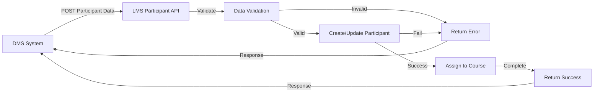
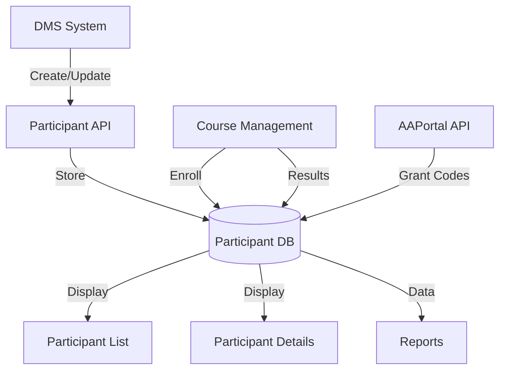
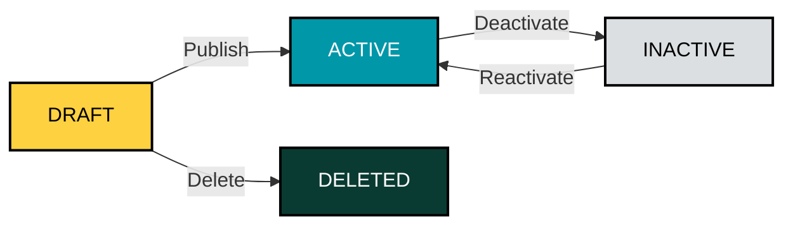
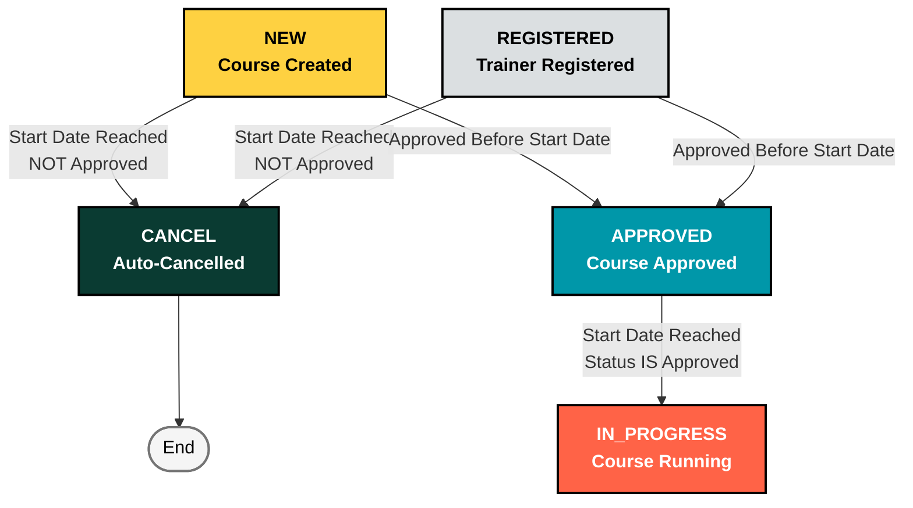

# FUNCTIONAL REQUIREMENT SPECIFICATIONS

**Authors:** Diem Ha/Hai Nguyen  
**Date:** 24/03/2022  
**Version:** 1.4.0

---

## VERSION HISTORY

| VERSION | APPROVED BY | REVISION DATE  | DESCRIPTION OF CHANGE                                                                                                                                                                                                                                                    | AUTHOR             |
| ------- | ----------- | -------------- | ------------------------------------------------------------------------------------------------------------------------------------------------------------------------------------------------------------------------------------------------------------------------ | ------------------ |
| 1.0.0   |             | 24/02/2022     | Initial creation                                                                                                                                                                                                                                                         | Diem Ha/Hai Nguyen |
| 1.1.0   |             | 2/03/2022      | Adding LMS architecture diagram                                                                                                                                                                                                                                          | Diem Ha/Hai Nguyen |
| 1.2.0   |             | 21/06/2022     | Adding 8 reports                                                                                                                                                                                                                                                         | Diem Ha/Hai Nguyen |
| 1.3.0   |             | [Current Date] | Major restructuring: Course Management reorganization                                                                                                                                                                                                                    | Diem Ha/Hai Nguyen |
| 1.4.0   |             | [Current Date] | Program Management System: Added Section 7.3 (Program Management), enhanced Section 10.1.3 (Program Display Customization), added Section 10.1.11 (Program-Based Course Creation). Programs now independent of courses, enabling course creation for any active program. | Diem Ha/Hai Nguyen |

---

## TABLE OF CONTENTS

1. [Abbreviations and Acronyms](#1-abbreviations-and-acronyms)
2. [LMS Architecture Diagram](#2-lms-architecture-diagram)
3. [External Interface Requirements](#3-external-interface-requirements)
   - 3.1 [Overview Flow](#31-overview-flow)
   - 3.2 [Participant API](#32-participant-api)
   - 3.3 [CourseList API (ERecruiter)](#33-courselist-api-erecruiter)
   - 3.4 [UpdateAOLExam API](#34-updateaolexam-api)
   - 3.5 [AAPortal API](#35-aaportal-api)
   - 3.6 [Course Status API](#36-course-status-api)
   - 3.7 [Delete Participant from Course API](#37-delete-participant-from-course-api)
   - 3.8 [Update Attendance API](#38-update-attendance-api)
4. [Role and User Management](#4-role-and-user-management)
   - 4.1 [List of Roles](#41-list-of-roles)
   - 4.2 [Authorization Matrix by Feature](#42-authorization-matrix-by-feature)
   - 4.3 [User Management](#43-user-management)
     - 4.3.1 [User Creation Screen](#431-user-creation-screen)
     - 4.3.2 [User Listing Page](#432-user-listing-page)
     - 4.3.3 [Login Authentication](#433-login-authentication)
   - 4.4 [Role & Permission Management](#44-role--permission-management)
     - 4.4.1 [Permission Categories and Definitions](#441-permission-categories-and-definitions)
     - 4.4.2 [Default Role Permission Matrix](#442-default-role-permission-matrix)
     - 4.4.3 [Role & Permission Management Screen](#443-role--permission-management-screen)
     - 4.4.4 [Edit Permissions Modal](#444-edit-permissions-modal)
     - 4.4.5 [Permission Management Business Rules](#445-permission-management-business-rules)
     - 4.4.8 [Integration with Other Features](#448-integration-with-other-features)
   - 4.5 [Role-Based Data Filtering](#45-role-based-data-filtering)
     - 4.5.1 [Data Filtering Rules by Role](#451-data-filtering-rules-by-role)

- 4.5.2 [Dashboard Statistics Filtering](#452-dashboard-statistics-filtering)
  - 4.5.3 [Course List Filtering](#453-course-list-filtering)
  - 4.5.4 [Pending Approvals Filtering](#454-pending-approvals-filtering)
  - 4.5.5 [Approval Workflow Integration](#455-approval-workflow-integration)

5. [Trainer Management](#5-trainer-management)
   - 5.1 [Trainer Creation Page](#51-trainer-creation-page)
   - 5.2 [Trainer Listing Page](#52-trainer-listing-page)
   - 5.3 [Trainer Details Page](#53-trainer-details-page)
6. [Participant Management](#6-participant-management)
   - 6.1 [Integration](#61-integration)
   - 6.2 [Participant List](#62-participant-list)
   - 6.3 [Participant Details Page](#63-participant-details-page)
7. [Content Management](#7-content-management)
   - 7.1 [Modules](#71-modules)
     - 7.1.1 [Module Data Structure](#711-module-data-structure)
     - 7.1.2 [Module Listing Page](#712-module-listing-page)
     - 7.1.3 [Module Creation Form](#713-module-creation-form)
     - 7.1.4 [Module Details Page](#714-module-details-page)
     - 7.1.5 [Module Status Management](#715-module-status-management)
     - 7.1.6 [Module Clone Functionality](#716-module-clone-functionality)
     - 7.1.7 [Module Delete Functionality](#717-module-delete-functionality)
     - 7.1.8 [Module Integration Points](#718-module-integration-points)
     - 7.1.9 [Module Authorization Matrix](#719-module-authorization-matrix)
     - 7.1.10 [Module Validation Rules](#7110-module-validation-rules)
     - 7.1.11 [Module UI/UX Considerations](#7111-module-uiux-considerations)
   - 7.2 [Product](#72-product)
     - 7.2.1 [Product Data Structure](#721-product-data-structure)
     - 7.2.2 [Product Listing Page](#722-product-listing-page)
     - 7.2.3 [Product Details Page](#723-product-details-page)
     - 7.2.4 [Product Creation](#724-product-creation)
     - 7.2.5 [Product Status Management](#725-product-status-management)
     - 7.2.6 [Product Clone Functionality](#726-product-clone-functionality)
     - 7.2.7 [Product Delete Functionality](#727-product-delete-functionality)
     - 7.2.8 [Product Integration Points](#728-product-integration-points)
     - 7.2.9 [Product Authorization Matrix](#729-product-authorization-matrix)
     - 7.2.10 [Product Validation Rules](#7210-product-validation-rules)
     - 7.2.11 [Product UI/UX Considerations](#7211-product-uiux-considerations)
   - 7.3 [Program](#73-program)
     - 7.3.1 [Program Data Structure](#731-program-data-structure)
     - 7.3.2 [Program Management Features](#732-program-management-features)
     - 7.3.3 [Program Status Management](#733-program-status-management)
     - 7.3.4 [Program Integration Points](#734-program-integration-points)
     - 7.3.5 [Future Enhancements](#735-future-enhancements)
8. [Course Management](#8-course-management)
   - 8.1 [Course Creation](#81-course-creation)

- 8.1.1 [Course Creation Form](#811-course-creation-form) - 8.1.1.1 [Dynamic Form Behavior Based on Course Type](#8111-dynamic-form-behavior-based-on-course-type) - 8.1.1.2 [SHINE Form Fields](#8112-shine-form-fields) - 8.1.1.3 [Product Form Fields](#8113-product-form-fields) - 8.1.1.4 [Skill Form Fields](#8114-skill-form-fields) - 8.1.1.5 [Course Code Generation Logic](#8115-course-code-generation-logic) - 8.1.1.6 [Status Transition Logic](#8116-status-transition-logic) - 8.1.1.7 [Checklist Template Application](#8117-checklist-template-application) - 8.1.1.8 [Co-trainer Management](#8118-co-trainer-management)
  - 8.1.2 [Entry Points](#812-entry-points)
  - 8.1.3 [Validation & Error Handling](#813-validation--error-handling)
  - 8.2 [Course Listing Screen](#82-course-listing-screen)
    - 8.2.1 [Course List View](#821-course-list-view)
    - 8.2.2 [Filter & Search](#822-filter--search)
    - 8.2.3 [Export Courses](#823-export-courses)
    - 8.2.4 [Course Import Function](#824-course-import-function)
    - 8.2.5 [Course Actions Overview](#825-course-actions-overview)
  - 8.3 [Course Details Screen](#83-course-details-screen)
    - 8.3.1 [Course General Tab](#831-course-general-tab)
      - 8.3.1.1 [Course Status Timeline](#8311-course-status-timeline)
      - 8.3.1.2 [Course Approval Actions](#8312-course-approval-actions)
    - 8.3.2 [Course History](#832-course-history)
    - 8.3.3 [Course Planning Tab](#833-course-planning-tab)
    - 8.3.4 [Course Participant Tab Overview](#834-course-participant-tab-overview)
  - 8.4 [Course Registration](#84-course-registration)
    - 8.4.1 [Registration Process](#841-registration-process)
    - 8.4.2 [Registration Approval Workflow](#842-registration-approval-workflow)
    - 8.4.3 [Auto-Cancellation Rule](#843-auto-cancellation-rule)
  - 8.5 [Course Edit](#85-course-edit)
    - 8.5.1 [Edit Authorization Matrix](#851-edit-authorization-matrix)
    - 8.5.2 [Edit Approval Workflow](#852-edit-approval-workflow)
    - 8.5.3 [Field-Level Restrictions](#853-field-level-restrictions)
  - 8.6 [Course Cancel](#86-course-cancel)
    - 8.6.1 [Cancellation Process](#861-cancellation-process)
    - 8.6.2 [Cancel Approval Workflow](#862-cancel-approval-workflow)
  - 8.7 [Course Delete](#87-course-delete)
    - 8.7.1 [Delete Authorization](#871-delete-authorization)
    - 8.7.2 [Soft Delete vs Hard Delete](#872-soft-delete-vs-hard-delete)
  - 8.8 [Course Operations](#88-course-operations)
    - 8.8.1 [Course Participant List](#881-course-participant-list)
    - 8.8.2 [Filter Area](#882-filter-area)
    - 8.8.3 [Add Participant to Course with Import File](#883-add-participant-to-course-with-import-file)
    - 8.8.4 [Add Participant to Course Manually](#884-add-participant-to-course-manually)
- 8.8.5 [Export Participants](#885-export-participants)
  - 8.8.6 [Export Participants for MOF Exam](#886-export-participants-for-mof-exam)
  - 8.8.7 [Import MOF Exam Result](#887-import-mof-exam-result)
  - 8.8.8 [Confirm Passed Participant](#888-confirm-passed-participant)
  - 8.8.9 [Export Passed Participant](#889-export-passed-participant)
  - 8.8.10 [Attendance Check](#8810-attendance-check)
  - 8.8.11 [AOL Exam Result](#8811-aol-exam-result)
  - 8.8.12 [Rule for Calculate Final Result](#8812-rule-for-calculate-final-result)
  - 8.8.13 [Manually Set Passed/Failed](#8813-manually-set-passedfailed)
  - 8.8.14 [Grant Agent Code](#8814-grant-agent-code)
  - 8.9 [Course Type Checklist Configuration](#89-course-type-checklist-configuration)
    - 8.9.1 [Overview](#891-overview)
    - 8.9.2 [Checklist Configuration by Course Type](#892-checklist-configuration-by-course-type)
    - 8.9.3 [Checklist Display in Course Details](#893-checklist-display-in-course-details)
    - 8.9.4 [Automated Email Reminder System](#894-automated-email-reminder-system)
    - 8.9.5 [PIC Actions](#895-pic-actions)
    - 8.9.6 [Status Definition Rules](#896-status-definition-rules)
    - 8.9.7 [Business Rules](#897-business-rules)
    - 8.9.8 [Checklist Template Configuration](#898-checklist-template-configuration)
      - 8.9.8.1 [Default Templates by Course Type](#8981-default-templates-by-course-type)
      - 8.9.8.2 [Clone Template Functionality](#8982-clone-template-functionality)
      - 8.9.8.3 [Template Customization](#8983-template-customization)
      - 8.9.8.4 [Template Selection During Course Creation](#8984-template-selection-during-course-creation)
      - 8.9.8.5 [Template Management Screen](#8985-template-management-screen)
      - 8.9.8.6 [Template Application to Courses](#8986-template-application-to-courses)
    - 8.9.9 [Reporting and Tracking](#899-reporting-and-tracking)
    - 8.9.10 [UI/UX Considerations](#8910-uiux-considerations)
    - 8.9.11 [UI Mockups](#8911-ui-mockups)
      - 8.9.11.1 [Template Management Screen](#89111-template-management-screen)
      - 8.9.11.2 [Clone Template Modal](#89112-clone-template-modal)
      - 8.9.11.3 [Template Creation/Edit Form](#89113-template-creationedit-form)
      - 8.9.11.4 [Course Creation Form - Template Selection](#89114-course-creation-form---template-selection)
      - 8.9.11.5 [Template Preview Modal](#89115-template-preview-modal)
      - 8.9.11.6 [Course Details - Checklist Tab](#89116-course-details---checklist-tab)
      - 8.9.11.7 [Checklist Summary Report](#89117-checklist-summary-report)
      - 8.9.11.8 [Mobile Responsive View - Checklist](#89118-mobile-responsive-view---checklist)
      - 8.9.11.9 [Email Reminder Sample](#89119-email-reminder-sample)
      - 8.9.11.10 [Design Specifications](#891110-design-specifications)

9. [PIC Calendar](#9-pic-calendar)
   - 9.1 [View Courses Per Trainer](#91-view-courses-per-trainer)
   - 9.2 [View Trainer Assignment for Each Trainer](#92-view-trainer-assignment-for-each-trainer)
   - 9.3 [Approve Courses in PIC Calendar](#93-approve-courses-in-pic-calendar)
     - 9.3.1 [Approve Registered Tab](#931-approve-registered-tab)
     - 9.3.2 [Approve Edit Tab](#932-approve-edit-tab)
     - 9.3.3 [Approve Cancel Tab](#933-approve-cancel-tab)
10. [Master Calendar](#10-master-calendar)
    - 10.1 [View Courses in Master Calendar](#101-view-courses-in-master-calendar)
      - 10.1.1 [Matrix Calendar Layout](#1011-matrix-calendar-layout)
      - 10.1.2 [Course Display in Calendar Cells](#1012-course-display-in-calendar-cells)
      - 10.1.3 [Program Display Customization](#1013-program-display-customization)
      - 10.1.4 [Filter Options](#1014-filter-options)
      - 10.1.5 [Month Navigation](#1015-month-navigation)
      - 10.1.6 [Interactive Features](#1016-interactive-features)
      - 10.1.7 [Empty State Handling](#1017-empty-state-handling)
      - 10.1.8 [Responsive Design](#1018-responsive-design)
      - 10.1.9 [Performance Optimization](#1019-performance-optimization)
      - 10.1.10 [Accessibility](#10110-accessibility)
      - 10.1.11 [Program-Based Course Creation](#10111-program-based-course-creation)
    - 10.2 [Create Course in Master Calendar](#102-create-course-in-master-calendar)
    - 10.3 [Other Actions in Master Calendar](#103-other-actions-in-master-calendar)
      - 10.3.1 [Course Registration](#1031-course-registration)
      - 10.3.2 [Course Edit](#1032-course-edit)
      - 10.3.3 [Course Delete](#1033-course-delete)
      - 10.3.4 [View Details](#1034-view-details)
11. [List Manage](#11-list-manage)
12. [Course Template](#12-course-template)
    - 12.1 [Shine Course Template](#121-shine-course-template)
    - 12.2 [Product Course Template](#122-product-course-template)
    - 12.3 [Skill Course Template](#123-skill-course-template)
13. [Report Management](#13-report-management)
    - 13.1 [SHINE PASS RATIO](#131-shine-pass-ratio)
    - 13.2 [SHINE TRAINING](#132-shine-training)
    - 13.3 [PARTICIPANT OF TRAINERS](#133-participant-of-trainers)
    - 13.4 [RECRUITMENT SHINE](#134-recruitment-shine)
    - 13.5 [DANH SACH DANG KY MOF](#135-danh-sach-dang-ky-mof)
    - 13.6 [PASS RATIO BY MONTH](#136-pass-ratio-by-month)
    - 13.7 [GIO BAY TRAINER](#137-gio-bay-trainer)
    - 13.8 [ATTENDANCE REPORT](#138-attendance-report)
    - 13.9 [REPORT FOR FWD AGENT TRAINING ACTIVITY](#139-report-for-fwd-agent-training-activity)
    - 13.10 [SHINE REPORT](#1310-shine-report)
    - 13.11 [FWT TRAINER PAYSLIP](#1311-fwt-trainer-payslip)
    - 13.12 [EXAM FEE TOTAL](#1312-exam-fee-total)
14. [General Setting](#14-general-setting)
    - 14.1 [SMTP Settings](#141-smtp-settings)
15. [Appendix A - Issues List](#appendix-a-issues-list)

---

## 1. ABBREVIATIONS AND ACRONYMS

[Content will be copied from original document - Section 1]

---

## 2. LMS ARCHITECTURE DIAGRAM

[Content will be copied from original document - Section 2]

---

## 3. EXTERNAL INTERFACE REQUIREMENTS

[Content will be copied from original document - Section 3]

---

## 4. ROLE AND USER MANAGEMENT

Admin can manage role and user role via a menu in LMS UI. This menu only allows admin role to access and modify data.

### 4.1 List of Roles

| No  | Role         | Description                                                               |
| --- | ------------ | ------------------------------------------------------------------------- |
| 1   | TRAINER      | Assign to users who are trainers                                          |
| 2   | LEAD_REGION  | Assign to users who are lead of region                                    |
| 3   | HEAD_CHANNEL | Assign to users who are head of channel                                   |
| 4   | DMS_ADMIN    | Assign to user who wants to access LMS to get the Passed participant list |
| 5   | MASTER_ROLE  | This role can break the predefined business rule                          |
| 6   | ADMIN        | This role is assigned to admin channel to perform the tasks in LMS course |
| 7   | ROOT_ADMIN   | LMS Administration role                                                   |

### 4.2 Authorization Matrix by Feature

| No  | Features/Roles                           | TRAINER | LEAD_REGION | HEAD_CHANNEL | DMS_ADMIN | MASTER_ROLE | ADMIN | ROOT_ADMIN |
| --- | ---------------------------------------- | ------- | ----------- | ------------ | --------- | ----------- | ----- | ---------- |
| 1   | View PIC Calendar                        | x       | x           | x            | x         | x           | x     | x          |
| 2   | View Master Calendar                     | x       | x           | x            | x         | x           | x     | x          |
| 3   | Create course                            | x       | x           | x            |           |             |       |            |
| 4   | Import course and view history import    |         | x           | x            |           |             |       |            |
| 5   | View/export course list/details course   | x       | x           | x            | x         | x           | x     | x          |
| 6   | Register course                          | x       |             |              |           |             |       |            |
| 7   | Edit course                              | x       | x           | x            |           | x           | x     |            |
| 8   | Import MOF exam result                   |         |             |              |           | x           | x     |            |
| 9   | Import participant                       |         |             |              |           | x           | x     |            |
| 10  | Add participant                          |         |             |              |           | x           | x     |            |
| 11  | Confirm passed participant               |         |             |              |           |             | x     |            |
| 12  | Export participant                       |         |             |              | x         |             |       |            |
| 13  | Finish course                            |         |             |              |           | x           | x     |            |
| 14  | Cancel course                            | x       | x           | x            |           |             |       |            |
| 15  | Delete course                            | x       | x           | x            |           |             |       |            |
| 16  | Approve register/edit/cancel request     |         | x           | x            |           | x           |       |            |
| 17  | Create/clone program/products/modules    |         |             |              |           | x           | x     | x          |
| 18  | View program/product/module list/details |         |             |              |           | x           | x     | x          |
| 19  | View/edit Channel setting                |         |             |              |           | x           | x     | x          |
| 20  | View/edit/delete course template         |         |             |              |           | x           | x     | x          |
| 21  | Participant management                   |         | x           | x            |           | x           | x     | x          |
| 22  | Trainer management                       |         | x           | x            |           | x           | x     | x          |
| 23  | Admin management                         |         | x           | x            |           | x           | x     | x          |
| 24  | List manage                              |         |             |              |           | x           | x     | x          |
| 25  | Report management                        |         | x           | x            |           | x           | x     | x          |
| 26  | Role and Permission                      |         |             |              |           |             |       | x          |
| 27  | General setting                          |         |             |              |           | x           | x     | x          |

### 4.3 User Management

#### 4.3.1 User Creation Screen

**User Story:**  
AS AN Root Admin  
I CAN create new user in LMS system  
SO THAT users can login in to LMS system (only users requiring system access need accounts)

**Acceptance Criteria:**

- There will be an ADD NEW button to open add new user screen

**Data Requirements:**

| Field        | M/O | Data Type | Description                                                                                                       | Data Example  |
| ------------ | --- | --------- | ----------------------------------------------------------------------------------------------------------------- | ------------- |
| Email        | M   | String    | Email needs to be validated                                                                                       | lms@gmail.com |
| User Name    | M   | String    |                                                                                                                   | Head_agency   |
| Team         | M   | Dropdown  | Dropdown list include: Admin, Trainer, None                                                                       |               |
| System Roles | M   | Selection | Multiple roles can be added to user: Trainer, Lead Region, Head Channel, Master Role, Admin, Root Admin, WFT none |               |

#### 4.3.2 User Listing Page

**User Story:**  
AS a Root Admin user  
I CAN access the user listing page  
SO THAT I can search, view, edit, delete user in the LMS system

**Acceptance Criteria:**

1. **Search field** which allows searching by:

   - User's name
   - Email address

2. **View user list** with the following information:

   - The list shows: ID/Username/Email/Roles/Created date
   - Sort: default sorting by created date (Descending order)

3. **Action:** Edit/delete

#### 4.3.3 Login Authentication

**User Story:**  
AS an LMS user with system access  
I CAN login to LMS system
SO THAT I can view calendar, create course, or do other tasks according to my role

**Acceptance Criteria:**

- In login screen user enters username and password then click login button
- System validates user's name and password, return error message for the invalid user's name or password with AD authentication
- After enter username/password and click on login button, LMS calls AD to verify login credential
- If the input data is correct, then user can arrive LMS PIC Calendar screen
- If the inputted data is incorrect, then return the error message: "Invalid username or password"
- There are no limited times that user enter can enter the wrong password
- External contractors do not have access to LMS system and do not require user accounts
- **Role Display:** After successful login, user's current role is displayed in the header. For users with multiple assigned roles, a dropdown selector allows switching between roles. For users with a single role, the role is displayed as static text. Users can only switch between roles that are assigned to their account.

### 4.4 Role & Permission Management

**User Story:**  
AS A Root Admin
I NEED to configure permissions for each role in the system  
SO THAT I can control what actions each role can perform and maintain proper access control

**Business Use Cases:**

- Root Admin configures permissions for new organizational structure
- Root Admin adjusts role permissions after business process changes
- Root Admin reviews and updates role capabilities to ensure compliance
- Root Admin manages system access control centrally

---

#### 4.4.1 Permission Categories and Definitions

The system organizes permissions into six functional categories based on the Authorization Matrix (Section 4.2):

**Permission Structure:**

| Permission ID          | Feature Name                 | Category               | Description                            | Roles with Permission                                     |
| ---------------------- | ---------------------------- | ---------------------- | -------------------------------------- | --------------------------------------------------------- |
| `view_pic_calendar`    | View PIC Calendar            | Calendar               | View courses per trainer               | All roles                                                 |
| `view_master_calendar` | View Master Calendar         | Calendar               | View all courses in calendar           | All roles                                                 |
| `create_course`        | Create course                | Course Management      | Create new courses                     | Trainer, Lead Region, Head Channel                        |
| `import_course`        | Import course                | Course Management      | Bulk import courses and view history   | Lead Region, Head Channel                                 |
| `view_course`          | View/export course           | Course Management      | View course list/details and export    | All roles                                                 |
| `register_course`      | Register course              | Course Management      | Register as primary trainer            | Trainer only                                              |
| `edit_course`          | Edit course                  | Course Management      | Edit course details                    | Trainer, Lead Region, Head Channel, Master Role, Admin    |
| `import_mof_result`    | Import MOF exam result       | Participant Management | Import MOF exam results                | Master Role, Admin                                        |
| `import_participant`   | Import participant           | Participant Management | Bulk import participants               | Master Role, Admin                                        |
| `add_participant`      | Add participant              | Participant Management | Add individual participants            | Master Role, Admin                                        |
| `confirm_passed`       | Confirm passed participant   | Participant Management | Confirm passed participants            | Admin only                                                |
| `export_participant`   | Export participant           | Participant Management | Export participant lists               | DMS Admin only                                            |
| `finish_course`        | Finish course                | Course Management      | Mark course as finished                | Master Role, Admin                                        |
| `cancel_course`        | Cancel course                | Course Management      | Cancel courses                         | Trainer, Lead Region, Head Channel                        |
| `delete_course`        | Delete course                | Course Management      | Delete courses                         | Trainer, Lead Region, Head Channel                        |
| `approve_course`       | Approve register/edit/cancel | Course Management      | Approve course actions                 | Lead Region, Head Channel, Master Role                    |
| `manage_program`       | Create/clone program         | Content Management     | Create/clone programs/products/modules | Master Role, Admin, Root Admin                            |
| `view_program`         | View program                 | Content Management     | View program/product/module details    | Master Role, Admin, Root Admin                            |
| `manage_channel`       | View/edit Channel setting    | Admin                  | View/edit channel settings             | Master Role, Admin, Root Admin                            |
| `manage_template`      | View/edit/delete template    | Admin                  | View/edit/delete course templates      | Master Role, Admin, Root Admin                            |
| `manage_participant`   | Participant management       | Admin                  | Full participant management            | Lead Region, Head Channel, Master Role, Admin, Root Admin |
| `manage_trainer`       | Trainer management           | Admin                  | Manage trainer profiles                | Lead Region, Head Channel, Master Role, Admin, Root Admin |
| `manage_admin`         | Admin management             | Admin                  | Manage admin users                     | Lead Region, Head Channel, Master Role, Admin, Root Admin |
| `manage_list`          | List manage                  | Admin                  | Manage master data lists               | Master Role, Admin, Root Admin                            |
| `view_reports`         | Report management            | Report                 | View and generate reports              | Lead Region, Head Channel, Master Role, Admin, Root Admin |
| `manage_roles`         | Role and Permission          | Admin                  | Manage roles and permissions           | Root Admin only                                           |
| `general_settings`     | General setting              | Admin                  | Configure system settings              | Master Role, Admin, Root Admin                            |

---

#### 4.4.2 Default Role Permission Matrix

Based on the Authorization Matrix (Section 4.2), the default permissions for each role are:

| Role             | Permissions Assigned                                                                                                                                                                                                                                                                                                   | Total Count |
| ---------------- | ---------------------------------------------------------------------------------------------------------------------------------------------------------------------------------------------------------------------------------------------------------------------------------------------------------------------- | ----------- |
| **TRAINER**      | view_pic_calendar, view_master_calendar, create_course, view_course, register_course, edit_course, cancel_course, delete_course                                                                                                                                                                                        | 8           |
| **LEAD_REGION**  | view_pic_calendar, view_master_calendar, create_course, import_course, view_course, edit_course, approve_course, cancel_course, delete_course, manage_participant, manage_trainer, manage_admin, view_reports                                                                                                          | 13          |
| **HEAD_CHANNEL** | view_pic_calendar, view_master_calendar, create_course, import_course, view_course, edit_course, approve_course, cancel_course, delete_course, manage_participant, manage_trainer, manage_admin, view_reports                                                                                                          | 13          |
| **DMS_ADMIN**    | view_pic_calendar, view_master_calendar, view_course, export_participant                                                                                                                                                                                                                                               | 4           |
| **MASTER_ROLE**  | view_pic_calendar, view_master_calendar, view_course, edit_course, import_mof_result, import_participant, add_participant, finish_course, approve_course, manage_program, view_program, manage_channel, manage_template, manage_participant, manage_trainer, manage_admin, manage_list, view_reports, general_settings | 19          |
| **ADMIN**        | view_pic_calendar, view_master_calendar, view_course, edit_course, import_mof_result, import_participant, add_participant, confirm_passed, finish_course, manage_program, view_program, manage_channel, manage_template, manage_participant, manage_trainer, manage_admin, manage_list, view_reports, general_settings | 19          |
| **ROOT_ADMIN**   | view_pic_calendar, view_master_calendar, view_course, manage_program, view_program, manage_channel, manage_template, manage_participant, manage_trainer, manage_admin, manage_list, view_reports, manage_roles, general_settings                                                                                       | 14          |

**Key Notes:**

- **Register Course (Feature #6)**: Only Trainer has this permission per original specification
- **Create Course (Feature #3)**: Trainer, Lead Region, Head Channel only (Root Admin does NOT have this permission per original specification)
- **Edit Course (Feature #7)**: Root Admin does NOT have this permission per original specification
- **Manage Roles (Feature #26)**: Exclusive to Root Admin for system security
- **Export Participant (Feature #12)**: Exclusive to DMS Admin per original specification

---

#### 4.4.3 Role & Permission Management Screen

**Access:**

- **URL:** `/roles`
- **Menu:** Admin → Role & Permissions
- **Authorization:** Root Admin only

**Purpose:**
Root Admin can view and modify permissions for each role through a centralized management interface.

**Screen Layout:**

```
┌─────────────────────────────────────────────────────────────────┐
│ 🔐 Role & Permission Management                                 │
├─────────────────────────────────────────────────────────────────┤
│                                                                  │
│ ℹ️ Configure what each role can do in the system. System roles │
│    cannot be deleted.                                           │
│                                                                  │
│ ━━━━━━━━━━━━━━━━━━━━━━━━━━━━━━━━━━━━━━━━━━━━━━━━━━━━━━━━━━━━ │
│                                                                  │
│ Role List                                                       │
│                                                                  │
│ ┌───────────────────────────────────────────────────────────┐ │
│ │ 🔒 TRAINER                                                 │ │
│ │ System Role • 8 permissions assigned                      │ │
│ │ Assign to users who are trainers                          │ │
│ │                                        [Edit Permissions] │ │
│ └───────────────────────────────────────────────────────────┘ │
│                                                                  │
│ ┌───────────────────────────────────────────────────────────┐ │
│ │ 🔒 LEAD_REGION                                            │ │
│ │ System Role • 13 permissions assigned                     │ │
│ │ Assign to users who are lead of region                    │ │
│ │                                        [Edit Permissions] │ │
│ └───────────────────────────────────────────────────────────┘ │
│                                                                  │
│ [... other roles ...]                                           │
│                                                                  │
└─────────────────────────────────────────────────────────────────┘
```

**Functional Requirements:**

1. **Role List Display:**

   - Display all 7 system roles
   - Show role name, description, and permission count
   - All roles are system roles (cannot be deleted)
   - Only Root Admin can access this screen

2. **Edit Permissions Action:**

   - Click "Edit Permissions" button to modify role permissions
   - Opens modal with permission checklist grouped by category
   - Root Admin can add/remove permissions for any role
   - Changes take effect immediately for all users with that role

3. **Permission Display:**
   - Permissions grouped by category (Calendar, Course Management, Participant Management, Content Management, Report, Admin)
   - Checkbox selection for each permission
   - Permission description displayed
   - Summary shows total permissions selected

---

#### 4.4.4 Edit Permissions Modal

When Root Admin clicks "Edit Permissions" on a role, a modal displays all available permissions with checkbox selection.

**Modal Structure:**

```
┌─────────────────────────────────────────────────────────────────┐
│ Edit Permissions: TRAINER                                  [✕]  │
├─────────────────────────────────────────────────────────────────┤
│                                                                  │
│ Role Name: TRAINER                                              │
│ Description: Assign to users who are trainers                   │
│ Type: 🔒 System Role (cannot be deleted)                        │
│                                                                  │
│ ━━━━━━━━━━━━━━━━━━━━━━━━━━━━━━━━━━━━━━━━━━━━━━━━━━━━━━━━━━━━ │
│                                                                  │
│ Permissions (Select all that apply)                             │
│                                                                  │
│ 📅 CALENDAR PERMISSIONS                                         │
│ ☑ View PIC Calendar - View courses per trainer                 │
│ ☑ View Master Calendar - View all courses in calendar          │
│                                                                  │
│ 📚 COURSE MANAGEMENT PERMISSIONS                                │
│ ☑ Create course - Create new courses                           │
│ ☐ Import course - Bulk import courses                          │
│ ☑ View course - View course information                        │
│ ☑ Register course - Register as primary trainer                │
│ ☑ Edit course - Edit course details                            │
│ ☑ Cancel course - Cancel courses                               │
│ ☑ Delete course - Delete courses                               │
│ ☐ Approve course - Approve course actions                      │
│ ☐ Finish course - Mark course as finished                      │
│                                                                  │
│ 👥 PARTICIPANT MANAGEMENT PERMISSIONS                           │
│ ☐ Import MOF result - Import MOF exam results                  │
│ ☐ Import participant - Bulk import participants                │
│ ☐ Add participant - Add individual participants                │
│ ☐ Confirm passed - Confirm passed participants                 │
│ ☐ Export participant - Export participant lists                │
│                                                                  │
│ 📖 CONTENT MANAGEMENT PERMISSIONS                               │
│ ☐ Manage program - Create/clone programs/products/modules      │
│ ☐ View program - View program/product/module details           │
│                                                                  │
│ 📊 REPORT PERMISSIONS                                           │
│ ☐ View reports - View and generate reports                     │
│                                                                  │
│ ⚙️ ADMIN PERMISSIONS                                            │
│ ☐ Manage channel - View/edit channel settings                  │
│ ☐ Manage template - View/edit/delete course templates          │
│ ☐ Manage participant - Full participant management             │
│ ☐ Manage trainer - Manage trainer profiles                     │
│ ☐ Manage admin - Manage admin users                            │
│ ☐ Manage list - Manage master data lists                       │
│ ☐ Manage roles - Manage roles and permissions                  │
│ ☐ General settings - Configure system settings                 │
│                                                                  │
│ ━━━━━━━━━━━━━━━━━━━━━━━━━━━━━━━━━━━━━━━━━━━━━━━━━━━━━━━━━━━━ │
│                                                                  │
│ Summary: 8 of 27 permissions selected                          │
│                                                                  │
│                                          [Cancel] [Save Changes]│
└─────────────────────────────────────────────────────────────────┘
```

**Functional Requirements:**

1. **Permission Checklist:**

   - All 27 permissions displayed grouped by category
   - Checkbox for each permission
   - Permission description displayed inline
   - Current role permissions pre-checked

2. **Permission Selection:**

   - Click checkbox to add/remove permission
   - Summary updates in real-time
   - No minimum permission requirement (can remove all)
   - Warning displayed if removing critical permissions

3. **Save Changes:**
   - Click "Save Changes" to update role permissions
   - Changes saved to `data/roles.json`
   - Success message displayed
   - Modal closes automatically
   - All users with this role immediately affected (or upon next login)

---

#### 4.4.5 Permission Management Business Rules

**1. System Role Protection:**

- All 7 roles (Trainer, Lead Region, Head Channel, DMS Admin, Master Role, Admin, Root Admin) are system roles
- System roles cannot be deleted
- System roles can have permissions modified by Root Admin
- Role names and descriptions cannot be changed for system roles

**2. Permission Assignment:**

- Root Admin can assign/remove any permission to/from any role
- Changes take effect immediately for all users with that role
- Permission changes are logged in system audit trail
- Users must log out and log back in to see permission changes (or refresh session)

**3. Validation Rules:**

- No minimum permission requirement (roles can have zero permissions)
- Cannot remove "Manage Roles" permission from Root Admin (system protection)
- Warning displayed if removing critical permissions (e.g., removing "View Course" from Trainer)

**4. Authorization Check:**

- Only Root Admin can access Role & Permission Management screen
- Other roles see "Access Denied" if attempting to access `/roles`
- Permission checks performed at API level for security

**5. Audit Trail:**

- All permission changes recorded with:
  - Role name
  - Permission added/removed
  - User who made the change (Root Admin)
  - Timestamp
  - Reason (optional)

---

#### 4.4.8 Integration with Other Features

**Course Registration (Section 8.4):**

- `register_course` permission required to register for courses
- Only Trainer has this permission per original specification
- Permission check performed before displaying registration button

**Course Approval (Section 8.4.2):**

- `approve_course` permission required to approve registrations
- Lead Region, Head Channel, and Master Role have this permission
- Permission check performed in approval workflow

**Course Edit (Section 8.5):**

- `edit_course` permission required to edit courses
- Additional status-based restrictions apply (see Section 8.5.1)
- Permission check combined with status validation
- Root Admin does NOT have edit_course permission per original specification

**Course Creation (Section 8.1):**

- `create_course` permission required to create courses
- Trainer, Lead Region, and Head Channel have this permission
- Root Admin does NOT have create_course permission per original specification

**User Management (Section 4.3):**

- `manage_admin` permission required to create/edit users
- Root Admin has additional `manage_roles` permission
- Permission check performed before accessing user management screens

---

### 4.5 Role-Based Data Filtering

**User Story:**  
AS A user with specific role, channel, and region assignments  
I NEED to see only data relevant to my scope of responsibility  
SO THAT I can focus on courses, participants, trainers, and approvals within my authority

**Business Use Cases:**

- Trainer views only courses they are assigned to
- Lead Region manages courses in their channel and region
- Head Channel oversees all courses in their channel across regions
- Admin/Root Admin access all data for system management
- Master Role has override access to all data

---

#### 4.5.1 Data Filtering Rules by Role

The system applies role-based filtering to ensure users only see data within their scope of authority:

| Role             | Course List Filter                                  | Participant List Filter                                    | Trainer List Filter                         | Pending Approvals Filter                                                                                                     |
| ---------------- | --------------------------------------------------- | ---------------------------------------------------------- | ------------------------------------------- | ---------------------------------------------------------------------------------------------------------------------------- |
| **Trainer**      | Courses where user is Primary Trainer or Co-Trainer | Participants in courses where user is trainer              | No filter (can view all trainers)           | No access (hidden)                                                                                                           |
| **Lead Region**  | Courses matching user's Channel AND Region          | Participants in courses matching user's Channel AND Region | Trainers matching user's Channel AND Region | Courses with status `REGISTERED`, `WAITING_APPROVAL_EDIT`, or `WAITING_APPROVAL_CANCEL` matching user's Channel AND Region   |
| **Head Channel** | Courses matching user's Channel (any region)        | Participants in courses matching user's Channel            | Trainers matching user's Channel            | Courses with status `REGISTERED`, `WAITING_APPROVAL_EDIT`, or `WAITING_APPROVAL_CANCEL` matching user's Channel (any region) |
| **Admin**        | All courses (no filter)                             | All participants (no filter)                               | All trainers (no filter)                    | No access (no approval permission)                                                                                           |
| **Root Admin**   | All courses (no filter)                             | All participants (no filter)                               | All trainers (no filter)                    | No access (no approval permission)                                                                                           |
| **DMS Admin**    | All courses (no filter)                             | All participants (no filter)                               | No access                                   | No access (no approval permission)                                                                                           |
| **Master Role**  | All courses (no filter)                             | All participants (no filter)                               | All trainers (no filter)                    | All courses with status `REGISTERED`, `WAITING_APPROVAL_EDIT`, or `WAITING_APPROVAL_CANCEL` (no filter)                      |

**Filter Implementation:**

- Filters applied at API level (backend) for security
- Client-side filtering for UI responsiveness
- User's channel and region retrieved from session storage
- Filters combine with search/sort functionality

---

#### 4.5.2 Dashboard Statistics Filtering

Dashboard cards display statistics filtered by user's role and scope:

**1. Active Courses Count:**

- **Trainer:** Count of courses where user is Primary Trainer or Co-Trainer AND status IN ('APPROVED', 'IN_PROGRESS')
- **Lead Region:** Count of courses with status IN ('APPROVED', 'IN_PROGRESS') in user's channel + region
- **Head Channel:** Count of courses with status IN ('APPROVED', 'IN_PROGRESS') in user's channel
- **Admin/Root Admin/Master Role:** Total count of all courses with status IN ('APPROVED', 'IN_PROGRESS')
- **DMS Admin:** Total count of all courses with status IN ('APPROVED', 'IN_PROGRESS')

**2. Total Participants Count:**

- **Trainer:** Count of participants in courses where user is trainer
- **Lead Region:** Count of participants in courses matching user's channel + region
- **Head Channel:** Count of participants in courses matching user's channel
  - **Admin/Root Admin/Master Role:** Total count of all participants
  - **DMS Admin:** Total count of all participants

**3. Pending Approvals Count:**

- **Trainer:** Card hidden (no approval access)
- **Lead Region:** Count of courses with status `REGISTERED`, `WAITING_APPROVAL_EDIT`, or `WAITING_APPROVAL_CANCEL` in user's channel + region
- **Head Channel:** Count of courses with status `REGISTERED`, `WAITING_APPROVAL_EDIT`, or `WAITING_APPROVAL_CANCEL` in user's channel
- **Admin/Root Admin/DMS Admin:** Card hidden (no approval access)
- **Master Role:** Total count of all courses with status `REGISTERED`, `WAITING_APPROVAL_EDIT`, or `WAITING_APPROVAL_CANCEL`

**4. Total Trainers Count:**

- **Trainer:** Card hidden or shows total count (no management access)
- **Lead Region:** Count of trainers matching user's channel + region
- **Head Channel:** Count of trainers matching user's channel
- **Admin/Root Admin/Master Role:** Total count of all trainers
- **DMS Admin:** Card hidden (no trainer management access)

**Dashboard Card Linking:**

- **Active Courses:** Links to Course List filtered by role scope
- **Total Participants:** Links to Participant List filtered by role scope
- **Pending Approvals:** Links to PIC Calendar → Approval screen with combined view of all three approval types (Registration, Edit, Cancel)
- **Total Trainers:** Links to Trainer List filtered by role scope

---

#### 4.5.3 Course List Filtering

**Requirement:**  
Course list page displays only courses within user's scope of authority based on role, channel, and region.

**Filtering Logic:**

1. **Trainer:**

   - Show courses where `primaryTrainer = userId` OR `coTrainer = userId`
   - User can only see courses they are directly involved in
   - Cannot see courses from other trainers

2. **Lead Region:**

   - Show courses where `channel = userChannel` AND `region = userRegion`
   - User sees all courses in their channel and region
   - Includes courses from all trainers in their scope

3. **Head Channel:**

   - Show courses where `channel = userChannel`
   - User sees all courses in their channel across all regions
   - Full channel visibility regardless of region

4. **Admin, Root Admin, Master Role:**

   - Show all courses (no filter applied)
   - Full system visibility for administrative purposes

5. **DMS Admin:**
   - Show all courses (no filter applied)
   - Read-only access for participant export purposes

**Additional Filters:**

- User can further filter by status, course type, date range
- Search functionality works within filtered dataset
- Export function exports only filtered courses

---

#### 4.5.4 Pending Approvals Filtering

**Requirement:**
Pending approval lists (PIC Calendar → Approval tabs) must show only approval requests within user's approval authority. The system supports three types of approvals: Registration, Edit, and Cancel.

**Approval Types:**

| Approval Type             | Course Status             | Description                                                      | Tab Name           |
| ------------------------- | ------------------------- | ---------------------------------------------------------------- | ------------------ |
| **Registration Approval** | `REGISTERED`              | Trainer has registered for a course, awaiting Head/Lead approval | Approve Registered |
| **Edit Approval**         | `WAITING_APPROVAL_EDIT`   | Course has been edited, awaiting Head/Lead approval for changes  | Approve Edit       |
| **Cancel Approval**       | `WAITING_APPROVAL_CANCEL` | Course cancellation requested, awaiting Head/Lead approval       | Approve Cancel     |

**Filtering Logic:**

1. **Lead Region:**

   - Show courses where `channel = userChannel` AND `region = userRegion` AND `status IN ('REGISTERED', 'WAITING_APPROVAL_EDIT', 'WAITING_APPROVAL_CANCEL')`
   - Can approve registration/edit/cancel requests within their channel and region only

2. **Head Channel:**

   - Show courses where `channel = userChannel` AND `status IN ('REGISTERED', 'WAITING_APPROVAL_EDIT', 'WAITING_APPROVAL_CANCEL')`
   - Can approve registration/edit/cancel requests in their channel (all regions)

3. **Master Role:**

   - Show all courses where `status IN ('REGISTERED', 'WAITING_APPROVAL_EDIT', 'WAITING_APPROVAL_CANCEL')`
   - Can approve any request (override authority)

4. **Other Roles:**
   - No access to pending approvals (feature hidden)

**Pending Approvals Count Calculation:**

- Count = Total courses with status `REGISTERED` + `WAITING_APPROVAL_EDIT` + `WAITING_APPROVAL_CANCEL` within user's scope
- Dashboard card shows combined count of all three approval types
- Individual tabs show counts for each type separately

**Business Rules:**

- Only courses with exact status matching approval type appear in respective tabs
- Filtering prevents users from seeing or approving requests outside their authority
- Each approval type has separate workflow and history tracking
- User can see all three types in one consolidated "Pending Approvals" view

**Tab Organization:**

- **Approve Registered Tab:** Shows courses with status `REGISTERED`
- **Approve Edit Tab:** Shows courses with status `WAITING_APPROVAL_EDIT`
- **Approve Cancel Tab:** Shows courses with status `WAITING_APPROVAL_CANCEL`
- All tabs filtered by same channel/region rules based on user's role

**Example Counts:**

- Lead Region (Agency/North):
  - Registered: 1 course
  - Edit: 2 courses
  - Cancel: 1 course
  - **Total Pending Approvals: 4**

---

#### 4.5.5 Approval Workflow Integration

**Requirement:**  
The Pending Approvals feature integrates with three approval workflows: Registration, Edit, and Cancel. Each workflow has specific status transitions and approval requirements.

**Approval Workflows:**

**1. Registration Approval Workflow:**

- **Trigger:** Trainer registers for a course (Section 8.4)
- **Status Transition:** `NEW` → `REGISTERED` → `APPROVED` (or back to `NEW` if rejected)
- **Approval Tab:** "Approve Registered"
- **Actions Available:** Approve, Reject (with reason)

**2. Edit Approval Workflow:**

- **Trigger:** User edits a course that requires approval (Section 8.5)
- **Status Transition:** Current status → `WAITING_APPROVAL_EDIT` → Original status (or updated if approved)
- **Approval Tab:** "Approve Edit"
- **Actions Available:** Approve Changes, Reject Changes (with reason)
- **Additional Data:** System shows what fields were changed (before/after comparison)

**3. Cancel Approval Workflow:**

- **Trigger:** User requests course cancellation (Section 8.6)
- **Status Transition:** Current status → `WAITING_APPROVAL_CANCEL` → `CANCEL` (or back to original if rejected)
- **Approval Tab:** "Approve Cancel"
- **Actions Available:** Approve Cancellation, Reject Cancellation (with reason)
- **Additional Data:** System shows cancellation reason provided by requester

**Unified Approval Interface:**

- All three approval types accessible from PIC Calendar → Approval button
- Tab navigation allows switching between approval types
- Consistent approval/rejection interface across all types
- All approvals filtered by same role-based rules (channel/region scope)

**Approval Authority:**

- Same approval authority applies to all three types
- Lead Region approves requests in their channel + region
- Head Channel approves requests in their channel
- Master Role can approve any request

**Business Rules:**

- User cannot approve their own requests (self-approval blocked)
- Approval requires mandatory reason/comment for rejection
- Approval actions logged in course history with timestamp and approver
- Email notifications sent to requester after approval/rejection

**Integration Points:**

- **Course Registration (Section 8.4.2):** Registration approval workflow
- **Course Edit (Section 8.5.2):** Edit approval workflow
- **Course Cancel (Section 8.6.2):** Cancel approval workflow
- **PIC Calendar (Section 9.3):** Consolidated approval interface with three tabs

---

## 5. TRAINER MANAGEMENT

Root Admin, Admin, Lead region, and Head channel can add new trainers and manage trainer profiles via a menu in LMS UI.

---

### 5.1 Trainer Creation

#### 5.1.1 User Story

**AS A** Lead region, Head channel, Admin, Master user, Root Admin  
**I NEED TO** access Trainer creation page in Trainer Management Menu  
**SO THAT** I can create Trainer in LMS system

#### 5.1.2 Access Control

- **Authorized Roles:** Lead Region, Head Channel, Admin, Master Role, Root Admin
- **Entry Point:** "Add New Trainer" button in Trainer Management menu

#### 5.1.3 User Account Linking (Enhanced)

**User Story:**  
**AS A** user creating a trainer profile  
**I NEED** an intuitive way to link the trainer to a user account  
**SO THAT** I can complete the process efficiently without errors or multiple steps

**Enhanced Email Field Behavior:**

1. **Real-time User Lookup:**

   - System performs automatic lookup as user types email
   - Debounced search (300ms delay) to reduce server load
   - Visual feedback during lookup (loading spinner)

2. **Three Possible States:**

   **A. User Found:**

   - Display success indicator (green checkmark)
   - Show user details: Name, Roles, Team, Created Date
   - Option to view full user profile
   - Automatically link on form submission

   **B. User Not Found:**

   - Display warning indicator (yellow alert)
   - Show message: "No user account found with this email"
   - Provide two options:
     - **Quick Create:** Checkbox to auto-create user with defaults
       - Pre-fill username with email
       - Pre-select TRAINER role
       - Select team from dropdown
     - **Advanced Search:** Button to open user search modal

   **C. Ambiguous Match:**

   - Display info indicator (blue info icon)
   - Show list of potential matches
   - Allow user to select correct match
   - Option to refine search

3. **Quick User Creation:**

   - Checkbox: "Create user account automatically"
   - When checked, reveal minimal fields:
     - Username (pre-filled with email)
     - Team (dropdown)
     - Roles (TRAINER pre-selected, read-only)
   - User account created simultaneously with trainer profile
   - Single transaction (rollback if either fails)

4. **Advanced Search Modal:**
   - Opens when "Search Existing Users" clicked
   - Searchable list with filters:
     - Team filter
     - Role filter
     - Status filter (Active/Inactive)
   - Display user cards with:
     - Name
     - Email
     - Roles
     - Team
     - Created date
   - "Select This User" button on each card

**Business Rules:**

1. Email must be unique across all trainers
2. User account must have Team "Trainer" assigned
3. One user can only be linked to one trainer profile
4. If auto-creating user, username defaults to email address
5. External contractors can be created without user link (optional)

**Error Handling:**

| Error Scenario                          | Message                                                | Action                                                    |
| --------------------------------------- | ------------------------------------------------------ | --------------------------------------------------------- |
| Email already linked to another trainer | "This email is already linked to trainer: [Name]"      | Suggest viewing existing trainer or using different email |
| User exists but no TRAINER role         | "User found but missing TRAINER role. Add role first?" | Provide option to add TRAINER role automatically          |
| Invalid email format                    | "Please enter a valid email address"                   | Inline validation with red border                         |
| Network error during lookup             | "Unable to verify user. Please try again."             | Retry button                                              |

#### 5.1.4 Trainer Creation Form Fields

| S/N | Field Name     | Data Type     | Required | Description                       | Validation Rules                                        |
| --- | -------------- | ------------- | -------- | --------------------------------- | ------------------------------------------------------- |
| 1   | Email          | Text + Lookup | M        | Email address linked to LMS user  | Real-time lookup, unique validation                     |
| 2   | Full Name      | Alphanumeric  | M        | Trainer's full name               | -                                                       |
| 3   | Trainer Title  | Dropdown List | M        | Trainer's position                | Values: Head Academy, Head Agency, Head Banca, Head IFA |
| 4   | Trainer Gender | Dropdown List | M        | Gender                            | Values: Male/Female/Other                               |
| 5   | ID Number      | Alphanumeric  | M        | National ID number                | -                                                       |
| 6   | Issue Date     | Date Field    | M        | ID card issue date                | Must be in the past                                     |
| 7   | Issue Place    | Dropdown List | M        | ID card issue location            | Values: List of provinces                               |
| 8   | Phone          | Alphanumeric  | M        | Contact phone number              | Valid phone format                                      |
| 9   | Trainer Rate   | Numeric       | M        | Trainer rating (1-5)              | Selected value is the number                            |
| 10  | Highest Degree | Alphanumeric  | M        | Highest education degree obtained | -                                                       |
| 11  | Degree         | Dropdown List | M        | Degree type                       | Values: Associate/Bachelor's/Master's/Doctoral          |
| 12  | Trainer Type   | Dropdown List | M        | Employment type                   | Values: Internal Trainer/External Contractor            |
| 13  | Location       | Alphanumeric  | M        | Trainer's location                | -                                                       |
| 14  | Region         | Dropdown List | M        | Trainer's region                  | Values: South/Middle/North                              |

**Legend:**

- **M** = Mandatory
- **O** = Optional

#### 5.1.5 Business Rules

1. **Email Validation:**

   - Internal trainers require LMS system access and must be linked to a user account with Team "Trainer"
   - System offers quick user creation if email not found
   - User must be created in User Management before creating trainer profile (unless using quick create)

2. **External Contractor Access:**

   - External contractors do not require LMS system access
   - External contractors are external contractors who don't need system login
   - User account linking is optional for external contractors

3. **Form Actions:**

- **Create Trainer Button:** Saves the trainer profile and returns to trainer list
  - **Cancel Button:** Discards changes and returns to trainer list without saving

---

### 5.2 Trainer Listing Page

#### 5.2.1 User Story

**AS A** Lead region, Head channel, Root admin, Master role, Admin  
**I NEED TO** access the trainer listing page  
**SO THAT** I can search, view, export trainer information

#### 5.2.2 Access Control

- **Authorized Roles:** Lead Region, Head Channel, Root Admin, Master Role, Admin

#### 5.2.3 Filter Options

| Filter Type | Options                                    | Description                        |
| ----------- | ------------------------------------------ | ---------------------------------- |
| Region      | All, South, Middle, North                  | Filter trainers by region          |
| Channel     | All, Agency, Banca, IFA, Banker            | Filter trainers by channel         |
| Type        | All, Internal Trainer, External Contractor | Filter trainers by employment type |

#### 5.2.4 Search Functionality

Search by the following criteria:

- Full name
- Type (Internal Trainer/External Contractor)
- Email

#### 5.2.5 Display Columns

The trainer list displays the following information:

| Column     | Description                                     | Features                     |
| ---------- | ----------------------------------------------- | ---------------------------- |
| Full Name  | Trainer's full name                             | Hyperlink to trainer profile |
| Gender     | Male/Female/Other                               | -                            |
| Type       | Internal Trainer or External Contractor         | -                            |
| Title      | Head Academy, Head Agency, Head Banca, Head IFA | -                            |
| Location   | Trainer's location                              | -                            |
| Phone      | Contact phone number                            | -                            |
| Email      | Email address                                   | -                            |
| Status     | Active/Inactive                                 | Visual indicator (🟢/⚪)     |
| Created By | Username who created the trainer                | -                            |
| Updated By | Username who last updated the trainer           | -                            |

#### 5.2.6 List Features

1. **Pagination:** Option to set rows per page
2. **Sorting:** Default sort by latest update (descending order)
3. **Export:** Option to export the trainer list to Excel
4. **Navigation:** Click on trainer's full name to navigate to trainer details page
5. **Actions:** Edit, Deactivate/Activate buttons for each trainer

---

### 5.3 Trainer Details Page

#### 5.3.1 User Story

**AS A** Lead region, Head channel, root admin, master role, admin  
**I NEED TO** access trainer profile (trainer details page)  
**SO THAT** I can view, edit, add more details information to trainer profile

#### 5.3.2 Access Control

- **Authorized Roles:** Lead Region, Head Channel, Root Admin, Master Role, Admin
- **Entry Point:** Click on trainer name from Trainer Listing Page

#### 5.3.3 Page Layout

The Trainer Details page uses a **2-column layout** for optimal space utilization:

**Layout Structure:**

- **Header:** Full-width trainer summary with quick actions
- **Left Column (35%):** Navigation, quick stats, linked account info, quick actions
- **Right Column (65%):** Detailed content area with section-specific information

**Left Column Components:**

1. **Quick Stats Card:**

   - Courses Taught
   - Total Participants
   - Average Rating
   - Pass Rate
   - Active Since date

2. **Section Navigation:**

   - General Information
   - Address
   - Experience
   - Education
   - Rewards
   - Certifications
   - Performance
   - Training History
   - Road Map

3. **Linked Account Card:**

   - Username
   - Roles
   - Status
   - Last Login
   - Actions: View User Details, Change Link

4. **Quick Actions:**
   - Assign to Course
   - View Calendar
   - Generate Report
   - Send Message

**Right Column Content:**

- Displays content for the selected section
- Section-specific action buttons (Edit, Add New, Delete)
- Forms and data tables

#### 5.3.4 Page Sections

| Section              | Description                                    | Actions Available          |
| -------------------- | ---------------------------------------------- | -------------------------- |
| General Information  | Basic trainer information (from creation form) | Edit button                |
| Address              | Trainer's address information                  | Add new, Edit, Delete      |
| Experiences          | Work experience history                        | Add new, Edit, Delete      |
| Learning & Education | Educational background                         | Add new, Edit, Delete      |
| Trainer Reward       | Awards and recognitions                        | Add new, Edit, Delete      |
| Certifications       | Professional certifications and qualifications | Add new, Edit, Delete      |
| Performance          | Trainer activity metrics and performance       | View only (calculated)     |
| Training History     | List of courses taught                         | View only (auto-populated) |
| Road Map             | Trainer development plan                       | Add new, Edit, Delete      |

#### 5.3.5 Section Details

**1. General Information**

- Displays all fields from the Trainer Creation form
- **Edit Button:** Allows updating general information
- Fields editable: All fields from creation form
- Read-only display with label-value pairs

**2. Address**

- Multiple addresses can be added (home, office, mailing, etc.)
- Fields: Type, Street, City, Ward, Country, Primary flag
- **Add New Button:** Opens form to add new address
- **Edit/Delete Actions:** Available for each address entry

**3. Experiences**

- Work history entries displayed in reverse chronological order
- Fields: Company, Position, Start Date, End Date, Description
- Duration calculated automatically
- **Add New Button:** Opens form to add new experience
- **Edit/Delete Actions:** Available for each experience entry

**4. Learning & Education**

- Educational background entries
- Fields: Institution, Degree, Field of Study, Start Date, End Date, GPA
- **Add New Button:** Opens form to add new education entry
- **Edit/Delete Actions:** Available for each education entry

**5. Trainer Reward**

- Awards and recognitions
- Fields: Title, Issuer, Date, Description
- **Add New Button:** Opens form to add new reward
- **Edit/Delete Actions:** Available for each reward entry

**6. Certifications**

- Professional certifications with validity tracking
- Fields: Name, Issuer, Issue Date, Expiry Date, Certificate ID
- Status indicators: Valid (green), Expired (red), Expiring Soon (yellow)
- **Add New Button:** Opens form to add new certification
- **Edit/Delete Actions:** Available for each certification entry

**7. Performance (Active Ratio)**

- Performance metrics (view only, system calculated)
- Displays:
  - Total courses taught
  - Completed courses
  - Average rating
  - Pass rate
  - Attendance rate
  - Training hours delivered
  - Performance trend (last 6 months)
- Visual charts and graphs
- Comparison with company average

**8. Training History**

- Auto-populated from course assignments
- Displays:
  - Course ID
  - Course Name
  - Course Date
  - Number of Participants
  - Course Status
- View only (cannot be manually edited)
- Sortable and filterable

**9. Road Map**

- Trainer development and career planning
- Fields: Goal, Target Date, Status, Description
- **Add New Button:** Opens form to add development goals
- **Edit/Delete Actions:** Available for each roadmap entry

---

### 5.4 Authorization Matrix

| Action               | Trainer | Lead Region | Head Channel | Admin | Master Role | Root Admin |
| -------------------- | ------- | ----------- | ------------ | ----- | ----------- | ---------- |
| View Trainer List    | -       | ✓           | ✓            | ✓     | ✓           | ✓          |
| Create Trainer       | -       | ✓           | ✓            | ✓     | ✓           | ✓          |
| Edit Trainer         | -       | ✓           | ✓            | ✓     | ✓           | ✓          |
| Delete Trainer       | -       | ✓           | ✓            | ✓     | ✓           | ✓          |
| View Trainer Details | -       | ✓           | ✓            | ✓     | ✓           | ✓          |
| Export Trainer List  | -       | ✓           | ✓            | ✓     | ✓           | ✓          |
| Activate/Deactivate  | -       | ✓           | ✓            | ✓     | ✓           | ✓          |

---

### 5.5 Data Validation Rules

1. **Email Uniqueness:** Each trainer must have a unique email address
2. **User Link Requirement:** Email must match an existing LMS user with trainer role (or be created via quick create)
3. **Mandatory Fields:** All fields marked as "M" must be filled before saving
4. **Date Validation:** Issue Date must be in the past
5. **Phone Format:** Phone number must follow valid format
6. **Region/Channel Consistency:** Trainer's region and channel should align with organizational structure
7. **Trainer Rate:** Must be between 1 and 5

---

### 5.6 Integration Points

1. **User Management:** Trainer email must link to existing user account
2. **Course Management:** Users with Team "Trainer" appear in trainer selection dropdowns for course creation/assignment
3. **PIC Calendar:** Trainer courses displayed in PIC Calendar view
4. **Reports:** Trainer data used in various training reports
5. **Performance Tracking:** Training history automatically updated from course data

---

---

## 6. PARTICIPANT MANAGEMENT

**User Story:**  
AS A System Administrator, Admin, Lead Region, Head Channel, or Master Role user  
I NEED to manage participant information in the LMS system  
SO THAT I can track participant enrollment, course participation, training history, and certification status

**Business Context:**

Participants are the learners in the LMS system, primarily consisting of insurance agents and banking staff who undergo various training programs. The Participant Management module enables:

- Centralized participant database management
- Integration with external systems (DMS, E-Recruiter)
- Tracking of participant training journey
- Course enrollment and result management
- Certification and licensing code tracking
- Participant profile and documentation management

**Participant Data Sources:**

Participants can be created in the system through:

1. **API Integration:** Automatic replication from DMS system via Participant API (Section 3.2)
2. **Manual Import:** Bulk import via Excel file template
3. **Course Registration:** Added during course participant import (Section 8.8.3)

---

### 6.1 Integration

**User Story:**  
AS AN External System (DMS)  
I NEED to send participant data to LMS via API  
SO THAT participant records are synchronized and up-to-date across systems

**Acceptance Criteria:**

1. **API Endpoint Integration:**

   - System receives participant data via POST API (Section 3.2 - Participant API)
   - Validates incoming data against required fields
   - Creates new participant records or updates existing records
   - Returns success/error response with details

2. **Integration Flow:**



3. **Data Synchronization Rules:**

   - **New Participant:** Create new record if ID number not found
   - **Existing Participant:** Update record if ID number exists
   - **Old ID Number Field:** System compares `oldIdNumber` with current `idNumber` to detect updates
   - **Course Assignment:** If `courseCode` is provided and valid, participant is automatically assigned to course
   - **Error Handling:** Invalid course code or missing required fields result in error response

4. **API Fields Mapping:**
   - Refer to Section 3.2 (Participant API) for complete field definitions
   - All required fields must be present for successful creation
   - Optional fields can be empty or null
   - Nested objects supported: `homeAddress`, `businessAddress`, `participantSupportDocument`, `participantRegistration`, `participantReferences`

**Business Rules:**

- **Duplicate Prevention:** System checks ID number for uniqueness
- **Data Updates:** If participant exists, system updates all provided fields
- **Course Assignment Validation:** System validates course code exists and is in valid status before assignment
- **Error Response:** System returns detailed error message for troubleshooting

---

### 6.2 Participant List

**User Story:**  
AS A Lead Region, Head Channel, Admin, Master Role, or Root Admin user  
I NEED to access the participant listing page  
SO THAT I can search, view, filter, and export participant information

**Access Control:**

- **Authorized Roles:** Lead Region, Head Channel, Admin, Master Role, Root Admin
- **Entry Point:** Participant Management menu
- **Authorization Matrix:** Refer to Section 4.2 (Authorization Matrix by Feature) - Row 21

**Acceptance Criteria:**

#### 6.2.1 Search and Filter Area

**Filter/Search Functionality:**

| S/N | Field                    | Data Type         | M/O/CM/D | Description                                                                   | Validation                                      |
| --- | ------------------------ | ----------------- | -------- | ----------------------------------------------------------------------------- | ----------------------------------------------- |
| 1   | Filter/Search by Region  | Dropdown List     | O        | Region values: South/Middle/North                                             | Filter participants by region                   |
| 2   | Filter/Search by Channel | Dropdown List     | O        | Channel values: IFA/Banca FSC/Agency/Banker                                   | Filter participants by channel                  |
| 3   | Search Input             | Alphanumeric (50) | O        | Free text search for: Full name, AD name, Email, Phone, Agent code, ID number | Input triggered after selecting filter dropdown |

**Search Behavior:**

- Search is case-insensitive
- Partial matching supported (e.g., "John" matches "John Doe", "Johnny")
- Real-time search with debounce (300ms)
- Clear button to reset search
- Search persists when navigating between pages

#### 6.2.2 Participant List Display

**Display Columns:**

| S/N | Fieldname      | Data Type | M/O/CM/D | Description                | Additional Info                       |
| --- | -------------- | --------- | -------- | -------------------------- | ------------------------------------- |
| 1   | Code           | Display   | D        | Agent code                 | Hyperlink to participant details page |
| 2   | Name           | Display   | D        | Full name of participant   | Sortable                              |
| 3   | Gender         | Display   | D        | Gender                     | Male/Female/Other                     |
| 4   | ID             | Display   | D        | ID card number             | Unique identifier                     |
| 5   | Birthday       | Display   | D        | Date of birth              | Format: DD/MM/YYYY                    |
| 6   | Phone          | Display   | D        | Mobile phone number        |                                       |
| 7   | Email          | Display   | D        | Email address              |                                       |
| 8   | Title          | Display   | D        | Agent title/position       |                                       |
| 9   | Status         | Display   | D        | Participant status         | Active/Inactive (default: Inactive)   |
| 10  | Appointed date | Display   | D        | Date of issuing agent code | Format: DD/MM/YYYY                    |
| 11  | Ter date       | Display   | D        | Terminate date             | Format: DD/MM/YYYY                    |
| 12  | AD             | Display   | D        | Agent Admin name           |                                       |
| 13  | DL code        | Display   | D        | Direct Leader code         |                                       |
| 14  | DL name        | Display   | D        | Direct Leader name         |                                       |
| 15  | DL title       | Display   | D        | Direct Leader title        |                                       |

**List Behavior:**

- **Default Sort:** By Created Date (newest first)
- **Pagination:** 20, 50, 100, 200 rows per page (user selectable)
- **Row Selection:** Checkbox for bulk actions
- **Row Click:** Navigate to participant details page
- **Column Sorting:** Click column header to sort (ascending/descending)
- **Column Visibility:** User can show/hide columns (preference saved)

#### 6.2.3 Export Functionality

**User Story:**  
AS A user viewing the participant list  
I NEED to export the participant list to Excel  
SO THAT I can analyze data offline or share with stakeholders

**Acceptance Criteria:**

- Export button located at top-right corner of list
- Exports current filtered/searched results
- Includes all visible columns in the list
- Format: Excel (.xlsx)
- File naming convention: `Participants_[Date]_[Time].xlsx`
- Shows progress indicator during export
- Success notification after download
- Export limit: Maximum 10,000 records per export

**Export Fields:**

All display columns plus additional fields:

- Created Date
- Updated Date
- Created By
- Updated By
- Channel
- Region

---

### 6.3 Participant Details Page

**User Story:**  
AS A user viewing participant list  
I NEED to access detailed participant information  
SO THAT I can view complete profile, training history, and supporting documents

**Access Control:**

- **Authorized Roles:** Lead Region, Head Channel, Admin, Master Role, Root Admin
- **Entry Point:** Click on participant name/code in participant list
- **Authorization Matrix:** Refer to Section 4.2 - Row 21

**Acceptance Criteria:**

#### 6.3.1 Page Layout

The participant details page is organized into the following sections:

1. **General Information** (editable)
2. **Address** (table view with add/edit/delete)
3. **Experience** (table view with add/edit/delete)
4. **Support Document** (file upload/download/delete)
5. **License Codes** (table view, read-only from API)
6. **Reference** (table view with add/edit/delete)
7. **Road Map** (training journey visualization)
8. **Audit Data Update** (history log)

#### 6.3.2 General Information Section

**Editable Fields:**

| Field                 | Type     | M/O | Description                | Validation                      |
| --------------------- | -------- | --- | -------------------------- | ------------------------------- |
| Full Name             | String   | M   | Full name of participant   | Max 100 characters              |
| Account Name          | String   | O   | Bank account name          | Max 100 characters              |
| Account Number        | String   | O   | Bank account number        | Numeric only                    |
| Gender                | Dropdown | M   | Gender selection           | Male/Female/Other               |
| Gender Code           | String   | O   | Gender code                | Auto-populated                  |
| Middle Name           | String   | O   | Middle name                | Max 50 characters               |
| Mobile Phone          | String   | M   | Mobile phone number        | Phone format validation         |
| Email                 | String   | M   | Email address              | Email format validation         |
| Last Name             | String   | O   | Last name                  | Max 50 characters               |
| First Name            | String   | O   | First name                 | Max 50 characters               |
| Birth Place           | String   | M   | Place of birth             | Max 100 characters              |
| Birthday              | Date     | M   | Date of birth              | DD/MM/YYYY, Age >= 18           |
| Ter Date              | Date     | O   | Termination date           | DD/MM/YYYY                      |
| Bank Branch Code      | String   | O   | Bank branch code           |                                 |
| Bank Code             | String   | O   | Bank code                  |                                 |
| Bank                  | String   | O   | Bank name                  |                                 |
| Bank Branch           | String   | O   | Bank branch name           |                                 |
| ID Number             | String   | M   | ID card number             | Unique, 9 or 12 digits          |
| ID Type               | String   | O   | ID document type           | CMND/CCCD/Passport              |
| ID Type Code          | String   | O   | ID type code               | Auto-populated                  |
| Old ID Number         | String   | O   | Previous ID number         | For tracking updates            |
| Issue Date            | Date     | M   | ID card issue date         | DD/MM/YYYY                      |
| Issue Place           | String   | M   | ID card issue place        | Max 100 characters              |
| Religion Code         | String   | O   | Religion code              |                                 |
| Tax Code              | String   | O   | Tax identification number  |                                 |
| Education Code        | String   | O   | Education level code       |                                 |
| Education             | String   | O   | Education level            |                                 |
| Marital Status Code   | String   | O   | Marital status code        |                                 |
| Marital Status        | String   | O   | Marital status             | Single/Married/Divorced/Widowed |
| Nationality           | String   | O   | Nationality                |                                 |
| Nationality Code      | String   | O   | Nationality code           |                                 |
| Religion              | String   | O   | Religion                   |                                 |
| Channel               | Dropdown | M   | Business channel           | IFA/Banca_FSC/Agency/Banker     |
| Leader Code           | String   | O   | Direct leader code         |                                 |
| Leader Name           | String   | O   | Direct leader name         |                                 |
| Leader Title          | String   | O   | Direct leader title        |                                 |
| Title                 | String   | O   | Participant title          |                                 |
| Agent Code            | String   | O   | Agent code                 | Auto-assigned from API          |
| Agent Code Issue Date | Date     | O   | Date agent code was issued | DD/MM/YYYY, auto-populated      |

**Section Behavior:**

- **View Mode:** Display all fields as read-only
- **Edit Mode:** Click "Edit" button to enable field editing
- **Buttons:** Edit, Save, Cancel
- **Validation:** Real-time validation on required fields
- **Save Action:** Updates participant record and creates audit log entry
- **Cancel Action:** Discards changes and reverts to saved values

#### 6.3.3 Address Section (Table View)

**User Story:**  
AS A user viewing participant details  
I NEED to manage participant address information  
SO THAT I can track both home and business addresses

**Acceptance Criteria:**

**Address Types:**

- Home Address
- Business Address
- Multiple addresses of each type allowed

**Address Fields:**

| Field        | Type     | M/O | Description                         |
| ------------ | -------- | --- | ----------------------------------- |
| Address Type | Dropdown | M   | Home/Business                       |
| Address Line | String   | M   | Full address                        |
| Province     | Dropdown | M   | Province/City                       |
| District     | Dropdown | M   | District (filtered by province)     |
| Ward         | Dropdown | M   | Ward/Commune (filtered by district) |
| Postal Code  | String   | O   | Postal/Zip code                     |
| Is Primary   | Checkbox | O   | Mark as primary address             |

**Table Actions:**

- **Add New:** Opens address creation modal
- **Edit:** Opens address edit modal
- **Delete:** Confirmation dialog before deletion
- **Set Primary:** Radio button to mark primary address

**Business Rules:**

- At least one address required
- Only one primary address per type
- Cascade dropdown: Province → District → Ward
- Cannot delete primary address until another is set as primary

#### 6.3.4 Experience Section (Table View)

**User Story:**  
AS A user viewing participant details  
I NEED to track participant work experience  
SO THAT I can understand their professional background

**Acceptance Criteria:**

**Experience Fields:**

| Field        | Type      | M/O | Description                                        |
| ------------ | --------- | --- | -------------------------------------------------- |
| Company Name | String    | M   | Employer name                                      |
| Position     | String    | M   | Job title/position                                 |
| Start Date   | Date      | M   | Employment start date (DD/MM/YYYY)                 |
| End Date     | Date      | O   | Employment end date (DD/MM/YYYY), empty if current |
| Description  | Text Area | O   | Job responsibilities and achievements              |
| Industry     | String    | O   | Industry sector                                    |

**Table Columns:**

- Company Name
- Position
- Duration (calculated: Start Date - End Date or "Present")
- Industry
- Actions (Edit/Delete)

**Table Actions:**

- **Add New:** Opens experience creation modal
- **Edit:** Opens experience edit modal
- **Delete:** Confirmation dialog before deletion

**Business Rules:**

- Experience entries sorted by Start Date (most recent first)
- End Date must be after Start Date
- If End Date is empty, displayed as "Present"
- Duration automatically calculated

#### 6.3.5 Support Document Section

**User Story:**  
AS A user viewing participant details  
I NEED to upload and manage participant supporting documents  
SO THAT I can maintain required documentation for compliance

**Acceptance Criteria:**

**Document Management Features:**

| Feature  | Description                                 |
| -------- | ------------------------------------------- |
| Upload   | Upload single or multiple files             |
| Download | Download individual documents               |
| Delete   | Remove documents with confirmation          |
| View     | Preview documents in browser (if supported) |

**Document Fields:**

| Field         | Type     | Description                        |
| ------------- | -------- | ---------------------------------- |
| Document Name | String   | File name (editable)               |
| Document Type | Dropdown | ID Card/Certificate/Contract/Other |
| File Size     | Display  | File size in KB/MB                 |
| File Format   | Display  | File extension                     |
| Upload Date   | Display  | Upload timestamp                   |
| Uploaded By   | Display  | User who uploaded                  |

**File Upload Rules:**

- **Supported Formats:** PDF, JPG, JPEG, PNG, DOC, DOCX, XLS, XLSX
- **Max File Size:** 10 MB per file
- **Max Files:** 20 files per participant
- **Naming:** Auto-rename to prevent duplicates: `[DocumentType]_[ID]_[Timestamp].[ext]`

**UI Components:**

- Drag-and-drop upload area
- File browser button
- Upload progress indicator
- File list with actions (Download/Delete/Preview)
- File type icons for visual identification

#### 6.3.6 License Codes Section (Table View)

**User Story:**  
AS A user viewing participant details  
I NEED to view participant license and agent codes  
SO THAT I can track their certification status

**Acceptance Criteria:**

**Display Fields:**

| Column      | Description                                       | Source            |
| ----------- | ------------------------------------------------- | ----------------- |
| Code Type   | Type of code (Agent Code/License Code/SHINE Code) | API               |
| Code Value  | The actual code number                            | API (Section 3.5) |
| Issue Date  | Date code was issued                              | API               |
| Expiry Date | Code expiration date (if applicable)              | API               |
| Status      | Active/Expired/Revoked                            | Calculated        |
| Course Code | Course associated with code                       | API               |
| Issued By   | System/API source                                 | API               |

**Business Rules:**

- **Read-Only:** All data is received via API (Section 3.5 - AAPortal API)
- **Status Calculation:**
  - Active: Current date <= Expiry Date
  - Expired: Current date > Expiry Date
  - Revoked: Manually marked as revoked
- **Sorting:** Default sort by Issue Date (newest first)
- **Visual Indicators:**
  - 🟢 Active (green)
  - 🔴 Expired (red)
  - ⚫ Revoked (black)

#### 6.3.7 Reference Section (Table View)

**User Story:**  
AS A user viewing participant details
I NEED to manage participant reference contacts  
SO THAT I can maintain emergency and professional contacts

**Acceptance Criteria:**

**Reference Fields:**

| Field          | Type      | M/O | Description                                  |
| -------------- | --------- | --- | -------------------------------------------- |
| Reference Name | String    | M   | Full name of reference                       |
| Relationship   | Dropdown  | M   | Spouse/Parent/Sibling/Friend/Colleague/Other |
| Phone Number   | String    | M   | Contact phone number                         |
| Email          | String    | O   | Contact email address                        |
| Address        | String    | O   | Reference address                            |
| Notes          | Text Area | O   | Additional information                       |

**Table Columns:**

- Reference Name
- Relationship
- Phone Number
- Email
- Actions (Edit/Delete)

**Table Actions:**

- **Add New:** Opens reference creation modal
- **Edit:** Opens reference edit modal
- **Delete:** Confirmation dialog before deletion

**Business Rules:**

- Maximum 5 reference contacts per participant
- Phone number format validation
- Email format validation (if provided)

#### 6.3.8 Road Map Section

**User Story:**  
AS A user viewing participant details  
I NEED to visualize the participant's training journey  
SO THAT I can understand their learning progression and completed courses

**Acceptance Criteria:**

**Road Map Display:**

- Timeline visualization of participant's course history
- Shows all courses participant has enrolled in
- Displays course status and results

**Timeline Entry Fields:**

| Field       | Description                         |
| ----------- | ----------------------------------- |
| Course Code | Link to course details              |
| Course Name | Course display name                 |
| Course Type | SHINE/Product/Skill                 |
| Start Date  | Course start date                   |
| End Date    | Course end date                     |
| Status      | Participant's course status         |
| Result      | Passed/Failed/In Progress/Withdrawn |
| AOL Result  | AOL exam result (if applicable)     |
| MOF Result  | MOF exam result (if applicable)     |
| Attendance  | Attendance percentage               |
| Certificate | Certificate number (if passed)      |

**Visual Representation:**

```
Timeline View (Vertical):
━━━━━━━━━━━━━━━━━━━━━━━━━━━━━━━━━━━━━━━
  2025
  ├─ Mar 2025 ✅ SHINE - Passed
  │   • AOL: Passed
  │   • MOF: 85/100
  │   • Attendance: 100%
  │   • Certificate: SH-2025-001234
  │
  ├─ May 2025 🔄 Product Training - In Progress
  │   • AOL: Pending
  │   • Attendance: 75%
  │
  └─ [Planned] Jun 2025 ⏳ Advanced Product
━━━━━━━━━━━━━━━━━━━━━━━━━━━━━━━━━━━━━━━
```

**Business Rules:**

- Courses sorted by start date (most recent at top)
- Color coding:
  - 🟢 Green: Passed
  - 🔵 Blue: In Progress
  - 🔴 Red: Failed
  - ⚪ Gray: Withdrawn
- Click course entry to navigate to course details
- Filter by course type, year, status
- Export timeline to PDF

#### 6.3.9 Audit Data Update Section

**User Story:**  
AS A user viewing participant details  
I NEED to view the history of changes to participant data  
SO THAT I can track data modifications for compliance and audit purposes

**Acceptance Criteria:**

**Audit Log Display:**
| Column | Description |
|--------|-------------|
| Timestamp | Date and time of change (DD/MM/YYYY HH:mm:ss) |
| User | Username who made the change |
| Action | CREATE/UPDATE/DELETE |
| Field Changed | Name of field that was modified |
| Old Value | Previous value before change |
| New Value | New value after change |
| Source | UI/API/System |
| IP Address | IP address of change origin |

**Audit Log Features:**

- **Pagination:** 20 entries per page
- **Filtering:**
  - Date range picker
  - User filter (dropdown)
  - Action type filter (Create/Update/Delete)
  - Field filter (searchable dropdown)
- **Sorting:** Default by Timestamp (newest first)
- **Export:** Export audit log to Excel
- **Search:** Search by old/new values

**Business Rules:**

- All changes to participant data are logged automatically
- System actions (API updates) marked as "System"
- Audit log entries are immutable (cannot be edited/deleted)
- Retention period: 7 years (compliance requirement)
- Color coding:
  - 🟢 Green: CREATE
  - 🟡 Yellow: UPDATE
  - 🔴 Red: DELETE

---

### 6.4 Participant Status Management

**User Story:**  
AS AN Admin or Master Role user  
I NEED to manage participant status  
SO THAT I can mark participants as active or inactive based on their employment status

**Acceptance Criteria:**

**Status Values:**

- **Active:** Participant is currently active and can be enrolled in courses
- **Inactive:** Participant is no longer active (default status for new participants)

**Status Change Rules:**

- **Activation:** Participant becomes Active when:
  - Agent code is issued (via API Section 3.5)
  - Manually activated by Admin
- **Deactivation:** Participant becomes Inactive when:
  - Termination date (Ter Date) is set
  - Manually deactivated by Admin
  - Agent code is revoked

**Status Impact:**

- **Active Participants:**
  - Can be enrolled in new courses
  - Visible in participant search for course registration
  - Included in active participant reports
- **Inactive Participants:**
  - Cannot be enrolled in new courses
  - Can complete courses they're already enrolled in
  - Excluded from active participant reports
  - Historical data remains accessible

**Status Change Actions:**

- **Location:** Participant Details page → General Information section
- **Button:** "Activate" or "Deactivate" based on current status
- **Confirmation:** Dialog box requesting reason for status change
- **Audit:** Status change logged in Audit Data Update section

---

### 6.5 Participant Business Rules

**General Rules:**

1. **Unique Identifier:** ID Number must be unique across all participants
2. **Required Fields:** Full Name, Email, Mobile Phone, ID Number, Issue Date, Issue Place, Birth Place are mandatory
3. **Age Requirement:** Participant must be at least 18 years old
4. **Email Validation:** Email format must be valid
5. **Phone Validation:** Mobile phone must be valid format

**API Integration Rules:**

1. **Data Source Priority:** API data takes precedence over manual entry
2. **Update Behavior:** If participant exists, API updates all provided fields
3. **Course Assignment:** If courseCode is valid, participant is automatically enrolled
4. **Error Handling:** Invalid or duplicate data returns error response

**Course Enrollment Rules:**

1. **Active Status:** Only active participants can be enrolled in new courses
2. **Duplicate Prevention:** Participant cannot be enrolled in same course twice
3. **Re-exam Eligibility:** Special rules apply for re-exam participants (Section 8.8.4)

**Data Security:**

1. **PII Protection:** Personal Identifiable Information is encrypted at rest
2. **Access Control:** Only authorized roles can view/edit participant data
3. **Audit Trail:** All changes to participant data are logged
4. **Data Retention:** Participant data retained for 7 years after termination

---

### 6.6 Participant Validation Rules

**Field-Level Validations:**

| Field               | Validation Rule                             | Error Message                                     |
| ------------------- | ------------------------------------------- | ------------------------------------------------- |
| Full Name           | Max 100 characters, letters and spaces only | "Name must contain only letters and spaces"       |
| Email               | Valid email format                          | "Invalid email format"                            |
| Mobile Phone        | 10 digits, starts with 0                    | "Invalid phone number format"                     |
| ID Number           | 9 or 12 digits, unique                      | "ID number must be 9 or 12 digits and unique"     |
| Birthday            | Age >= 18 years                             | "Participant must be at least 18 years old"       |
| Issue Date          | Cannot be future date                       | "Issue date cannot be in the future"              |
| Ter Date            | Must be after appointed date                | "Termination date must be after appointment date" |
| Bank Account Number | Numeric only if provided                    | "Account number must contain only numbers"        |

**Business Logic Validations:**

1. **ID Number Uniqueness:** System checks for duplicate ID numbers before save
2. **Email Uniqueness:** Warning if email already exists (allow but warn)
3. **Agent Code Assignment:** Cannot manually assign agent code (API only)
4. **Status Change:** Cannot activate participant without agent code unless forced by Admin
5. **Course Assignment:** Validates course exists and is in valid status

---

### 6.7 Participant Authorization Matrix

**Access Control by Role:**

| Action                      | Trainer | Lead Region | Head Channel | DMS Admin | Master Role | Admin | Root Admin |
| --------------------------- | ------- | ----------- | ------------ | --------- | ----------- | ----- | ---------- |
| View Participant List       | ✗       | ✓           | ✓            | ✗         | ✓           | ✓     | ✓          |
| View Participant Details    | ✗       | ✓           | ✓            | ✗         | ✓           | ✓     | ✓          |
| Create Participant (Manual) | ✗       | ✗           | ✗            | ✗         | ✓           | ✓     | ✓          |
| Edit Participant            | ✗       | ✗           | ✗            | ✗         | ✓           | ✓     | ✓          |
| Delete Participant          | ✗       | ✗           | ✗            | ✗         | ✗           | ✗     | ✓          |
| Import Participants         | ✗       | ✗           | ✗            | ✗         | ✓           | ✓     | ✓          |
| Export Participants         | ✗       | ✓           | ✓            | ✓         | ✓           | ✓     | ✓          |
| Activate/Deactivate         | ✗       | ✗           | ✗            | ✗         | ✓           | ✓     | ✓          |
| Upload Documents            | ✗       | ✗           | ✗            | ✗         | ✓           | ✓     | ✓          |
| View Audit Log              | ✗       | ✓           | ✓            | ✗         | ✓           | ✓     | ✓          |

**Data Filtering by Role:**

- **Lead Region:** Can only view participants in their channel AND region
- **Head Channel:** Can view participants in their channel (all regions)
- **Admin/Master Role/Root Admin:** Can view all participants without restriction
- **DMS Admin:** Special export access only (for passed participant list)

**Refer to Section 4.5 (Role-Based Data Filtering) for detailed filtering rules**

---

### 6.8 Participant UI/UX Considerations

**List Page:**

- **Loading States:** Show skeleton loaders while fetching data
- **Empty State:** Display helpful message when no participants found
- **Error State:** Show error message with retry option
- **Bulk Actions:** Select multiple participants for export
- **Keyboard Navigation:** Support arrow keys and shortcuts
- **Responsive:** Mobile-friendly table with horizontal scroll

**Details Page:**

- **Tab Navigation:** Use tabs for different sections if too much information
- **Sticky Header:** Keep participant name and key info visible when scrolling
- **Auto-Save:** Auto-save draft changes to prevent data loss
- **Unsaved Changes Warning:** Prompt user before leaving page with unsaved changes
- **Loading Indicators:** Show loading state when saving/fetching data
- **Success Notifications:** Toast notification after successful save
- **Error Handling:** Clear error messages with actionable suggestions

**Form Interactions:**

- **Field Validation:** Real-time validation with inline error messages
- **Required Field Indicators:** Asterisk (\*) for required fields
- **Help Text:** Tooltip or help icon for complex fields
- **Autocomplete:** Suggest values for common fields (e.g., bank names)
- **Date Pickers:** Calendar widget for date fields
- **Dropdown Search:** Searchable dropdowns for long lists

**Performance:**

- **Lazy Loading:** Load sections on demand (e.g., audit log)
- **Pagination:** Paginate long lists (addresses, experiences, audit log)
- **Image Optimization:** Compress and lazy-load document previews
- **Caching:** Cache participant data for faster navigation

---

### 6.9 Participant Integration Points

**Integration with Other Modules:**

1. **Course Management (Section 8):**

   - Participant enrollment in courses
   - Course result tracking
   - Certificate issuance

2. **External APIs (Section 3):**

   - Participant API (3.2): Create/Update participant data
   - AAPortal API (3.5): Receive agent/license codes
   - Delete Participant API (3.7): Remove participant from course

3. **Trainer Management (Section 5):**

   - Display trainer information in participant's course history
   - Link trainers to courses in Road Map

4. **Content Management (Section 7):**

   - Show products/programs in participant's training journey
   - Link learning materials to participant's Road Map

5. **Report Management (Section 13):**
   - Participant data used in various reports
   - Export participant statistics

**Data Flow:**



---

### 6.10 Future Enhancements

**Planned Features:**

1. **Self-Service Portal:**

   - Participants can view their own training history
   - Update personal information (pending approval)
   - Download certificates

2. **Advanced Search:**

   - Full-text search across all fields
   - Saved search filters
   - Search history

3. **Batch Operations:**

   - Bulk edit participant fields
   - Bulk status change
   - Bulk document upload

4. **Analytics Dashboard:**

   - Participant enrollment trends
   - Completion rate statistics
   - Geographic distribution visualization

5. **Notification System:**

   - Email participants about upcoming courses
   - Send reminders for incomplete training
   - Alert on certificate expiration

6. **Document OCR:**

   - Auto-extract data from uploaded ID cards
   - Verify ID information against uploaded documents

7. **Integration Enhancements:**
   - Real-time sync with DMS
   - Integration with HR systems
   - API for external partner access

---

## 7. CONTENT MANAGEMENT

### 7.1 Modules

**User Story:**  
AS AN Admin, Master Role, or Root Admin  
I NEED to manage training modules in the LMS system  
SO THAT I can create reusable content units that can be assigned to products and programs

**Business Use Cases:**

- Create modular training content that can be reused across multiple products
- Organize course materials into manageable learning units
- Track module usage and assignments across products
- Attach supporting files and resources to modules
- Define learning outcomes and duration for each module

---

#### 7.1.1 Module Data Structure

**Module Definition:**

A module is the smallest unit in the course content hierarchy. Modules are assigned to products, which are then organized into programs.

**Content Hierarchy:**

```
Modules (smallest unit)
   ↓
Products (collection of modules)
   ↓
Programs (collection of products)
```

**Module Fields:**

| Field        | Type         | Required | Description                      | Example                                    |
| ------------ | ------------ | -------- | -------------------------------- | ------------------------------------------ |
| ID           | Number       | Yes      | Unique module identifier         | 1                                          |
| Name         | String       | Yes      | Module display name              | "Introduction to Life Insurance"           |
| Duration     | Number       | Yes      | Module duration in hours         | 2.5                                        |
| Outcome      | Text         | Yes      | Expected learning outcomes       | "Understand basic life insurance concepts" |
| Tags         | Multi-select | Optional | Keywords for categorization      | "Insurance", "Basics", "Foundation"        |
| Status       | Dropdown     | Yes      | Module availability              | ACTIVE, INACTIVE, DRAFT                    |
| Created By   | String       | Auto     | User who created the module      | "admin@lms.com"                            |
| Updated By   | String       | Auto     | User who last updated the module | "admin@lms.com"                            |
| Created Date | DateTime     | Auto     | Module creation timestamp        | "2025-01-15 10:30:00"                      |
| Updated Date | DateTime     | Auto     | Last update timestamp            | "2025-03-20 14:45:00"                      |

---

#### 7.1.2 Module Listing Page

**User Story:**  
AS AN Admin, Master Role, or Root Admin  
I NEED to access the module listing page  
SO THAT I can search, view, create, and manage training modules

**Access Control:**

- **Authorized Roles:** Admin, Master Role, Root Admin
- **Entry Point:** Content Management → Modules menu

**Page Features:**

**1. Add New Button:**

- Location: Top-right corner of page
- Action: Opens module creation form
- Label: "+ Add New Module"
- Authorization: Admin, Master Role, Root Admin only

**2. Search Functionality:**

- Search by module name
- Search by tags
- Search by created by user
- Real-time search with debounce (300ms)

**3. Filter Options:**

| Filter         | Options                            | Default | Behavior                 |
| -------------- | ---------------------------------- | ------- | ------------------------ |
| **Status**     | All, Active, Inactive, Draft       | All     | Filter modules by status |
| **Duration**   | All, <2 hours, 2-4 hours, >4 hours | All     | Filter by duration range |
| **Created By** | Dropdown of users                  | All     | Filter by creator        |

**4. Display Columns:**

| Column     | Description                 | Features                                           |
| ---------- | --------------------------- | -------------------------------------------------- |
| Name       | Module name                 | Hyperlink to module details, sortable              |
| Duration   | Module duration in hours    | Sortable, displayed as "X.X hours"                 |
| Outcome    | Learning outcomes           | Truncated with "..." if too long, tooltip on hover |
| Tags       | Module tags                 | Displayed as colored badges                        |
| Status     | Module status               | Visual indicator (🟢 Active/⚪ Inactive/📝 Draft)  |
| Created By | Username who created        | Sortable                                           |
| Updated By | Username who last updated   | Sortable                                           |
| Actions    | Edit, Delete, Clone buttons | Role-based visibility                              |

**5. List Features:**

- **Pagination:** 10/25/50/100 rows per page
- **Sorting:** Click column headers to sort (default: latest update descending)
- **Bulk Actions:** Select multiple modules for bulk delete/status change
- **Export:** Export module list to Excel
- **Clone:** Duplicate existing module for quick creation

**6. Empty State:**

```
┌────────────────────────────────────────────────────────────┐
│                                                             │
│                    📚                                       │
│                                                             │
│         No modules found                                    │
│                                                             │
│         [+ Add New Module]                                  │
│                                                             │
└────────────────────────────────────────────────────────────┘
```

---

#### 7.1.3 Module Creation Form

**User Story:**  
AS AN Admin, Master Role, or Root Admin  
I NEED to create new modules  
SO THAT I can build reusable training content for products

**Form Fields:**

| S/N | Field Name | Data Type    | Required | Description                 | Validation Rules                   |
| --- | ---------- | ------------ | -------- | --------------------------- | ---------------------------------- |
| 1   | Name       | Text         | M        | Module name                 | Max 200 characters, unique         |
| 2   | Duration   | Numeric      | M        | Duration in hours           | Min 0.5, Max 40, increments of 0.5 |
| 3   | Tags       | Multi-select | O        | Keywords for categorization | Max 10 tags                        |
| 4   | Outcome    | Textarea     | M        | Expected learning outcomes  | Max 1000 characters                |
| 5   | Status     | Dropdown     | M        | Module availability         | Values: ACTIVE, INACTIVE, DRAFT    |

**Legend:**

- **M** = Mandatory
- **O** = Optional

**Form Actions:**

- **Save Button:** Creates module and returns to module listing
- **Save & Add Files Button:** Creates module and opens file attachment section
- **Cancel Button:** Discards changes and returns to module listing

**Validation Rules:**

1. **Name Uniqueness:** Module name must be unique across all modules
2. **Duration Range:** Duration must be between 0.5 and 40 hours
3. **Outcome Required:** Learning outcome cannot be empty
4. **Tag Limit:** Maximum 10 tags per module

---

#### 7.1.4 Module Details Page

**User Story:**  
AS AN Admin, Master Role, or Root Admin  
I NEED to view and edit module details  
SO THAT I can manage module content and attached files

**Access Control:**

- **Authorized Roles:** Admin, Master Role, Root Admin
- **Entry Point:** Click on module name from Module Listing Page

**Page Sections:**

**1. General Section:**
Displays all module information in read-only format with edit capability:

| Field      | Display Format       | Actions     |
| ---------- | -------------------- | ----------- |
| Name       | Text display         | Edit button |
| Duration   | "X.X hours"          | Edit button |
| Tags       | Colored badges       | Edit button |
| Outcome    | Full text            | Edit button |
| Status     | Status badge         | Edit button |
| Created By | Username + timestamp | Read-only   |
| Updated By | Username + timestamp | Read-only   |

**Edit Mode:**

- Click **Edit** button to enable editing
- All fields become editable (except Created By/Updated By)
- **Save** button commits changes
- **Cancel** button discards changes

**2. Attach File Section:**

**User Story:**  
AS AN Admin  
I NEED to attach files to modules  
SO THAT trainers can access supporting materials and resources

**File Management Features:**

**Upload Files:**

- **Add File Button:** Opens file browser
- **Drag & Drop:** Drag files directly to upload area
- **Multiple Upload:** Upload multiple files at once
- **File Types Allowed:** PDF, DOCX, PPTX, XLSX, MP4, ZIP
- **Max File Size:** 50MB per file
- **Max Total Size:** 500MB per module

**File List Display:**

| Column      | Description              | Features                                      |
| ----------- | ------------------------ | --------------------------------------------- |
| File Name   | Original filename        | Hyperlink to download, truncated with tooltip |
| File Size   | Size in MB/KB            | Sortable                                      |
| File Type   | Icon + extension         | Visual indicator (📄 PDF, 📊 Excel, etc.)     |
| Uploaded By | Username who uploaded    | Sortable                                      |
| Upload Date | Timestamp                | Sortable, format: "DD/MM/YYYY HH:MM"          |
| Actions     | Download, Delete buttons | Role-based visibility                         |

**File Actions:**

- **Download:** Download file to user's device
- **Preview:** Preview file in browser (for PDF, images)
- **Delete:** Remove file with confirmation dialog
- **Replace:** Upload new version (keeps same filename)

**Business Rules:**

1. **File Naming:** System preserves original filename
2. **Duplicate Names:** If duplicate filename uploaded, system appends "(1)", "(2)", etc.
3. **Virus Scan:** All uploaded files scanned for viruses
4. **Access Control:** Only authorized roles can upload/delete files
5. **Audit Trail:** All file operations logged in system

**3. Module Usage Section (Read-Only):**

Displays where the module is currently used:

**Usage Statistics:**

- **Products Using This Module:** Count and list of products
- **Programs Using This Module:** Count and list of programs (via products)
- **Active Courses Using This Module:** Count and list of courses

**Usage List Display:**

| Column       | Description                         |
| ------------ | ----------------------------------- |
| Product Name | Product using this module           |
| Program Name | Program containing the product      |
| Session      | Session number where module is used |
| Status       | Product/Program status              |

**Business Rules:**

- Module cannot be deleted if used in active products/programs
- Module can be set to INACTIVE (prevents new assignments)
- Existing assignments remain functional when module is INACTIVE

---

#### 7.1.5 Module Status Management

**Status Values:**

| Status       | Description                              | Behavior                                                              |
| ------------ | ---------------------------------------- | --------------------------------------------------------------------- |
| **ACTIVE**   | Module available for assignment          | Can be assigned to products, visible in all dropdowns                 |
| **INACTIVE** | Module not available for new assignments | Cannot be assigned to new products, existing assignments remain       |
| **DRAFT**    | Module under development                 | Not visible in product assignment dropdowns, only visible to creators |

**Status Transition Rules:**



**Transition Actions:**

- **Publish (DRAFT → ACTIVE):** Makes module available for assignment
- **Deactivate (ACTIVE → INACTIVE):** Prevents new assignments, existing remain
- **Reactivate (INACTIVE → ACTIVE):** Re-enables module for assignment
- **Delete (DRAFT → DELETED):** Permanently removes module (only if not used)

---

#### 7.1.6 Module Clone Functionality

**User Story:**  
AS AN Admin  
I NEED to clone existing modules  
SO THAT I can quickly create similar modules without starting from scratch

**Clone Process:**

1. **Initiate Clone:**

   - Click **Clone** button in module listing or details page
   - Clone modal opens

2. **Clone Modal:**

```
┌─────────────────────────────────────────────────────────┐
│ Clone Module                                      [✕]   │
├─────────────────────────────────────────────────────────┤
│                                                          │
│ Source Module: Introduction to Life Insurance           │
│                                                          │
│ New Module Name: * (Required)                           │
│ ┌────────────────────────────────────────────────────┐ │
│ │ Introduction to Life Insurance (Copy)              │ │
│ └────────────────────────────────────────────────────┘ │
│                                                          │
│ ☑ Copy attached files                                   │
│ ☑ Copy tags                                              │
│ ☐ Set as DRAFT status                                   │
│                                                          │
│                              [Cancel]  [Clone Module]   │
└─────────────────────────────────────────────────────────┘
```

3. **Cloned Data:**

   - **Copied:** Name (with suffix), Duration, Outcome, Tags (optional), Files (optional)
   - **Not Copied:** Created By (set to current user), Usage statistics
   - **Default Status:** DRAFT (unless unchecked)

4. **Post-Clone:**
   - Success message: "Module cloned successfully"
   - Navigate to cloned module details page for editing

---

#### 7.1.7 Module Delete Functionality

**User Story:**  
AS AN Admin  
I NEED to delete modules  
SO THAT I can remove outdated or unused content

**Delete Authorization:**

- **Authorized Roles:** Admin, Root Admin only (Master Role cannot delete)
- **Conditions:** Module must not be used in any active products/programs

**Delete Process:**

1. **Initiate Delete:**

   - Click **Delete** button in module listing or details page
   - System checks module usage

2. **Usage Check:**

   - **If module is used:** Display error message
   - **If module is not used:** Show confirmation dialog

3. **Confirmation Dialog:**

```
┌─────────────────────────────────────────────────────────┐
│ Delete Module?                                    [✕]   │
├─────────────────────────────────────────────────────────┤
│                                                          │
│ ⚠️ Are you sure you want to delete this module?        │
│                                                          │
│ Module Name: Introduction to Life Insurance             │
│ Duration: 2.5 hours                                     │
│                                                          │
│ This action cannot be undone.                           │
│                                                          │
│                              [Cancel]  [Delete Module]  │
└─────────────────────────────────────────────────────────┘
```

4. **Deletion:**
   - Module status changed to DELETED (soft delete)
   - Module removed from all listings
   - Attached files moved to archive
   - Audit trail entry created

**Error Messages:**

| Scenario                | Message                                                                                                 |
| ----------------------- | ------------------------------------------------------------------------------------------------------- |
| Module used in products | "Cannot delete module. It is currently used in X product(s). Please remove it from all products first." |
| No delete permission    | "You do not have permission to delete modules."                                                         |
| System error            | "Failed to delete module: [error details]"                                                              |

---

#### 7.1.8 Module Integration Points

**Product Management (Section 7.2):**

- Modules assigned to product sessions
- Module duration contributes to product total duration
- Module outcomes displayed in product details

**Program Management (Section 7.3):**

- Modules indirectly linked via products
- Program duration calculated from module durations
- Module content visible in program overview

**Course Planning (Section 8.3.3):**

- Modules displayed in course planning tab
- Trainers can view module files and outcomes
- Module completion tracked during course delivery

**Reporting:**

- Module usage statistics
- Module completion rates
- Trainer feedback on modules

---

#### 7.1.9 Module Authorization Matrix

| Action           | Admin | Master Role | Root Admin | Other Roles |
| ---------------- | ----- | ----------- | ---------- | ----------- |
| View Module List | ✓     | ✓           | ✓          | ✗           |
| Create Module    | ✓     | ✓           | ✓          | ✗           |
| Edit Module      | ✓     | ✓           | ✓          | ✗           |
| Delete Module    | ✓     | ✗           | ✓          | ✗           |
| Clone Module     | ✓     | ✓           | ✓          | ✗           |
| Upload Files     | ✓     | ✓           | ✓          | ✗           |
| Delete Files     | ✓     | ✗           | ✓          | ✗           |
| Change Status    | ✓     | ✓           | ✓          | ✗           |
| View Usage       | ✓     | ✓           | ✓          | ✗           |

---

#### 7.1.10 Module Validation Rules

**Business Rules:**

1. **Name Uniqueness:**

   - Module name must be unique across all modules
   - Case-insensitive comparison
   - Error: "A module with this name already exists"

2. **Duration Validation:**

   - Minimum: 0.5 hours
   - Maximum: 40 hours
   - Increments: 0.5 hours
   - Error: "Duration must be between 0.5 and 40 hours"

3. **File Upload Validation:**

   - Max file size: 50MB per file
   - Max total size: 500MB per module
   - Allowed types: PDF, DOCX, PPTX, XLSX, MP4, ZIP
   - Error: "File exceeds maximum size of 50MB"

4. **Deletion Validation:**

   - Cannot delete if used in active products
   - Can delete if only used in INACTIVE products (with warning)
   - Error: "Module is used in X active product(s)"

5. **Status Change Validation:**
   - Cannot set to ACTIVE if required fields incomplete
   - Can set to INACTIVE anytime
   - Warning when deactivating: "This will prevent new assignments"

---

#### 7.1.11 Module UI/UX Considerations

**Responsive Design:**

- Desktop: Full table layout with all columns
- Tablet: Condensed table with essential columns
- Mobile: Card-based layout with expandable details

**Performance:**

- Pagination for large module lists (>100 items)
- Lazy loading for file attachments
- Debounced search (300ms delay)
- Cached module data in browser session

**Accessibility:**

- Keyboard navigation support
- Screen reader labels for all fields
- High contrast mode support
- Focus indicators on interactive elements

**User Feedback:**

- Success toast notifications for all actions
- Loading indicators during file uploads
- Progress bars for large file uploads
- Error messages with actionable guidance

---

### 7.2 Product

**User Story:**  
AS AN Admin, Master Role, or Root Admin  
I NEED to manage training products in the LMS system
SO THAT I can create structured learning units that combine modules into organized sessions for programs

**Business Use Cases:**

- Create products that organize modules into logical learning sequences
- Define certifications and licenses granted upon product completion
- Manage product lifecycle (draft, active, inactive statuses)
- Clone existing products to create variations quickly
- Track product usage across programs

---

#### 7.2.1 Product Data Structure

**Product Definition:**

A product is the middle tier in the course content hierarchy. Products combine multiple modules organized into sessions, with associated certifications and licenses.

**Content Hierarchy:**

```
Modules (smallest unit)
   ↓
Products (organized sessions of modules)
   ↓
Programs (collection of products)
```

**Product Fields:**

| Field        | Type     | Required | Description                               | Example                                      |
| ------------ | -------- | -------- | ----------------------------------------- | -------------------------------------------- |
| ID           | Number   | Yes      | Unique product identifier                 | 1                                            |
| Name         | String   | Yes      | Product display name                      | "Product Knowledge Fundamentals"             |
| Description  | Text     | Optional | Product overview                          | "Comprehensive overview of product features" |
| Type         | Dropdown | Yes      | Product category                          | "Skill" or "Product"                         |
| Learner Type | String   | Optional | Target learner level                      | "Beginner", "Intermediate", "Advanced"       |
| License      | String   | Optional | License granted upon completion           | "Product Training License"                   |
| Duration     | Number   | Yes      | Total duration in hours (auto-calculated) | 16                                           |
| Code         | String   | Optional | Product code (must be unique)             | "PROD-001"                                   |
| Certificate  | String   | Optional | Certificate name                          | "Product Specialist Certificate"             |
| Tags         | Array    | Optional | Categorization tags                       | ["Sales", "Product Knowledge"]               |
| Status       | Dropdown | Yes      | Product availability                      | ACTIVE, INACTIVE, DRAFT                      |
| Created By   | String   | Auto     | Creator username                          | "admin@lms.com"                              |
| Created Date | DateTime | Auto     | Product creation timestamp                | "2025-01-15 10:30:00"                        |
| Updated By   | String   | Auto     | Last modifier username                    | "admin@lms.com"                              |
| Updated Date | DateTime | Auto     | Last update timestamp                     | "2025-03-20 14:45:00"                        |
| Sessions     | Array    | Yes      | List of session objects (see below)       | Session collection                           |
| Files        | Array    | Optional | Attached supporting files                 | File collection                              |
| Usage Count  | Number   | Auto     | Number of programs using this product     | 3                                            |

**Session Structure:**

Each product consists of multiple sessions that organize modules into a logical learning sequence.

| Field           | Type   | Required | Description                                   | Example                               |
| --------------- | ------ | -------- | --------------------------------------------- | ------------------------------------- |
| Session ID      | Number | Auto     | Unique session identifier                     | 1                                     |
| Session Name    | String | Yes      | Session title                                 | "Session 1: Introduction to Features" |
| Description     | Text   | Optional | Session overview                              | "Overview of core features"           |
| File Name       | String | Optional | Associated file reference                     | "session1-slides.pdf"                 |
| Module ID       | Number | Yes      | Reference to Module ID from Module Management | 12                                    |
| Module Name     | String | Display  | Module name (from Module data)                | "Product Overview Module"             |
| Module Duration | Number | Display  | Module duration in hours (from Module data)   | 2                                     |
| Sequence        | Number | Yes      | Session order (1, 2, 3...)                    | 1                                     |

**File Structure:**

| Field       | Type     | Required | Description            | Example                |
| ----------- | -------- | -------- | ---------------------- | ---------------------- |
| File ID     | String   | Auto     | Unique file identifier | "file_12345"           |
| File Name   | String   | Yes      | Original file name     | "product-handbook.pdf" |
| File Size   | Number   | Yes      | File size in bytes     | 2048576                |
| File Type   | String   | Yes      | File MIME type         | "application/pdf"      |
| Uploaded By | String   | Auto     | Uploader username      | "admin@lms.com"        |
| Upload Date | DateTime | Auto     | Upload timestamp       | "2025-01-15 10:35:00"  |

---

#### 7.2.2 Product Listing Page

**User Story:**  
AS AN Admin, Master Role, or Root Admin  
I NEED to access the product listing page  
SO THAT I can search, view, create, and manage training products

**Access Control:**

- **Authorized Roles:** Admin, Master Role, Root Admin (full access)
- **Read-Only Access:** Lead Region, Head Channel, Trainer (view only)

**Page Features:**

**1. Add New Button:**

- Location: Top-right corner of page
- Action: Opens product creation form
- Label: "+ Add New Product"
- Authorization: Admin, Master Role, Root Admin only

**2. Search Functionality:**

- Search by product name
- Search by description
- Search by tags
- Real-time search with debounce (300ms)
- Case-insensitive matching

**3. Filter Options:**

| Filter     | Options                      | Default | Behavior                   |
| ---------- | ---------------------------- | ------- | -------------------------- |
| **Type**   | All, Skill, Product          | All     | Filter products by type    |
| **Status** | All, Active, Inactive, Draft | All     | Filter products by status  |
| **Tags**   | Multi-select from all tags   | None    | Filter by one or more tags |

**4. Display Columns:**

| Column      | Description               | Features                                                    |
| ----------- | ------------------------- | ----------------------------------------------------------- |
| Name        | Product name              | Hyperlink to product details, sortable                      |
| Description | Brief description         | Truncated with "..." if too long, tooltip on hover          |
| Type        | Product type              | Badge (Skill/Product), sortable                             |
| Sessions    | Number of sessions        | Sortable, displayed as number                               |
| Certificate | Certificate name          | Text display                                                |
| License     | License type              | Text display                                                |
| Status      | Product status            | Visual indicator (🟢 Active/⚪ Inactive/📝 Draft), sortable |
| Duration    | Total hours               | Sortable, displayed as "X hours"                            |
| Created By  | Username who created      | Sortable                                                    |
| Updated By  | Username who last updated | Sortable                                                    |
| Actions     | Action icons              | View, Edit, Clone, Delete (role-based visibility)           |

**5. List Features:**

- **Pagination:** 20 products per page by default (adjustable: 10/20/50/100)
- **Sorting:** Click column headers to sort (default: latest update descending)
- **Row Hover:** Highlight row on hover for better UX
- **Export:** Export product list to Excel

**6. Action Icons:**

| Action | Icon   | Color          | Authorization                  | Behavior                                |
| ------ | ------ | -------------- | ------------------------------ | --------------------------------------- |
| View   | Eye    | Teal (#0097A9) | All roles                      | Navigate to product details (read-only) |
| Edit   | Pencil | Teal (#0097A9) | Admin, Root Admin, Master Role | Navigate to product details (edit mode) |
| Clone  | Copy   | Gray (#666)    | Admin, Root Admin, Master Role | Open clone modal                        |
| Delete | Trash  | Red (#d32f2f)  | Admin, Root Admin, Master Role | Show confirmation dialog                |

**7. Empty State:**

```
┌────────────────────────────────────────────────────────────┐
│                                                             │
│                    📦                                       │
│                                                             │
│         No products found                                   │
│                                                             │
│         [+ Add New Product]                                 │
│                                                             │
└────────────────────────────────────────────────────────────┘
```

---

#### 7.2.3 Product Details Page

**User Story:**  
AS A user with access to products  
I NEED to view and edit complete product information  
SO THAT I can manage product content, sessions, and associated materials

**Access Control:**

- **View Only:** Lead Region, Head Channel, Trainer
- **Edit Access:** Admin, Master Role, Root Admin

**Page Sections:**

**1. General Section:**

Displays all product information in read-only format with edit capability:

| Field        | Display Format              | Actions     |
| ------------ | --------------------------- | ----------- |
| Name         | Text display                | Edit button |
| Type         | Badge (Skill/Product)       | Edit button |
| Learner Type | Text display                | Edit button |
| License      | Text display                | Edit button |
| Duration     | "X hours" (auto-calculated) | Read-only   |
| Code         | Text display                | Edit button |
| Certificate  | Text display                | Edit button |
| Tags         | Colored pill badges         | Edit button |
| Description  | Full text                   | Edit button |
| Status       | Status badge                | Edit button |
| Created By   | Username + timestamp        | Read-only   |
| Updated By   | Username + timestamp        | Read-only   |

**Edit Mode:**

- Click **Edit** button to enable editing
- All fields become editable (except Created By/Updated By/Duration)
- **Save** button commits changes
- **Cancel** button discards changes

**2. Session Section:**

**User Story:**
AS A product manager  
I NEED to organize modules into sessions  
SO THAT learners follow a structured learning path

**Session List Table:**

| Column       | Description                               | Actions                    |
| ------------ | ----------------------------------------- | -------------------------- |
| Sequence     | Session order                             | Drag-and-drop to reorder   |
| Session Name | Session title                             | Click to expand/edit       |
| Description  | Brief session description                 | Inline edit                |
| Module       | Module name from Module Management        | Select from active modules |
| Duration     | Module duration (auto-filled from module) | Display only               |
| File Name    | Associated file reference (optional)      | Text input                 |
| Actions      | Edit, Delete icons                        | Inline actions             |

**Session Management Features:**

1. **Add Session Button:** Opens form to add new session
2. **Reorder Sessions:** Drag-and-drop to change sequence
3. **Edit Session:** Inline editing for session details
4. **Delete Session:** Confirmation dialog before deletion
5. **Module Selection:** Dropdown populated from active modules in Module Management
6. **Auto-calculation:** Total duration updates when sessions added/removed

**Session Form Fields:**

| Field        | Input Type | Required | Validation                      |
| ------------ | ---------- | -------- | ------------------------------- |
| Session Name | Text input | Yes      | Max 200 characters              |
| Description  | Textarea   | No       | Max 500 characters              |
| Module       | Dropdown   | Yes      | Select from active modules      |
| File Name    | Text input | No       | Optional reference              |
| Sequence     | Number     | Auto     | Auto-assigned, can be reordered |

**3. Attach File Section:**

**User Story:**  
AS A product manager  
I NEED to attach supporting materials to products  
SO THAT trainers and learners have access to relevant resources

**File List Display:**

| Column      | Description              | Features                                      |
| ----------- | ------------------------ | --------------------------------------------- |
| File Name   | Original filename        | Hyperlink to download, truncated with tooltip |
| File Size   | Size in MB/KB            | Sortable                                      |
| File Type   | Icon + extension         | Visual indicator (📄 PDF, 📊 Excel, etc.)     |
| Uploaded By | Username who uploaded    | Sortable                                      |
| Upload Date | Timestamp                | Sortable, format: "DD/MM/YYYY HH:MM"          |
| Actions     | Download, Delete buttons | Role-based visibility                         |

**File Actions:**

- **Upload:** Click "Add File" button to upload
- **Download:** Download file to user's device
- **Delete:** Remove file with confirmation dialog

**Supported File Types:**

- Documents: PDF, DOC, DOCX, XLS, XLSX
- Presentations: PPT, PPTX
- Videos: MP4, AVI, MOV
- Images: JPG, PNG, GIF
- Archives: ZIP, RAR

**File Upload Validation:**

- Max file size: 50MB per file
- Max total size: 500MB per product
- Allowed types: As listed above
- Error: "File exceeds maximum size of 50MB"

**Business Rules:**

1. **File Naming:** System preserves original filename
2. **Duplicate Names:** If duplicate filename uploaded, system appends "(1)", "(2)", etc.
3. **Virus Scan:** All uploaded files scanned for viruses
4. **Access Control:** Only authorized roles can upload/delete files
5. **Audit Trail:** All file operations logged in system

**4. Metadata Section (Bottom of page):**

Display fields:

- **Created By:** Username + timestamp (e.g., "admin_user on 2025-11-01 10:30 AM")
- **Updated By:** Username + timestamp (e.g., "admin_user on 2025-11-15 02:45 PM")
- **Usage Count:** Number of programs using this product (e.g., "Used in 3 programs")

---

#### 7.2.4 Product Creation

**User Story:**  
AS AN Admin, Master Role, or Root Admin  
I NEED to create new products  
SO THAT I can build comprehensive training programs

**Creation Flow:**

1. **Initiate Creation:**

   - Click "Add New Product" button in Product Listing page
   - Navigate to product creation form

2. **Fill General Information:**

   - Enter product name (required)
   - Select product type (required: Skill or Product)
   - Enter optional fields (learner type, license, code, certificate, tags, description)
   - Select initial status (default: DRAFT)

3. **Add Sessions:**

   - Click "Add Session" button
   - Enter session name and description
   - Select module from dropdown (active modules only)
   - Duration auto-filled from selected module
   - Repeat to add multiple sessions
   - Reorder sessions if needed

4. **Attach Files (Optional):**

   - Upload supporting materials
   - Add multiple files as needed

5. **Save Product:**
   - Validate all required fields
   - Check at least 1 session exists
   - Calculate total duration
   - Create product record
   - Redirect to product details page

**Form Validation:**

| Field    | Validation Rule         | Error Message                            |
| -------- | ----------------------- | ---------------------------------------- |
| Name     | Required, max 200 chars | "Product name is required"               |
| Type     | Required                | "Please select a product type"           |
| Code     | Unique if provided      | "Product code already exists"            |
| Sessions | At least 1 session      | "Product must have at least one session" |
| Module   | Valid module ID         | "Please select a valid module"           |

---

#### 7.2.5 Product Status Management

**Status Values:**

| Status       | Description                               | Behavior                                                              |
| ------------ | ----------------------------------------- | --------------------------------------------------------------------- |
| **ACTIVE**   | Product available for assignment          | Can be assigned to programs, visible in all dropdowns                 |
| **INACTIVE** | Product not available for new assignments | Cannot be assigned to new programs, existing assignments remain       |
| **DRAFT**    | Product under development                 | Not visible in program assignment dropdowns, only visible to creators |

**Status Transition Rules:**

```mermaid
flowchart LR
    DRAFT[DRAFT] -->|Publish| ACTIVE[ACTIVE]
## 8. COURSE MANAGEMENT

This section consolidates all course-related functionality including creation, listing, details, operations, and workflows.

### 8.1 Course Creation

**User Story:**
AS a trainer, lead region, head channel, or master user
I NEED to create new courses in the LMS system
SO THAT training programs can be scheduled and managed effectively

**Business Use Cases:**
- Trainer creates SHINE course for new agent onboarding
- Lead Region schedules Product training for existing agents
- Head Channel plans Skill development courses for their team

#### 8.1.1 Course Creation Form

The system provides dynamic course creation forms that adapt based on the selected course type (SHINE, Product, or Skill).

##### 8.1.1.1 Dynamic Form Behavior Based on Course Type

**Business Rule:**

When a user selects a course type, the form dynamically shows/hides fields and adjusts validation rules:

| Course Type | MOF Fields | AOL Fields | Program Filter |
|-------------|------------|------------|----------------|
| SHINE       | ✅ Required | ✅ Optional | SHINE programs only |
| Product     | ❌ Hidden   | ✅ Optional | Product programs only |
| Skill       | ❌ Hidden   | ❌ Hidden  | Skill programs only |

**Dynamic Behavior:**
- **Course Type Selection:** User selects from dropdown (SHINE/Product/Skill)
- **Form Template Switch:** System loads appropriate field set
- **Program List Filter:** Dropdown shows only programs matching selected course type
- **Field Visibility:** MOF and AOL sections show/hide automatically
- **Validation Rules:** Required fields adjust based on course type

##### 8.1.1.2 SHINE Form Fields

| S/N | Fieldname          | Data Type              | M/O | Description                                                      |
| --- | ------------------ | ---------------------- | --- | ---------------------------------------------------------------- |
| 1   | Save               | Button                 | -   | On-click to create the course                                    |
| 2   | Cancel             | Button                 | -   | On-click to cancel course creation                               |
| 3   | Course Type        | Dropdown               | M   | Values: Product/Shine/Skill                                      |
| 4   | License Type       | Display                | D   | Auto-populated from selected program                             |
| 5   | Programs           | Dropdown List          | M   | Filtered list based on course type                               |
| 6   | Course Name        | Alphanumeric           | M   | Auto-fills with program name (editable)                          |
ACTIVE -->|Deactivate| INACTIVE[INACTIVE]
    INACTIVE -->|Reactivate| ACTIVE
    DRAFT -->|Delete| DELETED[DELETED]

    classDef statusDraft fill:#FED141,stroke:#000,stroke-width:2px,color:#000
    classDef statusActive fill:#0097A9,stroke:#000,stroke-width:2px,color:#fff
    classDef statusInactive fill:#DBDFE1,stroke:#000,stroke-width:2px,color:#000
    classDef statusDeleted fill:#0A3B32,stroke:#000,stroke-width:2px,color:#fff

    class DRAFT statusDraft
    class ACTIVE statusActive
    class INACTIVE statusInactive
    class DELETED statusDeleted
```

**Transition Actions:**

- **Publish (DRAFT → ACTIVE):** Makes product available for assignment to programs
- **Deactivate (ACTIVE → INACTIVE):** Prevents new assignments, existing remain
- **Reactivate (INACTIVE → ACTIVE):** Re-enables product for assignment
- **Delete (DRAFT → DELETED):** Permanently removes product (only if not used)

---

#### 7.2.6 Product Clone Functionality

**User Story:**  
AS AN Admin  
I NEED to clone existing products  
SO THAT I can quickly create similar products without starting from scratch

**Clone Process:**

1. **Initiate Clone:**

   - Click **Clone** icon in product listing or details page
   - Clone modal opens

2. **Clone Modal:**

```
┌─────────────────────────────────────────────────────────┐
│ Clone Product                                     [✕]   │
├─────────────────────────────────────────────────────────┤
│                                                          │
│ Source Product: Product Knowledge Fundamentals          │
│                                                          │
│ New Product Name: * (Required)                          │
│ ┌────────────────────────────────────────────────────┐ │
│ │ Product Knowledge Fundamentals (Copy)              │ │
│ └────────────────────────────────────────────────────┘ │
│                                                          │
│ ☑ Copy sessions                                         │
│ ☑ Copy tags                                             │
│ ☐ Copy files                                            │
│ ☑ Set as DRAFT status                                  │
│                                                          │
│                              [Cancel]  [Clone Product]  │
└─────────────────────────────────────────────────────────┘
```

3. **Cloned Data:**

   - **Copied:** Name (with suffix), Type, Description, Sessions (optional), Tags (optional), Files (optional)
   - **Not Copied:** Created By (set to current user), Usage statistics
   - **Default Status:** DRAFT (unless unchecked)

4. **Post-Clone:**
   - Success message: "Product cloned successfully"
   - Navigate to cloned product details page for editing
     | 7 | Partner | Multi-select Dropdown | O | List of PARTNERS from list manage. Supports multiple selections with checkbox selection and tag display. Selected items appear as removable tags. |
     | 8 | Branch | Dropdown List | O | List of branches from list manage |
     | 9 | Primary Trainer | Dropdown List | M | List of users with Team "Trainer" from User Management. Default: Auto-set to current user if role is Trainer; blank for Lead/Head roles. |
     | 10 | Co-Trainer | Dropdown List | O | List of users with Team "Trainer" from User Management. |
     | 11 | Channel | Dropdown List | M | Values: Agency/Banca FSC/Banker/IFA |
     | 12 | Region | Dropdown List | M | Values: Central/Middle/North/South |
     | 13 | Venue address | Alphanumeric | M | Physical location address |
     | 14 | Start Date | Date Field | M | Must be >= today+2, Radio button: AM/PM |
     | 15 | End Date | Date Field | M | Auto-set: Start date + program duration, Radio button: AM/PM |
     | 16 | Area | Dropdown list | M | List from List manage |
     | 17 | City | Dropdown List | M | List of Provinces |
     | 18 | AOL Start time | Date Field | O | Between Course start date and course end date + 3 days |
     | 19 | AOL End time | Date Field | O | Between Course start date and course end date + 3 days |
     | 20 | AOL Exam ID | Multi-select Dropdown | O | List of AOL exam codes from List Manage. Supports multiple selections with checkbox selection and tag display. Selected items appear as removable tags. |
     | 21 | Description | Alphanumeric | O | Free text |
     | 22 | MOF Course Name | Alphanumeric | M | Official course name for MOF registration |
     | 23 | Exam Type | Dropdown List | M | Values: Trực tuyến tại doanh nghiệp/Trực tuyến tại VIDI |
     | 24 | MOF Exam Time | DateTime Field | M | Date and time selector. Course start date <= MOF Exam time <= course start date +30 days |
     | 25 | Is Proctor Trainer | Checkbox | - | Checkbox selection triggers show/hide of proctor fields |

---

#### 7.2.7 Product Delete Functionality

**User Story:**  
AS AN Admin  
I NEED to delete products  
SO THAT I can remove outdated or unused content

**Delete Authorization:**

- **Authorized Roles:** Admin, Root Admin only (Master Role cannot delete)
- **Conditions:** Product must not be used in any active programs

**Delete Process:**

1. **Initiate Delete:**

   - Click **Delete** icon in product listing or details page
   - System checks product usage

2. **Usage Check:**

   - **If product is used:** Display error message
   - **If product is not used:** Show confirmation dialog

3. **Confirmation Dialog:**

```
┌─────────────────────────────────────────────────────────┐
│ Delete Product?                                   [✕]   │
├─────────────────────────────────────────────────────────┤
│                                                          │
│ ⚠️ Are you sure you want to delete this product?       │
│                                                          │
│ Product Name: Product Knowledge Fundamentals            │
│ Sessions: 4                                             │
│ Duration: 16 hours                                      │
│                                                          │
│ This action cannot be undone.                           │
│                                                          │
│                              [Cancel]  [Delete Product] │
└─────────────────────────────────────────────────────────┘
```

4. **Deletion:**
   - Product status changed to DELETED (soft delete)
   - Product removed from all listings
   - Attached files moved to archive
   - Audit trail entry created

**Error Messages:**

| Scenario                 | Message                                                                                                  |
| ------------------------ | -------------------------------------------------------------------------------------------------------- |
| Product used in programs | "Cannot delete product. It is currently used in X program(s). Please remove it from all programs first." |
| No delete permission     | "You do not have permission to delete products."                                                         |
| System error             | "Failed to delete product: [error details]"                                                              |

---

#### 7.2.8 Product Integration Points

**Module Management (Section 7.1):**

- Products reference modules in sessions
- Module duration contributes to product total duration
- Module name and details displayed in product sessions
- Module deletion blocked if used in any product

**Program Management (Section 7.3):**

- Products assigned to programs
- Program duration calculated from product durations
- Product content visible in program overview
- Product deletion blocked if used in any program

**Course Planning (Section 8.3.3):**

- Products displayed in course planning tab
- Trainers can view product sessions and modules
- Product completion tracked during course delivery

**Reporting:**

- Product usage statistics
- Product completion rates by learner
- Trainer feedback on products

---

| 26 | Proctor Trainer | Dropdown List | O | Shown if "Is Proctor Trainer" checkbox is checked. List of users with Team "Trainer" from User Management. |
| 27 | Proctor Name | Alphanumeric | O | Shown if "Is Proctor Trainer" = No |
| 28 | Proctor Phone | Alphanumeric | O | Shown if "Is Proctor Trainer" = No |
| 29 | MOF address | Dropdown List | M | Preconfigured MOF exam venue addresses. Auto-populates City and Ward. |
| 30 | MOF City | Display | M | Auto-populated from selected MOF address (read-only) |
| 31 | Ward | Display | M | Auto-populated from selected MOF address (read-only). Includes former district info for reference. |
| 32 | Exam categories | Dropdown List | M | Nhân viên tư vấn bảo hiểm, Nhân viên NH |
| 33 | Supporter | Multi-select Dropdown | O | List of users with role Admin. Supports multiple selections with checkbox selection and tag display. Selected items appear as removable tags. |

**Note:** District field (former Row 31) removed due to Vietnam's administrative reform effective July 1, 2025. Vietnam transitioned from 3-tier (Province → District → Ward) to 2-tier (Province → Ward) administrative structure.

##### 8.1.1.3 Product Form Fields

Product courses use the same base fields as SHINE (rows 1-21 from above) but **exclude all MOF-related fields** (rows 22-33).

**Key Differences:**

- No MOF Course Name, Exam Type, MOF Exam Time
- No Proctor fields
- No MOF address, Ward, Exam categories
- AOL fields remain optional

##### 8.1.1.4 Skill Form Fields

Skill courses use a minimal field set:

**Included Fields:** Rows 1-17, 21 from SHINE form (basic course information)

**Excluded Fields:**

- All MOF-related fields (rows 22-33)
- All AOL-related fields (rows 18-20)

**Key Differences:**

- Focus on core training logistics only
- No exam-related fields
- Simplified form for quick skill training setup

##### 8.1.1.5 Course Code Generation Logic

**Business Rule:**

System automatically generates unique course codes when a course is created. Course code format: `[BranchCode]-[CityCode][ChannelCode]-[CourseTypeCode]-[SequenceNumber]`

**Component Mapping:**

| Component  | Source Field         | Format  | Examples |
| ---------- | -------------------- | ------- | -------- |
| BranchCode | Branch (List manage) | Numeric | 8, 4, 2  |

#### 7.2.9 Product Authorization Matrix

| Action            | Admin | Master Role | Root Admin | Other Roles   |
| ----------------- | ----- | ----------- | ---------- | ------------- |
| View Product List | ✓     | ✓           | ✓          | ✓ (read-only) |
| Create Product    | ✓     | ✓           | ✓          | ✗             |
| Edit Product      | ✓     | ✓           | ✓          | ✗             |
| Delete Product    | ✓     | ✗           | ✓          | ✗             |
| Clone Product     | ✓     | ✓           | ✓          | ✗             |
| Upload Files      | ✓     | ✓           | ✓          | ✗             |
| Delete Files      | ✓     | ✗           | ✓          | ✗             |
| Change Status     | ✓     | ✓           | ✓          | ✗             |
| View Usage        | ✓     | ✓           | ✓          | ✗             |

---

#### 7.2.10 Product Validation Rules

**Business Rules:**

1. **Name Uniqueness:**

   - Product names should be unique (warning, not blocking)
   - Case-insensitive comparison
   - Warning: "A product with a similar name already exists"

2. **Code Uniqueness:**

   - Product codes must be unique if provided
   - Case-insensitive comparison
   - Error: "Product code already exists"

3. **Minimum Sessions:**

   - Product must have at least 1 session
   - Error: "Product must have at least one session"

4. **Valid Modules:**

   - Each session must reference a valid, active module
   - Error: "Please select a valid module for all sessions"

5. **Duration Calculation:**

   - Total duration = Sum of all session module durations
   - Auto-calculated, not editable by user
   - Updates when sessions added/removed/modified

6. **File Upload Validation:**

   - Max file size: 50MB per file
   - Max total size: 500MB per product
   - Allowed types: PDF, DOCX, PPTX, XLSX, MP4, ZIP, images
   - Error: "File exceeds maximum size of 50MB"

7. **Deletion Validation:**

   - Cannot delete if used in active programs
   - Can delete if only used in INACTIVE programs (with warning)
   - Error: "Product is used in X active program(s)"

8. **Status Change Validation:**
   - Cannot set to ACTIVE if required fields incomplete
   - Can set to INACTIVE anytime
   - Warning when deactivating: "This will prevent new assignments to programs"

---

#### 7.2.11 Product UI/UX Considerations

**Responsive Design:**

- Desktop: Full table layout with all columns
- Tablet: Condensed table with essential columns
- Mobile: Card-based layout with expandable details

**Performance:**

- Pagination for large product lists (>100 items)
- Lazy loading for session details
- Debounced search (300ms delay)
- Cached product data in browser session

**Accessibility:**

- Keyboard navigation support
- Screen reader labels for all fields
- High contrast mode support
- Focus indicators on interactive elements

**User Feedback:**

- Success toast notifications for all actions
- Loading indicators during file uploads
- Progress bars for large file uploads
- Error messages with actionable guidance

---

### 7.3 Program

**User Story:**  
AS AN Admin or Root Admin  
I NEED to manage training programs in the LMS system  
SO THAT courses can be created under standardized programs with consistent configurations

**Business Use Cases:**
| CityCode | City (Province) | 2-3 uppercase | HCM (Ho Chi Minh), HN (Hanoi), DN (Da Nang) |
| ChannelCode | Channel | 2-3 uppercase | BC (Banca), AG (Agency), IFA, BK (Banker) |
| CourseTypeCode | Course Type/Program | 2-5 uppercase | SHINE/SH (SHINE), PR (Product), SK (Skill) |
| SequenceNumber | Auto-generated | 3-digit (001-999) | Sequential number for uniqueness |

**Code Generation Examples:**

- `8-HCMBC-SHINE-001` (Branch 8, Ho Chi Minh + Banca, SHINE, sequence 001)
- `8-HCMAG-PR-022` (Branch 8, Ho Chi Minh + Agency, Product, sequence 022)
- `8-HNAG-SH-045` (Branch 8, Hanoi + Agency, SHINE, sequence 045)
- `8-DNBC-SK-011` (Branch 8, Da Nang + Banca, Skill, sequence 011)

**Generation Rules:**

- Code is auto-generated during course creation (user cannot edit)
- Location code = CityCode + ChannelCode (no separator, e.g., HCM + BC = HCMBC)
- Sequence number increments for same [BranchCode]-[CityCode][ChannelCode]-[CourseTypeCode] combination
- System checks existing courses and assigns next available sequence number
- Code is immutable once assigned

##### 8.1.1.6 Status Transition Logic

**Business Rule:**

System manages course lifecycle through defined status transitions. Status changes occur based on user actions, approval workflows, and automatic system triggers.

**Valid Course Status Values:**

- `NEW` - Course created but not yet registered
- `REGISTERED` - Trainer has registered for the course
- `APPROVED` - Course registration approved by Head/Lead
- `IN_PROGRESS` - Course is currently running (automatic on start date)
- `WAITING_APPROVAL_EDIT` - Course edit pending approval
- `WAITING_APPROVAL_CANCEL` - Course cancellation pending approval
- `CANCEL` - Course has been cancelled
- `FINISHED` - Course completed successfully
- `DELETE` - Course marked for deletion

**Initial Status:**

- All newly created courses start with status `NEW`
- Course code is generated and assigned
- Course checklist template is applied based on course type (see Section 8.1.1.7)

**Status Transition Diagram - Main Flow:**

```mermaid
flowchart TD
    START([Course Created]) --> NEW[NEW<br/><b>Course Created</b>]

    NEW -->|Trainer Registers| REGISTERED[REGISTERED<br/><b>Trainer Registered</b>]

    REGISTERED -->|Head/Lead Approves| APPROVED[APPROVED<br/><b>Course Approved</b>]
    REGISTERED -.->|Reject| NEW

    APPROVED -->|Auto Start Date<br/>Status is APPROVED| IN_PROGRESS[IN_PROGRESS<br/><b>Course Running</b>]

    NEW -.->|Auto Start Date<br/>Status NOT APPROVED| CANCEL1[CANCEL<br/><b>Auto Cancelled</b>]
    REGISTERED -.->|Auto Start Date<br/>Status NOT APPROVED| CANCEL1
- Define training programs with standard durations and license types
- Organize courses under program categories (SHINE, Product, Skill)
- Enable program-based filtering and reporting across the system
- Support program-based course planning and scheduling

#### 7.3.1 Program Data Structure

**Program Fields:**

| Field | Type | Required | Description | Example |
|-------|------|----------|-------------|---------|
| ID | Number | Yes | Unique program identifier | 1 |
| Name | String | Yes | Program display name | "SHINE Program" |
| Type | Dropdown | Yes | Program category | SHINE, Product, Skill |
| License Type | String | Yes | Associated license/certification | "Life Insurance" |
| Duration | Number | Yes | Standard course duration in days | 10 |
| Status | Dropdown | Yes | Program availability | ACTIVE, INACTIVE |
| Description | Text | Optional | Program overview | "Standard SHINE training program" |

#### 7.3.2 Program Management Features

**Current Implementation:**
- Programs managed through the Program Management module
- Programs displayed in Master Calendar program selector
- Programs available for course creation regardless of existing courses

**Default Programs:**
1. SHINE Program (10 days)
2. SHINE Basic (7 days)
3. SHINE Advanced (5 days)
4. Product Program (3 days)
5. Skill Program (2 days)
6. Leadership Development (5 days)
7. Sales Excellence (3 days)
8. Digital Marketing (2 days)

#### 7.3.3 Program Status Management

**ACTIVE Programs:**
- Displayed in Master Calendar program selector
- Available for course creation
- Included in program-based filtering
- Visible in all program dropdowns

**INACTIVE Programs:**
- Hidden from program selector
- Not available for new course creation
- Existing courses remain visible
- Can be reactivated by Admin/Root Admin

#### 7.3.4 Program Integration Points

**Master Calendar (Section 10.1):**
- Programs displayed as rows in matrix calendar
- Programs selectable regardless of course count
- Empty program rows allow double-click course creation

**Course Creation (Section 8.1):**
- Program dropdown filtered by course type
- Program selection auto-populates license type and duration
- Program determines course code generation

**Reporting:**
- Program-based course statistics
- Program utilization tracking
- Program performance metrics

#### 7.3.5 Future Enhancements

**Planned Features:**
- Program Management UI for Admin/Root Admin
- Program template configuration
- Program-specific checklist templates
- Program prerequisites and dependencies
- Program certification tracking
- Program capacity planning tools

---
IN_PROGRESS -->|Finish Course| FINISHED[FINISHED<br/><b>Course Completed</b>]
    APPROVED -->|Finish Course| FINISHED

    CANCEL1 --> END2([End])
    FINISHED --> END([End])

    %% Styling
    classDef statusNew fill:#FED141,stroke:#000,stroke-width:3px,color:#000,font-weight:bold
    classDef statusRegistered fill:#DBDFE1,stroke:#000,stroke-width:3px,color:#000,font-weight:bold
    classDef statusApproved fill:#0097A9,stroke:#000,stroke-width:3px,color:#fff,font-weight:bold
    classDef statusInProgress fill:#FF6347,stroke:#000,stroke-width:3px,color:#fff,font-weight:bold
    classDef statusFinished fill:#FF6347,stroke:#000,stroke-width:3px,color:#fff,font-weight:bold
    classDef statusCancel fill:#0A3B32,stroke:#000,stroke-width:3px,color:#fff,font-weight:bold
    classDef statusStart fill:#E3F2FD,stroke:#1976D2,stroke-width:3px,color:#000
    classDef statusEnd fill:#F5F5F5,stroke:#757575,stroke-width:3px,color:#000

    class NEW statusNew
    class REGISTERED statusRegistered
    class APPROVED statusApproved
    class IN_PROGRESS statusInProgress
    class FINISHED statusFinished
    class CANCEL1 statusCancel
    class START statusStart
    class END,END2 statusEnd
```

**Status Transition Rules:**

1. **Course Creation (→ NEW):**

   - Trigger: User submits course creation form
   - Action: Course created with status NEW
   - System: Auto-generates course code, applies checklist template
   - User: Trainer, Lead Region, Head Channel, Master Role

2. **Auto-Cancellation (NEW/REGISTERED → CANCEL):**
   - Trigger: Course start date reached AND course status is NOT APPROVED (automatic)
   - Action: Status changes to CANCEL
   - System: Automatic system trigger
   - Business Rule: **Courses that are not approved by their start date are automatically cancelled**

##### 8.1.1.7 Checklist Template Application

**Business Rule:**

When a course is created, the system automatically applies a checklist template based on the selected course type. This checklist defines the workflow steps required to complete the course.

**Template Selection Logic:**

- **SHINE Course:** Apply SHINE checklist template (includes MOF exam steps)
- **Product Course:** Apply Product checklist template (includes AOL exam steps, no MOF)
- **Skill Course:** Apply Skill checklist template (minimal steps, no exams)

**Automatic Actions:**

1. System identifies course type from creation form
2. Retrieves active template for that course type
3. Creates checklist instance for the new course
4. Associates checklist steps with course ID
5. Sets all steps to initial status (NOT_STARTED)

**Template Versioning:**

- System uses snapshot model: checklist is copied to course at creation time
- Future template changes do not affect existing courses
- Ensures consistency for courses in progress

For detailed checklist configuration, see Section 8.9 (Course Type Checklist Configuration).

##### 8.1.1.8 Co-trainer Management

**User Story:**  
AS a trainer/lead/head  
I CAN add co-trainer when creating a course  
SO THAT the co-trainer data can be managed and trainer workload can be distributed

**Acceptance Criteria:**

- Co-Trainer field available in course creation screen
- Co-trainer automatically added to all stages in course planning
- Co-trainer can be re-selected in each individual stage if needed
- System checks trainer availability and shows warning if co-trainer is busy during course dates

**Business Rules:**

- Co-trainer is optional for all course types
- Co-trainer must be an active trainer in the system
- Co-trainer availability check runs against existing course assignments
- Warning message: "Co-trainer [Name] is assigned to [X] courses during this period"

#### 8.1.2 Entry Points

Courses can be created from multiple locations in the LMS system:

**1. Master Calendar (Section 10.2):**

- Click/double-click on any date in Master Calendar
- Start date, program, course type, and license type auto-filled based on clicked area
- Course type and license type are detected from the selected program
- User can modify pre-filled values

**2. Course List Page (Section 8.2):**

- "Create New Course" button in Course List header
- Opens course creation form with blank fields
- User manually selects all values

**Common Behavior:**

- Same course creation form used from all entry points
- Same validation rules apply
- Same authorization checks (Trainer, Lead, Head, Master Role)

#### 8.1.3 Validation & Error Handling

**Field Validation Rules:**

| Field           | Validation Rule                                | Error Message                                          |
| --------------- | ---------------------------------------------- | ------------------------------------------------------ |
| Start Date      | Must be >= today + 2 days                      | "Course start date must be at least 2 days from today" |
| End Date        | Must be >= Start Date                          | "End date cannot be before start date"                 |
| MOF Exam Time   | Start date <= MOF time <= Start date + 30 days | "MOF exam must be within 30 days of course start"      |
| AOL Start/End   | Between course start and course end + 3 days   | "AOL exam period must be within course dates + 3 days" |
| Primary Trainer | Must be active trainer                         | "Selected trainer is not active"                       |
| Course Code     | Must be unique                                 | "Course code already exists" (system-generated, rare)  |

**Business Rule Validation:**

- **Trainer Availability:** Warning if trainer has overlapping course assignments
- **Program-Course Type Match:** Program must match selected course type
- **Required Fields by Type:** MOF fields required only for SHINE courses
  **Error Handling:**

- **Validation Errors:** Display inline error messages below fields
- **System Errors:** Display toast notification with error details
- **Partial Save:** Not supported - all required fields must be complete
- **Cancel Action:** Prompt user to confirm if form has unsaved changes

### 8.2 Course Listing Screen

[Content will be copied from original Section 10.1]

### 8.3 Course Details Screen

**Overview:**
The Course Details screen provides a comprehensive view of all course information, status progression, and management capabilities. It serves as the central hub for viewing and managing individual courses throughout their lifecycle.

**Access Points:**

- Click on course code/name in Course List
- Click "View Details" action in Course List
- Navigate from Master Calendar or PIC Calendar
- Direct URL: `/courses/[courseId]`

**Authorization:**

- All users can view courses based on their role and region/channel permissions
- Edit/Delete/Cancel actions follow role-based authorization matrix (see Section 8.5)

**Page Structure:**
The Course Details page consists of:

1. Header section with course title and action buttons
2. Tab navigation (General, Planning, Participants, Checklist, History)
3. Content area displaying tab-specific information

---

#### 8.3.1 Course General Tab

**Purpose:**
Display all course information fields collected during course creation, organized in an easy-to-read format with status tracking and quick access to management actions.

---

##### 8.3.1.1 Course Information Display

**User Story:**
AS a user viewing course details
I NEED to see all course information collected during course creation
SO THAT I can review and verify the complete course configuration

**Information Source:**
All course information fields displayed in Course Details are the **same fields collected during Course Creation**. Refer to Section 8.1.1 for complete field definitions:

- **SHINE Course Fields:** See Section 8.1.1.2 (Rows 1-33)
- **Product Course Fields:** See Section 8.1.1.3 (Rows 1-21, excluding MOF fields)
- **Skill Course Fields:** See Section 8.1.1.4 (Rows 1-17, 21, excluding AOL and MOF fields)

**Note:** District field (former Row 31 in Section 8.1.1.2) removed due to Vietnam administrative reform (July 2025).

---

**Display Rules:**

1. **Field Visibility:** All fields must be displayed, including empty optional fields
2. **Empty Field Display:** Empty fields show "-" or "N/A" as placeholder text
3. **Conditional Fields:**
   - AOL fields: Display for SHINE and Product courses only
   - MOF fields: Display for SHINE courses only
4. **Read-Only Mode:** All fields are read-only in view mode

**Display Mode Differences:**
| Aspect | Course Creation | Course Details |
|--------|----------------|----------------|
| **Field Editability** | Editable input fields | Read-only display fields |
| **Field Visibility** | All fields shown (conditional) | All fields shown (display "-" or "N/A" if empty) |
| **Multi-Select Fields** | Dropdown with checkboxes | Colored tags (non-interactive) |
| **Status Field** | Not shown (auto-set to NEW) | Displayed as colored badge |
| **Course Code** | Not shown (auto-generated) | Displayed prominently |

---

**Error Handling:**

| Error Scenario              | Display Behavior                                        |
| --------------------------- | ------------------------------------------------------- |
| Course not found            | Display 404 error message with link back to course list |
| Missing required field data | Display "N/A" or placeholder text                       |
| API error                   | Show error message with retry option                    |
| Authorization error         | Redirect to unauthorized page or hide sensitive fields  |

---

#### 8.3.2 Course History

[Content will be copied from original Section 10.2.2]

---

#### 8.3.3 Course Planning Tab

[Content will be copied from original Section 10.2.3]

---

#### 8.3.4 Course Participant Tab Overview

[Content will be copied from original Section 10.2.4]

### 8.4 Course Registration

**User Story:**  
AS A Trainer  
I NEED to register for a course that has been created  
SO THAT I can be assigned as the primary trainer and the course can proceed through the approval workflow

**Business Use Cases:**

- Trainer registers for newly created course to become primary trainer
- Registration triggers approval workflow for Head/Lead review
- System tracks registration history and status changes
- Automatic cancellation if course not approved by start date

#### 8.4.1 Registration Process

**Entry Points:**

Course registration can be initiated from multiple locations in the system:

| Entry Point             | Access Method                             | Pre-filled Data                   | Availability     |
| ----------------------- | ----------------------------------------- | --------------------------------- | ---------------- |
| **Master Calendar**     | Right-click on course → "Register" option | Course details displayed in popup | NEW courses only |
| **Course Details Page** | "Register" button in header               | Full course information visible   | NEW courses only |
| **Course List Page**    | "Register" action button in row           | Course details displayed in modal | NEW courses only |

**Authorization:**

| Role         | Can Register | Approval Required? | Approved By                 | Conditions                                                               |
| ------------ | ------------ | ------------------ | --------------------------- | ------------------------------------------------------------------------ |
| Trainer      | ✓ Yes        | ✓ Yes              | Lead Region OR Head Channel | Only for courses with status NEW                                         |
| Lead Region  | ✓ Yes        | ✓ Yes              | Head Channel                | Only for courses with status NEW; Lead's supervisor must approve         |
| Head Channel | ✓ Yes        | ✗ No               | **Auto-approved**           | Only for courses with status NEW; Highest authority - no approval needed |
| Admin        | ✗ No         | N/A                | N/A                         | Cannot register                                                          |
| Master Role  | ✗ No         | N/A                | N/A                         | Cannot register (system admin role only)                                 |
| Root Admin   | ✗ No         | N/A                | N/A                         | Cannot register                                                          |

**Registration Flow:**

1. **Initiate Registration:**

   - User clicks "Register" button/option on a NEW course
   - System validates user authorization (must be Trainer, Lead Region, or Head Channel)
   - System validates course status (must be NEW)
   - Registration modal/popup opens

2. **Display Course Information:**

   - Modal shows all course details for review:
     - Course Code
     - Course Name
     - Course Type
     - Program
     - Start Date - End Date
     - Channel
     - Region
     - Venue Address
     - Current Status (NEW)
   - Note displayed (varies by role):
     - **For Trainer**: "By registering, you will become the primary trainer for this course. The course will be submitted for approval by your Head/Lead."
     - **For Lead Region**: "By registering, you will become the primary trainer for this course. The course will be submitted for approval by your Head Channel."
     - **For Head Channel**: "By registering, you will become the primary trainer for this course. The course will be automatically approved."

3. **Confirm Registration:**

   - User reviews course information
   - Two buttons available:
     - **SAVE/REGISTER** - Confirms registration
     - **CANCEL** - Closes modal without registering

4. **System Processing:**

   **For Trainer or Lead Region (Requires Approval):**

   - System updates course record:
     - Status: NEW → REGISTERED
     - Primary Trainer: Set to registering user's name
     - Trainer: Set to registering user's name (legacy field)
   - System records in Course History:
     - Action: "User registered for course"
     - User: Registering user's name and role
     - Timestamp: Current date/time
   - System updates Status Timeline:
     - Add REGISTERED milestone
     - Record user and timestamp
   - System triggers notification:
     - **If Trainer registers**: Send email to Head Channel AND Lead Region
     - **If Lead registers**: Send email to Head Channel only
     - Email subject: "[LMS] Course Registration Pending Approval: [Course Code]"
     - Email content: Course details, registering user name/role, link to approval screen

   **For Head Channel (Auto-Approved):**

   - System updates course record:
     - Status: NEW → REGISTERED → APPROVED (immediate transition)
     - Primary Trainer: Set to registering user's name
     - Trainer: Set to registering user's name (legacy field)

- System records in Course History:
  - Action 1: "User registered for course"
  - Action 2: "Course auto-approved (Head Channel registration)"
  - User: Registering user's name and role
  - Timestamp: Current date/time
  - System updates Status Timeline:
    - Add REGISTERED milestone
    - Add APPROVED milestone (same timestamp)
    - Record user and timestamp
  - No approval notification sent (auto-approved)

5. **Success Confirmation:**
   - Modal closes
   - Success message displayed (varies by role):
     - **For Trainer/Lead Region**: "Course registered successfully! Waiting for approval."
     - **For Head Channel**: "Course registered and approved successfully!"
   - Page refreshes to show updated course status
   - Status badge changes:
     - **For Trainer/Lead Region**: NEW (yellow) → REGISTERED (light gray)
     - **For Head Channel**: NEW (yellow) → APPROVED (green)

**Business Rules:**

1. **Single Registration:**

   - A course can only be registered once
   - Once status changes to REGISTERED, registration option is no longer available
   - If registration is rejected (status returns to NEW), course can be registered again

2. **Primary Trainer Assignment:**

   - The trainer who registers becomes the primary trainer automatically
   - Primary trainer cannot be changed during registration
   - Primary trainer can only be changed through course edit function (Section 8.5)

3. **Status Validation:**

   - Registration only allowed when course status is NEW
   - System blocks registration attempts for courses in other statuses
   - Error message: "This course cannot be registered. Only NEW courses can be registered."

4. **Authorization Validation:**

   - Only Trainer, Lead Region, and Head Channel can register
   - System blocks registration attempts from unauthorized roles (Admin, Master Role, Root Admin)
   - Error message: "You do not have permission to register for courses."

5. **Auto-Approval Rules:**

   - **Head Channel registrations**: Automatically approved (no approval workflow)
   - **Trainer registrations**: Require approval from Lead Region OR Head Channel
   - **Lead Region registrations**: Require approval from Head Channel only
   - Auto-approved courses transition through REGISTERED to APPROVED status immediately

6. **Course Creator Exception:**
   - Course creator can register for their own course (if authorized role)
   - No special validation required - follows standard registration flow based on role

**UI Requirements:**

**Registration Modal Layout:**

```
┌─────────────────────────────────────────────────────────────────┐
│ Register for Course                                    [✕ Close] │
├─────────────────────────────────────────────────────────────────┤
│                                                                  │
│ 📋 Course Information                                           │
│                                                                  │
│ Course Code:        8-HCMBC-SHINE-001                           │
│ Course Name:        SHINE Training Program - Banca HCM          │
│ Course Type:        SHINE                                       │
│ Program:            SHINE Program                               │
│                                                                  │
│ Start Date:         01/11/2025 AM                               │
│ End Date:           10/11/2025 PM                               │
│                                                                  │
│ Channel:            Banca                                       │
│ Region:             South                                       │
│ Venue:              FWD Tower, Ho Chi Minh City                 │
│                                                                  │
│ Current Status:     NEW                                         │
│                                                                  │
│ ━━━━━━━━━━━━━━━━━━━━━━━━━━━━━━━━━━━━━━━━━━━━━━━━━━━━━━━━━━━━ │
│                                                                  │
│ ℹ️ Registration Information                                     │
│                                                                  │
│ By registering for this course, you will:                       │
│ • Become the primary trainer for this course                    │
│ • Submit the course for approval by your Head/Lead              │
│ • Be responsible for course delivery and completion             │
│                                                                  │
│ The course status will change to REGISTERED and your Head/Lead  │
│ will be notified to approve the registration.                   │
│                                                                  │
│                                                                  │
│                                          [Cancel]  [Register]   │
└─────────────────────────────────────────────────────────────────┘
```

**Button States:**

- **Register Button:**

  - Enabled: When course status is NEW and user is Trainer, Lead Region, or Head Channel
  - Disabled: When course status is not NEW or user is not authorized
  - Loading: Shows spinner during registration processing
  - Hidden: After successful registration (status no longer NEW)

- **Cancel Button:**
  - Always enabled
  - Closes modal without making changes

**Validation Messages:**
| Validation | Error Message | Display Location |
|------------|---------------|------------------|
| Course not NEW | "This course cannot be registered. Only NEW courses can be registered." | Toast notification |
| User not authorized | "You do not have permission to register for courses." | Toast notification |
| Registration failed | "Failed to register course: [error details]" | Toast notification |
| Success (Trainer/Lead) | "Course registered successfully! Waiting for approval." | Toast notification |
| Success (Head Channel) | "Course registered and approved successfully!" | Toast notification |

#### 8.4.2 Registration Approval Workflow

**User Story:**  
AS A Head Channel or Lead Region  
I NEED to approve or reject course registration requests  
SO THAT I can control which courses proceed and ensure proper resource allocation

**Approval Authorization:**

| Role         | Can Approve Registration | Approves For                         | Scope                                                                    |
| ------------ | ------------------------ | ------------------------------------ | ------------------------------------------------------------------------ |
| Trainer      | ✗ No                     | N/A                                  | Cannot approve                                                           |
| Lead Region  | ✓ Yes                    | Trainer registrations only           | Can approve courses in their channel AND region where Trainer registered |
| Head Channel | ✓ Yes                    | Trainer OR Lead Region registrations | Can approve courses in their channel (all regions)                       |
| Admin        | ✗ No                     | N/A                                  | Cannot approve                                                           |
| Master Role  | ✓ Yes                    | Any registration                     | Can approve any course (override)                                        |
| Root Admin   | ✗ No                     | N/A                                  | Cannot approve                                                           |

**Note:** Head Channel registrations are **auto-approved** and do not appear in the approval queue.

**Approval Access Point:**

- **PIC Calendar → Approval Button → "Approve Registered" Tab**
  - Displays list of all pending course registration requests
  - Filtered by user's authorization scope:
    - Head Channel: See all REGISTERED courses in their channel
    - Lead Region: See REGISTERED courses in their channel AND region
    - Master Role: See all REGISTERED courses in system

**Pending Registration List:**

| Column          | Description                | Example                |
| --------------- | -------------------------- | ---------------------- |
| Course Code     | Unique course identifier   | 8-HCMBC-SHINE-001      |
| Course Name     | Full course name           | SHINE Training Program |
| Course Type     | SHINE/Product/Skill        | SHINE                  |
| Primary Trainer | Trainer who registered     | John Doe               |
| Start Date      | Course start date          | 01/11/2025             |
| Region          | Course region              | South                  |
| Channel         | Course channel             | Banca                  |
| Registered Date | When registration occurred | 15/10/2025 10:30 AM    |
| Days Pending    | Days since registration    | 3 days                 |
| Actions         | Approve/Reject buttons     | [Approve] [Reject]     |

**Approval Flow:**

1. **View Pending Registrations:**
   - Head/Lead navigates to PIC Calendar
   - Clicks "Approval" button

- Selects "Approve Registered" tab
  - System displays filtered list of REGISTERED courses

2. **Filter Options:**

   - Filter by Trainer: Dropdown list of trainers
   - Filter by Course Type: SHINE/Product/Skill/All
   - Filter by Region: North/South/Central/Nationwide/All
   - Search: By course code or course name

3. **Review Course Details:**

   - Click on course row to expand details
   - View all course information
   - View trainer profile (link to trainer details)
   - View course history

4. **Approve Registration:**

   - Click **[Approve]** button
   - Confirmation dialog appears:

     ```
     Approve Course Registration?

     Course: 8-HCMBC-SHINE-001
     Trainer: John Doe

     This will approve the course and allow it to proceed.

     [Cancel] [Confirm Approval]
     ```

   - Click **[Confirm Approval]**
   - System processes approval:
     - Status: REGISTERED → APPROVED
     - Record approval in Course History
     - Update Status Timeline
     - Send notifications
   - Success message: "Course registration approved successfully"
   - Course removed from pending list

5. **Reject Registration:**
   - Click **[Reject]** button
   - Rejection dialog appears:

     ```
     Reject Course Registration

     Course: 8-HCMBC-SHINE-001
     Trainer: John Doe

     Rejection Reason: * (Required)
     ┌────────────────────────────────────────────────┐
     │                                                 │
     │                                                 │
     │                                                 │
     └────────────────────────────────────────────────┘

     [Cancel] [Confirm Rejection]
     ```

   - User enters rejection reason (mandatory)
   - Click **[Confirm Rejection]**
   - System processes rejection:
     - Status: REGISTERED → NEW
     - Record rejection in Course History with reason
     - Update Status Timeline
     - Send notifications
   - Success message: "Course registration rejected"
   - Course removed from pending list

**System Processing - Approval:**

1. **Update Course Record:**

   - Status: REGISTERED → APPROVED
   - Approved By: Head/Lead name
   - Approved Date: Current timestamp

2. **Update Course History:**

   - Action: "Registration Approved"
   - User: Approver name and role
   - Timestamp: Current date/time
   - Reason: "Course registration approved"

3. **Update Status Timeline:**

   - Add APPROVED milestone
   - Record approver name and timestamp
   - Mark REGISTERED milestone as completed

4. **Send Notifications:**
   - **To Primary Trainer:**
     - Subject: "[LMS] Course Registration Approved: [Course Code]"

- Content: Course details, approval date, next steps
  - **To Course Creator (if different from trainer):**
    - Subject: "[LMS] Course Registration Approved: [Course Code]"
    - Content: Course details, approval date

**System Processing - Rejection:**

1. **Update Course Record:**

   - Status: REGISTERED → NEW
   - Rejected By: Head/Lead name
   - Rejected Date: Current timestamp
   - Rejection Reason: User-entered reason
   - Primary Trainer: Cleared (set to null)
   - Trainer: Cleared (set to null)

2. **Update Course History:**

   - Field: "REJECT REGISTRATION"
   - Value: Rejection reason
   - User: Rejector name and role
   - Timestamp: Current date/time

3. **Update Status Timeline:**

   - Add rejection event to REGISTERED milestone
   - Record rejector name and timestamp
   - Status returns to NEW

4. **Send Notifications:**
   - **To Primary Trainer:**
     - Subject: "[LMS] Course Registration Rejected: [Course Code]"
     - Content: Course details, rejection reason, next steps (can re-register)
   - **To Course Creator (if different from trainer):**
     - Subject: "[LMS] Course Registration Rejected: [Course Code]"
     - Content: Course details, rejection reason

**Business Rules:**

1. **Approval Scope:**

   - Head Channel can approve any course in their channel (all regions)
   - Lead Region can only approve courses in their channel AND region
   - Master Role can approve any course (no restrictions)

2. **Rejection Reason Mandatory:**

   - Rejection reason must be provided (cannot be empty)
   - Minimum length: 10 characters
   - Maximum length: 500 characters
   - Reason is stored in Course History for audit trail

3. **Status Transition:**

   - Approval: REGISTERED → APPROVED (one-way, cannot undo)
   - Rejection: REGISTERED → NEW (allows re-registration)

4. **Trainer Assignment:**

   - On approval: Primary trainer remains assigned
   - On rejection: Primary trainer assignment is cleared (course returns to unassigned state)

5. **Notification Timing:**

   - Notifications sent immediately after approval/rejection
   - Email delivery handled asynchronously (doesn't block UI)

6. **Audit Trail:**
   - All approval/rejection actions recorded in Course History
   - Includes: User, Role, Timestamp, Reason (for rejection)
   - Cannot be deleted or modified

#### 8.4.3 Auto-Cancellation Rule

**User Story:**  
AS THE System  
I NEED to automatically cancel courses that are not approved by their start date  
SO THAT resources are not allocated to courses that will not run

**Business Rule:**

Courses that are not approved by their start date are automatically cancelled to prevent resource conflicts and ensure proper planning.
**Auto-Cancellation Conditions:**

| Condition               | Description                       |
| ----------------------- | --------------------------------- |
| **Trigger Date**        | Course start date is reached      |
| **Status Check**        | Course status is NOT APPROVED     |
| **Applicable Statuses** | NEW, REGISTERED                   |
| **Action**              | Automatic status change to CANCEL |

**Auto-Cancellation Logic:**

```
IF (Current Date >= Course Start Date) AND (Course Status != APPROVED)
THEN
    Status = CANCEL
    Cancellation Reason = "Auto-cancelled: Not approved by course start date"
    Cancelled By = "System"
    Cancelled Date = Current timestamp
END IF
```

**System Processing:**

1. **Daily Scheduled Job:**

   - Runs daily at 12:00 AM (midnight)
   - Queries all courses where:
     - Start Date <= Current Date
     - Status IN ('NEW', 'REGISTERED')
   - Processes each course for auto-cancellation

2. **Update Course Record:**

   - Status: NEW/REGISTERED → CANCEL
   - Cancelled By: "System"
   - Cancelled Date: Current timestamp
   - Cancellation Reason: "Auto-cancelled: Not approved by course start date"

3. **Update Course History:**

   - Field: "CANCEL REASON"
   - Value: "Auto-cancelled: Not approved by course start date"
   - User: "System"
   - Timestamp: Current date/time

4. **Update Status Timeline:**

   - Add CANCEL milestone
   - Mark as automatic system action
   - Record cancellation reason

5. **Send Notifications:**
   - **To Primary Trainer (if assigned):**
     - Subject: "[LMS] Course Auto-Cancelled: [Course Code]"
     - Content: Course details, cancellation reason, contact information for questions
   - **To Course Creator:**
     - Subject: "[LMS] Course Auto-Cancelled: [Course Code]"
     - Content: Course details, cancellation reason
   - **To Head Channel and Lead Region:**
     - Subject: "[LMS] Course Auto-Cancelled: [Course Code]"
     - Content: Course details, cancellation reason, list of affected trainers

**Business Rules:**

1. **No Manual Override:**

   - Auto-cancellation cannot be prevented once start date is reached
   - Courses must be approved BEFORE start date to avoid cancellation
   - No "grace period" - cancellation occurs on start date

2. **Irreversible Action:**

   - Once auto-cancelled, course cannot be re-activated
   - New course must be created if training is still needed
   - Course history retains all records for audit purposes

3. **Notification Timing:**

   - Notifications sent immediately after auto-cancellation
   - Email delivery handled asynchronously

4. **Reminder System:**
   - System sends reminder emails to Head/Lead before auto-cancellation:
     - 7 days before start date
     - 3 days before start date
     - 1 day before start date

- Reminder subject: "[LMS] Urgent: Course Registration Pending Approval - Will Auto-Cancel in X days"
  - Reminder content: Course details, pending approval status, deadline, link to approval screen

5. **Exception Handling:**
   - Master Role can manually cancel course before auto-cancellation
   - Manual cancellation takes precedence (prevents auto-cancellation)
   - If course is deleted before start date, auto-cancellation does not apply

**Status Transition Diagram - Auto-Cancellation:**



**Integration Points:**

1. **Status Timeline (Section 8.3.1.1):**

   - Auto-cancellation event displayed in timeline
   - Marked as automatic system action
   - Shows cancellation reason and timestamp

2. **Course History (Section 8.3.2):**

   - Auto-cancellation recorded with reason
   - User field shows "System"
   - Timestamp shows exact cancellation time

3. **Course Checklist (Section 8.9):**

   - Checklist workflow stops when course is cancelled
   - No further reminder emails sent
   - Checklist steps marked as "Not Applicable"

4. **Email Notification System:**
   - Uses standard email templates
   - Includes course details and cancellation reason
   - Provides contact information for questions

---

### 8.5 Course Edit

[Content will be adapted from original Section 8.3.2 and edit workflows]

### 8.6 Course Cancel

[Content will be adapted from cancel workflows]

### 8.7 Course Delete

[Content will be adapted from original Section 8.3.3]

### 8.8 Course Operations

[Content will be adapted from original Section 10.2.4 subsections - Participant operations]

### 8.9 Course Type Checklist Configuration

[Content will be copied from original Section 10.3 and 10.4]

---

## 9. PIC CALENDAR

### 9.1 View Courses Per Trainer

**User Story:**  
AS A user with PIC Calendar access  
I NEED to view courses organized by primary trainer in a 2D matrix calendar format  
SO THAT I can see trainer assignments, course schedules, and workload distribution at a glance

**Business Use Cases:**

- View all courses organized by primary trainer and date
- Monitor trainer workload and availability
- Identify scheduling conflicts for trainers
- Filter courses by channel, region, and course type
- Navigate to course details for more information
- Track trainer assignment rates and capacity

---

#### 9.1.1 Matrix Calendar Layout

**Layout Structure:**

The PIC Calendar uses a 2-dimensional matrix layout:

- **Vertical Axis (Rows):** Primary Trainers (John Doe, Jane Smith, etc.)
- **Horizontal Axis (Columns):** Days of the month (1-30/31)
- **Cells:** Show course events spanning multiple days with city abbreviations

**Visual Representation:**

```
┌────────────────────────────────────────────────────────────────────┐
│  PIC Calendar                                       November 2025   │
├────────────────────────────────────────────────────────────────────┤
│  Filters: [All Channels ▼] [All Regions ▼] [All Types ▼]          │
│  ☑ Show Trainers                                                    │
├────────────────────────────────────────────────────────────────────┤
│                                                                      │
│  ┌──────────────┬───┬───┬───┬───┬───┬───┬───┬───┬───┬───┬───┐    │
│  │ PRIMARY      │ 1 │ 2 │ 3 │ 4 │ 5 │ 6 │ 7 │ 8 │ 9 │10 │...│    │
│  │ TRAINER ⋮    │   │   │   │   │   │   │   │   │   │   │   │    │
│  ├──────────────┼───┼───┼───┼───┼───┼───┼───┼───┼───┼───┼───┤    │
│  │ John Doe     │   │   │   │HCM│HCM│HCM│HCM│HCM│   │   │   │    │
│  │              │   │   │   │   │   │   │   │   │   │   │   │    │
│  ├──────────────┼───┼───┼───┼───┼───┼───┼───┼───┼───┼───┼───┤    │
│  │ Jane Smith   │   │   │HN │HN │HN │   │   │   │   │   │   │    │
│  │              │   │   │   │   │   │   │   │   │   │   │   │    │
│  ├──────────────┼───┼───┼───┼───┼───┼───┼───┼───┼───┼───┼───┤    │
│  │ Mike Johnson │   │   │   │   │   │   │   │DN │DN │DN │   │    │
│  │              │   │   │   │   │   │   │   │   │   │   │   │    │
│  └──────────────┴───┴───┴───┴───┴───┴───┴───┴───┴───┴───┴───┘    │
│                                                                      │
└────────────────────────────────────────────────────────────────────┘
```

**Key Features:**

1. **Primary Trainer Column (Left):** Lists all trainers with courses in the selected month
2. **Day Columns (Top):** Days 1-30/31 based on month
3. **Course Cells:** Display city abbreviation (e.g., HCM, HN, DN) for courses spanning multiple days
4. **Color Coding:** Cell background color indicates course status
5. **Interactive Cells:** Click to view details, hover for course information

---

#### 9.1.2 Course Display in Calendar Cells

**Cell Content:**

Each cell displays:

- **City Abbreviation:** 2-3 uppercase letters (e.g., HCM, HN, DN, BRVT)
- **Background Color:** Indicates course status (same color scheme as Master Calendar)
- **Text Color:** White for visibility

**City Abbreviation Mapping:**

- Uses same mapping as Master Calendar (Section 10.1.2)
- Examples: HCM (Ho Chi Minh), HN (Hanoi), DN (Da Nang), BRVT (Ba Ria - Vung Tau)

**Status Color Coding:**

- Uses same color scheme as Master Calendar (Section 10.1.2)
- NEW: Yellow, REGISTERED: Light Gray, APPROVED: Teal, etc.

**Multi-Day Course Display:**

- Courses spanning multiple days appear in all cells within the date range
- Same city abbreviation and color displayed across all days
- Visual continuity shows course duration at a glance

---

#### 9.1.3 Trainer Display Customization

**User Story:**  
AS A user viewing PIC Calendar  
I NEED to customize which trainers are displayed  
SO THAT I can focus on specific trainers and reduce visual clutter

**Customization Features:**

**1. Show/Hide Trainers Toggle:**

- **Checkbox:** "☑ Show Trainers" in calendar header
- **Default State:** Checked (trainers visible)
- **Behavior:**
  - **Checked:** Trainer column visible, matrix layout displayed
  - **Unchecked:** Trainer column hidden, shows compact day-only view
- **State Persistence:** User preference saved in browser session

**2. Trainer Selector:**

- **Icon:** Three vertical dots (⋮) displayed in PRIMARY TRAINER column header
- **Visibility:** Only shown when "Show Trainers" is checked
- **Action:** Opens trainer selection modal
- **Tooltip:** "Customize Trainers" on hover

**Trainer Selection Modal:**

**Modal Components:**

1. **Header:**

   - Title: "👤 Select Trainers to Display"
   - Close button (✕) in top-right corner

2. **Bulk Actions:**

   - "✓ Select All" button - selects all trainers
   - "✗ Deselect All" button - clears all selections

3. **Trainer List:**

- Scrollable list of all trainers with courses in current month
  - Each trainer displays as a checkbox with label
  - Trainer label shows: Trainer name (course count)
  - Example: "John Doe (3 courses)"
  - Alphabetically sorted

4. **Footer:**
   - Left side: Selection counter showing "X of Y trainers selected"
   - Right side: "Cancel" and "Apply" buttons
   - Buttons aligned to the right

**Acceptance Criteria:**

1. **Trainer Selection:**

   - User can select/deselect individual trainers via checkbox
   - User can select all trainers at once via "Select All" button
   - User can deselect all trainers at once via "Deselect All" button
   - Selection counter updates in real-time as user makes changes
   - At least 1 trainer must be selected to enable "Apply" button

2. **Selection Persistence:**

   - Selected trainers saved in browser local storage
   - Selection persists across page refreshes and navigation
   - Each user has independent trainer preferences
   - Default state: All trainers selected

3. **Calendar Update:**

   - Clicking "Apply" saves selection and closes modal
   - Calendar refreshes to show only selected trainers
   - Unselected trainers hidden from trainer rows
   - Day columns remain unchanged
   - Empty state displayed if no trainers selected
   - Success notification: "Trainer selection updated"

4. **Modal Interaction:**

   - Clicking "Cancel" closes modal without saving changes
   - Clicking close button (✕) closes modal without saving changes
   - Clicking outside modal closes modal without saving changes
   - Modal displays with white background and proper styling

5. **Visual Feedback:**
   - Selected trainers highlighted with checkmark
   - Disabled "Apply" button when no trainers selected
   - Loading indicator during calendar refresh
   - Smooth transition when trainers are shown/hidden

---

#### 9.1.4 Filter Options

**Filter Bar Location:** Below calendar header, above calendar grid

**Available Filters:**

| Filter          | Options                             | Default | Behavior                  |
| --------------- | ----------------------------------- | ------- | ------------------------- |
| **Channel**     | All, Agency, Banca FSC, Banker, IFA | All     | Filter courses by channel |
| **Region**      | All, Central, Middle, North, South  | All     | Filter courses by region  |
| **Course Type** | All, SHINE, Product, Skill          | All     | Filter courses by type    |

**Filter Behavior:**

- Same as Master Calendar (Section 10.1.4)
- Filters apply to courses, not trainers
- Trainers with no matching courses hidden automatically

---

#### 9.1.5 Role-Based Authorization

**PIC Calendar View Authorization:**

| Role             | Visible Trainers                       | Visible Courses                                          | Scope               |
| ---------------- | -------------------------------------- | -------------------------------------------------------- | ------------------- |
| **Trainer**      | Only self                              | Only courses where user is Primary Trainer or Co-Trainer | Personal view       |
| **Lead Region**  | Trainers in same channel AND region    | Courses in same channel AND region                       | Regional management |
| **Head Channel** | Trainers in same channel (all regions) | Courses in same channel (all regions)                    | Channel management  |
| **Admin**        | All trainers                           | All courses                                              | System-wide view    |
| **Root Admin**   | All trainers                           | All courses                                              | System-wide view    |
| **Master Role**  | All trainers                           | All courses                                              | System-wide view    |

**Authorization Rules:**

- Filters applied at API level (backend) for security
- Client-side filtering for UI responsiveness
- User's channel and region retrieved from session storage
- Unauthorized trainers/courses never sent to client

---

#### 9.1.6 Trainer Workload Tooltip

**Tooltip Display:**

When hovering over a trainer's name in the left column, display:

```
┌─────────────────────────────────────┐
│ 👤 John Doe                         │
│                                     │
│ Assignment: 8 courses/month         │
│ Total Registered: 5 courses         │
│ Approved: 4 courses                 │
│ In Progress: 1 course               │
│                                     │
│ Workload: 62.5% (5/8)              │
│                                     │
│ Click to view trainer profile      │
└─────────────────────────────────────┘
```

**Tooltip Content:**

| Field                | Description                         | Calculation                                       |
| -------------------- | ----------------------------------- | ------------------------------------------------- |
| **Name**             | Trainer's full name                 | From trainer profile                              |
| **Assignment**       | Trainer's monthly assignment target | Set in trainer profile                            |
| **Total Registered** | Courses registered in current month | Count of courses where trainer is Primary Trainer |
| **Approved**         | Approved courses in current month   | Count with status APPROVED                        |
| **In Progress**      | Currently running courses           | Count with status IN_PROGRESS                     |
| **Workload**         | Percentage of assignment filled     | (Total Registered / Assignment) × 100%            |

---

#### 9.1.7 Interactive Features

**Cell Interactions:**

| Action           | Trigger                         | Behavior                             |
| ---------------- | ------------------------------- | ------------------------------------ |
| **Single Click** | Click on cell with course       | Navigate to course details page      |
| **Hover**        | Mouse over cell with course     | Show tooltip with course details     |
| **Right Click**  | Right-click on cell with course | Show context menu with quick actions |

**Tooltip Content (on hover):**

```
┌─────────────────────────────────────┐
│ Course Code: 8-HCMBC-SHINE-001      │
│ Program: SHINE Program              │
│ Primary Trainer: John Doe           │
│ Co-Trainer: Jane Smith              │
│ Dates: Nov 4-8, 2025                │
│ City: Ho Chi Minh                   │
│ Status: APPROVED                    │
│                                     │
│ Click to view details               │
└─────────────────────────────────────┘
```

**Context Menu (right-click):**

- Same as Master Calendar (Section 10.1.6)
- Options shown/hidden based on user role and course status

**Trainer Name Click:**

- Click on trainer name in left column to navigate to trainer profile
- Opens trainer details page (Section 5.3)

---

#### 9.1.8 Month Navigation

**Navigation Controls:**

- Same as Master Calendar (Section 10.1.5)
- Previous/Next buttons, Today button
- Month/year picker for quick navigation

---

#### 9.1.9 Empty State Handling

**No Courses in Month:**

```
┌────────────────────────────────────────────────────────────┐
│                                                             │
│                    📅                                       │
│                                                             │
│         No courses scheduled for this month                 │
│                                                             │
└────────────────────────────────────────────────────────────┘
```

**No Trainers Selected:**

```
┌────────────────────────────────────────────────────────────┐
│                                                             │
│                    👤                                       │
│                                                             │
│         No trainers selected                                │
│                                                             │
│         [Customize Trainers]                                │
│                                                             │
└────────────────────────────────────────────────────────────┘
```

**No Trainers Match Filters:**

```
┌────────────────────────────────────────────────────────────┐
│                                                             │
│                    🔍                                       │
│                                                             │
│         No trainers found matching selected filters         │
│                                                             │
│         [Clear All Filters]                                 │
│                                                             │
└────────────────────────────────────────────────────────────┘
```

---

#### 9.1.10 Default Screen After Login

**Business Rule:**

- PIC Calendar is set as the default landing page after successful login
- All users (except DMS Admin) see PIC Calendar first
- Calendar opens to current month by default
- User's last filter/trainer selection preferences restored from local storage

**Navigation:**

- Users can navigate to other screens via main menu
- Browser back button returns to PIC Calendar
- PIC Calendar link in header always available

---

#### 9.1.11 Performance and Accessibility

**Performance Optimization:**

- Same as Master Calendar (Section 10.1.9)
- Virtual scrolling for large trainer lists
- Lazy rendering for cells outside viewport

**Accessibility:**

- Same as Master Calendar (Section 10.1.10)
- Keyboard navigation support
- Screen reader support with ARIA labels
- High contrast mode support

---

### 9.2 View Trainer Assignment for Each Trainer

**User Story:**  
AS A user who has access to PIC Calendar  
I NEED to view the course assignment information for each trainer  
SO THAT I can manage trainer workload and capacity planning

**Business Use Cases:**

- Monitor trainer assignment rates against targets
- Identify over-allocated or under-utilized trainers
- Plan course assignments based on trainer availability
- Track trainer performance metrics

**Acceptance Criteria:**

1. **Trainer Workload Tooltip:**

   - Displays when hovering over trainer name in PIC Calendar left column
   - Shows trainer assignment metrics (see Section 9.1.6)
   - Includes workload percentage calculation
   - Provides link to trainer profile

2. **Assignment Metrics:**

   - **Assignment Target:** Monthly course assignment goal (set in trainer profile)
   - **Total Registered:** Actual courses registered in current month
   - **Approved:** Courses with APPROVED status
   - **In Progress:** Courses currently running (IN_PROGRESS status)
   - **Workload Percentage:** (Total Registered / Assignment Target) × 100%

3. **Visual Indicators:**

   - **Green:** Workload < 80% (under capacity)
   - **Yellow:** Workload 80-100% (at capacity)
   - **Red:** Workload > 100% (over capacity)
   - Color indicator displayed next to trainer name

4. **Trainer Profile Link:**
   - Click on trainer name to navigate to trainer details page
   - Opens in same tab (use browser back to return)
   - Preserves PIC Calendar state (filters, month, selections)

---

### 9.3 Approve Courses in PIC Calendar

**User Story:**  
AS A Lead Region, Head Channel, or Master Role user  
I NEED to view and approve pending course requests  
SO THAT I can authorize registrations, edits, and cancellations within my scope of authority

**Access:**

- **Button:** "📋 View Approvals" in PIC Calendar header
- **Visibility:** Only shown to users with approval permissions (Lead Region, Head Channel, Master Role)
- **Authorization:** Filtered by user's channel and region scope (see Section 4.5.4)

**Approval Tabs:**

#### 9.3.1 Approve Registered Tab

**Purpose:**  
Display and manage course registration requests awaiting approval.

**Display Criteria:**

- Shows courses with status `REGISTERED`
- Filtered by user's approval scope (channel/region)
- Shows trainer registration requests awaiting approval

**Actions Available:**

- **Approve:** Approve registration and change status to `APPROVED`
- **Reject:** Reject registration with mandatory reason, return status to `NEW`

**Workflow Details:**

- See Section 8.4.2 for detailed registration approval workflow
- Includes approval/rejection modals
- Email notifications to trainer after action
- Course history logging

---

#### 9.3.2 Approve Edit Tab

**Purpose:**  
Display and manage course edit requests awaiting approval.

**Display Criteria:**

- Shows courses with status `WAITING_APPROVAL_EDIT`
- Filtered by user's approval scope (channel/region)
- Shows course edit requests awaiting approval

**Before/After Comparison:**

- System displays which fields were changed
- Shows original value vs. new value for each modified field
- Highlights critical changes (date, trainer, location)

**Actions Available:**

- **Approve Changes:** Approve edits and apply changes to course
- **Reject Changes:** Reject edits with mandatory reason, revert to original values

**Workflow Details:**

- See Section 8.5.2 for detailed edit approval workflow
- Includes field comparison view
- Email notifications to requester after action
- Course history logging with change details

---

#### 9.3.3 Approve Cancel Tab

**Purpose:**  
Display and manage course cancellation requests awaiting approval.

**Display Criteria:**

- Shows courses with status `WAITING_APPROVAL_CANCEL`
- Filtered by user's approval scope (channel/region)
- Shows course cancellation requests awaiting approval

**Cancellation Reason Display:**

- System displays cancellation reason provided by requester
- Shows impact analysis (enrolled participants, scheduled trainers)
- Displays course details for review

**Actions Available:**

- **Approve Cancellation:** Approve cancellation and change status to `CANCEL`
- **Reject Cancellation:** Reject cancellation with mandatory reason, return to original status

**Workflow Details:**

- See Section 8.6.2 for detailed cancel approval workflow
- Includes cancellation confirmation modal
- Email notifications to requester and affected parties after action
- Course history logging with cancellation reason

---

**Common Features Across All Tabs:**

**Filtering Options:**

- Filter by trainer (dropdown list)
- Filter by course type (SHINE/Product/Skill/All)
- Filter by region (North/South/Central/All)
- Search by course code or course name

**Sorting Options:**

- Sort by request date (oldest/newest first)
- Sort by course start date (earliest/latest first)
- Sort by trainer name (A-Z)

**Display Columns:**
| Column | Description | All Tabs |
|--------|-------------|----------|
| Course Code | Unique course identifier (clickable link to course details page) | ✓ |
| Course Name | Full course name | ✓ |
| Course Type | SHINE/Product/Skill | ✓ |
| Requester | User who submitted request | ✓ |
| Request Date | When request was submitted | ✓ |
| Course Start Date | Scheduled start date | ✓ |
| Region | Course region | ✓ |
| Channel | Course channel | ✓ |
| Days Pending | Days since request submitted | ✓ |
| Actions | Approve/Reject buttons | ✓ |

**Navigation:**

- Course Code is a clickable link that navigates to the course details page
- Link styled in primary color (#0097A9) with underline on hover for visibility
- Users can use browser back button to return to the approval list

**Real-Time Count Badges:**

- Each tab shows count of pending items in tab label
- Example: "Approve Registered (3)" indicates 3 pending registrations
- Counts update in real-time after approval/rejection actions

**Bulk Actions (Future Enhancement):**

- Checkbox selection for multiple courses
- Bulk approve/reject functionality
- Confirmation modal for bulk actions

**Export Functionality:**

- Export pending approvals list to Excel
- Includes all displayed columns
- Filtered by current tab and applied filters

**Empty State:**

- When no pending approvals: Display message "No pending approvals at this time"
- Includes icon and helpful text
- Suggests checking other tabs or adjusting filters

---

## 10. MASTER CALENDAR

### 10.1 View Courses in Master Calendar

**User Story:**  
AS A user with calendar access  
I NEED to view courses in a 2D matrix calendar format with customizable program display  
SO THAT I can see course schedules by program and date, with city locations clearly displayed, and focus on programs relevant to me

**Business Use Cases:**

- View all scheduled courses organized by program and date
- Identify course locations by city abbreviation at a glance
- Filter courses by channel, region, and course type
- Customize which programs are displayed to reduce visual clutter
- Navigate to course details for more information
- Create new courses by double-clicking on specific program/date cells

---

#### 10.1.1 Matrix Calendar Layout

**Layout Structure:**

The Master Calendar uses a 2-dimensional matrix layout:

- **Vertical Axis (Rows):** Programs (SHINE Program, Product Training A, etc.)
- **Horizontal Axis (Columns):** Days of the month (1-30/31)
- **Cells:** Show course events spanning multiple days with city abbreviations

**Visual Representation:**

```
┌────────────────────────────────────────────────────────────────────┐
│  Master Calendar                                    November 2025   │
├────────────────────────────────────────────────────────────────────┤
│  Filters: [All Channels ▼] [All Regions ▼] [All Types ▼]          │
│  ☑ Show Programs    [⚙ Customize Programs]                         │
├────────────────────────────────────────────────────────────────────┤
│                                                                      │
│  ┌──────────────┬───┬───┬───┬───┬───┬───┬───┬───┬───┬───┬───┐    │
│  │   PROGRAM    │ 1 │ 2 │ 3 │ 4 │ 5 │ 6 │ 7 │ 8 │ 9 │10 │...│    │
│  ├──────────────┼───┼───┼───┼───┼───┼───┼───┼───┼───┼───┼───┤    │
│  │ SHINE        │   │   │   │   │   │   │   │   │   │   │   │    │
│  │ Program      │   │   │   │   │   │   │   │   │   │   │   │    │
│  ├──────────────┼───┼───┼───┼───┼───┼───┼───┼───┼───┼───┼───┤    │
│  │ Product      │   │   │   │HCM│HCM│HCM│HCM│HCM│   │   │   │    │
│  │ Training A   │   │   │   │   │   │   │   │   │   │   │   │    │
│  ├──────────────┼───┼───┼───┼───┼───┼───┼───┼───┼───┼───┼───┤    │
│  │ SHINE        │   │   │   │   │   │   │   │   │   │   │   │    │
│  │ Advanced     │   │   │   │   │   │   │   │   │   │   │   │    │
│  └──────────────┴───┴───┴───┴───┴───┴───┴───┴───┴───┴───┴───┘    │
│                                                                      │
└────────────────────────────────────────────────────────────────────┘
```

**Key Features:**

1. **Program Column (Left):** Lists all selected active programs from the system (not limited to programs with courses)
2. **Day Columns (Top):** Days 1-30/31 based on month
3. **Course Cells:** Display city abbreviation (e.g., HCM, HN, DN) for courses spanning multiple days
4. **Empty Rows:** Programs without courses display as empty rows, allowing course creation via double-click
5. **Color Coding:** Cell background color indicates course status
6. **Interactive Cells:** Click to view details, double-click empty cells to create course

---

#### 10.1.2 Course Display in Calendar Cells

**Cell Content:**

Each cell displays:

- **City Abbreviation:** 2-3 uppercase letters (e.g., HCM, HN, DN, BRVT)
- **Background Color:** Indicates course status
- **Text Color:** White for visibility

**City Abbreviation Mapping:**

| City/Province     | Abbreviation | Region  |
| ----------------- | ------------ | ------- |
| Ho Chi Minh City  | HCM          | South   |
| Hanoi             | HN           | North   |
| Da Nang           | DN           | Central |
| Ba Ria - Vung Tau | BRVT         | South   |
| Binh Duong        | BD           | South   |
| Dong Nai          | DNI          | South   |
| Can Tho           | CT           | South   |
| Hai Phong         | HP           | North   |
| Quang Ninh        | QN           | North   |
| Khanh Hoa         | KH           | Central |
| Lam Dong          | LD           | Central |
| Binh Dinh         | BDH          | Central |
| Nghe An           | NA           | North   |
| Thai Nguyen       | TN           | North   |
| Bac Ninh          | BN           | North   |

**Fallback Rule:** For unmapped cities, display first 3 uppercase letters of city name.

**Status Color Coding:**

| Status                  | Background Color | RGB Value        | Text Color |
| ----------------------- | ---------------- | ---------------- | ---------- |
| NEW                     | Yellow           | rgb(254,209,65)  | White      |
| REGISTERED              | Light Gray       | rgb(219,223,225) | White      |
| APPROVED                | Teal             | rgb(0,151,169)   | White      |
| IN_PROGRESS             | Orange/Red       | rgb(255,99,71)   | White      |
| FINISHED                | Dark Red         | rgb(255,99,71)   | White      |
| CANCEL                  | Dark Green       | rgb(10,59,50)    | White      |
| WAITING_APPROVAL_EDIT   | Light Blue       | rgb(173,216,230) | White      |
| WAITING_APPROVAL_CANCEL | Light Coral      | rgb(240,128,128) | White      |

**Multi-Day Course Display:**

- Courses spanning multiple days appear in all cells within the date range
- Same city abbreviation and color displayed across all days
- Visual continuity shows course duration at a glance

**Example:**

```
Program: Product Training A
Dates: Nov 4-8, 2025
City: Ho Chi Minh
Status: APPROVED

Display:
┌───┬───┬───┬───┬───┬───┬───┐
│ 1 │ 2 │ 3 │ 4 │ 5 │ 6 │ 7 │
├───┼───┼───┼───┼───┼───┼───┤
│   │   │   │HCM│HCM│HCM│HCM│  ← All cells show HCM with teal background
└───┴───┴───┴───┴───┴───┴───┘
```

---

#### 10.1.3 Program Display Customization

**User Story:**  
AS A user viewing Master Calendar  
I NEED to customize which programs are displayed  
SO THAT I can focus on relevant programs and reduce visual clutter

**Business Use Cases:**

- Display all active programs in the system, regardless of whether courses exist
- Allow users to add programs to calendar view for planning future courses
- Enable course creation for any program by double-clicking on empty cells
- Maintain program visibility even when no courses are scheduled

**Program Data Source:**

**System Integration:**

- Programs loaded from **Program Management System**
- Only **ACTIVE** status programs are displayed
- Programs managed by Admin/Root Admin in Program Management module (Section 7.3)

**Program Categories:**

- **SHINE Programs:** Agent onboarding and certification programs
- **Product Programs:** Product knowledge and training programs
- **Skill Programs:** Skill development and leadership programs

**Key Characteristics:**

- Programs exist independently of courses (no courses required to display)
- Each program has standard duration and license type configuration
- Programs can be activated/deactivated without affecting existing courses
- Calendar displays selected programs even if they have zero courses in current month

**Fallback Behavior:**

- If Program API fails, system falls back to extracting programs from existing courses
- Ensures calendar remains functional even during system issues
- Fallback programs auto-detected by course type (SHINE/Product/Skill)

**Customization Features:**

**1. Show/Hide Programs Toggle:**

- **Checkbox:** "☑ Show Programs" in calendar header
- **Default State:** Checked (programs visible)
- **Behavior:**
  - **Checked:** Program column visible, matrix layout displayed
  - **Unchecked:** Program column hidden, shows compact day-only view
- **State Persistence:** User preference saved in browser session

**2. Program Selector:**

- **Icon:** Three vertical dots (⋮) displayed in PROGRAM column header
- **Visibility:** Only shown when "Show Programs" is checked
- **Action:** Opens program selection modal
- **Tooltip:** "Customize Programs" on hover

**Program Selection Modal:**

**Modal Components:**

1. **Header:**

   - Title: "🎯 Select Programs to Display"
   - Close button (✕) in top-right corner

2. **Bulk Actions:**

   - "✓ Select All" button - selects all programs
   - "✗ Deselect All" button - clears all selections
   - Both buttons positioned at top of modal body

3. **Program List:**

   - Scrollable list of **all active programs in the system** (from Program Management)
   - Programs displayed regardless of whether courses exist in current month
   - Each program displays as a checkbox with label
   - Program label format: **"Program Name (X courses)"**
     - Shows course count for current month only
     - Example: "SHINE Program (5 courses)" or "Leadership Development (0 courses)"
   - Programs grouped by type (SHINE, Product, Skill) with category headers
   - Alphabetically sorted within each category
   - Programs with 0 courses are fully selectable and functional
   - Course count updates dynamically based on current month and applied filters

4. **Footer:**
   - Left side: Selection counter showing "X of Y programs selected"
   - Right side: "Cancel" and "Apply" buttons
   - Buttons aligned to the right

**Acceptance Criteria:**

1. **Program Selection:**

   - User can select/deselect individual programs via checkbox
   - User can select all programs at once via "Select All" button
   - User can deselect all programs at once via "Deselect All" button
   - Selection counter updates in real-time as user makes changes
   - At least 1 program must be selected to enable "Apply" button

2. **Selection Persistence:**
   - Selected programs saved in browser local storage

- Selection persists across page refreshes and navigation
  - Each user has independent program preferences
  - Default state: All programs selected

3. **Calendar Update:**

   - Clicking "Apply" saves selection and closes modal
   - Calendar refreshes to show only selected programs
   - Unselected programs hidden from program rows
   - Day columns remain unchanged
   - **Programs without courses display as empty rows** (allows double-click to create course)
   - Empty state displayed if no programs selected
   - Success notification: "Program selection updated"

4. **Modal Interaction:**

   - Clicking "Cancel" closes modal without saving changes
   - Clicking close button (✕) closes modal without saving changes
   - Clicking outside modal closes modal without saving changes
   - Modal displays with white background and proper styling

5. **Visual Feedback:**
   - Selected programs highlighted with checkmark
   - Disabled "Apply" button when no programs selected
   - Loading indicator during calendar refresh
   - Smooth transition when programs are shown/hidden

---

#### 10.1.4 Filter Options

**Filter Bar Location:** Below calendar header, above calendar grid

**Available Filters:**

| Filter          | Options                             | Default | Behavior                  |
| --------------- | ----------------------------------- | ------- | ------------------------- |
| **Channel**     | All, Agency, Banca FSC, Banker, IFA | All     | Filter courses by channel |
| **Region**      | All, Central, Middle, North, South  | All     | Filter courses by region  |
| **Course Type** | All, SHINE, Product, Skill          | All     | Filter courses by type    |

**Filter Behavior:**

1. **Dropdown Selection:**

   - Click dropdown to view options
   - Select option to apply filter
   - Filter applies immediately (no "Apply" button needed)

2. **Combined Filters:**

   - Multiple filters work together (AND logic)
   - Example: Channel=Agency AND Region=North shows only Agency courses in North region
   - All filters default to "All" (no filtering)

3. **Filter Persistence:**

   - Filter selections saved in browser session
   - Persist across page navigation within same session
   - Reset to default when user logs out

4. **Visual Feedback:**
   - Active filters highlighted in primary color
   - Filter count badge shows number of active filters
   - "Clear All Filters" button appears when filters are active

**Filter Impact on Calendar:**

- **Course Filtering:** Only courses matching filter criteria displayed in cells
- **Program Visibility:** All selected programs remain visible as rows (even if no matching courses)
- **Empty Rows:** Programs without matching courses display as empty rows (still clickable for course creation)
- **Course Count:** Program selector modal shows filtered course counts
- **Empty State:** If no courses match filters AND no programs selected, display message: "No courses found matching selected filters. Adjust filters or customize programs."
- **Filter Persistence:** Filter selections saved in browser session

---

#### 10.1.5 Month Navigation

**Navigation Controls:**

```
┌────────────────────────────────────────────────────────────┐
│  [◀ Previous]     November 2025     [Next ▶]    [Today]   │
└────────────────────────────────────────────────────────────┘
```

**Features:**

1. **Previous/Next Buttons:**

   - Navigate backward/forward by one month
   - Keyboard shortcuts: Left/Right arrow keys
   - Disabled when reaching system date limits

2. **Month/Year Display:**

   - Shows current viewing month and year
   - Click to open month/year picker
   - Quick jump to any month/year

3. **Today Button:**
   - Jump to current month instantly
   - Highlighted if already viewing current month
   - Keyboard shortcut: T key

**Date Range Limits:**

- **Past:** Can view up to 2 years in the past
- **Future:** Can view up to 2 years in the future
- **Default:** Opens to current month on first load

---

#### 10.1.6 Interactive Features

**Cell Interactions:**

| Action           | Trigger                         | Behavior                                                    |
| ---------------- | ------------------------------- | ----------------------------------------------------------- |
| **Single Click** | Click on cell with course       | Navigate to course details page                             |
| **Double Click** | Double-click on empty cell      | Open course creation modal with pre-filled program and date |
| **Hover**        | Mouse over cell with course     | Show tooltip with course details                            |
| **Right Click**  | Right-click on cell with course | Show context menu with quick actions                        |

**Tooltip Content (on hover):**

```
┌─────────────────────────────────────┐
│ Course Code: 8-HCMBC-SHINE-001      │
│ Program: SHINE Program              │
│ Trainer: John Doe                   │
│ Dates: Nov 4-8, 2025                │
│ City: Ho Chi Minh                   │
│ Status: APPROVED                    │
│                                     │
│ Click to view details               │
└─────────────────────────────────────┘
```

**Context Menu (right-click):**

```
┌─────────────────────────┐
│ View Details            │
│ Edit Course             │
│ Register for Course     │
│ Cancel Course           │
│ ─────────────────────── │
│ View Participants       │
│ View Checklist          │
└─────────────────────────┘
```

**Menu Options Visibility:**

- Options shown/hidden based on user role and course status
- Follows same authorization rules as main course actions
- Disabled options shown in gray with tooltip explaining why

---

#### 10.1.7 Empty State Handling

**No Courses in Month:**

```
┌────────────────────────────────────────────────────────────┐
│                                                             │
│                    📅                                       │
│                                                             │
│         No courses scheduled for this month                 │
│                                                             │
│         [Create New Course]                                 │
│                                                             │
└────────────────────────────────────────────────────────────┘
```

**No Programs Selected:**

```
┌────────────────────────────────────────────────────────────┐
│                                                             │
│                    ⚙️                                       │
│                                                             │
│         No programs selected                                │
│                                                             │
│         [Customize Programs]                                │
│                                                             │
└────────────────────────────────────────────────────────────┘
```

**No Courses Match Filters:**

```
┌────────────────────────────────────────────────────────────┐
│                                                             │
│                    🔍                                       │
│                                                             │
│         No courses found matching selected filters          │
│                                                             │
│         [Clear All Filters]                                 │
│                                                             │
└────────────────────────────────────────────────────────────┘
```

---

#### 10.1.8 Responsive Design

**Desktop View (>1200px):**

- Full matrix layout with all columns visible
- Program column: 180px width
- Day columns: Auto-width based on available space
- Horizontal scroll if needed for 31-day months

**Tablet View (768px - 1200px):**

- Reduced program column width: 150px
- Narrower day columns
- Horizontal scroll enabled
- Filters stack vertically

**Mobile View (<768px):**

- Switch to list view instead of matrix
- Show courses grouped by program
- Date range displayed as text
- Tap to expand course details
- Filters in collapsible panel

---

#### 10.1.9 Performance Optimization

**Data Loading:**

- Load only current month's courses initially
- Pre-fetch adjacent months in background
- Cache loaded data in browser memory
- Refresh data every 5 minutes automatically

**Rendering Optimization:**

- Virtual scrolling for large program lists (>20 programs)
- Lazy render cells outside viewport
- Debounce filter changes (300ms delay)
- Optimize re-renders on program selection changes

**Loading States:**

- Show skeleton loader while fetching data
- Display "Loading..." in cells during refresh
- Disable interactions during data load
- Show progress indicator for slow connections

---

#### 10.1.10 Accessibility

**Keyboard Navigation:**

- Tab: Navigate between cells
- Enter: Open course details
- Space: Select/deselect program in customization modal
- Escape: Close modals/tooltips
- Arrow keys: Navigate month (Left/Right), cells (Up/Down/Left/Right)

**Screen Reader Support:**

- ARIA labels for all interactive elements
- Announce filter changes
- Describe cell content (program, date, city, status)
- Provide text alternatives for color coding

**Visual Accessibility:**

- High contrast mode support
- Color-blind friendly status colors
- Text labels in addition to color coding
- Minimum font size: 14px
- Focus indicators on all interactive elements

---

#### 10.1.11 Program-Based Course Creation

**User Story:**  
AS A user viewing Master Calendar  
I NEED to create courses for any active program  
SO THAT I can plan training schedules even for programs without existing courses

**Business Use Cases:**

- Plan future courses for new or underutilized programs
- Create courses for programs with zero current courses
- Enable proactive scheduling and capacity planning
- Support program launch and rollout activities

**Creation Flow:**

1. **Select Program:**

   - User adds desired program to calendar via program selector
   - Program displays as empty row if no courses exist

2. **Initiate Creation:**

   - User double-clicks on empty cell at intersection of program row and desired date
   - System opens Course Creation modal (Section 8.1.1)

3. **Pre-filled Data:**

   - **Program:** Auto-filled from selected row
   - **Course Type:** Auto-detected from program type (SHINE/Product/Skill)
   - **License Type:** Auto-populated from program configuration
   - **Start Date:** Auto-filled from selected day/month/year
   - **End Date:** Auto-calculated based on program duration

4. **Complete Creation:**
   - User fills remaining required fields
   - User saves course
   - Calendar refreshes to show new course in matrix

**Validation Rules:**

- Same validation as manual course creation (Section 8.1.3)
- Start date must be >= today + 2 days
- Program must be ACTIVE status
- User must have course creation permissions

**Benefits:**

- **Reduced Data Entry:** Pre-fills 5 fields automatically
- **Consistency:** Ensures program-course alignment
- **Efficiency:** Single-click course creation from calendar view
- **Visibility:** See program availability before creating courses

---

### 10.2 Create Course in Master Calendar

**User Story:**  
AS A Trainer, Lead Region, or Head Channel  
I NEED to create courses directly from the Master Calendar  
SO THAT I can quickly schedule courses with pre-filled program and date information

**Entry Point:**

- **Double-click** on any empty cell in the Master Calendar matrix
- Pre-fills: Program (from row), Start Date (from column), Course Type (detected from program)

**Behavior:**

1. User double-clicks on empty cell at intersection of program row and day column
2. System opens Course Creation modal (Section 8.1.1)
3. Form pre-populated with:
   - **Program:** Selected from the program row
   - **Start Date:** Selected from the day column
   - **Course Type:** Auto-detected from program type (SHINE/Product/Skill)
   - **License Type:** Auto-populated from program
4. User completes remaining required fields
5. User clicks "Save" to create course
6. System creates course with status NEW
7. Calendar refreshes to show new course in the matrix

**Pre-fill Logic:**

| Pre-filled Field | Source                                  | Auto-Detection            | Example          |
| ---------------- | --------------------------------------- | ------------------------- | ---------------- |
| Program          | Program row clicked                     | Direct from calendar row  | "SHINE Program"  |
| Start Date       | Day column clicked + current month/year | Calendar date selection   | "2025-11-15"     |
| Course Type      | Detected from program configuration     | Program.type field        | "SHINE"          |
| License Type     | From program configuration              | Program.licenseType field | "Life Insurance" |
| End Date         | Start Date + program duration           | Program.duration field    | Auto-calculated  |

**Auto-Detection Rules:**

- Program type determines course type (SHINE → SHINE, Product → Product, Skill → Skill)
- License type inherited from program master data
- Duration calculated automatically (not editable during creation)
- All pre-filled fields are editable except program (locked to selected row)

**Validation:**

- Start Date must be >= today + 2 days (same as manual course creation)
- If validation fails, show error message and allow user to adjust date
- All other validation rules from Section 8.1.3 apply

**Authorization:**

- Same as manual course creation (Section 8.1)
- Only Trainer, Lead Region, Head Channel can create courses
- Unauthorized users see message: "You do not have permission to create courses"

**User Experience:**

- Modal opens instantly (no page navigation)
- Pre-filled fields are editable (user can change if needed)
- "Cancel" button closes modal without creating course
- Success message: "Course created successfully" with link to course details

---

### 10.3 Other Actions in Master Calendar

#### 10.3.1 Course Registration

**Entry Point:** Right-click context menu on course cell → "Register for Course"

**Behavior:**

- Opens registration modal (Section 8.4.1)
- Same workflow as registration from Course Details page
- Only available for courses with status NEW
- Only available to Trainer, Lead Region, Head Channel roles

**Authorization:**

- Same rules as Section 8.4.1
- Menu option hidden if user cannot register

---

#### 10.3.2 Course Edit

**Entry Point:** Right-click context menu on course cell → "Edit Course"

**Behavior:**

- Opens course edit modal with current course data
- Same workflow as edit from Course Details page
- Follows edit authorization matrix (Section 8.5.1)
- Follows field-level restrictions (Section 8.5.3)

**Authorization:**

- Same rules as Section 8.5
- Menu option hidden if user cannot edit
- Menu option disabled with tooltip if course status prevents editing

---

#### 10.3.3 Course Delete

**Entry Point:** Right-click context menu on course cell → "Delete Course"

**Behavior:**

- Opens delete confirmation dialog
- Same workflow as delete from Course Details page
- Follows delete authorization (Section 8.7.1)
- Soft delete vs hard delete logic applies (Section 8.7.2)

**Authorization:**

- Same rules as Section 8.7
- Menu option hidden if user cannot delete
- Menu option disabled with tooltip if course status prevents deletion

**Confirmation Dialog:**

```
┌─────────────────────────────────────────────────────────┐
│ Delete Course?                                    [✕]   │
├─────────────────────────────────────────────────────────┤
│                                                          │
│ ⚠️ Are you sure you want to delete this course?        │
│                                                          │
│ Course Code: 8-HCMBC-SHINE-001                          │
│ Course Name: SHINE Training Program                     │
│ Start Date: 01/11/2025                                  │
│                                                          │
│ This action cannot be undone.                           │
│                                                          │
│                              [Cancel]  [Delete Course]  │
└─────────────────────────────────────────────────────────┘
```

---

#### 10.3.4 View Details

**Entry Point:**

- Single click on course cell
- Right-click context menu → "View Details"

**Behavior:**

- Navigates to Course Details page (Section 8.3)
- Opens in same tab (user can use browser back to return to calendar)
- Preserves calendar state (filters, selected programs, current month)

**Return Navigation:**

- Browser back button returns to Master Calendar
- Calendar state restored from session storage
- User sees same view they left (month, filters, program selection)

---

## 11. LIST MANAGE

[Content will be copied from original Section 11]

---

## 12. COURSE TEMPLATE

[Content will be copied from original Section 12]

---

## 13. REPORT MANAGEMENT

[Content will be copied from original Section 13]

---

## 14. GENERAL SETTING

[Content will be copied from original Section 14]

---

## 15. APPENDIX A - ISSUES LIST

[Content will be copied from original Section 15]
