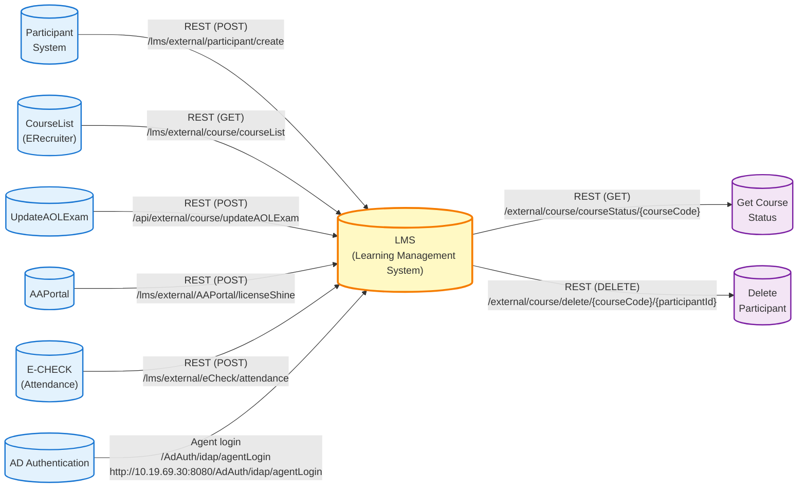

# API Document Specification

## Project Information

**Project:** LEARNING MANAGEMENT SYSTEM (LMS)

**Document Type:** API Document Specification

---

## Document History

| Version | Date Approved | Description |
|---------|---------------|-------------|
| 1.0.0 | {DD/MM/YYYY} | API (Integration with LMS): Course List (ERecruiter), AOL Exam, AA Portal, Participant, Course Status, Delete Participant from Course |
| 1.1.0 | 06/10/2022 | Update: API Participant, License codes, Rule for null and empty string, AAPortal API, License codes |
| 2.0.0 | - | - |

---

## Document Review and Approval

| Function/Department | Reviewed and Agreed By | Approved By |
|---------------------|------------------------|-------------|
| Project Owner | {Name/Signature/Date} | {Name/Signature/Date} |
| Stakeholders | {Name/Signature/Date} | {Name/Signature/Date} |

---

## TABLE OF CONTENTS

1. [ECOSYSTEM OVERVIEW](#1-ecosystem-overview)
2. [TECHNICAL DESCRIPTION](#2-technical-description)
   - 2.1 [System Context Diagram](#21-system-context-diagram)
   - 2.2 [Integration Overview](#22-integration-overview)
   - 2.3 [Participant API](#23-participant-api)
     - 2.3.1 [Request Parameters](#231-request-parameters)
     - 2.3.2 [Nested Objects](#232-nested-objects)
     - 2.3.3 [Response](#233-response)
     - 2.3.4 [Validation Rules](#234-validation-rules)
     - 2.3.5 [Business Rules and Processing Logic](#235-business-rules-and-processing-logic)
     - 2.3.6 [Error Handling](#236-error-handling)
   - 2.4 [Attendance API](#24-attendance-api)
   - 2.5 [CourseList API (ERecruiter)](#25-courselist-api-erecruiter)
   - 2.6 [UpdateAOLExam API](#26-updateaolexam-api)
   - 2.7 [AAPortal API](#27-aaportal-api)
   - 2.8 [Course Status API](#28-course-status-api)
   - 2.9 [Delete Participant from Course API](#29-delete-participant-from-course-api)

---

## 1. ECOSYSTEM OVERVIEW

This document describes how to integrate HTTP Methods between FWD systems and Learning Management System (LMS).

The parameters and URL names in the document are those of the Test environment.

---

## 2. TECHNICAL DESCRIPTION

### 2.1 System Context Diagram

The following diagram illustrates the integration between LMS and external systems:

### 2.2 Integration Overview

**Inbound APIs (External Systems → LMS):**

| System | Endpoint | Method | Purpose |
|--------|----------|--------|---------|
| Participant System | `/lms/external/participant/create` | POST | Create and assign participant to course |
| CourseList (ERecruiter) | `/lms/external/course/courseList` | GET | Get confirmed course list |
| UpdateAOLExam | `/api/external/course/updateAOLExam` | POST | Update AOL exam results |
| AAPortal | `/lms/external/AAPortal/licenseShine` | POST | Update license and SHINE code |
| E-CHECK (Attendance) | `/lms/external/eCheck/attendance` | POST | Attendance check sync |
| AD Authentication | `/AdAuth/idap/agentLogin` | POST | Agent login authentication |

**Outbound APIs (LMS → External Systems):**

| Endpoint | Method | Purpose |
|----------|--------|---------|
| `/external/course/courseStatus/{courseCode}` | GET | Get course status by course code |
| `/external/course/delete/{courseCode}/{participantId}` | DELETE | Delete participant from course |

---

### 2.3 Participant API

**Purpose:** Create and assign participant to course

**Method:** HTTP-POST

**URL:** `https://{domain:port}/lms/external/participant/create`

**Note:** When calling participant API to update participant:
- **Empty string:** Update the field data to be empty
- **Null string:** Do not update the field data

##### Request Parameters

| Key | Required | Data Type | Length | Description |
|-----|----------|-----------|--------|-------------|
| **Basic Information** |
| accountName | No | String | - | - |
| accountNumber | No | String | - | - |
| genderCode | No | String | - | - |
| gender | No | String | - | - |
| middleName | No | String | - | - |
| mobilePhone | Yes | String | - | - |
| email | Yes | String | - | - |
| lastName | No | String | - | - |
| firstName | No | String | - | - |
| fullName | Yes | String | - | - |
| birthPlace | Yes | String | - | - |
| birthday | No | Date | - | - |
| terDate | No | Date | - | - |
| **Bank Information** |
| bankBranchCode | No | String | - | - |
| bankCode | No | String | - | - |
| bank | No | String | - | - |
| bankBranch | No | String | - | - |
| **Identification** |
| idNumber | Yes | String | - | ID number |
| idType | No | String | - | - |
| idTypeCode | No | String | - | - |
| oldIdNumber | No | String | - | The old ID number for LMS to determine if there is a new update |
| issueDate | Yes | Date | - | - |
| issuePlace | Yes | String | - | - |
| **Personal Details** |
| religionCode | No | String | - | - |
| taxCode | No | String | - | - |
| educationCode | No | String | - | - |
| education | No | String | - | - |
| maritalStatusCode | No | String | - | - |
| maritalStatus | No | String | - | - |
| nationality | No | String | - | - |
| nationalityCode | No | String | - | - |
| religion | No | String | - | - |
| **Work Information** |
| channel | No | String | - | Value in list: "CA; Banca_FSC; Agency; Banker" |
| leaderCode | No | String | - | - |
| leaderName | No | String | - | - |
| leaderTitle | No | String | - | - |
| title | No | String | - | - |
| agentCode | No | String | - | - |
| agentCodeIssueDate | No | Date | - | - |
| courseCode | Yes | String | - | Reject if wrong course code |
| adName | No | String | - | - |

##### Nested Objects

**participantReferences** (List)

| Key | Data Type | Description |
|-----|-----------|-------------|
| fullName | String | - |
| position | String | - |
| relationship | String | - |

**participantRegistration** (Object)

| Key | Data Type | Description |
|-----|-----------|-------------|
| applicationNo | String | - |
| approverCode | String | - |
| dateOfIssue | Date | - |
| introducerCode | String | - |
| introducerName | String | - |
| lastUpdateDate | Date | - |
| occupationCode | String | - |
| passionQuestion | String | - |
| positionCode | String | - |
| projectCode | String | - |
| projectName | String | - |
| recruiterCode | String | - |
| recruiterName | String | - |
| refNo | String | - |
| reporterCode | String | - |
| reporterName | String | - |
| status | String | - |
| submissionDate | Date | - |
| type | String | - |
| occupation | String | - |
| approverName | String | - |
| approverDate | Date | - |
| locationCode | String | - |
| locationName | String | - |
| clazzCode | String | - |
| clazzName | String | - |
| skipExam | Number | - |

**participantRelationships** (List)

| Key | Data Type | Description |
|-----|-----------|-------------|
| accommodation | String | - |
| dateOfBirth | Date | - |
| fullName | String | - |
| jobTitle | String | - |
| relationship | String | - |
| phone | String | - |
| relationship1 | String | - |

**participantWorkingExperiences** (List)

| Key | Data Type | Description |
|-----|-----------|-------------|
| description | String | - |
| expYears | String | - |
| majorCode | String | - |
| major | String | - |

**homeAddress** (Object)

| Key | Data Type | Description |
|-----|-----------|-------------|
| addressLine1 | String | - |
| addressLine2 | String | - |
| addressLine3 | String | - |
| city | String | - |
| cityCode | String | - |
| district | String | - |
| districtCode | String | - |

**businessAddress** (Object)

| Key | Data Type | Description |
|-----|-----------|-------------|
| addressLine1 | String | - |
| addressLine2 | String | - |
| addressLine3 | String | - |
| city | String | - |
| cityCode | String | - |
| district | String | - |
| districtCode | String | - |

**licenseCodes** (Object)

| Key | Data Type | Description |
|-----|-----------|-------------|
| typeUpdate | String | Replace all the existing license code of the participant once this API is called to input the new list license code |
| licenseCode | String | - |
| licenseName | String | - |
| effectiveDate | Date | - |

**participantSupportDocument** (Object)

| Key | Data Type | Description |
|-----|-----------|-------------|
| passport | String | - |
| image | String | - |
| applicationResignation | String | - |
| electronicSignature | String | - |
| proofOfResidence | String | - |
| otherDocument | String | - |

##### Response

| Key | Data Type | Description |
|-----|-----------|-------------|
| result | String | "Success" or "Error" |
| errorMessage | String | Error message |
| data | Object | Default is NULL |
| footer | Object | Default is NULL |

##### Validation Rules

**Field-Level Validations:**

| Field | Validation Rule | Error Message |
|-------|----------------|---------------|
| fullName | Required, Max 100 characters, letters and spaces only | "Full name is required" / "Name must contain only letters and spaces" / "Name must not exceed 100 characters" |
| email | Required, Valid email format | "Email is required" / "Invalid email format" |
| mobilePhone | Required, 10 digits, starts with 0 | "Mobile phone is required" / "Invalid phone number format (must be 10 digits starting with 0)" |
| idNumber | Required, 9 or 12 digits, unique | "ID number is required" / "ID number must be 9 or 12 digits" / "ID number already exists" |
| issueDate | Required, Cannot be future date | "Issue date is required" / "Issue date cannot be in the future" |
| issuePlace | Required | "Issue place is required" |
| birthPlace | Required | "Birth place is required" |
| birthday | If provided, Age >= 18 years | "Participant must be at least 18 years old" |
| courseCode | Required, Must exist and be in valid status | "Course code is required" / "Course code does not exist" / "Course is not in valid status for enrollment" |
| accountNumber | If provided, Numeric only | "Account number must contain only numbers" |
| terDate | If provided, Must be after agentCodeIssueDate (if exists) | "Termination date must be after appointment date" |
| channel | If provided, Must be in list: "CA", "Banca_FSC", "Agency", "Banker" | "Invalid channel value. Must be one of: CA, Banca_FSC, Agency, Banker" |

**Business Logic Validations:**

1. **ID Number Uniqueness Check:**
   - System checks if `idNumber` already exists in database
   - If exists and `oldIdNumber` is provided, system compares to detect ID number updates
   - If `idNumber` exists and matches existing participant → Update operation
   - If `idNumber` exists but belongs to different participant → Return error: "ID number already exists"

2. **Participant Existence Check:**
   - If participant exists (by `idNumber`): Update all provided fields
   - If participant does not exist: Create new participant record
   - If `oldIdNumber` is provided: System uses it to match existing participant for ID number change scenarios

3. **Course Assignment Validation:**
   - `courseCode` must exist in system
   - Course status must be valid for enrollment (typically APPROVED or IN_PROGRESS)
   - Participant cannot be enrolled in same course twice (duplicate enrollment check)
   - If course assignment fails → Return error, but participant creation/update may still succeed

4. **Email Uniqueness:**
   - Warning logged if email already exists for another participant (but allows update)
   - Does not block API call, but creates audit log entry

5. **Age Validation:**
   - If `birthday` is provided, calculate age
   - Age must be >= 18 years
   - If validation fails → Return error: "Participant must be at least 18 years old"

##### Business Rules and Processing Logic

**Processing Flow:**

1. **Request Validation:**
   - Validate all required fields are present
   - Validate field formats (email, phone, ID number, dates)
   - If validation fails → Return error response immediately

2. **Participant Identification:**
   - Check if participant exists by `idNumber`
   - If `oldIdNumber` is provided, also check for matches with old ID
   - Determine if operation is CREATE or UPDATE

3. **Duplicate Prevention:**
   - For new participants: Check `idNumber` uniqueness
   - If duplicate found → Return error: "ID number already exists"
   - For updates: Allow if `idNumber` matches existing participant

4. **Participant Creation/Update:**
   - **New Participant:** Create new record with all provided fields
   - **Existing Participant:** Update all provided fields (empty string = clear field, null = keep existing)
   - Set default status to "Inactive" if not provided
   - Auto-populate derived fields (e.g., genderCode from gender)

5. **Course Assignment:**
   - Validate `courseCode` exists in system
   - Validate course status allows enrollment
   - Check if participant already enrolled in this course
   - If all validations pass → Assign participant to course
   - If course assignment fails → Log error but do not fail entire API call (participant still created/updated)

6. **Response Generation:**
   - If all operations succeed → Return success response
   - If any critical operation fails → Return error response with detailed message

**Update Behavior:**

- **Empty String ("")**: Field value is updated to empty/null
- **Null String (null)**: Field value is not updated (keeps existing value)
- **Provided Value**: Field is updated to new value
- **Nested Objects**: If provided, replaces entire nested object; if null, keeps existing

**Data Source Priority:**

- API data takes precedence over manual UI entry
- If participant exists and API updates fields, UI manual changes are overwritten
- Last API update timestamp is recorded for audit purposes

##### Error Handling

**Error Scenarios and Messages:**

| Error Scenario | Error Message | HTTP Status |
|----------------|---------------|-------------|
| Missing required field | "[Field Name] is required" | 400 Bad Request |
| Invalid field format | "Invalid [field] format: [details]" | 400 Bad Request |
| Duplicate ID number | "ID number already exists" | 409 Conflict |
| Invalid course code | "Course code does not exist" | 400 Bad Request |
| Course not available | "Course is not in valid status for enrollment" | 400 Bad Request |
| Duplicate enrollment | "Participant is already enrolled in this course" | 409 Conflict |
| Age validation failed | "Participant must be at least 18 years old" | 400 Bad Request |
| Invalid date format | "Invalid date format for [field]. Expected format: yyyy-MM-dd" | 400 Bad Request |
| Invalid channel value | "Invalid channel value. Must be one of: CA, Banca_FSC, Agency, Banker" | 400 Bad Request |
| Server error | "Internal server error. Please contact support." | 500 Internal Server Error |

**Error Response Requirements:**

Response must include:
- Operation result status (indicating error)
- Detailed error message describing what went wrong
- Error details (optional, for troubleshooting)

**Success Response Requirements:**

Response must include:
- Operation result status (indicating success)
- Participant identifier (unique ID to identify the created/updated participant)
- Participant ID number (for verification)
- Course assignment information (course code participant was assigned to, if applicable)
- Enrollment status (whether participant was successfully enrolled in the course)

---

### 2.4 Attendance API

**Purpose:** Post the attendance record to each participant in course

**Method:** HTTP-POST

**URL:** `https://{domain:port}/lms/external/attendance/sync`

#### Request Parameters

| Key | Required | Data Type | Description |
|-----|----------|-----------|-------------|
| participantIdNumber | Yes | String | - |
| courseCode | Yes | String | Example: "courseCode": "90-HCMAG-Shine" |
| stageNumber | Yes | Number | Example: Update attendance check for stage 1 then enter: "stageNumber": 1 |
| dateScan | Yes | Date | Format: yyyy-mm-dd hh:mm:ss |
| note | No | String | - |

#### Response

| Key | Data Type | Description |
|-----|-----------|-------------|
| result | String | "Success" or "Error" |
| errorMessage | String | Error message |
| data | Object | Default is NULL |
| footer | Object | Default is NULL |

---

### 2.5 CourseList API (ERecruiter)

**Purpose:** Get lists of Courses by Date

**Method:** HTTP-GET

**URL:** `https://{domain:port}/lms/external/course/courseList?{date}`

#### Request Parameters

| Key | Required | Data Type | Description |
|-----|----------|-----------|-------------|
| date | No | Date | Format: (yyyy-MM-dd). Return list of SHINE courses with status APPROVED since the entered date |

#### Response

| Key | Data Type | Description |
|-----|-----------|-------------|
| result | String | "Success" or "Error" |
| errorMessage | String | Error message |
| data | List | List of course objects |
| footer | Object | Default is NULL |

**Data Object Fields:**

| Key | Data Type | Description |
|-----|-----------|-------------|
| courseCode | String | - |
| name | String | - |
| description | String | - |
| startTime | Date | - |
| endTime | Date | - |
| region | String | - |
| courseType | String | Value in list: "Shine; Skill; Product" |
| channel | String | Value in list: "CA; Banca; Agency; Banker" |

**Venue Object:**

| Key | Data Type | Description |
|-----|-----------|-------------|
| address | String | - |
| districtCode | String | - |
| cityCode | String | - |
| district | String | - |
| city | String | - |
| ward | String | - |
| wardCode | String | - |

---

### 2.6 UpdateAOLExam API

**Purpose:** Update AOL Exam Result

**Method:** HTTP-POST

**URL:** `https://{domain:port}/api/external/course/updateAOLExam`

#### Request Parameters

| Key | Required | Data Type | Description |
|-----|----------|-----------|-------------|
| examCode | Yes | String | - |
| idNumber | Yes | String | - |
| examName | Yes | String | - |
| beginningDate | Yes | Date | - |
| endingDate | No | Date | - |
| data | Yes | List | List of exam results |

**Data Object Fields:**

| Key | Data Type | Description |
|-----|-----------|-------------|
| examName | String | - |
| score | Number | - |
| ratio | Number | - |
| status | String | - |
| dateFinished | Date | - |

#### Response

| Key | Data Type | Description |
|-----|-----------|-------------|
| result | String | "Success" or "Error" |
| errorMessage | String | Error message |
| data | Object | Default is NULL |
| footer | Object | Default is NULL |

---

### 2.7 AAPortal API

**Purpose:** Grant agent code, license codes, and SHINE code to participants

**Method:** HTTP-POST

**URL:** `https://{domain:port}/lms/external/AAPortal/licenseShine`

#### Request Parameters

| Key | Required | Data Type | Description |
|-----|----------|-----------|-------------|
| request | Yes | List | List of certification requests (array of request objects) |

**Request Object Fields:**

| Key | Required | Data Type | Description |
|-----|----------|-----------|-------------|
| idNumber | Yes | String | Participant ID number |
| courseCode | Yes | String | Course code associated with the certification |
| shineCode | Yes | String | Agent code (also referred to as SHINE code) |
| licenseCodes | No | Array | List of license codes to assign to participant. If provided, replaces all existing license codes for the participant |
| effectiveDate | Yes | Date | Effective date for the codes. Format: yyyy-mm-dd |

**licenseCodes Array Item Fields:**

| Key | Data Type | Description |
|-----|-----------|-------------|
| licenseCode | String | License code value |
| licenseName | String | License name/description |
| effectiveDate | String | Effective date for the license code. Format: yyyy-mm-dd |

#### Response

| Key | Data Type | Description |
|-----|-----------|-------------|
| result | String | "Success" or "Error" |
| errorMessage | String | Error message |
| data | Object | Default is NULL |
| footer | Object | Default is NULL |

---

### 2.8 Course Status API

**Purpose:** Get status of Course by CourseCode

**Method:** HTTP-GET

**URL:** `https://{domain:port}/external/course/courseStatus/{courseCode}`

#### Request Parameters

| Key | Required | Data Type | Description |
|-----|----------|-----------|-------------|
| courseCode | Yes | String | - |

#### Response

| Key | Data Type | Description |
|-----|-----------|-------------|
| result | String | "Success" or "Error" |
| errorMessage | String | Error message |
| data | Object | Course status object |
| footer | Object | Default is NULL |

**Data Object Fields:**

| Key | Data Type | Description |
|-----|-----------|-------------|
| id | Number | - |
| courseCode | String | - |
| courseName | String | - |
| status | String | Value in list: "NEW; REGISTERED; APPROVED; CANCEL; IN_PROGRESS; DELETE; WAITING_CANCEL; WAITING_DELETE; FINISH; WAITING_EDIT" |
| channel | String | Value in list: "CA; Banca_FSC; Agency; Banker" |
| courseType | String | Value in list: "Shine; Skill; Product" |
| licenseType | String | - |
| startTime | Date | - |
| endTime | Date | - |

---

### 2.9 Delete Participant from Course API

**Purpose:** Delete Participant from Course by CourseCode and ParticipantId

**Method:** HTTP-DELETE

**URL:** `https://{domain:port}/external/course/delete/{courseCode}/{participantId}`

#### Request Parameters

| Key | Required | Data Type | Description |
|-----|----------|-----------|-------------|
| courseCode | Yes | String | - |
| participantId | Yes | Number | - |

#### Response

| Key | Data Type | Description |
|-----|-----------|-------------|
| result | String | "Success" or "Error" |
| errorMessage | String | Error message |
| data | Object | Default is NULL |
| footer | Object | Default is NULL |

---

## End of Document
